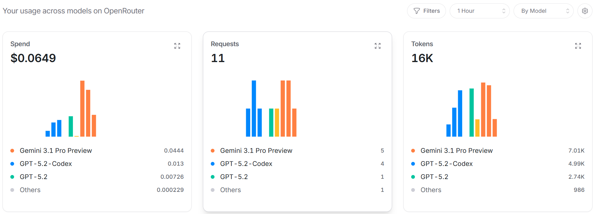

#  aider 使用记录

## I. 安装
 
aider 位于 Python 生态，需要用 `pip` 包管理器安装。
但是 aider 包与所属环境会有依赖关系，因此**最好为其单独创建一个虚拟环境，然后将Scripts/文件夹加入系统环境变量**。这里用 `python -m venv` 为例，也可以使用 `uv` 或者 `conda`
```bash
# 1. 使用全局 python 创建一个名为 D:\aider-env 的虚拟环境
python -m venv D:\aider-env

# 2. 激活虚拟环境（此时命令行提示符前面多了一个 (aider-env)）
D:\aider-env\Scripts\activate

# 3. 升级一下 pip，确保安装顺利
python -m pip install --upgrade pip
# 不放心的话可以指明绝对路径
D:\aider-env\python -m pip install --upgrade pip

# 4. 正式安装 Aider（注意包名是 aider-chat）
pip install aider-chat
```

## II. 使用
首先切换到工作文件夹目录（**必须是 git 仓库**），在当前文件夹目录放置一个`.env`文件，写明 `URL`, `API_KEY` 和 `MODEL` 等环境变量。然后只需要在命令行输入 `aider` 来启动交互式的命令行界面。
`.env`内容如下（这里采用 OpenRouter 提供的 API Key）
```
OPENAI_API_BASE="..."
OPENAI_API_KEY="sk-or-v1-..."
AIDER_MODEL=openai/google/gemini-3.1-pro-preview
AIDER_DARK_MODE="true"
```

之后运行 `aider` 就可以进入交互式的命令行界面了，输入问题后按回车，等待模型回复即可。
> 注意，这里询问模型的版本和名称无法得到准确回答。验证当前所用的究竟是否是这模型，去`OpenRouter` 官网的 `Activity` (活动记录) 页面查看。
> 示例：
> 


## III. 一些其他问题

**Q1. 为什么 `Aider` 对于 `OpenRouter` 的支持比 `Claude Code` 和 `OpenCode` 更好？**
1. 基于 **LiteLLM** 的“翻译官”机制：
   Aider 底层不直接调用 API，而是通过 litellm 这个库。它能把全球 100 多个模型商的奇怪协议，全部标准化为类 OpenAI 的格式。这也就是为什么你可以通过 openai/ 前缀轻松调用任何模型。
2. 不依赖特定模型的“系统提示词”：
   Claude Code 深度依赖 Anthropic 独有的 Thought（思考过程）和特定的工具调用格式。而 Aider 使用的是一套名为 "Search/Replace Blocks"（搜索/替换块）的逻辑。只要模型能理解“找到这段代码，换成那段代码”，Aider 就能用它。
3. 本地文件系统优先：
   它不像有些工具需要运行在 Docker 容器里，也不需要复杂的环境配置。**它就是一个 Python 脚本**，直接读写你当前的硬盘文件，这让它能适配任何编程语言和任何 IDE（VS Code, Cursor, JetBrains 甚至记事本）。


**Q2. Aider 与 Git**

Aider 最强悍的地方在于它对 Git 的深度集成。它认为“AI 写的每一行代码都应该是可追溯的”。
1. 自动 Commit (最爽的功能)
   - 当你让 Aider 修改代码并运行成功后，它会**自动帮你执行 git commit**。
   - Commit Message：它会根据代码改动，**自动写好非常规范的提交信息**（例如：`feat: add login validation logic`）。
   - 安全感：如果 AI 写坏了，你不需要手动去撤销代码，直接在终端输入 `/undo`，它会自动回退到上一个 Git Commit。
2. 仓库地图 (Repository Map)
   - 当你把 Aider 指向一个 Git 仓库时，**它会扫描整个项目结构，生成一个“地图”**。
   - 意义：即使你只给 AI 看了 `A.py`，但由于它有地图，它知道 `A.py` 里的类是在 `B.py` 里定义的。这让它具备了超越单文件的“全局视野”。

## IV. Aider 的实战方法
启动 Aider 后，你会进入一个交互式对话框。这里有两类输入：**普通聊天** 和 **斜杠命令**。
1. **管理上下文（非常关键，省钱秘籍）**
   AI 的额度是按 Token 算的，不要把成百上千个文件全部塞给它。
   - `/add <file>`：把文件加入“编辑区”。只有加入的文件，AI 才有权修改。
   - `/drop <file>`：从编辑区移除。如果某个文件改完了，记得把它踢出去，省 Token。
   - `/ls`：查看当前哪些文件在“编辑区”，哪些在“地图区”。
2. 让 AI 干活
   - 直接对话："把 login 逻辑改为支持手机号登录"。Aider 会自动分析，修改代码，然后展示 Diff（改动差异），最后自动 Commit。
   - 修复错误：如果你的程序报错了，直接把报错信息粘贴给它，或者用 `/run python test.py`。**如果运行报错，Aider 会自动看到报错内容并尝试修复**。
3. 常用斜杠命令总结
   - `/undo`：撤销上一次 AI 的修改和 Commit。
   - `/diff`：查看当前的改动（还没 Commit 的部分）。
   - `/voice`：如果你有配置语音识别，甚至可以跟它说话（极客标配）。
   - `/exit`：退出。
4. Architect 模式
   - 这是 Aider 的“架构师模式”，适合在项目初期使用。它会帮你设计整个项目的文件结构和代码框架，甚至生成一些样板代码。**在这个模式下，Aider 会更注重整体设计，而不是细节实现**。
   - 用法：使用 `/chat-mode architect`，在这种模式下，Aider 会先跟你讨论方案（架构师角色），等方案定下来了，它再切换到编码模式。这比直接改代码的成功率高出非常多。