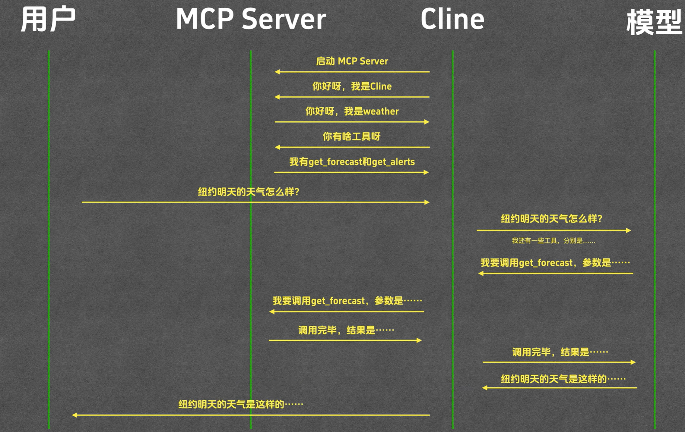

# MCP Server

Model Context Protocol (MCP) 定义了应用程序和 AI 模型之间交换上下文信息的方式。这使得开发者能够以一致的方式将各种数据源、工具和功能连接到 AI 模型（一个中间协议层），就像 USB-C 让不同设备能够通过相同的接口连接一样。

**用户输入，MCP Server, MCP 工具例如Cline 以及大模型的关系示例：**

图片来源：([MCP终极指南 - 从原理到实战，带你深入掌握MCP（基础篇）](https://www.bilibili.com/video/BV1uronYREWR/?share_source=copy_web&vd_source=ce578daf4264f98e28b6447444312fcc))

以下以 VS Code 插件 Cline 为例。

## I. 安装 uv 并配置环境


### 1.1 uv
定义安装目录：
```bash
$env:UV_INSTALL_DIR = D:\uv
```

安装 uv：
```bash
powershell -ExecutionPolicy ByPass -c "irm https://astral.sh/uv/install.ps1 | iex"
```

配置环境变量：
```bash
UV_PYTHON_INSTALL_DIR = D:\uv\python_install
UV_CACHE_DIR = D:\uv\cache
UV_TOOL_DIR = D:\uv\tool
```

### 1.2 为 MCP Server配置独立的虚拟环境
**MCP 服务器应该独立管理自己的依赖**。
1. 在终端中进入 MCP 服务器目录：`cd D:\MCP_Servers\weather`
2. 创建虚拟环境：`uv venv`
3. 激活并安装该服务器需要的依赖（例如：`uv pip install mcp` 等）。
4. `cline_mcp_settings.json"` 中写 command 的执行方式。`uv` 会自动识别并使用 `D:\MCP_Servers\weather\.venv`。

!!! success "MCP Server" 安装指导
    **MCP Server** 统一安装在 `D:\MCP_Servers` 目录下，每个服务器一个子目录，且每个服务器都使用 `uv venv` 创建独立的虚拟环境来管理依赖。


## 2. 使用 Cline 
在 `cline_mcp_settings.json` 中配置 MCP Server 的启动命令：

```json
"fetch": {
      "args": [
        "mcp-server-fetch"
      ],
      "command": "uvx",
      "env": {
        "UV_CACHE_DIR": "D:\\uv\\cache",
        "UV_TOOL_DIR": "D:\\uv\\tools",
        "UV_PYTHON_INSTALL_DIR": "D:\\uv\\python_install"
      }
    }
```

这里必须加上 `env` 字段，否则 Cline 底层仿佛不认识 Windows 系统环境变量，仍然会将工具安装在 C 盘默认路径下。

> 如果 Cline 无法自动安装成功，在命令行中手动执行。
