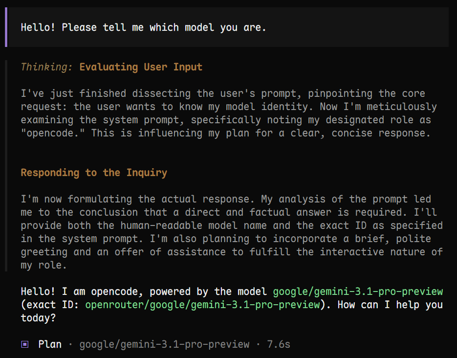
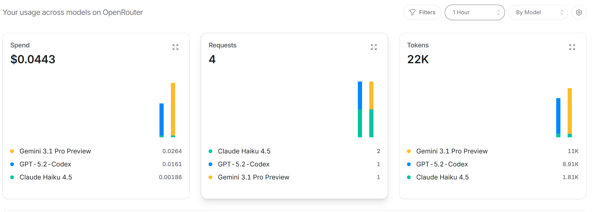

# OpenCode 安装使用方法

## I. OpenCode CLI

安装：
```ps
npm install -g opencode-ai --prefix "D:\OpenCode"
```

升级：
```ps
npm install -g opencode-ai@latest --prefix "D:\OpenCode" 
```

## II. VS Code 插件
在 VS Code 插件市场搜索 `OpenCode` 插件安装即可。
**该插件是一个纯命令行工具**

## III. 将 OpenRouter API Key 接入 OpenCode
在`~/.config/opencode/opencode.json`（没有就创建一个）中写入：
```json
{
  "$schema": "https://opencode.ai/config.json",
  "provider": {
    "openrouter": {
      "options": {
        "apiKey": "sk-or-v1-...",
        "baseURL": "https://api.smlcoke.com/api/v1"
      }
    }
  },
  "model": "openrouter/anthropic/claude-opus-4",
  "small_model": "openrouter/anthropic/claude-haiku-4-5"
}
```

!!! warning "Bug"
    目前在 `OpenCode` 中使用 `OpenRouter` 的 API Key 只能成功调用部分模型，**无法调用最新的几个模型**，即便在`opencode.json`中显示指明也没用：
    ```json
    {
    "$schema": "https://opencode.ai/config.json",
    "provider": {
      "openrouter": {
        "options": {
          "apiKey": "sk-or-v1...",
          "baseURL": "https://api.smlcoke.com/api/v1"
        },
        "models": {
          "anthropic/claude-opus-4": { "name": "Claude Opus 4 (OpenRouter)" },
          // snip
          "openai/GPT-5.2-Codex": { "name": "OpenAI GPT-5.2-Codex (OpenRouter)" },
          "openai/GPT-5.3-Codex": { "name": "OpenAI GPT-5.3-Codex (OpenRouter)" },
          }
        }
      }
    }
      ```
      尝试更新过 `OpenCode` 版本，无用。
      此外，关于`opencode.json`的写法尝试了很久，最终由 `Copilot Claude Sonnet 4.6` 给出正确回答，现在来看还不如直接用 `Copilot`

!!! success "解决"
    2026-03-01 再次尝试，发现问题突然解决了🤔
    在 `opencode.json` 中写入：
    ```json
    "models": {
      "google/gemini-3.1-pro-preview": { "name": "Gemini 3.1 Pro Preview (OpenRouter)" },
    }
    ```
    之后居然调用成功了？
    
    去 OpenRouter Activity 页面查看，发现果真发起了调用，消耗了 tokens：
    