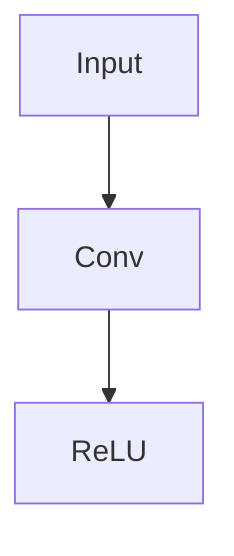
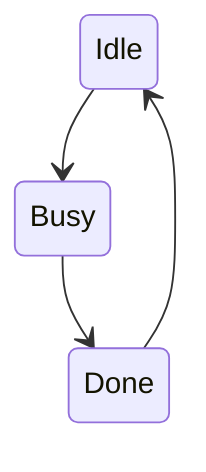
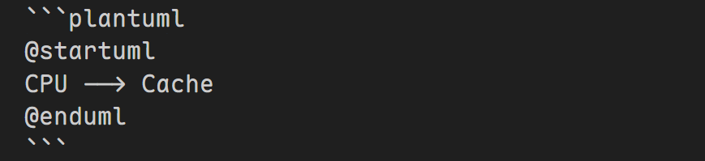

# VS Code + Markdown Preview Enhanced 实用语法速查

> 插件：**Markdown Preview Enhanced**


## 1. 提示块（Admonition）

### 基础用法

```markdown
!!! note
    普通提示
```

常用类型：

```
note
abstract
info
tip
success
question
warning
failure
danger
bug
example
quote
```

示例：

```markdown
!!! warning
    注意时序违例
```


## 2. 折叠块（推荐通用写法）

❌ `???+ note` 不一定支持
✅ 用 HTML（最稳）：

```markdown
<details>
<summary>点击展开</summary>

详细内容

</details>
```

✔ 本地可用
✔ GitHub 可用
**`???+` 语法基于 MkDocs 生态**，适合在个人网站中写这种语法。


## 3. Mermaid 画图（推荐）

### 流程图



### 状态机



✔ 不需要额外安装  
✔ 适合画架构 / FSM / 数据流  


## 4. 任务列表

```markdown
- [ ] 写 AXI
- [x] 完成 FSM
```

## 5. 目录自动生成

```markdown
[TOC]
```


## 9. PlantUML（两种方式）

### 推荐：在线服务器

`setting.json` 设置

```json
"markdown-preview-enhanced.plantumlServer": "https://kroki.io/plantuml/svg/"
```

然后：



### 本地安装

1.  安装 Java 环境
2.  下载 PlantUML JAR 包