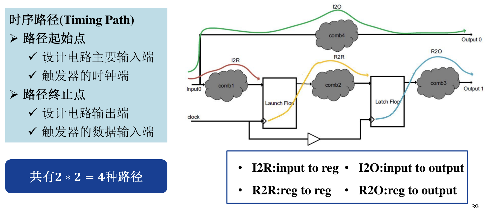

# 数字芯片设计术语表
## 一、基本概念
### 1.1 集成电路工艺节点
传统工艺节点命名：**栅极长度（Gate length）**和**金属半节距（Half-pitch）**，半节距即芯片内部金属线间距离的一半。
在20世纪90年代中期之前，**逻辑技术节点**等同其制造的CMOS晶体管的**栅极长度**，和金属半节距大致相等。
当前行业对半导体技术节点系统的命名方法延续，但与芯片实际的**物理特征之间存在脱节**。

### 1.2 摩尔定律（Moore's Law）
当**价格不变**时，集成电路上可容纳的元器件的**数目**，约每隔 18-24 个月便会增加一倍，**性能**也将提升一倍。换言之，每一美元所能买到的电脑性能，将每隔 18-24 个月翻一倍以上。

### 1.3 其他术语
**MOSFET**： Metal-Oxide-Semiconductor Field-Effect Transistor
**VLSI**：Very Large Scale Intergrated Circuit
**CISC**：复杂指令集
**RISC**：精简指令集
**算例**：对信息数据进行处理的能力，单位为OPS或者FLOPS

## 二、IC设计流程
### 2.1 IC前端

**（1）规格定义**
描述电路整体实现的功能，定义芯片的**功能、主要部件、频率、总线带宽**等，多采用文字、图、表的形式，指定芯片规格Spec。
在嵌入式领域系统级描述语言：SystemC。

**（2）模型设计**
主要包含用于实现模块的**详细算法**，多以C/C++语言实现。

**（3）架构设计**
在满足功能需求的前提下，设计整个系统或模块的**结构组织与资源分配**方案，包括**子模块划分**、数据通路设计、控制策略等。

**（4）RTL设计**
使用HDL编写电路功能模块，表达**寄存器级**的**数据流**或**逻辑行为**，以时钟实现**数据在时序单元**（如寄存器）之间的传递。

**标准单元（Standard Cell）**
数字电路设计的基本单元，由厂家（Foundary）提供，例如：INV, NAND, NOR, XOR, DFF，用于：仿真，综合，静态时序分析，布局布线，功耗分析，一致性检查。由 RTL 电路转换至门级电路，生成门级网表（Netlist）文件。

**（5）前仿真（Pre-simulation）**
在逻辑综合之前进行，以寄存器传输级（RTL）的设计描述为基础，验证设计的**逻辑功能是否符合预期**，但**不考虑门级延迟**等物理实现因素。
又称：功能仿真、逻辑仿真

**Testbench**
针对需要验证的RTL，编写输入激励（RTL代码），验证RTL代码是否符合预期逻辑功能（行为级仿真）。

**（6）逻辑综合（Logic Synthesis）**
由RTL电路转换至门级电路，生成门级网表(Netlist)文件

**网表（Netlist）**
网表是一种**描述电路中逻辑元件之间连接关系**的数据结构，是逻辑综合、物理设计等流程中的中间文件。

**（7）STA：静态时序分析（Static Timing Analysis, STA）**
一种用于验证数字电路设计是否满足时序约束的技术。它通过分析电路中**所有可能的路径延迟**，确保信号能在**预期的时间窗口**内正确传播，从而保证电路的功能正确性和性能。
STA不依赖于输入激励，能够高效地检测时序违例，如建立时间和保持时间的违规，广泛应用于集成电路设计流程中。

**时序路径**
信号从一个时序单元（如触发器或寄存器）出发，经过若干组合逻辑门，最终到达另一个时序单元的传播路径。
（1）路径起始点：① 设计电路的主要输入端 ② 触发器的时钟端
（2）路径终止点：① 设计电路的输出端 ② 触发器的数据输入端

**建立时间(setup time)**
时钟沿到来前数据从不稳定到稳定所需的时间，如果不满足要求，数据将不能在这个时钟上升沿被稳定地读入触发器。
$$T_c + t_{\text{skew}} \geq t_{\text{cq}} + t_{\text{comp}} + t_{\text{setup}}$$
**保持时间(hold time)** 
数据稳定后所需的保持时间，如果不满足要求，数据将不能被稳定地读入触发器。
$$t_{\text{cq}} + t_{\text{comp}} - t_{\text{skew}} \geq t_{\text{hold}}$$

**（8）形式验证（Formal Verification）**
使用纯数学方法分析逻辑是否完全等价，逻辑功能的等效性检查。

### 2.2 IC后端

**（1）DFT：可测性设计（Design For Test, DFT）**
芯片设计阶段插入，为了方便测试，提高可测试性。对于逻辑电路采用扫描链的可测试结构，基本思想是通过**插入扫描链**，增加电路内部节点的可控性和可观测性，以达到提高测试效率的目的。

**（2）布局规划（Floor planning）**
根据面积、连接关系和性能要求，确定芯片中各个逻辑单元（如标准单元、模块、宏单元等）的**位置和布局结构**。

**（3）CTS：时钟树综合（Clock Tree Synthesis, CTS）**
后端物理设计中的一个关键步骤，其目的是将**全芯片的时钟信号**，通过一棵分布良好的树状结构，**精确地传输到所有需要接收时钟的触发器或寄存器单元**，确保它们能够在合理的时钟偏差（skew）范围内同步工作。
**简单来说就是时钟的布线**。

**（4）布线（Routing）**
在布局完成之后，按照设计规则，为所有需要互连的逻辑单元之间**建立实际金属连线**的过程。

**（5）物理验证**
① **ERC：电气规则检查**（Electrical Rule Check, ERC）。
在布局布线过程中进行，检查电路开路、短路、浮置等情况。

② **DRC：设计规则检查**（Design Rule Check, DRC）
在布局布线之后，生产之前进行，检查布局布线中的各个尺寸是否满足要求，包括线的宽度、孔的面积等。

③ **LVS：一致性检查**（Layout vs Schematic, LVS）
在布局布线之后进行，验证最终的物理版图与初始的设计功能是否一致，比较版图和布线后的网表是否功能一致。
> 包括节点所连元器件是否一致，元器件所连节点是否一致以及有误失配元件等检查。大部分的LVS错误时由于手动的版图设计或布局布线中的布线拥塞导致的。由CAD工具实现。

**（6）寄生参数提取（Parasitic Extraction）及后仿真**
在布局布线完成后，分析芯片中**金属连线和器件**周围所产生的**非理想电气特性**（如寄生电阻、电容、电感），并将这些寄生效应模型提取出来，供后续时序分析、信号完整性分析等使用的过程。

**SDF文件**（Standard Delay Format 文件）
SDF 文件是用于传递时序信息的标准文件格式，它在后仿真中起到关键作用。SDF 文件将芯片物理布局布线后的实际时序数据（如门延迟、线延迟、寄生参数等）**反标（Back-annotate）到门级网表**中，使得仿真工具能够基于真实的物理条件进行时序验证。

**静态时序分析（含延迟信息）**
此时电路每个单元位置，电路参数确定，再做静态时序分析是准确的。

**后仿真（Post-simulation）（含延迟信息）**
在逻辑综合或布局布线之后进行，基于**包含门级延迟信息的网表**，验证在实际物理实现中，设计的功能和时序是否仍然正确，确保引入实际时延后系统功能的正确性。
又称：时序仿真

**（7）版图（Layout）**
版图是指将集成电路设计中的各个器件（如晶体管、电阻、电容）以及金属互连等，按照实际物理尺寸和设计规则，以图形方式在硅片上进行空间排列和布置的过程。

**GDSII（Graphic Data System II）**
GDSII 是一种**版图数据格式**，是集成电路（IC）物理设计中用于**描述芯片几何结构的标准文件格式**，是提交晶圆厂制造芯片的最终交付成果。

**（8）流片（Tape-out）**
将芯片设计数据交给半导体工厂制造的过程，是整个芯片设计流程的最后阶段，标志着设计完成、进入物理制造阶段。

**掩膜板（Mask）**
掩膜板是芯片制造中用于光刻步骤的光学模板，上面有设计好的图形，通过光刻工艺将图案转印到硅片上，是芯片量产制造的关键物理工具。

**CDC：跨时钟域（Clock Domain Crossing, CDC）**
跨时钟域指信号在两个不同时钟控制的区域之间传输的情况，由于时钟不同步，可能引发亚稳态或数据丢失，需要采取专门的同步机制。

## 三、FPGA
**FPGA**: Field Programmable Gate Array
**ASIC**: Application Specific Intergrated Circuit
**CLB**: Configurable Logic Block，可配置逻辑块
**PLL**: Phase Locked Loop, 锁相环
**DLL**: Delay Locked Loop, 延迟锁相环
**DSP**: Digital Signal Processor, 数字信号处理
**PLD**: Programmable Logic Device, 可编程逻辑实现方式

**Slice**
FPGA 中用于实现组合逻辑和时序逻辑的**最小可编程单元**，它通常包含若干查找表（LUT）、触发器（FF） 以及其他辅助逻辑（如多路选择器、进位链等）。

**查找表（Look-Up Table, LUT）**
查找表是 FPGA 中用于实现组合逻辑功能的基本结构，它通过将逻辑函数的**真值表存储在存储器**中，根据**输入查地址**，**输出对应结果**。

**锁相环（Phase-Locked Loop, PLL）**
锁相环是一种用于产生**稳定、高速、相位受控时钟信号的电路**，它能将输入时钟放大、分频或移相，以满足系统的时钟需求。

**工艺映射**
将门级网表转化为查找表。

**逻辑打包**
将独立的查找表打包到逻辑块（CLB/LE）。

**IP（Intellectual Property）**
指的是预先设计、验证过的可复用的电路模块或功能单元。这些 IP 核可以被集成到 FPGA 中，用于实现特定的功能，例如处理器核心、通信协议接口、加密算法等。

## 四、逻辑设计方法

**竞争**
不同路径的输入信号传输到同一点门级电路时，在时间上有先有后，存在时间差。

**冒险**
由于竞争的存在。过渡时间内产生瞬间的错误输出（毛刺）。
某输入信号通过两条或两条以上的路径传输到输出端，由于路径延迟不同，到达输出门的时间有先有后，导致输出干扰脉冲的现象。

## 五、存储器

**SDRAM（Synchronous Dynamic RAM）**
同步动态随机存储器，属于 DRAM，SDRAM 时钟和系统时钟同步，比普通 DRAM 速度较快。

**DDR（Double Data Rate SDRAM）**
**双倍数据传输率 SDRAM**，时钟上升沿、下降沿均进行数据传输，数据传输速率为系统时钟的两倍，传输效能比同步动态随机存取内存（SDRAM）好。

**DDR2**
供电电压降低 from 2.5 to 1.8 volts，时钟频率高达 400 MHz。

**DDR3**
电压降低为 1.5 v，时钟频率高达 800 MHz，目前主流市场。

**HBM（High Bandwidth Memory）**
高带宽存储器，是一种基于 3D 堆栈工艺的 DDR，具备高带宽和能效，常被用于高性能计算、网络交换等需要高存储器带宽的应用场合。

**SoC（System on Chip）**
片上系统，将一个完整电子系统的各个主要功能模块，如处理器核心、存储器、接口控制器、通信模块、加速器等，集成在同一块芯片上的设计方式。

**EDA 工具（Electronic Design Automation）**
EDA 工具是指用于辅助电子系统（特别是集成电路）设计与验证的软件工具集合，覆盖从电路设计、仿真、综合、布局布线到时序分析等多个阶段。

**Cache Memory（高速缓存）**
由于 CPU 的运行速度通常比主存储器（内存）快，高速缓存的目的是适应 CPU 的读取速度，将经常要用到的数据存入 Cache，通常由 SRAM+相关逻辑组成。如 Intel 的 Pentium 处理器分别在片上集成了指令高速缓存和数据高速缓存。

**Flash Memory（闪存）**
非易失存储器，目前在可在线可改写的非挥发性存储器中容量最大的存储器。支持在线修改数据，写数据的速度比 EEPROM 提高 1 个数量级。Flash 应用于大容量的数据和程序存储。

**SSD（Solid State Disk）**
固态硬盘：以 Nand-Flash、DRAM 等作为存储介质的硬盘。

**HDD（Hard Disk Drive）**
机械硬盘：机械硬盘即是传统普通硬盘，磁存储介质，主要由盘片，磁头，盘片转轴及控制电机，磁头控制器，数据转换器，接口，缓存等几个部分组成。

**EPROM（Erasable Programmable Read-Only Memory）**
紫外擦除只读存储器，非挥发性存储器。不需上电维持内容，适合用作硬件当中的基本输出入系统（BIOS）。允许使用者以紫外线消除其中的程序重复使用，不支持在线修改。

**EEPROM（Electrically Erasable Programmable Read-Only Memory）**
电子抹除式只读存储器，非挥发性存储器。电源撤除后，储存的信息依然存在，在特殊管脚上施加电压可擦除内部数据。典型应用于如电视机、空调中，存储用户设置的参数。

**ROM（Read Only Memory）**
只读存储器，内容不改变，多用来储存特定功能的程序或系统程序。