# 第二章 指令：计算机的语言 RISC-V

## 一、计算机系统层级与ISA核心概念
### 1.1 计算机系统全层级
从上层应用到底层硬件的完整层级如下，**ISA是软硬件的核心分界层**：
```
应用(问题) → 算法 → 编程语言 → 操作系统/虚拟机 → 指令集体系结构(ISA) → 微体系结构 → 功能部件 → 器件/电路
```
- 上层：程序员面向编程语言、操作系统开发
- 中层：架构师基于ISA设计微体系结构
- 底层：电子工程师实现电路与器件

### 1.2 ISA核心定义
**指令集体系结构(ISA)是计算机支持的指令集合，是软硬件之间的标准接口**：
- 不同计算机的指令集存在差异，但核心设计有大量共性
- 早期计算机与现代RISC架构均采用简单指令集，简化硬件实现
- RISC-V是本课程的核心示例ISA，为免费开源的标准化ISA，由RISC-V基金会维护

---

## 二、RISC-V ISA概述
RISC-V指令固定编码为32位指令字，采用少量规整的指令格式，核心特性是**规整性**。分为基础整数指令集和可选扩展指令集。

### 2.1 基础整数指令集
| 指令集 | 描述 | 版本 | 状态 |
|--------|------|------|------|
| RV32I | 32bit 基础整数指令 | 2.1 | 批准 |
| RV32E | 32bit 嵌入式精简指令 | 1.9 | 批准 |
| RV64I | 64bit 基础整数指令 | 2.1 | 批准 |
| RV128I | 128bit 基础整数指令 | 1.7 | 批准 |

### 2.2 标准扩展指令集
| 扩展代号 | 描述 | 版本 | 状态 |
|----------|------|------|------|
| M | 乘除法指令扩展 | 2.0 | 批准 |
| A | 原子指令扩展 | 2.1 | 批准 |
| F | 单精度浮点指令扩展 | 2.2 | 批准 |
| D | 双精度浮点指令扩展 | 2.2 | 批准 |
| Zicsr | 控制和状态寄存器指令 | 2.0 | 批准 |
| Zifence | Fence 内存屏障指令扩展 | 2.0 | 批准 |
| C | 压缩指令扩展 | 2.0 | 批准 |
| H | 虚拟化指令扩展 | 1.0 | 批准 |
| B | 比特操作指令扩展 | 1.0 | 开放 |
| P | SIMD 指令扩展 | 0.2 | 开放 |
| K | 加解密指令扩展 | 1.0 | 开放 |
| V | 向量指令扩展 | 1.0 | 开放 |

> 通用组合：`RV32IMAFD` 称为**G通用组合**，是最常用的基础配置。

---

## 三、RISC-V四大核心设计原则
这是RISC-V架构设计的核心思想，贯穿整个指令集规范：
1.  **Simplicity favors regularity（简洁源于规整性）**
    所有算术操作采用统一的三操作数格式（2源1目的），规整的指令格式大幅简化硬件解码与实现，以低成本实现更高性能。
2.  **Smaller is faster（越小越快）**
    **采用32个32位的寄存器文件**，容量远小于主存，但访问延迟远低于内存，高频访问数据优先放入寄存器，是性能优化的核心手段。
3.  **Make the common case fast（让常见场景更快）**
    程序中小常数的使用非常普遍，**指令内置立即数操作数，避免额外的内存load指令**，大幅提升常用操作的执行效率。
4.  **Good design demands good compromises（优秀的设计需要合理的折中）**
    多指令格式虽增加了解码复杂度，但**保证了所有指令统一32位固定长度**，且各格式的核心字段位置尽可能对齐，平衡了编程灵活性与硬件实现难度。

---

## 四、算术操作与操作数体系
### 4.1 算术操作基础
RISC-V所有算术指令采用**三操作数格式**，固定为「**2个源操作数 + 1个目的操作数**」，格式如下：
```riscv
add a, b, c   # 语义：a = b + c
```

**示例：C代码编译为RISC-V汇编**
C代码：
```cpp
f = (g + h) - (i + j);
```
编译后的RISC-V汇编：
```risc
add t0, g, h   # 临时寄存器t0 = g + h
add t1, i, j   # 临时寄存器t1 = i + j
sub f, t0, t1  # f = t0 - t1
```

### 4.2 寄存器操作数
寄存器是CPU中最快的存储单元，是算术指令的核心操作数：
- RV32I包含**32个32位通用寄存器**，编号x0$\sim$x31，32位数据称为1个**字（word）**
- 核心特性：**x0寄存器硬编码为常数0，无法被改写**，是简化指令设计的关键
- 汇编规范：x0$\sim$x31为寄存器编号，也可使用ABI别名（如t0$\sim$t6为临时寄存器，s0$\sim$s11为保存寄存器）

**寄存器操作示例**
已知f$\sim$j分别对应寄存器x19$\sim$x23，上述C代码的精确汇编：
```riscv
add x5, x20, x21   # x5 = g + h
add x6, x22, x23   # x6 = i + j
sub x19, x5, x6    # x19(f) = x5 - x6
```

### 4.3 内存操作数
主存用于存储数组、结构体、动态数据等复合数据，算术操作无法直接作用于内存，必须遵循「先加载到寄存器，运算后写回内存」的规则。

#### 核心特性
- 内存按**字节编址**：每个地址对应1个8位字节
- 字对齐约束：**32位字的地址必须是4的倍数，非对齐访问会触发地址错误异常**
- 字节序：RV32I默认采用**小端序（Little Endian）**，即**最低有效字节存放在最低地址**

#### 核心内存指令
RISC-V 只提供两类指令与内存交互：`Load`指令从内存加载数据到寄存器，`Store`指令将寄存器数据存储到内存：

| 指令 | 全称 | 语义 |
|------|------|------|
| `lw` | Load Word | 从内存加载32位字到寄存器 |
| `sw` | Store Word | 将寄存器的32位字存储到内存 |

#### 内存操作示例
**示例1：数组读取**
C代码：
```cpp
g = h + A[8];
// g对应x20，h对应x21，数组A的基地址对应x22
```
编译后的汇编：
```riscv
lw x9, 32(x22)    # 计算地址：x22 + 32（4字节/字 × 下标8），加载A[8]到x9
add x20, x21, x9  # g = h + A[8]
```

**示例2：数组写入**
C代码：
```cpp
A[12] = h + A[8];
// h对应x21，数组A的基地址对应x22
```
编译后的汇编：
```riscv
lw x9, 32(x22)    # 加载A[8]到x9
add x9, x21, x9   # x9 = h + A[8]
sw x9, 48(x22)    # 将x9写入A[12]，地址偏移48=4×12
```

!!! note "Memory 与 Register"
    Compiler must **use registers for variables as much as possible**
    - Only spill to memory for less frequently used variables
    - Register optimization is important!
    一般来叔，我们尽量多使用寄存器操作，减少内存的访问。

### 4.4 内存对齐规则
RISC-V对不同位宽的内存访问有严格的对齐要求，非对齐访问会触发异常：

| 访问位宽 | 对齐要求 | 合法地址特征 |
|----------|----------|--------------|
| 1字节（Byte） | 无限制 | 任意地址均对齐 |
| 2字节（Half Word） | 2字节对齐 | 地址最低1位为0 |
| 4字节（Word） | 4字节对齐 | 地址最低2位为0 |
| 8字节（Double Word） | 8字节对齐 | 地址最低3位为0 |

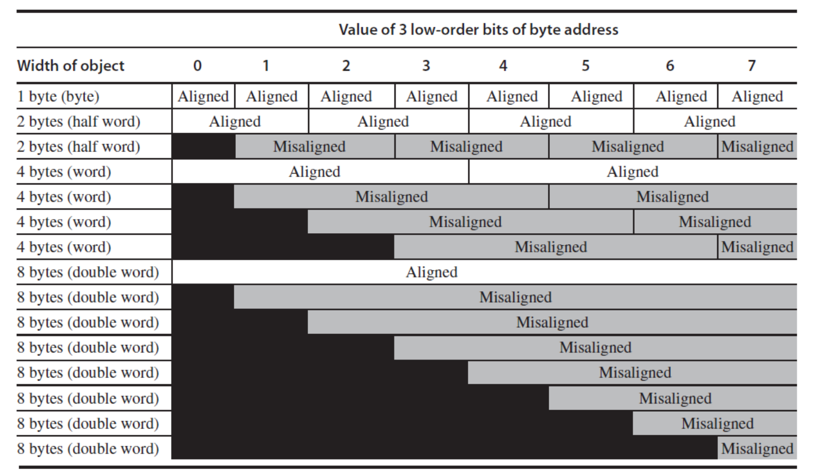

### 4.5 大小端序详解

| 类型 | 定义 | 典型架构 |
|------|------|----------|
| 大端序（Big Endian） | 最高有效字节（MSB）存放在最低地址 | Motorola 68000、PowerPC、SPARC V9前 |
| 小端序（Little Endian） | 最低有效字节（LSB）存放在最低地址 | x86、RISC-V、6502 |
| 双端序（Bi-endian） | 支持大小端切换 | ARM、PowerPC、SPARC V9 |

**示例**：32位数`0xOAOBOCOD`的内存存储
- 大端序：地址a存0xOA，a+1存0xOB，a+2存0xOC，a+3存0xOD
- 小端序：地址a存0xOD，a+1存0xOC，a+2存0xOB，a+3存0xOA

### 4.6 立即数与零操作数
- 立即数算术指令：`addi`，直接在指令中嵌入常数，无需额外内存加载，示例：
  ```riscv
  addi x22, x22, 4   # x22 = x22 + 4
  addi x22, x22, -1  # 无专用减法立即数指令，用负数立即数实现减法
  ```
- x0寄存器的妙用：实现寄存器间数据移动，无需专用mov指令
  ```riscv
  add x2, x1, x0  # x2 = x1 + 0 = x1，等价于mov x2, x1
  ```

### 4.7 符号扩展
符号扩展是用更多比特表示数字，同时保持数值不变的规则：
- 有符号数：**复制符号位到高位**
- 无符号数：高位补0
- 示例：8位数扩展为16位数
  - +2：`0000 0010` → `0000 0000 0000 0010`
  - -2：`1111 1110` → `1111 1111 1111 1110`
- RISC-V应用：`addi`、`lb/lh`、`beq/bne`等指令均会自动执行符号扩展

---

## 五、RISC-V 32位指令编码格式
RISC-V所有指令均为**32位固定长度**，分为6大核心格式，各格式的核心寄存器字段位置高度对齐，简化硬件解码。

### 5.1 六大指令格式总览

| 格式 | 全称 | 核心用途 |
|------|------|----------|
| R-type | Register-Register | 寄存器间算术、逻辑、移位操作 |
| I-type | Immediate | 立即数算术、内存加载、寄存器间接跳转 |
| S-type | Store | 内存存储操作 |
| SB-type | Branch | 条件分支操作 |
| U-type | Upper Immediate | 高位立即数加载，构建32位常数 |
| UJ-type | Jump | 无条件跳转操作 |

### 5.2 各格式详细字段定义
所有格式均为32位，字段从高位（bit31）到低位（bit0）排列，核心字段说明：
- `opcode`：7位操作码，区分指令大类
- `rs1/rs2`：5位源寄存器编号，支持0$\sim$31
- `rd`：5位目的寄存器编号
- `funct3/funct7`：扩展操作码，区分同opcode下的不同指令
- `immediate`：立即数字段，不同格式拆分方式不同

#### 5.2.1 R-type（寄存器-寄存器型）
**字段结构**：

| funct7 | rs2 | rs1 | funct3 | rd | opcode |
|--------|-----|-----|--------|----|--------|
| 7位    | 5位 | 5位 | 3位    | 5位| 7位    |

- 固定opcode：`0110011`
- 核心指令：`add/sub/sll/srl/sra/or/and/xor`
- 编码示例：`add x9, x20, x21`
  二进制：`0000000 10101 10100 000 01001 0110011`
  十六进制：`0x015A04B3`

#### 5.2.2 I-type（立即数/加载型）
**字段结构**：

| immediate[11:0] | rs1 | funct3 | rd | opcode |
|------------------|-----|--------|----|--------|
| 12位             | 5位 | 3位    | 5位| 7位    |

- 核心opcode：
  - 立即数**算术**：`0010011`（`addi/xori/ori/andi`等）
  - **内存加载**：`0000011`（`lw/lb/lh`等）
  - **寄存器跳转**：`1100111`（`jalr`）
- 特点：**12位有符号立即数**，支持符号扩展，12位有符号立即数范围为$-2048\sim 2047$

其他指令编码格式见：[附录](./appendix.md)

---

## 六、逻辑与移位操作
### 6.1 位操作指令映射
| 操作 | C语言 | Java | RISC-V指令 |
|------|-------|------|------------|
| 逻辑左移 | << | << | `sll`, `slli` |
| 逻辑右移 | >> | >>> | `srl`, `srli` |
| 算术右移 | >> | 无 | `sra`, `srai` |
| 按位与 | & | & | `and`, `andi` |
| 按位或 | \| | \| | `or`, `ori` |
| 按位异或 | ^ | ^ | `xor`, `xori` |
| 按位非 | $\sim$ | $\sim$ | `xori rd, rs1, -1` |

### 6.2 核心位操作用途
- **移位操作**：`sll`左移i位等价于乘以$2^i$；
- **AND操作**：掩码操作，提取指定位、清除其他位为0
- **OR操作**：置位操作，将指定位设为1
- **XOR操作**：翻转指定位，实现按位非

---

## 七、控制流：分支与跳转
控制流是计算机区别于计算器的核心能力，**通过修改程序计数器（PC）实现分支、循环、函数调用等逻辑**。PC保存当前正在执行指令的地址，**正常执行时自增4**，仅分支/跳转指令可修改。

!!! note "PC"
    PC（Program Counter），程序计数器，是 CPU 内部一个极其特殊且核心的寄存器。它里面存放的是当前正在执行（或即将抓取）的**那条指令在内存中的物理地址**。

### 7.1 核心控制流指令
| 指令类型 | 指令 | 语义 |
|----------|------|------|
| 条件分支 | `beq rs1, rs2, label` | 若rs1 == rs2，跳转到label |
| 条件分支 | `bne rs1, rs2, label` | 若rs1 != rs2，跳转到label |
| 条件分支 | `blt rs1, rs2, label` | 若rs1 < rs2（有符号），跳转到label |
| 条件分支 | `bge rs1, rs2, label` | 若rs1 >= rs2（有符号），跳转到label |
| 条件分支 | `bltu/bgeu` | 无符号比较分支 |

### 7.2 案例：`if-else`语句编译
**C代码**：
```cpp
if (i == j)
    f = g + h;
else
    f = g - h;
// f/g/h对应x19/x20/x21，i/j对应x22/x23
```
程序结构：
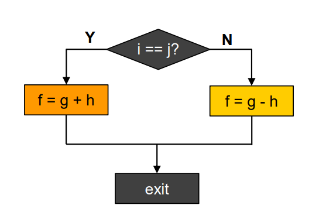
**编译后的RISC-V汇编**：
```riscv
        bne x22, x23, Else  # 若i != j，跳转到Else分支
        add x19, x20, x21   # if分支：f = g + h
        beq x0, x0, Exit     # 无条件跳转到Exit，跳过else分支
Else:   sub x19, x20, x21   # else分支：f = g - h
Exit:                       # 后续指令
```

注意，`beq x0, x0, Exit` 确保不会执行一次 `Else`，通过一个恒真的条件实现跳转。
程序结构：
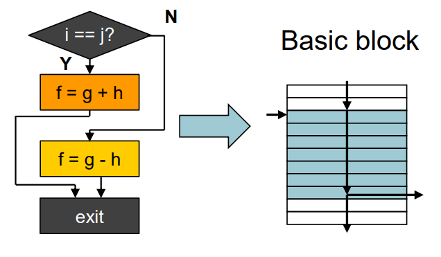

### 7.3 案例：`while`循环语句编译
**C代码**：
```cpp
while (save[i] == k)
    i += 1;
// i对应x22，k对应x24，save数组基地址对应x25
```

注意，`save` 数组存放在 `Memory` 中，数据位宽32，因此 C 中的索引 `+1` 不能直接用 `Memory` 的地址 `+1` 来访问，应该是地址 `+4` 来访问下一个元素才对。
**编译后的RISC-V汇编**：
```riscv
Loop:   slli x10, x22, 2     # x10 = i * 4（字节偏移）
        add x10, x10, x25    # x10 = save数组基地址 + i*4 = &save[i]
        lw x9, 0(x10)         # x9 = save[i]
        bne x9, x24, Exit     # 若save[i] != k，退出循环
        addi x22, x22, 1      # i += 1
        beq x0, x0, Loop      # 跳回循环开头
Exit:                           # 循环退出
```


### 7.4 更多 conditional Operations

如果 `x10` < `x11`，则跳转到 `L`。
```rsic
blt x10, x11, L
```

如果在没有 `blt` 的 MIPS： 
- `slt rd, rs1, rs2`：有符号比较，`rs1` < `rs2`则`rd=1`，否则`rd=0`
- `slti rd, rs1, imm`：立即数有符号比较
- 示例：实现小于跳转
  ```riscv
  slt x9, x10, x11  # x9 = 1 当且仅当 x10 < x11
  bne x9, x0, label  # 若x9 != 0（x10 < x11），跳转到label
  ```

- `slt/stli`: 有符号比较
- `sltu/sltui`：无符号比较

### 7.5 Branch Addressing

Most branch targets are near branch

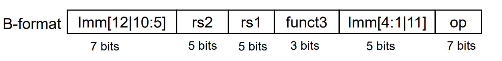

标签翻译成机器码，存的也是二进制数字。而且存的是 offset，相对寻址。如果用绝对寻址，存不下，而且本来寻址范围一般也不会太广。

**Target address = PC + offset**

$$\text{offset} = \{\text{Imm}[12:1], 0\}, \text{range}=2^{13} \sim \pm 4\text{KB}$$

Target adress in RISC-V is **16-bit aligned**
RISC-V架构中的目标地址需按16位对齐

### 7.6 Jump Addressing

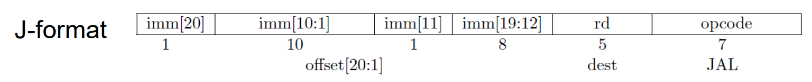

**Example:**
1. `jal rd, label`
   - 执行 PC + 4，将结果存放进入 `rd`，`rd` 是指定的寄存器，例如`x1`
   - CPU 计算目标地址，然后跳转
   - 计算方式例如：PC + offset，offset 是指令中编码的立即数，表示相对于当前指令地址的偏移量
2. `jal x0, label`
   - `x0` 丢弃一切写入操作，直接进行跳转
   - 我们故意扔掉了返回地址，这说明**我们根本没打算回来**！这不再是一个“函数调用”，而是一个纯粹的无条件跳转

**Summary:**
- **Target address = PC + offset**
- $\text{offset} = \{\text{Imm}[20:1], 0\}, \text{range}=2^{21}\sim \pm 1\text{MB}$ 
- **Keep `PC+4` in `rd`**

**如果要跳转的地址太远，立即数存不下怎么办**（范围只有$2^{21} \sim \pm 1\text{MB}$）
——用**寄存器**！

```rsic
jalr rd, offset(rs1)
```

例如：`jalr x0, 0(x1)`
效果：
1. set rd
2. go to rs1 + offset

那么问题来来了，如何将目标地址加载到寄存器中呢？我们可以使用 `lui` 和 `addi` 指令组合来构建一个完整的地址：

```riscv
lui x1, upper20  # 将目标地址的高20位加载到x1
addi x1, x1, lower12  # 将目标地址的低12位加到寄存器
```
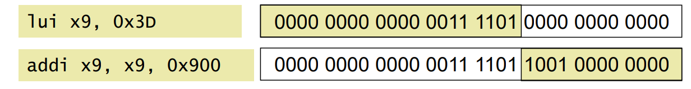


**目标地址计算示例：**
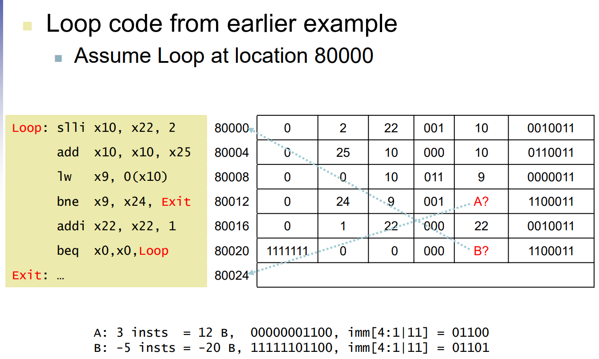

## 八、Intel x86 ISA 核心特性
Intel x86 是典型的 CISC（复杂指令集）架构，其发展始终被“向后兼容性（Backward Compatibility）”所绑定，尽管技术上不如 RISC 优雅，但取得了极大的市场成功。

### 8.1 x86 基础寄存器与操作数
* **8 个通用寄存器**：EAX, ECX, EDX, EBX, ESP (栈指针), EBP (基址指针), ESI, EDI。
* **段寄存器与特殊寄存器**：CS, SS, DS, ES, FS, GS 以及 EIP (PC指针) 和 EFLAGS (条件码)。
* **双操作数指令**：x86 指令通常为 2 个操作数（1 个源操作数，1 个既是源又是目的操作数）。其操作数允许 `Register-Memory` 的直接交互。

### 8.2 x86 内存寻址模式
相比于 RISC-V 的相对单一寻址，x86 提供了极其复杂的内存寻址组合：
* **Address** = `R_base` + `displacement` (位移)
* **Address** = `R_base` + `2^scale * R_index` (比例系数可选 0, 1, 2, 3)
* **Address** = `R_base` + `2^scale * R_index` + `displacement`

### 8.3 变长指令编码与底层实现
* **指令结构**：前缀字节（修改操作，如操作数长度、重复锁定等） + 操作码 + 后缀字节（指定复杂的寻址模式）。
* **微操作翻译（Microoperations）**：由于 CISC 指令集过于复杂，难以直接用硬件流水线实现。现代 x86 硬件会在底层将复杂的 x86 指令动态**翻译为类似于 RISC 的简单微操作（Microoperations）**，这种“微引擎”架构使得 x86 也能达到与 RISC 媲美的性能。

---


## 九、ISA 设计的维度与分类 (Essence of ISA)
一个完整的二进制机器语言程序要能正确运行，程序员（或编译器）必须了解ISA的7个核心维度：
- 指令集分类(Class of ISA)
- 内存寻址(Memory addressing)
- 寻址模式(Adressing modes)
- 操作数类型与大小(Types and sizes of operands)
- 具体操作(Operations)
- 控制流指令(Control flow instructions)
- 指令编码(Encoding an ISA)

### 9.1 Class of ISA
现代处理器架构几乎全都采用基于寄存器的设计，寄存器比内存快，且对编译器更加友好：
1. **Stack（栈式）**：操作数隐式来自于栈顶（如 `Pop A; Pop B; Add; Push C`）。
2. **Accumulator（累加器）**：包含一个隐式的操作数（如 `Load A; Add B; Store C`）。
3. **Reg-Mem: CISC**：允许直接将内存地址作为运算指令的操作数（如 `Add C, A, B`）。
4. **Reg-Reg + Load-Store: RISC**：**算术指令的操作数只能是寄存器**，必须通过专门的 Load/Store 指令与内存交互（如 `Load R1, A; Add R3, R1, R2`）。

保持变量在寄存器中有助于减少内存带宽，提高速度，增加代码密度。

### 9.2 Register
* **寄存器数量的权衡**：
  * **少量寄存器**（如 x86 仅 8 个通用寄存器）：指令编码需要的 **ID 位数少**，**硬件成本低**，上下文**切换快**。
  * **大量寄存器**（如 RISC 通常有 32 个int + 32 个floating寄存器）：**减少频繁的 Load/Store 操作，支持多操作并行执行**。

### 9.3 Operands
* **操作数类型**：
  * **定点数**：Half word(半字)、word(字)、double word(双字)，采用补码表示。
  * **浮点数**：IEEE 754 标准的**单精度**（23位尾数+8位指数）和**双精度**（52位尾数+11位指数）。
  * **新型张量格式（如 Intel NN 处理器引入的 Flexpoint）**：针对神经网络优化，如 16位尾数 + 5位共享指数，说明传统的数据格式并不一定适合所有计算场景。

### 9.4 Encoding 
1. **变长编码（Variable）**：如 x86（1~17 字节）和 VAX。
   * **优点**：**指令集设计灵活，代码密度高**（compact）。
   * **缺点**：需要多步取指与解码，**硬件实现极其复杂。**
2. **定长编码（Fixed）**：如 RISC-V、MIPS、PowerPC（全部固定为 4 字节）。
   * **优点**：极其容易取指和解码，极大地简化了流水线设计与并行化。
   * **缺点**：**指令编码位宽紧张**（32位需要精打细算）。


### 9.5 Memory Addressing

#### 9.5.1 端序（Endianness）
**(1) 大端序（Big endian）**
- 规则：**最高有效字节（MSB）存放在字的最低地址**
- 代表架构：Motorola 6800、68000；PowerPC、System/370；SPARC（版本9及之前）

**(2) 小端序（Little endian）**
- 规则：**最低有效字节（LSB）存放在最低地址**
- 代表架构：x86、6502、Z80、VAX

**(3) 双端序（Bi-endian）**
- 规则：可切换的端序
- 代表架构：ARM、PowerPC、Alpha、SPARC V9、PA-RISC、IA-64

小端序符合书写习惯，先写的数字（MSB）存放在更高地址

#### 9.5.2 对齐(Alignment)
RISC-V使用字节寻址进行半字、字和双字访问，并具有以下对齐约束：
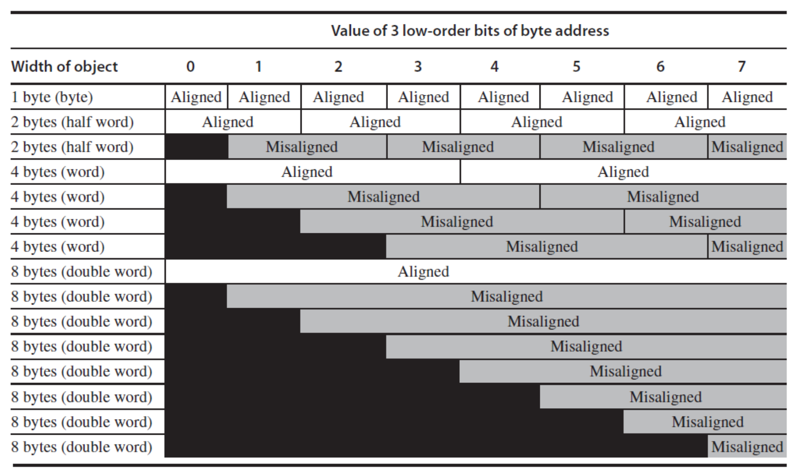

对于**指令存储器，地址必须是4的倍数**，若地址的最低两位中有任何一位非零，则会**触发地址错误异常**。

### 9.6 Addressing mode


**(1) 立即数寻址（Immediate addressing）**
- 指令格式：`immediate | rs1 | funct3 | rd | op`
- 操作数直接包含在指令中，无需访问寄存器或内存。

**(2) 寄存器寻址（Register addressing）**
- 指令格式：`funct7 | rs2 | rs1 | funct3 | rd | op`
- 操作数均来自寄存器，结果也写入寄存器。
- 案例：`add x9, x20, x21`，x20和x21是源寄存器，x9是目的寄存器。 

**(3)基址寻址（Base addressing）**
- 指令格式：`immediate | rs1 | funct3 | rd | op`
- 有效地址 = 基址寄存器(rs1)的值 + 指令中的立即数偏移
- 用于**访问内存**，支持字节(Byte)、半字(Halfword)、字(Word)、双字(Doubleword)存取。
- 案例：`lw x9, 32(x22)`，**x22是基址寄存器**，32是**立即数偏移**，计算有效地址为x22 + 32，加载内存中的数据到x9。

**(4) PC 相对寻址（PC-relative addressing）**
- 指令格式：`imm | rs2 | rs1 | funct3 | imm | op`
- 有效地址 = 程序计数器(PC)的值 + 指令中的立即数偏移
- 主要用于控制转移类指令（如分支、跳转），目标地址为内存中的字(Word)。
- 案例：`beq x22, x23, label`，如果x22 == x23，则跳转到label所在的地址，**label地址通过PC + offset计算得出**。

### 9.7 Operations
**(1) Operator Types & Examples**

| Operator Type | Examples |
|----------------|-------------|
| **Arithmetic and Logical** | Integer arithmetic and logical operations: add, subtract, and, or, multiply, divide |
| **Data transfer** | Loads-stores (move instructions on computers with memory addressing) |
| **Control** | Branch, jump, procedure call and return, traps |
| System | Operating system call, virtual memory management instructions |
| Floating point | Floating-point operations: add, multiply, divide, compare |
| Decimal | Decimal add, decimal multiply, decimal-to-character conversions |
| String | String move, string compare, string search |
| Graphics | Pixel and vertex operations, compression/decompression operations |

**(2) 80x86 Instruction Frequency (Integer Average % of total executed)**

| Rank | 80x86 instruction | Integer average <br> (% total executed) |
|------|--------------------|------------------------------------------|
| 1    | load               | 22%                                      |
| 2    | conditional branch | 20%                                      |
| 3    | compare            | 16%                                      |
| 4    | store              | 12%                                      |
| 5    | add                | 8%                                       |
| 6    | and                | 6%                                       |
| 7    | sub                | 5%                                       |
| 8    | move register-register | 4%                                   |
| 9    | call               | 1%                                       |
| 10   | return             | 1%                                       |
| **Total** | - | **96%** |

### 9.8 Control Flow 

**(1) Instructions**
- Branch (条件分支), neq, eq, gt, ge, lt, le
- Jump (无条件分支/跳转)
- Procedure calls / returns (过程调用/返回)

其中 Branch 和 Jump 指令都在上面的 **七、控制流：分支与跳转** 介绍过了。
Procedure calls/returns 将在下面介绍。

**(2)  Target**
- PC-relative
- Register indirect jumps

## 十、非字数据操作与存储访问
除了操作 32 位的字，程序常常需要处理字符（如 ASCII、UTF-8）或半字数据。RISC-V 提供了专门的字节/半字加载和存储指令。

### 10.1 字节/半字指令
* **符号扩展加载**：`lb rd, offset(rs)` (字节) / `lh rd, offset(rs)` (半字) ，将数据加载到寄存器并**符号扩展至 32 位**。
* **零扩展加载**：`lbu rd, offset(rs)` / `lhu rd, offset(rs)` ，高位直接补 0（通常用于无符号字符如 ASCII）。
* **存储指令**：`sb rd, offset(rs)` / `sh rd, offset(rs)` ，仅将寄存器最右侧的 8 位或 16 位存入内存。

### 10.2 案例：字符串拷贝（String Copy）
将 C 语言中基于空字符 `\0` 结尾的字符串拷贝函数翻译为 RISC-V 汇编。这里重点关注 `lbu` 和 `sb` 的使用。

**C代码**：
```c
void strcpy (char x[], char y[]) { 
    int i;
    i = 0;
    while ((x[i]=y[i])!='\0')
        i += 1;
}
```

**RISC-V 汇编代码** (x, y 基地址分别在 x10, x11 中，i 存放在 x19 中)：
```riscv
strcpy:
    addi sp, sp, -4     # 调整栈指针，分配1个字的空间
    sw x19, 0(sp)       # 保存原来的x19寄存器状态到栈上
    add x19, x0, x0     # i = 0

L1: add x5, x19, x11    # x5 = y数组基址 + i (这里按字节寻址，直接加i即可)
    lbu x6, 0(x5)       # x6 = y[i] (加载无符号字节)
    add x7, x19, x10    # x7 = x数组基址 + i
    sb x6, 0(x7)        # x[i] = y[i] (存储字节)
    beq x6, x0, L2      # 检查是否遇到空字符 '\0' (即数值0)，如果是则退出循环
    
    addi x19, x19, 1    # i = i + 1
    jal x0, L1          # 无条件跳转到下一轮循环

L2: lw x19, 0(sp)       # 恢复原始的 x19
    addi sp, sp, 4      # 释放栈空间
    jalr x0, 0(x1)      # 函数返回
```

**数组寻址与指针寻址的性能差异：**
案例：
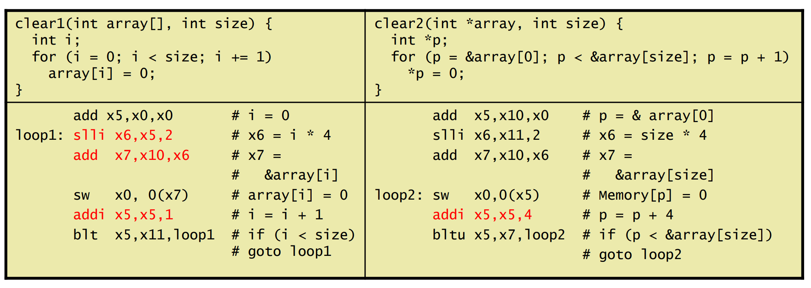
上方的 C 代码左侧是数组索引方式，右侧是指针运算方式。**右侧会更快**，原因如下：

数组索引方式的汇编代码循环体有5行指令，而指针运算方式的汇编代码循环体只有3行指令。
* **数组索引（Array Indexing）**：需要频繁在循环内用乘法（或移位）计算偏移量（`Index * ElementSize`），再加到基地址上。
* **指针运算（Pointers）**：指针直接对应内存地址，循环时只需将指针递增对应的步长，**避开了复杂的索引地址计算**，在底层汇编中指令更少，效率更高。

当然，现代更加只能的编译器通常会对数组索引进行优化，自动转换为指针运算以提升性能，但理解底层原理有助于编写更高效的代码。

---

## 十一、过程调用（Procedure Calling）与函数栈
过程调用（即函数调用）使得代码可以复用和模块化。核心在于维护**调用者（Caller）** 与**被调用者（Callee）** 之间的**现场保存、参数传递**以及**返回流转**。

优点就是代码重用，易于理解。

### 11.1 核心步骤与指令
过程调用的必须步骤如下：
1. **传参**：将参数放入指定的寄存器（`x10-x17`）。
2. **跳转**：将控制权转移给函数，同时保存返回地址（`jal x1, proc`）。
3. **分配存储**：为函数在内存空间（Stack 栈）上申请存储空间。
4. **执行计算**：执行函数的具体操作。
5. **保存返回值与恢复现场**：将返回值放入寄存器，恢复使用过的受保护寄存器。
6. **返回**：跳转回原调用处（`jalr x0, 0(x1)`）。

!!! attention 
    注意：我们倾向于使用寄存器 `x1` 保存返回地址，返回地址指的是**调用者的下一条指令地址**。<br>
    具体实施方式就是在 `jal x1, Proc` 时，CPU 会自动将 `PC + 4`（即调用指令的下一条指令地址）存入 `x1`，以便函数执行完毕后能正确返回。

#### 过程调用时发生的事情

一般来说，默认用`x10-x17`这8个寄存器存放参数和返回值。当然也可以放其他寄存器。

如果参数多余8个寄存器，**剩下的参数在编译时会被存放到memory**中。

栈空间：
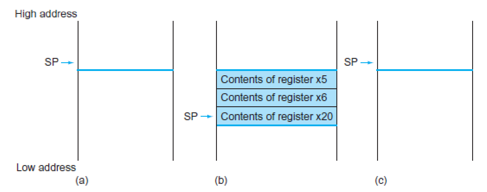

- (a): 在过程调用前
- (b): 在过程调用器件，栈指针向下伸展，分配空间保存寄存器
- (c): 在过程返回前，恢复寄存器。

栈空间中，从高地址向低地址方向伸展，**栈顶指针SP**始终指向**栈的最底部**。

调用示例代码：
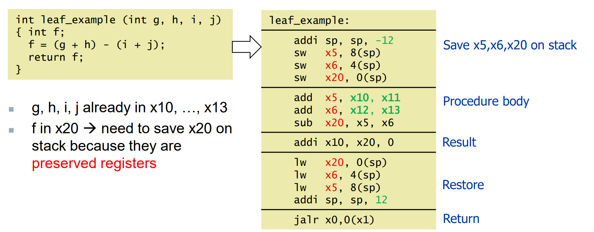

可见一次调用通常会发生多次 memory 操作，所以一般不要用 procedure call 更好。

!!! attention
    联想：C 代码的 **inline 函数**就是为了解决访存问题存在的。

当然，我们可以通过设定寄存器调用约定来减少访存：

### 11.2 RISC-V 寄存器调用约定（ABI Conventions）
了解各寄存器在函数调用中的角色极其重要，它决定了**哪些寄存器应该由 Caller 保存，哪些应该由 Callee 保存**：

| 寄存器名 | ABI 别名 | 用途 | 调用后是否保留（Preserved）？ |
|---|---|---|---|
| `x0` | zero | 常量值 0 | n.a. |
| `x1` | ra | **返回地址** (Return address) | Yes |
| `x2` | sp | **栈指针** (Stack pointer) | Yes |
| `x5-x7`, `x28-x31` | t0-t6 | **临时寄存器** (Temporaries) | **No** (Callee 可随便改，Caller 需要自己保存) |
| `x8-x9`, `x18-x27` | s0-s11| **保存寄存器** (Saved registers) | **Yes** (Callee 如果要用，必须先压栈保存，并在返回前恢复) |
| `x10-x17` | a0-a7 | **参数/返回值** (Arguments/results)| No |

*(注：如果临时寄存器不够用，或者需要嵌套调用其他过程，超出部分及需要跨调用的数据需要被 **溢出（spill）** 进内存堆栈中。栈顶指针 SP 始终指向栈的最底部。)*

### 11.3 叶子过程调用（Leaf Procedure）
叶子过程是指**内部不再调用任何其他函数**的函数。**由于不牵涉二次跳转，只需妥善保存它自己用到的“保存寄存器”即可**。

**C代码**：
```c
int leaf_example (int g, h, i, j) { 
    int f;
    f = (g + h) - (i + j);
    return f;
}
```

**RISC-V汇编** (假定入参已在 x10~x13，我们需要用到临时寄存器x5, x6以及需要保护的寄存器x20作变量f)：
```riscv
leaf_example:
    addi sp, sp, -12    # 向下伸展栈区，腾出3个字的空间保存寄存器
    sw x5, 8(sp)        # 压栈保存x5 (如果是严格优化，临时变量x5,x6其实可以不保存)
    sw x6, 4(sp)        # 压栈保存x6
    sw x20, 0(sp)       # 压栈保存x20 (x20是s系寄存器，Callee强行使用前必须保存它！)

    # 实际执行主体
    add x5, x10, x11    # x5 = g + h
    add x6, x12, x13    # x6 = i + j
    sub x20, x5, x6     # x20(f) = x5 - x6
    addi x10, x20, 0    # 将结果复制到 x10(a0) 中作为返回值

    # 恢复现场
    lw x20, 0(sp)       # 从栈中恢复 x20
    lw x6, 4(sp)        # 恢复 x6
    lw x5, 8(sp)        # 恢复 x5
    addi sp, sp, 12     # 释放栈空间，恢复栈指针SP

    jalr x0, 0(x1)      # 跳转回 caller 指定的返回地址 (ra)
```

### 11.4 Nested Procedure Calling (嵌套过程调用)

**Caller**：
1. Puts the arguments in x10-x17 (8 regs)
2. If registers (x5−x7, x28−x31) for a procedure needed, spill to memory (stack) from register file（**如果这几个临时寄存器已经使用了，推送到Stack**）

**Callee**：
1. If a non-leaf callee, save its return address (Think: why?)(**防止调用的内层过程覆盖了返回地址**)
2. Save preserved (x8-x9, x18-x27) if used in the callee.(Restore from the stack before returning) (**如果当前callee本身要用这几个saved寄存器，必须先压栈保存，并在返回前恢复**)
3. Any arguments and temporaries needed after the call (**这里记得保存调用的内存过程需要的参数和临时寄存器，因为调用内层过程会覆盖它们**)
4. If non-leaf, then...(接 caller)

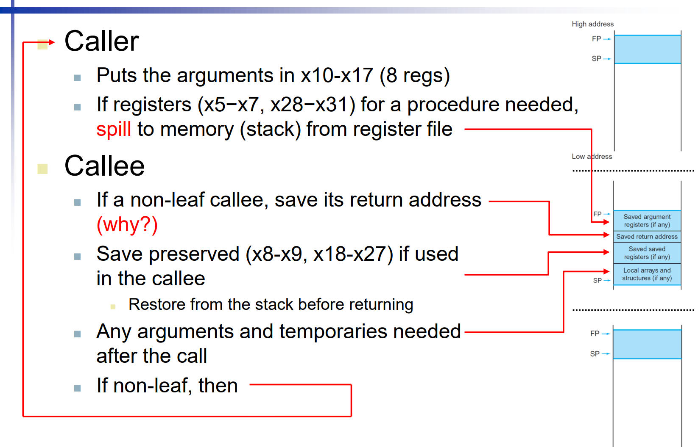

**完整示例：非叶子过程的嵌套调用**

目标流程：`main -> procA -> procB`，其中 `procA` 是非叶子过程（会继续调用 `procB`）。

```riscv
    .text
    .globl main

# main: 调用 procA(5, 7)
main:
    addi x10, x0, 5         # a0 = 5
    addi x11, x0, 7         # a1 = 7
    jal  x1, procA          # 调用非叶子过程 procA

    # 返回后 x10 为结果，这里仅示意程序结束
    jal  x0, done

# procA(a0, a1): 非叶子过程
# 计算 temp = a0 + a1，调用 procB(temp)，最后返回 procB(temp) + temp
procA:
    addi sp, sp, -16        # 栈帧: [12]=ra, [8]=s0, [4]=t0(调用者保存), [0]预留
    sw   x1, 12(sp)         # 非叶子过程必须先保存返回地址 ra
    sw   x8, 8(sp)          # s0 是被调用者保存寄存器，使用前先保存

    add  x5, x10, x11       # t0 = a0 + a1
    sw   x5, 4(sp)          # t0 需跨过程调用继续使用，先压栈保存

    addi x10, x5, 0         # 把 temp 放入 a0 作为 procB 参数
    jal  x1, procB          # 调用内层过程，返回值在 a0(x10)

    lw   x5, 4(sp)          # 恢复 temp
    add  x10, x10, x5       # a0 = procB(temp) + temp

    lw   x8, 8(sp)          # 恢复 s0
    lw   x1, 12(sp)         # 恢复 ra
    addi sp, sp, 16         # 回收栈帧
    jalr x0, 0(x1)          # 返回 main

# procB(a0): 叶子过程
# 返回 a0 * 2
procB:
    slli x10, x10, 1        # a0 = a0 << 1
    jalr x0, 0(x1)          # 返回 procA

done:
    # 课程笔记示例结束标签
```

注意这几个关键点：
1. `sw   x1, 12(sp)`：因为 `procA` 是非叶子过程，必须先保存返回地址，否则调用 `procB` 后 `x1` 的值会被覆盖，导致无法正确返回。
2. `sw   x8, 8(sp)`：`s0` 是被调用者保存寄存器，如果 `procA` 需要使用它，必须先保存。
3. `sw   x5, 4(sp)`：`x5` 是临时寄存器，本来如果是叶子过程的话，`procA`可以随便改 `x5` 不用保存，但 `procA` 需要在调用 `procB` 后继续使用它，因此必须先保存到栈上。

**Steps required**：
1. Place arguments in registers (x10-x17)
2. Transfer control to procedure (jal x1,proc)
3. Acquire storage for procedure (save onto stack)
4. Perform procedure’s operations (may need new data on stack or heap)
5. Place result in register for caller (x10-x17, restore from stack)
6. Return to place of call ( jalr x0,0(x1) )

!!! note 栈溢出
    通过上述分析可以见得，在多个 Nested Procedure Calling 的情况下，**每一层非叶子过程都必须保存自己的返回地址和需要跨调用使用的寄存器**，以确保调用链能够正确返回并且数据不被覆盖。当调用深度越来越深，每一层要保存的临时变量也会越来越多，如果没有足够的栈空间来保存这些信息，就会发生**栈溢出（Stack Overflow）**，导致程序崩溃或行为异常。因此，在设计程序时需要注意调用深度和每层调用所需的寄存器数量，以避免栈溢出问题。甚至一个函数都不要写太长，避免调用过深。<br>
    有一个很经典的例子就是**递归调用**，如果递归深度过大，就会导致栈溢出。

### 11.5 嵌套调用的递归示例（Recursive Example）

**C代码实现阶乘**：
```c
int fact (int n) { 
    if (n < 1) return 1;
    else return n * fact(n - 1);
}
```

**RISC-V代码实现** (入参n在x10，返回值在x10)：
```riscv
fact: 
    addi sp, sp, -8     # 为2个元素（当前参数和当前返回地址）分配栈空间
    sw x1, 4(sp)        # 【极其重要】保存外层Caller传给本函数的返回地址
    sw x10, 0(sp)       # 保存本函数的入参n，由于内部要调子函数，后续x10会被覆盖

    # 判断跳出条件
    addi x5, x10, -1    # 测试 n < 1
    bge x5, x0, L1      # 如果 (n - 1) >= 0 (即n>=1)，跳转去递归分支 L1

    # 满足边界条件 (n<1) 的返回逻辑
    addi x10, x0, 1     # 如果满足退出条件，将1设为返回值
    addi sp, sp, 8      # 直接出栈恢复空间（没被修改不用恢复数据内容）
    jalr x0, 0(x1)      # 返回上一层调用

L1: 
    # 递归调用逻辑
    addi x10, x10, -1   # 将原参数 -1，更新到x10作为新的传参
    jal x1, fact        # 【递归调用】注意此处会将下一条指令地址自动写进 x1

    # 从内层返回后的继续运算逻辑
    addi x6, x10, 0     # 此时的 x10 是内层递归拿到的返回值，先移动到临时寄存器x6中
    lw x10, 0(sp)       # 把调用前的 `原始参数n` 从栈中恢复回来
    lw x1, 4(sp)        # 把本层的 `原返回地址` 恢复到 x1 中！
    addi sp, sp, 8      # 释放刚才开辟的栈空间
    
    mul x10, x10, x6    # x10(返回值) = n * fact(n-1)
    jalr x0, 0(x1)      # 带着结果 x10 沿栈往上层返回
```

分析示例：
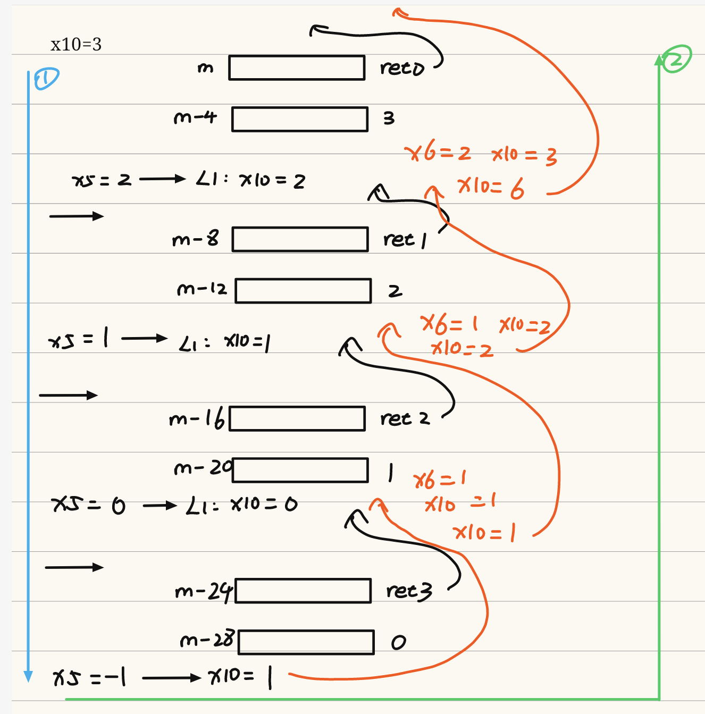 