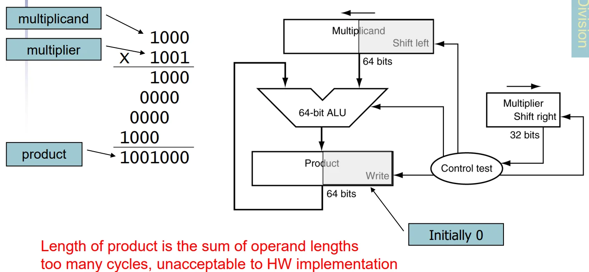
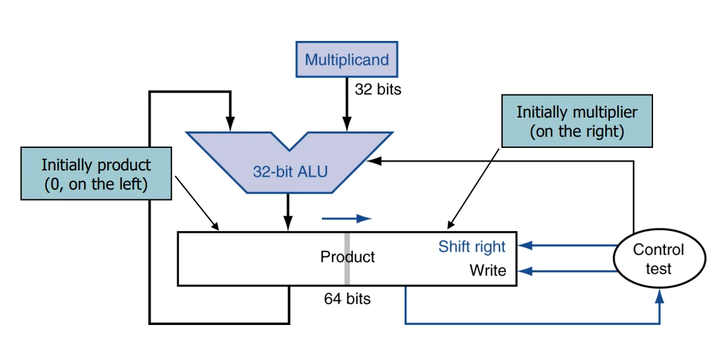
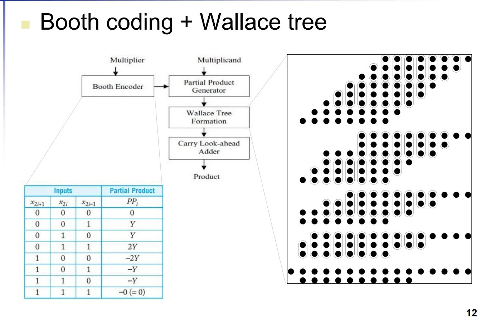
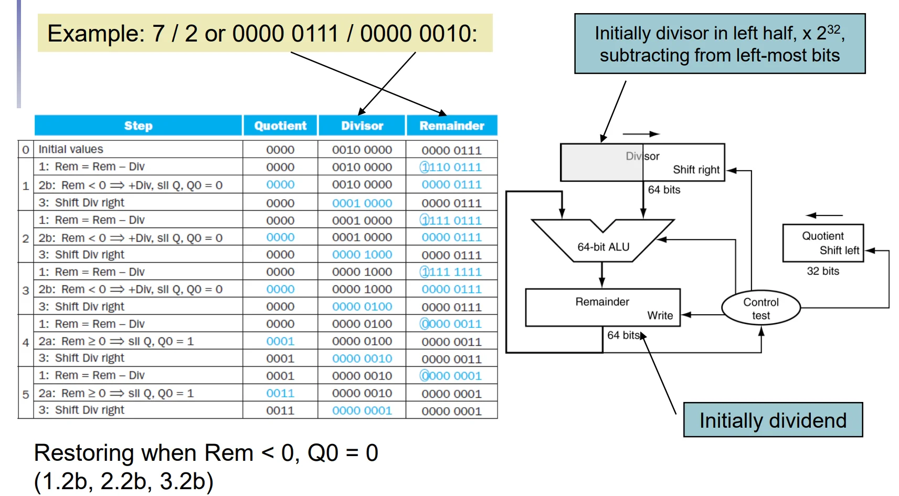
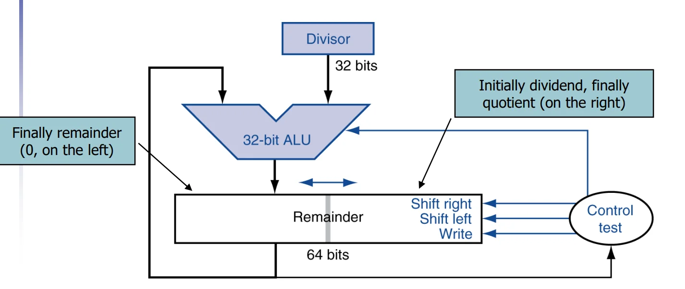
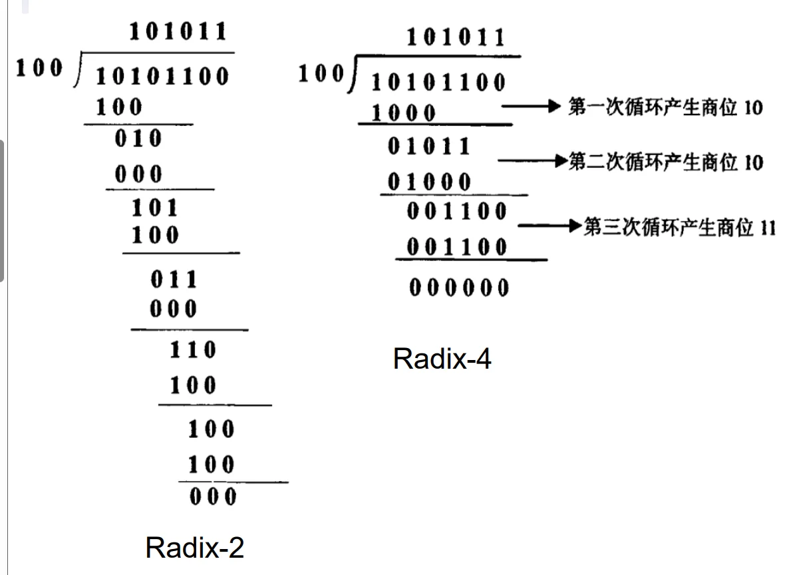

# 第三章：计算机中的算术

## 一、整数表示（Integer Representation）

在计算机系统中，整数主要有两种表示方式：**无符号整数**和**有符号整数（补码）**。

### 1.1 无符号整数 (Unsigned Binary Integers)

无符号整数直接将二进制位权相加，仅用于表示非负数。

**(1) 表示公式**：
对于一个 $n$ 位二进制数：

$$x = x_{n-1}2^{n-1} + x_{n-2}2^{n-2} + \dots + x_12^1 + x_02^0$$

**(2) 数值范围**：
从 $0$ 到 $+(2^n - 1)$

**(3) 32位系统示例**：
**范围**：$0$ 到 $+4,294,967,295$。
**二进制转十进制**：例如 `0000...1011₂` 对应 $1\times2^3 + 0\times2^2 + 1\times2^1 + 1\times2^0 = 8 + 0 + 2 + 1 = 11_{10}$。

### 1.2 补码有符号整数 (2s-Complement Signed Integers)

补码是计算机中表示有符号（正、负、零）整数的标准方法，其核心特点是**最高位（MSB）具有负权重**。

**(1) 表示公式**：
对于一个 $n$ 位数：
$$x = \color{red}{-x_{n-1}2^{n-1}} + \color{black}{x_{n-2}2^{n-2}} + \dots + x_{1}2^1 + x_{0}2^0$$

**(2) 符号位 (Sign Bit)**：
在32位整数中，第31位是符号位：
**0**：表示非负数（Non-negative numbers）。
**1**：表示负数（Negative numbers）。

**(3) 数值范围**：
从 $-2^{n-1}$ 到 $+(2^{n-1} - 1)$。

**(4) 32位系统示例**：
**范围**：$-2,147,483,648$ 到 $+2,147,483,647$。
**计算示例**：`1111...1100₂` 对应 $-1\times2^{31} + 1\times2^{30} + \dots + 1\times2^2 + 0\times2^1 + 0\times2^0 = -4_{10}$。

#### 补码的关键特性：
1.  **非负数一致性**：非负数的补码表示与其无符号表示完全相同。
2.  **特定的重要数值**（$N$位）：
    *   **0**：`0000 0000 ... 0000`
    *   **-1**：`1111 1111 ... 1111`（所有位全为1）
    *   **最大正数 (Most-positive)**：`0111 1111 ... 1111` ($2^{N-1}-1$)
    *   **最小负数 (Most-negative)**：`1000 0000 ... 0000` ($-2^{N-1}$，其绝对值比最大正数大1)

### 1.3 符号取反操作 (Signed Negation)

在**补码**系统中，将一个**数变号**（正数变负数或反之）的捷径是：**求反加一**。

**(1) 操作步骤**：
1.  **取反 (Complement)**：将所有位翻转（1变0，0变1）。
2.  **加1**：在最低位加1。

**(2) 数学原理**：

$$\bar{x} + 1 = -x$$

**证明**：
对于一个 $n$ 位数：
$x = \color{red}{-x_{n-1}2^{n-1}} \color{black}{+ x_{n-2}2^{n-2} + \dots + x_{1}2^1 + x_{0}2^0}$
我们将其**各位取反**：
$\bar{x} = \color{red}-{\bar{x}_{n-1}2^{n-1}} \color{black}{+ \bar{x}_{n-2}2^{n-2} + \dots + \bar{x}_{1}2^1 + \bar{x}_{0}2^0}$
注意到：
$x_{k} + \bar{x}_{k} = 1$
因此我们有：

$$\begin{aligned}
x + \bar{x} &= \color{red}{(-x_{n-1} - \bar{x}_{n-1})2^{n-1}} + \color{black}{(x_{n-2} + \bar{x}_{n-2})2^{n-2} + \dots + (x_{1} + \bar{x}_{1})2^1 + (x_{0} + \bar{x}_{0})2^0} \\
&= \color{red}{-2^{n-1}} + \color{black}{2^{n-2} + \dots + 2^1 + 2^0} \\
&= \color{red}{-2^{n-1}} + \color{black}{(2^{n-1} - 1)} \\
&=-1 \\
\end{aligned}$$

证毕。
**(3) 示例：将 +2 变为 -2**：
*   $+2$ = `0000...0010₂`
*   第一步取反：`1111...1101₂`
*   第二步加1：`1111...1101₂ + 1 = 1111...1110₂` （即 -2）。

进而引申：

!!! note 1. 计算中，减去一个正数，等于加上它的相反数的补码

!!! note 2. 计算机中，加法和减法都可以通过补码的加法实现

根据课件内容，我为你整理了关于**整数加减法、溢出处理、乘法运算及其电路实现、RISC-V实现**的学习笔记。作为微电子专业的学生，这部分重点关注**硬件实现的演进（从串行到并行加速）**以及**硬件开销的优化**。

## 二、整数加减法与溢出处理

### 2.1 整数加减法 (Integer Addition & Subtraction)
*   **加法原则**：从最低位开始逐位相加，并向高位进位（Carries）。
*   **减法原则**：通过**加法器**实现。减去一个数等于**加上该数的补码**（即取反加1）。
    *   例如：$7 - 6 = 7 + (-6)$。

### 2. 溢出处理 (Dealing with Overflow)
当运算结果超出了当前位数所能表示的范围时，发生溢出。
*   **加法溢出判定**：
    *   **一正一负相加**：**永远不会溢出**。
    *   两个正数相加：结果符号位为1（变为负数），则溢出。
    *   两个负数相加：结果符号位为0（变为正数），则溢出。
*   **减法溢出判定**：
    *   **两个同号数相减**：**永远不会溢出**。
    *   负数减正数：结果符号位为1，则溢出。
    *   正数减负数：结果符号位为0，则溢出。
*   **两种溢出处理方式**
    *   **Satruating(饱和)**：当发生溢出时，结果被强制设置为**可表示的最大值或最小值**。常见于**Graphics and media processing**
    *   **Clipping(截断)**：当发生溢出时，结果被截断为可表示的范围内的值。即取模回绕（Wrap-around）。例如在8bit无符号加法中，$255 + 1$ 会回绕到 $0$。

## 三、乘法运算及其电路实现

### 3.1 基础乘法算法 (Long-multiplication Approach)
类似于手工长乘法，通过逐位检查乘数（Multiplier）并对被乘数（Multiplicand）进行**移位和累加**。
*   **硬件特点**：**乘积的长度是操作数长度之和**（如两个**32位数相乘得到64位积**）。
*   **初步硬件实现**：包含64位ALU、64位被乘数寄存器（左移）、32位乘数寄存器（右移）及64位乘积寄存器。**缺点**：时钟周期多，硬件利用率低。

### 3.2 优化后的乘法器电路 (Optimized Multiplier)
为了减小面积和提升速度，微电子设计中常采用优化电路：
*   **并行化设计**：将**加法和移位步骤并行执行**。
*   **寄存器优化**：乘积寄存器的右半部分最初存放乘数，随着运算进行，乘数被移出，乘积的低位被移入，从而节省空间。

### 3.3 高性能“真实”乘法器 (Real Multiplier Structure)
现代芯片（如GPU/高性能CPU）中使用更复杂的电路结构：
*   **布斯编码 (Booth Encoder)**：通过对乘数进行编码，减少产生的**部分积（Partial Products）**数量。
*   **华莱士树 (Wallace Tree)**：采用树状结构的加法器阵列，实现部分积的**并行压缩相加**，大幅降低延迟。
*   **先行进位加法器 (Carry Look-ahead Adder, CLA)**：用于最后的求和阶段，以极快速度处理进位传递。

### 3.4 RISC-V 乘法指令实现

由于 RISC-V 的标准寄存器（在 32 位架构下）只能存储 32 位数据，因此指令集通过不同的指令来分别获取这 64 位结果的**低 32 位**和**高 32 位**。

**(1) 获取乘积的低位 (Least-significant 32 bits)**
*   **指令**：`mul rd, rs1, rs2`
*   **功能**：将 `rs1` 和 `rs2` 相乘，并将结果的**低 32 位**写入目标寄存器 `rd`。
*   **特点**：无论操作数是有符号数还是无符号数，乘积的低 32 位在二进制补码表示下都是相同的，因此不需要区分符号类型。

**(2) 获取乘积的高位 (Most-significant 32 bits)**
对于乘积的高 32 位，符号位的影响至关重要，因此 RISC-V 提供了三条不同的指令来处理符号扩展：

*   **`mulh rd, rs1, rs2`**：用于 **有符号数 × 有符号数**。它会将结果的高 32 位存入 `rd`。
*   **`mulhu rd, rs1, rs2`**：用于 **无符号数 × 无符号数**。它将结果的高 32 位作为无符号数处理并存入 `rd`。
*   **`mulhsu rd, rs1, rs2`**：用于 **有符号数 × 无符号数**。这种混合模式在处理多倍精度算术或特定算法时非常有用，它同样取结果的高 32 位。

## 四、整数除法（Division）运算及其电路实现

### 4.1 基础除法算法与恢复余数法 (Restoring Division)
除法的逻辑过程类似于手工长除法，但硬件实现更为具体：
*   **基本原则**：**对于 $n$ 位操作数，会产生一个 $n$ 位的商（Quotient）和一个 $n$ 位的余数（Remainder）**。
*   **算法步骤**：
    *   检查除数（Divisor）是否为0。
    *   比较除数与被除数（Dividend）的当前位，如果**除数 $\le$ 当前位**，则**商置1**并进行减法。
    *   否则，商置0，并将被除数的**下一位降下**继续比较。
*   **恢复余数法 (Restoring Division)**：在硬件执行减法后，如果**余数变为负数（< 0）**，则必须将除数**加回到余数中**以“恢复”原来的值。

### 4.2 除法器硬件电路实现 (Division Hardware)
课件对比了两种硬件结构，重点在于资源优化：
*   **非优化结构**：使用64位ALU、64位余数寄存器和64位除数寄存器（右移），商寄存器为32位（左移）。

*   **优化后的除法器 (Optimized Divider)**：
    *   **硬件高度复用**：优化后的除法器结构与乘法器非常相似，通常可以使用**同一套硬件**来实现乘法和除法。
    *   **寄存器配置**：32位ALU；64位余数寄存器初始化时右半部分放被除数，运算结束后左半部分存放余数，右半部分存放商。

### 4.3 除法加速技术 (Faster Division)
与乘法不同，除法很难使用类似华莱士树的并行硬件来加速。常用的加速手段包括：
**(1) 不恢复余数法 (Non-restoring Division)**：
我们就假设减掉除数后**余数小于0**的情况
| Method | reminder of cycle $N$ | reminder of cycle $N + 1$ |
| --- | --- | --- |
| **Restoring** | $r - d(<0)$ restor to $r$ | $r \times 2 - d$ |
| **Non-restoring** | $r - d(<0)$ | $2(r-d) + d$ |

（上面的乘2，原因是在做下一轮减法时，需要将余数左移一位，这样**被除数的下一位才能落在“个位”**，可以联想一下手工除法以作理解）

Non Restoring 的意思就是：
即使减法结果为负，也**直接存储该差值**，不进行“加回”操作。
通过在下一周期进行**特定的补偿调整**，**节省了恢复余数所需的时钟周期**。

**(2) SRT 除法 (SRT Division)**：
每一步可以产生**多个商位**（例如 Radix-4 **每步产生4位**）。
**实现原理**：利用查找表（Lookup Table），根据余数的高几位和除数的高几位来“预测”需要减去的数值，从而减少总迭代步数。

1. SRT 算法中：查找表会**存储 $m$ 位的部分商**，这些部分商是由**部分余数的 $m$ 位和除数的 $m$ 位**共同决定的。表格的存储空间大小为 $2^{2m}\times m$ 位，这个大小会受到内存容量的限制。
2. 采用基数为 $2b$ 的除法运算，可以将所需的计算周期数降至原来的 $1/b$，但每个周期的实现复杂度也相应增加了。

### 4. 有符号除法 (Signed Division)
有符号除法的核心原则是“**余数的符号必须与被除数一致**”：
1.  取被除数和除数的**绝对值**进行**除法**运算。
2.  **调整符号规则**：
    *   如果操作数异号，则商为负。
    *   **余数的符号必须与被除数一致**。
    *   这意味着商总是**向零舍入（Rounded toward zero）**。

### 5. RISC-V 除法指令实现
RISC-V 将商和余数的获取拆分为不同的指令，且区分有符号与无符号：

*   **获取商 (Quotient)**：
    *   `div rd, rs1, rs2`：有符号除法。
    *   `divu rd, rs1, rs2`：无符号除法。
*   **获取余数 (Remainder)**：
    *   `rem rd, rs1, rs2`：有符号取模。
    *   `remu rd, rs1, rs2`：无符号取模。

这部分笔记将重点整理课件中关于**浮点数（Floating Point）**的表示、IEEE 754 标准以及编码细节。

## 五、浮点数表示与编码 (Floating-Point Representation)

浮点数用于表示非整数，包括极大或极小的数值，其形式类似于科学计数法。

### 5.1 二进制科学计数法 (Binary Scientific Notation)
在二进制中，浮点数表示为：**$\pm 1.xxxxxxx_2 \times 2^{yyyy}$**。
*   **规格化 (Normalized)**：基数点**左侧**只有**一位**非零数字（在二进制中**恒为1**）。
*   **非规格化 (Not normalized)**：如 $+0.002 \times 10^{-4}$。

### 5.2 IEEE 754 浮点数标准
这是目前计算机系统通用且几乎唯一采用的浮点数格式。它定义了两种主要表示形式：
*   **单精度 (Single precision, float)**：32位。
*   **双精度 (Double precision, double)**：64位。

#### 编码结构图示：
| 精度 | 符号位 (S) | 指数位 (Exponent) | 尾数位 (Fraction) |
| :--- | :---: | :---: | :---: |
| **单精度** | 1 bit | 8 bits | 23 bits |
| **双精度** | 1 bit | 11 bits | 52 bits |

### 5.3 核心计算公式
浮点数 $x$ 的数值计算如下：
$$\mathbf{x = (-1)^S \times (1 + Fraction) \times 2^{(Exponent - Bias)}}$$

#### 关键编码原则：
*   **符号位 (S)**：0 表示非负，1 表示负数。
*   **隐含位 (Hidden Bit)**：为了节省空间，规格化后的尾数总是**以“1.”开头**，因此硬件编码时**只存储点后的部分 (Fraction)**，**计算时自动恢复“1.”**。
*   **偏置指数 (Biased Exponent)**：
    *   指数部分采用**偏置计数法**，确保指数始终为无符号数，便于硬件比较大小。
    *   **Bias 值**：单精度为 **127**，双精度为 **1023**。
    *   实际指数 = 寄存器值 (Exponent) - Bias。

!!! question 为什么需要 bias 以及为什么 bias 是这两个数
    **为什么需要bias？** 
    在浮点数表示中，指数 $E$ 本身既可能是正数，也可能是负数（例如 $2^{-126}$ 或 $2^{127}$）。如果直接用**补码**表示，**硬件进行比较和排序时会变得复杂**。
    通过引入偏置 $B$，我们将实际指数 $e$ 映射为存储的指数 $E$：
    
    $$E = e + B$$

    这样我们能够确保 $E$ 始终是一个非负整数。

    **为什么是127和1023？** 
    以单精度为例，**规格化数（normalized numbers）** 可用的 $E$ 的范围是 $[1, 254]$。为了让正负指数的范围尽可能对称，我们需要寻找一个中间值 $B$，使得：当 $E = 1$ 时，对应的实际指数 $e_{min}$ 为负数。当 $E = 254$ 时，对应的实际指数 $e_{max}$ 为正数。且 $e_{max} \approx |e_{min}|$。
    代入公式即可解得：$B = 127$

### 5.4 数值范围与精度
**(1) 单精度范围**
*   最小值：$\color{blue}{1.00\cdots 0 \times 2^{1-127}} \color{black}{= \pm 1.0 \times 2^{-126} \approx \pm 1.2 \times 10^{-38}}$。
*   最大值：$\color{blue}{1.11\cdots 1 \times 2^{254-127}} \color{black}{\approx \pm 2.0 \times 2^{+127} \approx \pm 3.4 \times 10^{+38}}$。

**(2) 浮点数稠密度**
浮点数不是均匀分布的。它是一个**非均匀的线性分段**结构。
单精度浮点数的形式为：$(-1)^S \times (1.M) \times 2^{E-127}$
*   **指数 (E)** 决定了“量级”（区间）。
*   **尾数 (M)** 决定了该区间内的“划分密度”。

在一个给定的指数 $E$ 下，尾数有 23 位，意味着该区间内有 $2^{23}$ 个等间距的点。**随着 $E$ 的增大，区间的跨度变大，但点数始终为 $2^{23}$，因此相邻点的间距（即最小精度单位，称为 ULP，Unit in the Last Place）会随指数增大而按指数增长。**

**(3) 相对精度**
- 单精度：约为 $2^{-23} \approx 1.19 \times 10^{-7}$，即大约 7 位十进制有效数字。
- 双精度：约为 $2^{-52} \approx 2.22 \times 10^{-16}$，即大约 16 位十进制有效数字。

**(4) 浮点数相对间距**
对于指数 $E$（规格化数），相邻两个浮点数之间的差值为：
$$\text{ULP} = 2^{E-127} \times 2^{-23} = 2^{E-127-23} = 2^{E-150}$$

*   **例子 1：指数相同时**
    假设 $E= e + 127$（即实际指数为 $e$）。
    此时 $2^{e} \times 2^{-23} = 2^{e-23}$。
    在这个区间内，每个数之间都隔着 $2^{e-23}$。

*   **例子 2：指数相差 1 时（跨过 $2^n$ 分界点）**
    这是浮点数最容易让人误解的地方。当指数 $E$ 增加 1 时，该区间的数值跨度翻倍，因此 **ULP 也翻倍**。
    *   在区间 $[2^0, 2^1)$，即 $E=127$ 时，ULP 为 $2^{-23}$。
    *   在区间 $[2^1, 2^2)$，即 $E=128$ 时，ULP 为 $2^{1-23} = 2^{-22}$。
    **结论：数值越大，绝对误差越大，但相对精度（精度与数值的比值）保持不变。**

### 5.5 非规格化浮点数

#### 5.5.1. 数学定义：为什么偏偏是 $2^{-126}$？

前面我们提到，当指数位 $E = 0$ 且尾数位 $M \neq 0$ 时，该数为非规格化数。
它的计算公式是：
$$V = (-1)^S \times (0.M) \times 2^{-126}$$

**你可能会问：既然 $E=0$，偏置是 $127$，按照公式 $e = E - B = 0 - 127 = -127$，为什么非规格化数的指数被硬性规定为了 $-126$ 呢？**

这是一个**极度聪明的工程妥协**，目的是为了与“最小的规格化数”实现**无缝的平滑衔接**。

我们来看看这中间的过渡：
*   **最小的正规格化数**（$E=1, M=00...0$）：
    数值 $= 1.0 \times 2^{1-127} = 1.0 \times 2^{-126}$
*   **最大的非规格化数**（$E=0, M=11...1$）：
    数值 $= 0.111...1_2 \times 2^{-126}$ （注意这里使用的是 $-126$）

如果我们将非规格化数的指数设定为 $-126$，那么从最大的非规格化数加 1 个 ULP（也就是加 $0.000...1_2 \times 2^{-126}$），刚好就等于 $1.0 \times 2^{-126}$，完美过渡到了最小规格化数！
如果使用 $-127$，这两者之间就会出现断层。因此，**IEEE 754 规定非规格化数的实际指数“冻结”在最小规格化数的指数上（即 $-126$），仅仅将隐含位从 1 变成了 0。**

#### 5.5.2 核心使命：拯救“突然下溢”与捍卫数学公理

在没有非规格化数的早期计算机中，浮点数运算存在一个致命缺陷。

**灾难场景：Flush-to-Zero（粗暴归零）**
如果没有非规格化数，单精度能表示的最小正数就是 $N_{min} = 1.0 \times 2^{-126}$。
如果进行减法 $x - y$，比如：
$x = 1.0000001_2 \times 2^{-126}$
$y = 1.0000000_2 \times 2^{-126}$
很明显 $x \neq y$。但是它们相减的结果是 $0.0000001_2 \times 2^{-126}$。
由于没有非规格化数（无法表示隐含位为 0 的数），计算机只能认定这个结果超出了表示范围（下溢），直接把它**暴力截断为 0**。

这违背了代数中最基本的一条公理：
**$x - y = 0 \iff x = y$**

在数值分析中，如果 $x \neq y$ 但 $x - y = 0$，会导致诸如 `if (x != y) z = 1 / (x - y)` 这样的代码发生**除零崩溃**（Divide by Zero）。

**救星：逐渐下溢（Gradual Underflow）**
非规格化数填补了 $0$ 到 $N_{min}$ 之间的巨大鸿沟。
这 $2^{23} - 1$ 个非规格化数，像极其细密的沙子一样填进了最靠近 0 的区间。
由于非规格化数的存在，只要 $x$ 和 $y$ 是浮点数，$x - y$ 的结果即使再小，也必定能用非规格化数精确表示出来。这就彻底保卫了 $x - y = 0 \iff x = y$ 这个定理。

关于非规格化浮点数，更详细的介绍可以参考[非规格化浮点数介绍文档](./denormal.md)

#### 5.5.3 $\pm 0$
非规格化浮点数中，当尾数全为0时，表示**正零**（$+0$）或**负零**（$-0$），取决于符号位。

### 5.6 Infinity and NaN
当指数全为1（$E=255$）时，IEEE 754 预留了两种特殊数值：
*   **无穷大 ($\pm \infty$)**：当**尾数全为0**时，表示**正无穷或负无穷**（取决于符号位）。这通常用于表示溢出结果或除以零的情况。
*   **NaN (Not a Number)**：当**尾数非零**时，表示**非法数值**（如 $0.0/0.0$）。NaN 具有特殊的传播规则：任何与 NaN 进行的算术运算结果仍然是 NaN。

### 5.6 特殊数值汇总 (Reserved Values)

| 指数 (Exponent) | 尾数 (Fraction) | 表达对象 (Object) |
| :--- | :--- | :--- |
| 0 | 0 | **0.0** (有 $\pm 0.0$ 之分) |
| 0 | 非零 | **非规格化数 (Denormal)**：用于表示极小值，允许精度阶梯式下降，此时$e = -126(-1022)$ |
| 1 至 254 (2046) | 任意值 | **规格化浮点数** |
| 255 (2047) | 0 | **无穷大 ($\pm \infty$)**：用于处理溢出，无需检查即可继续运算 |
| 255 (2047) | 非零 | **NaN (Not a Number)**：表示非法结果（如 0.0/0.0） |

