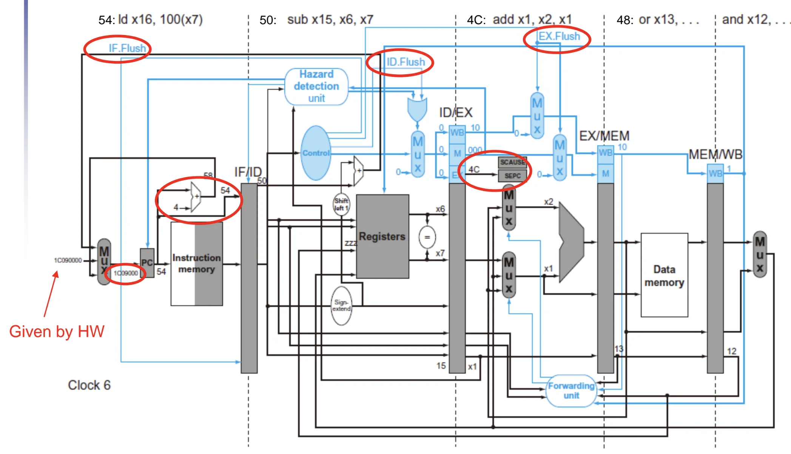
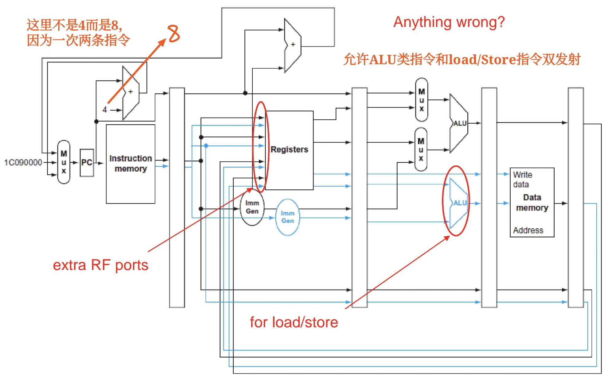
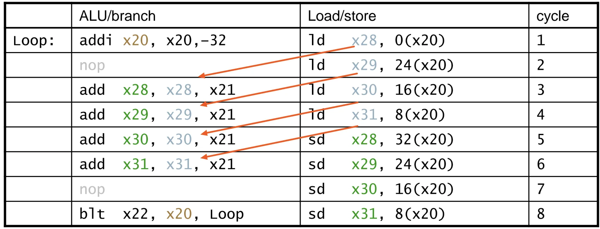
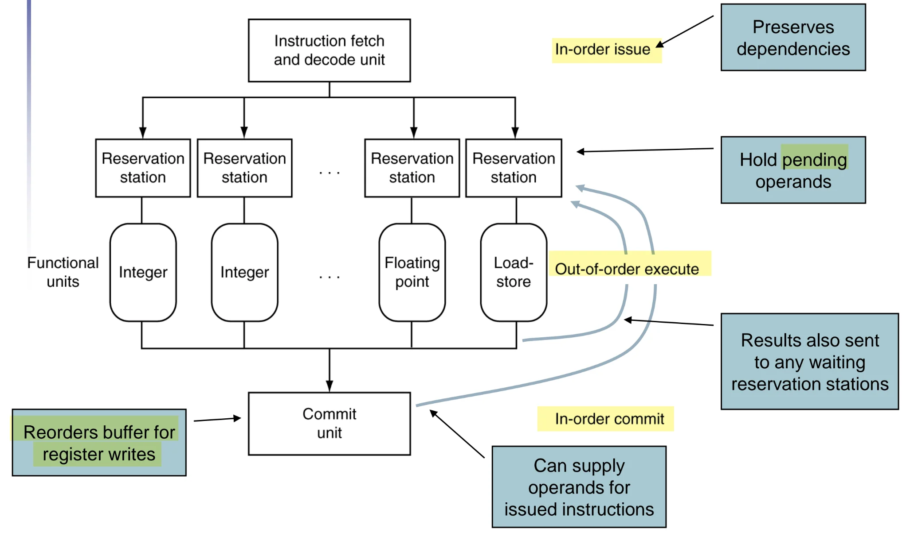

# 第四章：处理器架构与流水线设计 (Part 2)

## VII. Exceptions and Interrupts

"Unexpected" events requiring change in flow of control. Different ISAs use the terms differently.

最典型的有两种：

1. Exception/Trap: 发生在 CPU 内部的事件，如除零错误、MEM 比特翻转等。
2. Interrupt: 发生在外部设备，例如键盘输入、网络数据到达等。

### 7.1 ISA 与异常 (ISA and Exception)
不同的高级语言对异常（如算术溢出）的处理方式不同：

**(1) 忽略溢出的语言（如 C 语言）**：RISC-V 默认的 `add`, `addi`, `sub` 等指令**不会**因为溢出而产生异常。
**(2) 抛出异常的语言（如 Ada, Fortran）**：如果需要检测溢出，RISC-V 并不提供专用的带溢出检测的加法指令，而是通过**额外的分支指令（Branch）**由软件来实现检测。

**1. 无符号数加法**：`addu t0, t1, t2` 后，接 `bltu t0, t1, overflow` (若和小于任一加数，说明进位溢出)。
**2. 有符号数加法**：判断逻辑更复杂，需要判断符号位是否发生异常翻转（如正+正=负，负+负=正）。例如：

```assembly
add t0, t1, t2
slti t3, t2, 0  # t3 = (t2<0)
slt t4, t0, t1  # t4 = (t1+t2<t1)
bne t3, t4, overflow  # 如果 t2<0 且 t1+t2>=t1，或 t2>=0 且 t1+t2<t1，则发生溢出
```

### 7.2 异常/中断的处理机制 (Handling Exceptions)
为了让操作系统（OS）能够接管并处理异常，硬件必须自动完成以下操作：

**(1) 保存现场**：
   
   - 记录发生异常/被中断的指令的 PC 值。在 RISC-V 中，保存在 **SEPC (Supervisor Exception Program Counter)** 寄存器中。`SEPC` 是专用寄存器，软件无法控制。
   - 记录异常发生的原因。在 RISC-V 中，保存在 **SCAUSE (Supervisor Exception Cause)** 寄存器中。

**(2) 跳转到处理程序 (Handler)**：

   - **向量中断 (Vectored Interrupts)**：根据不同的异常原因，直接跳转到对应的地址（例如：未定义操作码跳转到 `C000 0000`，溢出跳转到 `C000 0020`）。
   - **单一入口点 (Single entry point)**：所有异常跳到同一个基地址（如 `1C090000`），然后由软件读取 SCAUSE 寄存器，再利用 `switch-case` 跳转到具体的处理函数。

!!! note "处理程序 (Handler) 的执行动作"
    (1) 读取 SCAUSE 确定原因并执行相应动作。
    (2) **如果是可恢复的 (Restartable)**：处理完毕后，利用 SEPC 寄存器的值返回原程序，重新取指（Refetch）并从头执行该指令。
    (3) **如果是不可恢复的 (Otherwise)**：终止程序，并利用 SEPC 和 SCAUSE 报告错误（如常见的段错误 Segfault）。

### 7.3 流水线中的异常处理硬件实现 (Exception in Pipeline)


假设在 EX 阶段的 `add` 指令发生了异常：

1. **硬件冲刷 (Flush)**：硬件会发出 `IF.Flush`, `ID.Flush`, `EX.Flush` 信号，将该指令以及正在 IF、ID 阶段跟随它的后续指令全部清空，替换为气泡（Bubble / nop）。同时将**异常指令的 PC 值保存到 SEPC 寄存器中**，将**异常原因保存到 SCAUSE 寄存器中**。
2. **重定向 PC**：硬件强制将 PC 的多路选择器（MUX）切换，把下一条指令的取指地址指向 Exception Handler 的入口地址（如 `1C090000`）。
3. 之前已经进入 MEM 和 WB 阶段的指令（处于故障指令之前的指令）允许正常执行完毕，保证机器状态的精确性（Precise Exception）。





## VIII. 指令级并行 (Instruction-Level Parallelism, ILP)
为了进一步提升 CPU 性能（降低 CPI），必须挖掘指令级并行。

* **时间并行 (Temporal Parallelism)**：**加深流水线**（Deeper pipeline）。每级流水线的工作量变少，时钟频率（Clock rate）可以更高。但**代价**是：**控制冒险和异常带来的冲刷惩罚**（Penalty）变得更大。
* **空间并行 (Spatial Parallelism)**：增加多个功能单元（Multiple function units），例如设计多个 ALU。

### 8.1 多发射技术 (Multiple Issue)
结合空间与时间并行，允许在**同一个时钟周期内启动多条指令**。**此时 CPI < 1**，因此通常使用 **IPC (Instructions Per Cycle)** 来衡量性能。多发射面临严重的数据依赖挑战，主要分为两派：

1. **静态多发射 (Static multiple issue)**：依赖**编译器 (Compiler)**。编译器负责检测冒险，并将没有依赖关系的指令打包在一起（Issue packet）。这种架构常被称为 **VLIW (Very Long Instruction Word，超长指令字)**。
2. **动态多发射 (Dynamic multiple issue)**：依赖 **CPU 硬件 (HW)**。CPU 在运行时动态检查指令流，决定每个周期发射哪些指令。硬件利用**乱序执行**（Out-of-Order）、**重命名**等高级技术在运行时**解决冒险**（超标量 Superscalar 架构通常用此方法）。

### 8.2 RISC-V 静态双发射架构设计 (RISC-V Static Dual Issue)

#### 8.2.1 Architecture

以一种简单的 VLIW 思想实现的 RISC-V 双发射为例，该双发射为**一条 `ALU/Branch` 指令和一条` Load/Store` 指令的组合**。流水线架构图：





* **发射包 (Issue Packet)**：64-bit 对齐（包含 2 条 32-bit 指令）。
* **组合限制**：为了简化译码器和发射逻辑，严格规定一条是 `ALU/Branch` 指令，另一条是 `Load/Store` 指令。如果某类指令缺失，必须用 `nop` (气泡) 填充。

**硬件架构的修改**：
为了支持双发射，数据通路（Datapath）需要付出额外的硬件成本：
1. **寄存器堆 (Register File, RF) 端口增加**：两条指令同时读取和写入，RF 需要增加到**额外的读端口和写端口**（例如需要 4个读端口，2个写端口）。
2. **增加额外的 ALU**：原本五级流水线中**唯一的 ALU 不能同时处理数据运算和内存地址计算**，必须为 `Load/Store` 流水线单独增加一个**用于地址计算**的 ALU/Adder。

#### 8.2.2 Hazards in the Dual-Issue RISC-V

双发射架构中，更多的指令并行执行，此时冒险的情况更复杂，主要有以下几类：

**(1) EX data hazard**

单发射中通过 fwd 结构可以解决如下 stall 的问题：

```assembly
add x11, x12, x13
load x20, 0(x11)  # 需要 x11 的值，但 x11 在 EX 阶段才计算出来
```

这种情况必须切分为两个指令包，因此会产生 stall /

**(2) Load-use hazard**

Still **one cycle use latency**, but now **two instructions** are affected.

**(3) More aggressive scheduling required**


#### 8.2.3 Scheduling Example
以如下RISC-V循环代码为例，展示静态双发射的指令调度优化：
```assembly
Loop:
ld    x31, 0(x20)   # x31=array element
add   x31, x31, x21 # add scalar in x21
sd    x31, 0(x20)   # store result
addi  x20, x20, –8  # decrement pointer
blt   x22, x20, Loop # branch if x22<x20
```

**基础双发射调度结果**
严格遵循「1条ALU/branch + 1条Load/Store」的发射包规则，调度后每个周期的指令包如下：

|  | ALU/branch | Load/store | cycle |
| --- | --- | --- | --- |
| Loop: | <span style="color:red">nop</span> | ld x31 , 0(x20) | 1 |
|  | addi x20 , x20, –8 | <span style="color:red">nop</span> | 2 |
|  | add x31 , x31 , x21 | <span style="color:red">nop</span> | 3 |
|  | blt x22, x20 , Loop | sd x31 , 8(x20) | 4 |


### 8.3 循环展开 (Loop Unrolling) 优化
循环展开是挖掘ILP的核心编译器优化手段，核心思想是**复制循环体，减少循环控制指令的开销，暴露更多可并行的指令**，配合多发射技术进一步提升IPC。

#### 8.3.1 单发射架构下的循环展开
以上述循环代码为例，4次循环展开后的基础代码如下：
```assembly
Loop:
ld    x28, 0(x20)
add   x28, x28, x21
sd    x28, 0(x20)
ld    x29, -8(x20)
add   x29, x29, x21
sd    x29, -8(x20)
ld    x30, -16(x20)
add   x30, x30, x21
sd    x30, -16(x20)
ld    x31, -24(x20)
add   x31, x31, x21
sd    x31, -24(x20)
addi  x20, x20, -32
blt   x22, x20, Loop
```
- 优化收益：原本1次循环需要1条`addi`+1条`blt`，4次循环展开后，**循环控制指令的开销**降低为原来的1/4。
- 代价：**需要占用更多的通用寄存器**（x28~x31），同时代码体积增大。

#### 8.3.2 循环展开+流水线调度
在循环展开的基础上，编译器可**通过指令重排，规避Load-use等数据冒险**，进一步消除流水线气泡。优化后的指令序列如下：
```assembly
Loop:
ld    x28, 0(x20)
ld    x29, -8(x20)
ld    x30, -16(x20)
ld    x31, -24(x20)
add   x28, x28, x21
add   x29, x29, x21
add   x30, x30, x21
add   x31, x31, x21
sd    x28, 0(x20)
sd    x29, -8(x20)
addi  x20, x20, -32
sd    x30, 16(x20)
sd    x31, 8(x20)
blt   x22, x20, Loop
```
核心优化逻辑：将**所有Load指令提前**，利用**Load的延迟间隙**完成其他指令的执行，彻底消除Load-use冒险带来的流水线停顿。

#### 8.3.3 多发射+循环展开的联合优化
将静态双发射与4次循环展开结合，最终调度结果如下：

|  | ALU/branch | Load/store | cycle |
| --- | --- | --- | --- |
| Loop: | addi x20 , x20,–32 | ld x28 , 0(x20) | 1 |
|  | nop | ld x29 , 24(x20) | 2 |
|  | add x28 , x28 , x21 | ld x30 , 16(x20) | 3 |
|  | add x29 , x29 , x21 | ld x31 , 8(x20) | 4 |
|  | add x30 , x30 , x21 | sd x28 , 32(x20) | 5 |
|  | add x31 , x31 , x21 | sd x29 , 24(x20) | 6 |
|  | nop | sd x30 , 16(x20) | 7 |
|  | blt x22, x20 , Loop | sd x31 , 8(x20) | 8 |

- 性能收益：8个周期完成14条有效指令，**IPC = 14/8 = 1.75**，接近双发射架构的理论峰值IPC=2。
- 代价：进一步增加了寄存器占用和代码体积，属于典型的「以空间换性能」的编译器优化。



---

### 8.4 动态多发射 (Dynamic Multiple Issue)
#### 8.4.1 超标量处理器基础
动态多发射架构也被称为**超标量（Superscalar）处理器**，核心特征是：
- 由CPU硬件在运行时**动态决定每个周期发射0、1、2条**甚至更多指令，自动规避结构冒险和数据冒险。
- 无需编译器提前做指令打包和调度，编译器的指令重排仅起辅助优化作用。
- 由硬件保证代码语义的正确性，支持**按序发射（In-order issue）** 或**乱序发射**。

#### 8.4.2 动态流水线调度与乱序执行 (Out-of-Order, OOO)
动态调度的核心能力是**允许CPU乱序执行指令，以规避流水线停顿，但最终按序提交结果到寄存器**，保证程序执行的语义正确性。

**示例**：如下指令序列中，`add`指令依赖`ld`的结果，会产生Load-use停顿，但`sub`和`andi`指令与前后指令无依赖，可在`ld`的延迟间隙提前执行：
```assembly
ld    x31, 0(x21)   ->  ld    x31, 0(x21)
add   x1, x31, x2   ->  sub   x23, x23, x3
sub   x23, x23, x3  ->  add   x1, x31, x2
andi  x5, x23, 20   ->  andi  x5, x23, 20
```
执行逻辑：CPU可在等待`ld`从内存读取数据的同时，先完成`sub`指令的执行，充分利用流水线资源，消除无效停顿。

#### 8.4.3 动态调度CPU的核心结构
动态调度CPU的核心流水线结构分为三大阶段，严格遵循「**按序取指发射、乱序执行、按序提交**」的核心原则：



1. **按序取指与译码阶段**
   指令取指单元按程序顺序取指，完成译码后，将指令发送到对应的保留站（Reservation Station），保证指令发射的顺序性。

2. **乱序执行阶段**
   - 保留站：**缓存待执行指令的操作数**，等待操作数准备就绪后，立即将指令发送到对应的功能单元执行，无需等待前序无关指令完成。
   - 功能单元：包含**多个并行**的整数ALU、浮点单元、Load-Store单元，支持指令并行执行。
   - 执行结果会同时**广播到所有等待该结果的保留站**，以及**重排序缓冲区**（Reorder Buffer, ROB）。

3. **按序提交阶段**
   - 重排序缓冲区ROB：缓存所有已完成执行但尚未提交的指令结果，**严格按照程序原始顺序，将结果提交到寄存器堆/内存**。
   - 提交单元：保证异常发生时，CPU状态可回滚到异常指令之前的精确状态，实现精确异常。

#### 8.4.4 动态调度的核心优势
相比于编译器主导的静态调度，硬件动态调度的核心价值在于：
1. 可**处理运行时才能确定的停顿**，例如 **Cache 缺失带来的访存延迟**，这类停顿编译器无法提前预测。
2. 可应对分支指令的动态执行结果，无需编译器做保守的调度规划。
3. **兼容同一ISA的不同硬件实现**，无需针对不同流水线深度、指令延迟重新编译代码，保证了二进制代码的兼容性。

---

### 8.5 指令级并行与功耗效率
指令级并行的挖掘会带来显著的硬件复杂度提升，而复杂度的上升直接导致功耗的增长：
- 动态调度、分支预测、乱序执行等高级ILP技术，需要大量的硬件缓存、比较电路和广播总线，带来了极高的静态和动态功耗。
- 当硬件复杂度和功耗上升到一定阈值后，「**多个简单的顺序执行核心**」相比「单个复杂的超标量乱序核心」，往往能获得更好的能效比。

---

## IX. 流水线设计的谬误与陷阱
### 9.1 常见谬误
1. **「流水线设计很简单」**
   流水线的基础原理易于理解，但工程实现的难点在于细节：包括**数据冒险的精准检测**、转发逻辑的设计、精确异常的实现、**多发射**下的冒险规避等，都需要极复杂的硬件设计。

2. **「流水线设计与底层技术无关」**
   流水线技术的落地高度依赖半导体工艺的发展：更多的晶体管数量，才能支撑更深度的流水线、更多的功能单元、更复杂的动态调度逻辑。ISA的流水线相关设计，必须匹配当前的半导体技术趋势。

### 9.2 常见工程陷阱
糟糕的ISA设计会大幅增加流水线实现的难度：
- 复杂指令集（如VAX、IA-32）：变长指令、复杂寻址模式、指令带寄存器更新副作用等特性，会给流水线的译码、发射、冒险检测带来极大的开销，IA-32架构最终采用「宏指令转微操作（micro-op）」的方案来适配流水线设计。
- 延迟分支：在深度流水线架构中，延迟槽的数量会随流水线深度增加，给编译器和硬件设计都带来额外负担。

---

## X. 本章总结
1. 指令集架构（ISA）与处理器的数据通路、控制逻辑设计相互影响、相互制约。
2. 流水线技术通过时间并行提升指令吞吐量，让多个指令在同一时钟周期内处于不同的执行阶段，但**单条指令的执行延迟并未降低**。
3. 流水线的核心瓶颈是三类冒险：结构冒险、数据冒险、控制冒险，需要通过转发、停顿、分支预测、冲刷等技术解决。
4. 异常与中断的处理，核心是保证精确异常，硬件需自动保存异常现场（SEPC、SCAUSE），并跳转到处理程序，处理完成后可恢复原程序执行。
5. 指令级并行（ILP）是提升处理器性能的核心手段，分为两大技术路线：
   - 静态多发射（VLIW）：依赖编译器完成指令打包、调度和循环展开优化，硬件复杂度低。
   - 动态多发射（超标量）：依赖硬件实现乱序执行、动态调度，可挖掘更多运行时的并行性，但硬件复杂度和功耗更高。
6. 指令级并行的挖掘存在物理上限，硬件复杂度带来的功耗墙，是ILP技术发展的核心制约。