# 第四章：处理器架构与流水线设计

## I. 单周期数据通路构建 (Building a Single-Cycle Datapath)

这一部分主要讲解如何将处理器的各个基础元件（寄存器、ALU、多路复用器、存储器等）逐步拼接起来，形成一个能够在一个时钟周期内完整执行指令的数据通路。我们将基于一个简单的 RISC-V 指令子集（如 `lw`, `sw`, `add`, `sub`, `beq` 等）来进行增量式构建。

数据通路定义：Elements that **process** or **hold** data and addresses in the CPU.

### 1.1 指令执行的通用步骤
对于所有的 RISC-V 指令，其执行的前两步总是相同的：

1. **取指 (Fetch)**：根据程序计数器（PC）的值，从指令存储器中取出对应的指令。
2. **译码与读寄存器 (Decode & Read Registers)**：根据指令中指定的寄存器编号，从寄存器文件（Register File）中**读取一个或两个寄存器操作数**。

接下来的步骤会根据指令的类别有所不同，但基本都包含以下操作：

* **使用 ALU 进行计算地址或者数据**：用于算术/逻辑运算结果、计算访存地址或计算分支目标地址。
* **访问数据存储器 (Data Memory)**：针对 `Load`/`Store` 指令读取或写入数据。
* **更新 PC**：将 PC 更新为下一条指令的地址（`PC + 4` 或分支目标地址）。

### 1.2 取指模块 (Instruction Fetch)
取指模块的核心任务是获取当前指令并更新 PC 准备获取下一条指令。

* PC 寄存器指向当前指令地址。
* 由于 RISC-V 指令长度固定为 32 位（即 4 个字节），因此计算下一条连续指令的地址只需将 PC 的值加 4。

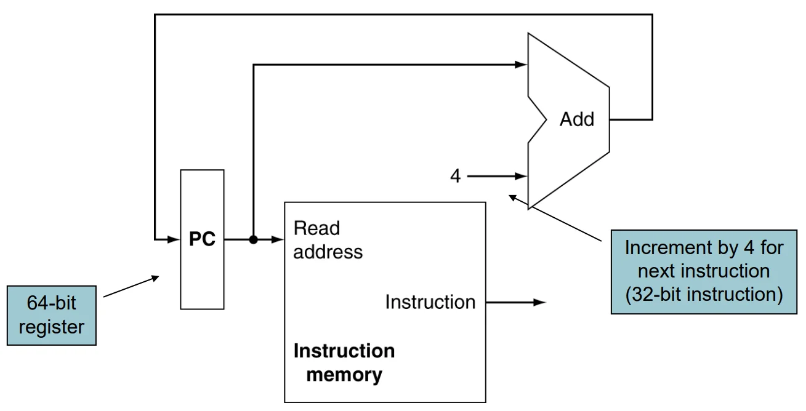
> In RISC-V, PC is affected only indirectly by **certain instructions**. It is **NOT an architecturally-visible** register

### 1.3 R型指令数据通路 (R-Format Instructions)
R 型指令（如 `add`, `sub`）主要涉及寄存器之间的算术逻辑运算。

* **输入**：从寄存器文件中读取两个源寄存器操作数（需要多端口寄存器文件支持）。
* **执行**：ALU 根据指令要求进行(**EX**)算术/逻辑运算。
* **输出**：将 ALU 计算的结果写回(**WB**)目标寄存器。

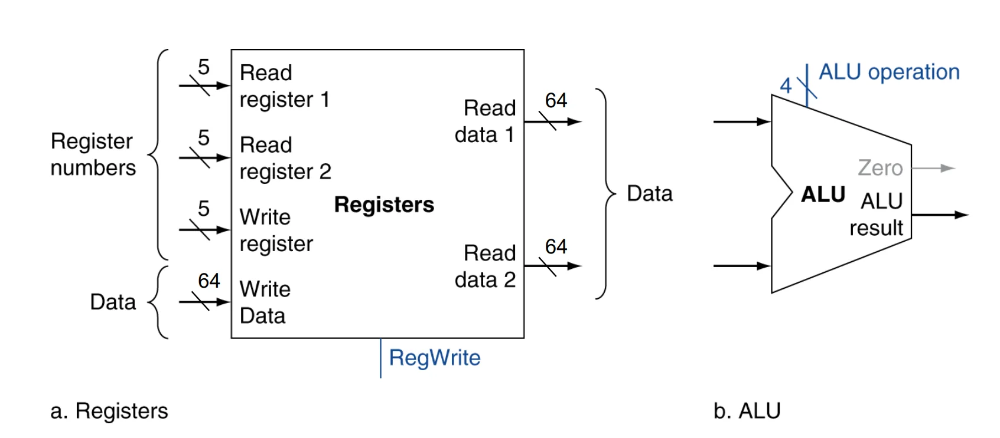

### 1.4 访存指令数据通路 (Load/Store Instructions)
访存指令（`lw` / `sw`）需要访问数据存储器，其核心在于内存地址的计算。

* **地址计算(EX)**：读取基址寄存器的值，并加上一个 12 位的**立即数偏移量**（Offset）。由于 ALU 处理的是 64 位（或 32 位）数据，这个 12 位的偏移量需要先通过**符号扩展 (Sign-extend)** 转换为完整的字长。
* **Load (加载)**：从数据内存中读取该地址的数据，并更新回(**WB**)寄存器文件。
* **Store (存储)**：将第二个源寄存器中的值写入到计算出的内存地址中。

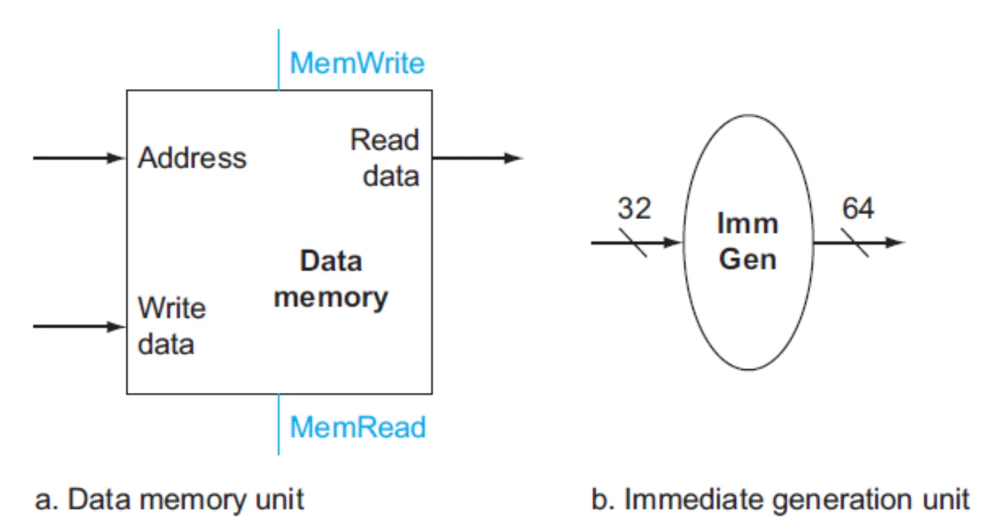

### 1.5 分支指令数据通路 (Branch Instructions)
以 `beq` (Branch if Equal) 为例，分支指令，例如：
```risc
beq x20, x21, L # branch to L
```
需要完成**比较和目标地址计算**两件事：

1. **比较操作数**：读取两个源寄存器，送入 ALU 进行**减法 (subtract)** 运算。如果两个值相等，ALU 的 `Zero` 标志位会输出 1。
2. **计算目标地址**：
   * 将指令中的位移量（立即数）进行符号扩展。
   * **左移 1 位 (Left shift by 1)**：因为 RISC-V 的指令以**半字（2字节）或字（4字节）对齐**，最低位必定是0，所以指令中省略了最低位的0以扩大寻址范围，此处需要左移还原真实偏移量。
   * 将偏移量与当前 PC 值相加，得到跳转目标地址。

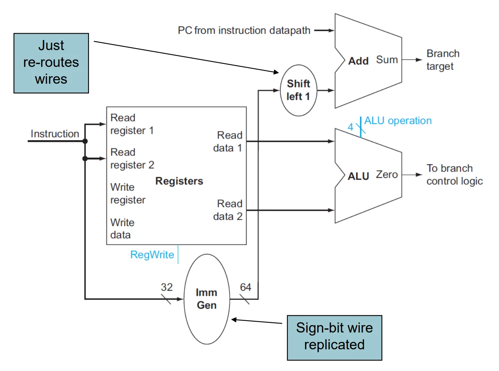

### 1.6 整合：完整的单周期数据通路
单周期数据通路的原则是**一条指令必须在一个时钟周期内完成**。这就意味着一个数据通路元件（如加法器、存储器）在同一周期内只能被使用一次。

* 因此我们需要分离**指令存储器**和**数据存储器**（这体现了哈佛架构的思想）。
* 当多条指令需要使用同一个部件但数据源不同的时候，我们需要引入**多路复用器 (Multiplexers, Mux)** 来进行数据路径的选择。

首先拼接 R型 与 访存指令 的数据通路（引入了控制 ALU 输入来源的 MUX 以及控制写入寄存器数据来源的 MUX）：
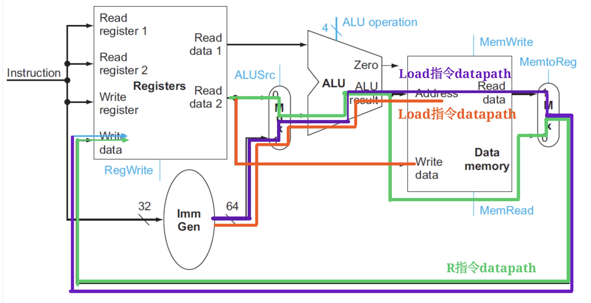

随后加上分支指令的数据通路（在 PC 的输入端引入 MUX，决定 PC 下一周期是 `PC+4` 还是 分支目标地址）：

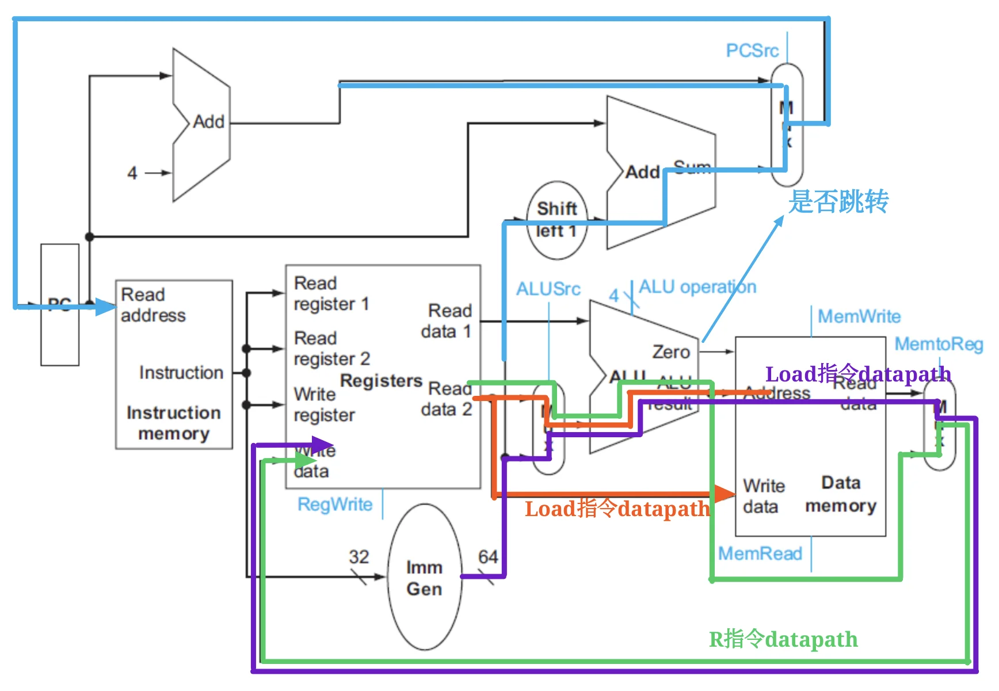
> *这是未经加入控制信号单元前，最完整的单周期裸数据通路全貌图。请注意观察图中各个多路复用器（Mux）的位置，它们为后续引入控制信号埋下了伏笔。*


## II. 控制单元设计 (Datapath With Control)

在搭建好包含各种多路复用器（MUX）的完整数据通路后，我们需要一个 **“大脑”** 来指挥这些硬件如何协同工作。这个 **“大脑”** 就是 **控制单元 (Control Unit)**。它通过分析指令的内容（主要是操作码 Opcode 等字段），生成一系列高低电平的控制信号，以控制数据流向和组件的行为。

### 2.1 引入控制信号的完整数据通路
主控制单元（Main Control）接收指令的低 7 位（`Instruction [6:0]`，即 Opcode）作为输入，产生对应的控制信号，用于控制：

*   **多路复用器 (MUX) 的选择端**（决定数据走哪条路，例如 ALU 的输入是寄存器还是立即数）。
*   **组件的读写使能端**（如寄存器写使能 `RegWrite`，内存读/写使能 `MemRead` / `MemWrite`）。
*   **ALU 操作的大致方向**（通过 `ALUOp` 信号送给 ALU 控制模块）。

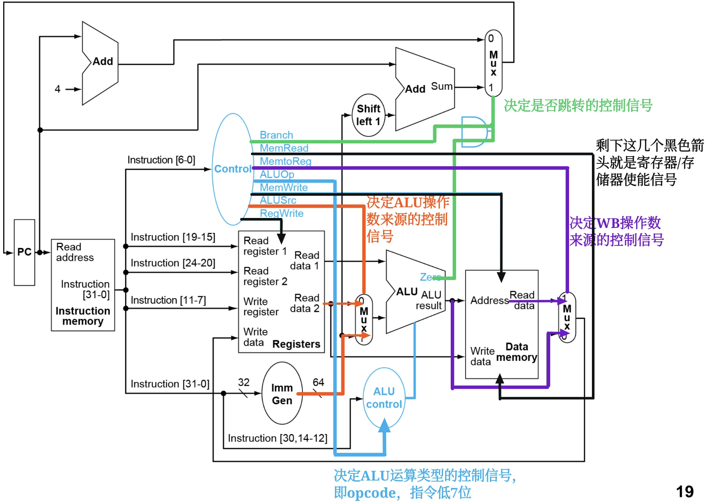

### 2.2 不同指令的控制路径图解
不同的指令在执行时，控制单元会激活数据通路上的特定路径。课件中展示了三种典型指令激活的路径：

*   **R型指令 (如 add, sub)**：控制单元让 MUX 选择第二个寄存器的值进入 ALU，并且选择 ALU 的计算结果写回寄存器，同时禁用数据内存的读写。
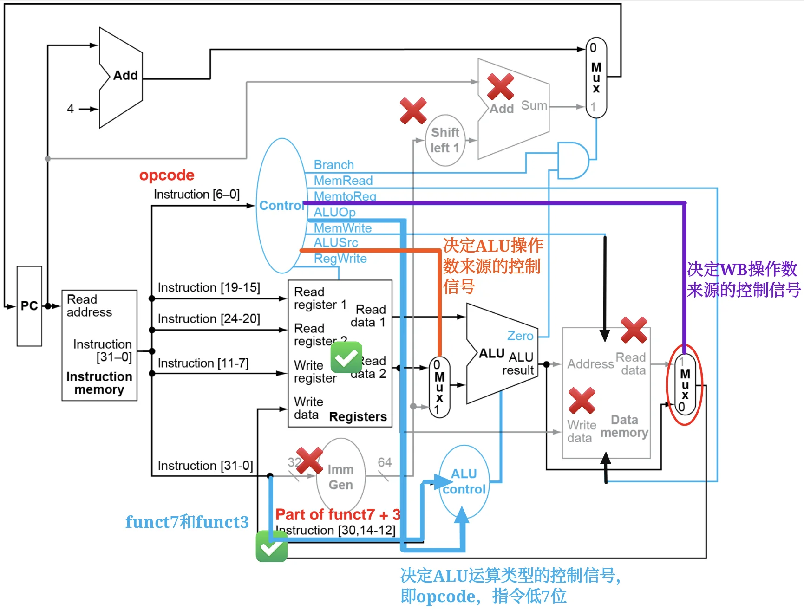

*   **Load 指令 (I-Type，如 lw)**：控制信号控制 MUX，将符号扩展后的立即数送入 ALU（用于计算地址），激活 `MemRead` 读内存，并控制最后的 MUX 将内存读出的数据（Data of store）写回目标寄存器。
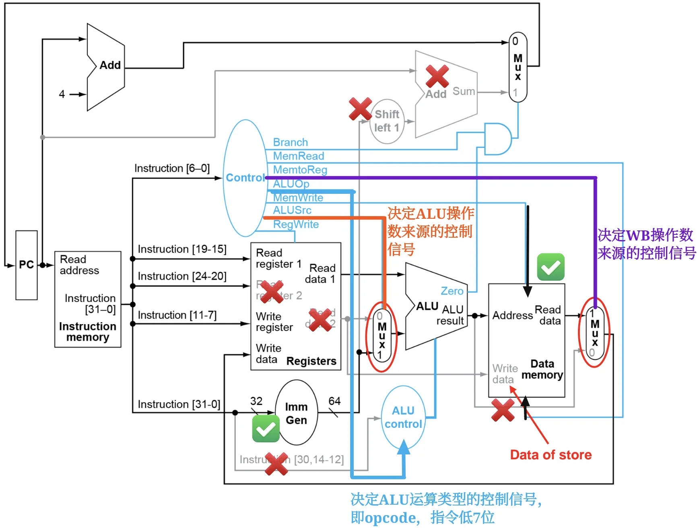

*   **分支指令 (SB-Type，如 beq)**：ALU 执行减法来比较寄存器是否相等。如果相等（ALU 输出 `Zero = 1`），且控制信号 `Branch` 有效，两者经过一个 AND 门，控制位于 PC 前面的 MUX，选择目标跳转地址作为下一个 PC 值。同时不需要写回寄存器或内存。
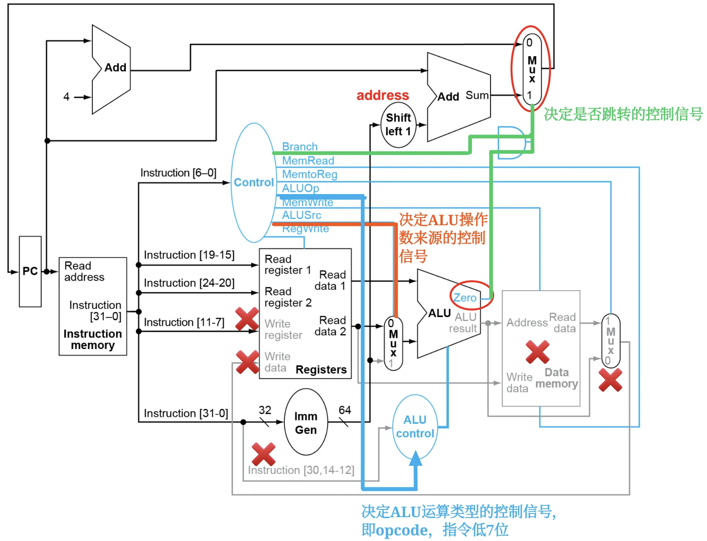

### 2.3 ALU 的多级解码控制 (ALU Control)
为了降低主控制单元的复杂性，RISC-V 采用了**多级解码 (Multiple levels of decoding)** 的组合逻辑设计：将控制分摊给主控制单元和 ALU 控制单元。

1.  **主控制单元**：首先根据 Opcode 生成一个 **2 位的 `ALUOp`** 信号，表示指令的大类操作：
    *   `00`：用于 **Load/Store**（需要做加法计算地址）。
    *   `01`：用于 **Branch**（需要做减法比较大小）。
    *   `10`：用于 **R型指令**（具体做什么运算需要进一步看指令的 `funct` 字段）。
2.  **ALU 控制单元**：接收主控制器发出的 `ALUOp [1:0]` 信号，结合指令中的 `funct7`（部分位数）和 `funct3` 字段，最终输出一个 **4 位的 ALU 控制信号**，直接指挥 ALU 执行具体的算术/逻辑操作（如 add, sub, and, or）。

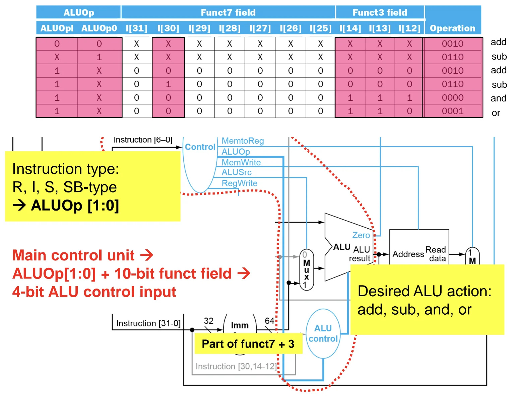
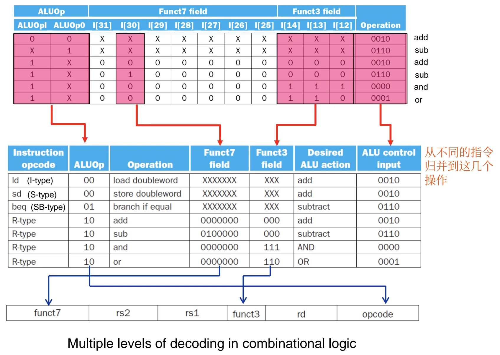
> 图表详细展示了 `ALUOp` 结合 `funct7` 和 `funct3` 生成 4 位最终控制信号（0010/0110/0000/0001）的真值表逻辑及多级解码架构。*

### 2.4 主控制单元信号的直接推导 (Main Control Unit)
通过对 RISC-V 指令格式（R-type, I-type, S-type, SB-type）的字段划分可以看出，控制信号可以完全**由当前指令的操作码纯粹通过组合逻辑推导出来**。

*   操作码（Opcode）**始终位于**指令的最低 7 位 `[6:0]`。
*   无论指令类型如何，源寄存器 `rs1` 和 `rs2` 的位置始终固定。
*   这种**极具规律的设计，大大简化了控制单元的硬件复杂度**。

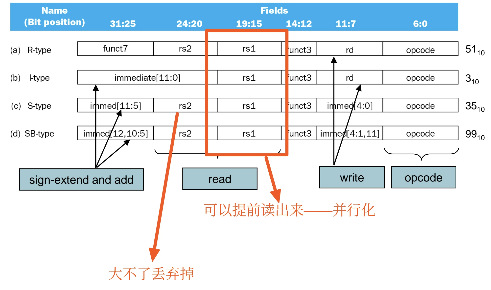
> *图中对比了各类指令的字段划分（如 immediate, rs1, funct3, rd, opcode 的固定位置），直观展现了 RISC-V 指令集规整性对控制单元设计的极大便利。*

## III. 流水线的基本概念与性能分析 (Overview of Pipelining)

前面设计的单周期处理器虽然逻辑清晰，但在实际应用中存在致命的性能缺陷。为了提升处理器的吞吐量，现代微处理器广泛引入了**流水线 (Pipelining)** 技术。

### 3.1 单周期设计的性能瓶颈
* **木桶效应**：单周期处理器的时钟周期必须足以容纳**耗时最长的那条指令**（即关键路径）。
* **关键路径 (Critical Path)**：**通常是 `Load` 指令**。其路径覆盖了几乎所有组件：**指令内存 $\Rightarrow$ 寄存器文件读取 $\Rightarrow$ ALU 运算 $\Rightarrow$ 数据内存读取 $\Rightarrow$ 寄存器文件写回**。（课件示例中，Ld 指令耗时 800ps，导致时钟周期必须设定为 800ps）。
* 这种设计导致执行其他简单指令（如耗时仅 500ps 的分支指令）时，大量的时间和硬件资源处于闲置等待状态。
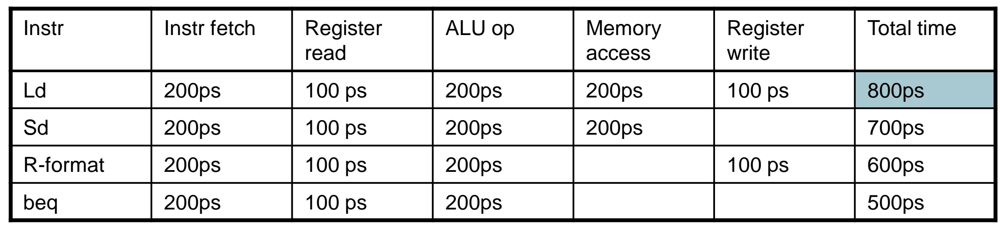

### 3.2 流水线的核心思想
流水线借鉴了工业流水线（如课件中的“洗衣服”类比）的思想，通过**重叠执行 (overlapping execution)** 来实现**时间上的并行性 (Temporal parallelism)**。

* 将一条指令的执行过程划分为多个耗时相近的子阶段。
* 每个子阶段由专用的硬件模块完成。
* 一条指令进入下一个阶段时，下一条指令立刻进入当前阶段。
* **核心优势**：流水线通过提高整体吞吐量（Throughput）来提升性能，而并不是缩短单条指令的执行时间（Latency）。

### 3.3 RISC-V 的经典五级流水线
RISC-V 处理器的流水线通常被划分为以下五个标准的阶段（**每个阶段占用一个机器周期**）：

1. **IF (Instruction Fetch)**：从内存中**取指令**。
2. **ID (Instruction Decode & Register Read)**：指令**译码**并**读取寄存器操作数**。
3. **EX (Execute operation or calculate address)**：**ALU** 执行算术逻辑运算，或计算访存/跳转目标地址。
4. **MEM (Access memory operand)**：**访问数据存储器**（仅 Load/Store 指令需要，其他指令在此阶段通常处于**空闲**状态）。
5. **WB (Write result back to register)**：将结果**写回**寄存器文件。

### 3.4 流水线性能对比与加速比计算
与单周期对比，流水线带来了显著的性能飞跃：

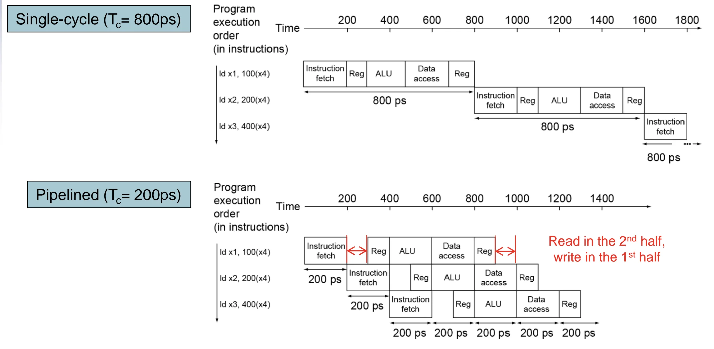
> *⚠️ 图中红字重点提醒：为了解决数据在同一周期内同时读写的冲突（结构冒险），寄存器文件被设计为**“前半周期写，后半周期读 (Write in the 1st half, Read in the 2nd half)”**。*

**(1) 理想加速比公式**：如果在理想状态下（各阶段**完全平衡**，且无冒险暂停）：

$$\text{Time between instructions}_{\text{pipelined}} = \frac{\text{Time between instructions}_{\text{non-pipelined}}}{\text{Number of pipeline stages}}$$

$$ 理想加速比 = \frac{单周期指令耗时}{流水线单阶段耗时} = 流水线级数 $$

**(2) 为什么不能无限增加级数？**
  * 阶段划分不能无限细（各个阶段耗时难以绝对均衡）。
  * 流水线阶段之间需要插入**流水线寄存器**（Pipeline Registers），这会带来额外的**硬件开销和时间延迟**。

### 3.5 面向流水线设计的指令集架构 (Pipelining and ISA Design)
RISC-V 指令集天生就是为流水线量身定制的，其优秀的 ISA 特性让流水线实现变得非常简单：

* **所有指令长度固定（32位）**：使得 **IF 阶段可以在单个周期内轻松完成取指**（相比之下 x86 指令长度从 1 到 15 字节不等，极难流水化）。
* **指令格式少且规整**：寄存器编号**位置固定**，处理器可以在 ID 阶段**一边译码，一边同时读取寄存器**。
* **Load/Store 寻址模式简单**：可以在 EX（第3阶段）专门计算地址，在 MEM（第4阶段）专门访问内存，各个阶段职责分明。


## IV. 五级流水线数据通路设计 (Pipelined Datapath)

在明确了流水线的五级划分（IF, ID, EX, MEM, WB）之后，我们需要对原有的单周期数据通路进行物理改造。其核心在于打破单周期内一通到底的信号流，将其分隔为独立的五个运作区间。

### 4.1 流水线寄存器 (Pipeline Registers)
为了将执行阶段隔离开来，我们必须在相邻的流水线级之间插入**流水线寄存器**。这些寄存器的作用是**保存前一个周期产生的、供后续周期使用的信息（数据和控制信号）**。
处理器中一共需要四个流水线寄存器，分别命名为：

1. **IF/ID** 寄存器
2. **ID/EX** 寄存器
3. **EX/MEM** 寄存器
4. **MEM/WB** 寄存器

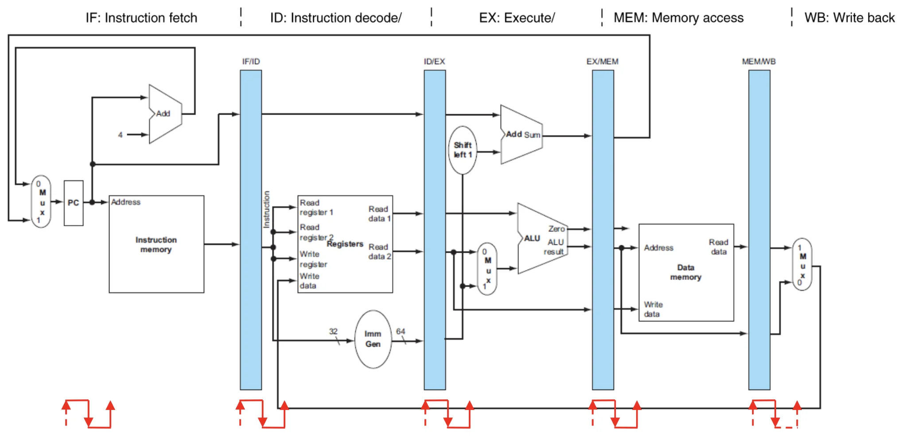
> *图中新增的四条垂直的浅蓝色竖条即为流水线寄存器。需要注意的是，大部分信号是**从左向右 (Left-to-right)** 流动的，但有两种情况是**从右向左 (Right-to-left)** 流动的：一是 WB 阶段写回寄存器文件，二是计算出的下个 PC 值写回 PC 寄存器。这种反向的数据流向是导致流水线“冒险 (Hazards)”的原因之一。*

### 4.2 指令在流水线中的流转（以 Load 指令为例）
我们以一条 `lw`（Load）指令为例，看看数据是如何在各个阶段中穿梭的：

* **IF (取指)**：从指令内存中取出指令，并存入 `IF/ID` 寄存器；同时 `PC+4` 的值也存入该寄存器，以备后续可能使用。
* **ID (译码)**：利用 `IF/ID` 中的指令读取寄存器文件，将读出的两个操作数，连同符号扩展后的立即数一起，存入 `ID/EX` 寄存器。
* **EX (执行)**：从 `ID/EX` 取出基址和立即数进入 ALU 计算内存地址，将计算得到的地址存入 `EX/MEM` 寄存器。
* **MEM (访存)**：利用 `EX/MEM` 中的地址去读取数据内存，将读出的数据存入 `MEM/WB` 寄存器。

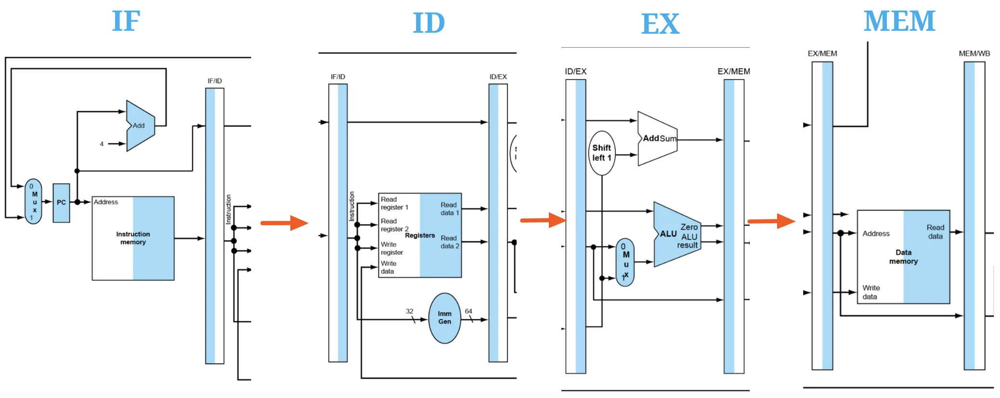

### 4.3 关键避坑：目标寄存器写回的“时空错位”问题
在上述 WB (写回) 阶段中，如果我们直接用此时取指阶段连过来的指令线（Instruction[11:7]）去决定写回哪一个目标寄存器（rd），**会发生严重的逻辑错误！**

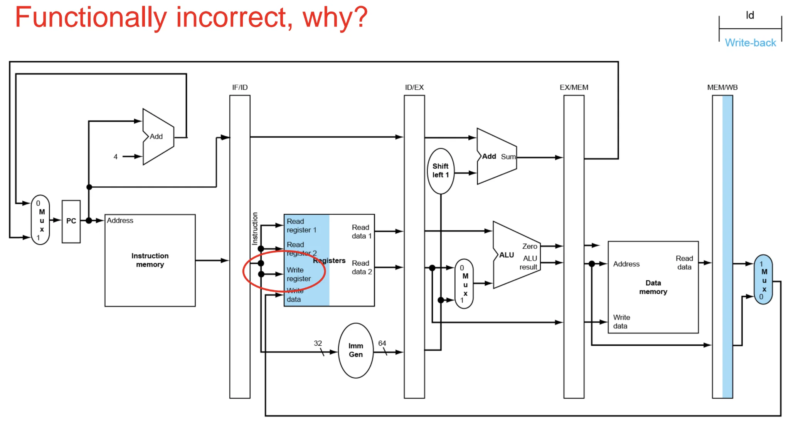
> *图中的红圈标出了错误的地方。因为当 `lw` 指令到达第 5 级（WB 阶段）时，第 1 级（IF 阶段）早就已经是它后面的第 4 条指令了！此时 IF 级暴露出来的 rd 编号是别人的，这样会导致 `lw` 读出的数据写进了错误的寄存器。*

**修正方案 (Corrected Datapath)**：
属于某条指令的任何信息，如果在后面的阶段才用到，就**必须由流水线寄存器一级一级地“接力”向后传递**。
因此，我们需要将 `lw` 指令的目标寄存器编号（`Instruction[11:7]`）存入 IF/ID，传给 ID/EX，传给 EX/MEM，最后传给 MEM/WB。在 WB 阶段时，从 MEM/WB 寄存器中取出该编号并连回寄存器文件的写入端口。

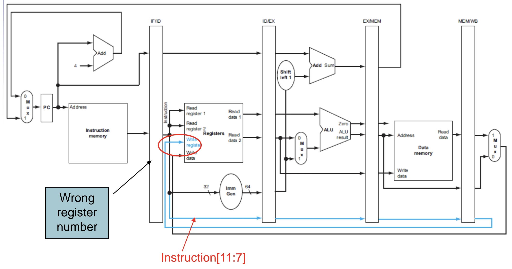
> *图中下方有一条醒目的浅蓝色线（标有 Instruction[11:7]）。这条线展示了正确的寄存器编号是如何穿越重重流水线寄存器，安全抵达写回阶段的。*

### 4.4 其他指令的流转特点（以 Store 为例）
与 Load 相比，Store (`sw`) 指令的前三个阶段基本类似，但在最后两个阶段有所不同：

* **MEM (访存)**：从 `EX/MEM` 中不仅要取出算好的地址，还要**取出要写入的数据（这个数据在 ID 阶段读出后，一直沿着流水线寄存器传到了这里）**，并将其写入内存。
* **WB (写回)**：Store 指令不需要写回寄存器，因此在这个阶段它**什么也不做 (Nothing to do)**。

### 4.5 流水线状态的图示法
为了分析复杂的流水线，我们常用两种图表来表示：

1. **多周期流水线图 (Multi-Cycle Pipeline Diagram)**：横轴是时钟周期，纵轴是指令序列。展示**多条指令在时间轴上的重叠情况**。（分为带有部件图标的详细版，和只写简称的简化版）。

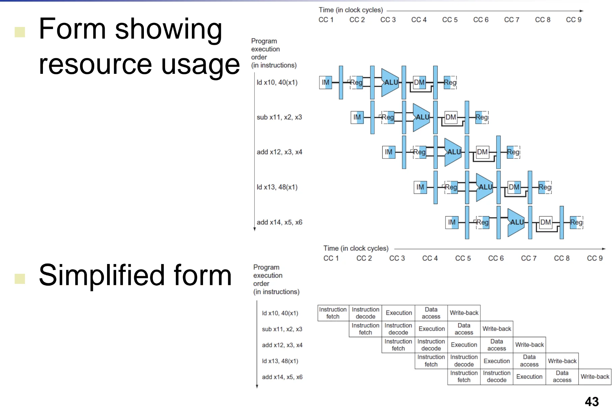

2. **单周期流水线图 (Single-Cycle Pipeline Diagram)**：固定某**一个特定的时钟周期**，宏观地查看当前流水线数据通路中，各个组件分别正在**为哪条指令服务**。

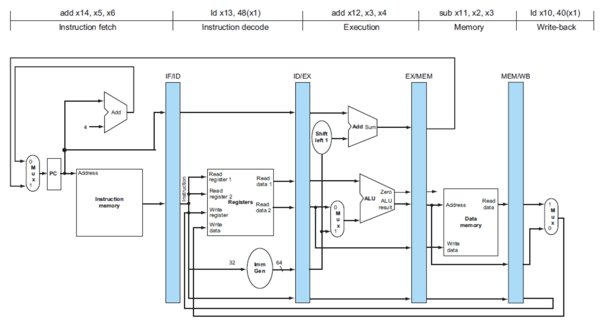

### 4.6 考虑流水线控制信号的完整流水线数据流图

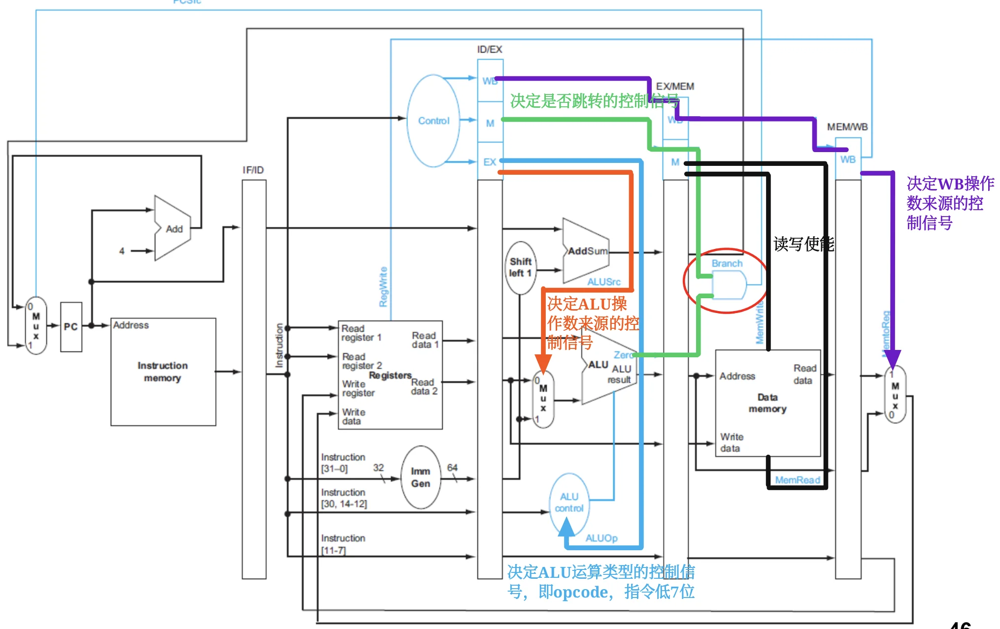

## V. 总结

### 5.1 并行性 (Parallelism) 的分类总结
这是提升处理器性能的最核心思想，课件将其概括为两大类：

1. **时间并行性 (Temporal Parallelism)**：
    * **核心**：流水线技术。
    * **原理**：将任务划分为多个阶段，在时间轴上重叠处理。
    * **优点**：能够有效缩短时钟周期（流水线级数越多，单级工作量越小，频率越高）。
    * **挑战**：处理各种“冒险 (Hazard)”（如数据依赖、跳转预测失效）的代价增大，且如果中断发生，恢复现场更复杂。

2. **空间并行性 (Spatial Parallelism)**：
    * **核心**：多功能单元、多核架构。
    * **原理**：通过复制硬件资源来同时执行多个任务（例如：多个 ALU、多发射技术、多核处理器）。
    * **优点**：直接提升系统的计算处理能力。

### 5.2 流水线总结 (The BIG Picture)
最后对本章的流水线知识进行总结：

* **提高吞吐量**：流水线的初衷是提高单位时间内处理指令的数量（Instruction Throughput），而不是为了让单条指令跑得更快（Latency 几乎不变，甚至因为寄存器开销略有增加）。
* **并行执行**：流水线允许五条指令在同一时刻处于不同的处理阶段。
* **ISA 的支撑**：指令集设计（如 RISC-V）对流水线性能至关重要。
* **思考题**：为什么要划分成“五级”？因为这五个阶段（IF, ID, EX, MEM, WB）在功能逻辑上相对独立，且耗时相对均衡，是平衡性能与复杂度的最优解之一。

## VI. Pipeline Hazards

**Hazard**：situations that prevent the next instruction in the instruction stream from executing during its designated clock cycle. Hazards cause pipeline stalls (bubbles), which reduce performance.
> 冒险：指在流水线中，**下一条指令无法在预定的时钟周期内执行的情况**。冒险会导致**流水线停顿**（气泡），从而降低性能。

Hazards 的种类：

1. Structure hazards: a required resource is busy.
2. Data hazards: need to wait for **previous instruction** to **complete its data read/write**.
3. Control hazards: deciding on control action depends on previous instruction.
> 结构冒险：所需资源正在被占用。
> 数据冒险：需要等待**前一条指令**完成其数据读/写。
> 控制冒险：控制动作的决定**依赖于前一条指令**。

### 6.1 结构冒险 (Structural Hazards)

Conflict for use of a resource

In RISC-V pipeline with a single memory

- **Load/store** requires data access
- **Instruction fetch** would have to stall for that cycle

IF阶段和访存指令 (Load/Store) 都需要访问内存，如果内存资源只有一个，就会发生结构冒险，导致 IF 阶段必须停顿等待。
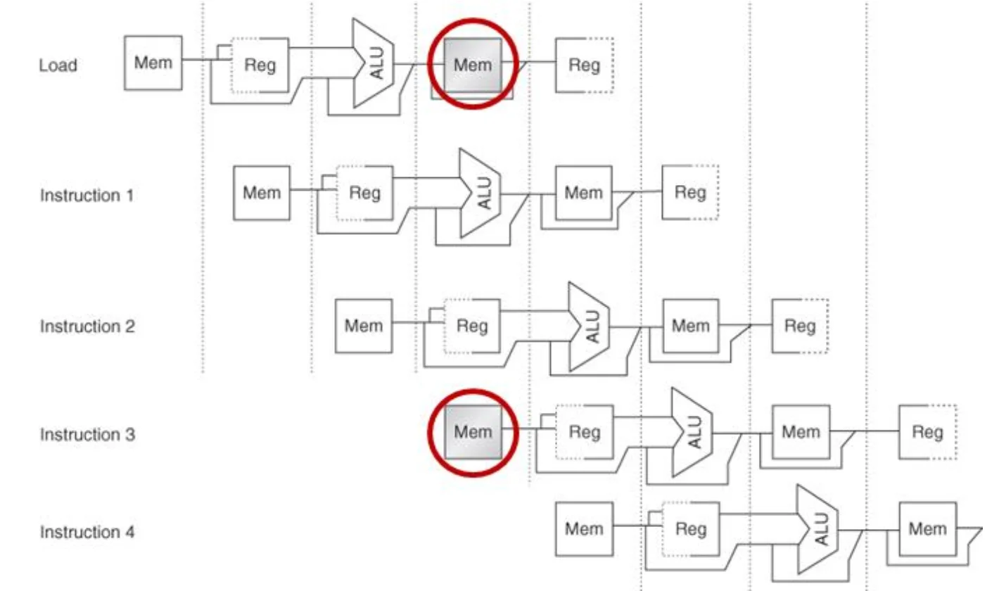

### 6.2 数据冒险 (Data Hazards)

#### 6.2.1 数据冒险

一条指令的执行依赖于前一条指令完成数据访问。
例如：
```risc
add x1, x2, x3
sub x4, x1, x5
```

第一条指令要在 `WB` 阶段才会将结果写回寄存器 x1，而第二条指令在 ID 阶段就需要读取 x1 的值，这时就会发生数据冒险。
一种办法就是第二条指令间隔两个周期再发送：

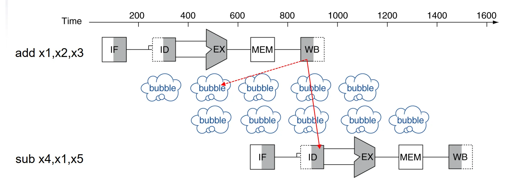

第二种办法：结果一旦**计算出来就立即使用**，无需等待其存入寄存器，这种方式需要在数据通路中**增加额外的连接**

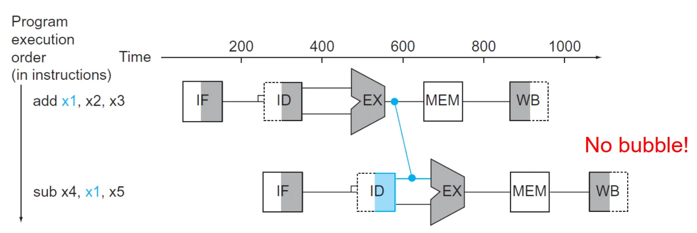

1. **对于 R 型指令**，最早能够拿到数据的时机是 `EXE` 阶段，因此第二条指令下一个周期可以正常发送；
2. **对于 Load 指令**，最早能够拿到数据的时机是 `MEM` 阶段，因此第二条指令需要间隔一个周期再发送。因此中间还是会有一个气泡，如图：
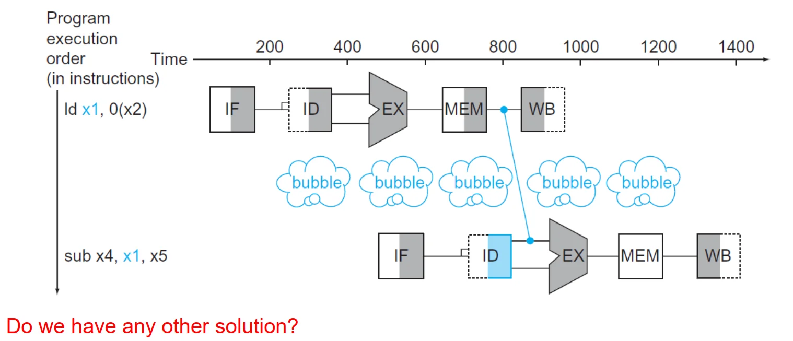

我们也可以从 Code 层面尽量避免这种冒险发生：

比如这里的第 2, 3 行和第 5, 6 行的数据冒险可以通过调整指令顺序解决（或者说在空 cycle 中插入其他指令）
```risc
1: lw x1, 0(x31)
2: lw x2, 4(x31)
3: add x3, x1, x2
4: sw x3, 12(x31)
5: lw x4, 8(x31)
6: add x5, x1, x4
7: sw x5, 16(x31)
```

$Rightarrow$

```risc
1: lw x1, 0(x31)
2: lw x2, 4(x31)
3: lw x4, 8(x31)
4: add x3, x1, x2
5: sw x3, 12(x31)
6: add x5, x1, x4
7: sw x5, 16(x31)
```

第一种情况需要 13 个 cycle, 第二种情况需要 11 个 cycle 。

数据冒险的复杂性：一串指令中可能会有很多指令存在数据冒险，需要解决：

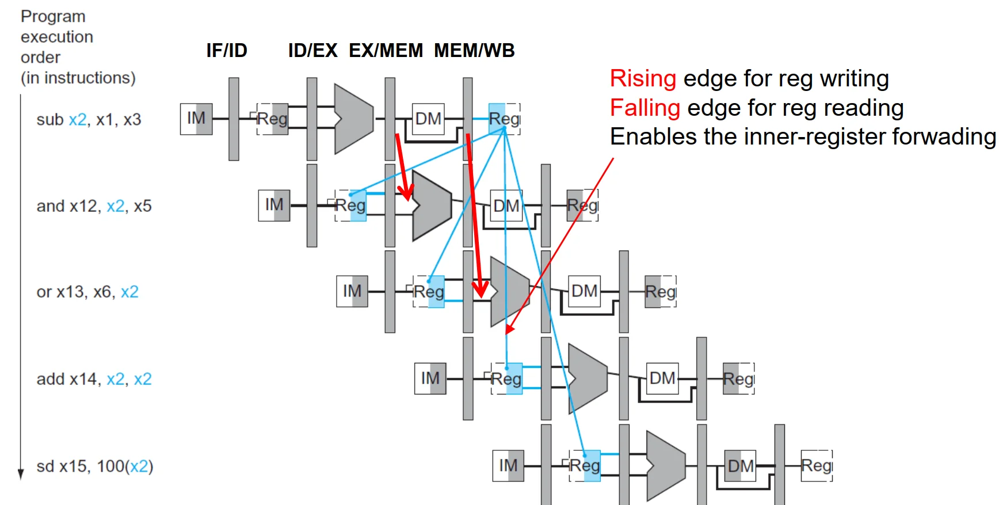

> 图中的寄存器设计为**上升沿写、下降沿读**，通过插入 **forwarding 结构** 就能不插入气泡解决数据冒险问题。
 
#### 6.2.2 Forwarding 结构——解决 R 指令 Hazard

**第一个条件：只有访问同一个寄存器才会触发 forwarding 机制**。更明确地说：
需要检查 `ID/EX` 阶段的 `rs1` 和 `rs2` 是否与上一条指令的 `rd` 相同，如果相同，则需要触发 `forwarding`。

实现方法，在 `EX` 阶段增加 两个 MUX 来选择 ALU 的输入来源：
- `00`: 正常从寄存器文件读取的值
- `01`: 从 `MEM/WB` 寄存器中转发的值 (上两条)
- `10`: 从 `EX/MEM` 寄存器中转发的值 (上一条)

<!-- A10: Green label, Red Rd -->
**A10.** $\text{EX/MEM.Register}{\color{red}{Rd}} = \text{ID/EX.RegisterRs1}$  
**B10.** $\text{EX/MEM.Register}{\color{red}{Rd}} = \text{ID/EX.RegisterRs2}$  
$\left.\begin{array}{l} \\ \end{array}\right\}$ Fwd from $\color{green}{\text{EX/MEM}}$ pipeline reg

<!-- A01: Blue label, Red Rd -->
**A01.** $\text{MEM/WB.Register}{\color{red}{Rd}} = \text{ID/EX.RegisterRs1}$  
**B01.** $\text{MEM/WB.Register}{\color{red}{Rd}} = \text{ID/EX.RegisterRs2}$  
$\left.\begin{array}{l} \\ \end{array}\right\}$ Fwd from $\color{blue}{\text{MEM/WB}}$ pipeline reg

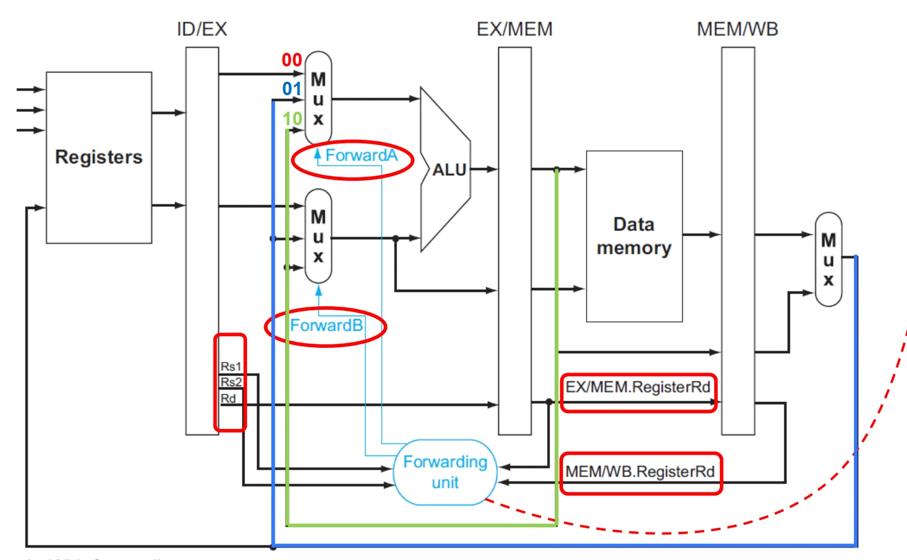

还有两个前提：

1. 该指令会**将结果写入寄存器！** `EX/MEM.RegWrite, MEM/WB.RegWrite`
2. 该指令的目的**寄存器 Rd 不为 x0**: `EX/MEM.RegisterRd ≠ 0, MEM/WB.RegisterRd ≠ 0`

因此，我们就可以给出 forwarding 机制的控制逻辑：

<span style="color:green">EX hazard</span>

```verilog
if (EX/MEM.RegWrite and (EX/MEM.RegisterRd ≠ 0) and
(EX/MEM.RegisterRd = ID/EX.RegisterRs1))
    ForwardA = 10
if (EX/MEM.RegWrite and (EX/MEM.RegisterRd ≠ 0) and
(EX/MEM.RegisterRd = ID/EX.RegisterRs2))
    ForwardB = 10
```

<span style="color:blue">MEM hazard</span>

```verilog
if (MEM/WB.RegWrite and (MEM/WB.RegisterRd ≠ 0) and
(MEM/WB.RegisterRd = ID/EX.RegisterRs1))
    ForwardA = 01
if (MEM/WB.RegWrite and (MEM/WB.RegisterRd ≠ 0) and
(MEM/WB.RegisterRd = ID/EX.RegisterRs2))
    ForwardB = 01
```

**Double Data Hazard**

对于如下指令
```risc
I1: add x1,x1,x2 # in MEM/WB
I2: add x1,x1,x3 # in EX/MEM
I3: add x1,x1,x4 # in ID/EX
```
 
`x1` 是 I3 的源寄存器，同时也是 I1 和 I2 的目的寄存器。如果我们使用之前的 forwarding 机制，I3 会同时满足两个条件：
- I2 的目的寄存器 `Rd` 与 I3 的源寄存器 `Rs1` 相同，且 I2 会写回寄存器文件，因此会触发 <span style="color:green">EX hazard</span> 。
- I1 的目的寄存器 `Rd` 与 I3 的源寄存器 `Rs1` 相同，且 I1 会写回寄存器文件，因此会触发 <span style="color:blue">MEM hazard</span> 。

**解决方案核心关键点：优先从最近的指令 `fwd`**

因此，对于 `MEM/WB` 的 forwarding 机制，我们需要增加一个条件：**如果 `EX/MEM` 的目的寄存器与 `ID/EX` 的源寄存器相同**，则不触发 `MEM/WB` 的 forwarding 机制。`not (EX/MEM.RegWrite and (EX/MEM.RegisterRd ≠ 0) and (EX/MEM.RegisterRd = ID/EX.RegisterRs1))`

<span style="color:blue">MEM hazard</span>

```verilog
if (MEM/WB.RegWrite and (MEM/WB.RegisterRd ≠ 0)
and not (EX/MEM.RegWrite and (EX/MEM.RegisterRd ≠ 0) and (EX/MEM.RegisterRd = ID/EX.RegisterRs1))
and (MEM/WB.RegisterRd = ID/EX.RegisterRs1))
    ForwardA = 01
if (MEM/WB.RegWrite and (MEM/WB.RegisterRd ≠ 0)
and not (EX/MEM.RegWrite and (EX/MEM.RegisterRd ≠ 0) and (EX/MEM.RegisterRd = ID/EX.RegisterRs2))
and (MEM/WB.RegisterRd = ID/EX.RegisterRs2))
    ForwardB = 01
```


**考虑 fwd 的 DataPtah:**
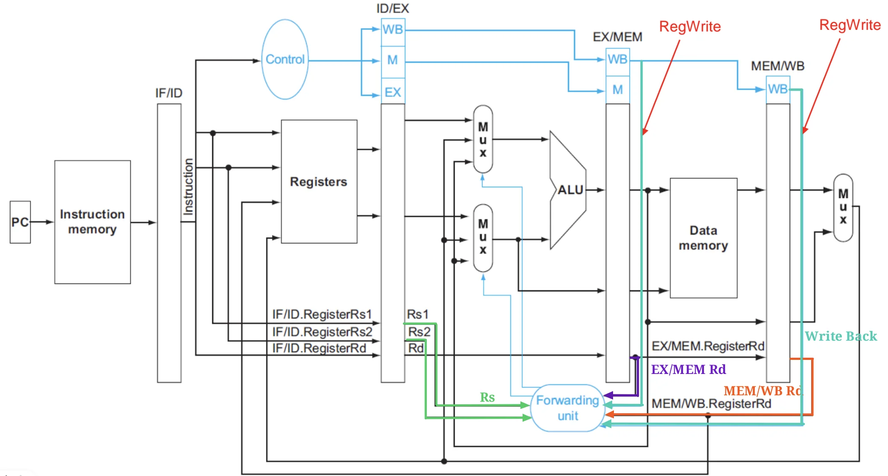

#### 6.2.3 Hazard Detection Unit —— 解决Load-Use Data Hazard

命名：

- Load 指令：访问内存的指令，例如`lw x1, 0(x2)`
- Use 指令：使用load指令的目的寄存器的指令，例如`add x3, x1, x4`

这里的 `x1` 就会发生 Data Hazard.

Load-Use Hazard 即使是使用了 **fwd**，中间也需要插入一级 bubble。

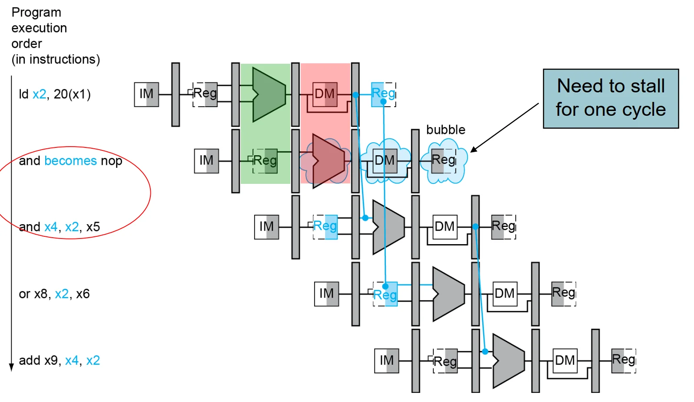

**解决方案：**

1. Check when the using instruction is decoded in <span style="color:red">ID stage</span>
2. **ALU operand register numbers** in ID stage are given by: <span style="color:green">IF/ID.RegisterRs1, IF/ID.RegisterRs2</span>
3. 满足如下条件时会发生 Load-Use Hazard：

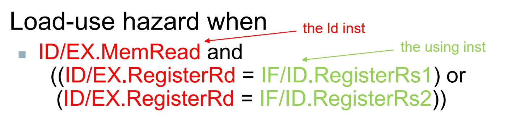

如果检测到了 Load-Use Hazard，就需要停顿并插入 bubble，做法是：

**检测：** 在 `ID` 阶段检测 `IF/ID.RegisterRs1` 和 `IF/ID.RegisterRs2` 是否与 上一条指令的目的寄存器即（`ID/EX.RegisterRd`） 相同，且 `ID/EX.MemRead` 有效。

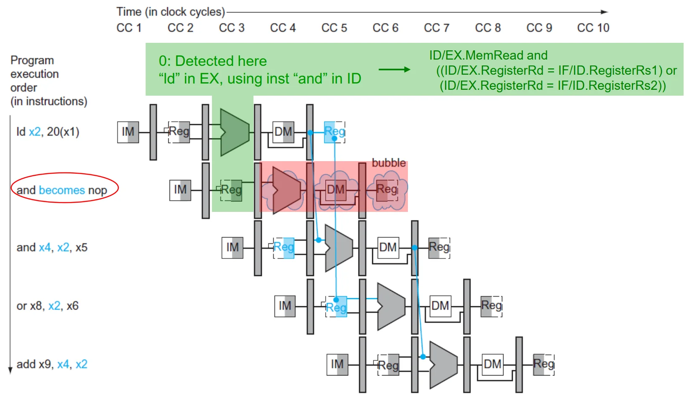

如果检测到了，就必须让当前指令变成 `nop`，即上图中的：`and becomes nop`，`nop` 指令的含义是继续流走，但是**不对任何组件产生影响**。

但是我们必须让**下一个周期继续发送这条指令**，不能让其直接流走。所以我们必须将当前指令的信息**冻结**在 **`IF/ID` 寄存器中**，并且我们还需要**冻结 `PC` 寄存器**，否则会冲走下一条指令。整个过程如下图所示：（对应<span style="color:red">1.1, 1.2, 1.3</span>）

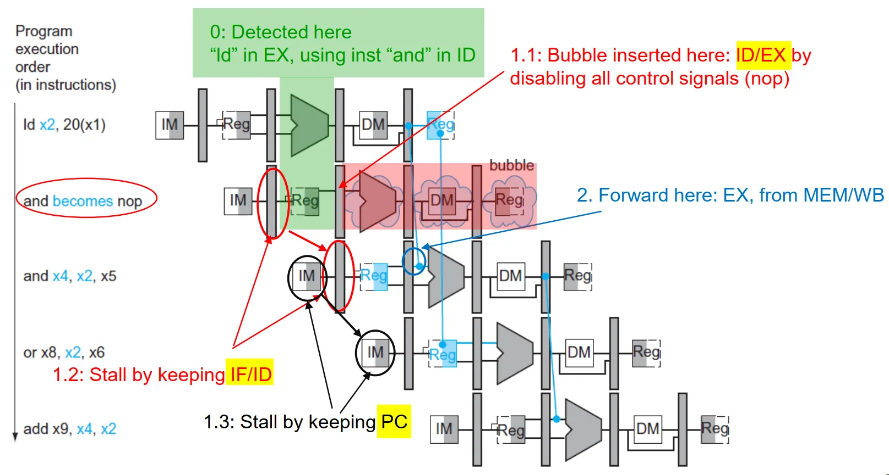

下一个周期，当前指令继续发送，等到 `ID` 阶段**再次检测 Load-Use Hazard 时，发现已经没有了**，因为此时检测到的 `ID/EX.RegisterRt` 以及 `ID/EX.MemRead` 都已经是 `nop` 指令了。

然后，这条指令执行到 `EX` 阶段时，需要继续**通过一个 fwd 结构将第一条指令的结果转发给它**。（对应 <span style="color:blue">2</span>）

根据上述分析，我们设计出一个 Hazard Detection Unit 来检测 Load-Use Hazard：

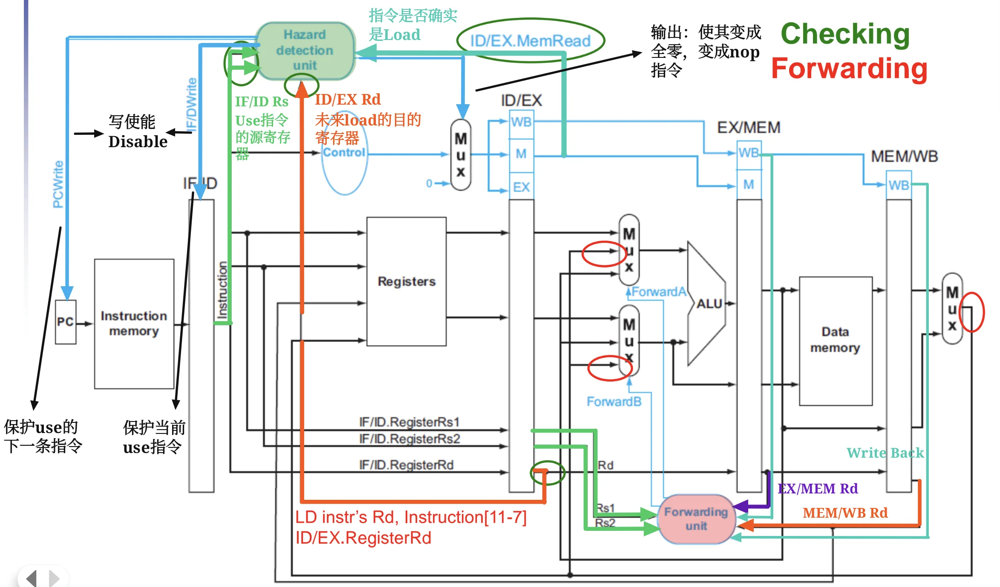

### 6.3 Control Hazard

#### 6.3.1 Control Hazard

这一种冒险主要来自分支指令，体现为这类指令对后续指令会有影响，具有这种控制依赖性。

案例：
```risc
I1: add x4, x5, x6
I2: beq x1, x0, 40
I3: or x7, x8, x9
```

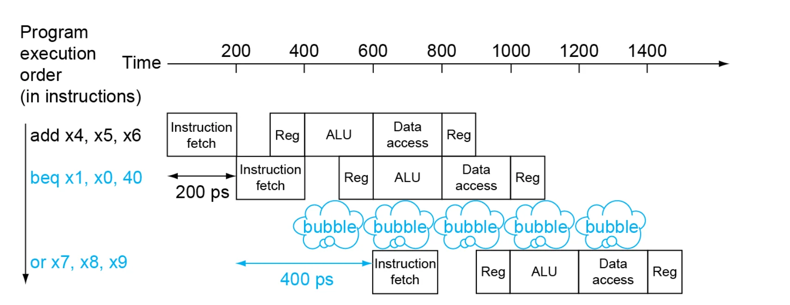

在上面的指令序列中, 分支跳转指令 `I2` 会影响后续指令的执行。例如 `I3` 指令本应该在下一个周期继续发送，但是由于 `I2` 可能会执行跳转，因此 `I3` 就有可能被冲刷掉(Flush)，导致性能下降。

假设分支跳转指令可以**在 `ID` 阶段就得出结果**，即 `ID` 阶段要完成：

- 比较寄存器 `x1` 和 `x0` 的值
- 计算跳转目标地址 `PC + 40`

**在 `ID` 阶段末，我们就能得到这些结果**，但是别忘了此时，`IF` 流水级在做什么！——**它在取 `I3` 指令**！阶段末， `I3` 指令就会稳定下来，等待下一个时钟周期被 `IF/ID` 寄存器捕获。如果我们不做处理，`I3` 就会被错误地执行。为了避免错误，我们只能强制 **flush** 掉 `I3` 指令，**产生一个气泡，同时这个周期还要完成取正确指令的工作**。然后再下一个周期，才能发送新的正确指令。

因此，我们发现，**分支指令的控制冒险会导致至少一个周期的性能损失**。

关于是否要解决这中间的这个周期的 bubble，业界有两种不同的做法：

#### 6.3.2 Always Stall on Branch

一种做法是，无论分支指令的结果如何，我们都**冲刷掉指令，强制停顿一个周期**。

#### 6.3.3 Branch Prediction

这种做法就是继续发送一条指令，有两种选择：

1. 一种是 **actually not token**，即假设不跳转，先去取指。如果发现不用跳转，那么就不会损失一个 cycle；如果发现需要跳转，那么就必须 flush 掉该指令，损失一个 cycle。
2. 另一种是 **actually token**，即假设一定会跳转，**先去取指跳转目标地址的指令**。

!!! question "这种方式的收益是什么？"
    如果预测是准确的话，那么就获得性能收益。


!!! question "如果预测跳转 (taken)，会有什么影响？"
    即使预测准确了，**没有什么收益**，我们**还是要插入一个周期的 bubble**，因为我们需要等到 `ID` **阶段才能知道分支指令要跳转的地址**。所以一般来说我们会选择预测不跳转 (not taken)，来博取分支指令不跳转的情况，获得一点收益。

此外，我们还要注意一个问题：

1. **Longer pipelines can’t readily determine branch outcome early.** Stall penalty becomes unacceptable. 即：ISA 流水级数越多，分支指令的结果就越晚才能得出，那么分支指令的停顿周期就越多，性能损失就越大。
2. 分支预测的越晚，性能损失就越大。例如：假设我们在 `MEM` 阶段才进行 branch prediction，那么分支指令就会停顿 3 个周期，性能损失就更大了。

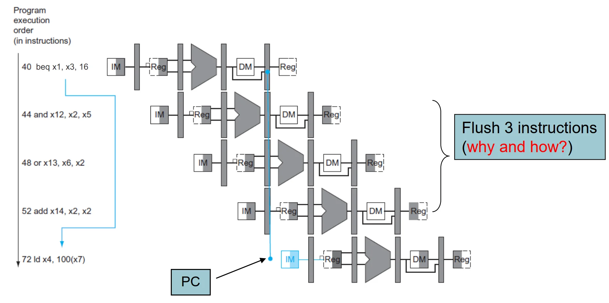

我们当然可以把 branch prediction 提前到 `EX` 阶段组合逻辑的末尾，从而将 flush 的周期减少到 2。但是这又会带来另一个问题：`EX` 阶段延迟的延长，如果这是**关键路径**，那么就会**降低整体的时钟频率**。

Branch Prediction 的**实现方式**：

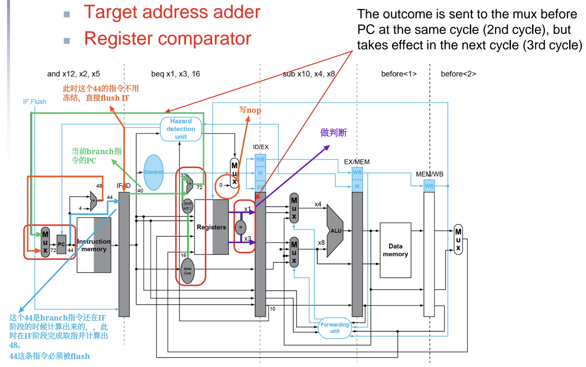

以如下指令为例：
```risc
sub x10, x4, x8
beq x1, x3, 16
add x11, x5, x6
```

总的来说有如果如下工作要做：（我们假设 branch 指令 PC = 40）

1. branch 指令的 `ID` 阶段：比较寄存器 `x1` 和 `x3` 的值(紫色线条)，计算跳转目标地址 `PC + 16 << 1 = 72`。
2. 如果寄存器 `x1` 和 `x3` 的值相等，那么更新 PC 寄存器(红色框)，同时 flush 掉编号为 44 的指令，在 IF/ID 寄存器中直接 flush。 

#### 6.3.4 Data Hazards for Branch

如图：

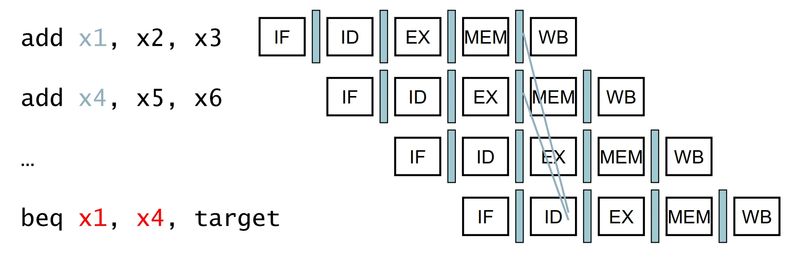

我们面对的指令为：
```risc
add x1, x2, x3
add x4, x5, x6
beq x1, x4, target
```

branch 指令需要用到的寄存器是前面两条 R 型指令的目的寄存器。为了满足要求，我们必须插入一个Bubble，分别从 `EX/MEM` 和 `MEM/WB` 获取 `x4` 和 `x1` 的值，来进行比较。为此，我们需要要增加一个 fwd 结构，以及**在之前比较寄存器的位置（上图紫色线条）增加 mux 来选择操作数来源**。

总结来说，如果 branch 指令需要用到前面指令的目的寄存器，并且：

1. 前面指令是 R 型，那么我们只需要插入一个 bubble 来等待 `EX/MEM` 寄存器中转发的值；
2. 前面指令是 Load 型，那么我们需要插入两个 bubble 来等待 `MEM/WB` 寄存器中转发的值。

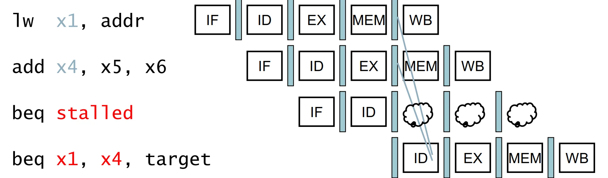

这种现象的本质是 **Data Hazard**，并非 **Control Hazard**，只是恰好发生 data hazard 的指令是 branch 指令而已。

#### 6.3.5 Branch Prediction 的策略

在更深的超标量流水线中，分支惩罚更为显著

- 在流水线的**较后阶段计算分支**结果
- 越早越好 → 需要extra hardware → 进行预测

使用 dynamic prediciton
- 通常在**第一阶段（取指阶段）进行**
- 在**早期阶段**进行预测，并在**结果计算阶段进行验证**（对应RISC-V架构中的指令译码阶段）

**两种分支预测方式**：

**(1) Static Prediction**：通过编译器在 Code 层面解决掉。
Based on typical branch behavior
示例：循环与条件语句分支

- 预测后向分支被采纳
- 预测前向分支不被采纳

**(2) Dynamic Prediction**：通过硬件在运行时解决掉。

Hardware **measures** actual branch behavior: **record recent history of each branch**

假设**未来的行为将延续当前趋势**：当预测错误时，在重新获取的同时进行清空，并更新历史记录。准确率可能超过 90%。


**Dynamic Prediction 的实现方式示例——BHT**

Branch History Table (BHT) 是一种常见的动态分支预测机制。它使用一个**小型的表格来记录每个分支指令的历史行为**（如最近 2 次或 4 次是否被采纳）。每个分支指令对应一个条目，条目中存储了一个状态（如 2-bit saturating counter），根据历史行为来预测下一次分支是否被采纳。

每次遇到一个分支指令：

1. 检测 BHT，期望相同结果
2. 开始从 fall-through 或 target 取指令
3. If wrong, **flush pipeline** and **flip prediction in BHT**

简单来说，就是**猜错了更新 BHT，猜对了就不更新**。

但是这里还是有很多问题值得探讨：
1. BHT 大小由 PC 可取的值决定（最大 $2^{32}$ ），肯定不能直接存 $2^{32}$ 个条目，开销太大，所以直接取一部分长度
2. 只取一部分长度，那这一部分长度对应 PC 的那一段呢？

**(1) 1-Bit Predictor: Shortcoming**

Inner loop branches mispredicted twice!

来到内层循环的最后一次：
1. 当前 BHT 为 T，决定跳转；
2. 实际上不该跳转，BHT 更新为 N.
3. 然后来到外层循环，下一次进入内层循环，需要跳转时，
4. 当前 BHT 为 N，决定不跳转；
5. 实际上应该跳转，BHT 更新为 T.

所以这里会连续错两次

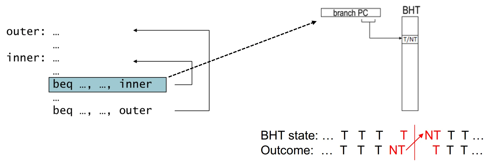

**(2) 2-Bit Predictor**

2 Bit BHT 可以解决上面那种虽然结构很规律但还是会连续误判的情况。
BHT 本质上就是一个状态机，有四个状态：
1. Strongly Taken (T)
2. Weakly Taken (t)
3. Weakly Not Taken (n)
4. Strongly Not Taken (N)

状态转移图为：

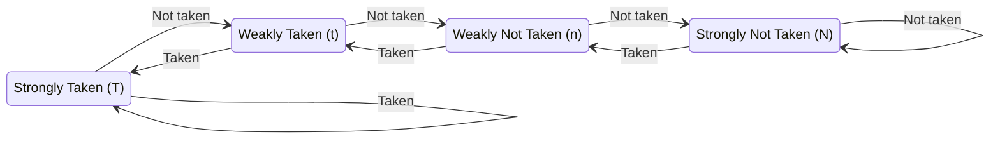
```mermaid
stateDiagram-v2
direction LR

state "Strongly Taken (T)" as ST
state "Weakly Taken (t)" as WT
state "Weakly Not Taken (n)" as WN
state "Strongly Not Taken (N)" as SN

ST --> ST: Taken
ST --> WT: Not taken

WT --> ST: Taken
WT --> WN: Not taken

WN --> WT: Taken
WN --> SN: Not taken

SN --> WN: Taken
SN --> SN: Not taken
```

> 预测输出可按“高位决定方向”理解：`ST/WT` 预测 Taken，`WN/SN` 预测 Not taken。


#### 6.3.6 Branch Target Buffer (BTB)

即使是有 Branch Prediction 机制了，还是需要等到 `ID` 阶段才能知道分支指令的跳转目标地址，这样就会损失一个周期。为了提前获取跳转目标地址，有人提出了 Branch Target Buffer (BTB)。

Branch Target Buffer (BTB) 的原理是：维护一个 Table，这个 Table 的索引是**分支指令的 PC 值**，值是**分支指令的跳转目标地址的 PC 值**。

当 IF 阶段取指时，如果发现**当前 PC 对应的 BTB 条目有效**，那么就直接从 BTB 中获取**跳转目标地址的PC值**，来取指下一条指令。

此外，这个 Table 中还存放了当前分支指令的 `Taken` 与 `Not Taken` 的信息。

这样做之后，当前周期当前**分支指令发射（IF阶段）**后，下一个周期跳转的指令就**可以发射（IF阶段）**。

但是有一个代价，这个 Table 的索引方式只能是 PC 值比对，因为 Table 里**并非存的是全部指令的 PC ，而是分支指令的 PC 值**。因此必须逐个判断当前分支指令是哪一个。


### 6.4 Summary 

三种 Hazards 的流水线结构图：

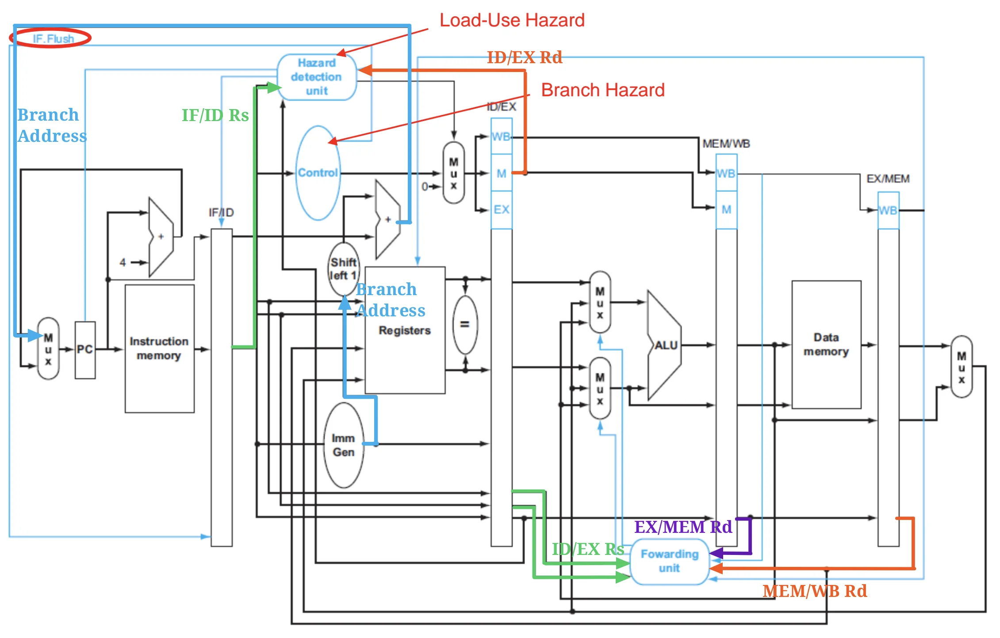