# 第五章：Large and Fast: Exploiting Memory Hierarchy
## I. Introduction to Memory Technology
存储系统设计的核心矛盾，是**处理器与内存的性能增长速度存在巨大鸿沟**，这也是现代计算机体系结构中存储层次（Memory Hierarchy）设计的核心动因。

### 1.1 处理器与内存的性能鸿沟
从技术发展趋势来看，处理器与内存的性能差距持续拉大，形成了制约系统性能的「内存墙」问题：

- 处理器性能：以每年约52%的速度持续增长，算力提升速度极快
- DRAM内存延迟：仅以每年约7%的速度缓慢优化，访存延迟的改进远落后于处理器
- 早在1977年的Apple计算机中，CPU周期1000ns，DRAM访问延迟400ns，二者差距极小；而随着半导体技术迭代，二者的性能差距呈指数级扩大。

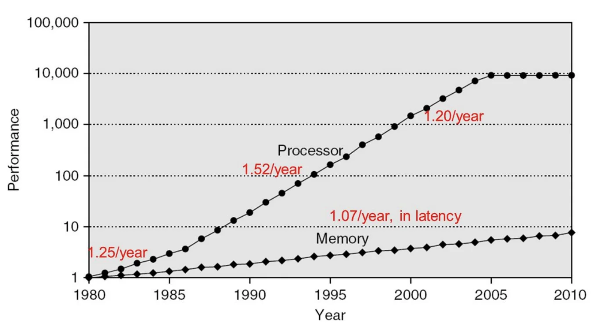

### 1.2 三大核心存储技术
2012年主流的三类存储技术，在**访问速度、存储容量、单位成本**上形成了天然的梯度差异，为存储层次结构提供了硬件基础：

| 存储类型 | 典型访问延迟 | 单位容量成本（$, 2012年） | 核心特性与用途 |
| --- | --- | --- | --- |
| 静态随机存储器 SRAM | 0.5ns – 2.5ns | $2000 – $5000 / GB | 速度最快，无需定时刷新，集成度低、成本高，主要用于CPU片内缓存 |
| 动态随机存储器 DRAM | 50ns – 70ns | $20 – $75 / GB | 速度中等，需要定时刷新保持数据，集成度高、成本适中，用作计算机主存 |
| 机械磁盘 Magnetic disk | 5ms – 20ms | $0.20 – $2 / GB | 速度最慢，容量上限极高，单位成本极低，用作系统持久化外存 |

### 1.3 理想内存的设计目标
理想存储系统需要同时满足两个相互制约的核心需求：

1. 访问延迟达到SRAM的极速水平
2. 容量和单位成本达到机械磁盘的水平

**存储层次结构**，正是利用程序的局部性原理，在现有硬件技术条件下，尽可能逼近这一理想目标的核心工程方案。

## II. Memory Hierarchy

### 2.1 Principle of Locality 局部性原理
局部性原理是存储层次结构能够成立的核心理论基础，其核心结论为：**程序在任意运行时刻，只会访问其整个地址空间中的极小一部分**。

!!! note "Memory Hierarchy"
    (1) Store everything on **disk**;
    (2) Copy recently accessed (and nearby) items from disk **to smaller DRAM memory**;
    (3) Copy recently accessed (and nearby) items from DRAM **to smaller SRAM cache**;

局部性分为两大核心类型，二者共同决定了存储层次的效率：

#### 2.1.1 时间局部性（Temporal locality）

- 核心定义：**最近被访问过的内容，在不久的将来大概率会被再次访问**
- 典型场景：循环体中的指令、循环计数的归纳变量、被频繁调用的函数、高频访问的全局变量

#### 2.1.2 空间局部性（Spatial locality）

- 核心定义：**被访问内容的相邻地址数据，在不久的将来大概率会被访问**
- 典型场景：顺序执行的指令流、**数组元素**的连续遍历、结构体成员的批量访问

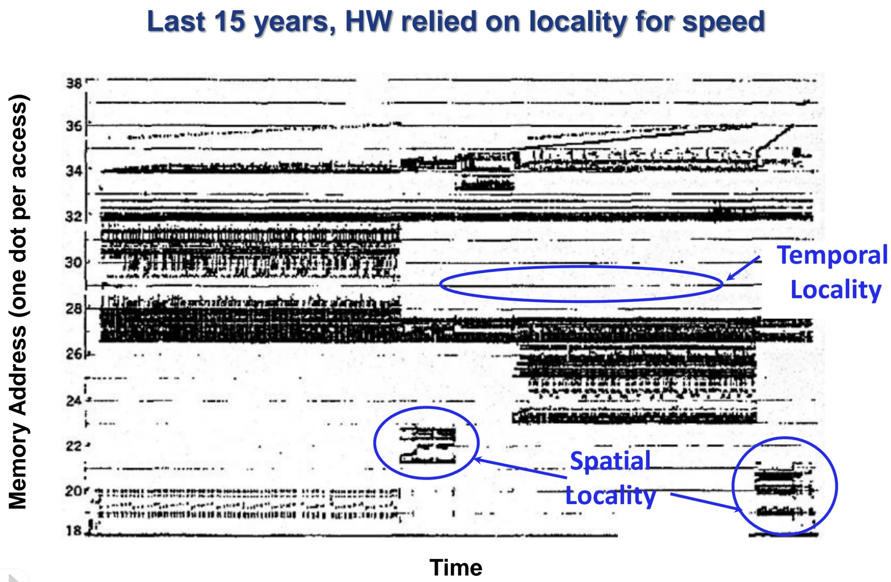

### 2.2 Memory Hierarchy Levels
#### 2.2.1 核心设计思想
存储层次结构构建了从CPU到外存的多层存储金字塔，利用局部性原理实现「**速度接近顶层、容量和成本接近底层**」的效果，核心运作逻辑为：

1. 所有数据永久存储在最底层的磁盘中
2. 将**最近被访问、且相邻地址**的数据块，从磁盘复制到容量更小的DRAM主存中
3. 将**更近期被访问、且相邻地址**的数据块，从DRAM主存复制到容量更小、紧邻CPU的SRAM缓存中
4. 最顶层为CPU内的寄存器堆，为执行单元提供单周期极速访问

#### 2.2.2 核心术语定义

| 术语 | 英文全称 | 核心定义 |
| --- | --- | --- |
| **块/行** | **Block / Line** | **存储层次之间数据复制的最小单位**，通常包含多个连续的字 |
| **命中** | **Hit** | 待访问的数据**存在于当前上层存储**中，可直接由上层存储响应访问请求 |
| 命中率 | Hit ratio | 命中访问次数 / 总访问次数，衡量存储层次效率的核心指标 |
| 命中时间 | Hit time | 命中时完成一次访问的总耗时，包括标签检测和数据读取时间 |
| **缺失** | **Miss** | 待访问的数据**不存在于当前上层存储**中，需要从**下层存储调取对应数据块** |
| 缺失率 | Miss ratio | 缺失访问次数 / 总访问次数 = 1 - 命中率 |
| **缺失代价** | **Miss penalty** | 处理**一次缺失的总耗时**，包括从**下层存储替换数据块、向上层传输数据**的完整时间 |
| inclusive | exclusive | 上层存储中的数据**一定存在于下层存储中**，例如 Register File 中的数据一定存在于 SRAM -> DRAM -> Disk 中 |
| exclusive | exclusive | 上层存储中的数据**一定不存在于下层存储中**，例如 Cache 中的数据一定不存在于 DRAM 中 |

**exclusive 的策略比较少，后续情况我们默认考虑 inclusive 情况**


## III. Register File 寄存器堆
寄存器堆是存储层次结构的最顶层，紧邻CPU执行单元，是整个存储系统中访问速度最快的单元，也是RISC-V等ISA的核心组成部分。

结构图（读逻辑与写逻辑）：

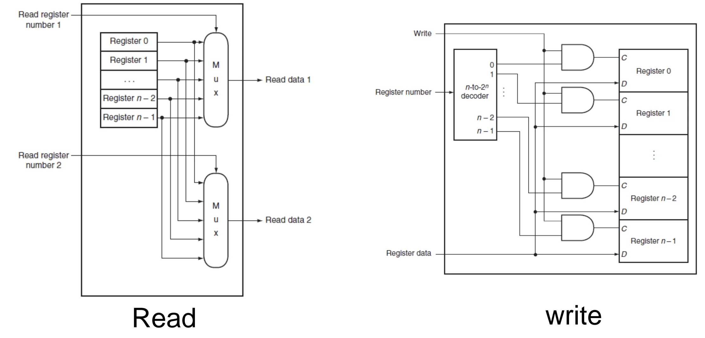


### 3.1 核心结构与特性

- 典型配置：RISC-V架构标准为32个32位通用整数寄存器
- 读写端口：标准配置为**2个读端口、1个写端口（2R1W）**，支持单周期内同时读取2个寄存器、写入1个寄存器，完美匹配五级流水线的指令执行需求
- 访问特性：寄存器访问延迟为1个时钟周期，无访问缺失，是CPU指令执行的核心数据载体

### 3.2 寄存器堆的Verilog实现示例

```verilog
module registerfile (
    Read1, Read2, WriteReg, WriteData, RegWrite,
    Data1, Data2, clock
);
// 端口定义
input  [5:0]  Read1, Read2, WriteReg; // 读/写寄存器编号
input  [31:0] WriteData;              // 待写入寄存器的数据
input         RegWrite;                // 寄存器写使能信号
input         clock;                   // 时钟信号，写操作同步于上升沿
output [31:0] Data1, Data2;            // 两个读端口的输出数据

// 寄存器堆本体：32个32位通用寄存器
reg [31:0] RF [31:0];

// 组合逻辑读：无时钟延迟，实时输出对应寄存器的值
assign Data1 = RF[Read1];
assign Data2 = RF[Read2];

// 时序逻辑写：仅时钟上升沿、写使能有效时执行写入
always @(posedge clock) begin
    if (RegWrite) begin
        RF[WriteReg] <= WriteData;
    end
end

endmodule
```

## IV. SRAM Technology 静态随机存储器
SRAM（Static Random-Access Memory）由于其极高的访问速度，主要用于实现CPU片内的 **Cache（缓存）**。从体系结构的发展来看，SRAM 经历了从片外（Off-chip）向片内（On-chip）集成的过程，极大降低了访存延迟。

### 4.1 SRAM 核心结构与读写机制
标准的 SRAM 存储单元采用 **6T结构（6 Transistors/bit）**，利用交叉耦合的反相器锁存数据。

*   **核心特性**：
    *   只要不断电，数据就能一直保持（Retain bit），**无需刷新**。
    *   保持数据的**静态功耗极低**（Low power to retain bit），但占用硅片面积较大。

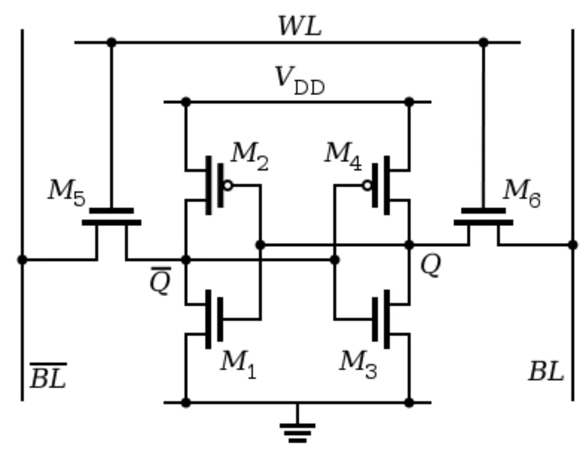

SRAM 的基本读写逻辑依赖于 **字线（Wordline, WL）** 和 **位线对（Bitlines, BL & $\overline{BL}$）** 的协同操作：
**Cell read (读操作)**：

1.  首先将两根位线（Bitlines）**预充（Precharge）** 至高电平（$V_{DD}$）。
2.  拉高字线（Wordline），打开传输管（Pass transistors）。
3.  存储单元内部的状态会将其中一根位线的电平**下拉（Pulled down）**，外围的**灵敏放大器**（Sense Amplifier）通过检测两根位线的微小压差来读出 0 或 1。

**Cell write (写操作)**：

1.  由写入驱动器强行将一根位线拉高，另一根位线拉低（代表要写入的数据）。
2.  拉高字线（Wordline）打开传输管。
3.  由于**外围驱动器的驱动能力远大于内部的交叉耦合反相器**，位线上的强信号会**覆盖（Overpower）**存储单元内的旧值，完成写入。

### 4.2 SRAM 组织架构与译码逻辑
为了在芯片面积、功耗和访问延迟之间取得平衡，大容量 SRAM 阵列不会采用扁平的单级译码，而是采用 **多路复用（Multiplexing）** 和 **两级译码（2-level decoding）** 结构。

**(1) Multiplexing**

多选一，输入数量极大，再用 Mux ，扇入会很大，造成大量面积和延迟的开销。
这种情况，用**线与/线或**的方式；并且在访问其中某一行时，必须通过**显式的 enable 信号关掉**。

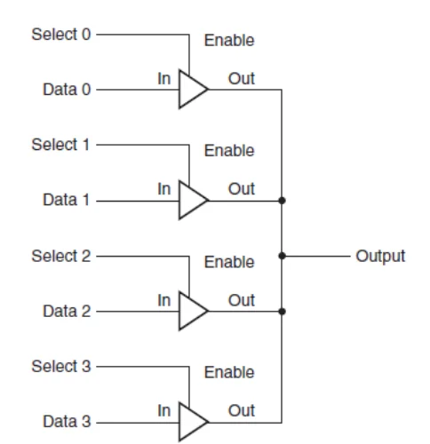

**(2) Decoder**
**设计案例分析（以一个 4MB SRAM 为例）**：

*   如果不做二维阵列优化，4M 个字（Words）需要 4M 根字线（Word lines），这在物理布线上是极其荒谬且无法实现的。
*   **优化方案**：将其组织成矩形阵列。利用 12-to-4096 的行译码器生成 **4K 根字线（Word lines）**；同时在列方向上配合使用 **1K 的多路选择器（MUX * 8）**。这样不仅大幅缩短了字线和位线的物理长度（降低了RC延迟），还极大地优化了版图面积。

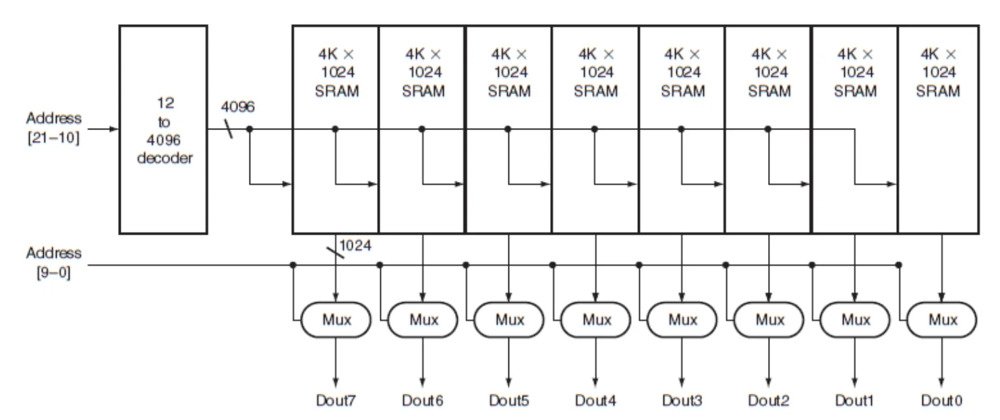


## V. DRAM Technology & Organization 动态随机存储器
DRAM（Dynamic Random-Access Memory）由于其极高的存储密度和低廉的成本，是计算机 **Main memory（主存）** 的绝对主力。

### 5.1 DRAM 基本存储单元特性
不同于 SRAM 的 6T 结构，DRAM 采用极简的 **1T1C结构（单管单电容）**：

**数据存储**：数据以电荷（Charge）的形式存储在微小的电容（Capacitor）中。

**数据访问**：由**单个传输管**（Single transistor）作为开关来访问电容中的电荷，通过 **word line** 激活对应的行，**bit line** 传输电荷信号。 

**破坏性读出与刷新（Refresh）**：

- **读出电荷后，原有的电荷会被破坏**，因此必须在读取后将数据**写回（Write back）**。
- 由于电容存在**天然漏电**，DRAM 单元必须**周期性地进行刷新（Periodically be refreshed）**，这也是 "Dynamic" 的由来。刷新操作通常是以**行（Row）**为单位进行的。

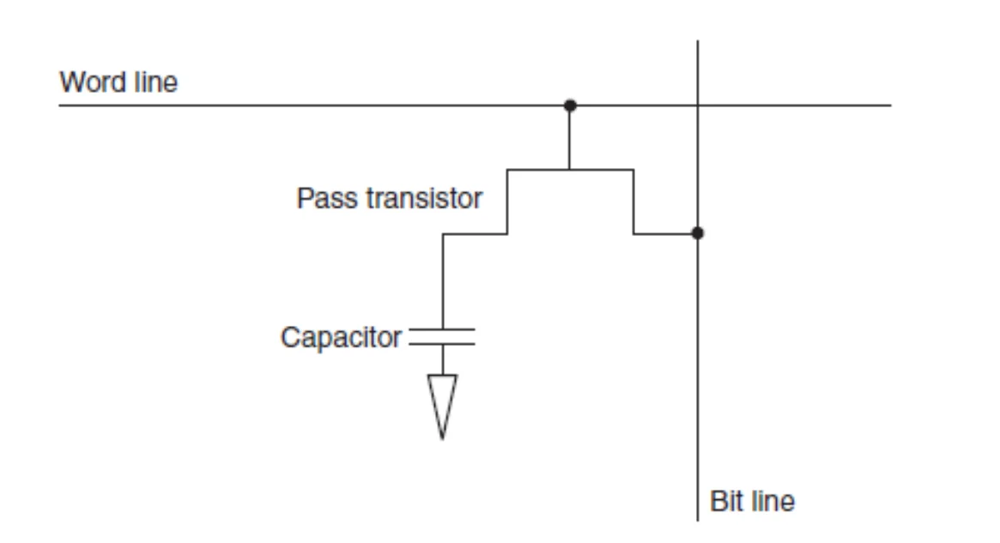

### 5.2 DRAM 阵列组织与访问模式
DRAM 内部的比特位同样被组织成**矩形阵列（Rectangular array）**，核心访问逻辑是分两步走：先**选中整行**，**再挑出特定的列**。

*   **行级访问**：DRAM 每次访问（Access）都会激活一整个 Row，并将其放入行缓冲区（Column latches / Row buffer）中。
*   **Burst mode (突发模式)**：既然一整行的数据已经被读出到了缓冲区中，如果后续请求的地址是连续的，就可以直接从缓冲区中**以极低的延迟连续提供后续字（Supply successive words with reduced latency）**，而无需再次进行缓慢的内部行读取。

    > **更好的方式**是尽量做到一行中存放想要的数据，这样就不需要多次切换不同行的访问。因为每次访问完一行，电容上的电荷都会损失，需要重新充电（Recharged），这会带来额外的访问延迟。

*   **DDR (Double Data Rate) DRAM**：通过在时钟信号的**上升沿和下降沿**同时传输数据，使得数据传输速率翻倍。

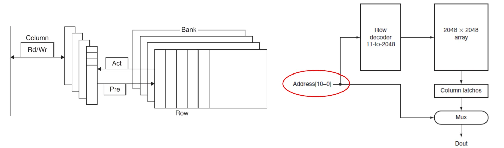

### 5.3 决定 DRAM 性能的核心因素
现代存储系统通过以下三大核心技术来榨干/提升 DRAM 的性能（特别是提升带宽）：

1.  **Row buffer (行缓冲区)**：允许**并行读取**和刷新多个字，是实现**Burst mode**的物理基础。
2.  **Synchronous DRAM (SDRAM, 同步DRAM)**：配合系统时钟，允许连续的**突发访问**（Consecutive accesses in bursts），**无需为每个字单独发送地址（Without needing to send each address）**，大幅提升了总线**带宽（Bandwidth）**。
3.  **DRAM banking (多体交叉/多Bank结构)**：允许同时（Simultaneous access）访问多个不同的 DRAM Bank，通过并行流水线操作掩盖单一 Bank 漫长的内部访问延迟，成倍提升吞吐量。


### 5.4 Increasing Memory Bandwidth 提升内存带宽的系统架构设计
为了缓解「内存墙」问题，系统架构师需要优化 CPU 与主存之间的互连架构。以下通过一个经典的计算模型，对比三种内存组织架构的 **Miss penalty（缺失代价）** 和 **Bandwidth（带宽）**。

!!! note "基础假设 (Assumption)"
    - 发送一次地址耗时：**1 cycle**
    - 每个字（Word）的内部访问耗时：**15 cycles**
    - 在总线上传输返回一个字耗时：**1 cycle**
    - Cache Block（缓存块）大小：**4 words（即 16 bytes）**

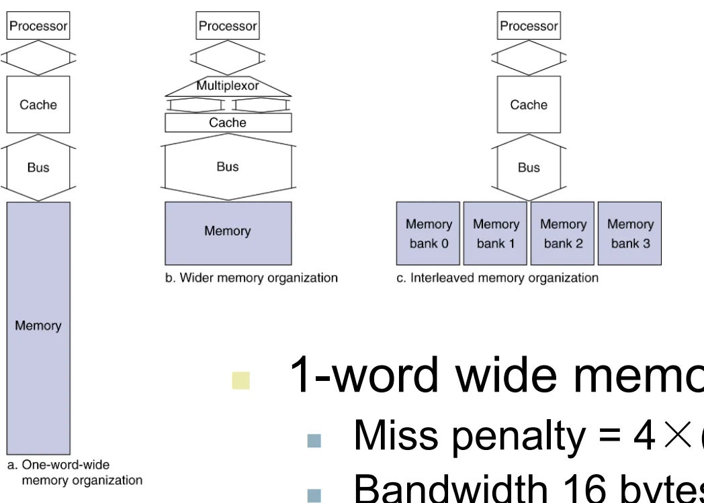

**(1) 单字宽内存架构 (1-word wide memory)**
每次**只能访问并传输 1 个字**，处理 1 个 Cache Block 需要循环 4 次完整的「发地址 -> 访问 -> 传数据」流程。

*   $Miss\ penalty = 4 \times (1 + 15 + 1) = 68\ cycles$
*   $Bandwidth = 16\ bytes\ /\ 68\ cycles = \mathbf{0.24\ B/cycle}$

**(2) 宽总线内存架构 (4-word wide memory)**
将内存和总线宽度直接拓宽为原来的 4 倍，发 1 次地址即可同时访问 4 个字，并一次性传回。

*   $Miss\ penalty = 1\ (发地址) + 15\ (并行访问) + 1\ (并行传回) = 17\ cycles$
*   $Bandwidth = 16\ bytes\ /\ 17\ cycles = \mathbf{0.94\ B/cycle}$
*   *评价：性能最好，但代价极其昂贵（CPU芯片引脚数量和主板布线成本剧增）。*

**(3) 多体交叉内存架构 (4-bank interleaved memory)**
**（性价比最高的工业界主流方案）**
保持标准**单字宽总线**，但将内存划分为 **4 个独立的 Bank**。发 1 次地址后，4 个 Bank 内部**并行**访问各自的字（耗时15周期），然后依次占用总线传回数据（耗时 $4 \times 1$ 周期）。

*   $Miss\ penalty = 1\ (发地址) + 15\ (4个Bank同时访问) + 4 \times 1\ (排队占用总线传回) = 20\ cycles$
*   $Bandwidth = 16\ bytes\ /\ 20\ cycles = \mathbf{0.8\ B/cycle}$
*   *评价：用极小的硬件代价（未拓宽总线）换取了接近宽总线架构的极高带宽。*


### 5.5 DRAM 物理层级组织与存储器分类

**(1) DRAM 物理内存条架构 (DIMM Organization)**
现代计算机的主存呈现出严密的自顶向下的层级组织结构：

1.  **Channel**：处理器内部集成的内存控制器通道，决定了内存条的并发读写上限。
2.  **DIMM (Dual in-line memory module, 双列直插存储模块)**：即我们平时买到的物理内存条实体。
3.  **Rank**：为了凑齐总线的位宽（例如 64-bit），把多个芯片组合在一起协同工作。例如：Rank 0 可以由 8 颗位宽为 8-bit 的芯片（$8 \times 8 = 64$）组成，它们同时响应同一个地址读写命令。
4.  **Chip**：内存条上一颗颗黑色的物理颗粒。
5.  **Bank**：Chip 内部划分的独立存储阵列区域，不同 Bank 之间可以并行操作（对应上一节的 Interleaved memory）。
6.  **Row / Column**：底层 1T1C 单元构成的二维阵列网格。

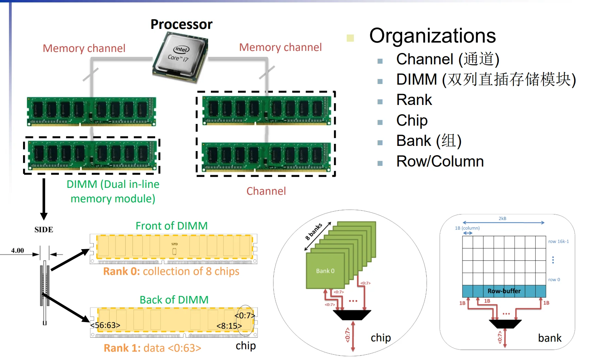

**(2) 现代半导体存储器分类体系**

根据断电后数据是否丢失，存储芯片（Memory chips）主要被分为两大阵营：

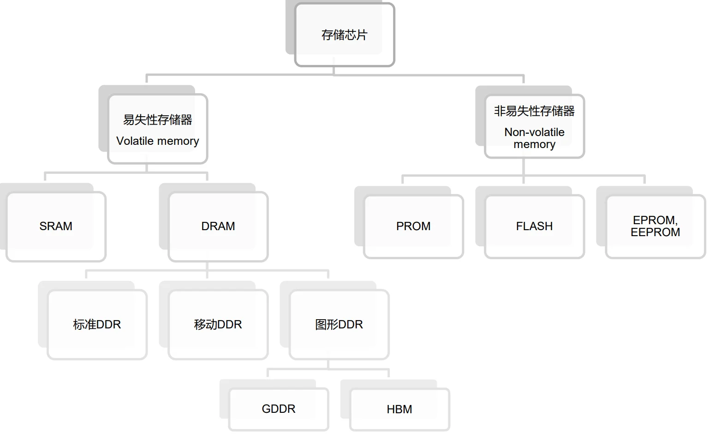

**标准 DDR**：用于 PC 和服务器主存。
**移动 DDR (LPDDR)**：用于手机等极低功耗设备。
**图形 DDR (GDDR)**：用于 GPU 的显存，强调极高的突发带宽。
**HBM (High Bandwidth Memory)**：采用 3D 硅穿孔封装技术的现代高端显卡/AI加速器超高带宽显存。


## VI. Cache Technology

### 5.1 Cache 基础概念与直接映射机制 (Cache Basics & Direct Mapped Cache)

作为距离 CPU 最近的存储层级，Cache 的核心目标是利用**程序的局部性（Locality）**来弥合 CPU 计算速度与主存（DRAM）读取速度之间的巨大鸿沟。在任何层级的存储器体系中，都需要解决以下四个核心问题：

1. **Block placement（块放置）**：数据块应该放在 Cache 的什么位置？
2. **Finding a block（查找块）**：如何判断数据块是否在 Cache 中？
3. **Replacement on a miss（缺失替换）**：当 Cache 满了且发生 Miss 时，替换掉哪个块？
4. **Write policy（写策略）**：发生写操作时，如何保证 Cache 与**主存**的数据一致性？

#### 5.1.1 直接映射缓存 (Direct Mapped Cache)
直接映射是**块放置（Block placement）**策略中最简单的一种：主存中的每一个数据块，在 Cache 中都有且仅有一个确定的位置可以放置（Only one choice）。

*   **映射规则**：`Cache Index = (Block address) modulo (#Blocks in cache)`
*   **硬件优化**：在实际设计中，为了避免复杂的求余（Modulo）运算，Cache 的块数（#Blocks）通常会被设计为 2 的幂次方。这样求余操作可以直接简化为**截取物理地址的低位（low-order address bits）**作为索引。
*   **特性**：多个主存块会被映射到同一个 Cache 块上（多对一关系）。

#### 5.1.2 标记 (Tag) 与 有效位 (Valid Bit)
由于多个主存块对应同一个 Cache 位置，当 CPU 访问某个 Cache 行时，需要知道当前存储的到底是哪一个主存块，这就是 **Tag（标记）**的作用。

*   **Tag（标记）**：地址的**高位部分（High-order bits）**。将地址的高位与 Cache 行中存储的 Tag 进行比较，**匹配**则说明命中目标主存块。
*   **Valid Bit（有效位）**：1 bit，用于指示当前 Cache 行中**是否包含有效数据**（1 = present, 0 = not present）。上电初始化时，所有的 Valid bit 都应清零。

#### 5.1.3 地址划分与硬件逻辑 (Address Subdivision)
当 CPU 发出一个物理地址时，该地址会被硬件划分为三个字段：

*   **Tag（标记位）**：用于和 Cache 内部存储的 Tag 比对。
*   **Index（索引位）**：用于直接寻址（选中）特定的 Cache 行。它的位宽决定了 Cache 有多少个 Block（例如 6 bit 对应 64 个 Blocks）。
*   **Offset（偏移位）**：包含 Byte offset 和 Block offset，用于确定所需的数据在当前 Block 的具体哪个字节。它的位宽取决于 Block 的大小（例如 **16 bytes/block** 需要 **4 bit** 作为 offset，因为 $2^4 = 16$）。

!!! note "例子分析"
    64 Blocks, 16 Bytes/block 的直接映射 Cache
    假设 CPU 访问十进制地址 `1200`（二进制 `1 001011 0000`）：
    * Offset：16 Bytes 需要 4 bit，所以低 4 位 `0000` 是 Offset。
    * Index：64 个 Block 需要 6 bit，所以紧接着的 `001011`（十进制 11）是 Index。
    * Tag：剩余的高位 `1` 是 Tag。

#### 5.1.4 Miss and Hit

**(1) Hit (命中)**：CPU 去 Cache 中找数据，发现**数据在里面**（硬件判断标准：对应位置的 Valid 位为 1，并且 Cache 里存的 Tag 和 CPU 发出的地址的 Tag 完全一致）。此时 CPU 可以全速继续运行。
**(2) Miss (缺失)**：CPU 去 Cache 中找数据，发现**数据不在里面**（硬件判断标准：对应位置 Valid 为 0，**或者**虽然 Valid 为 1，但存的 Tag 跟 CPU 请求的 Tag 不一样）。此时 Cache 必须去主存搬运数据，CPU 必须停顿等待（Stall）。

对于 8 blocks, 1 byte/block 的 Cache

1. 上电前，所有 block 的 **valid** 都是 **N** ；
2. 写入 $22(10110_2)$ 时（冷启动缺失，Cold miss），将 Cache 的第 **110** 个 block 写入地址 **22** 的数据；
3. 写入 $26(11010_2)$ 时（冷启动缺失，Cold miss），将 Cache 的第 **010** 个 block 写入地址 **26** 的数据；
4. 写入 $18(10010_2)$ 时（Cold miss），valid = Y，Cache 的第 **010** 个 block 已经存在了地址 **26** 的数据，该数据会被更新为地址 **18** 的数据
5. 访问 $22(10110_2)$ 时，Cache 的第 **110** 个 block 存在数据，**Valid = Y** 且 **tag 成功匹配**，缓存给命中（hit）
6. 访问 $26(11010_2)$ 时，Cache 的第 **010** 个 block 存在数据，**Valid = Y** 但 **tag 不匹配**，**miss**。此时会发生**替换**（replacement），将地址 **18** 的数据替换为地址 **26** 的数据。
7. 访问 $10(01010_2)$ 时，Cache 的第 **010** 个 block 存在数据，**Valid = Y** 但 **tag 不匹配**，**miss**。此时会发生**替换**（replacement），将地址 **26** 的数据替换为地址 **10** 的数据。


#### 5.1.5 Cache Block Size（块大小的权衡）
改变每个 Cache Block 的大小会对性能（Miss rate）产生显著影响，这是一个经典的体系结构 Trade-off：

- **增大 Block Size 的<span style="color: green;">好处</span>**：
    - **降低 Miss rate**：能够更好地利用**空间局部性（Spatial Locality）**。因为当你访问地址 A 时，地址 A 附近的数据大概率也会被访问到，**较大的块会一次性将它们全部预取进来**。
- **（在 Cache 总容量固定的前提下）增大 Block Size 的<span style="color: red;">代价</span>**：
    -  **增加竞争（More competition）**：块变大了，Cache 能容纳的**块数（Blocks）就会减少**，导致冲突增加，反而可能**提高 Miss rate**。
    -  **缓存污染与伪共享（Pollution & False sharing）**：可能会取来大量根本用不到的数据占用宝贵的 Cache 空间；在多核架构中还会引发缓存一致性问题（False sharing）。
    -  **增加缺失惩罚（Larger miss penalty）**：发生 Miss 时，从主存搬运一整个大块的数据需要花费更长的时间。
- **对应的硬件缓解策略**：
    -  **Early restart**：只要 CPU 需要的那个字（Word）到了，就立马恢复 CPU 执行，不等待整个 Block 搬运完成。
    -  **Critical-word-first**：要求内存控制器优先回传 CPU 触发 Miss 的那一个字。


### 5.2 Cache 读写机制与一致性策略 (Cache Misses & Write Policies)

在 Cache 的操作中，“读”相对简单，只会改变 CPU 的流水线状态；而“写”操作因为会改变数据，必须妥善处理 Cache 与底层主存（DRAM）之间的数据一致性（Data Consistency）问题。

#### 5.2.1 缓存读操作 (Cache Read)
**Read Hit（读命中）**：所需数据在 Cache 中，CPU 直接读取数据，全速流水线执行。

**Read Miss（读缺失）**：所需数据不在 Cache 中。

1. CPU 流水线必须**暂停（Stall）**。
2. 通知下一级存储（下级 Cache 或主存）将包含该地址的**整个数据块（Block）**搬运到当前 Cache 中。
3. 数据就位后，CPU 重新启动执行（如果是指令缺失则重启取指，数据缺失则完成数据访问）。

#### 5.2.2 缓存写操作 (Cache Write)
写操作需要分别考虑**写命中（Write Hit）**和**写缺失（Write Miss）**的情况。

##### (1) 写命中 (Write Hit) 的两种策略
当 CPU 要写的数据刚好在 Cache 中时，修改了 Cache 的数据就会导致它与主存的数据不一致。硬件上有两种核心解决流派：

1.  **Write-Through（写通 / 直写）**
    - **机制**：每次写 Cache 的同时，也**同步写回主存**，保证上下层数据绝对一致。
    - **痛点**：主存写入速度极慢，每次写操作都会严重拖慢 CPU。
    - **硬件补救**：引入 **Write Buffer（写缓冲）**。CPU 将数据**同时丢给 Cache 和 Write Buffer** 后即可继续执行下一条指令，Write Buffer 负责在后台将数据慢慢写入主存。（**仅当 Buffer 满时 CPU 才需要 Stall**）。
2.  **Write-Back（写回）**
    - **机制**：CPU **只更新 Cache 中的数据**，不马上同步主存。只有当这个 Cache 块**因为冲突被 “踢出（Evict/Replace）” 时，才将它写回主存**。
    - **硬件实现**：在 Cache 行中增加一个 **Dirty Bit（脏位）**。数据**被修改时设为 1（Dirty）**。发生替换时，如果 **Dirty=1 则写回主存**；如果 Dirty=0 则直接丢弃当前 Cache 块即可。
    - **优点**：极大地节省了内存带宽，适合被频繁修改的局部变量。

##### 2.2 写缺失 (Write Miss) 的两种策略
当 CPU 要写的数据不在 Cache 中时：

1.  **Write-Allocate（写分配）**：先把**包含该地址的整个 Block** 从**主存捞到 Cache 里**，然后再在 **Cache 中对它进行写修改**。
2.  **No Write-Allocate（不写分配）**：直接绕过当前 Cache，将**新数据送到 Write Buffer 最终写入主存**。不把这个 Block 读进 Cache。

---

#### 5.2.3 架构师视角的“黄金搭档” (Typical Combinations)

在实际的 CPU 微架构设计中，上述策略通常按以下两种方式进行固定搭配：

**搭档 1：Write-Back（写回）通常搭配 Write-Allocate（写分配）**

*   **架构师视角的理由**：**利用局部性原理（Locality）**。
*   **场景举例**：比如计算 `x = a + b` 并写入变量 `x` 时发生了 Write Miss。程序在接下来的一小段时间内，极大概率会再次读取或修改这个 `x`。如果趁着这次 Miss 直接把 `x` 捞进 Cache（写分配）并标为脏数据，那么接下来对 `x` 以及它相邻数据的几百次读写，全部都会变成极其快速的 Cache Hit，收益极高。

**搭档 2：Write-Through（写通）通常搭配 No Write-Allocate（不写分配）**

*   **架构师视角的理由**：**避免缓存污染（Cache Pollution）与带宽浪费**。
*   **场景举例**：比如进行大数组的初始化 `for(int i=0; i<100; i++) A[i] = 0;`。此时 CPU 只是无脑向内存塞入初始数据，短时间内并不会去读取它们。如果采用写分配，**不仅每次都要浪费带宽把毫无用处的旧块从内存读出来，还会把 Cache 里原本存着的其他高频热点数据给“挤掉”（缓存污染）**。因此，既然 Write-Through 无论如何都要把数据打向主存，直接绕过 Cache 丢进主存（No Write-Allocate）显然是最明智、最不影响 Cache 命中率的选择。


### 5.3 组相联缓存与降低冲突缺失 (Set Associative Cache)

在直接映射（Direct Mapped）Cache 中，不同的主存地址如果映射到同一个 Index（索引），就会发生频繁的相互驱逐（冲突缺失 Conflict Miss），导致 Cache 性能暴跌（即“缓存颠簸 Thrashing”）。为了解决这一问题，引入了**相联机制**。

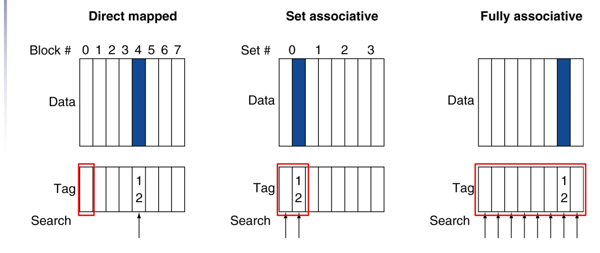

#### 5.3.1 Cache 组织结构的进化史
假设 Cache 总容量固定（例如 8 个 Blocks）：

*   **直接映射 (Direct Mapped / 1-way)**
    - **规则**：1 个组（Set）里只有 1 个空位（Block）。总共有 8 个 Set。
    - **查找方式**：根据 Index 找到唯一的固定坑位，只进行 **1 次** Tag 比较。
    - **特点**：冲突极为严重。
*   **组相联 (Set Associative / N-way)**
    - **规则**：将几个 Block 绑在一起作为一个“组”。例如“2路组相联（2-way）”表示 1 个 Set 里有 2 个空位。总 Set 数量缩减为 4 个。
    - **地址变化**：因为 Set 数量减半，所以用于寻址的 Index 位宽减少（例如 3位变2位），省下来的位变成了 Tag 的一部分。
    - **查找方式**：根据 Index 找到对应的 Set 包厢，然后**并行（同时）使用 2 个比较器**，比对包厢里 2 个 Block 的 Tag。
    - **破局点**：之前冲突的数据（例如 18 和 26 映射到同一个 Set），现在可以和谐地共存在这 2 个空位中，完美化解冲突。
*   **全相联 (Fully Associative)**
    - **规则**：干脆取消“分组（Set）”的概念。整个 Cache 就是一个拥有 8 个空位的大池子，任何主存数据可以放在**任意空位**。
    - **地址变化**：没有 Index，地址除了 Offset 之外，剩下全部是 Tag。
    - **查找方式**：由于不知道数据在哪里，必须**并行调用 8 个比较器**，同时对所有 Cache 行进行 Tag 比对。

#### 5.3.2 架构师视角的终极权衡 (The Architectural Trade-off)

选择哪种 Cache 组织方式，是微架构设计中最经典的 Trade-off。这并不是拍脑袋决定的，而是依靠大量的 **软件仿真 (Simulation)**，运行标准基准测试集（如 SPEC CPU）跑出来的综合最优解：

*   **硬件成本与功耗 (Hardware Cost & Power)**：直接映射最低，组相联居中，全相联最高（需要大量并行并行的比较电路）。
*   **查找延迟 (Hit Latency)**：直接映射最快（可以直接选中数据），全相联最慢（需要极其复杂的电路来选通匹配的那一路数据）。
*   **缺失率 (Miss Rate)**：全相联最低（只要 Cache 没满就不发生冲突），组相联居中，直接映射最高。

**最终工业界结论**：

*   **L1/L2/L3 Cache**：绝大多数采用 **N路组相联（Set Associative）**（通常 N = 4, 8, 16），在硬件复杂度和命中率之间取得最佳平衡（Sweet Spot）。
*   **全相联**：由于硬件开销和延迟太大，绝不能用于数据 Cache，仅用于容量极小但极其关键的组件中（如内存管理单元的 TLB 缓存）。


!!! question "多字节block"
    以上我们没有提到的是**多字节block**的写入、读出情况，详见：[多字节block的读写详情](./multi-bytes_block.md)

#### 5.3.3 Associative Caches

**(1) Fully Associative**

- 与直接映射相比的另一个极端
- 允许给定 block 放入任意缓存 entry 中
- 需要同时搜索所有 entry
- 每个 entry 均需比较器（成本较高）

**(2) Set Associative**

- 每个 set 包含 n 个 entry
- block number 决定所属集合  
    - block number %（set 数 in cache）  
    - block address % (block 数 in cache)  
- 同时搜索给定 set 中的所有 entry  
- n 个比较器（成本较低）

案例：

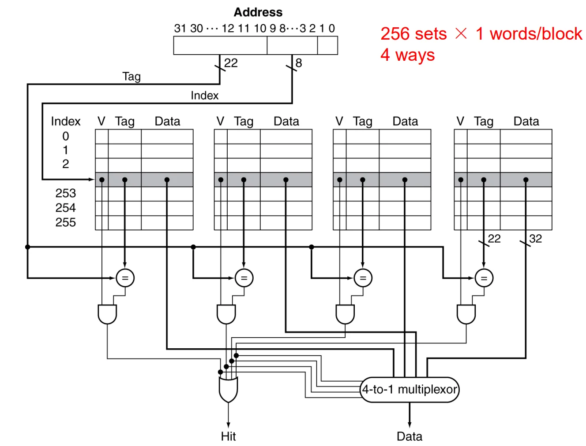

256 个 sets ，每个 block 1 个 word
因此 address[9:2] 是 block number, address[1:0] 是 block offset, 每一个 block 4 way。
其余 address[31:10] 是 tag。

#### 5.3.4 Replacement Policy 替换策略

- Direct Mapped：没有选择，只有一个 entry 可用
- Set Associative：需要选择一个 entry 进行替换

Set Associative Cache 的替换策略：

- 有没有空的 entry？如果有，直接放入空 entry
- 如果没有空 entry，选择一个 entry 进行替换
    - Random：**随机选择**一个 entry 替换
    - Least Recently Used (LRU)：替换**最近最少**使用的 entry
    - First In First Out (FIFO)：替换**最早进入 cache 的 entry**

**Example**

4-block Cache, three method:

- Direct Map
- 2-way Set Associative
- Fully Associative

Address Seq: 0, 8, 0, 6, 8

**Direct Mapped**

| Address | Cache index | Miss/Hit | 0 | 1 | 2 | 3 |
| --- | --- | --- | --- | --- | --- | --- |
| 0 | 0 | Miss | <span style="color: red;">Mem[0]</span> |   |   |   |
| 8 | 2 | Miss | <span style="color: red;">Mem[8]</span> |   |  |   |
| 0 | 0 | Hit | <span style="color: red;">Mem[0]</span> |   |  |   |
| 6 | 1 | Miss | Mem[0] | | Mem[6] |   |
| 8 | 2 | Hit | <span style="color: red;">Mem[8]</span> | |  Mem[6] |   |

**2-way Set Associative**

| Address | Cache index | Miss/Hit | set 0-0 | set 0-1 | set1-0 | set1-1 |
| --- | --- | --- | --- | --- | --- | --- |
| 0 | 0 | Miss | <span style="color: red;">Mem[0]</span> |  |   |   |
| 8 | 2 | Miss | Mem[0] | <span style="color: red;">Mem[8]</span> |  |   |
| 0 | 0 | Hit | <span style="color: green;">Mem[0]</span> | Mem[8] |  |   |
| 6 | 1 | Miss | Mem[0] | <span style="color: red;">Mem[6]</span> |  |   |
| 8 | 2 | Miss | <span style="color: red;">Mem[8]</span> | |  Mem[6] |   |

**Fully Associative**

| Address | Cache index | Miss/Hit |  |  |  |  |
| --- | --- | --- | --- | --- | --- | --- |
| 0 | 0 | Miss | <span style="color: red;">Mem[0]</span> |  |   |   |
| 8 | 2 | Miss | Mem[0] | <span style="color: red;">Mem[8]</span> |  |   |
| 0 | 0 | Hit | <span style="color: green;">Mem[0]</span> | Mem[8] |  |   |
| 6 | 1 | Miss | Mem[0] | Mem[8] | Mem[6] |   |
| 8 | 2 | Hit | Mem[0] | <span style="color: green;">Mem[8]</span> | Mem[6] |   |

更高的关联度确实能降低缺失率，但**收益呈现递减趋势**

Simulation of a system with 64KB D-cache, 16-word blocks, SPEC2000

- 1-way: 10.3%
- 2-way: 8.6%
- 4-way: 8.3%
- 8-way: 8.1%

### 5.4 Sources of Miss

- Compulsory misses (aka cold start misses) （强制性缺失/冷缺失）
    - 首次访问某数据块时发生
    - 当然，如果 block 是多个 word 的话，再次访问同一 block 内的其他 word 时就不会了，因为可以一开始就 load 整个 block 进 cache
- Capacity misses
    - 由**缓存容量有限**导致，典型就是 Fully Associative Cache 满了 
    - 被替换出的数据块后续再次被访问
- Conflict misses (aka collision misses)
    - 发生在**非Fully Associative**中
    - 由**set 内 entry 竞争引发**
    - 在总容量相同的Fully Associative中不会出现

### 5.5 Cache 性能量化分析 (Measuring Cache Performance)

在体系结构设计中，我们不能仅仅凭直觉说“这个 Cache 很快”，而必须用严谨的数学公式将其对 CPU 整体性能的影响量化出来。

#### 5.5.1 CPU 执行时间的拆解 (Components of CPU time)
在引入了 Cache 之后，程序在 CPU 上运行的总时间被拆分成了两部分：

*   **程序执行周期 (Program execution cycles)**：CPU 正常流水线工作的时间。这里面其实**已经包含了 Cache Hit Time（命中时间）**，因为只要命中，CPU 就能全速运行，不需要额外停顿。
*   **内存停顿周期 (Memory stall cycles)**：CPU 因为 Cache Miss 而被迫停下来等待底层数据搬运所消耗的时间。这是拖慢系统性能的核心罪魁祸首。

#### 5.5.2 核心量化公式
为了计算**内存停顿周期 (Memory stall cycles)**，架构师通常使用以下两种等价的计算公式：

**基于访存次数的公式**：

$$\text{Memory stall cycles} = \frac{\text{Memory\ accesses}}{\text{Program}} \times \text{Miss\ rate} \times \text{Miss\ penalty}$$

*(程序的总访存次数 × 缺失率 × 每次缺失带来的惩罚周期数)*

**基于指令数的公式**：
    
$$\text{Memory stall cycles} = \frac{\text{Instructions}}{\text{Program}} \times \frac{\text{Misses}}{\text{Instruction}} \times \text{Miss\ penalty}$$

*(程序的总指令数 × 每条指令产生的平均 Miss 数 × 每次缺失带来的惩罚周期数)*

#### 5.5.3 平均内存访问时间 (AMAT, Average Memory Access Time)
这是评价存储器层级系统性能**最重要、最核心的指标**。它综合了 Hit 和 Miss 的情况，反映了存储系统的平均响应速度。

**AMAT 公式：**

$$\text{AMAT} = \text{Hit\ time} + \text{Miss\ rate} \times \text{Miss\ penalty}$$

*   **Hit time (命中时间)**：去 Cache 中**查找并返回数据的时间**（不管命不命中，这个检查时间都必须花）。
*   **Miss rate (缺失率)**：需要去底层存储找数据的概率（反映了 Cache 结构的抗冲突能力）。
*   **Miss penalty (缺失惩罚)**：一旦 Miss，从**底层存储把 Block 搬运到 Cache 所需的额外时间**（反映了底层 DRAM 的延迟和总线带宽）。

#### 5.5.4 为什么 Cache 性能越来越重要？ (Amdahl's Law 的体现)
随着半导体工艺的发展，CPU 的计算性能在不断飙升，这反而凸显了 Cache 的重要性（即著名的“内存墙 Memory Wall”问题）：

*   **基础 CPI 降低 (Decreasing base CPI)**：随着流水线、超标量等技术的发展，**CPU 自身的 CPI 越来越低**（算得越来越快），这使得“**内存停顿时间**”在总执行时间中所占的**比例变得越来越大**。
*   **时钟频率提升 (Increasing clock rate)**：主频越高，意味着一个时钟周期越短。由于底层主存 DRAM 的绝对物理延迟（以纳秒 ns 计）很难降低，这就导致相同的一次 Miss 请求，在过去可能只惩罚 50 个周期，在现代高频 CPU 中可能会**折算成几百个 CPU 周期的停顿惩罚**。

**结论**：在评估现代计算机系统性能时，绝对不能忽略 Cache 的行为表现。**Cache 哪怕提升了 1% 的命中率，对整体性能的拉动也是极其巨大的**。


### 5.6 多级缓存架构 (Multilevel Caches)

随着 CPU 时钟频率的不断攀升，由于主存（DRAM）的访问延迟难以大幅降低，**单层 Cache 的 Miss Penalty（缺失惩罚）变得极其昂贵（动辄几百个时钟周期）**。为了缓解内存墙问题，现代处理器全面走向了**多级缓存架构**。

#### 5.6.1 各级 Cache 的角色与定位 (Roles of Multilevel Caches)
在多级架构中，不同层级的 Cache 承担着截然不同的历史使命，其设计侧重点也完全不同：

*   **L1 Cache (Primary Cache / 一级缓存)**
    *   **物理位置**：紧贴 CPU 核心。
    *   **架构形态**：通常分为独立的**指令缓存**（L1I）和**数据缓存**（L1D），以支持 CPU 的并行取指和访存。
    *   **设计核心目标**：**极小化命中时间 (Focus on minimal hit time)**。为了让 CPU 全速运行，L1 必须足够快（通常 1~4 个周期），因此它的**容量通常较小**，且**相联度不能太高**（以降低比较电路的延迟）。
*   **L2 Cache (二级缓存)**
    *   **架构形态**：通常为统一缓存（Unified L2 cache），即**指令和数据共享**。
    *   **设计核心目标**：**极小化缺失率 (Focus on low miss rate)**。它的任务是充当主存前的最后一道坚固防线，避免请求掉入龟速的主存中。因此它**容量更大**，且通常采用 **高相联度（Higher associativity）** 以减少冲突缺失。L2 的 Hit time 相对较慢对全局性能影响不大。
*   **L3 Cache 及主存**
    *   高端系统还会引入 L3 Cache。如果请求在 L2 依然 Miss，则由 L3 或主存（Main Memory）来服务。

#### 5.6.2 多级 Cache 性能计算实例 (Performance Example)
我们可以通过一个具体的计算例子，直观感受 L2 Cache 带来的巨大性能收益：

*   **系统预设参数**：CPU 基础 CPI = 1，主频 = 4GHz（1 个周期 = 0.25ns），主存访问延迟 = 100ns（折合 400 个时钟周期）。

**场景 A：只有 L1 Cache**

*   假设 L1 的 Miss rate = 2%。
*   Miss penalty = 100ns / 0.25ns = 400 cycles。
*   **Effective CPI** = **Base CPI + (Miss rate × Miss penalty)** = 1 + (0.02 × 400) = **9.0**

*(原本 CPI 为 1 的 CPU，因为 2% 的缓存缺失，速度直接慢了 9 倍！)*

**场景 B：加入 L2 Cache**

*   假设 L2 的访问延迟 = 5ns（折合 20 个周期）。引入 L2 后，全局缺失率（Global miss rate to main memory，即 L1 和 L2 都没命中的概率）降为 0.5%。
*   **此时的惩罚分为两级**：
    1. L1 Miss 但 L2 Hit 的惩罚 = 20 cycles
    2. L1 Miss 且 L2 也 Miss 的额外惩罚 = 400 cycles
*   **Effective CPI** = **Base CPI + (L1 Miss Rate × L2 Hit Penalty) + (Global Miss Rate × Main Memory Penalty)** 
    = 1 + (0.02 × 20) + (0.005 × 400) = 1 + 0.4 + 2.0 = **3.4**

**结论**：仅仅加入了一个延迟为 5ns 的 L2 Cache，就让整个 CPU 的性能提升了 **2.6 倍 (9.0 / 3.4)**！这就是多级 Cache 的威力。

#### 5.6.3 架构设计探讨 (Considerations)
基于多级体系，微架构师还需要决定：

*   **Block Size 差异**：L1 和 L2 的 Block size 是否应该一样？通常 L2 的 Block size 会更大，以利用空间局部性。
*   **包含策略 (Inclusive or not)**：
    *   *Inclusive（包含）*：L1 中的数据必须同时也存在于 L2 中（L2 是 L1 的超集）。
    *   *Exclusive（排他）*：L1 和 L2 的数据互不重叠，L1 踢出的脏数据会被塞进 L2，以**最大化总有效容量**。


### 5.4 Interactions with Advanced CPUs

- **cache miss 期间的乱序执行 (Out-of-order execute during cache miss)**
    - 待处理存储指令 (Pending store) 保留在 load/store unit 中
    - 相关指令 (Dependent instructions) 在 reservation stations 中等待
    - **无关指令 (Independent instructions) 继续执行**
- **非阻塞缓存 (Non-blocking cache)**
    - 支持 `Hit under miss` 或 `Miss under miss`
- **支持多发射 (Supporting multiple issue)**
    - 多体缓存 (Multi-banked caches)：在无存储体冲突 (bank conflicts) 的情况下，每个周期支持多次访问
- **数据预取 (Data prefetching)**
- **缓存失效的影响取决于程序数据流 (Effect of miss depends on program data flow)**
    - 分析难度大幅提升
    - 需使用系统仿真 (system simulation) 进行评估


### 5.5 Example: Software Optimization via Blocking

典型案例：矩阵乘法

- 常用于科学计算、机器学习等领域
- 适合用硬件和软件优化，而其他算子很难用硬件优化

矩阵乘法：

$$X=YZ$$

$X[i][j]$ 需要用到 $Y[i]$ 行与 $Z[j]$ 列的所有元素进行计算，因此访问模式具有**空间局部性**，适合 Cache 优化。

但是，如果内存是按照行存储矩阵的话，那么：

- 访问 $Y[i]$ 行具有空间局部性，Cache **命中率高**
- 访问 $Z[j]$ 列没有空间局部性，Cache **命中率低**

因此导致矩阵计算的时候，会有大量 miss，性能极差。

**解决方法**：**Blocking（分块）**
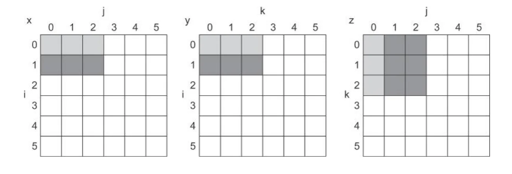

分块，每一块的元素都很少，可以**完全放入 Cache 中，充分利用空间局部性，极大提升性能**。

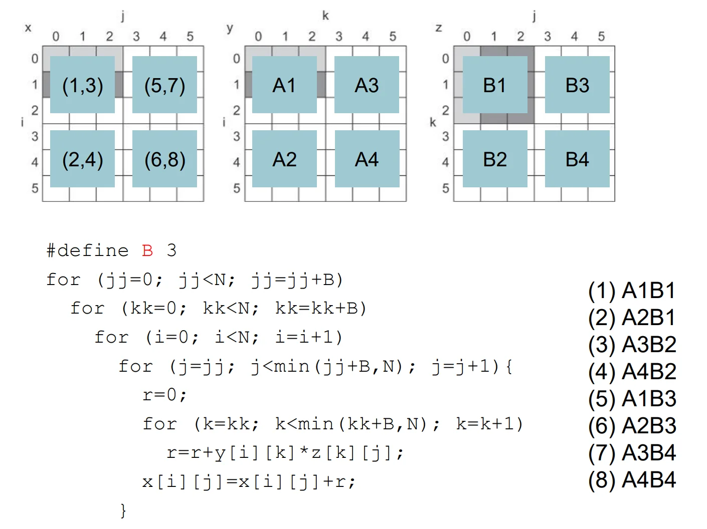

## VII. Virtual Memory

### 6.1 Physical Memory and Virtual Memory （物理内存与虚拟内存）

**物理内存**就是插在你电脑主板上的那一条条真实的内存条（DRAM）。

- 它的**容量是有限的**（比如 16GB）。
- 它的**地址是物理写死的**。如果你向物理地址 `0x0000` 写入数据，电信号就会精准地打在 DRAM 芯片的第一行第一列的电容上。

**虚拟内存**是操作系统（OS）配合硬件给应用程序制造的一个**完美的幻觉**。

- 当你运行一个程序（比如微信）时，操作系统会告诉微信：“兄弟，这是一段完全属于你个人的、连续的、庞大无比的内存空间（在 64 位系统下，这个空间大到近乎无限），里面除了你没有别人，你随便用！”
- 同时，操作系统也会告诉另一个程序（比如游戏）同样的话。
- **结果就是**：每个程序都以为自己独占了整个电脑的内存。微信往它的虚拟地址 `0x1000` 写数据，游戏也往它的虚拟地址 `0x1000` 写数据，两者完全不会冲突！

**Motivation**

- **内存不足**
    - 需要高效的内存管理
    - **进程 (Process)** 可能过大，超出physical memory的容量
    - **活跃进程 (Active Process)** 数量超过了physical memory的承载能力

- **多道程序设计（Multiprogramming）**
    - 高效的protection scheme
    - 简单的共享方式

虚拟内存的**效果**：

- 每个进程都拥有独立的 **private virtual address space**，用于存放其常用代码和数据（活跃部分）
- 向每个程序，也向程序员，提供了虚拟内存容量无限的假象
- 简化了程序的**加载执行**（reallocation）

    > 例如启动时将程序从硬盘搬到内存时，如果内存碎片化非常严重，**很难找到一段连续的空间**，但是虚拟内存技术掩盖了这个问题。如果没有虚拟内存技术的话，会**将其他程序的内存空间数据进行搬移**，导致加载时间很长。

- 受到其他程序的保护（注：结合上下文，此处指进程内存空间被保护，不受其他程序干扰）


### 6.2 VA, PA and Translation

#### 6.2.1 VA, PA, and Page

**<span style='color:blue'>Virtual address, VA</span>**: An address in virtual memory used by programmer
**<span style='color:green'>Physical address, PA</span>**: An address in main memory

虚拟地址、物理地址及其转换由 **CPU** 中的硬件 **Memory Management Unit (MMU)** 以及**操作系统 OS** 共同管理。

**<span style='color:red'>Page</span>**: **虚拟内存 (VM)** 和**物理内存**都被划分成一个个固定大小的块，叫做 Page（页）。每个 Page 的大小通常是 4KB（4096 字节），也有更大的 2MB、1GB 等选项。
**<span style='color:red'>Page fault</span>**: 当程序访问的 virtual page 不在物理内存中时，会产生 **Page fault**，操作系统需要将该页面从磁盘加载到内存中。

!!! note "转换流程"
    VA 到 PA 的转换流程就是：

    1. CPU 发出一个**虚拟地址**
    2. MMU 截获这个地址，拿着它的“虚拟页号”，去**查字典（Page Table）**
    3. 查到对应的“物理页号”(Physical Page Number, PPN)，再把虚拟地址的页内偏移（Page Offset）直接搬过来，拼成一个完整的物理地址
    4. 然后发给 **Cache 和 DRAM** 去取数据


#### 6.2.2 Page Table

现代计算机通常规定 **1 个 Page 的大小是 4KB（即 $4096 = 2^{12}$ 字节）**。

因此，地址的切割方式：

1.  **Page Offset（页内偏移）**：
    既然一页有 4096 个字节，为了在这 4096 个字节中精准定位到某一个字节，我们需要 **12 bit**。
    **极其重要的一点：在虚拟地址转换为物理地址的过程中，Page Offset 是绝对不变的！**

2.  **Page Number（页号）**：
    地址除掉低 12 位的 Offset 后，剩下的高位（$32-12=20$位）统统叫做页号。
    *   虚拟地址的高位叫 **VPN (Virtual Page Number，虚拟页号)**。
    *   物理地址的高位叫 **PPN (Physical Page Number，物理页号)**。

因此，Page Table 其实就是利用 **VPN** 作为索引，来查找对应的 **PPN** 的一个**映射表**。
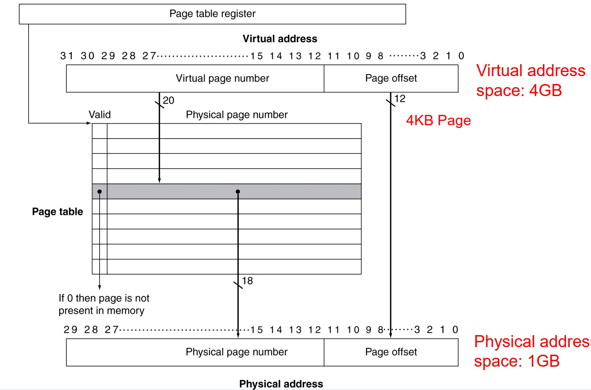

- Page Table 中每一个 **Entry（页表项，称为 <span style='color:red'>PTE</span>, Page Table Entry）** ，不仅要包含 20 位的 PPN ，因为本身是查表操作，所以还要有一个 <span style='color:red'>valid bit</span> 来标记这个 Entry 是否有效。
- VPN 有20位，即 Virtual Page Number 的位宽是 20 位，**即 Page Table 要包含 1M 个 Entry**，而每一个 Entry 又要占用多个字节来存放 PPN 和状态位，所以 **Page Table** 总大小是 MB 级别的，也应该**存放到 Memory** 中。
- 为了找到 Memory 中的 Page Table，我们还需要有 Page Table 的**基地址**，这一项任务由 CPU 中的一个特殊寄存器 **Page Table Register (PTR)** 来承担。

> 现代操作系统中，**页表内部本身也会分页**，为了节省内存空间。

!!! note "多页表"
    虚拟内存的目的之一是让每段程序都以为自己独占了整个内存空间。也就是说，程序 A 和程序 B 都可能发送指令 "0x1000000", 但是他们实际指向的物理内存地址和访问的指令/数据是完全不同的。
    ——这也就说，<span style='color:green'>每段程序都需要有自己独立的 Page Table</span> 来维护虚拟地址到物理地址的映射关系。
    当切换不同程序时，对应的页表也要切换，准确来说是**页表的基地址也要切换**——这个操作通过 PTR 实现。

!!! note "PTR 与 Process 切换"
    虽然我们可能会执行多个程序，但是 CPU 内部只有一个 PRT，**记录当前 active process 的 page table 基地址**。当发生上下文切换时，当前 PTR 值会写回内存中的一个位置，想要切换的 PTR 值会从内存中读上来。
    实际上，在发生 Process 切换的时候，除了 PTR, CPU 还需要保留的状态有：
    
    - PC
    - Register File, RF
    
    因此，我们常说，进程 (Process) 间切换开销大，线程 (Thread) 间切换开销小，**就是因为线程共享进程的地址空间，所以不需要切换 PTR**。


### 6.3 访问 Page Table —— <span style='color:green'>hit</span> or <span style='color:red'>miss</span>

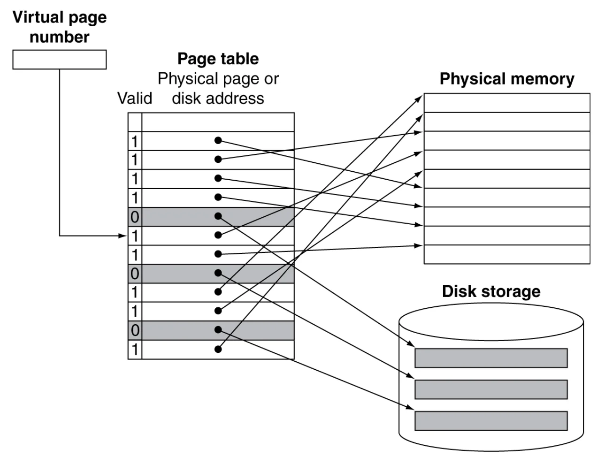

#### 6.3.1 hit or page fault?

1. Hit: 给定 VPN，在 Page Table 中对应的 Entry 的 valid = 1，说明这个**虚拟页已经被映射到物理内存中了，可以直接拿到对应的 PPN，完成地址拼接转换**。
2. <span style='color:red'>Page fault</span> （缺页中断）: 给定 VPN，在 Page Table 中对应的 Entry 的 valid = 0，说明数据不在 DRAM 里，它还在慢吞吞的**硬盘（Disk）**里。去主存拿数据（Cache Miss）顶多等几百个周期（$\mu\text{s}$级），但去硬盘拿数据（Page Fault）要等**几百万甚至上千万个周期（$\text{ms}$级）**！
    - 这个时候会进行类似 replace 的操作，会从**硬盘把这个 Page 搬到 Physical Memory 中**，并且**更新 Page Table** 中对应 Entry 的 valid 位和 PPN。
    - 如果 Physical Memory 中这个 **Page 是 Dirty 的话，还需要先把它写回硬盘**。总共就会有**两次 Disk 访问**，性能直接暴跌。

#### 6.3.2 Page Fault Penalty

**当发生 Page Fault 时**

1.  **触发 `Page fault handler`（运行在 privileged mode 的 OS 代码）**
2.  使用引发异常的虚拟地址找到对应的 `PTE`
3.  定位该 `page` 在磁盘上的位置
4.  选择一个物理页进行替换：
    -   如果被替换的页是 `dirty`（已修改），需要先将其写回磁盘的 `swap space`
5.  从磁盘读取所需的 `page` 到物理内存，并更新 `page table`
6.  将进程重新标记为可运行状态
7.  从引发 `page fault` 的指令处重新执行

⚠️ 注意：整个过程需要数百万个时钟周期，耗时极长，因此有两种解决思路：

1. switch to another process（切换到另一个进程）来利用 CPU 时间，这一种策略在之后讲解 GPU 设计的章节中会有更详细的介绍
2. 降低 `page fault rate`（页错误率）主要手段包括：
    - **采用 `Fully associative placement`（全相联放置策略）**，提高页的命中率
    - **使用 `Smart replacement algorithms`（智能替换算法）**，优化页替换策略
        - 即使考虑 `page fault penalty`，这类算法依然有效，能显著降低页错误率


#### 6.3.3 Page Fault Handler

除了上述 Page Fault Penalty 的处理工作外，Page Fault Handler 还**需要完成以下两项重要任务**：

- 恢复引发错误的 VA
    - 如果是指令错误，VA 位于 SEPC 中
    - 如果是数据错误，通过**解析指令（指令地址在 SEPC 中）找到基址寄存器和偏移字段，计算出 VA**
- 避免在底层异常处理代码执行期间发生 page fault
    - 操作系统将**异常入口点代码和异常栈放置在 <span style='color:red'>unmapped memory</span>** 中，这部分空间不会被分页，也就**不会因为访问 page table 而触发新的 page fault**
    - 在 MIPS 架构中，这部分位于 physical memory 的低地址区域

!!! attention "不分页与分页区的不同执行流程"
    这部分特殊的空间通常被称为 **“硬件直接映射段（Direct-Mapped Segment）”**或**“不经过 MMU 翻译的物理映射段（Unmapped Segment）”**。最为典型的代表就是 MIPS 架构中的 `kseg0` 和 `kseg1` 虚拟地址空间。
    CPU 执行代码的流程，准确来说应该是：

    1. CPU 发出地址，在地址送往 MMU（内存管理单元）和 TLB（旁路转换缓冲）之前，CPU 内部的**地址解码器（Address Decoder）**会首先拦截这个地址，并直接观察它的**最高几位（Most Significant Bits）**：如果高位指示它是普通虚拟地址，会直接送往 MMU 进行翻译；如果高位指示它是特殊的 unmapped 地址，则**直接绕过 MMU，送往物理内存访问单元（Memory Access Unit）进行访问。**
    2. 之后 unmapped 的流程就是普通的 Cache/DRAM 访问流程了。


#### 6.3.4 Replacement and Writes

**Replacement 策略：**

- 为降低 page fault rate，优先采用 **least-recently used (LRU)** 替换算法
- 实际常用 **pseudo least-recently used** (LRU) 替换算法
    - 访问页时，PTE 中的 reference bit（又称 use bit）会被**置为 1**，由 OS **周期性将其其清零**，reference bit = 0 的页表示近期未被使用

**Write 策略：**

- 策略1：以**块为单位一次性写入，而非单独写入单个地址**
- 策略2：write-through 不切实际，<span style='color:red'>因此使用 write-back</span>，因为 write-through 的时间开销太大了。所以会有 **dirty bit** ：当页被写入时，PTE 中的 dirty bit 会被置位

!!! note "Page Table 中的状态位"
    总结以上分析，Page Table 中的每个 Entry（PTE）至少包含以下几个重要字段：
    
    - **Valid bit**：标记该页是否有效（是否已经被映射到
    - **Drity bit**: 标记该页是否被修改过，即 DRAM 中的数据是否被修改过但还没有写回磁盘
    - **Reference bit**: 标记该页是否被访问过，用于 **Replacement 算法**的决策
    - **PPN**: 存储该页对应的物理页号（Physical Page Number），用于拼接 PA。

### 6.4 TLB (Translation Lookaside Buffer)

有了 Page Table 机制后，我们访问数据的流程变为了下列一些列步骤：

1. Load/Store 指令发出一个 VA
2. VA to PA translation：**MMU**——这里就会发生一次<span style='color:red'>访存</span>
3. 获取真正的 PA 后，再去 Cache 和 DRAM 进行数据访问，如果运气不好，Cache miss 了，可能还会发生一次<span style='color:red'>访存</span>

——所以，**每一次内存访问都可能伴随着一次甚至两次访存**，这对于性能来说是非常致命的。

——解决思路：人们发现，**Page Table 中有些 PTE 也会被经常访问**，因此，我们可以为 **Page Table** 也设置一个专门的 Cache，叫做 **Translation Look-aside Buffer (TLB，转换旁路缓冲)**。
> TLB 比较小，可以直接做在 CPU 内部，pipeline 旁边，如果运气好的话，<span style='color:green'>我们在 CPU 内部的这个 TLB 就能拿到 PA</span>

TLB 结构图：
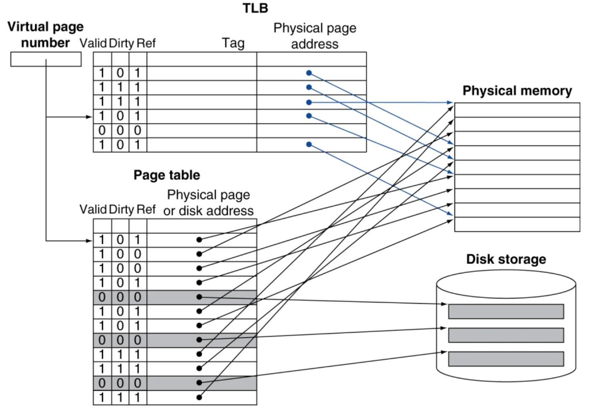

#### 6.4.1 TLB 的设计

TLB 的每个 Entry 包含：

- **data: PPN**，核心数据，用于拼接地址
- **Tag: VPN**，索引数据，用于查表。此外，由于 TLB 必须具有高命中率，因此通常采用**Fully Associative**的结构设计，即每个 Entry 都需要一个 VPN Tag 来进行比较。

    > 这也就是说 **TLB 大小不能太大**，否则比较电路的复杂度和延迟都会大幅增加。

- **Ref bit**: 用于记录该条目是否被访问过，通常在替换算法中使用。
- **Dirty bit**: <span style='color:green'>与 Page Table 的 dirty bit 含义相同</span>，标记该 page **是否被修改过但还没有写回磁盘。**
- **Valid bit**: 标记该条目是否有效，即是否包含一个合法的 VPN 到 PPN 的映射。这一个状态位与 Page Table 中的 valid bit 是<span style='color:red'>不同</span>的，指标是 Cache 空了，**不代表物理内存里没这一页**

#### 6.4.2 TLB Miss 

- 当 page 在内存中（仅发生 **TLB miss**）
    - 从**内存中加载 PTE 并重试**
        - 可由硬件处理
            - 对于更复杂的 page table 结构，硬件处理会变得复杂
    - 也可由软件处理
        - 触发特殊异常，由优化后的 handler 处理
        - MIPS 采用软件处理（约13个时钟周期）

- 当 page 不在内存中（**page fault**）
    - 由 OS 处理页的加载，并更新 page table
        - 调用 page fault handler
    - 之后重新执行引发异常的指令

### 6.5 完整的 Memory Hierarchy

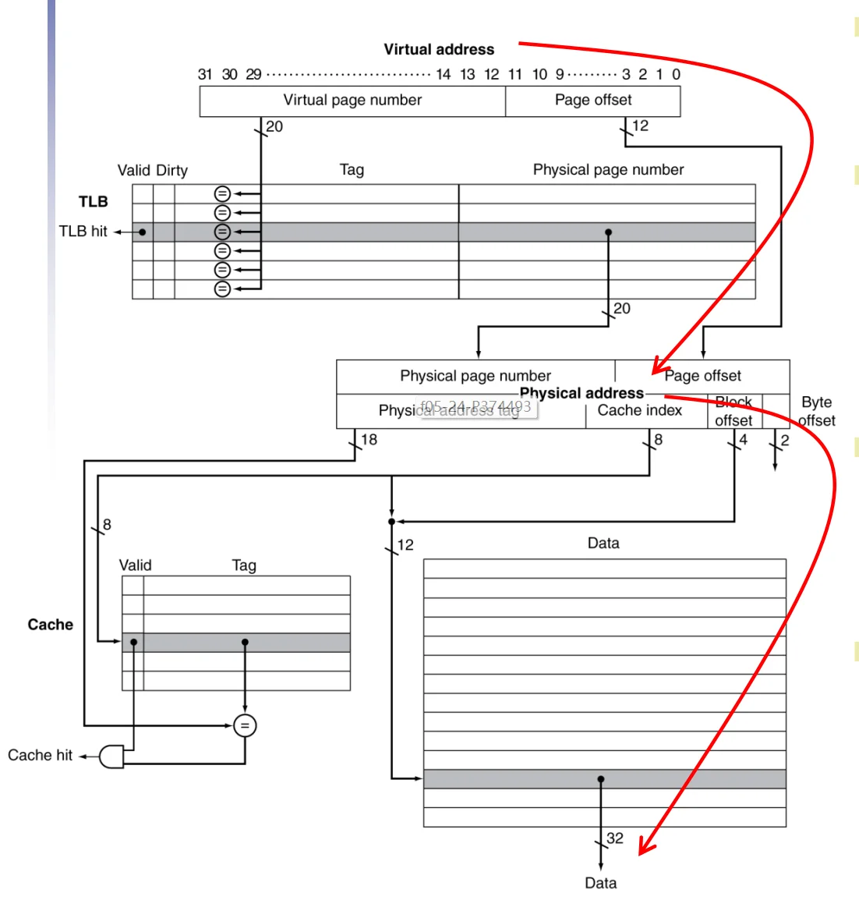
> 暂时没看明白这张图，先存放在这里。

我们从 CPU 发出一个虚拟地址开始，经历了 TLB、Cache、DRAM，甚至可能是磁盘的访问流程：

（也可参见：[Memory Hierarchy](./memory-hierarchy-flow.md)）

#### 第一阶段：地址翻译（从“幻觉”走向“现实”）

**起点：CPU 产生虚拟地址 (VA)。**
硬件首先将虚拟地址拆分为：**VPN (虚拟页号) + Page Offset (页内偏移)**。

##### 1. TLB 查找（闪电战，绝大多数情况）

*   **【TLB 命中 (TLB Hit)】**：
    *   太好了！直接在 TLB 中找到了对应的 **PPN (物理页号)** 。
    *   硬件直接将 **PPN + Page Offset** 拼接，瞬间合成出**物理地址 (PA)** 。
    *   **直接前往【第二阶段：数据访问】** 。
*   **【TLB 缺失 (TLB Miss)】**：
    *   糟糕，TLB 里没有这个翻译关系，硬件不得不走慢速通道 。
    *   **前往第 2 步**。

##### 2. Page Table 查找（常规通道）

*   MMU 顺着 **PTBR（页表基址寄存器）** 的导航，去物理内存（DRAM）中查该程序的 **Page Table（页表）** 。
*   **【页表命中 (PTE Valid = 1)】**：
    *   找到了！数据其实在内存里，只是刚才没缓存进 TLB 。
    *   MMU 获取到 **PPN**，并把这个翻译关系**写进 TLB**（以防下次再 Miss） 。
    *   拼接出**物理地址 (PA)** 。
    *   **前往【第二阶段：数据访问】** 。
*   **【缺页异常 (PTE Valid = 0 / Page Fault)】**：
    *   大事不妙，数据压根不在内存里，还在硬盘上！ 
    *   **前往第 3 步** 。

##### 3. 缺页处理（操作系统介入，最慢通道）

*   CPU 触发 **Page Fault 异常**，暂停当前程序，操作系统（OS）接管 CPU 。
*   OS 去**硬盘 (Disk)** 中定位该页的数据。
*   OS 查看物理内存（DRAM）是否还有空闲位置：
    *   *如果没有空闲物理页*：OS 必须挑一个**牺牲页（Victim Page）**踢走。如果这个牺牲页是脏的（Dirty = 1），必须**将它写回硬盘（Disk）**；然后再把这个物理页腾空。
*   OS 启动 DMA，把新页的数据从**硬盘 (Disk) 读入物理内存 (DRAM)**。
*   OS **修改页表**（将这一页的 Valid 置 1，写入物理页号 PPN），并**更新 TLB**。
*   OS 恢复程序执行，重新发送刚才的虚拟地址。
*   **重新回到第 1 步**（这次一定会进入 【TLB Hit】 的快车道）。


#### 第二阶段：数据访问（拿到真正的物理地址后）

**此时：MMU 已经拼装出了绝对真实的物理地址 (PA)。**
硬件将物理地址拆分为：**Tag (标记) + Index (索引) + Block Offset (块内偏移)**。

##### 4. Cache 查找（高速通道）

*   硬件根据 Index 找到对应的 Cache Set（组），并在该组内比对 Tag。
*   **【Cache 命中 (Cache Hit)】**：
    *   狂喜！数据就在 Cache 里。
    *   如果是**读**：Cache 芯片直接吐出数据，送入 CPU 寄存器，**整个访存流程完美结束**。
    *   如果是**写**：根据写策略（Write-Through 或 Write-Back）修改数据 [14, 15]。
*   **【Cache 缺失 (Cache Miss)】**：
    *   没中，只能去主存进货了。
    *   **前往第 5 步**。

##### 5. DRAM 访问（最终存储）

*   系统总线向**物理内存 (DRAM)** 发出读请求，读取包含该物理地址的**整个数据块 (Block)**。
*   **Cache 替换（踢人环节）**：
    *   Cache 必须挑一个 Block 踢走以容纳新块。
    *   如果被踢走的 Block 是脏的（Dirty = 1），必须**将它写回主存 (DRAM)**。
*   将从 DRAM 读回的新 Block **写入 Cache**，同时提取出 CPU 需要的那部分数据，送入 CPU 寄存器。
*   **整个访存流程结束！**

### 6.6 PIPT, VIVT and VIPT Cache

我们先拆解这三个缩写。它们都遵循同一个命名规则：

$$\mathbf{[Index\ 方式]\ I\ [Tag\ 方式]\ T}$$

*   **Index 方式**：决定了你**用什么地址去索引选通** Cache 的特定行（Set）。
*   **Tag 方式**：决定了你在 Cache 行里存的、用来**跟 CPU 比对的“身份证”** 是物理地址还是虚拟地址。


#### 6.6.1 PIPT

这是最容易理解的方式，也是最“老实”的路线。

*   **工作流程（串行）**：
    1.  CPU 发出虚拟地址 (VA)。
    2.  **停下！** 必须先送去 **TLB** 进行地址翻译。
    3.  拿到物理地址 (PA)。
    4.  用 PA 的低位（Index）去索引 Cache 行。
    5.  用 PA 的高位（Tag）去跟 Cache 里的 Tag 进行比对。
*   **优点（省心）**：
    *   **绝对没有别名问题（Aliasing）**。因为物理地址在全系统是唯一的，一个物理地址在 Cache 里永远只有一个确定的位置。
*   **缺点（慢）**：
    *   **延迟大**。Cache 必须死等 TLB 翻译完才能开始工作，这两个动作是**串行**的。对于时钟频率极高的 CPU，这是无法容忍的。
  
#### 6.6.2 VIVT—— 极速但浑身是病的“疯子”

*   **工作流程（超速并行/甚至不要 TLB）**：
    1.  CPU 发出虚拟地址 (VA)。
    2.  **不理 TLB**！直接用 VA 的低位索引 Cache，用 VA 的高位比对 Cache Tag。
    3.  如果 Hit，直接拿走数据！**全程完全不经过 TLB 翻译**，速度快到飞起。
    4.  只有当 Cache Miss 了，才需要去求助 TLB 翻译成物理地址，然后去主存拿数据。
*   **优点（极快）**：
    *   在 Cache Hit 的黄金路径上，TLB 完全是透明的，没有任何翻译开销。
*   **缺点（著名的“别名/歧义”两大绝症）**：
    1.  **同名异义（Homonyms）**：
        微信说“我的虚拟地址 `0x1000` 存着聊天记录”，游戏说“我的虚拟地址 `0x1000` 存着玩家血量”。因为 VIVT 只看虚拟地址，如果不做处理，微信就会读到游戏的血量。
        *   *解决办法*：每次进程切换，操作系统必须痛苦地把整个 L1 Cache 全部 **Flush（清空）**，性能损耗极大。在比对时，我们需要**同时比对虚拟地址和进程 ID**，才能确保拿到正确的数据。
    2.  **同义异名（Synonyms）**：
        微信和游戏共享了一块物理内存（比如物理地址 `0x8000`）。但微信通过虚拟地址 `0x1000` 访问，游戏通过虚拟地址 `0x4000` 访问。
        在 VIVT 中，这会导致同一个物理数据，在 Cache 的两个不同虚拟位置上各存了一份。微信改了它的那份，游戏读它的那份却没更新，**导致严重的缓存不一致**！

*   **现状**：因为这两个绝症太难治，现代通用 CPU（如 Intel、AMD、ARM、MIPS）已经**基本淘汰了 L1 Cache 的 VIVT 设计**。
*   

#### 6.6.3 VIPT

在虚拟地址翻译成物理地址的过程中，**低 12 位的 Page Offset 是绝对不变的**！
这就意味着：**虚拟地址的低 12 位，本质上就是物理地址的低 12 位！**

工作流程（完美的时空并行）：

1.  CPU 发出虚拟地址 (VA)。
2.  **兵分两路，同时出发**：
    *   **一路去 TLB**：把高位的 VPN 翻译成 PPN [1.2.9]。
    *   **另一路去 Cache**：因为 **Index 通常很短**，且完全落在低 12 位（Page Offset）的范围内，所以可以直接用这部分**虚拟地址的 Index 抢先去索引选通 Cache 行**！
3.  **终点汇合**：
    *   Cache 此时已经选通了对应的行，并吐出了那里的物理 Tag。
    *   此时，TLB 刚好也翻译完了，吐出了真正的 PPN。
    *   **MMU 把翻译出来的物理 PPN（Tag）跟 Cache 吐出的物理 Tag 进行比对**。
4.  比对成功，数据拿走。

    ```text
               CPU 发出虚拟地址 (VA)
                       │
          ┌────────────┴────────────┐
       高位 VPN                  低位 Offset (≤12 bit)
          │                         │
      送往 TLB 翻译             直接作为虚拟 Index
          │                         │
     吐出物理 PPN              选通并读取 Cache 行
          │                         │
          └────────────┬────────────┘
                       ▼
                 比对两端的物理 Tag (Physically Tagged)
    ```

*   **为什么快？**：TLB 翻译和 Cache 索引**在硬件上是完全并行的**。
*   **为什么没有同名异义（Homonym）问题？**：因为虽然我们用了虚拟 Index，但我们最后比对的是**物理 Tag（Physically Tagged）**。如果两个进程的虚拟地址撞车，<span style="color: red;">但因为它们翻译出来的 PPN 绝不相同</span>，比对 Tag 时瞬间就会发现不匹配，从而完美避开歧义。

**缺点**：

VIPT 看起来如此完美，但它在物理上有一个致命的**约束条件**：
> **用于选通 Cache 的 Index（加上 Block Offset）所占用的位数，绝对不能超过 12 位（Page Offset 的宽度）。**

如果我们把 L1 缓存做得很大，使得 Index 范围超过了此范围，操作系统必须介入，采用“页着色” (Page Coloring) 技术。OS 在分配物理页时，会强行保证虚拟地址越界的这几个 bit，在翻译成物理地址后**保持不变**（就像给内存涂上不同的颜色，相同颜色的虚拟页只能映射到相同颜色的物理页框）。这属于软硬件协同的高级黑科技。

完整的 VIPT 设计图：

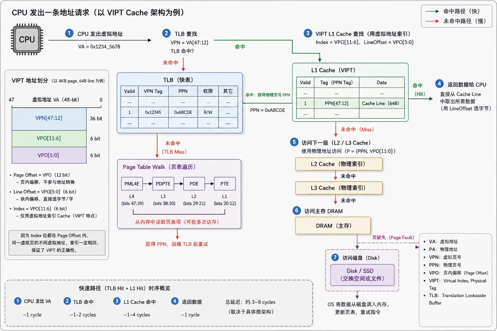

### 6.7 Overall Operations

For a memory hierarchy, **possible events** in the TLB, virtual memory and cache:

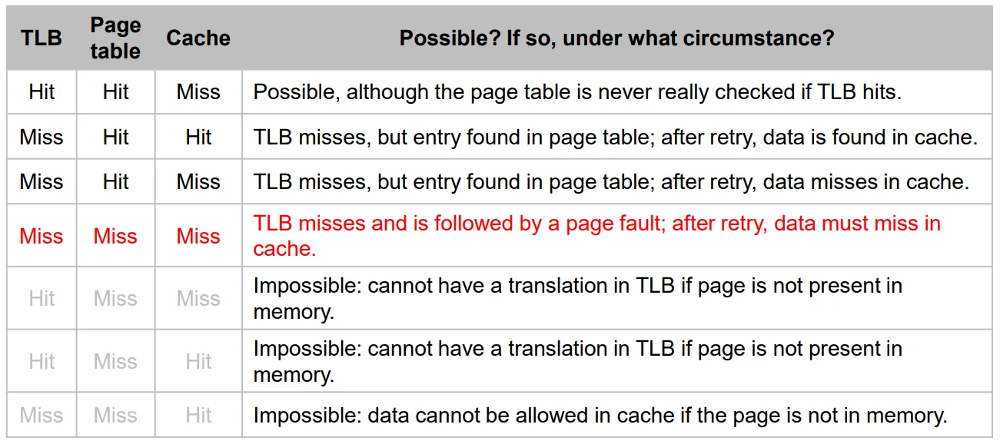


## VIII. Memory Protection

### 7.1 Memory Protection

在多任务操作系统中，多个并发运行的进程（Tasks）共享物理内存，甚至可以共享部分虚拟地址空间（如共享库、进程间通信映射）。为了防止程序因错误指针引发的误访问（Errant Access）或恶意攻击，硬件和操作系统必须协同实现强力的**内存保护机制**。

#### 1. 内存保护的基本原理 (Memory Protection Principles)

*   **防止恶意修改**：将页表（Page Tables）放置在操作系统（OS）专属的受保护地址空间（内核空间）中。用户进程无法直接读写页表，只有 OS 可以修改页表映射。这确保了用户进程只能访问 OS 分配给它的合法内存。
*   **防止跨进程读取**：硬件机制确保一个进程无法读取或写入另一个进程的数据。

#### 2. 硬件层面的保护支持 (Hardware Support for OS Protection)
为了让操作系统能够安全地管理页表，CPU 硬件必须提供以下支持：

*   **特权模式与用户模式划分**：
    *   **Privileged Supervisor Mode（特权监督模式，即内核模式 Kernel Mode）**：操作系统运行在此模式下，拥有最高权限。
    *   **User Mode（用户模式）**：普通用户进程运行在此模式下，权限受限。
*   **特权指令 (Privileged Instructions)**：诸如修改页表寄存器（PTR）、控制中断等关键指令，只有在特权模式下才能执行。如果在用户模式下强行执行，会触发硬件异常。
*   **受保护的状态信息**：页表和其它敏感系统状态信息，在硬件上被限制为只有在特权模式下通过 OS 代码才能访问。
*   **系统调用异常 (System Call Exception)**：用户程序通过特定的硬件陷阱（Trap）指令（例如 MIPS 中的 `syscall`）来请求操作系统服务。该指令会触发异常，使 CPU 安全地从用户模式转换到特权模式，并将控制权交给 OS 的特权代码。

##### 2.1 页表项 (PTE) 中的硬件控制位
为了在硬件层面实时检查访存权限，页表的每个表项（PTE）都集成了若干状态位：

*   **V (Valid)**：有效位，标记该页是否在物理内存中。
*   **R/W (Read/Write)**：读写控制位，标记该页是“只读（Read Only）”还是“可读写（Read/Write）”。若向只读页写入会触发保护异常。
*   **U/S (User/Supervisor)**：权限级别位，标记该页是“普通用户页”还是“系统特权页”。用户模式下的程序无法访问 U/S 标为 Supervisor 的页。
*   **D (Dirty)**：脏位，标记该页是否被修改过。
*   **A (Access)**：访问位，记录该页最近是否被访问过，供操作系统的页面替换算法决策。

---

### 7.2 上下文切换时的保护 (Protection on Context Switch)
当操作系统决定将当前运行的进程从 $P_1$ 切换到 $P_2$ 时，必须确保 $P_2$ 无法访问 $P_1$ 的内存空间。

#### 1 无 TLB 的情况

*   **机制**：由于每次访存都直接查内存中的页表，OS 只需要在切换时，将 CPU 内部的**页表基址寄存器（PTR / PTBR）**修改为指向 $P_2$ 的页表物理首地址。
*   **结果**：切换完成后，CPU 发出的虚拟地址会自动映射到 $P_2$ 对应的页表中，天然实现了空间隔离。

#### 2 有 TLB 的情况
如果系统引入了 TLB，简单修改 PTR 寄存器就会带来巨大的安全隐患，因为此时 TLB 缓存中依然残留着 $P_1$ 的大量虚拟到物理地址的翻译项（PTE 拷贝）。

为此，硬件架构提供了两种解决方案：

*   **方案一：清空 TLB（Flush / Clear TLB，最简单但低效）**
    *   **机制**：在每次进行进程上下文切换时，OS 通过特权指令强制将整个 TLB 里的所有 Valid bit 置零（全部清空）。
    *   **缺点**：如果系统切换进程的频率很高，TLB 会频繁被清空。新进程运行初期会发生极高的 TLB Miss 率，导致严重的系统性能下降。
*   **方案二：引入进程标识符（PID / ASID，现代 CPU 标配）**
    *   **机制**：在虚拟地址空间中引入 **Process ID (PID) 或 Task ID（在某些架构中称为 ASID，地址空间标识符）**，用来唯一标识当前的活动进程。
    *   **查找判定**：当 CPU 进行 TLB 比对时，**只有当“虚拟页号 (VPN)”和“进程 ID (PID)”同时匹配成功时，才判定为 TLB Hit**。
    *   **收益**：消除了在上下文切换时频繁清空整个 TLB 的需求（除非极其罕见的特殊场合）。TLB 中可以同时安全地共存多个不同进程的缓存项，极大地提升了多任务切换时的系统运行效率。

## IX. Virtual Machine

虚拟化技术通过在单一物理硬件平台上模拟出多个独立的完整计算机系统，实现了计算资源的深度共享与安全隔离。

### 8.1 虚拟机概述 (Overview of Virtual Machines)

*   **角色定义**：
    *   **Host (宿主机)**：提供底层实际物理硬件资源的计算机系统。
    *   **Guest (客户机)**：运行在虚拟环境中的操作系统（Guest OS）及其实际应用程序。
*   **核心优势**：
    *   **极佳的隔离性 (Improved Isolation)**：多个 Guest OS 运行在各自完全隔离的环境中，互不干扰。
    *   **安全性与高可靠性 (Security & Reliability)**：单一系统的崩溃或安全漏洞不会波及其他系统或物理机。
    *   **硬件资源共享 (Sharing of Resources)**：提高服务器等物理设备的资源利用率。
*   **性能开销**：虚拟化引入了一定的软件开销，但在现代高性能处理器的硬件支持下，该开销已降至完全可接受的范围。

### 8.2 虚拟机监视器 (VMM / Hypervisor)
虚拟机监视器（Virtual Machine Monitor, VMM，亦称 Hypervisor）是实现虚拟化最核心的软件层，其主要职能是将真实的物理资源（CPU、内存、I/O 设备）安全地映射为多套相互独立的虚拟资源。

*   **运行机制 (Trap-and-Emulate)**：
    *   为了防止 Guest OS 破坏其他虚拟系统或物理硬件，**Guest OS 的内核代码在真实硬件上只能以“用户模式（User Mode）”运行** [79]。
    *   当 Guest OS 试图执行特权指令（如修改其虚拟页表、控制硬件中断等）时，CPU 会产生硬件异常并**下陷（Trap）至 VMM 软件** [79]。
    *   VMM 拦截该指令后，在软件中对其进行模拟执行（Emulate），并安全地将结果返回给 Guest OS [79]。

#### 8.3 虚拟化内存管理 (Virtual Memory in Virtualization)
在虚拟化场景下，地址翻译从原本的一级映射演进为极其复杂的**两级映射（三类地址空间）**：

$$\text{VA (Guest 虚拟地址)} \Rightarrow \text{PA (Guest 物理地址)} \Rightarrow \text{MA (VMM 机器物理地址)}$$

*   **VA (Virtual Address)**：Guest OS 中应用程序使用的虚拟地址 [80]。
*   **PA (Physical Address)**：Guest OS 误以为的“物理地址”，本质上是虚拟出来的中间层地址 [80]。
*   **MA (Machine Address)**：真实的物理内存地址，由 VMM 进行统一分配与管理 [80]。

由于两级映射需要查两次页表，直接翻译的软件开销极大。为了加速这一过程，依旧可以采取 Cache 的方式：VMM 在软件中维护了**影子页表（Shadow Page Table）**。

*   **原理**：影子页表在软件中直接把最顶层的 **VA (Virtual Address)** 映射到最底层的 **MA (Machine Address)** [80]。
*   **效果**：通过合并两级翻译，硬件 MMU 在实际运行时**只需查一次影子页表**即可直接定位真实物理内存，极大地加速了虚拟化环境下的内存访问 [80]。

#### 8.4 处理器指令集对虚拟化的支持 (Instruction Set Support)
虚拟化的高效运行高度依赖于处理器指令集架构（ISA）的配合 [81]：

*   **严格特权控制**：所有敏感物理资源（包括页表、中断控制、I/O 寄存器）必须被严格限制，只有通过特权指令才能访问 [81]。
*   **特权指令下陷**：当 Guest OS（运行在用户模式下）执行特权指令时，硬件必须能够精确、安全地触发 Trap 并移交控制权给 VMM [81]。
*   **硬件虚拟化演进 (Hardware Virtualization Support)**：为了消除纯软件模拟（如影子页表）的巨大开销，现代主流指令集（如 x86 的 Intel VT-x、AMD-V，以及 ARM 的 Virtualization Extensions）都进行了硬件扩展，提供了原生的双层页表翻译（Nested Page Table / EPT）等硬件虚拟化支持 [81]。