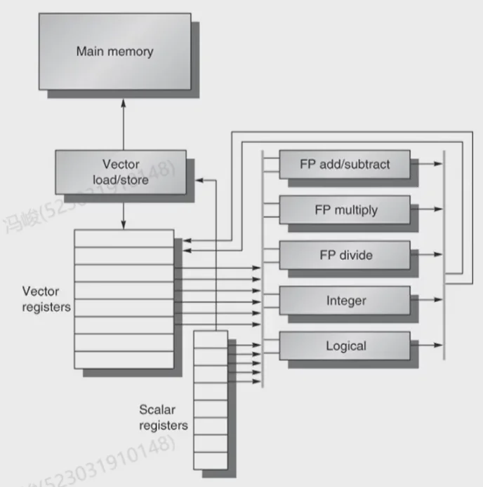
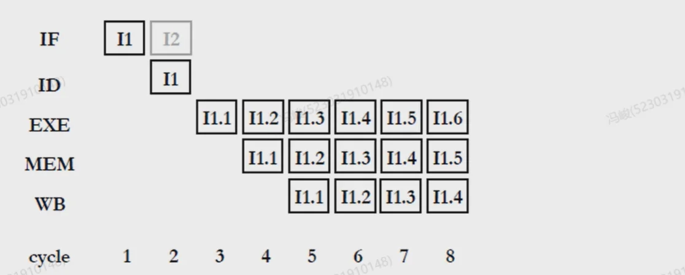
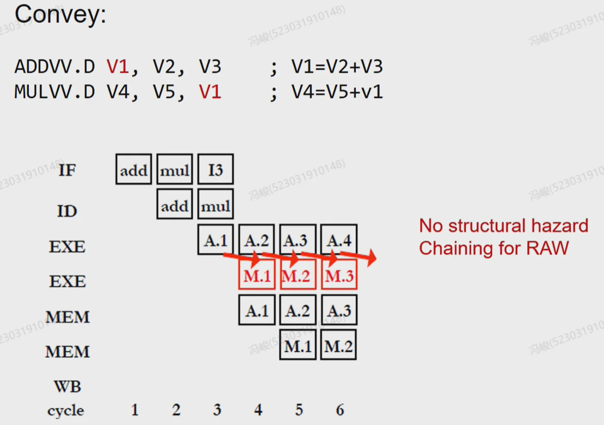
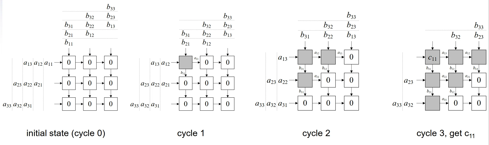
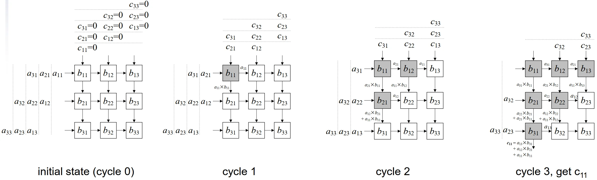

# 第六章：Parallel Processor

## I. Parallel 基础

### 1.1 什么是处理器领域的“并行处理”？
在微电子和数字电路优化（VLSI）中，**“展开（Unrolling）”本质上是一种“空间并行（Spatial Parallelism）”** ——通过复制多份硬件资源（比如放多个加法器），让它们在同一个时钟周期内同时干活。

在处理器架构领域，并行的核心思想是一致的：**在同一时刻（或同一个时间段内）执行多个操作，以提高系统的吞吐量（Throughput）和性能。**
只不过，相比于纯硬件电路的“暴力复制”，处理器的并行具有**更强的通用性、更复杂的控制逻辑，并且需要软硬件（指令集与微架构）的协同**。

处理器领域的并行一般分为两个大维度：**时间上的并行**和**空间上的并行**。

*   **时间并行（Temporal Parallelism）**：**流水线（Pipelining）**是典型代表。一条指令没有执行完，下一条指令就开始了，时间上重叠。
*   **空间并行（Spatial Parallelism）**：增加多套执行单元（ALU、FPU等），在同一个时钟周期内同时处理多条指令或多份数据。

### 1.2 处理器中常用的并行分类（经典架构视角）

在现代计算机体系结构中，我们通常将并行按照**“粒度”**划分为三个主要层次。

#### (1) 指令级并行 (ILP: Instruction-Level Parallelism)

*   **概念**：在**单线程**中，寻找可以同时执行的、没有相互依赖的机器指令，让它们并行执行。
*   **特点**：通常由**硬件**（CPU的微架构）动态挖掘，对程序员是透明的（程序员不需要改代码）。
*   **常见技术**：
    *   **流水线（Pipelining）**
    *   **多发射/超标量（Superscalar）**：不仅流水线，我还在 CPU 里放好几个 ALU。每个周期从指令缓存里取多条指令，只要它们没冲突，就同时塞给不同的 ALU 执行。
    *   **乱序执行（Out-of-Order Execution, OoO）**：打破指令的原有顺序，谁的数据准备好了谁先执行，榨干硬件的每一个周期。

#### (2) 数据级并行 (DLP: Data-Level Parallelism)

*   **概念**：对于**同一组操作（指令）**，同时应用到**大批量的不同数据**上。
*   **关联背景**：这和“展开（Unroll）”非常像！比如想把两个各有100个元素的数组相加。在 SISD（单指令单数据）CPU里要循环100次；在 DLP 架构下，我们直接把硬件 ALU 复制 16 份、32 份，一条指令下去，同时算出 16 个或 32 个结果。
*   **常见技术（即将学习的章节）**：
    *   **Vector Processor（向量处理器）**：RISC-V 里的 RVV 扩展就是这个，用超长的向量寄存器，一条指令处理整个数组。
    *   **SIMD（单指令多数据流）**：Intel x86 的 SSE/AVX，或者 ARM 的 Neon，属于稍微短一点的向量处理。
    *   **GPGPU（通用图形处理器）**：这是 DLP 的极致形态。NVIDIA 显卡里动辄成千上万个计算核心（CUDA Core），本质上就是把数据级并行发挥到了极点。

#### (3) 线程级并行 (TLP: Thread-Level Parallelism)

*   **概念**：当 ILP（指令级并行）遇到瓶颈，DLP（数据级并行）又要求特定应用场景时，人们开始让处理器同时运行**多个相对独立的线程或任务**。
*   **常见技术**：
    *   **多核处理器（Multi-core）**：把多个 CPU 核心塞进一个芯片（SoC）。
    *   **同步多线程（SMT, 也就是 Intel 的超线程 Hyper-Threading）**：一个物理核心假装成两个逻辑核心，交替或者同时执行两个线程的指令，利用一个**线程 Cache Miss 停顿的时间，去跑另一个线程**。

### 1.3 体系结构祖师爷的分类：Flynn 分类法 (Flynn's Taxonomy)

根据**指令流（Instruction Stream）**和**数据流（Data Stream）**的数量，把计算机分成了四类：

1.  **SISD（Single Instruction Single Data）**：传统的单核 CPU，没有向量扩展。
2.  **SIMD（Single Instruction Multiple Data）**：**这就是马上要学的。** 一条指令控制多个处理单元，处理多份数据。**Vector Processor 和 GPGPU 的底层核心思想就是 SIMD**（NVIDIA 称其为 SIMT，本质是一脉相承的）。当然，这对程序本身要求比较高，<span style="color: red;">要求必须有 DLP 的特征</span>。哪些程序会有 DLP 呢？案例：**图像处理、科学计算、机器学习等**
3.  **MISD（Multiple Instruction Single Data）**：很少见，通常用于容错系统（多个芯片跑不同指令处理同一个数据，看结果对不对）。
4.  **MIMD（Multiple Instruction Multiple Data）**：现代的多核 CPU、数据中心集群，每个核跑不同的代码，处理不同的数据。

### 1.4 SIMD

*   对数据向量执行 elementwise 操作
*   例如：x86 中的 MMX 和 SSE 指令
    *   128-bit wide registers 中包含多个数据元素
*   所有 processors 在同一时刻执行相同的 instruction
    *   每个 processor 对应不同的数据地址等
    *   Spatial parallelism – 资源复制 (resource replication)
*   简化 synchronization
*   精简的 instruction control hardware
*   最适合高度 data-parallel 的 applications
    *   DLP (data-level parallelism)


## II. DLP

### 2.1 Vector Processor（向量处理器）

#### 2.1.1 Design

- 传统形式的 **SIMD**
- 深度流水线化的功能单元，用于开发 **DLP**
- 数据在 vector registers 与功能单元之间流式传输
    - 数据从内存中收集到寄存器（vector registers）中
    - 计算结果从寄存器写回内存
- 显著降低 **instruction-fetch bandwidth**（指令取指带宽）


示例：MIPS 的 **Vector** 扩展

- 32 × 64-element 寄存器（元素为 64-bit）
- **Vector** 指令
    - `lv`、`sv`：load/store vector（**向量加载/存储**）
    - `addv.d`：add vectors of double（双精度浮点数**向量加法**）
    - `addvs.d`：add scalar to each element of vector of double（**标量与双精度浮点数向量**的每个元素相加）
- pipeline 设计与 SISD 完全一致，只是处理硬件资源的数量增加了，可以同时处理多条数据 



同时包含：

- vector registers（向量寄存器）
- vector functional units（向量功能单元）
- scalar registers（标量寄存器）
- scalar functional units（标量功能单元）

#### 2.1.2 Example: DAXPY (Y = a * X + Y)

**(1) 常规 MIPS 代码**

```asm
l.d     $f0,a($sp)      ; load scalar a
addiu   r4,$s0,#512     ; upper bound of what to load
loop:
    l.d     $f2,0($s0)  ; load x(i)
    mul.d   $f2,$f2,$f0 ; a × x(i)
    l.d     $f4,0($s1)  ; load y(i)
    add.d   $f4,$f4,$f2 ; a × x(i) + y(i)
    s.d     $f4,0($s1)  ; store into y(i)
    addiu   $s0,$s0,#8  ; increment index to x
    addiu   $s1,$s1,#8  ; increment index to y
    subu    $t0,r4,$s0  ; compute bound
    bne     $t0,$zero,loop ; check if done
```


**(2) Vector MIPS 代码**

```asm
l.d       $f0,a($sp)      ; load scalar a
lv        $v1,0($s0)      ; load vector x
mulvs.d   $v2,$v1,$f0     ; vector-scalar multiply
lv        $v3,0($s1)      ; load vector y
addv.d    $v4,$v2,$v3     ; add y to product
sv        $v4,0($s1)      ; store the result
```

Vector MIPS 代码中，`lv` 指令一次性**加载了整个向量**（比如 64 个元素），`mulvs.d` 指令一次性对**整个向量与一个标量**进行乘法操作，`addv.d` 指令一次性**对两个向量进行加法操作**，最后 `sv` 指令一次性将结果存回内存。相比于常规 MIPS 代码需要循环处理每个元素，**Vector MIPS 代码大大简化了指令数量**，并且利用了数据级并行的优势。 


**但是，向量寄存器可能一次只能存 4 个元素，但是要处理的向量有 128 或者 512 个元素**：

我们极端一点，假设向量寄存器的长度直接就是 1 个元素，那么就会出现如下情况：

**(1) Example 1**



I1 在 ID 阶段时，I2 指令不会被取指，因为 I1 指令**还没有处理完所有的元素**。I1 的下一组元素会继续处理，但是我们已经**不用再软件上手动写循环了，硬件上会自动做掉**。
整个处理时间大概就是 **N(元素的个数) + 4** 的时间。

**(1) Example 2**

No structural hazard ! I1 每处理一个元素，I2 就会在下一个周期处理该元素。这种操作叫做：chaining（链式操作）。好处就是如果相邻两条指令有 dependence，可以将两条指令**链接**起来，用**同样差不多 N 个周期的时间处理完两条指令**。当然，前提是功能单元有多个。




### 2.2 SIMD（单指令多数据流）

<span style="color: green;">核心：一条指令控制多个处理单元，处理多份数据。</span>

案例：

- Intel MMX (1996)
    - 8个8-bit integer ops 或 4个16-bit integer ops
- Streaming SIMD Extensions (SSE) (1999)
    - 8个16-bit integer ops
    - 4个32-bit integer/fp ops 或 2个64-bit integer/fp ops
- Advanced Vector eXtensions (AVX) (2010)
    - 4个64-bit integer/fp ops

**Example: DAXPY (Y = a * X + Y)**

with 256-b SIMD **with suffix "4D" for 4** double-float operands

```asm
L.D      F0,a         ; load scalar a
MOV      F1,F0        ; copy a into F1 for SIMD MUL
MOV      F2,F0        ; copy a into F2 for SIMD MUL
MOV      F3,F0        ; copy a into F3 for SIMD MUL
DADDIU   R4,Rx,#512   ; last address to load
Loop:
    L.4D   F4,0[Rx]    ; load X[i], X[i+1], X[i+2], X[i+3]
    MUL.4D F4,F4,F0    ; a*X[i], a*X[i+1], a*X[i+2], a*X[i+3]
    L.4D   F8,0[Ry]    ; load Y[i], Y[i+1], Y[i+2], Y[i+3]
    ADD.4D F8,F8,F4    ; a*X[i]+Y[i], ..., a*X[i+3]+Y[i+3]
    S.4D   0[Ry],F8    ; store into Y[i], Y[i+1], Y[i+2], Y[i+3]
    DADDIU Rx,Rx,#32   ; increment index to X
    DADDIU Ry,Ry,#32   ; increment index to Y
    DSUBU  R20,R4,Rx   ; compute bound
    BNEZ   R20,Loop    ; check if done
```

.4D 后缀就会告诉处理器一次要处理 4 个 double-float 数据。**SIMD 指令的好处就是大大减少了指令数量**，同时利用了数据级并行的优势。相比于常规 MIPS 代码需要循环处理每个元素，SIMD 代码一次性处理多个元素，大大提升了性能。

- MIPS: 578 instructions, VMIPS: 6 instructions
- SIMD: `9 * 64/4 + 5 = 149` instructions, reduce bandwidth to 4x

### 2.3 Vector Processor vs SIMD

#### 2.3.1 加速方式的对比

Vector Processor 加速的方式：将底层整个单元向量化，例如功能单元和寄存器都要向量化
SIMD 加速的方式：在原来的数据宽度的基础上，拆成更小的数据宽度，例如 256 拆分成 4 个 64-bit 的数据块，**功能单元和寄存器不需要向量化，还是用原来的标量 Datapath，缺点就是要定义新的指令（.4D, .4S, .16D, .16S...），指令集的膨胀非常快**。

#### 2.3.2 Vector VS Scalar

- Vector architectures and compilers
    - **简化 data-parallel programming**（数据并行编程）
    - 显式声明不存在 loop-carried dependences（循环携带依赖）
        - 减少硬件层面的检查
    - Regular access patterns（规则访问模式）可受益于 interleaved and burst memory（交错与突发内存访问）
    - 通过避免 loops（循环）来避免 control hazards（控制冒险）
    - 相较于 scalar architecture（标量架构），在 power and energy（**功耗与能效**）方面更具优势
- 比 ad-hoc media extensions（专用媒体扩展，如 MMX、SSE）更通用
    - 与编译器技术的适配性更好

### 2.4 MISD Example: Systolic Array

核心：访问存储器的代价很大，因此：

**Reuse the data read from memory as many times as possible（尽可能多次地重用从内存读取的数据）**

#### 脉动阵列的典型算法：矩阵乘法 GEMM 

$$\begin{bmatrix}
a_{11} & a_{12} & a_{13} \\
a_{21} & a_{22} & a_{23} \\
a_{31} & a_{32} & a_{33}
\end{bmatrix}
\times
\begin{bmatrix}
b_{11} & b_{12} & b_{13} \\
b_{21} & b_{22} & b_{23} \\
b_{31} & b_{32} & b_{33}
\end{bmatrix}
=
\begin{bmatrix}
c_{11} & c_{12} & c_{13} \\
c_{21} & c_{22} & c_{23} \\
c_{31} & c_{32} & c_{33}
\end{bmatrix}$$

**c 驻留**



**b 驻留**

