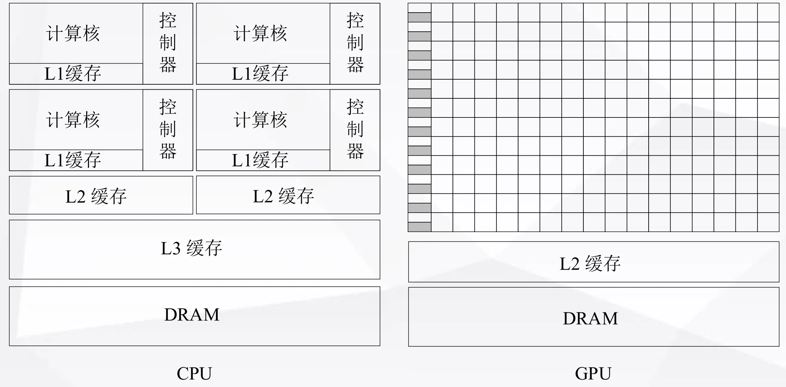
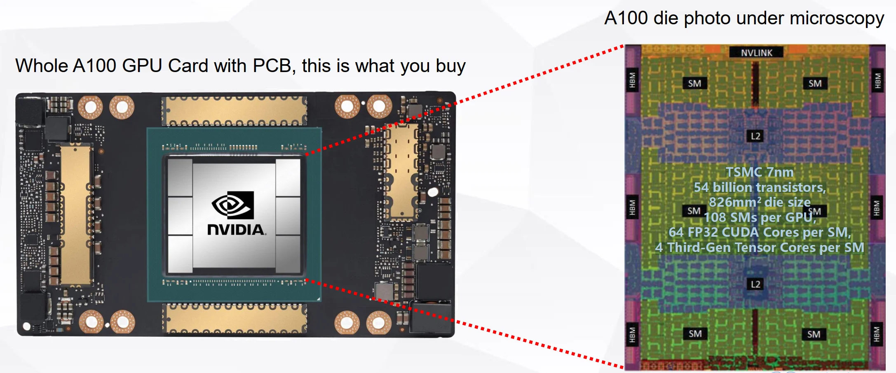
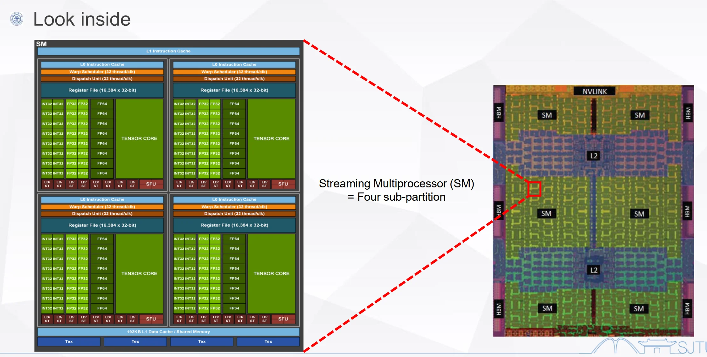

# GPUGPU Architecture Overview

## I. GPU Overview

### 1.1 Concept

- GPU: Graphics Processing Unit: 图形处理器，是专门为图形渲染和并行计算设计的处理器。
- GPGPU: General-Purpose Graphics Processing Units: 通用图形处理器，起源于GPU，专为并行计算而生
- Flynn terminology
  - SISD, SIMD, MISD, MIMD
- Parallelism
  - ILP, DLP, TLP
- Parallel architecture
  - Multi-core, cluster, WSE

### 1.2 CPU vs. GPU

- **Multi-core**: relative **a small number of cores**, each one is a full-flesh processor
- **Many-core**: a large number of cores, each one is **much smaller and simpler**
  - Transistors are **devoted to compute-intensive processing**, not caching and control

CPU 每一个核功能完整，包含计算、控制、缓存等功能；GPU 每一个核功能简化，主要用于计算，控制和缓存功能较弱。GPU 把更多的资源留给了计算，因此在处理计算任务时表现更好。

### 1.3 Example: NVIDIA A100

TSMC 7nm
54 billion transistors,
826mm2 die size
108 SMs per GPU,
64 FP32 CUDA Cores per SM,
4 Third-Gen Tensor Cores per SM

#### A100 Die Overview

1. 6 个 Streaming Multiprocessor (SM) 
2. 6 个 High bandwith Memory (HBM)
3. L2 Cache
4. NVLink 用于 GPU 之间的高速通信
5. PCIe 用于 GPU 与 CPU 之间的通信

#### Streaming Multiprocessor (SM) Overview

Streaming Multiprocessor (SM) = Four sub-partition
每一个 partition:

1. CUDA Core: 16 FP32 cores, 16 INT32 cores, 8 FP64 cores
2. Tensor Core
3. LD/ST: 8 个 Load/Store 单元
4. SFU: Speical Function Unit, 超越函数计算单元
5. Register File: 16,384 x 32-bit
6. L0 Instruction Cache

每四个 partition （即一个 SM）有一个 192 KB L1 Data Cache/Shared Memory 和 L1 Instruction Cache

## II. GPU History

| 时间 | 类型 | 相关标准 | 代表产品 | 基本特征 | 意义 |
| :--- | :--- | :--- | :--- | :--- | :--- |
| 80年代 | 图形显示 | CGA, VGA | IBM 5150 | 光栅生成器 | 最早图形显示控制器 |
| 80年代末 | 2D加速 | GDI, DirectFB | S3 86C911 | 2D图元加速 | 开启2D图形硬件加速时代 |
| 90年代初 | 部分3D加速 | OpenGL(1.1~4.1), DirectX(6.0~11) | 3Dlabs Glint300SX | 硬件T&L | 第一颗用于PC的3D图形加速芯片 |
| 90年代后期 | 固定管线 | OpenGL(1.1~4.1), DirectX(6.0~11) | NVIDIA GeForce256 | shader功能固定 | 首次提出GPU概念 |
| 2004~2010 | 统一渲染 | OpenGL(1.1~4.1), DirectX(6.0~11) | NVIDIA G80 | 多功能shader | CUDA与G80一同发布 |
| 2011~至今 | 通用计算 | CUDA, OpenCL 1.2~2.0 | NVIDIA TESLA | 完成与图形处理无关的 | NVIDIA正式将用于计算的GPU产品线独立出来 |

## III. GPGPU Overview

### 3.1 GPU 市场

GPU 市场分为两类：

*   **Desktop (桌面级)：** NVIDIA, AMD, Intel
*   **Embedded (嵌入式)：** Imagination PowerVR (曾用于 Apple), Qualcomm Adreno (曾用于 Samsung/Xiaomi), ARM Mali

### 3.2 NVIDIA GPGPU 演进

Fermi (2011) → Kepler (2012) → Maxwell (2014) → Pascal (2016) → Volta (2017) → Turing (2018) → Ampere (2020)

#### 🚀 关键性能指标爆发的节点：
*   **Pascal (P100)：** 首次搭载 **HBM2** 显存（显存接口从 384-bit GDDR5 提升到 4096-bit HBM2），显存带宽发生质变。
*   **Volta (V100)：** 首次引入 **Tensor Cores**（张量核心），专门为 AI 深度学习矩阵运算加速。此时 FP64 双精度浮点性能也大幅提升。
*   **Turing (T4)：** **极高能效比的 AI 推理卡**。相比 V100 动辄 300W 的功耗，T4 仅有 70W，非常适合云推理。
*   **Ampere (A100)：** 旗舰级产品，制程达到 **7nm**，晶体管数激增至 **542 亿**，Tensor Core 算力和显存（HBM2e）都达到了历代顶峰。

#### 详细参数对比（Markdown 表格）

| 产品型号 (Tesla) | M2090 | K40 | M40 | P100 | V100 | T4 | A100 |
| :--- | :--- | :--- | :--- | :--- | :--- | :--- | :--- |
| **GPU核心** | GF110 | GK110 | GM200 | GP100 | GV100 | TU104 | GA100 |
| **架构** | Fermi | Kepler | Maxwell | Pascal | Volta | Turing | Ampere |
| **SM数量** | 16 | 15 | 24 | 56 | 80 | 40 | 108 |
| **CUDA Cores** | 512 | 2880 | 3072 | 3584 | 5120 | 2560 | 6912 |
| **Tensor Cores** | NA | NA | NA | NA | 640 | 65 (第三代) | 432 (第三代) |
| **峰值 FP32 (GFLOPS)** | 1332 | 5046 | 6844 | 10609 | 15670 | 8141 | 19490 |
| **峰值 FP64 (GFLOPS)** | 666.1 | 1682 | 213.9 | 5304 | 7834 | 254.4 | 9746 |
| **显存接口** | 384-bit GDDR5 | 384-bit GDDR5 | 384-bit GDDR5 | 4096-bit HBM2 | 4096-bit HBM2 | 256-bit GDDR6 | 5120-bit HBM2e |
| **显存容量** | 6GB | Up to 12GB | Up to 24GB | 16GB | 16GB | 16GB | 40GB |
| **TDP (功耗)** | 250 W | 235 W | 250 W | 300 W | 300 W | **70 W** | 250 W |
| **晶体管 (亿)** | 30 | 71 | 80 | 153 | 211 | 136 | **542** |
| **制程工艺** | 40nm | 28nm | 28nm | 16nm FinFET+ | 12nm FFN | 12nm | **7nm** |

