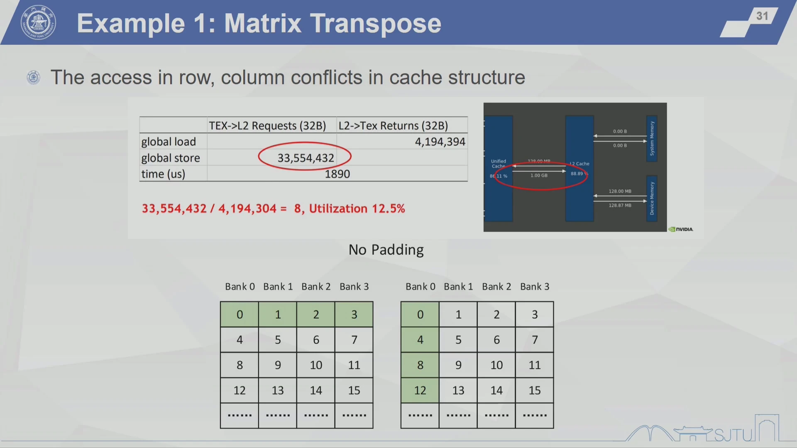
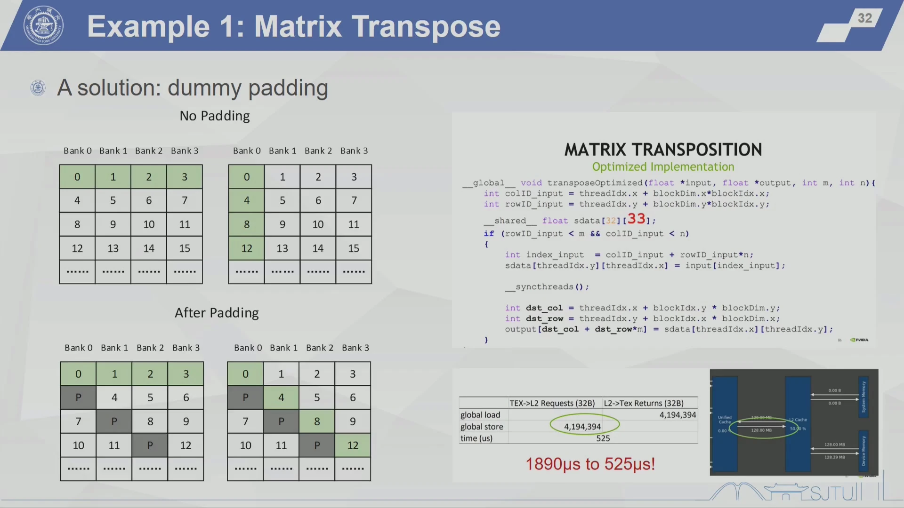
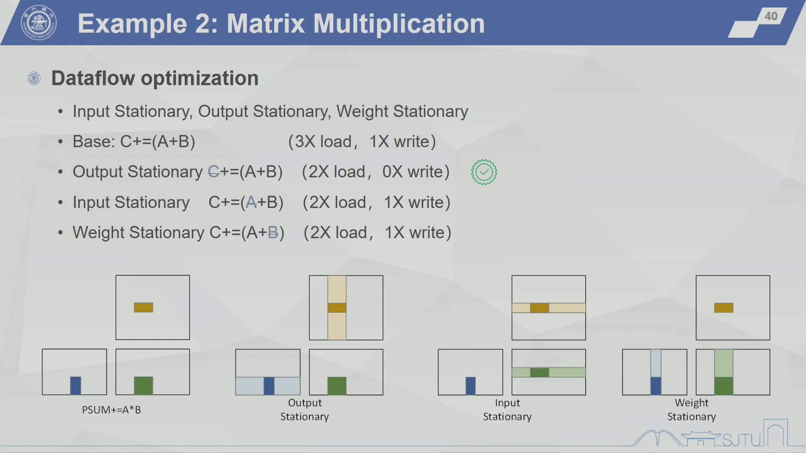
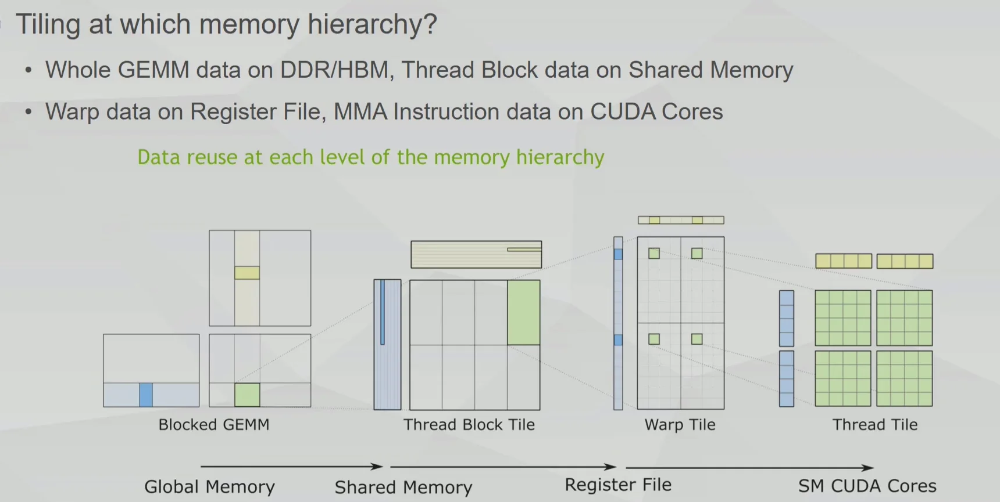
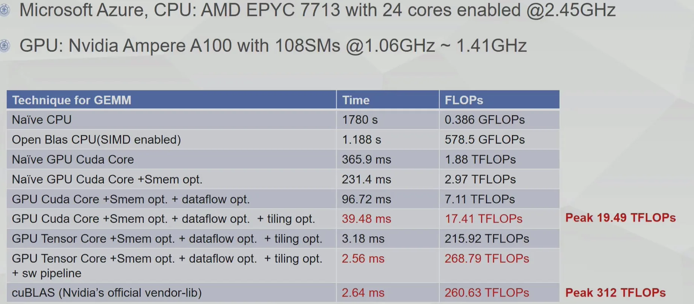

# Programming Model

## I. Programming Model Overview

### 1.1 History

- 2001/2002, researchers see GPU as data parallel coprocessor, the GPGPU field is born 
- 2007, NVIDIA releases CUDA
    - CUDA – Compute Unified Device Architecture
    - 统一计算设备架构
    - GPU shifts to GPGPU for computing
    - Graphics 编程 → General-Purpose 编程
- 2008, Khronos releases OpenCL specification

### 1.2 GPGPU Programming Model

一个编程模型应该包含：

- How to compute the wanted function
- 如何组织 memory 为计算服务
- How to map the function to the real hardware

此外，对于并行架构，尤其重要的是：

- How to divide the workload（如何划分工作量） 
- How to communicate between the divided work（如何在划分的工作之间进行通信）
- How to synchronize the divided work（如何同步划分的工作）

也就是说，GPGPU programming model 要能说明：在每一个时刻，每个 SM 中的每个 CUDA Core 应该做什么。

## II. NVIDIA Programming Model: CUDA

### 2.1 Computing Model

CUDA 使用的是**异构计算**（heterogeneous computing）模型：程序员写出的 GPGPU 应用程序会被分成两类代码：

- **Host code**：运行在 CPU 上的主机端代码
- **Device code**：运行在 GPGPU 上的设备端代码

从程序员视角看，一次典型 CUDA 执行流程如下：

- CPU 先把 processing data 从 main memory 拷贝到 GPU memory
- CPU 发出指令，告诉 GPU 要执行什么并行计算
- GPU 在多个 core 上并行执行
- 计算结果再从 GPU memory 拷回 main memory


CPU 通过 kernel 来调用 GPU。kernel 在 CUDA 的线程层级中也可以理解为一个 thread grid：

- `CPU: __host__`：指定代码在 CPU 上做
- `CUDA: __global__`：定义从 host 启动、在 device 上执行的 kernel
- `CUDA: __device__`：定义在 device 端调用、在 GPU 上执行的函数

注意，逻辑执行与 GPU 硬件的映射关系是：

- `kernel (grid)`(线程网格) $\rightarrow$ GPU
- `thread block`(线程块) $\rightarrow$ SM
- `thread`(线程) $\rightarrow$ SP / CUDA Core（逻辑对应，实际执行以 `warp` (线程束) 为调度单位）

kernel launch 的基本写法是：

```cpp
Name<<<dimGrid, dimBlock>>>(... parameters ...);
```

其中：

- `dimGrid`：**一个 grid 里有多少个 thread block**
- `dimBlock`：**一个 thread block 里分配多少个 thread**

例如向量逐元素相乘：

```cpp
// A = B * C, 8192 = 16 * 512
vect_mult<<<16, 512>>>(n, a, b, c);
```

这里的含义是：把 8192 个元素划分成 16 个 thread block，每个 thread block 有 512 个 thread。也可以换成其他满足总线程数需求的配置（例如 `8 x 1024`），但实际可行的 `dimBlock` 会受硬件最大线程数、寄存器、shared memory 等资源限制。

### 2.2 Thread Model

#### 2.2.1 Thread Hierarchy

CUDA 的线程层级是：

- Grid：线程网格
- Thread block：线程块
- Thread：线程

对应到程序里的内置变量：

- `gridDim(x, y, z)`：一个 grid 中 block 的**维度**，也就是“一个 grid 有几个 block, $x,y,z$的 范围是多少”
- `blockDim(x, y, z)`：一个 block 中 thread 的**维度**，也就是“**一个 block 有几个 thread, $x,y,z$的 范围是多少**”
- `blockIdx(x, y, z)`：当前 thread 所在 block 的编号，也就是“**当前 thread 在 grid 中的 block 编号**”
- `threadIdx(x, y, z)`：**当前 thread 在 block 内部的本地编号**

#### 2.2.2 Example

##### Example 1: 数组元素按照线程分配

如果只看一维数组（即假设所有层次均是一维网格），最常用的全局下标计算方式是：

```cpp
int index = threadIdx.x + blockIdx.x * blockDim.x;
```

这句话可以拆成：

- `blockIdx.x * blockDim.x`：前面已经经过了多少个完整 block
- `threadIdx.x`：当前 thread 在本 block 内的本地编号
- 两者相加得到当前 thread 对应的一维全局下标


```cpp
__global__ void kernel1(int* A) {
    int index = threadIdx.x + blockIdx.x * blockDim.x;
    A[index] = index;
}
// kernel1 结果：0 1 2 3 4 5 6 7 8 9 10 11

__global__ void kernel2(int* A) {
    int index = threadIdx.x + blockIdx.x * blockDim.x;
    A[index] = blockIdx.x;
}
// kernel2 结果：0 0 0 0 1 1 1 1 2 2 2 2

__global__ void kernel3(int* A) {
    int index = threadIdx.x + blockIdx.x * blockDim.x;
    A[index] = threadIdx.x;
}
// kernel3 结果：0 1 2 3 0 1 2 3 0 1 2 3
```

复习时可以这样记：

- `index` 是全局连续编号
- `blockIdx.x` 在同一个 block 内相同
- `threadIdx.x` 在每个 block 内从 0 重新开始

##### Example 2: Vector Multiplication

向量逐元素相乘的例子是：

```cpp
__global__ void vect_mult(int n, double *a, double *b, double *c)
{
    int i = blockIdx.x * blockDim.x + threadIdx.x;
    if (i < n) {
        a[i] = b[i] * c[i];
    }
}
```

host code 调用：

```cpp
vect_mult<<<16, 512>>>(n, a, b, c);
```

这个配置的含义是：

- Grid：8192 elements -> 8192 threads
- 16 thread blocks
- 每个 thread block 有 `8192 / 16 = 512` threads

注意 `if (i < n)` 的含义：如果**元素数不是线程数的整数倍**，例如只有 8191 个元素，但是我们依旧会按照 $16\times 512=8192$ 分配，最后多出来的 thread 会因为这句判断而不访问数组，从而防止越界。

!!! Attention "当硬件资源不够时会发生什么？"
    例如每一个 SM 只有 32个 SP？
    ——需要**时分复用**！
    $512/32 = 16$ warps，因此会构建 16 个 warp(线程束)。每一个时刻独立执行 1 个 warp，其他 warp 处于等待状态，等当前 warp 执行完毕后再切换到下一个 warp。

**Thread mapping to hardware**


##### Example 3: Matrix-Vector Addition

课件的第二个 CUDA 例子是矩阵加向量广播：

```cpp
C[i, j] = A[i, j] + B[j]
```

指定划分方式：

- 每个 Thread Block 负责一个 $H\times W = 128\times 32$ 的 tile
- 每个 tile 由 `threadsPerBlock(16, 8)` 个 thread 处理
- 因此：每个 thread 计算 $(32/16) \times (128/8) = 2 \times 16$ 个元素

device code 的关键下标计算是：

```cpp
int row_start = blockIdx.y * blockDim.y * 16 + threadIdx.y * 16;
int col_start = blockIdx.x * blockDim.x * 2 + threadIdx.x * 2;
```

> (1) **拆解**：每一个 thread 处理 16 行数据，`blockDim.y` 是一个 thread block 的 thread 的行数，`blockIdx.y` 是当前 block 在 grid 中的行编号。`blockIdx.y * blockDim.y * 16` 就表示当前 thread block 的**起始行号**，`threadIdx.y * 16` 表示当**前 thread 在 block 内的行偏移**。
> (2) 列的计算同理。

然后每个 thread 用两层循环完成自己的 `[2, 16]` 小块：

```cpp
for (int i = 0; i < 16; ++i) {      // 16 rows
    int row = row_start + i;
    if (row < numRows) {
        for (int j = 0; j < 2; ++j) {   // 2 columns
            int col = col_start + j;
            if (col < numCols) {
                matrix[row * numCols + col] += bias[col];
            }
        }
    }
}
```

这里的 `if (row < numRows)` 和 `if (col < numCols)` 是为了**处理边界情况**：当矩阵的行数或列数不是 128 或 32 的整数倍时，最后一个 tile 会有一些线程对应的**行或列超出矩阵范围**，这些线程就不进行计算。

host code 中的配置是：

```cpp
dim3 threadsPerBlock(16, 8);
dim3 blocksPerGrid((numCols + 31) / 32,
                   (numRows + 127) / 128);

matrixAddBiasLargeTile<<<blocksPerGrid, threadsPerBlock>>>(
    d_matrix, d_bias, numRows, numCols
);
```

这里 `(numCols + 31) / 32` 和 `(numRows + 127) / 128` 是向上取整。例如：如果 `numCols = 63`，应该划分为两列线程块，普通整数除法 `63 / 32 = 1` 会少算一块，但 `(63 + 31) / 32 = 2`，正好覆盖剩余列。

### 2.3 Memory Model

#### 2.3.1 GPGPU 中的 Memory Hierarchy

Memory model 的基本思想是：根据数据的访问需求选择合适的存储层次，**尽量减少对 global memory 的访问**。


当前 CUDA memory model 中常见的类型包括：

- Register file：**寄存器文件，每个 thread 私有**，速度最快，用来放线程内部的临时变量
- Local memory：**局部存储器，每个 thread 私有**；名字叫 local，但物理上通常仍在**设备端全局存储器**中，只是逻辑上属于某个 thread
- Shared memory：**共享存储器，同一 thread block 内线程共享**，位于同一 SM 内部的单独存储空间，<span style="color: green;">并非全局存储器</span>
- L1 data cache：类似之前 RISC-V 处理器中学过的 Cache，由硬件管理
- Global memory：**设备端全局存储器**，所有 thread 都能访问，但**访问代价**高
- Constant memory：**常量存储器**，物理上也在设备端全局存储器中，适合只读常量数据
- Texture memory：**纹理存储器**，物理上也在设备端全局存储器中，有专门的缓存/访问路径

注意关注Shared memory：

- 是 GPGPU 性能调优的重要资源
- 它由**程序员显式控制**，而不是像 cache 一样完全交给硬件
- 它可以服务于同一个 block 内线程之间的数据复用和通信
- 某些架构中，L1 cache 和 shared memory 会共享片上空间，可以动态调整划分；**如果程序员愿意主动优化，就可以把更多片上资源作为 shared memory 使用，从而写出更高性能的 CUDA 程序**


#### 2.3.2 TLP 和资源限制

TLP（Thread-Level Parallelism）可以理解为：一个 SM 上能同时驻留、随时可被调度的 thread / warp / thread block 有多少。TLP 越高，SM 越容易在某些 warp 等待 memory 或长延迟指令时，**切换去执行别的 warp**，从而**隐藏延迟**。

> **注意**：**“驻留” 的含义是一个 thread block / thread 的运行上下文已经被分配到某个 SM 上，占用了这个 SM 的寄存器、shared memory、warp slot 等资源，等待或正在被调度执行。**
> **关键点是**：驻留并不等于正在执行。

但是，TLP 不是只由 kernel launch 时写了多少 thread 决定。一个 SM 能同时容纳多少工作，还会被以下因素限制：

- `# threads`：一个 SM 最多能驻留多少 thread
- `# thread blocks`：一个 SM 最多能驻留多少 thread block
- `Size of register file`：每个 thread 使用越多 register，可同时驻留的 thread 越少
- `Size of shared memory`：每个 block 使用越多 shared memory，可同时驻留的 block 越少

##### Example 1: V100 的资源限制

以课件中的 V100 / Volta GV100 为例：

- 每个 SM 最多 `2048 threads`
- 每个 SM 最多 `32 thread blocks`
- 每个 SM 有 `256KB register file`
- 每个 SM 有最多 `96KB shared memory`

注意：课件里写的 `256KB RF` 是寄存器文件容量。因为一个 register 通常是 32-bit，也就是 4B，所以：

```text
256KB RF = 256 * 1024 B / 4 B = 65536 regs
```

如果希望 SM 同时驻留满 `2048 threads`，平均每个 thread 能分到的 register 数量就是：

```text
65536 regs / 2048 threads = 32 regs/thread
```

所以课件标注中的结论是：

- More regs needed, then less threads
- 如果一个 thread 需要超过 32 个 register，那么 V100 上这个 SM 就很难同时驻留满 2048 个 thread

shared memory 的思路类似。如果一个 SM 最多驻留 `32 blocks`，并且 shared memory 总量是 `96KB`，那么平均每个 block 只能用：

```text
96KB shm / 32 blocks = 3KB per block
```

所以另一个结论是：

- More shm needed, then less blocks
- 如果一个 block 需要超过 3KB shared memory，那么一个 SM 上就不能同时驻留满 32 个 block

##### Example 2

课件中的具体 kernel 例子：

```text
One kernel with 64 regs/thread and 8KB shm/TB, 128 threads/TB
```

分别看三个主要限制：

**(1) Register file 限制**

<span style="color: #8B0000;">每个 SM 的 RF 数量固定，每个 thread 分配的 RF 数 VS 可驻留的 thread 数</span>

```text
65536 regs / 64 regs/thread = 1024 threads
1024 threads / 128 threads/TB = 8 TBs
```

也就是说，如果每个 thread 要用 64 个 register，那么 register file 最多支持 `1024` 个 thread 同时驻留；每个 TB 有 `128` 个 thread，因此最多驻留 `8` 个 TB。

**(2) Shared memory 限制**

<span style="color: #8B0000;">每个 SM 的 shared memory 总量固定，每个 block 分配的 shared memory VS 可驻留的 thread block 数</span>

```text
96KB shm / 8KB shm per TB = 12 TBs
```

如果每个 TB 需要 8KB shared memory，那么 shared memory 最多支持 `12` 个 TB 同时驻留。

**(3) 最大线程数限制**

<span style="color: #8B0000;">SM 限定的最大 TB 数 VS SM 限定的最大 thread 数以及每个 TB 的 thread 数</span>

```text
2048 threads / 128 threads/TB = 16 TBs
```

如果只看最大线程数，每个 SM 最多可以驻留 `16` 个这样的 TB。

最终一个 SM 上能驻留多少个 TB，要取所有限制中的最小值：

```text
min(8, 12, 16, 32) = 8 TBs
```

因此这个 kernel 在 V100 上的驻留 TB 数量由 register file 卡住，而不是由 shared memory 或最大线程数卡住。这个例子说明：写 CUDA kernel 时，

1. **每个 thread 用太多 register 会降低可驻留 thread 数**；
2. **每个 block 用太多 shared memory 会降低可驻留 block 数；**
3. **两者都会降低 TLP**。

### 2.4 Synchronization

并行程序需要同步，是因为多个 thread 之间经常存在数据依赖：**一个 thread 先写入 shared memory，另一个 thread 后续要读取这个结果**。如果没有同步，后读的 thread 可能在数据还没写完时就开始读取，得到旧值或未定义值。

#### 2.4.1 Thread block 内同步

CUDA 中**最基础的同步方式是 block scope 内的同步**：

```cpp
__syncthreads();
```

`__syncthreads()` 的含义是：**同一个 thread block 内的所有 thread** 都必须到达这个同步点，之后这些 thread 才能继续向下执行。下图里画的同步栅栏（barrier）就是这个意思：先到的 warp / thread 会在 barrier 前等待，直到 block 内其他 thread 也到达。


需要注意它的作用域：

- `__syncthreads()` 只能同步**同一个 thread block 内部**的 thread
- 它不能同步不同 thread block，因为不同 block 可能被调度到不同 SM 上，甚至不一定同时驻留
- 对应到底层实现，可以理解为 CUDA 编译到类似 `bar` 的同步栅栏指令

下面的矩阵乘法片段展示了为什么 shared memory 常常需要和同步一起使用：

```cpp
__shared__ float Mds[BLOCK_SIZE][BLOCK_SIZE];
__shared__ float Nds[BLOCK_SIZE][BLOCK_SIZE];

Mds[tx][ty] = d_A[row * N + ty + i * BLOCK_SIZE];
Nds[tx][ty] = d_B[col + (tx + i * BLOCK_SIZE) * K];
__syncthreads();
```

这里每个 thread 负责把一部分 `A` 和 `B` 从 global memory 搬到 shared memory。**只有当 block 内所有 thread 都完成搬运之后**，后面的计算：

```cpp
P += Mds[tx][j] * Nds[j][ty];
```

**才可以安全读取完整的 tile**。因此第一处 `__syncthreads()` 是为了保证 shared memory 中的 `Mds` 和 `Nds` 已经被整个 block 填好。

代码中第二处同步：

```cpp
for (int j = 0; j < BLOCK_SIZE; j++) {
    P += Mds[tx][j] * Nds[j][ty];
    __syncthreads();
}
```

它强调的是：当多个 thread 共享同一块 shared memory，并且后续迭代可能复用或覆盖这些 shared memory 数据时，**需要通过同步保证所有 thread 的读取和写入阶段不会交错**。更常见的 tiled matrix multiplication 写法通常是在完成整个 `j` 循环之后、进入下一轮 tile 加载之前同步一次，避免下一轮加载覆盖当前轮还没读完的数据。

#### 2.4.2 其他作用域的同步

除了 block 内同步，CUDA 还提供 host 端看到的更大作用域同步：

- `cudaDeviceSynchronize()`：等待当前 device 上前面提交的工作完成。它是 **device 级别的 host-device 同步**，常用于 **kernel launch 之后**检查错误、计时或确保结果已经完成。
- `cudaStreamSynchronize(stream)`：等待指定 stream 中前面提交的工作完成。**它只同步某一个 stream**，相比 `cudaDeviceSynchronize()` 作用域更小，更适合保留其他 stream 的并发执行。

## III. Summary of Thread Model

### 3.1 SIMD vs. SIMT

总结 GPGPU thread model 和传统 SIMD 编程模型的差异：

- SIMD：one thread + parallel OPs
- SIMT：many threads + scalar OPs

#### SIMD：一个线程，一条向量指令处理多个元素

以 ARM NEON 的向量乘法为例：

```cpp
for (i = 0; i < n; i += 4) {
    uint32x4_t a4 = vld1q_u32(a + i);
    uint32x4_t b4 = vld1q_u32(b + i);
    uint32x4_t c4 = vmulq_u32(a4, b4);
    vst1q_u32(c + i, c4);
}
```

从程序控制流上看，这仍然是**一个 thread** 在执行循环；只是每次循环使用 `uint32x4_t` 这样的向量类型，一次处理 4 个元素。因此 SIMD 的思路是：让一个线程发出一条“向量操作”，硬件的多个 lane 同时完成多个元素的计算。

手写标注里的“一次操作 4 个元素；从程序上还是一个 thread，但是一次处理多个元素”就是这个意思。

#### SIMT：多个线程，每个线程写标量代码

CUDA 的写法是：

```cpp
// host code
int nblocks = (n + 511) / 512; // 512 threads per Thread Block
vect_mult<<<nblocks, 512>>>(n, a, b, c);

// device code
__global__ void vect_mult(int n, double *a, double *b, double *c)
{
    int i = blockIdx.x * blockDim.x + threadIdx.x;
    if (i < n) {
        a[i] = b[i] * c[i];
    }
}
```


在 SIMT 中，程序员写的是每个 thread 要做的**标量操作**：每个 thread 根据自己的 `blockIdx.x` 和 `threadIdx.x` 算出一个 `i`，然后只负责 `a[i] = b[i] * c[i]` 这一份工作。硬件再把多个 thread 组成 warp，让它们以类似 SIMD 的方式一起发射执行。

所以可以这样对比：

| 模型 | 程序员看到的执行主体 | 一次操作覆盖多少数据 | 例子 |
| --- | --- | --- | --- |
| SIMD | 一个 thread / 一个控制流 | 一条向量指令处理多个元素 | `uint32x4_t` 一次处理 4 个元素 |
| SIMT | 很多 thread | 每个 thread 写标量操作，硬件把多个 thread 组成 warp 执行 | CUDA 中一个 thread 处理一个 `a[i]` |

#### SIMT 的几个重要特点

**(1) Address scattering**

SIMT 中每个 thread 都有自己的 `threadIdx` / `blockIdx`，因此可以算出不同地址。它们不一定非要访问连续地址，可以比较自然地支持分散地址访问。

这就是 `Address scattering`：**不同线程可以负责不同数据位置**，甚至负责不同任务。相比要求固定向量宽度和规则连续访问的 SIMD，SIMT 在表达不规则并行任务时更灵活。

**(2) Thread divergence**

SIMT 中每个 thread 逻辑上是独立线程，因此可以写：

```cpp
if (i < n) {
    a[i] = b[i] * c[i];
}
```

这类条件分支。比如最后一个 thread block 里，可能有的 thread 满足 `i < n`，有的 thread 不满足，这就是一种线程发散。

但是要注意：线程发散是“表达能力”的好处，也是“性能”上的潜在代价。同一个 warp 内的 thread 如果走不同分支，硬件通常需要用掩码**分别执行不同路径，最后再汇合**；因此**发散越严重，warp 的有效并行度越低**。

**(3) Number of instructions in ISA**

SIMD 往往需要暴露不同宽度、不同类型的向量指令或向量类型，例如 `.4s`、`.4d` 这类扩展含义。**SIMT 则可以让程序员写标量指令，硬件用 thread / warp 机制来组织并行**。

因此，SIMT 的一个好处是：ISA 不一定需要为每种向量宽度设计很多显式向量指令，程序员也不用在代码里直接操心“一条指令一次算几个元素”。并行度主要通过 thread 数量、thread block 数量和硬件调度来体现。

### 3.2 Hierarchical Thread Model: Thread Block

为什么 CUDA thread model 中需要 `thread block` 这一层？

它不是随便多加的抽象，而是在 programmability、hardware complexity、scalability 之间做平衡。

CUDA 的层级可以简化为：

```text
Grid -> Thread block -> Thread
```

后来的 Hopper 架构又引入了更高一级：

```text
Grid -> Cluster -> Thread block -> Thread
```

#### 为什么需要 Thread Block？

**(1) 为了提供 shared memory 和 block 内协作**

Thread block 是 shared memory 的作用域：**同一个 thread block 内的 thread 可以通过 shared memory 交换数据，并通过 `__syncthreads()` 做 block 内同步**。

如果缺少 thread block 这一层，模型只有：

```text
Grid -> Thread
```

那么线程之间交换数据就很难有一个“中间层”的片上共享空间，只能更多借助 global memory。global memory 延迟高、带宽代价大，通信成本会明显上升。

**(2) 降低通信成本：以 reduction 为例**

```text
Cooperation between threads,
e.g. reduction mapped on large-scaled hardware,
reduce the communication cost
```

以 reduction 为例，假设要对很多元素求和。比较好的方式不是让所有 thread 都直接去 global memory 里频繁写同一个结果，而是：

- **每个 thread block 先负责一段数据**
- block 内 thread 把数据加载到 shared memory
- **在 shared memory 中做局部 reduction**
- 每个 block 最后只把一个 partial sum 写回 global memory
- 再用后续 kernel 或更高层级继续合并 partial sums

这样**大量 thread 间通信发生在 shared memory 内**，而不是都通过 global memory 完成，所以通信成本更低。

**(3) 让线程数量更灵活，提高 TLP**

```text
Flexible number of threads for higher TLP
# thread blocks > # SMs
```

程序员通常会启动比 SM 数量更多的 thread blocks。硬件把这些 thread blocks 动态分配到 SM 上执行：

- 如果 GPU 的 SM 少，就**分批执行这些** thread blocks
- 如果 GPU 的 SM 多，就**可以同时执行更多** thread blocks
- 同一个程序不需要强依赖具体 GPU 有多少个 SM

即 “**无需感知不同 GPU 中 SM 数量的灵活调度**”：顶层按 thread block 为单位分配任务，程序员不用为不同 GPU 的 SM 数量重写任务划分。

以 **block 为单位调度，更适合大规模硬件**。thread block 是调度到 SM 的基本单位。相比直接按单个 thread 调度，按 block 调度有两个好处：

- 任务粒度更合适，**不需要硬件管理海量单个 thread 的全局调度**
- 一个 SM 可以驻留多个 block，当一个 block / warp 因长时间访存无法继续时，SM 可以切换去执行另一个 resident block / warp，从而隐藏延迟

如果顶层**直接按 thread 分配任务，硬件调度压力会很大**；如果只按整个 grid 分配任务，又缺少可拆分、可迁移、可复用的中间任务粒度。thread block 正好承担了这个中间层。

#### Thread Block Cluster

当硬件规模继续增长，只靠单个 SM 内部的 thread block 协作可能不够。一些程序需要在更大的范围内交换数据，这个范围可能超过单个 SM 的物理范围。

因此 Hopper 引入了 thread block cluster：

- cluster 位于 grid 和 thread block 之间
- cluster 中包含多个 thread blocks
- cluster 内不同 SM 之间可以有更快的通信通道
- 它扩展了“可协作线程集合”的范围，同时仍然保持层级化编程模型

可以把它理解为：thread block 解决的是**一个 SM 附近**的线程协作；thread block cluster 进一步解决的是**多个 SM 之间**的协作。

### 3.3 Summary

GPGPU thread model 的核心价值可以总结为：

- 用 SIMT 让程序员写“每个线程做什么”的标量代码，而不是手动写很多向量宽度相关的 SIMD 指令
- 用 `grid -> thread block -> thread` 的层级，把**庞大的并行任务拆成硬件容易调度的单位**
- 用 thread block 提供 shared memory 和 block 内同步，**降低线程协作的通信成本**
- 用大量 thread blocks 适配不同规模的 GPU，提高 TLP 并**隐藏访存延迟**
- 在硬件继续扩大时，用 cluster 扩展跨 SM 协作能力

## IV. Performance Tuning with Programming Model

### 4.1 Example 1: Matrix Transpose

矩阵转置是一个非常常见、看起来也很简单的操作：

```text
A'[i, j] = A[j, i]
```

如果矩阵按 row-major 存储，输入矩阵中 `(row, col)` 的下标是：

```cpp
int index_input = colID_input + rowID_input * n;
```

转置后的输出下标是：

```cpp
int index_output = rowID_input + colID_input * m;
```

也就是说，一个 thread 读入 `input[row][col]`，再写到 `output[col][row]`。

**Naive implementation 的问题**

naive 版本看起来很直接：每个 thread 负责一个元素，计算输入和输出下标，然后完成一次读和一次写。理论上，如果矩阵大小是 `m = 8192, n = 4096`，元素是 `float`：

```text
total bytes read  = 8192 * 4096 * 4 = 128 MB
total bytes write = 8192 * 4096 * 4 = 128 MB
```

总 IO 大约是 `256 MB`。如果显存带宽约为 `600 GB/s`，理想时间大约是：

```text
0.256 GB / 600 GB/s = 409.6 us
```

但课件中的 naive 版本实际跑到了约 `1890 us`，明显慢于理想值。



原因不在计算本身，而在访存模式：

- 读 input 时，warp 中相邻 thread 通常读相邻地址，global load 比较连续
- 写 output 时，由于是转置写入，相邻 thread 可能写到相隔很远的地址，global store 变成 stride / scattered access
- 这种行、列访问方向不一致，会在 cache / memory transaction 上产生冲突和低利用率

课件里的指标显示：

```text
global store requests = 33,554,432
ideal transactions    = 4,194,304
33,554,432 / 4,194,304 = 8
```

也就是说，store 侧请求数量膨胀到理想情况的 8 倍，有效利用率只有 `12.5%`。这个例子想说明：**矩阵转置不是算得慢，而是访存模式拖慢了性能**。

#### 优化思路：用 shared memory 做 tile

Programming Model 给我们的优化工具是 thread block 和 shared memory。可以让一个 thread block 负责一个小 tile：

1. 先让 thread block 中的 thread 从 global memory 连续读取一个 tile
2. 把 tile 放到 shared memory 中
3. 在 shared memory 中完成转置
4. 再把转置后的 tile 连续写回 global memory

这样做的核心思想是：把“全局内存中的不规则转置访问”拆成“global memory 连续读写 + shared memory 内部重排”。global memory 访问更规整，性能就会好很多。

#### Dummy padding

但是 shared memory 自己也有 bank。若直接使用 `32 x 32` 的 shared memory tile，**转置访问时可能让多个 thread 落到同一个 bank，形成 bank conflict**。

课件给出的解决方式是 dummy padding：

```cpp
__shared__ float sdata[32][33];
```

这里不是因为需要真正存 `33` 列有效数据，而是故意多加一列 padding，使**每一行的起始地址错开**。这样在按列方向读取 shared memory 时，thread 访问会分散到不同 bank，减少冲突，实现 **Bank Parallelism**。



优化后，课件里的 `global store` 请求从 `33,554,432` 降到 `4,194,394`，时间从：

```text
1890 us -> 525 us
```

这已经比较接近前面估算的理想访存时间 `409.6 us`。


### 4.2 Example 2: Matrix Multiplication

第二个例子是 GEMM（General Matrix Multiplication），也就是矩阵乘法：

```text
A = [M, K], B = [K, N], C = A * B = [M, N]
```

其中 `K` 是 reduction axis。对每个输出元素：

```text
C[i, j] = sum(A[i, k] * B[k, j])
```

GEMM 在深度学习和 LLM 里非常常见。

```text
Batch = 10, Seq = 2048, Hidden size = 4096
SGEMM with M, N, K = [20480, 4096, 4096]
```

这一节不是要深究每一版 kernel 的代码，而是看一个核心问题：**怎样根据 GPGPU programming model，把同一个 GEMM 映射到不同层级的硬件资源上，从而逐步提升性能**。

#### 从 naive 到 GPU kernel

最朴素的 CPU 版本就是三层循环：

```cpp
for (int i = 0; i < M; ++i) {
    for (int j = 0; j < N; ++j) {
        float sum = 0.0f;
        for (int k = 0; k < K; ++k) {
            sum += A[i * K + k] * B[k * N + j];
        }
        C[i * N + j] = sum;
    }
}
```

它直接表达了数学定义，但没有充分利用并行硬件。GPU naive 版本通常让一个 thread 负责一个 `C[row, col]`，thread 内沿 `K` 方向做 reduction。这样已经能把大量输出元素并行起来，但性能仍然离 A100 的峰值很远，因为每个 thread 都反复从 global memory 读 `A` 和 `B`，数据复用没有做好。

#### Shared memory optimization：减少重复访问 DDR/HBM

矩阵乘法的关键在于复用：

- 同一块 `A` tile 会被多个 `C` 元素使用
- 同一块 `B` tile 也会被多个 `C` 元素使用

如果每个 thread 都直接从 DDR/HBM 读自己需要的数据，就会产生大量重复访问。shared memory 优化的基本思想是：

1. 一个 thread block 负责一个 `C` 的 tile
2. 先把对应的 `A` tile 和 `B` tile 从 global memory 搬到 shared memory
3. block 内多个 thread 反复使用 shared memory 中的数据
4. 算完当前 tile 后，再进入下一段 `K` tile

没有 shared memory 优化时，`A` 和 `B` 会从 DDR 中被重复读多次；使用 shared memory 后，global memory 只负责把 tile 搬进来一次，后续复用发生在 shared memory 中。

这对应我们前面学过的 memory model：**让高复用数据尽量停留在更靠近计算单元的存储层级里**。

#### Dataflow optimization：让谁 stationary

dataflow optimization 关注的是：在计算 `C += A * B` 的过程中，应该让哪一类数据尽量停留在片上，减少搬运。

课件列了几种思想：

- Output Stationary：让部分和 `C` 尽量留在寄存器 / 片上，累加完成后再写回
- Input Stationary：让输入 `A` 尽量停留，被多个计算复用
- Weight Stationary：让权重 `B` 尽量停留，被多个计算复用



GEMM 中常见且自然的方式是 **output stationary**：每个 thread / warp 维护一小块 `C` 的 partial sum，把累加值留在 register file 中，直到 `K` 方向累加完成后再写回 global memory。这样可以减少对 `C` 的反复读写。

这个思想和神经网络加速器里常讲的 dataflow 是同一类问题：**不是只关心算多少次乘加，还要关心数据在哪一级存储里停留、什么时候移动、被复用多少次**。

#### Tiling：把 GEMM 映射到 memory hierarchy

GEMM 调优的核心形态是多级 tiling：



可以按硬件层级来理解：

- 整个 GEMM 数据放在 DDR/HBM，也就是 global memory
- **Thread block 负责较大的 tile，并把对应数据搬到 shared memory**
- **Warp 负责更小的 warp tile**，数据进入 register file
- Thread / MMA instruction 负责更小的 thread tile，最终送到 CUDA cores / Tensor Cores 执行

这张图的重点是：**每一级 memory hierarchy 都承担一个 tile，每一级都尽量做数据复用**。

所以 GEMM 的调优不是简单地“开更多 thread”，而是要设计：

- 一个 block 算多大的 `C` tile
- 每次搬多大的 `A/B` tile 到 shared memory
- 一个 warp 负责 tile 中的哪一块
- 每个 thread 在 register 中维护多少个 partial sums
- 数据搬运和计算能不能重叠

#### Tensor Core 和 software pipeline

当使用 Tensor Core 时，单次矩阵乘加的算力会大幅提高。课件中 half-float 的 Tensor Core 版本性能远高于普通 CUDA Core 版本。

但是算得越快，越容易暴露 memory access time：**如果数据搬运跟不上，Tensor Core 就会等待数据，产生 stall**。因此后面需要 software pipeline 这类技术，**让不同阶段重叠**：

- **当前 tile 正在计算**
- 下一批数据**同时从 global memory 搬到 shared memory**
- shared memory 中的数据**再继续搬到 register**

这和前面 memory hierarchy 的思想是一致的：**让数据提前到位，让计算单元尽量不断粮**。

#### Performance progression



- naive CPU 很慢
- OpenBLAS CPU 通过 SIMD 等优化大幅提升
- naive GPU 已经快很多，但离峰值还有距离
- 加入 shared memory、dataflow、tiling 后，CUDA Core 版本逐步接近 CUDA Core 峰值
- 换用 Tensor Core 后，性能跨到更高量级
- 再加入 software pipeline 后，性能进一步接近 cuBLAS

这个例子的重点可以压缩成一句话：

> GEMM 性能调优的本质，是把数据复用按 `global memory -> shared memory -> register file -> compute cores` 逐层安排好，并让计算和搬运尽量重叠。
