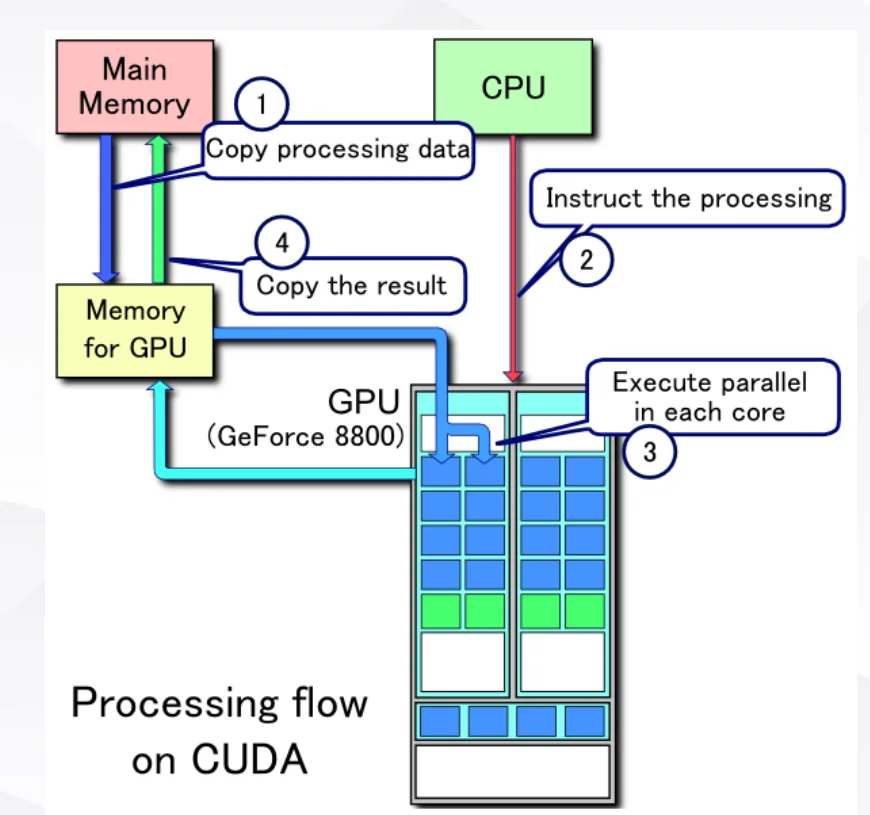
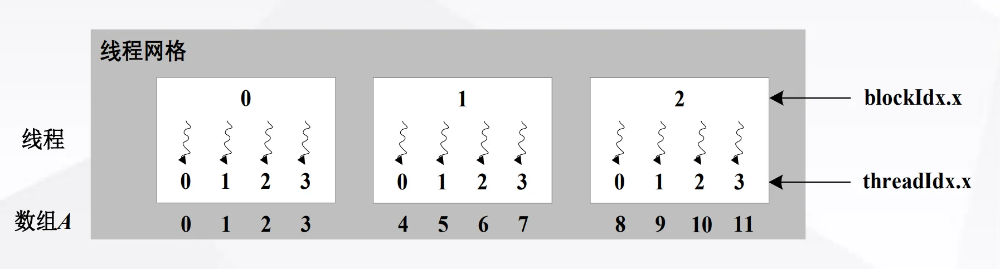
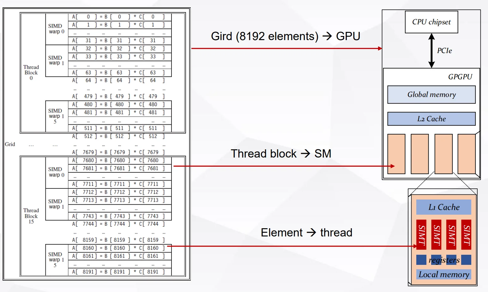
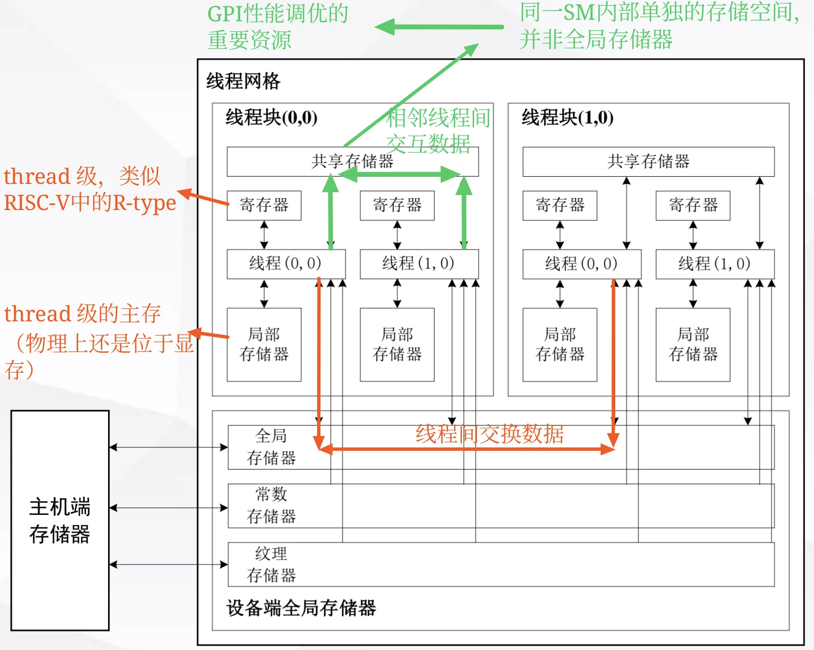
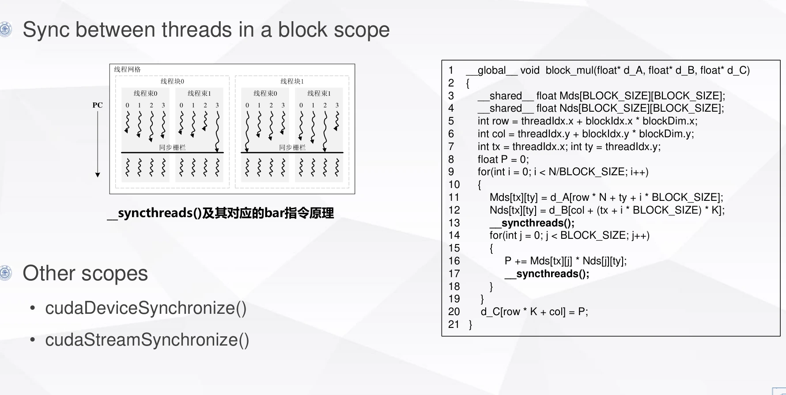

# Programming Model

## I. Programming Model Overview

### 1.1 History

- 2001/2002, researchers see GPU as data parallel coprocessor, the GPGPU field is born 
- 2007, NVIDIA releases CUDA
    - CUDA – Compute Unified Device Architecture
    - 统一计算设备架构
    - GPU shifts to GPGPU for computing
    - Graphics 编程 → General-Purpose 编程
- 2008, Khronos releases OpenCL specification

### 1.2 GPGPU Programming Model

一个编程模型应该包含：

- How to compute the wanted function
- 如何组织 memory 为计算服务
- How to map the function to the real hardware

此外，对于并行架构，尤其重要的是：

- How to divide the workload（如何划分工作量） 
- How to communicate between the divided work（如何在划分的工作之间进行通信）
- How to synchronize the divided work（如何同步划分的工作）

也就是说，GPGPU programming model 要能说明：在每一个时刻，每个 SM 中的每个 CUDA Core 应该做什么。

## II. NVIDIA Programming Model: CUDA

### 2.1 Computing Model

CUDA 使用的是**异构计算**（heterogeneous computing）模型：程序员写出的 GPGPU 应用程序会被分成两类代码：

- **Host code**：运行在 CPU 上的主机端代码
- **Device code**：运行在 GPGPU 上的设备端代码

从程序员视角看，一次典型 CUDA 执行流程如下：

- CPU 先把 processing data 从 main memory 拷贝到 GPU memory
- CPU 发出指令，告诉 GPU 要执行什么并行计算
- GPU 在多个 core 上并行执行
- 计算结果再从 GPU memory 拷回 main memory



CPU 通过 kernel 来调用 GPU。kernel 在 CUDA 的线程层级中也可以理解为一个 thread grid：

- `CPU: __host__`：指定代码在 CPU 上做
- `CUDA: __global__`：定义从 host 启动、在 device 上执行的 kernel
- `CUDA: __device__`：定义在 device 端调用、在 GPU 上执行的函数

注意，逻辑执行与 GPU 硬件的映射关系是：

- `kernel (grid)`(线程网格) $\rightarrow$ GPU
- `thread block`(线程块) $\rightarrow$ SM
- `thread`(线程) $\rightarrow$ SP / CUDA Core（逻辑对应，实际执行以 `warp` (线程束) 为调度单位）

kernel launch 的基本写法是：

```cpp
Name<<<dimGrid, dimBlock>>>(... parameters ...);
```

其中：

- `dimGrid`：**一个 grid 里有多少个 thread block**
- `dimBlock`：**一个 thread block 里分配多少个 thread**

例如向量逐元素相乘：

```cpp
// A = B * C, 8192 = 16 * 512
vect_mult<<<16, 512>>>(n, a, b, c);
```

这里的含义是：把 8192 个元素划分成 16 个 thread block，每个 thread block 有 512 个 thread。也可以换成其他满足总线程数需求的配置（例如手写标注中写到的 `8 x 1024`），但实际可行的 `dimBlock` 会受硬件最大线程数、寄存器、shared memory 等资源限制。

### 2.2 Thread Model

#### 2.2.1 Thread Hierarchy

CUDA 的线程层级是：

- Grid：线程网格
- Thread block：线程块
- Thread：线程

对应到程序里的内置变量：

- `gridDim(x, y, z)`：一个 grid 中 block 的**维度**，也就是“一个 grid 有几个 block, $x,y,z$的 范围是多少”
- `blockDim(x, y, z)`：一个 block 中 thread 的**维度**，也就是“**一个 block 有几个 thread, $x,y,z$的 范围是多少**”
- `blockIdx(x, y, z)`：当前 thread 所在 block 的编号，也就是“**当前 thread 在 grid 中的 block 编号**”
- `threadIdx(x, y, z)`：**当前 thread 在 block 内部的本地编号**

#### 2.2.2 Example

##### Example 1: 数组元素按照线程分配

如果只看一维数组（即假设所有层次均是一维网格），最常用的全局下标计算方式是：

```cpp
int index = threadIdx.x + blockIdx.x * blockDim.x;
```

这句话可以拆成：

- `blockIdx.x * blockDim.x`：前面已经经过了多少个完整 block
- `threadIdx.x`：当前 thread 在本 block 内的本地编号
- 两者相加得到当前 thread 对应的一维全局下标




```cpp
__global__ void kernel1(int* A) {
    int index = threadIdx.x + blockIdx.x * blockDim.x;
    A[index] = index;
}
// kernel1 结果：0 1 2 3 4 5 6 7 8 9 10 11

__global__ void kernel2(int* A) {
    int index = threadIdx.x + blockIdx.x * blockDim.x;
    A[index] = blockIdx.x;
}
// kernel2 结果：0 0 0 0 1 1 1 1 2 2 2 2

__global__ void kernel3(int* A) {
    int index = threadIdx.x + blockIdx.x * blockDim.x;
    A[index] = threadIdx.x;
}
// kernel3 结果：0 1 2 3 0 1 2 3 0 1 2 3
```

复习时可以这样记：

- `index` 是全局连续编号
- `blockIdx.x` 在同一个 block 内相同
- `threadIdx.x` 在每个 block 内从 0 重新开始

##### Example 2: Vector Multiplication

向量逐元素相乘的例子是：

```cpp
__global__ void vect_mult(int n, double *a, double *b, double *c)
{
    int i = blockIdx.x * blockDim.x + threadIdx.x;
    if (i < n) {
        a[i] = b[i] * c[i];
    }
}
```

host code 调用：

```cpp
vect_mult<<<16, 512>>>(n, a, b, c);
```

这个配置的含义是：

- Grid：8192 elements -> 8192 threads
- 16 thread blocks
- 每个 thread block 有 `8192 / 16 = 512` threads

注意 `if (i < n)` 的含义：如果**元素数不是线程数的整数倍**，例如只有 8191 个元素，但是我们依旧会按照 $16\times 512=8192$ 分配，最后多出来的 thread 会因为这句判断而不访问数组，从而防止越界。

!!! Attention "当硬件资源不够时会发生什么？"
    例如每一个 SM 只有 32个 SP？
    ——需要**时分复用**！
    $512/32 = 16$ warps，因此会构建 16 个 warp(线程束)。每一个时刻独立执行 1 个 warp，其他 warp 处于等待状态，等当前 warp 执行完毕后再切换到下一个 warp。

**Thread mapping to hardware**




##### Example 3: Matrix-Vector Addition

课件的第二个 CUDA 例子是矩阵加向量广播：

```cpp
C[i, j] = A[i, j] + B[j]
```

指定划分方式：

- 每个 Thread Block 负责一个 $H\times W = 128\times 32$ 的 tile
- 每个 tile 由 `threadsPerBlock(16, 8)` 个 thread 处理
- 因此：每个 thread 计算 $(32/16) \times (128/8) = 2 \times 16$ 个元素

device code 的关键下标计算是：

```cpp
int row_start = blockIdx.y * blockDim.y * 16 + threadIdx.y * 16;
int col_start = blockIdx.x * blockDim.x * 2 + threadIdx.x * 2;
```

> (1) **拆解**：每一个 thread 处理 16 行数据，`blockDim.y` 是一个 thread block 的 thread 的行数，`blockIdx.y` 是当前 block 在 grid 中的行编号。`blockIdx.y * blockDim.y * 16` 就表示当前 thread block 的**起始行号**，`threadIdx.y * 16` 表示当**前 thread 在 block 内的行偏移**。
> (2) 列的计算同理。

然后每个 thread 用两层循环完成自己的 `[2, 16]` 小块：

```cpp
for (int i = 0; i < 16; ++i) {      // 16 rows
    int row = row_start + i;
    if (row < numRows) {
        for (int j = 0; j < 2; ++j) {   // 2 columns
            int col = col_start + j;
            if (col < numCols) {
                matrix[row * numCols + col] += bias[col];
            }
        }
    }
}
```

这里的 `if (row < numRows)` 和 `if (col < numCols)` 是为了**处理边界情况**：当矩阵的行数或列数不是 128 或 32 的整数倍时，最后一个 tile 会有一些线程对应的**行或列超出矩阵范围**，这些线程就不进行计算。

host code 中的配置是：

```cpp
dim3 threadsPerBlock(16, 8);
dim3 blocksPerGrid((numCols + 31) / 32,
                   (numRows + 127) / 128);

matrixAddBiasLargeTile<<<blocksPerGrid, threadsPerBlock>>>(
    d_matrix, d_bias, numRows, numCols
);
```

这里 `(numCols + 31) / 32` 和 `(numRows + 127) / 128` 是向上取整。例如：如果 `numCols = 63`，应该划分为两列线程块，普通整数除法 `63 / 32 = 1` 会少算一块，但 `(63 + 31) / 32 = 2`，正好覆盖剩余列。

### 2.3 Memory Model

#### 2.3.1 GPGPU 中的 Memory Hierarchy

Memory model 的基本思想是：根据数据的访问需求选择合适的存储层次，**尽量减少对 global memory 的访问**。



当前 CUDA memory model 中常见的类型包括：

- Register file：**寄存器文件，每个 thread 私有**，速度最快，用来放线程内部的临时变量
- Local memory：**局部存储器，每个 thread 私有**；名字叫 local，但物理上通常仍在**设备端全局存储器**中，只是逻辑上属于某个 thread
- Shared memory：**共享存储器，同一 thread block 内线程共享**，位于同一 SM 内部的单独存储空间，<span style="color: green;">并非全局存储器</span>
- L1 data cache：类似之前 RISC-V 处理器中学过的 Cache，由硬件管理
- Global memory：**设备端全局存储器**，所有 thread 都能访问，但**访问代价**高
- Constant memory：**常量存储器**，物理上也在设备端全局存储器中，适合只读常量数据
- Texture memory：**纹理存储器**，物理上也在设备端全局存储器中，有专门的缓存/访问路径

注意关注Shared memory：

- 是 GPGPU 性能调优的重要资源
- 它由**程序员显式控制**，而不是像 cache 一样完全交给硬件
- 它可以服务于同一个 block 内线程之间的数据复用和通信
- 某些架构中，L1 cache 和 shared memory 会共享片上空间，可以动态调整划分；**如果程序员愿意主动优化，就可以把更多片上资源作为 shared memory 使用，从而写出更高性能的 CUDA 程序**


#### 2.3.2 TLP 和资源限制

TLP（Thread-Level Parallelism）可以理解为：一个 SM 上能同时驻留、随时可被调度的 thread / warp / thread block 有多少。TLP 越高，SM 越容易在某些 warp 等待 memory 或长延迟指令时，**切换去执行别的 warp**，从而**隐藏延迟**。

> **注意**：**“驻留” 的含义是一个 thread block / thread 的运行上下文已经被分配到某个 SM 上，占用了这个 SM 的寄存器、shared memory、warp slot 等资源，等待或正在被调度执行。**
> **关键点是**：驻留并不等于正在执行。

但是，TLP 不是只由 kernel launch 时写了多少 thread 决定。一个 SM 能同时容纳多少工作，还会被以下因素限制：

- `# threads`：一个 SM 最多能驻留多少 thread
- `# thread blocks`：一个 SM 最多能驻留多少 thread block
- `Size of register file`：每个 thread 使用越多 register，可同时驻留的 thread 越少
- `Size of shared memory`：每个 block 使用越多 shared memory，可同时驻留的 block 越少

##### Example 1: V100 的资源限制

以课件中的 V100 / Volta GV100 为例：

- 每个 SM 最多 `2048 threads`
- 每个 SM 最多 `32 thread blocks`
- 每个 SM 有 `256KB register file`
- 每个 SM 有最多 `96KB shared memory`

注意：课件里写的 `256KB RF` 是寄存器文件容量。因为一个 register 通常是 32-bit，也就是 4B，所以：

```text
256KB RF = 256 * 1024 B / 4 B = 65536 regs
```

如果希望 SM 同时驻留满 `2048 threads`，平均每个 thread 能分到的 register 数量就是：

```text
65536 regs / 2048 threads = 32 regs/thread
```

所以课件标注中的结论是：

- More regs needed, then less threads
- 如果一个 thread 需要超过 32 个 register，那么 V100 上这个 SM 就很难同时驻留满 2048 个 thread

shared memory 的思路类似。如果一个 SM 最多驻留 `32 blocks`，并且 shared memory 总量是 `96KB`，那么平均每个 block 只能用：

```text
96KB shm / 32 blocks = 3KB per block
```

所以另一个结论是：

- More shm needed, then less blocks
- 如果一个 block 需要超过 3KB shared memory，那么一个 SM 上就不能同时驻留满 32 个 block

##### Example 2

课件中的具体 kernel 例子：

```text
One kernel with 64 regs/thread and 8KB shm/TB, 128 threads/TB
```

分别看三个主要限制：

1. **Register file 限制**

```text
65536 regs / 64 regs/thread = 1024 threads
1024 threads / 128 threads/TB = 8 TBs
```

也就是说，如果每个 thread 要用 64 个 register，那么 register file 最多支持 `1024` 个 thread 同时驻留；每个 TB 有 `128` 个 thread，因此最多驻留 `8` 个 TB。

2. **Shared memory 限制**

```text
96KB shm / 8KB shm per TB = 12 TBs
```

如果每个 TB 需要 8KB shared memory，那么 shared memory 最多支持 `12` 个 TB 同时驻留。

3. **最大线程数限制**

```text
2048 threads / 128 threads/TB = 16 TBs
```

如果只看最大线程数，每个 SM 最多可以驻留 `16` 个这样的 TB。

最终一个 SM 上能驻留多少个 TB，要取所有限制中的最小值：

```text
min(8, 12, 16, 32) = 8 TBs
```

因此这个 kernel 在 V100 上的驻留 TB 数量由 register file 卡住，而不是由 shared memory 或最大线程数卡住。这个例子说明：写 CUDA kernel 时，

1. **每个 thread 用太多 register 会降低可驻留 thread 数**；
2. **每个 block 用太多 shared memory 会降低可驻留 block 数；**
3. **两者都会降低 TLP**。

### 2.4 Synchronization

并行程序需要同步，是因为多个 thread 之间经常存在数据依赖：一个 thread 先写入 shared memory，另一个 thread 后续要读取这个结果。如果没有同步，后读的 thread 可能在数据还没写完时就开始读取，得到旧值或未定义值。

CUDA 中最基础的同步方式是 block scope 内的同步：

```cpp
__syncthreads();
```

`__syncthreads()` 的含义是：同一个 thread block 内的所有 thread 都必须到达这个同步点，之后这些 thread 才能继续向下执行。课件图里画的同步栅栏（barrier）就是这个意思：先到的 warp / thread 会在 barrier 前等待，直到 block 内其他 thread 也到达。



需要注意它的作用域：

- `__syncthreads()` 只能同步**同一个 thread block 内部**的 thread
- 它不能同步不同 thread block，因为不同 block 可能被调度到不同 SM 上，甚至不一定同时驻留
- 对应到底层实现，可以理解为 CUDA 编译到类似 `bar` 的同步栅栏指令

课件中的矩阵乘法片段展示了为什么 shared memory 常常需要和同步一起使用：

```cpp
__shared__ float Mds[BLOCK_SIZE][BLOCK_SIZE];
__shared__ float Nds[BLOCK_SIZE][BLOCK_SIZE];

Mds[tx][ty] = d_A[row * N + ty + i * BLOCK_SIZE];
Nds[tx][ty] = d_B[col + (tx + i * BLOCK_SIZE) * K];
__syncthreads();
```

这里每个 thread 负责把一部分 `A` 和 `B` 从 global memory 搬到 shared memory。只有当 block 内所有 thread 都完成搬运之后，后面的计算：

```cpp
P += Mds[tx][j] * Nds[j][ty];
```

才可以安全读取完整的 tile。因此第一处 `__syncthreads()` 是为了保证 shared memory 中的 `Mds` 和 `Nds` 已经被整个 block 填好。

代码中第二处同步：

```cpp
for (int j = 0; j < BLOCK_SIZE; j++) {
    P += Mds[tx][j] * Nds[j][ty];
    __syncthreads();
}
```

从课件要表达的角度看，它强调的是：当多个 thread 共享同一块 shared memory，并且后续迭代可能复用或覆盖这些 shared memory 数据时，需要通过同步保证所有 thread 的读取和写入阶段不会交错。更常见的 tiled matrix multiplication 写法通常是在完成整个 `j` 循环之后、进入下一轮 tile 加载之前同步一次，避免下一轮加载覆盖当前轮还没读完的数据。

除了 block 内同步，CUDA 还提供 host 端看到的更大作用域同步：

- `cudaDeviceSynchronize()`：等待当前 device 上前面提交的工作完成。它是 device 级别的 host-device 同步，常用于 kernel launch 之后检查错误、计时或确保结果已经完成。
- `cudaStreamSynchronize(stream)`：等待指定 stream 中前面提交的工作完成。它只同步某一个 stream，相比 `cudaDeviceSynchronize()` 作用域更小，更适合保留其他 stream 的并发执行。

总结一下：

- block 内线程协作使用 shared memory 时，通常需要 `__syncthreads()`
- host 想等待整个 device 的任务完成，用 `cudaDeviceSynchronize()`
- host 只想等待某个 stream 的任务完成，用 `cudaStreamSynchronize()`


