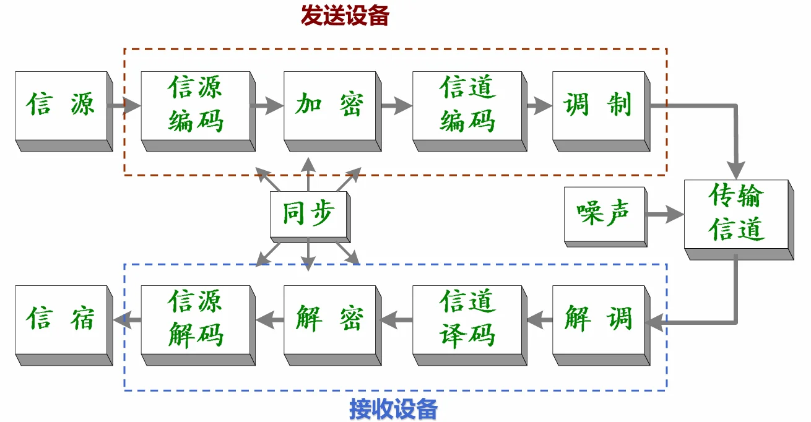
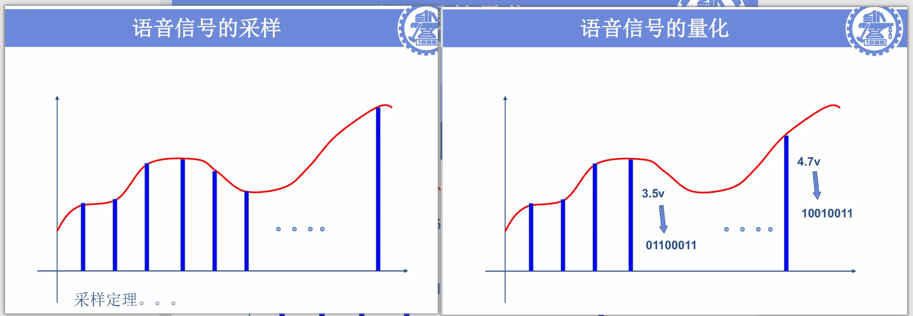
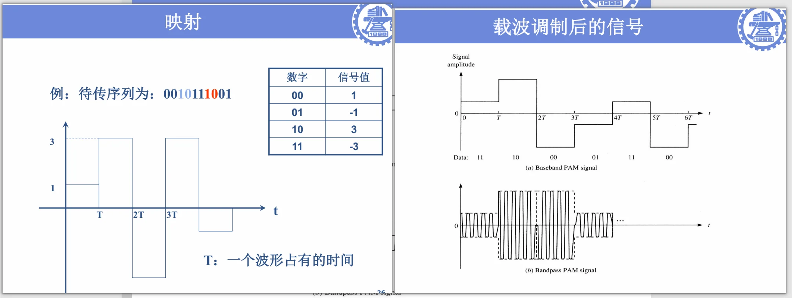
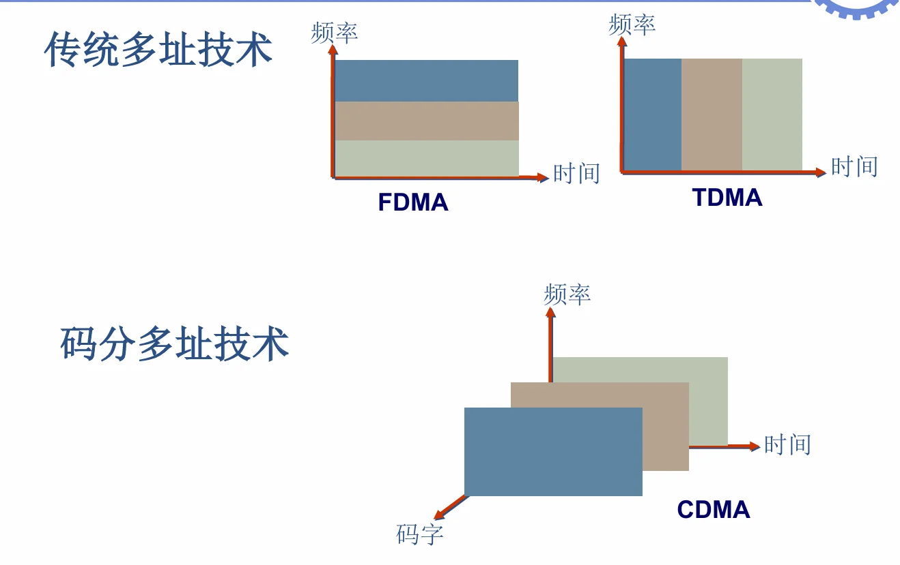
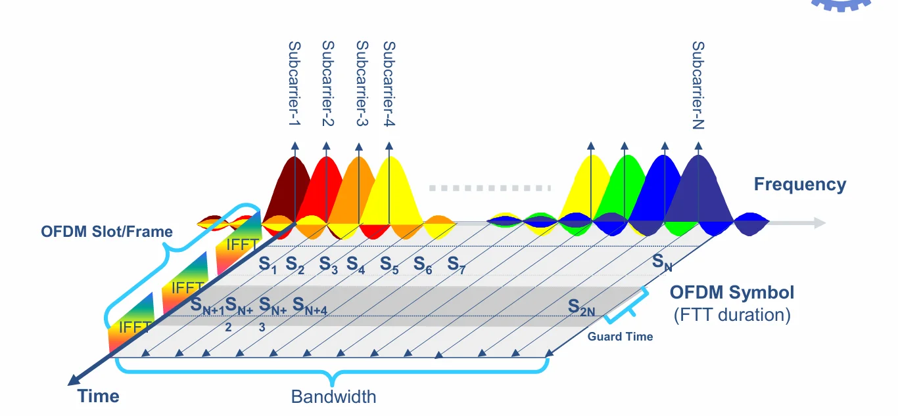

# 第一章 VLSI 数字通信原理介绍

---

## 一、通信系统基础认知
### 1.1 信息系统的三大核心环节
1.  **信息的产生与获取**：涵盖数据、语音、图像等多类型信息
2.  **信息的处理与存储**：核心是模拟信息转数字信息、信息压缩编码
3.  **信息的传输与网络**：时间传输（信息存储）、空间传输（媒质传输）

### 1.2 通信系统通用模型
通信系统是传输信息所需技术设备的总和，核心组成如下：
| 模块 | 核心功能 |
|------|----------|
| 信源 | 产生/发出消息的人或机器，是信息的起点 |
| 发送设备 | 将信源消息信号变换为适配信道传输的形式 |
| 信道 | 信息传输的物理媒质，分为有线/无线两类 |
| 噪声 | 信道中不可避免的干扰源，是传输误码的核心来源 |
| 接收设备 | 从带干扰的接收信号中恢复原始消息信号 |
| 信宿 | 接收消息的人或机器，是信息的终点 |

### 1.3 基带与带通信号核心定义
- **基带信号**：**信号幅度在零频附近不全为零，其他频率幅度全为零**，是未经载波调制的**原始数字/模拟信号**
- **带通信号**：**信号幅度在以$f=\pm f_c$为中心的频带内不全为零，其中$f_c>>0$，$f_c$称为载波频率**
- **传输重点**：实际工程应用中，**数字信号的带通传输**是核心落地场景

!!! question "**Q：基带信号为什么无法实现无线信道传输？**"
    无线信号的辐射 / 接收要求**天线尺寸与信号波长 λ 为同一数量级（通常要求天线长度≥λ/4，辐射效率才会达标）**，而波长与频率的关系为：
    $$ \lambda = \frac{c}{f} $$
    其中 $c$ 是光速，$f$ 是信号频率。
    基带语音信号最高频率按照$4kHz$考虑，因此其波长为：
    $$ \lambda = \frac{3 \times 10^8}{4 \times 10^3} = 75,000 \text{ m} $$
    这意味着**天线长度要大于18750m！**

!!! tip "核心概念解释"
    - **码元**$T_s$: 指**一个码元的持续时间**，也叫码元周期，是数字信号中单个二进制（或多进制）符号对应的时间长度，其倒数$1/T_s$为码元速率（波特率）。
    - $g_T(t)$: 工程中最常用**矩形脉冲信号**（矩形波），也可根据需求用升余弦滚降脉冲、高斯脉冲等；核心是在$0≤t≤T_s$内有确定幅值，其余时间为0，是承载单个码元的基础波形。
    - **二进制序列转基带数字波形的硬件实现**：核心是**串并转换+脉冲成形电路**
    - **2ASK调制的硬件实现**：最简易实现是**选通开关电路**
---


## 二、模拟通信系统 vs 数字通信系统
### 2.1 核心信号辨析
| 信号类型 | 核心定义 | 关键特征 |
|----------|----------|----------|
| 模拟信号 | 特征量（幅度、频率、相位）取值连续的信号 | 取值无限多，抗干扰能力弱，噪声会随传输积累 |
| 数字信号 | 特征量（幅度、频率、相位）取值离散的信号 | 取值有限个（核心为0/1二进制），抗干扰能力强，噪声不积累 |

### 2.2 两类系统核心差异
| 维度 | 模拟通信系统 | 数字通信系统 |
|------|--------------|--------------|
| 传输信号 | 直接传输原始模拟信号 | 仅传输0/1数字化信号，需先完成模数转换 |
| 典型系统 | 模拟电视、AM广播 | 手机蜂窝通信、计算机以太网 |
| 发展现状 | 逐步被数字系统取代 | 当前通信系统的主流实现方案 |

### 2.3 数字通信系统的核心优缺点
#### 核心优势
1.  **抗干扰能力强**，传输过程中噪声不积累（通过电平判决可消除噪声叠加）
2.  可通过**纠错编码精准控制传输差错**，提升传输可靠性
3.  易于加密处理，信息保密度高
4.  数字信号便于标准化处理、变换与存储
5.  数字电路易于集成，适配VLSI设计，方便设备小型化

#### 核心不足
1.  相同传输带宽下，数字信号占用的有效数据率更高
2.  对收发端同步精度要求极高，是系统设计的核心难点
3.  编解码、同步、调制解调等模块带来更高的实现复杂度

---

## 三、数字通信系统完整链路与核心模块
### 3.1 端到端完整传输链路
```
发送端：信源 → 信源编码 → 加密 → 信道编码 → 调制 → 传输信道
接收端：传输信道 → 解调 → 信道译码 → 解密 → 信源解码 → 信宿
配套支撑：同步系统、信道噪声与干扰
```


### 3.2 信源编码与解码
- **核心功能**：将信源信息转换为二进制数据，同时完成信息压缩，去除冗余；信源解码是其逆过程
- **核心流程**：采样（遵循采样定理）→ 量化 → 模数转换 → 压缩编码
  
- **工程实例**：
  1.  语音编码：语音信号频率范围300Hz~3400Hz，典型采样率8kHz，8bit量化原始码率64kbps；GSM系统压缩至9kbps，极限可压缩至1kbps以下
  2.  图像压缩：图像由像素阵列构成，彩色图像含RGB三基色，高清电视信号传输需几十兆比特/秒的带宽，需通过压缩降低传输开销

### 3.3 信道编码与译码
- **核心目标**：通过**添加冗余信息，保证接收端0/1序列的正确性，对抗信道传输误码**
- **核心能力**：
  1.  错误检测：添加少量冗余，可判断接收信息是否正确，但无法纠正错误
  2.  错误纠正：添加更多冗余，可同时完成错误检测与纠正
  3.  **重传机制：系统仅能检错无法纠错时使用，会额外引入传输时延**
- **核心边界**：冗余信息仅能提升检错纠错能力，**无法覆盖所有错误场景，存在无法检测与纠正的错误**

### 3.4 调制与解调
- **调制核心定义**：**将二进制数字序列映射为对应时间波形，同时把基带信号的频谱搬移到高频载波频段，适配信道的传输特性**
- **解调核心定义**：调制的逆过程，从接收的带通信号中恢复出原始基带数字序列
- **核心价值**：解决基带信号无法在无线信道远距离传输的问题，同时可通过不同调制方式提升频谱利用率与抗干扰能力
- **典型实例**：PAM（脉冲幅度调制），通过不同幅度电平映射二进制序列，分为基带PAM与带通PAM两类实现

  !!! note "调制的数学说明"
      二进制数字序列映射到基带数字波形：$s(t) = \sum_{n=-\infty}^{+\infty} a_n \cdot g_T(t-nT_s)$
      其中：
      - $a_n$：二进制符号，$a_n=1$（对应数字1），$a_n=0$（对应数字0）；
      - $g_T(t)$：矩形脉冲波形，$0≤t≤T_s$时$g_T(t)=1$，其余时间$g_T(t)=0$；
      
      高频载波信号：$c(t) = A_c \cos(2\pi f_c t + \varphi_0)$
      - 载波频率：$f_c >>$ 基带最高频率$f_m$
      
      数字调制——2ASK: $\boldsymbol{e_{2ASK}(t) = s(t) \cdot \cos(2\pi f_c t)}$
      - 傅里叶变换：$E_{2ASK}(\omega) = \frac{1}{2} \left[ S(\omega-\omega_c) + S(\omega+\omega_c) \right]$



### 3.5 其他核心单元
- **加密/解密**：对编码后的数字序列进行加密处理，提升传输安全性，数字信号天然适配各类加密算法
- **同步**：数字通信系统正常工作的前提，涵盖载波同步、码元同步、帧同步、网同步，是系统设计的核心难点
- **信道与噪声**：**传输媒质分为有线（主流光纤）和无线（主流无线电）两类**，噪声是所有传输信道的固有干扰，决定了系统的误码率下限

---

## 四、通信系统分类与通信方式
### 4.1 通信系统主流分类方式
1.  **按通信业务划分**：电话通信系统、数据通信系统、图像通信系统、多媒体通信系统
2.  **按是否采用调制划分**：基带传输系统、频带（带通）传输系统
3.  **按传输媒质划分**：有线通信系统、无线通信系统

### 4.2 核心通信方式（按消息传输方向与时间划分）
| 通信方式 | 核心定义 | 典型应用场景 |
|----------|----------|--------------|
| 单工通信 | 消息只能单向传输，收发端角色固定 | 广播、遥控、无线寻呼 |
| 半双工通信 | 通信双方均具备收发能力，但收发不能同时工作，仅支持单条信道 | 对讲机、传统串口通信 |
| 全双工通信 | 收发双方可同时进行双向消息传输，需双向信道支撑 | 手机蜂窝通信、以太网、TDD时分双工（TD-SCDMA） |

---

## 五、无线通信系统详解
### 5.1 无线通信核心挑战
1.  随时随地的泛在网络连接需求
2.  多业务（语音/数据/音视频）、多设备的融合适配
3.  硬件产品的小型化、低功耗、低成本设计需求（与VLSI设计强相关）

### 5.2 无线通信系统核心分类
| 系统类别 | 核心细分 | 典型标准/技术 |
|----------|----------|----------------|
| 蜂窝通信系统 | 2G/3G/4G/5G/6G | GSM、WCDMA、TD-SCDMA、LTE、5G NR |
| 无线接入系统 | 无线个域网（WPAN） | Bluetooth、UWB、Zigbee |
| | 无线局域网（WLAN） | WiFi 802.11a/b/g/n/ac/ax |
| | 无线城域网（WMAN） | WiMAX 802.16系列 |
| 广播电视系统 | 地面数字电视、移动手机电视 | DVB-T、ISDB-T、CMMB |
| 卫星通信系统 | 卫星传输、导航定位 | DVB-S/S2、GPS、北斗 |

### 5.3 无线宽带接入标准核心参数
| 网络类型 | 覆盖范围 | 典型传输速率 | 核心协议标准 |
|----------|----------|--------------|--------------|
| PAN（个域网） | <10m | ~1Mbit/s | 802.15.1(Bluetooth)、802.15.4(ZigBee) |
| WLAN（局域网） | <100m | 11-54Mbit/s（峰值10Gbps） | 802.11a/b/g/n/ac/ax(WiFi) |
| MAN（城域网） | <5km | 70Mbit/s | 802.16a/e/m(WiMAX) |

### 5.4 WiFi WLAN标准演进
1.  **802.11b**：**2.4GHz ISM频段**，DSSS技术，峰值速率11Mbps，覆盖约500英尺
2.  **802.11a/g**：**5GHz/2.4GHz频段**，OFDM技术，峰值速率54Mbps，覆盖100-200英尺
3.  **802.11n/ac/ax**：2.4GHz+5GHz双频段，OFDM+MIMO技术，支持20/40/80/160MHz频宽，峰值速率最高10Gbps（ax），多用户MIMO增强

### 5.5 蜂窝通信系统代际演进
- **2G（90年代）**：核心支撑数字语音业务，主流技术TDMA/CDMA，代表标准GSM、IS-95
- **3G（IMT-2000）**：核心支撑宽带数据业务，三大标准WCDMA、cdma2000、TD-SCDMA，**CDMA为核心技术**
- **4G（LTE/LTE-Advanced）**：核心支撑多媒体业务，关键技术**OFDM、MIMO**，应对WiMAX市场竞争，向ITU 4G标准对齐
- **5G**：核心指标为峰值速率>10Gbps、空口时延<1ms、10年终端续航、海量设备连接，覆盖eMBB、uRLLC、mMTC三大场景

---

## 六、数字通信核心关键技术
### 6.1 多址技术
多址技术解决多用户同时接入信道的资源分配问题，主流实现分为三类：
1.  **FDMA（频分多址）**：按频率划分信道，不同用户占用互不重叠的频段
2.  **TDMA（时分多址）**：按时间划分时隙，不同用户占用互不重叠的时间片
3.  **CDMA（码分多址）**：**按正交码字区分用户，同频同时隙共享信道，靠不同正交码字区分用户，是3G系统的核心技术**
 


### 6.2 OFDM（正交频分复用）
- **本质**：一种特殊的多载波调制技术，将高速串行数据流拆分为多路低速并行数据流，**调制到相互正交的子载波**上
- **核心优势**：
  1.  大幅提升频谱利用率，子载波正交重叠，节省频带资源
  2.  多子载波设计，天然抵抗频率选择性衰落
  3.  延长符号周期，有效对抗多径衰落引起的码间干扰（ISI）
  4.  可通过FFT/IFFT算法实现，大幅简化VLSI硬件实现结构



### 6.3 MIMO（多输入多输出）
- **本质**：多天线技术，通过多根发射天线、多根接收天线构建多条并行传输信道
- **核心突破**：将无线信道的多径效应从不利干扰因素，转化为提升系统容量的有利因素
- **核心优势**：在独立同分布的高斯信道下，当接收天线数大于发射天线数时，MIMO系统的容量随发射天线数近似线性增长
- **技术演进**：Massive MIMO（大规模天线阵列），是5G系统的核心关键技术

### 6.4 高性能信道编码技术
核心目标是逼近Shannon信道容量限，提升传输可靠性，主流技术如下：
1.  **LDPC码**：1962年由Gallager提出，凭借优异的纠错性能与硬件可实现性，成为5G数据信道的编码标准
2.  **Polar码**：2008年由Arikan教授提出，理论上可达到Shannon限，被3GPP采纳为5G控制信道的编码标准
3.  **Turbo码**：3G/4G系统的主流信道编码方案，性能逼近Shannon限，硬件实现复杂度高于LDPC码

---

## 七、通信系统发展趋势与6G展望
### 7.1 无线通信核心发展趋势
1.  宽带化：传输速率从Mbps向Tbps量级持续演进
2.  移动化：全场景无缝泛在连接，实现全域移动覆盖
3.  低功耗化：适配海量物联网终端，实现超长续航
4.  高集成化：深度适配VLSI设计，实现芯片小型化、低成本、高可靠性

### 7.2 6G研究核心基点
1.  **核心前提**：6G需从基础理论研究做起，5G商用进程过快导致基础理论储备不足，6G需实现颠覆性技术创新
2.  **潜在创新方向**：
    - 基于大数据/AI的大范围干扰抵消技术，探索非蜂窝网络架构
    - 基于超材料科学的天线技术突破
    - 信息论基础理论的进一步挖潜
    - 核心网架构的颠覆性创新
3.  **核心关注方向**：相比5G，6G需更聚焦低碳节能、网络与信息安全两大核心命题

---

### 学习适配提示
1.  结合**数字信号处理**基础，重点理解OFDM的FFT/IFFT实现、调制解调的信号处理流程、多径衰落的抑制算法
2.  结合**概率论与数理统计**基础，深入分析信道编码的误码率性能、MIMO系统的信道容量、噪声对传输链路的影响
3.  结合**集成电路设计**基础，聚焦各模块的VLSI实现复杂度、硬件可实现性、低功耗设计与面积优化，贴合课程“VLSI数字通信设计”的核心目标