# 第十章：带通调制与解调

## I. 基本概念与背景知识（核心精简）

带通调制的核心本质是**将基带信号的频谱搬移至较高频率**（通过改变正弦载波的幅度、频率或相位来实现）。

*   **为什么要调制？** 
    1. 适应无线信道：天线尺寸通常需要达到信号波长的四分之一 ($\lambda/4$)，只有将频率提高，波长变短，天线尺寸才能做到合理大小。
    2. 解决频谱紧张：由于现代大容量、远距离数字通信的需求，需要在有限带宽内容纳更多用户。
*   **技术要求：** 在衰落信道下误码率低、解调效率高（低功耗、小体积）、传输速率高、易于集成（VLSI）。
*   **调制分类：** 线性调制（带宽效率高，适合多用户无线通信）与非线性调制。

---

## II. 数字带通调制技术

### 2.1 调制载波的一般表达式与能量关系

带通数字信号的通用载波表达式为：

$$s(t) = A(t)\cos[\omega_0 t + \Phi(t)]$$

*   $A(t)$: 载波的振幅信号
*   $\omega_0$: 载波角频率
*   $\Phi(t)$: 载波的初始相位

**波形振幅系数与能量的关系推导：**
假设信号在码元周期 $T$ 内的能量为 $E$，由于正弦信号的平均功率 $P = A^2 / 2$，同时功率也等于能量除以时间 $P = E / T$。
联立两式可得振幅系数 $A$ 的基本定义式：

$$A = \sqrt{\frac{2E}{T}}$$

* **码元周期**：$T$
* **码元能量**：$E$

对于 **M进制数字调制**（在码元间隔 $0 \le t \le T_s$ 内，有 $M$ 种可能的发送码元，通常 $M=2^k$）：

*   每个码元携带的信息量 $k = \log_2 M$ (bits)
*   若码元能量 $E$ 平均**分配给每个比特**，则每比特能量 $E_b = E/k$
*   信噪比（以码元计算）：$r = A^2 / (2\sigma_n^2)$
*   每**比特信噪比**：$r_b = E_b / n_0 = E / (k n_0)$ （其中 $n_0$ 为**噪声单边功率谱密度**，在比较不同进制体制性能时，统一使用 $r_b$ 更为公平）。

---

### 2.2 振幅键控 (ASK: Amplitude Shift Keying)

利用数字基带信号去控制载波的**幅度**。

#### 2.2.1 二进制振幅键控 (2ASK)
2ASK 的一般时域表达式为：

$$e_{2ASK}(t) = s(t)\cos(\omega_c t)$$

其中，基带信号 $s(t)$ 的数学表达为：

$$s(t) = \sum_{n} a_n g(t - nT_s)$$

**符号定义：**

*   $T_s$: 码元持续时间（符号周期）
*   $g(t)$: 持续时间为 $T_s$ 的基带脉冲波形（例如矩形脉冲）
*   $a_n$: 第 $n$ 个符号的电平取值。在 2ASK 中，通常取单极性不归零码：
    *   $a_n = 1$ (概率为 $P$)
    *   $a_n = 0$ (概率为 $1-P$)

**信号产生方法（理论与工程实现）：**

*   **模拟调制法（相乘器法）：** 将单极性不归零脉冲 $s(t)$ 直接与载波 $\cos(\omega_c t)$ 在乘法器中相乘。
*   **键控法：** 利用 $s(t)$ 控制一个射频开关电路，数字“1”时开关导通输出载波，数字“0”时开关断开输出 0电平。

#### 2.2.2 多进制振幅键控 (MASK)
MASK 又称多电平调制。表达式与 2ASK 相同，区别在于电平取值 $a_n$ 有 $M$ 种可能。

$$a_n \in \{A_1, A_2, ..., A_M\} \quad (发送概率分别为 P_1, P_2, ..., P_M)$$

MASK 的时域表达式：

$$s_{\text{MASK}}=[\sum_{n}a_{n}g(t-nT_s)]\cos{\omega_c t}$$

**核心特点：**

1. 在 **码元速率（波特率）** 相同的情况下，MASK 信号的频带宽度与 2ASK 相同，
2. 但由于每个码元携带了 $\log_2 M$ 个比特，因此其**单位频带的信息传输速率更高（频带利用率高）**。

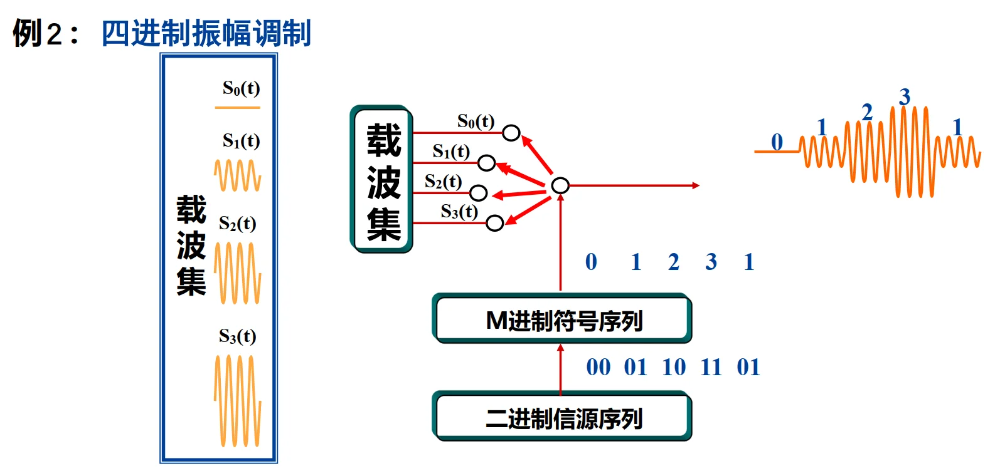

---

### 2.3 频移键控 (FSK: Frequency Shift Keying)

利用数字基带信号去控制载波的**频率**。

#### 2.3.1 二进制频移键控 (2FSK)
2FSK 信号在数学上可以**等效看作是两个不同载波频率的 2ASK 信号的线性叠加**：

$$e_{2FSK}(t) = s_1(t)\cos(\omega_1 t) + s_2(t)\cos(\omega_2 t)$$

*   当发送“1”时，$s_1(t)=1, s_2(t)=0$，输出频率 $\omega_1$
*   当发送“0”时，$s_1(t)=0, s_2(t)=1$，输出频率 $\omega_2$

数学表达式：

$s_1(t)=\sum_{n}a_{n}g(t-nT_s),s_2(t)=\sum_{n}\overline{a_{n}}g(t-nT_s)$

**信号产生方法：**
1.  **模拟调频法：** 利用压控振荡器(VCO)，**相邻码元之间的相位是连续变化的**。
2.  **键控法：** 利用两个独立的振荡器和选通开关，**相邻码元之间的相位不一定连续**。

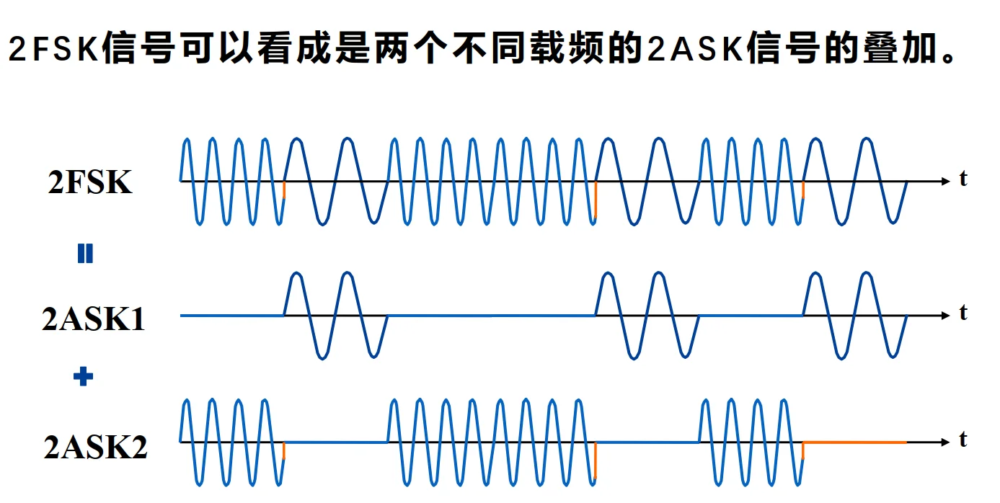

#### 2.3.2 多进制频移键控 (MFSK)

**载波**共有 $M$ 种发送频率：

$$s_i(t) = \sqrt{\frac{2E_s}{T_s}} \cos(2\pi f_i t), \quad 0 \le t \le T_s, \quad i=1,2,...,M$$

**核心正交性证明与要求：**
为了在接收端能够无干扰地分离这 $M$ 个信号，通常要求 $M$ 种发送信号互相**正交**：

$$\int_{0}^{T_s} s_i(t) s_j(t) dt = 0 \quad (i \ne j)$$

满足正交的条件是：信号之间的频率间隔必须满足 

$$\boxed{\Delta f = |f_i - f_j| = \frac{n}{2T_s}}$$ 

其中 $n$ 为整数。

---

### 2.4 相移键控 (PSK: Phase Shift Keying)

利用数字基带信号去控制载波的**初始相位**。这是现代数字通信中最常用的线性调制技术。

#### 2.4.1 二进制相移键控 (BPSK / 2PSK)

$$s_i(t) = \sqrt{\frac{2E}{T}} \cos[\omega_0 t + \Phi_i(t)]$$

在 BPSK 中，$M=2$。相位取值 $\Phi_i(t) \in \{0, \pi\}$。

*   发送“1”时，输出 $\cos(\omega_c t)$
*   发送“0”时，输出 $\cos(\omega_c t + \pi) = -\cos(\omega_c t)$

**产生方法：**
基带信号首先进行**双极性不归零码型变换**（“1”变 $+1$，“0”变 $-1$），然后直接与载波相乘。

#### 2.4.2 多进制相移键控 (MPSK)及其重要性质 (I/Q分解)
MPSK 的一般时域表达式为：

$$s_{MPSK}(t) = \sum_{n=-\infty}^{\infty} g(t - nT_s)\cos(\omega_c t + \varphi_n)$$

相位通常均匀分布在圆周上：$\varphi_n = \frac{2\pi}{M}(i-1) + \theta \quad (i=1, 2, ..., M)$。

> 如果要用电路实现上述表达式，会涉及到多个并行乘法然后做加法

**💡【重点推导：MPSK的正交分解】**
利用三角函数展开公式 $\cos(\alpha + \beta) = \cos\alpha\cos\beta - \sin\alpha\sin\beta$，我们可以将 MPSK 信号重写为：

$$s_{MPSK}(t) = \sum_n [ \cos\varphi_n \cos\omega_c t - \sin\varphi_n \sin\omega_c t ] \cdot g(t-nT_s)$$

令：

*   $a_n = \cos\varphi_n$
*   $b_n = \sin\varphi_n$

则信号可以分为同相(In-phase)和正交(Quadrature)两路：

$$s_{MPSK}(t) = \underbrace{\left[ \sum_n a_n g(t-nT_s) \right]}_{I(t)} \cos\omega_c t - \underbrace{\left[ \sum_n b_n g(t-nT_s) \right]}_{Q(t)} \sin\omega_c t$$

**结论（极其重要）：**
任意 MPSK 信号都可以看成是**对两个正交载波（$\cos{\omega_c t}$ 和 $\sin{\omega_c t}$）进行多电平双边带调制（MASK）后得到的两路信号的叠加**！
即：

$$s_{MPSK}(t) = I(t)\cos(\omega_c t) - Q(t)\sin(\omega_c t)$$

*   $I(t)$: 同相分量 (In-phase component)
*   $Q(t)$: 正交分量 (Quadrature component)

#### 2.4.3 正交相移键控 (QPSK / 4PSK)
QPSK 是 $M=4$ 的特殊情况，每个码元含有 2 比特信息 ($00, 01, 10, 11$)。

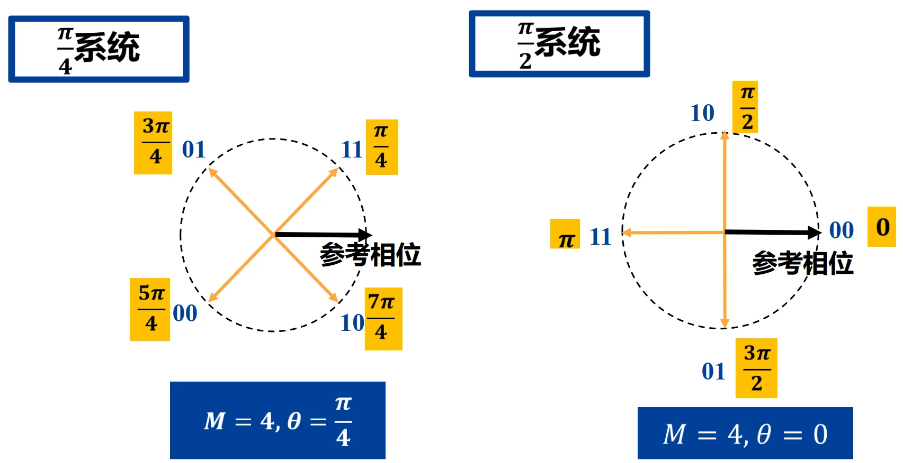

**1. 格雷码 (Gray Code) 的映射优势：**
在 QPSK 矢量图中，为相位分配比特组合时通常采用**格雷码**（如：$00 \rightarrow 0^\circ, 01 \rightarrow 90^\circ, 11 \rightarrow 180^\circ, 10 \rightarrow 270^\circ$）。

*   **原因与好处：** 在实际信道中，因相位误差造成误判的概率大多发生在**相邻相位**之间。格雷码确保了相邻相位所代表的两个比特中**只有一位不同**，因此发生一次相邻相位误判只产生 1 比特的错误，从而有效降低整体的误比特率 (BER)。

**2. QPSK的调制过程 (基于正交调制器)：**

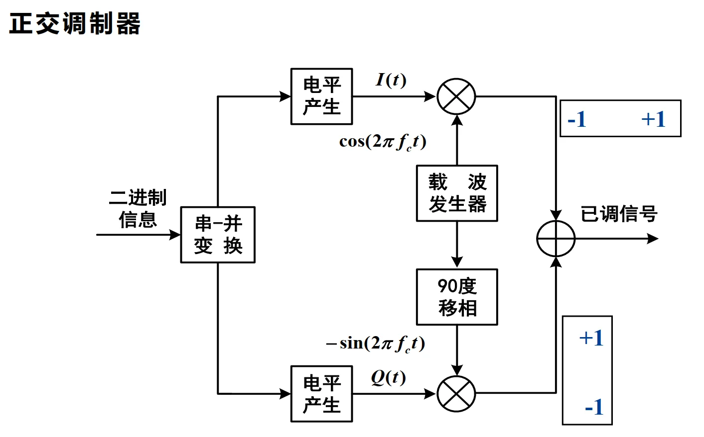

*   **串-并变换：** 高速的二进制信息流首先被分成两路（**奇数位进入I路，偶数位进入Q路**），此时码元周期变为原来的两倍（符号速率减半）。
*   **电平产生：** $0 \rightarrow -1, 1 \rightarrow +1$。
*   **正交调制：** I路与 $\cos(\omega_c t)$ 相乘，Q路与 $-\sin(\omega_c t)$（相当于 $90^\circ$ 移相）相乘。
*   **叠加输出：** 两路相加即得到 QPSK 带通信号。

!!! question "奇数位进入I路，偶数位进入Q路？"
    $I(t) = \sum_n a_n g(t-nT_s)$
    而 $a_n = \cos(\phi_n)$, $\phi_n = \frac{2\pi}{M}(i-1)+\theta$，其中 $i$ 不正是由两个 bit 同时决定的吗？比如 ab = 00 的时候，$i = 1$, $\phi_n = \theta$，才能决定 $a_n$，进而决定 $I(t)$
    **以上思路完全正确，没有任何瑕疵，但是 QPSK 有一个巧合**！

    | 比特组合 $ab$ ($B_{odd}, B_{even}$) | 对应的相位 $\phi_n$ | $I$路电平 $a_n = \cos(\phi_n)$ | $Q$路电平 $b_n = \sin(\phi_n)$ |
    | :---: | :---: | :---: | :---: |
    | **1 1** | $\pi/4$ ($45^\circ$) | $\mathbf{+\frac{\sqrt{2}}{2}}$ | $\mathbf{+\frac{\sqrt{2}}{2}}$ |
    | **0 1** | $3\pi/4$ ($135^\circ$) | $\mathbf{-\frac{\sqrt{2}}{2}}$ | $\mathbf{+\frac{\sqrt{2}}{2}}$ |
    | **0 0** | $5\pi/4$ ($225^\circ$) | $\mathbf{-\frac{\sqrt{2}}{2}}$ | $\mathbf{-\frac{\sqrt{2}}{2}}$ |
    | **1 0** | $7\pi/4$ ($315^\circ$) | $\mathbf{+\frac{\sqrt{2}}{2}}$ | $\mathbf{-\frac{\sqrt{2}}{2}}$ |

    对于奇数位，**奇数位为1可以直接**确定 $a_n=\frac{\sqrt{2}}{2}$，**奇数位为0可以直接**确定 $a_n=-\frac{\sqrt{2}}{2}$，根本不需要用到**偶数位的信息**！对于偶数位也是同理！

## III. 信号检测（解调）基本概念（核心精简）

带通信号的解调（检测）本质是将频带信号重新搬移回基带，并判决出原始数字信息。按照**是否利用载波的相位信息**，可分为两大类：
*   **相干解调 (Coherent Detection)：** 接收机必须在本地恢复出与发送端**同频同相**的载波。其特点是**不损失任何信息，抗噪声性能最佳**，但硬件实现复杂（需要载波同步电路）。适用于 PSK、FSK、ASK。
*   **非相干解调 (Non-coherent Detection)：** 利用已调信号的**包络 (Envelope)** 特性进行判决，**不需要**恢复本地载波的相位。结构简单，但性能逊于相干解调。适用于 ASK、FSK、DPSK（差分相移键控）。

---

## IV. 相干解调技术

### 4.1 2ASK 与 2FSK 的相干解调
**1. 2ASK 的相干解调**

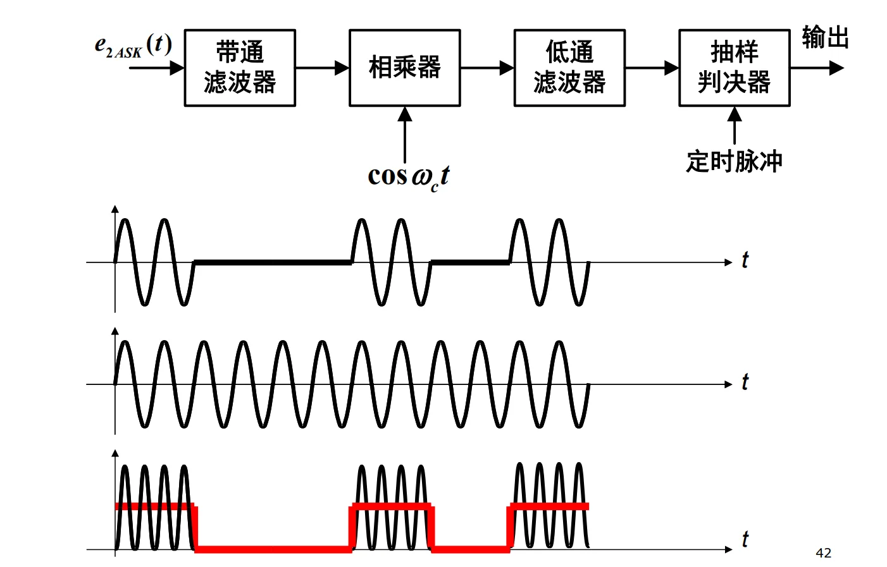

*   **流程：** 带通滤波（滤除带外噪声） $\rightarrow$ 乘法器（与本地载波 $\cos\omega_c t$ 相乘，将频谱搬移至基带） $\rightarrow$ 低通滤波（滤除二倍频的高频分量） $\rightarrow$ 抽样判决器（在最佳时钟脉冲下比较电压幅值与阈值）。

**2. 2FSK 的相干解调**

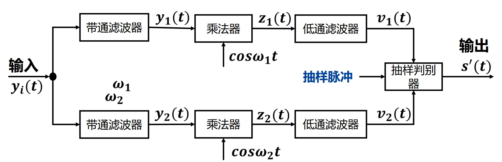

*   **核心思想：** 2FSK 信号可以看作两个不同频率的 2ASK 信号的叠加。因此，其相干解调器由**两个并行的 2ASK 相干解调支路**（分别对应 $\omega_1$ 和 $\omega_2$）构成。
*   **判决机制：** 将上下两路低通滤波器的输出进行相减，如果差值大于 0，则判决为发送了频率 $\omega_1$（对应某个 bit）；反之则判决为 $\omega_2$。

### 4.2 BPSK (2PSK) 的相干解调与“相位模糊”

BPSK **只能采用相干解调**。
*   **原因分析：** BPSK 信号的振幅不变（无法提取包络）、频率也不变（无法用滤波器分离）。信息全部携带在**相位**的变化中（$0$ 或 $\pi$）。

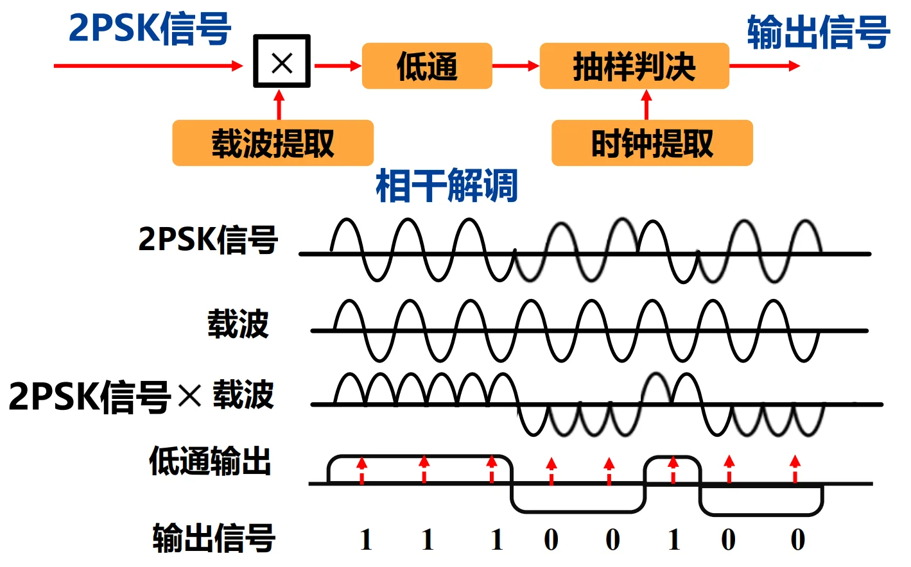

**💡 核心工程问题：相位模糊 (Phase Ambiguity)**
*   **现象：** 相干解调依赖于接收端提取出的本地载波 $\cos(\omega_c t)$。但在实际电路（如平方环法）提取载波时，系统无法分辨出 $0$ 相位和 $\pi$ 相位，提取出的载波可能会出现 $180^\circ$ 的翻转（即变成了 $-\cos(\omega_c t)$）。
*   **后果：** 见，一旦本地载波相位反转，解调出来的所有基带电平将全部颠倒，导致数字信号全错（0变1，1变0）。*(注：这也是后续需要引入 DPSK 差分调制的原因)*。

### 4.3 MPSK 的相干解调与矢量空间判决

MPSK 信号是在相幅平面的圆周上取值的信号。

**MPSK 信号：**

$$s_{i} = \sqrt{\frac{2E}{T}}\cos(\omega_0t - \frac{2\pi i}{M}), 0<t<T, i=1,2,\cdots,M $$

**基函数定义：** MPSK 可以由两个正交的基函数表示：
$$\psi_1(t) = \sqrt{\frac{2}{T}} \cos\omega_0 t, \quad \psi_2(t) = \sqrt{\frac{2}{T}} \sin\omega_0 t$$

$$\begin{aligned}s_i(t) & =  a_1 \psi_1(t) + a_2 \psi_2 (t) \\ & = \sqrt{E}\cos(\frac{2\pi i}{M})\psi_1(t) + \sqrt{E}\sin(\frac{2\pi i}{M})\psi_2(t) \end{aligned}$$

**接收端 I/Q 投影：** 接收到的含噪声信号 $r(t)$，分别与两个基函数相乘并积分（实际上就是寻找投影）：

$$X = \int_0^T r(t)\psi_1(t)dt \quad (同相分量 Inphase)$$

$$Y = \int_0^T r(t)\psi_2(t)dt \quad (正交分量 Quadrature)$$

**相位计算与判决：**
根据算出的 $X$ 和 $Y$，接收机计算出接收信号的估计相位：

$$\hat{\phi} = \arctan\left(\frac{Y}{X}\right)$$
随后，计算 $\hat{\phi}$ 与 $M$ 个标准发送相位 $\phi_i$ 之间的距离 $|\phi_i - \hat{\phi}|$。**根据最大似然原理，选择距离最近的（最小的）标准相位作为判决结果**。

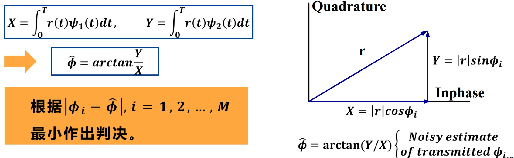

在矢量图上，这等价于将圆周划分为 $M$ 个**对称的扇区。只要接收到的矢量点落在某个扇区内**，就无条件判决为该扇区对应的星座点。

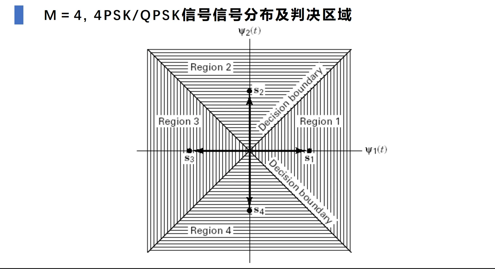

### 4.4 二进制相干解调系统的抗噪声性能对比（极重要）

通过计算受加性高斯白噪声 (AWGN) 干扰时的误码率 ($P_e$)，对比三种基础调制的性能：
*   **符号定义：**
    *   $E_b$: 每比特信号能量
    *   $n_0$: 噪声单边功率谱密度
    *   $\text{erfc}(x)$: 互补误差函数（或表示为 $Q(x)$ 函数），该函数的值随 $x$ 的增大而急剧减小。

**1. 理论误码率公式：**
*   **2ASK:** $P_{e2ASK} = Q\left(\sqrt{\frac{E_b}{2n_0}}\right)$ 
*   **2FSK:** $P_{e2FSK} = Q\left(\sqrt{\frac{E_b}{n_0}}\right)$  *(注：课件中使用了 $2n_0$ 和 $\frac{E_b}{2n_0}$ 等不同表达，统一化为标准 Q 函数自变量的比例)*
*   **2PSK:** $P_{e2PSK} = Q\left(\sqrt{\frac{2E_b}{n_0}}\right)$

**2. 核心结论：**
在**信号能量 $E_b$ 和噪声谱密度 $n_0$ 相同**的情况下：
1.  **2PSK 抗噪声性能最好**（判决距离最大）。
2.  **2FSK 性能其次**，比起 2PSK，它需要增加一倍的功率（即相差 **3dB**）才能达到相同的误码率。
3.  **2ASK 性能最差**，比起 2FSK，它还要再差 **3dB**。

---

## V. 非相干解调技术

当信噪比足够高时，为降低接收机成本和功耗，通常采用非相干解调。接收机**不需要提取载波相位 $\theta$**，默认它是一个在 $(0, 2\pi)$ 均匀分布的随机变量。

### 5.1 2ASK 的非相干解调（包络检波）

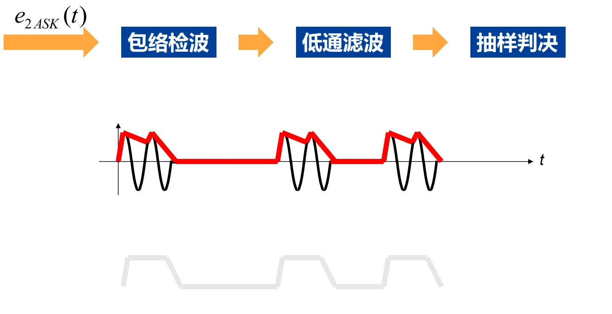

*   **结构：** $e_{2ASK}(t) \rightarrow$ **包络检波器 (半波/全波整流)** $\rightarrow$ 低通滤波器 $\rightarrow$ 抽样判决。
*   **原理：** 2ASK 的“1”和“0”表现为有无射频脉冲。直接通过整流电路（例如二极管）提取外层包络形状，包络大判为“1”，包络小判为“0”。

### 5.2 FSK 信号的非相干解调（重点）

FSK 的信息藏在频率里，既可以用包络检波，也可以利用极其巧妙的**正交平方接收法**。

**方法一：包络检波接收方式**

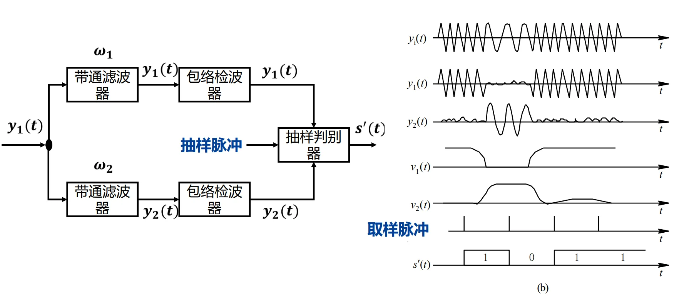

**原理：** 分为 $M$ 个并行的带通滤波器（中心频率分别为 $f_1, f_2, ..., f_M$）。哪个频率被发送了，对应的带通滤波器输出的信号包络就最大。
**判决：** $M$ 个路分别进行包络检波，最后使用**择大判决法 (Choose Largest)**，哪个包络最高，就输出对应的数字。

**方法二：正交接收方式（数学之美）**

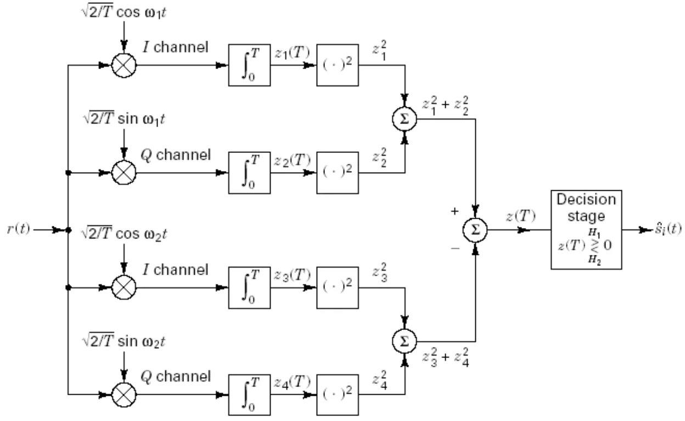

**困境：** 接收信号 $r(t) = A\cos(\omega_i t + \phi) + n(t)$ 中，初始相位 $\phi$ 是未知的。如果在本地随便找一个 $\cos\omega_i t$ 去乘，一旦 $\phi = \pi/2$，积分结果直接为 0，信号就“消失”了！
**巧妙的解法：** 对每一个可能的频率 $\omega_i$，我们在本地**同时使用**它对应的同相分量 $\cos\omega_i t$ 和正交分量 $\sin\omega_i t$ 两路去相乘。
*   同相路积分后得到：$X \propto A\cos\phi$
*   正交路积分后得到：$Y \propto -A\sin\phi$

**消去未知相位：** 将这两路的输出分别**平方再相加**：
    
$$Z^2 = X^2 + Y^2 \propto A^2(\cos^2\phi + \sin^2\phi) = A^2$$

**结论：** 经过平方和运算，**未知的随机相位 $\phi$ 被彻底消去了**！最终得到的 $Z^2$ 只与该频率支路的信号幅度 $A$ 有关。在 $M$ 个频率支路中，哪一路的 $Z^2$ 值最大，就说明发送了哪种频率。这种方法被广泛应用于现代数字接收机中。

## VI. 二进制数字调制系统性能总结与对比（核心精简）

在探讨多进制之前，我们首先从宏观上总结二进制系统（2ASK, 2FSK, 2PSK）的抗噪声性能（以误码率 $P_e$ 衡量）。

**核心性能排序：**
在相同的每比特能量 ($E_b$) 和噪声单边功率谱密度 ($n_0$) 下：**2PSK 最优，2FSK 居中，2ASK 最差。**
*   **等效信噪比关系：** 为了达到完全相同的误码率，三种体制所需要的信噪比（$r = E_b / n_0$）呈倍数关系：
    $$r_{2ASK} = 2r_{2FSK} = 4r_{2PSK}$$
*   **分贝 (dB) 关系：** 转换为对数域，上述关系等价于相差 3dB 和 6dB：
    $$(r_{2ASK})_{dB} = 3dB + (r_{2FSK})_{dB} = 6dB + (r_{2PSK})_{dB}$$
*   *结论：2PSK 比 2FSK 节省 3dB 功率，比 2ASK 节省 6dB 功率。*

---

## VII. M进制信号及星座图：带宽与功率的博弈

**为什么要引入 M 进制调制？**
对于高速数据传输，如果一直使用二进制，符号速率（波特率 $R_s$）会非常高，占用极大的频带宽度。
*   **核心矛盾转移：** $R_b = R_s \log_2 M$。当比特率 $R_b$ 不变时，增大进制数 $M$，符号速率 $R_s$ 会降低（$1/T$ 减少），从而**大幅降低所需的传输带宽**。
*   **付出的代价：** 如果保持信号的总发射功率（幅度）不变，信号空间中点与点的距离变近了，**噪声容限下降，误码率上升**。要想保持原有的误码性能，必须成倍提高发送功率。
*   *总结：M进制调制本质上是**用“功率”去换取“带宽”**。*

**MPSK 信号星座图（Constellation Diagram）：**
MPSK 信号的所有可能取值都分布在一个半径为 $\sqrt{E_s}$ 的圆周上。

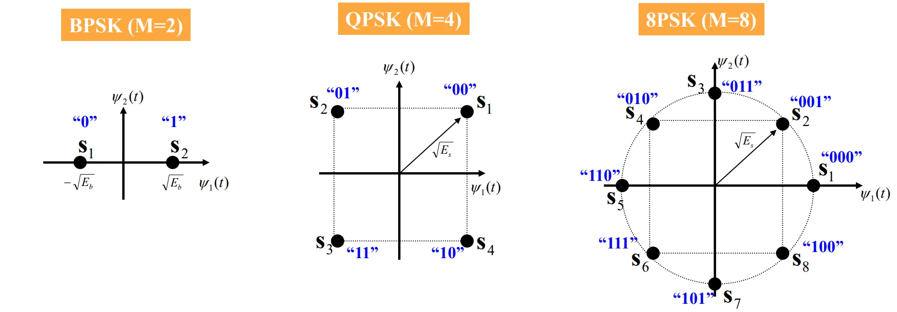

*   **BPSK (M=2):** 2个点，相距最远（距离为 $2\sqrt{E_b}$），抗干扰最强。
*   **QPSK (M=4):** 4个点，分布在四个象限。任意一个星座点都可以用一对正交分量（I路和Q路，即 $\pm \cos$ 和 $\pm \sin$）来唯一确定。
*   **8PSK (M=8):** 8个点，点与点之间的角距缩小为 $\pi/4$ ($45^\circ$)。

---

## VIII. MPSK信号的误码率推导与分析（重点深度解析）

在AWGN（加性高斯白噪声）信道下，MPSK信号的误码率分析不再仅仅是简单的一维高斯分布，而是涉及到**二维矢量空间中的相位分布**。

### 8.1 信号模型与接收端相关器
**1. 输入信号定义：**
$$S_{MPSK}(t) = A\cos\left(\omega_0 t + \frac{2\pi i}{M} + \theta\right), \quad i = 0, 1, ..., M-1$$
*   $A$: 信号振幅
*   $M$: 进制数
*   $\frac{2\pi i}{M}$: 当前符号携带的标准相位信息
*   $\theta$: 载波初始参考相位（为了简便通常设为0）
利用三角公式展开，它同样可以分解为 I路 ($\cos\omega_0 t$) 和 Q路 ($\sin\omega_0 t$) 的叠加。

**2. 解调相关器：**

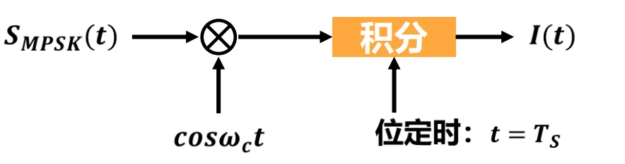

接收信号与本地载波 $\cos\omega_c t$ 相乘，并在一个符号周期 $T_s$ 内进行积分，提取出对应的 I/Q 分量，进而计算出接收相位的估计值。

### 8.2 高信噪比下的相位噪声概率密度函数 $f(\theta)$
当信道中加入白噪声后，接收到的矢量不再是一个干净的点，而是一个在中心点附近弥散的“云团”。这导致接收**相位 $\theta$ 变成了一个随机变量**。

**关键近似公式：** 当符号信噪比 $E_s/N_0$ 足够大时，由随机过程理论可以推导出相位误差 $\theta$ 的概率密度函数近似为：
$$f(\theta) \approx \sqrt{\frac{E_s}{\pi N_0}} \cos\theta \exp\left(-\frac{E_s}{N_0}\sin^2\theta\right), \quad |\theta| < \frac{\pi}{2}$$
*   **符号定义：**
    *   $E_s$: 每符号能量 (Symbol Energy, 且 $E_s = E_b \log_2 M$)
    *   $N_0$: 噪声单边功率谱密度
    *   此公式表明：噪声相位误差 $\theta$ 越接近 0，概率越高；误差越大，概率呈指数级下降。

### 8.3 MPSK 的符号误码率公式 ($P_{E,MPSK}$) 理论推导
**1. 判决边界与错误条件：**
对于 MPSK，整个 $360^\circ$ 圆周被分成了 $M$ 个扇区，每个扇区夹角为 $2\pi/M$。
只要噪声引起的相位偏移 $\theta$ 使得接收矢量跑出了当前正确的扇区（即 $|\theta| > \pi/M$），就会发生判决错误。

**2. 计算正确概率与误码率：**
误符号率 $P_E$ = 1 - 落在正确扇区内的概率
$$P_{E, MPSK} = 1 - \int_{-\pi/M}^{\pi/M} f(\theta) d\theta$$
将前面近似的 $f(\theta)$ 代入积分，利用标准正态累积误差函数 $Q(x)$，可以得出极其重要的近似公式：
$$P_{E, MPSK} \approx 2Q\left[ \sqrt{\frac{2E_s}{N_0}} \sin\left(\frac{\pi}{M}\right) \right]$$

**💡【公式的几何直观理解（极其重要）】**
不要死记硬背这个公式，它的核心在于 **$\sqrt{E_s} \sin(\pi/M)$** 这一项：
*   在半径为 $\sqrt{E_s}$ 的圆周上，两个相邻星座点之间的角度是 $2\pi/M$。
*   由几何三角关系可知，这两个相邻点之间的**直线欧氏距离**的一半为：$d_{half} = \sqrt{E_s} \sin(\pi/M)$。
*   因此，$Q$ 函数里面的变量本质上就是 $\frac{d_{half}}{\sqrt{N_0/2}}$（即**信号点到判决边界的距离 / 噪声标准差**）。
*   **结论：** M 越大，$\pi/M$ 越小，$\sin(\pi/M)$ 越小，星座点挨得越紧（距离越短），$Q$ 函数的值越大，**误码率急剧升高**。

*(注：对于 MDPSK 差分多相调制，误码率公式为 $P_{E, MDPSK} \approx 2Q\left[ \sqrt{\frac{2E_s}{N_0}} \sin\left(\frac{\pi}{\sqrt{2}M}\right) \right]$，性能比同等 MPSK 略差。)*

### 8.4 MPSK 调制信号的直观输出（星座散点图）

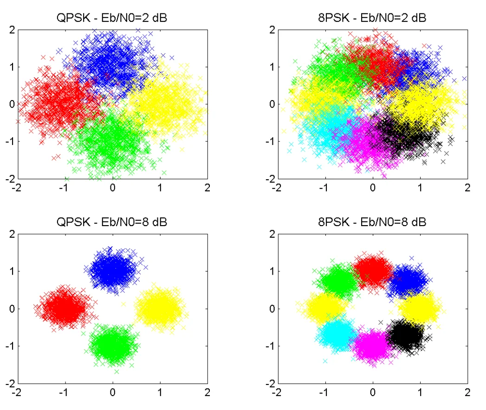

散点图非常完美地验证了我们的理论：
1.  **左侧 QPSK vs 右侧 8PSK（相同 $E_b/N_0 = 2dB$）**：
    QPSK 的四团颜色还能勉强区分边界；而 8PSK 的八团颜色已经严重粘连、互相重叠。因为 $M$ 变大使得判决边界变窄了，容易越界造成错误。
2.  **上方 $E_b/N_0 = 2dB$ vs 下方 $E_b/N_0 = 8dB$（相同体制）**：
    信噪比提高后（下方图），噪声方差减小，每一团散点变得非常“紧凑”，绝大部分点牢牢缩在自己的扇区内，基本不会发生越界错判，误码率大幅降低。
