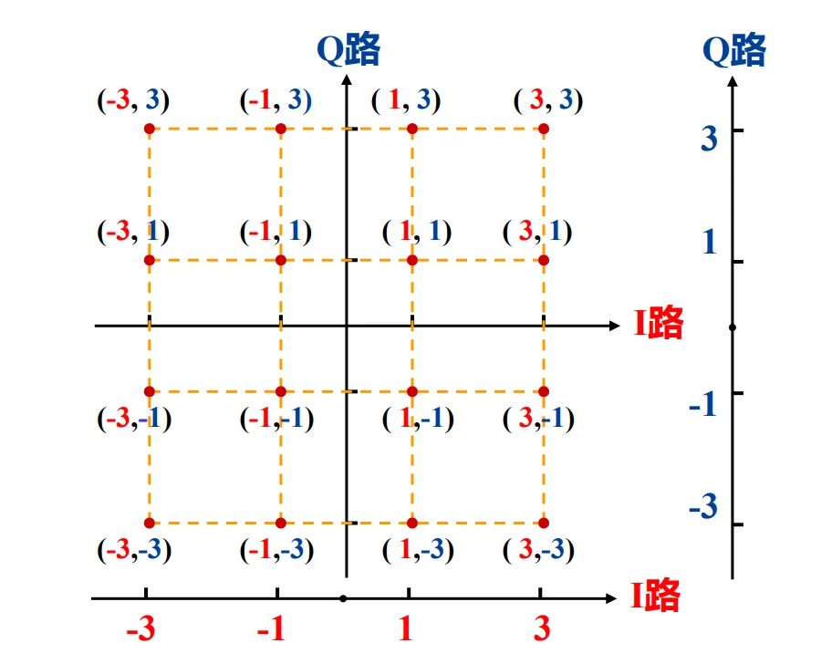
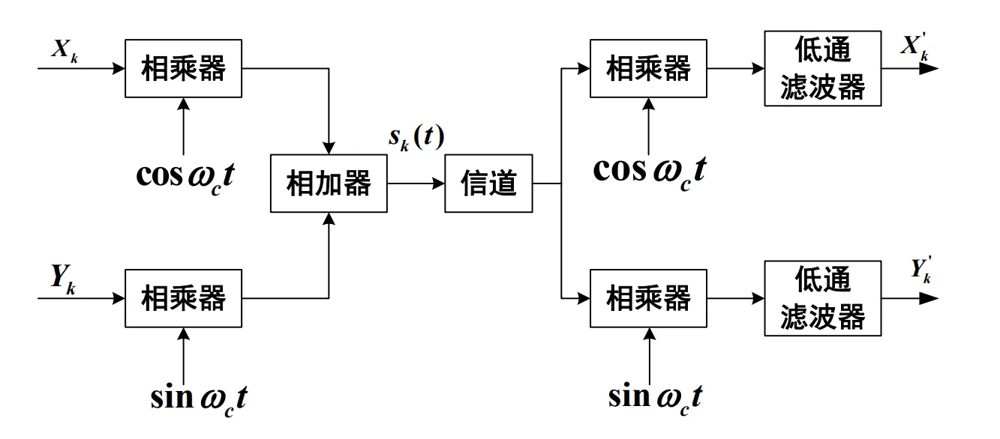
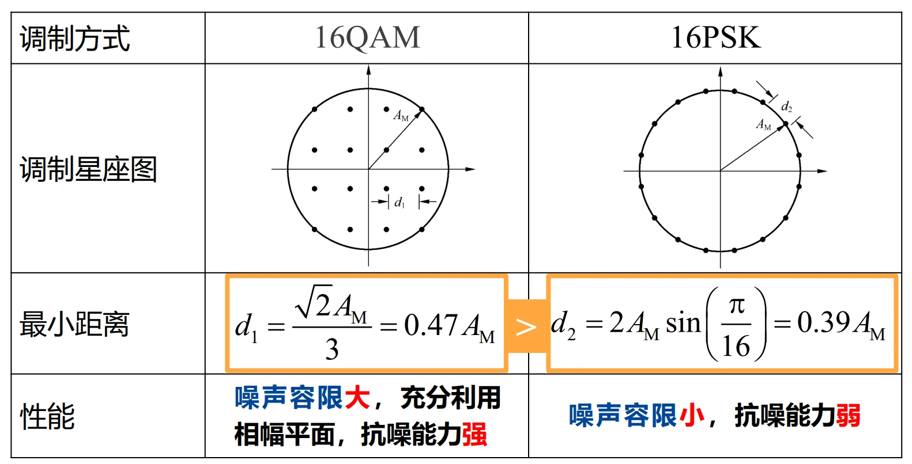
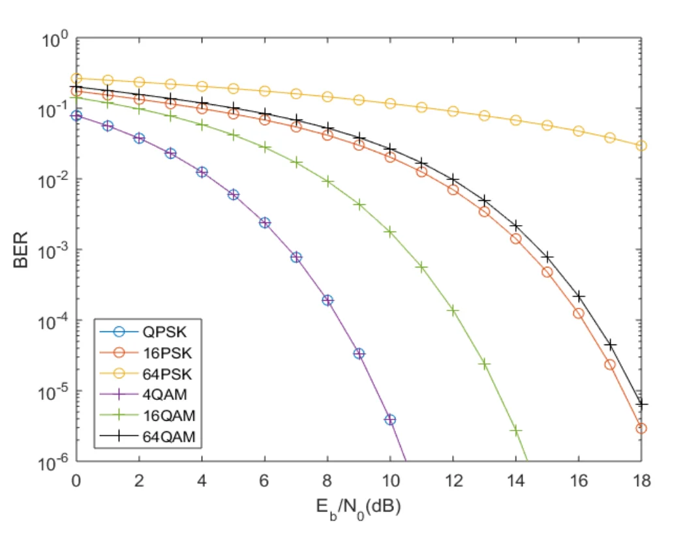

## I. MQAM 技术的引入与背景（核心痛点）

**1. MPSK 的致命瓶颈**
在上一章我们学到，为了提高传输速率（频带利用率），我们要增加调制阶数 $M$。但是，MPSK 所有的信号点都只能排布在一个**固定半径的圆周**上。
*   **痛点：** 当 $M$ 越来越大（比如 16、64），在这个有限的“呼啦圈”上挤入的信号点就越来越多，导致相邻两个点之间的**最小距离 $d_{min}$ 急剧减小**。
*   **后果：** 稍微有一点点噪声（判决区域变窄），接收端就会把 A 点错判成 B 点，**误码率飙升**。

**2. 破局思路：从“一维圆周”走向“二维平面”**
既然圆周上挤不下了，为什么不把圆内部的空间也利用起来呢？
如果我们在改变载波**相位**的同时，也改变载波的**振幅**，让信号点均匀地铺满整个二维平面（变成网格状），点与点之间的距离不就被拉开了吗？
这就是 **MQAM (多进制正交幅度调制, Quadrature Amplitude Modulation)** 的核心思想：**振幅和相位联合键控**。

---

## II. MQAM 信号的产生与系统模型

### 2.1 星座图演进

MQAM 的信号点呈现出完美的“正方形网格”分布。随着 $M = 4, 16, 64, 256$ 增加，网格越来越密。传输速率随之提升，但同样会面临相邻距离减小的问题（前提是总发射功率受限）。

### 2.2 16QAM 信号的产生方法
课件介绍了两种方法，我们重点掌握第一种最通用、最本质的方法。

**方法一：正交调幅法（极其重要！）**

详细解释：[MQAM 的正交调幅法](./mqam.md)
不要被 QAM 这个名字吓到，它本质上就是**两路独立的多电平 ASK 信号（MASK）的叠加**。

**拆解 16QAM：** 16 = 4 × 4。这意味着我们可以用一路 **4ASK** 信号去控制 $\cos(\omega_0 t)$（I路），用另一路 **4ASK** 信号去控制 $\sin(\omega_0 t)$（Q路）。
**坐标系理解：** 

*   横轴（I路）的取值有 4 种电平：$-3, -1, +1, +3$
*   纵轴（Q路）的取值也有 4 种电平：$-3, -1, +1, +3$
*   它们两两组合，刚好形成 $4 \times 4 = 16$ 个坐标点，比如 $(3, 3), (-1, 3)$ 等。

**方法二：复合相移法**
*   将 16QAM 看作是两路独立的、振幅不同的 QPSK 信号的物理叠加。*(工程上相对少用，理解即可)*。

### 2.3 QAM 调制解调系统数学表达式

任意 MQAM 信号的时域表达式都可以写为极其清爽的正交形式：
$$s_k(t) = X_k \cos(\omega_0 t) + Y_k \sin(\omega_0 t)$$
*   $X_k$: 同相支路 (I路) 的基带信号电平（如 $\pm 1, \pm 3$）
*   $Y_k$: 正交支路 (Q路) 的基带信号电平（如 $\pm 1, \pm 3$）
*   $\omega_0$: 载波角频率

由于 $\cos$ 和 $\sin$ 是完全正交的，在接收端，只要分别乘以 $\cos$ 和 $\sin$ 并通过低通滤波器，就可以无干扰地把 $X_k$ 和 $Y_k$ 解调出来。

---

## III. 核心对决：16QAM 与 16PSK 的抗噪性能博弈

这是本节课**最难也是最核心**的知识点：为什么有了 16PSK，还要发明 16QAM？
抗噪声能力的核心指标是：**相邻信号点之间的最小欧氏距离 $d_{min}$**。距离越大，越不容易被噪声推到别人的地盘（容错率高）。

### 3.1 在“最大振幅（峰值功率）相同”条件下的 PK
假设系统的放大器有峰值限制，允许输出的**最大振幅均为 $A_M$**。

**1. 16PSK 的最小距离推导：**
16PSK 所有点都在半径为 $A_M$ 的圆上。相邻两点的夹角是 $\frac{2\pi}{16} = \frac{\pi}{8}$。
由简单的等腰三角形关系可得底边（点间距离）：
$$d_2 = 2 A_M \sin\left(\frac{\pi}{16}\right) \approx 0.39 A_M$$

**2. 16QAM 的最小距离推导（课件跳过了这一步，这里为你补全）：**
看 16QAM 的网格，离原点最远的点（即四个角落的点，坐标为 $(\pm 3, \pm 3)$）它的振幅最大。
假设相邻两点之间的距离为 $d_1$，则横轴坐标可以表示为 $\pm \frac{d_1}{2}, \pm \frac{3d_1}{2}$。
*   角落点的横坐标是 $\frac{3d_1}{2}$，纵坐标是 $\frac{3d_1}{2}$。
*   角落点到原点的距离（即最大振幅 $A_M$）的平方为：$A_M^2 = \left(\frac{3d_1}{2}\right)^2 + \left(\frac{3d_1}{2}\right)^2 = \frac{18d_1^2}{4}$
*   解得：$d_1 = \sqrt{\frac{4A_M^2}{18}} = \frac{2A_M}{3\sqrt{2}} = \frac{\sqrt{2}A_M}{3} \approx 0.47 A_M$

**结论：** $0.47 A_M > 0.39 A_M$。在同等峰值功率下，**16QAM 的相邻点距离更大，噪声容限更大，抗噪能力更强！**

### 3.2 在“平均功率相同”条件下的 PK

*   16PSK 所有的点都在圆周上，所以**平均功率 = 最大功率**。
*   16QAM 有内圈的点（如 $(\pm 1, \pm 1)$），能量很小，只有外圈的点能量大。所以在同等最大功率下，16QAM 的**平均功率其实小得多**（计算得出最大功率是平均功率的 1.8倍，即 2.55dB）。
*   **终极结论：** 如果我们强制让 16QAM 和 16PSK 的**平均发送功率相等**（这才符合真实的发射功耗计算），16QAM 的信号点可以进一步拉得更开。此时，16QAM 的相邻距离甚至超过 16PSK 约 **4.12 dB**！这是绝对的碾压优势。

---

## IV. MQAM 的误码率理论分析

由于 MQAM 是两路正交的 MASK 的叠加，其误码率完全可以利用已知的多电平基带系统（MASK）来推导。

> 📍 **[此处插入图片：课件第9页“MQAM信号的误符号率”公式]**

*   **定义电平数 $L$：** 对于 $M$ 进制 QAM，横纵两个坐标轴各自拥有的电平数量为 $L = \sqrt{M}$。（例如 16QAM，$M=16$，则单路电平数 $L=4$）。
*   **误符号率 ($P_{E, MQAM}$)：**
    $$P_{E, MQAM} = \frac{2(L-1)}{L} Q\left(\sqrt{\frac{3}{L^2 - 1} \frac{E_s}{N_0}}\right)$$
    *(注：公式中的推导替换了信号功率与噪声比 $S/N$，只需记住最终与 $E_b/n_0$ 相关的形态即可。)*
*   **误比特率 ($P_B$)：**
    如果在坐标映射时采用了**格雷码**（相邻网格点只有 1 bit 不同），那么发生一次符号误判，通常只会错 1 个 bit。
    $$P_B \approx \frac{1}{\log_2 L} P_{E, MQAM} = \frac{2(1 - L^{-1})}{\log_2 L} Q\left(\sqrt{\frac{6 \log_2 L}{L^2 - 1} \frac{E_b}{N_0}}\right)$$

**性能直观对比（看图说话）：**

从曲线上可以得出两个铁律：
1.  无论是 PSK 还是 QAM，**$M$ 越大，误比特率曲线越靠右（性能越差）**，因为点与点越挤。
2.  在相同的 $M$ 下（比如对比 16QAM 的绿色实线 和 16PSK 的橙色带圈线），**MQAM 的曲线永远在 MPSK 的左侧**，这意味着要想达到相同的误码率，MQAM 所需的信噪比 ($E_b/N_0$) 更低！

---

## V. 频带利用率与香农极限

### 5.1 频带利用率计算
引入 MQAM 的最初目的就是为了省带宽。

*   **理想奈奎斯特带宽下：** 频带利用率 = $\log_2 M \quad \text{(b/s/Hz)}$
    *   例如 16QAM，1 Hz 频带每秒能传 4 个 bit。
*   **实际系统中（采用升余弦滚降滤波器）：** 实际滤波器无法做到绝对陡直，需要一定的滚降系数 $\alpha$（$0 < \alpha \le 1$）来防止码间串扰。
    *   频带利用率 = $\frac{1}{1 + \alpha} \log_2 M \quad \text{(b/s/Hz)}$

