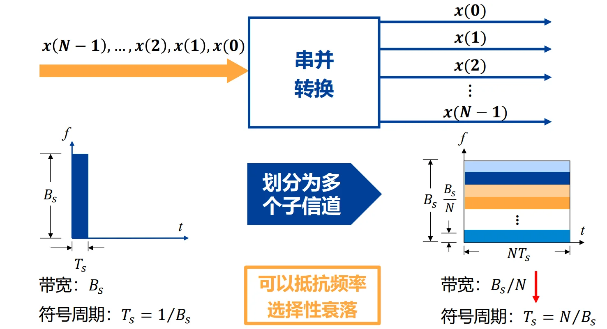
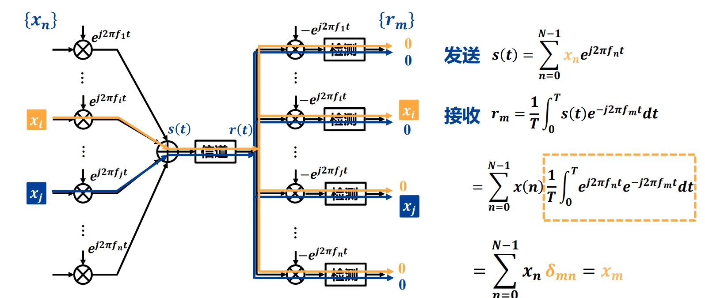
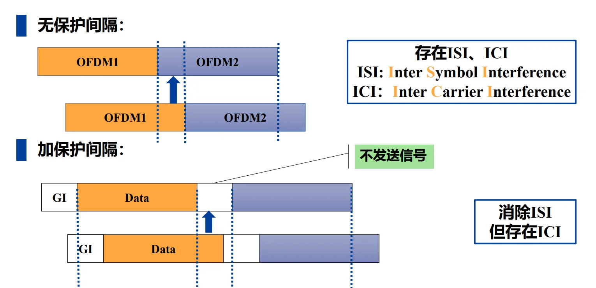
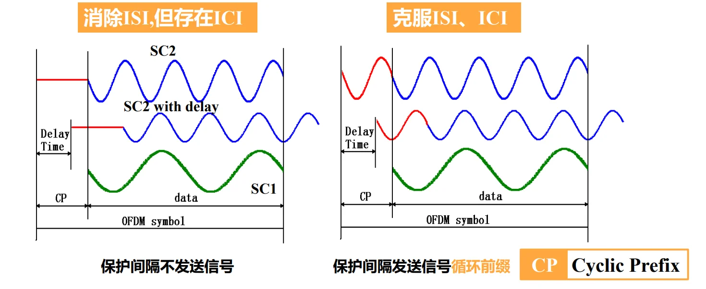
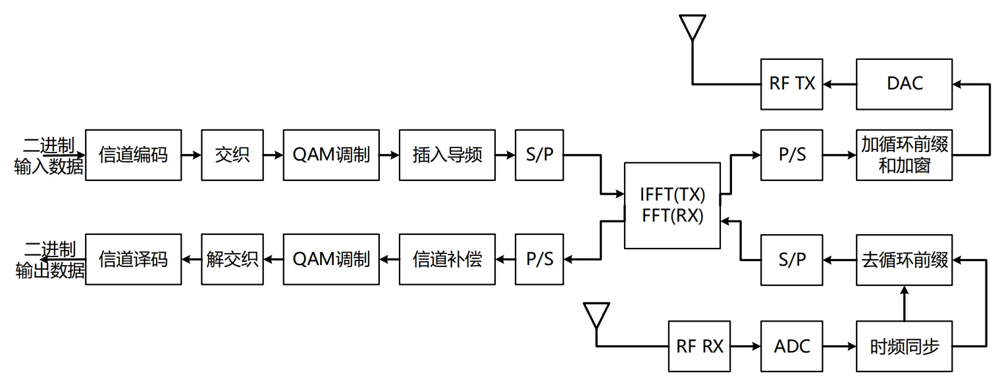

# 第十一章：OFDM 调制技术

## I. 背景与核心痛点：为什么要用 OFDM？

**1. 单载波调制在高速传输下的绝境**
在传统单载波系统中，数据率越高，每个符号的持续时间 $T_s$ 就越短，信号在频域上占用的带宽 $B$ 就越宽（$B \propto 1/T_s$）。

*   **致命问题（频率选择性衰落）：** 当信号带宽大于无线信道的“相干带宽”时，信号的不同频率成分在空气中会经历完全不同的衰减。原本平整的方块信号到了接收端会被扭曲得面目全非，导致严重的**码间串扰 (ISI)**。

**2. 破局思路：串并转换 (分而治之)**
既然一条宽马路容易发生连环车祸，我们就把它分成多条窄车道。

*   **方法：** 将高速数据流通过**串并转换**，分配到 $N$ 个并行的子信道上。
*   **效果：** 每个子信道的数据速率降低为原来的 $1/N$，符号周期变长为 $N \cdot T_s$。带宽变窄后，每个子信道内的衰落就变成了平坦衰落，完美解决了频率选择性衰落问题！

---

## II. OFDM 的基本原理：如何优雅地排布子信道？

如果用传统的频分复用（FDM，比如老式收音机），为了防止各个子信道互相干扰，必须在它们之间留出很宽的“保护频带”，这极其浪费频谱资源。OFDM 的伟大之处在于引入了 **“正交性 (Orthogonality)”**。

### 2.1 子载波的正交性数学证明
OFDM 让所有子载波的频谱**互相重叠**，但又能在接收端被完美分离。
假设有两个子载波频率分别为 $f_n$ 和 $f_m$，我们在一个符号周期 $T$ 内对它们求内积（相乘并积分）：

$$\frac{1}{T} \int_{0}^{T} e^{j2\pi f_n t} \cdot e^{-j2\pi f_m t} dt = \delta_{mn} = \begin{cases} 1, & n = m \\ 0, & n \neq m \end{cases}$$

**💡【正交的核心条件】：**
要让上述积分在 $n \neq m$ 时绝对等于 0，两个子载波的频率间隔 $\Delta f$ 必须满足：

$$\Delta f = \frac{1}{T}$$

*   **直观物理意义：** 在一个周期 $T$ 内，任意两个子载波包含的“完整正弦波周期数”刚好差一个整数。把它们乘在一起，正半轴的面积和负半轴的面积刚好完全抵消！

### 2.2 时域与频域的叠加魔法

**发送端叠加（时域）：** 

$$s(t) = \sum_{n=0}^{N-1} x_n e^{j2\pi f_n t}$$

这里 $x_n$ 是经过 QAM 或 PSK 映射后的复数电平。所有子载波在时域上直接相加，最后变成一个看起来毫无规律的杂乱波形 $s(t)$。

**接收端分离（频域无混叠）：**

当接收机想提取第 $m$ 个子载波上的信息 $x_m$ 时，只需要把收到的 $s(t)$ 乘以 $e^{-j2\pi f_m t}$ 并积分。**因为正交性，其他所有子载波的积分全部变成了 0，犹如幽灵般隐形了！** 只剩下 $x_m$ 本身。
*在频谱图上观察：每一个子载波的频谱都是一个 Sinc 函数，神奇的是，当某个子载波达到峰值时，其他所有子载波的频谱恰好穿过 0 点。*

---

## III. 循环前缀 (CP)：对抗多径效应的终极武器

这是 OFDM 最核心、最难懂，也是最精妙的设计。

无线信号在城市里传播时，会经过高楼反射形成**多径效应**。这意味着接收端会收到很多个“迟到”的信号副本。

*   **ISI (符号间干扰):** 上一个符号的迟到尾巴，拖到了当前符号的时间里。
*   **ICI (子载波间干扰):** 多径导致正弦波发生时移，破坏了整数个周期的完美对齐条件，正交性被毁灭。

### 3.1 为什么普通的“保护间隔(GI)”不行？

*   **解决 ISI：** 迟到的尾巴落在了空白区，不影响下一个符号。ISI 消除了。
*   **ICI 依然存在：** FFT 接收窗口必须截取长度为 $T$ 的波形来积分。由于波形是延迟的，FFT 窗口截取到的将不是完整的正弦波周期，在做傅里叶变换时会导致严重的频谱泄露（正交性丧失）。

### 3.2 循环前缀 (Cyclic Prefix, CP) 的诞生

通信学家想出了一个天才的办法：**不留空白，而是把 OFDM 符号最后面的那一段波形，像剪切板一样复制，粘贴到最前面！**

**💡【为什么 CP 能同时消灭 ISI 和 ICI？】**

1.  **吸收多径时延 (抗 ISI)：** 只要信道的最大多径时延 $\tau_{max}$ 小于 CP 的长度 $T_g$，上一个符号的尾巴最多只会冲进当前符号的 CP 区域。我们接收时，直接把 CP 扔掉不处理，截取后面的有效部分，完全没有 ISI！
2.  **维持正交性 (抗 ICI，极其精妙)：** 
    正弦波具有周期性。把尾巴复制到前面，意味着这部分波形在时间上是**连续且周期循环**的。
    当多径信号发生延迟时，对于接收机的 FFT 截取窗口来说，**看起来就像是这个信号在窗口内做了一次“圆周移位 (Circular Shift)”**！
    在傅里叶变换中，时域的圆周移位只等价于频域的相位旋转（乘上一个相位因子 $e^{j\theta}$），**绝不会破坏波形的频率成分，因此完全保住了子载波的正交性（无 ICI）！**

### 3.3 代价与效率
加入了 CP 虽然保证了信号的无暇，但占用了传输时间。

*   传输效率 = $\frac{T}{T + T_g}$ （其中 $T$ 为有用符号长度，$T_g$ 为 CP 长度）。
*   系统设计时，通常让 CP 的长度等于信道根均方时延的 2-4 倍；让符号总长度 $T$ 是 CP 长度的 5 倍左右，以平衡抗干扰能力与传输效率。

---

## IV. OFDM 的高效实现：IFFT 与 FFT 的降维打击

这是 OFDM 从“理论模型”走向“现实商用”的决定性一步。如果用传统的模拟电路，实现 1000 个子载波的正交调制需要 1000 个独立的振荡器和乘法器，体积和成本根本无法接受。

### 4.1 数学映射公式证明

让我们重写 OFDM 发射端的连续时间公式：

$$s(t) = \sum_{k=0}^{N-1} b_k e^{j2\pi f_k t}$$

现在，我们将信号进行**数字离散化抽样**：

*   令 $f_k = k \Delta f = \frac{k}{N T_s}$ （$N$为子载波数，$T_s$为抽样间隔，总时长 $T = N T_s$）
*   令离散时间 $t = n T_s$ （$n$ 表示第 $n$ 个离散采样点）

把这两个参数代入上面的连续公式：

$$s(n T_s) = \sum_{k=0}^{N-1} b_k e^{j2\pi \frac{k}{N T_s} n T_s} = \sum_{k=0}^{N-1} b_k e^{j2\pi \frac{n k}{N}}$$

**奇迹出现了！**
等式最右边 $\sum b_k e^{j2\pi \frac{n k}{N}}$，在数学格式上，**百分之百等同于离散傅里叶反变换 (IDFT)** 的定义式！

### 4.2 工程意义（复杂度的断崖式下降）
1.  **发送端：** 硬件只需收集 $N$ 个 QAM 调制的复数信号 $b_k$（频域信号），直接扔进一个计算 **快速傅里叶反变换 (IFFT)** 的数字芯片，吐出来的离散序列直接通过 DAC (数模转换器) 发送出去。根本不需要任何物理的压控振荡器去生成几百个正弦波！
2.  **接收端：** 收到时域信号后通过 ADC 采样，扔进计算 **快速傅里叶变换 (FFT)** 的芯片，出来的直接就是原本的 $b_k$（解调出了各个子载波上的 QAM 星座点）。
3.  **复杂度：** 利用 FFT 算法，计算复杂度从 $O(N^2)$ 断崖式下降到 $O(N \log N)$，使得搭载几千个子载波的 Wi-Fi 芯片能轻易集成在你的手机里。

---

## V. OFDM 系统设计总结与优缺点

完整的物理层流程总结：二进制数据 $\rightarrow$ 信道编码/交织 $\rightarrow$ QAM映射 $\rightarrow$ 插入导频(用于信道估计) $\rightarrow$ **IFFT (核心)** $\rightarrow$ 插入 CP $\rightarrow$ D/A $\rightarrow$ 射频发射。

### 5.1 OFDM 的核心优势
1.  **极大提高频谱效率：** 正交子载波互相重叠，逼近理论极限。
2.  **抗频率选择性衰落极强：** 宽带化为窄带，结合信道编码能完美恢复受损信道。
3.  **抗多径干扰 (ISI/ICI)：** CP 的引入完美化解了无线通信最大的痛点。
4.  **硬件实现简单：** 依托于成熟强大的 DSP/FPGA 进行 FFT 运算。

### 5.2 OFDM 的阿喀琉斯之踵 (致命缺点)

*   **频偏 (CFO) 影响：** 如果发射机和接收机的晶振有偏差，或者因为终端高速移动产生了多普勒频移，接收端的频率网格就会整体产生偏移。这会导致本该在积分时变成 0 的其他子载波，产生残留值（能量泄露）。正交性一旦破裂，ICI 就会像雪崩一样出现，误码率急剧上升。
*   *这也是为什么高铁上 Wi-Fi 和 4G 信号容易不稳定的重要物理原因之一（多普勒频偏破坏了 OFDM 的正交性）。*

OFDM 调制与解调的流程演示：[OFDM-Example](./ofdm.md)