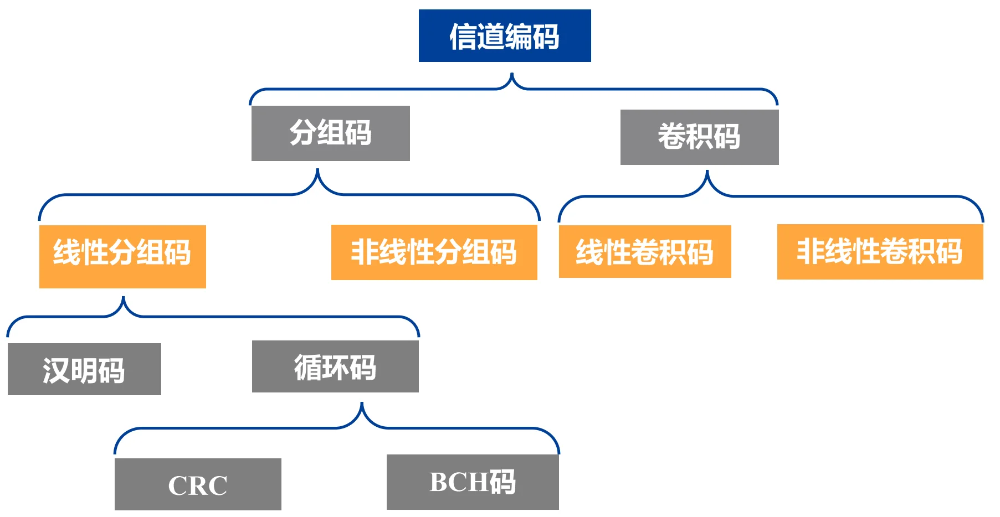
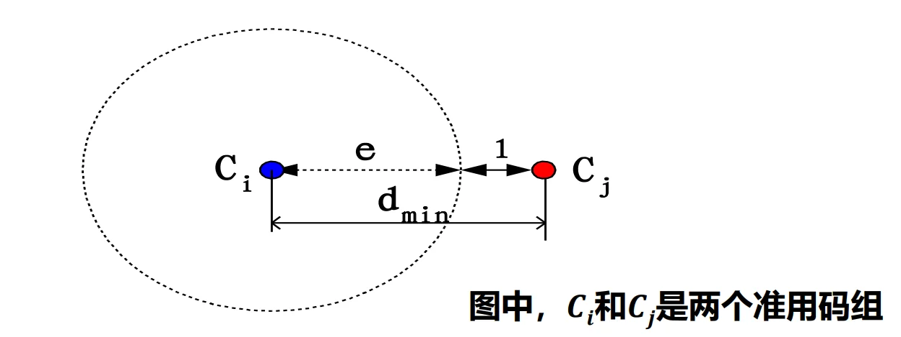
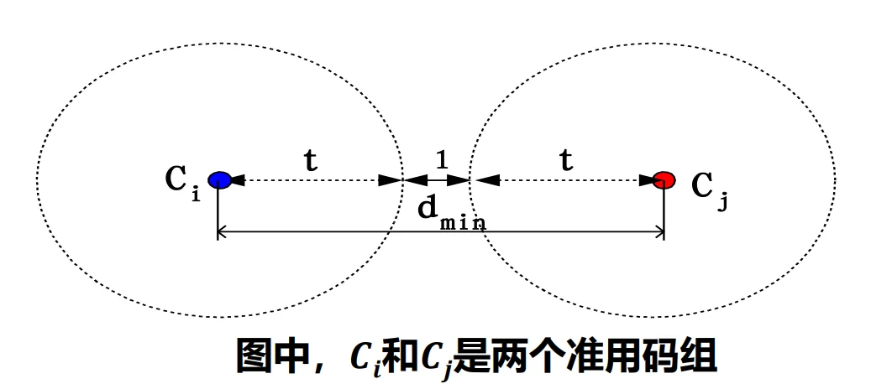
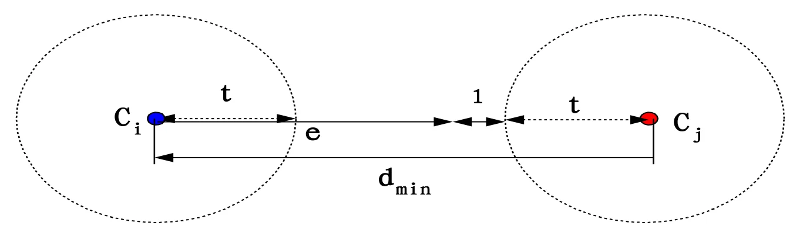
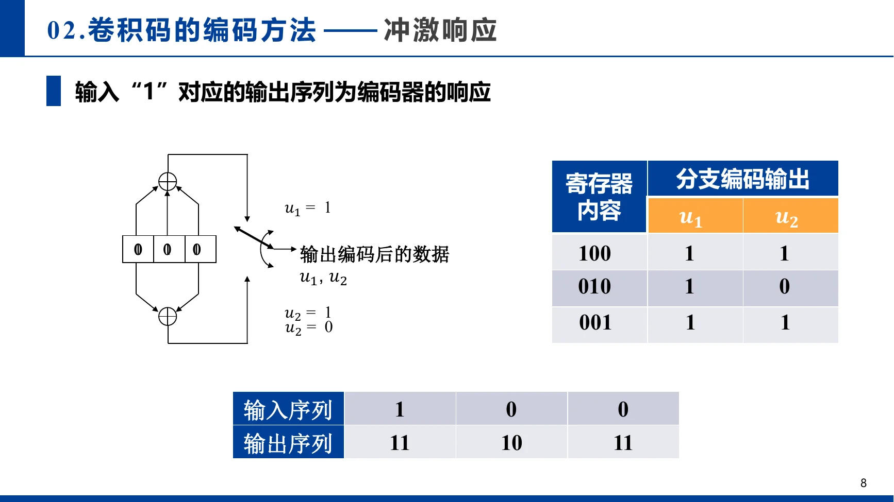
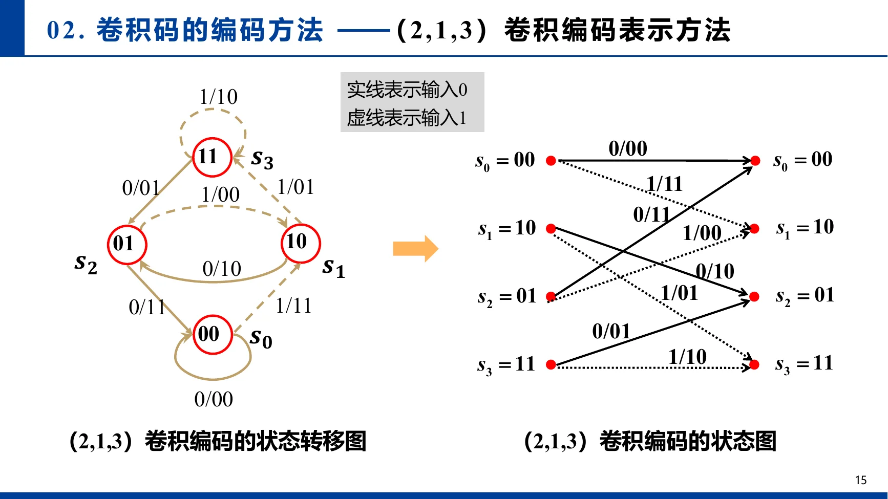
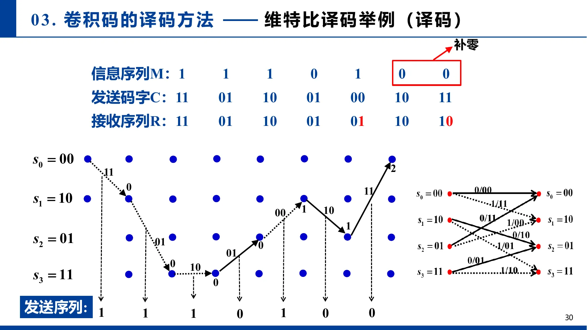

# 第十二章：信道编解码

## I. 信道编码的基本概念

### 1.1 为什么要进行信道编码？
在实际的数字通信系统中，信号经过信道传输时必然会受到 **干扰和噪声（如白噪声、突发强干扰）** 的影响，导致接收端发生误码。

* **信源编码**：目的是格式化和压缩，**减少冗余**以提高传输效率。
* **信道编码**：目的是在信息中**故意增加一定的冗余比特（监督码元）**，使得信息空间映射到更大的信道空间。这些多出来的冗余比特构成了“约束关系”。一旦传输发生错误，约束关系就会被破坏，接收端借此实现**发现甚至纠正错误**（获得编码增益）。
* **工程权衡**：信道编码本质上是在**系统复杂性、可靠性、有效性（传输速率）和延时**之间寻找最佳工作点。

### 1.2 关键性能指标与核心术语（公式铺垫）
假设分组码的长度为 $n$，其中有效信息位为 $k$，相应的监督（校验）位为 $r = n - k$。该码被称为 **$(n, k)$ 码**。

* **编码效率（码率 Code Rate）**：$R = \frac{k}{n}$ 。代表传输的有效信息占比。
* **冗余度**：$\frac{n-k}{k}$。
* **码重（Weight, $W$）**：一个码字中非零码元（即'1'）的数目。
* **汉明距（Hamming Distance, $d$）**：两个码字中**对应位置上取值不同**的个数。
   - *(硬件视角：两个码字按位进行异或 $\oplus$ 运算后，结果的码重就是汉明距)*。
* **最小码距（$d_{min}$）**：准用码字空间中，任意两个不同码字之间的最小距离。**它是决定一种编码检错和纠错能力上限的最核心几何指标**。

> **⚠️ 注意（门限效应）**：虽然编码能提升性能，但在极其恶劣的信道下（信噪比 $E_b/N_0$ 下降到某个门限值以下时），解调器产生的误码过多超出了纠错上限，此时“编码后性能反而会不如未编码系统”（劣化）。

### 1.3 编码分类与误码形式

* **误码主要形式**：
  1. **随机错误**：位置随机，由白噪声引起。
  2. **突发错误**：成串出现，由强脉冲或雷电等突发干扰引起。
* **编码分类**：
  1. **线性码 vs 非线性码**：信息码与监督码是否呈线性组合关系。
     - *(注：二进制的线性加法就是异或 $\oplus$，这使得线性码极其适合VLSI实现)*。
  2. **分组码 vs 卷积码**：监督码元只与“本组”信息有关（分组码），还是与“前面多个码组”也有关（卷积码，带记忆属性）。
  3. **系统码 vs 非系统码**：编码后信息位的原有排列顺序是否保持不变。保持原样的就是系统码。

---

## II. 线性分组码 (Linear Block Codes)

### 2.1 线性分组码的定义与生成矩阵 $G$
把 $k$ 位信息序列（**信息位**）通过编码器产生 $r$ 个**监督位**，合并输出长为 $n=k+r$ 的码字 $U$。如果在码字中，**监督位是由信息位的线性组合（异或）得到的**，这就是线性分组码。

我们可以把这种编码过程用矩阵乘法极其优雅地表达出来：

$$U = m \cdot G$$

* $m$：$1 \times k$ 的信息行向量（例如 $[m_1, m_2, m_3]$）。
* $G$：$k \times n$ 的**生成矩阵（Generator Matrix）**。它由 $k$ 个**线性无关的码字按行**构成。
* $U$：$1 \times n$ 的输出码字。

**【典型结构】**：对于**系统码**，生成矩阵 $G$ 通常形如 $G = [P | I_k]$。
其中 $I_k$ 是 $k \times k$ 的单位矩阵（负责把信息位原封不动抄下来），$P$ 是 $k \times (n-k)$ 的子矩阵（负责计算校验位）。
*(VLSI视角：矩阵 $G$ 就是编码器的硬件蓝图！$P$ 矩阵中某列哪个位置是'1'，就代表该位置的信息位需要连入该校验位的异或树网络中。)*

#### 示例

考虑一个 $(6,3)$ 线性分组码，信息位为 $m_i$，其监督位 $p_i$ 的构造方法为：

$$\left\{\begin{array}{l}
p_{1}=m_{1} \oplus m_{3} \\
p_{2}=m_{1} \oplus m_{2} \\
p_{3}=m_{2} \oplus m_{3}
\end{array}\right.$$

则信息序列与码字的映射关系为：

| 信息 \((m_1, m_2, m_3)\) | 码字 \((p_1, p_2, p_3, m_1, m_2, m_3)\) |
| --- | --- |
| 0 0 0 | 0 0 0 0 0 0 |
| 1 0 0 | 1 1 0 1 0 0 |
| 0 1 0 | 0 1 1 0 1 0 |
| 0 0 1 | 1 0 1 0 0 1 |
| 1 1 0 | 1 0 1 1 1 0 |
| 1 0 1 | 0 1 1 1 0 1 |
| 0 1 1 | 1 1 0 0 1 1 |
| 1 1 1 | 0 0 0 1 1 1 |

任取三行构成生成矩阵 $G$ ：

$$G = 
\begin{bmatrix}
1 & 1 & 0 & 1 & 0 & 0 \\
0 & 1 & 1 & 0 & 1 & 0 \\
1 & 0 & 1 & 0 & 0 & 1
\end{bmatrix}$$

输入信息为 $m = [1,1,0]$ 时，输出码字为：

$$U=m\cdot G= \begin{bmatrix} 1 & 1 & 0 \end{bmatrix} \cdot \begin{bmatrix} 1 & 1 & 0 & 1 & 0 & 0 \\ 0 & 1 & 1 & 0 & 1 & 0 \\ 1 & 0 & 1 & 0 & 0 & 1 \end{bmatrix} = \begin{bmatrix} 1 & 0 & 1 & 1 & 1 & 0 \end{bmatrix}$$

### 2.2 监督矩阵 $H$ 与约束关系
发送端用 $G$ 编码，接收端需要一把“尺子”去校验，这把尺子就是**监督矩阵 $H$**。

**构造方法**：
如果 $G = [P | I_k]$，其中 $P$ 是 $k \times (n-k)$ 的子矩阵，$I_k$ 是 $k \times k$ 的单位矩阵，

那么对应的监督矩阵定义为:

$$H = [I_{n-k} | P^T]$$

它是一个 $(n-k) \times n$ 的矩阵。

**正交约束特性**：无论输入什么信息，合法的码字 $U$ 必须满足：

$$\begin{aligned}
G H^{T}  = & \left[P \mid I_{k}\right] \cdot \left[I_{(n-k)} \mid P^{T}\right]^{T} \\ = & \left[P \mid I_{k}\right]\left[\frac{I_{(n-k)}}{P}\right] \\
 = & P I_{(n-k)}+I_{k} P=P+P=[0]
\end{aligned}$$

- 注意：上述矩阵乘法是 模2乘法，即**乘法中的加法是异或 $\oplus$ 运算**。

$$U \cdot H^T = (m \cdot G) \cdot H^T = m \cdot (G \cdot H^T) = 0$$

如果接收到的码字乘以 $H^T$ **不等于零，说明在信道传输中一定引入了错误**！

#### 示例：

$$G = \left[\begin{array}{ccc|ccc}
1 & 1 & 0 & 1 & 0 & 0 \\
0 & 1 & 1 & 0 & 1 & 0 \\
1 & 0 & 1 & 0 & 0 & 1
\end{array}\right]
\quad
H = \left[\begin{array}{ccc|ccc}
1 & 0 & 0 & 1 & 0 & 1 \\
0 & 1 & 0 & 1 & 1 & 0 \\
0 & 0 & 1 & 0 & 1 & 1
\end{array}\right]$$

$$GH^T = \begin{bmatrix}
1 & 1 & 0 & 1 & 0 & 0 \\
0 & 1 & 1 & 0 & 1 & 0 \\
1 & 0 & 1 & 0 & 0 & 1
\end{bmatrix}
\begin{bmatrix}
1 & 0 & 0 \\
0 & 1 & 0 \\
0 & 0 & 1 \\
1 & 1 & 0 \\
0 & 1 & 1 \\
1 & 0 & 1
\end{bmatrix}
= \begin{bmatrix}
0 & 0 & 0 \\
0 & 0 & 0 \\
0 & 0 & 0
\end{bmatrix}$$

### 2.3 伴随式 $S$ 与纠错译码原理

真实信道中，接收到的码字 $r$ 等于**发送码字 $U$ 叠加了错误图样 $e$**（0代表没按错，1代表该位发生了翻转）：

$$r = U + e$$

接收端用 $H^T$ 校验收到的 $r$，计算出的结果称为**伴随式（Syndrome，$S$）**：

$$S = r \cdot H^T = (U + e) \cdot H^T = U \cdot H^T + e \cdot H^T$$

因为 $U \cdot H^T = 0$，所以：

$$S = e \cdot H^T$$

**【神仙推论】**：伴随式 $S$ **完全且只与错误图样 $e$ 有关**，与发送了什么具体信息无关！

- ——原因：在**模2矩阵乘的意义下，$r\cdot H^T$ 的结果与 $e \cdot H^T$ 完全相同**！
- 若 $S = 0$：大概率没发生错误，直接去掉监督位提取信息。
- 若 $S \neq 0$：说明有错。因为 $S$ 和 $e$ 一一对应，我们可以**提前建立一张“错误图样 $e \leftrightarrow$ 伴随式 $S$ ”的查询表（Syndrome Table）**。

**【译码步骤 (VLSI查表法)】**：

1. **计算 $S$**：$S = r \cdot H^T$（组合逻辑实现的大型异或树）。
2. **查表定位**：用 $S$ 作为地址，查表得到错误图样 $\hat{e}$（通常是一个ROM或者译码组合逻辑）。
3. **纠错恢复**：将收到的码字与**错误图样异或翻转**回来：$\hat{U} = r + \hat{e}$。

#### 示例

映射表：

| 错误图样 | 伴随式 |
| :---: | :---: |
| 000000 | 000 |
| 000001 | 101 |
| 000010 | 011 |
| 000100 | 110 |
| 001000 | 001 |
| 010000 | 010 |
| 100000 | 100 |
| 010001 | 111 |

$r = U + e = 101110 + 000001 = 10111\color{red}{1}$

伴随式：

$$S = r \cdot H^T = \begin{bmatrix} 1 & 0 & 1 & 1 & 1 & 1 \end{bmatrix} \cdot \begin{bmatrix} 1 & 0 & 0 \\ 0 & 1 & 0 \\ 0 & 0 & 1 \\ 1 & 1 & 0 \\ 0 & 1 & 1 \\ 1 & 0 & 1 \end{bmatrix} = \begin{bmatrix} 1 & 0 & 1 \end{bmatrix}$$

因此查表可以发现错误图样为：$000001$

### 2.4 检错与纠错能力定理（核心极限）

到底能纠正多少位错误，取决于密码本中的码字之间隔得多远（即**最小码距 $d_{min}$**）。
假设 $(n,k)$ 码的最小码距为 $d_{min}$：

**(1) 若要检测出 $e$ 个随机错误**

$$d_{min} \ge e + 1$$

*理解：码字偏离 $e$ 步之后，绝不能恰好走到另一个合法码字上去。*

**(2) 若要纠正 $t$ 个随机错误**

$$d_{min} \ge 2t + 1$$

*理解（几何球体模型）：把每个合法码字看作球心，画一个半径为 $t$ 的球。要想通过“谁离得近就判给谁”来纠错，这几个球绝对不能相交！因此两球心距离至少得是 $t + t + 1 = 2t+1$。*

**(3) 若要同时纠正 $t$ 个错误并检测出 $e$ 个错误（其中 $e \ge t$）**

$$d_{min} \ge e + t + 1$$

*理解：在能够纠正 $t$ 的基础上，为了让超过纠错能力但处于检错范围内的错误不落入其他合法码字的纠错球体内，距离需要进一步拉开。*

## III. 循环码 (Cyclic Codes) —— 多项式与移位的艺术

### 3.1 什么是循环码？为什么要引入多项式？
**定义**：码长为 $n$、信息位为 $k$ 的 $(n, k)$ 线性分组码，如果满足 **“任意一个合法的码字，经过循环移位（如左移 $i$ 位）后，仍然是该码空间中的一个合法码字”**，则称为循环码。

理解：为什么要用多项式？

在普通线性分组码中，我们用向量 $[u_0, u_1, u_2 \dots]$ 表示码字，用矩阵乘法运算，这在硬件上对应复杂的全局连线。

为了利用“移位”特性，数学上引入了**多项式**：

$$U(x) = u_{n-1}x^{n-1} + u_{n-2}x^{n-2} + \dots + u_1x + u_0$$

*为什么这么做？* 因为在代数中，多项式乘以 $x$，就相当于将所有系数向高位移动了一位（硬件上就是数据在移位寄存器里走了一步）。这样，复杂的矩阵运算就被降维成了**多项式的乘法和除法**！

### 3.2 生成多项式 $g(x)$ 与非系统编码

在循环码中，我们**不再需要庞大的生成矩阵 $G$**，只需要一个**生成多项式 $g(x)$** 就能决定所有的码字。

**核心约束**：循环码的每一个合法码字多项式 $U(x)$，**必须是 $g(x)$ 的倍数**。

**非系统编码公式**：$U(x) = m(x) \cdot g(x)$

*(其中 $m(x)$ 是信息多项式。)*

#### 示例

已知 $k=3, n=7$，信息位 $m = [m_1, m_2, m_3]$。生成多项式为 $g(x) = x^4 + x^2 + x + 1$。

因为 $k=3$，所以信息多项式最高次为 $x^2$。通过计算 $x^2 \cdot g(x), x \cdot g(x), 1 \cdot g(x)$ 的系数，就提取出了对应的生成矩阵 $G$。

> **1. 由 $g(x) = x^4 + x^2 + x + 1$ 可得到3个多项式**

$$\begin{bmatrix}
x^2g(x) \\
xg(x) \\
g(x)
\end{bmatrix}
=
\begin{bmatrix}
x^6 & + x^4 + x^3 + x^2 \\
 & x^5 & + x^3 + x^2 + x \\
 & & x^4 & + x^2 + x + 1
\end{bmatrix}$$

> **2. 取多项式的系数构成矩阵，得到生成矩阵 $G$**

$$G =
\begin{bmatrix}
1 & 0 & 1 & 1 & 1 & 0 & 0 \\
0 & 1 & 0 & 1 & 1 & 1 & 0 \\
0 & 0 & 1 & 0 & 1 & 1 & 1
\end{bmatrix}$$

> **3. 由生成矩阵 $G$ 求输入信息 010 的码字**

$$\begin{aligned}U & = mG \\ & = [0 \quad 1 \quad 0]
\begin{bmatrix}
1 & 0 & 1 & 1 & 1 & 0 & 0 \\
0 & 1 & 0 & 1 & 1 & 1 & 0 \\
0 & 0 & 1 & 0 & 1 & 1 & 1
\end{bmatrix} \\
& = [0 \quad 1 \quad 0 \quad 1 \quad 1 \quad 1 \quad 0]\end{aligned}$$

输入信息010，编码后码字为0101110
*同理：输入信息011，编码后码字为0111001 → 循环码*

### 3.3 如何构造系统型循环码？

课件中给出的 $U = m \cdot G$ 是**非系统码**。但实际工程中，为了方便直接读出数据，往往要求编码后是**系统码**（即信息位原封不动地排在前面，校验位接在后面）。

*   **非系统码（课件上的 $U(x) = m(x) \cdot g(x)$）**：
    这就好比你把信息（草莓）和校验多项式（牛奶）放进**榨汁机**里一顿狂搅。出来的码字（草莓牛奶）虽然包含了所有的成分，但是你**不能直接从最终结果里一眼挑出**原来的草莓在哪里。信息被打散在整个码字中了。
*   **系统码（作业要求的形式）**：
    这就好比你拿了一个**带有分格的饭盒**。左边的格子原封不动地放你的信息（草莓），右边的格子放根据草莓算出来的校验位（炼乳）。接收端一打开饭盒，**不需要任何复杂的计算，直接把左边格子的东西拿走就是原始信息**！

#### 3.3.1 系统码多项式推导过程（务必掌握）

##### Step 1. 移位腾出空间

概括：将信息多项式 $m(x)$ 乘以 $x^{n-k}$。在硬件上相当于把信息左移 $n-k$ 位，后面补零，留给校验位。

**理解**：

信息一共有 $k$ 位，我们需要在它后面拼接 $n-k$ 位的校验码。
所以我们先把信息 $m(x)$ 强行左移 $n-k$ 位（即乘以 $x^{n-k}$）。
此时，我们的半成品码字变成了：$m(x) \cdot x^{n-k}$。
*(比如：本来是 101，左移4位变成 1010000，后面空出的4个0就是留给校验位的座位)*。

##### Step 2. 求余数构建校验位

概括：用 $x^{n-k}m(x)$ 除以生成多项式 $g(x)$，得到余数多项式 $r(x)$。

$$\boxed{x^{n-k}m(x) = Q(x)g(x) + r(x)}$$

**理解**：

这个半成品 $m(x) \cdot x^{n-k}$ 大概率是**不能**被 $g(x)$ 整除的。那我们让它去除以 $g(x)$，看看差多少：

$$m(x) \cdot x^{n-k} \div g(x) = Q(x) \dots \text{余数 } r(x)$$

写成等式就是：

$$\boxed{m(x) \cdot x^{n-k} = Q(x) \cdot g(x) + r(x)}$$

##### Step 3. 拼接成码字

概括：因为在模 2 运算中，加减法等价（都是异或），我们将余数加（异或）到后面：

$$\boxed{U(x) = x^{n-k}m(x) + r(x)}$$

*此时，显然 $U(x)$ 能够被 $g(x)$ 整除（余数为0），满足循环码的要求，且高位是完整的信息，低位是余数校验位！*

**理解**：

在普通的数学里，我们把余数 $r(x)$ 移到等式左边，需要变成减号（-）。
但是！在微电子和数字通信中，我们用的是**二进制（伽罗瓦域 GF(2)）**。
**在二进制里，加法和减法是一模一样的，都是异或（XOR）运算！**
也就是说：$+ r(x)$ 完全等同于 $- r(x)$，因为 $1 \oplus 1 = 0$。

所以，我们把 $r(x)$ 移到等号左边：

$$m(x) \cdot x^{n-k} \boxed{\oplus r(x)} = \boxed{Q(x) \cdot g(x)}$$

你看！等式左边这个新的多项式$\boxed{Q(x) \cdot g(x)}$：

——它就是我们要找的系统码字 $\boxed{U(x)}$！

$$\boxed{U(x) = m(x) \cdot x^{n-k} + r(x)}$$

它刚好等于 $Q(x) \cdot g(x)$，**完美被 $g(x)$ 整除！这就是我们要找的系统码字！**

#### 3.3.2 示例

*   已知：$n=7, k=3$，所以校验位长度为 $n-k = 4$。
*   已知：生成多项式 $g(x) = x^4 + x^2 + x + 1$。
*   假设发送信息：$m = 110$ （二进制）。对应的多项式就是 $m(x) = 1 \cdot x^2 + 1 \cdot x + 0 = x^2 + x$。

**【开始推导】**
**Step 1：移位腾出空间**
给 $m(x)$ 乘以 $x^4$：$x^4 \cdot m(x) = x^4 \cdot (x^2 + x) = x^6 + x^5$
*(二进制表示就是：110 变成 1100000)*

**Step 2：长除法求余数**
用 $x^6 + x^5$ 除以 $g(x) = x^4 + x^2 + x + 1$。
*(注意：这里的每一项加减法，统统是异或运算，同项相消即为0)*

1.  用最高次相除：$x^6 \div x^4 = x^2$ （这是商的第一项）。
    把 $x^2$ 乘回除数：$x^2 \cdot (x^4 + x^2 + x + 1) = x^6 + x^4 + x^3 + x^2$。
    **异或相减**：
    $(x^6 + x^5) \oplus (x^6 + x^4 + x^3 + x^2)$
    $= x^5 + x^4 + x^3 + x^2$ （消掉了 $x^6$）。
2.  继续用最高次相除：$x^5 \div x^4 = x$ （这是商的第二项）。
    把 $x$ 乘回除数：$x \cdot (x^4 + x^2 + x + 1) = x^5 + x^3 + x^2 + x$。
    **异或相减**：
    $(x^5 + x^4 + x^3 + x^2) \oplus (x^5 + x^3 + x^2 + x)$
    $= x^4 + x$ （奇迹般地消掉了 $x^5, x^3, x^2$）。
3.  继续相除：$x^4 \div x^4 = 1$ （这是商的第三项）。
    把 $1$ 乘回除数：$1 \cdot (x^4 + x^2 + x + 1) = x^4 + x^2 + x + 1$。
    **异或相减**：
    $(x^4 + x) \oplus (x^4 + x^2 + x + 1)$
    $= x^2 + 1$。

此时最高次 $x^2$ 已经小于除数的最高次 $x^4$ 了，除法结束。
我们得到了**余数：$r(x) = x^2 + 1$**。*(二进制就是 0101)*

**Step 3：拼接系统码字**
最终的系统码字 $U(x) = x^4 \cdot m(x) + r(x)$
$U(x) = (x^6 + x^5) + (x^2 + 1)$
对应的二进制码字就是：**`1100101`**。

你看，高3位 `110` 正是我们的原始信息，低4位 `0101` 就是系统自动生成的校验位。接收端收到后，可以直接把前3位摘出来当信息用。

### 3.4 伴随式多项式 $S(x)$ 与纠错过程
接收端收到码字多项式 $r(x) = U(x) + e(x)$。
如何判断有没有错？做除法！

**证明**：
$S(x) = r(x) \bmod g(x)$
展开 $r(x)$：
$S(x) = [U(x) + e(x)] \bmod g(x)$
因为合法的码字 $U(x)$ 本身就是 $g(x)$ 的倍数，所以 $U(x) \bmod g(x) = 0$，故：
$S(x) = e(x) \bmod g(x)$
  
**结论再一次出现：伴随式 $S(x)$ 依然只跟错误图样 $e(x)$ 有关，与发送的具体信息无关！**

**译码纠错四步曲**：

1. **计算余数**：计算接收码字的伴随式 $S(x) = r(x) \bmod g(x)$。
2. **判决**：若 $S(x) = 0$，认为无错。
3. **查表**：若 $S(x) \neq 0$，拿着这个余数去查“伴随式错误图样查询表”，找到对应的单比特/多比特错误位置 $e(x)$。
4. **纠错**：$\hat{U}(x) = r(x) + e(x)$ 

#### 示例

$(7,3)$ 循环码，生成多项式 $g(x) = x^4 + x^2 + x + 1$。

因此错误图样、对应的多项式以及伴随式（Syndrome）的对照表：

| 错误图样 $e$ | 错误图样多项式 $e(x)$ | 伴随式 $S(x)$ |
| :---: | :---: | :---: |
| 1000000 | $x^6$ | $x^3 + x + 1$ |
| 0100000 | $x^5$ | $x^3 + x^2 + x$ |
| 0010000 | $x^4$ | $x^2 + x + 1$ |
| 0001000 | $x^3$ | $x^3$ |
| 0000100 | $x^2$ | $x^2$ |
| 0000010 | $x$ | $x$ |
| 0000001 | $1$ | $1$ |

设发送码字：$U=0101110$, 接收码字：$r=\color{red}{1}101110$，则：

$r(x) = x^6 + x^5 + x^3 + x^2 + x$

$r(x) = (x^4+x^2+x+1)(x^2+x+1) \oplus \boxed{(x^3+x+1)}$

因此查询发现错误图样为：$1000000$，正确

### 3.5 循环码的实际应用
循环码由于其极佳的“突发错误”检测能力以及极其低廉的硬件实现成本（只需几十个门电路即可实现校验），在工程界应用霸榜：

* **CRC码（循环冗余校验，Cyclic Redundancy Check）**：
  * 特点：检错能力极强（但不常用于纠错，只要求重传），开销极小，易于 LFSR 硬件实现。
  * 应用：ZIP压缩包校验、GIF图像格式、网络通信的链路层（如以太网的 CRC-32）。
* **BCH码**：
  * 特点：一种纠错能力很强的多纠错循环码（属于循环码的子集）。
  * 应用：数字机顶盒、DTMB（国家标准数字电视地面广播）、卫星通信等。

---

## IV. 卷积码 (Convolutional Codes) —— 带记忆的序列编码

### 4.1 卷积码到底“卷积”在哪里？

前面的线性分组码、循环码，本质上都是**分组码**：每次拿固定的 $k$ 位信息，独立地产生一个长度为 $n$ 的码字。当前码字只由当前这一组信息决定。

**卷积码不一样**。它把输入信息看成一条连续序列，每输入 $k$ 位，就输出 $n$ 位；但是这 $n$ 位不仅由当前输入决定，还由前面若干段输入共同决定。也就是说，卷积码编码器是一个**带记忆的有限状态机**。

课件采用 $(n,k,m)$ 表示卷积码：

* $k$：每个时刻输入的信息位数。
* $n$：每个时刻输出的编码位数。
* $R=\frac{k}{n}$：名义码率，即长序列时的渐近编码效率。
* $m$：课件中称为约束长度。对 $(2,1,3)$ 这类例子，它表示当前输入位加上前面 $m-1$ 个记忆位共同参与编码。

> **容易混淆的点**：有些教材把“约束长度”记作 $K$，把“记忆深度”记作 $\nu=K-1$；也有教材直接把记忆深度叫作 $m$。本课件的 $(2,1,3)$ 编码器有 3 个参与运算的寄存器位置，其中只有前 2 个历史输入构成状态，所以状态数是 $2^{m-1}=2^2=4$。更一般地，若每段输入 $k$ 位，状态数为 $2^{k(m-1)}$。

**和分组码的对比**：

| 类型 | 当前输出依赖什么 | 数学/硬件视角 | 译码核心 |
| --- | --- | --- | --- |
| 线性分组码 | 当前 $k$ 位信息 | 矩阵 $G,H$ | 伴随式查表或最小距离 |
| 循环码 | 当前 $k$ 位信息 | 多项式除法 / LFSR | 余数伴随式 |
| 卷积码 | 当前输入 + 历史输入 | 移位寄存器 + 异或网络 | 在状态网格中找最可能路径 |

卷积码的关键不是“一个码字是否正确”，而是**整条输出序列对应的路径是否最可能**。

### 4.2 编码器结构：移位寄存器 + 模2加法器

以课件中的 $(2,1,3)$ 卷积码为例：每输入 $1$ 位，输出 $2$ 位；当前输入和前两位历史输入共同决定输出。令当前输入为 $x_i$，前一位为 $x_{i-1}$，前两位为 $x_{i-2}$，则编码器可写成：

$$
\begin{cases}
u_{1,i}=x_i \oplus x_{i-1} \oplus x_{i-2}\\
u_{2,i}=x_i \oplus x_{i-2}
\end{cases}
$$

这等价于两个生成序列：

$$
g_1=(111),\qquad g_2=(101)
$$

也可写成延迟算子形式：

$$
g_1(D)=1+D+D^2,\qquad g_2(D)=1+D^2
$$

其中 $D$ 表示延迟一个时刻。若把输入序列写成 $m(D)$，则两路输出就是：

$$
U_1(D)=m(D)g_1(D),\qquad U_2(D)=m(D)g_2(D)
$$

这里的乘法和加法都在 GF(2) 上进行，因此加法仍然是异或。这个写法非常适合 VLSI：每个 $1$ 就表示该寄存器抽头要接入对应的异或树，每个 $0$ 表示不接。

#### 冲激响应：输入一个 1 会拖出一串输出

若初始状态为全 0，输入序列为 `1 0 0`，则：

| 时刻 | 寄存器内容 $(x_i,x_{i-1},x_{i-2})$ | $u_1$ | $u_2$ | 输出 |
| --- | --- | --- | --- | --- |
| 1 | 100 | $1\oplus0\oplus0=1$ | $1\oplus0=1$ | 11 |
| 2 | 010 | $0\oplus1\oplus0=1$ | $0\oplus0=0$ | 10 |
| 3 | 001 | $0\oplus0\oplus1=1$ | $0\oplus1=1$ | 11 |

所以输入单个 `1` 的冲激响应为：

$$
1 \longrightarrow 11,\ 10,\ 11
$$

这就是“卷积”的直观含义：输入序列中的每个 `1` 都会激发出一段响应，不同时刻的响应按时间平移后再做模 2 叠加。

#### 示例：用冲激响应编码 $m=101$

输入 `101` 可以看成第 1 个时刻有一个 `1`，第 3 个时刻又有一个 `1`。每个 `1` 都产生 `11 10 11`，第二个响应整体向后平移两个时刻：

| 输入分量 | 对应输出 |
| --- | --- |
| 第 1 位 `1` | `11 10 11 00 00` |
| 第 2 位 `0` | `00 00 00 00 00` |
| 第 3 位 `1` | `00 00 11 10 11` |
| 模 2 叠加 | `11 10 00 10 11` |

因此：

$$
m=101 \quad \Rightarrow \quad U=11\ 10\ 00\ 10\ 11
$$

注意这里为了让编码器回到全 0 状态，输入 `101` 后面补了两个 `0`。所以 3 bit 信息最终输出 10 bit，实际效率是 $\frac{3}{10}$，不是 $\frac{1}{2}$。若信息序列足够长，例如 300 bit，则输出长度为 $2(300+2)=604$ bit，实际效率为 $\frac{300}{604}$，这时才非常接近名义码率 $\frac{1}{2}$。

### 4.3 状态图与网格图：把“有记忆”变成路径问题

卷积编码器的输出取决于当前输入和历史输入。为了描述历史输入，我们定义**状态**：

$$
s_i=(x_{i-1},x_{i-2})
$$

对 $(2,1,3)$ 码，状态共有 4 个：

$$
s_0=00,\quad s_1=10,\quad s_2=01,\quad s_3=11
$$

每来一个新输入 $x_i$，状态就从 $(x_{i-1},x_{i-2})$ 变成 $(x_i,x_{i-1})$，同时输出 $(u_{1,i},u_{2,i})$。于是状态转移表为：

| 当前状态 | 输入 0：下一状态/输出 | 输入 1：下一状态/输出 |
| --- | --- | --- |
| $s_0=00$ | $s_0/00$ | $s_1/11$ |
| $s_1=10$ | $s_2/10$ | $s_3/01$ |
| $s_2=01$ | $s_0/11$ | $s_1/00$ |
| $s_3=11$ | $s_2/01$ | $s_3/10$ |

读状态图时要抓住两个规则：

1. 每条边标成 `输入/输出`。
2. 实线表示输入 0，虚线表示输入 1。

如果把同一个状态图沿时间轴一层层展开，就得到**网格图（Trellis Diagram）**。网格图的每一条完整路径，就对应一条可能输入序列；路径上边标签的输出拼起来，就是这条输入序列产生的编码序列。

#### 示例：用状态图编码 $m=101$

仍然从全 0 状态 $s_0$ 出发，并在末尾补两个 0，使编码器回到 $s_0$：

| 时刻 | 输入 | 当前状态 | 输出 | 下一状态 |
| --- | --- | --- | --- | --- |
| 1 | 1 | $s_0=00$ | 11 | $s_1=10$ |
| 2 | 0 | $s_1=10$ | 10 | $s_2=01$ |
| 3 | 1 | $s_2=01$ | 00 | $s_1=10$ |
| 4 | 0 | $s_1=10$ | 10 | $s_2=01$ |
| 5 | 0 | $s_2=01$ | 11 | $s_0=00$ |

所以输出依然是：

$$
U=11\ 10\ 00\ 10\ 11
$$

状态图和冲激响应给出了同一个结果。区别在于：冲激响应更适合理解“线性叠加”，状态图更适合理解“后续如何译码”。

### 4.4 译码任务：不是查一个码字，而是在网格中找一条路径

接收端收到的不是完美码流，而是经过信道干扰后的序列 $R$。译码器要根据 $R$ 估计发送端真正发出的编码序列 $\hat{C}$，再恢复信息序列 $\hat{M}$。

最大似然译码的目标是：

$$
\hat{C}=\arg\max_{C_i}P(R|C_i)
$$

也就是在所有可能编码序列 $C_i$ 中，找出最可能产生当前接收序列 $R$ 的那一个。

如果信道是二进制对称信道，并且接收端做的是**硬判决**（每位只判成 0 或 1），那么最大似然译码等价于：

$$
\hat{C}=\arg\min_{C_i} d_H(R,C_i)
$$

即：**找与接收序列汉明距离最小的合法编码序列**。

课件中的例子：

$$
\begin{aligned}
M &= 1\ 1\ 1\ 0\ 1\ 0\ 0\\
C &= 11\ 01\ 10\ 01\ 00\ 10\ 11\\
R &= 11\ 01\ 10\ 01\ 01\ 10\ 10
\end{aligned}
$$

其中末尾两个 `0` 是为了让编码器回到全 0 状态。可以看出接收序列第 5 段和第 7 段各错了 1 bit。

如果暴力最大似然，就要枚举所有可能输入序列。长度为 $L$、每段输入 $k$ 位时，共有 $2^{kL}$ 条路径。这个复杂度随 $L$ 指数增长，完全不适合硬件实时译码。

### 4.5 维特比译码：动态规划版的最大似然译码

维特比译码（Viterbi Decoding）的核心思想是：

> **到达同一个状态的多条路径中，只保留累计距离最小的一条。**

因为未来的转移只与“当前状态”有关，与这条路径如何到达当前状态无关。所以如果两条路径已经到达同一个状态，而路径 A 的累计距离比路径 B 小，那么路径 B 以后永远不可能反超，直接丢弃即可。

这就是课件总结的“加比选”：

1. **加（Add）**：上一时刻路径度量 + 当前分支度量。
2. **比（Compare）**：比较到达同一状态的候选路径度量。
3. **选（Select）**：只保留最小者，称为幸存路径。

两个关键度量：

* **分支度量（Branch Metric）**：某一条边的理论输出与当前接收分支之间的汉明距离。
* **路径度量（Path Metric）**：从起点到当前状态的累计汉明距离，即所有分支度量之和。

#### 示例：前几步如何“加比选”

对上面的接收序列：

$$
R=11\ 01\ 10\ 01\ 01\ 10\ 10
$$

初始时刻只有 $s_0$ 可达，路径度量为 0，其余状态不可达。记 $PM(s)$ 为到达状态 $s$ 的最小路径度量。

| 时刻 | 接收分支 | $PM(s_0)$ | $PM(s_1)$ | $PM(s_2)$ | $PM(s_3)$ | 说明 |
| --- | --- | --- | --- | --- | --- | --- |
| 0 | - | 0 | $\infty$ | $\infty$ | $\infty$ | 初始全 0 状态 |
| 1 | 11 | 2 | 0 | $\infty$ | $\infty$ | 从 $s_0$ 输入 1 输出 11，完全匹配 |
| 2 | 01 | 3 | 3 | 2 | 0 | 到达 $s_3$ 的路径仍完全匹配 |
| 3 | 10 | 3 | 3 | 2 | 0 | 到达 $s_3$ 的幸存路径累计距离仍为 0 |

例如第 3 时刻计算 $PM(s_0)$ 时，有两条候选路径能到达 $s_0$：

* 从 $s_0$ 输入 0，输出 00，与接收 10 的距离为 1，候选度量 $3+1=4$。
* 从 $s_2$ 输入 0，输出 11，与接收 10 的距离为 1，候选度量 $2+1=3$。

因此保留第二条，$PM(s_0)=3$。这就是“到同一状态，只留一条最优路径”。

沿着整个网格继续做加比选，最终回溯幸存路径：

得到的发送输入序列为：

$$
\hat{M}=1\ 1\ 1\ 0\ 1\ 0\ 0
$$

去掉末尾两个补零后，真正的信息序列为：

$$
\hat{M}_{\text{info}}=1\ 1\ 1\ 0\ 1
$$

虽然接收序列中出现了两个比特错误，维特比译码仍然能通过整条路径的全局一致性把它纠正回来。

### 4.6 滑动窗维特比译码：不用等整帧收完

完整维特比译码需要接收完整个码流后再回溯，实时性不够好。实际 VLSI 译码器常用**滑动窗/截尾译码**：

* 状态数有限，经过足够长的时间后，不同状态的幸存路径往往会在较早时刻合并到同一条路径。
* 因此无需等整帧结束，只需要保留一个长度为 $h$ 的回溯窗口。
* 工程上常取译码深度：

$$
h \approx (5\sim10)\nu
$$

其中 $\nu=m-1$ 是记忆深度。若课件或其他教材把 $m$ 直接定义为记忆深度，也常写成 $h=(5\sim10)m$。

硬件上，维特比译码器主要由三类模块组成：

1. **BMU（Branch Metric Unit）**：计算每条分支的分支度量。
2. **ACSU（Add-Compare-Select Unit）**：执行加比选，更新每个状态的路径度量。
3. **Survivor Memory / Traceback**：记录幸存路径并回溯得到输入比特。

维特比算法的优势是：复杂度不再随序列长度指数增长，而是与码长 $L$ 近似线性；但它对状态数敏感，状态数为 $2^{k(m-1)}$，所以约束长度越大，硬件面积和功耗上升越快。

### 4.7 卷积码的性能：自由距离 $d_f$

分组码的纠错能力取决于最小码距 $d_{min}$。卷积码对应的指标叫**自由距离（Free Distance, $d_f$）**：

> 在网格图中，任意两条不同合法编码序列之间的最小汉明距离。

由于卷积码是线性码，任意两条合法码序列模 2 相加后仍然是合法码序列。因此，两条序列之间的汉明距离，等于它们相加后得到的那条非零合法序列的码重。于是求自由距离可以简化为：

> 从全 0 状态出发，找一条非全 0 路径，最后又回到全 0 状态；在所有这样的路径中，输出码重最小者就是 $d_f$。

对课件中的 $(2,1,3)$ 卷积码，最短的非零回归路径是：

$$
s_0 \xrightarrow{1/11} s_1
\xrightarrow{0/10} s_2
\xrightarrow{0/11} s_0
$$

输出序列为：

$$
11\ 10\ 11
$$

其码重为：

$$
W(11)+W(10)+W(11)=2+1+2=5
$$

所以：

$$
d_f=5
$$

在译码深度足够时，通常可以近似认为它能纠正：

$$
t=\left\lfloor\frac{d_f-1}{2}\right\rfloor
$$

个随机错误。对 $d_f=5$，有 $t=2$。这和前面维特比例子中纠正两个比特错误是吻合的。

### 4.8 编码增益与硬判决/软判决

编码增益表示：为了达到同样误码率，编码系统相比未编码系统可以节省多少信噪比。

课件给出硬判决卷积码的近似编码增益：

$$
G_c(\mathrm{dB})=10\log_{10}\left(\frac{R d_f}{2}\right)
$$

对 $(2,1,3)$ 码，$R=\frac{1}{2}$，$d_f=5$：

$$
G_c=10\log_{10}\left(\frac{(1/2)\cdot5}{2}\right)
=10\log_{10}(1.25)
\approx0.97\mathrm{dB}
$$

卷积码常配合两类判决方式：

* **硬判决译码**：解调器先把每个接收符号判成 0/1，再送入维特比译码器。实现简单，度量通常是汉明距离。
* **软判决译码**：解调器保留“更像 0 还是更像 1”的置信度信息，再送入维特比译码器。实现更复杂，但性能明显更好，度量通常与欧氏距离或对数似然相关。

这就是为什么课件中的性能曲线里，卷积码已经能显著降低误码率，而软判决维特比通常又比硬判决维特比多获得一部分增益。

### 4.9 小结：卷积码编解码主线

卷积码可以用一句话概括：

> **编码时，用移位寄存器把当前输入和历史输入卷在一起；译码时，在状态网格中寻找与接收序列距离最小的幸存路径。**

掌握卷积码时，建议按下面这条线索理解：

1. **编码器结构**：抽头异或决定 $g_1,g_2,\dots,g_n$。
2. **状态定义**：状态就是编码器记住的历史输入。
3. **状态图**：每条边表示一次输入及对应输出。
4. **网格图**：状态图沿时间展开，每条路径对应一条可能信息序列。
5. **最大似然译码**：硬判决下等价于找汉明距离最小的路径。
6. **维特比译码**：每个状态只保留一条幸存路径，用“加比选”降低复杂度。
7. **自由距离**：衡量卷积码纠错能力的核心指标。

如果说分组码的关键是“合法码字之间隔得够远”，那么卷积码的关键就是“合法路径之间隔得够远”。维特比译码正是利用这个路径距离，把局部发生的比特错误放到整条序列中重新判断，从而实现纠错。
