# 《VLSI数字通信原理与设计》第2章 基带信号调制与解调 学习笔记


---

## 一、数字基带传输基础
### 1.1 核心定义与研究价值
- **基带信号**：**频率范围从直流到有限值的低通信号**，未经载波调制，频谱从零频/很低频率开始。
- **数字基带传输系统**：不经载波调制，直接传输数字基带信号的系统，适用于近距离传输（局域网、电话系统等）。
- **研究价值**：
  1.  基带传输是数字通信的基础，带通传输系统必先将数字序列调制成基带信号，再做载波调制；
  2.  基带传输可直接在双绞线、电缆等信道实现，有大量实际工程应用。

### 1.2 数字基带传输系统完整链路
```
发送端：码型变换 → 发送滤波器 → 传输信道
接收端：传输信道 → 接收滤波器 → 抽样判决器 → 同步提取 → 信号输出
```

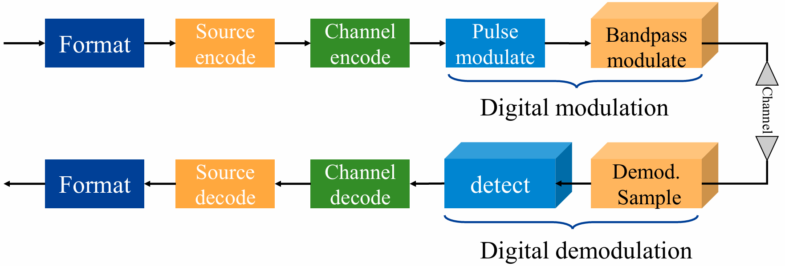

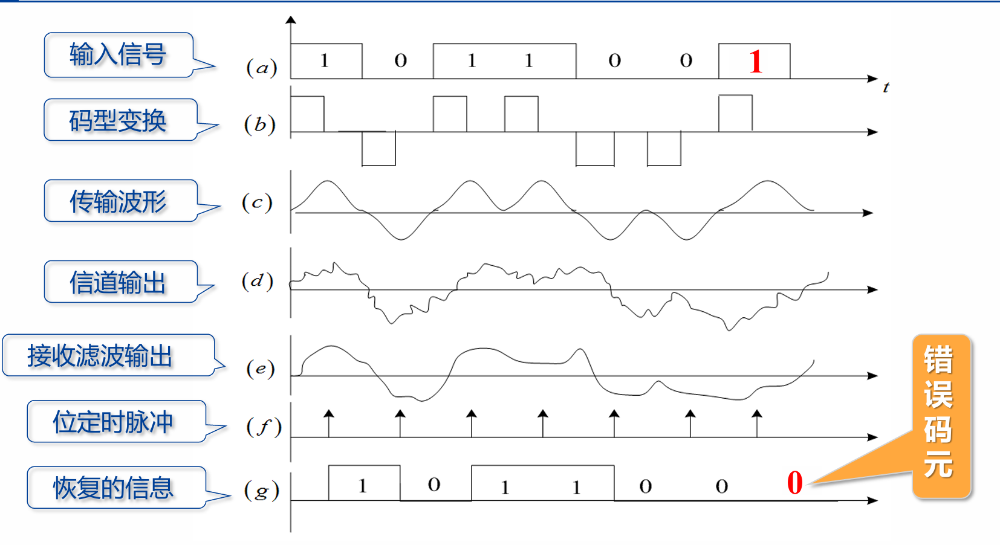

各模块核心功能：
| 模块 | 核心作用 |
|------|----------|
| 发送滤波器（信道信号形成器） | 将原始基带信号转换为适配信道传输的波形，匹配信道、减少码间串扰、利于同步提取 |
| 传输信道 | 基带信号传输通道，引入噪声与非理想特性畸变 |
| 接收滤波器 | 滤除带外噪声，对信道特性均衡，输出利于抽样判决的波形 |
| 抽样判决器 | 对接收波形在特定时刻抽样，与门限比较判决，再生原始基带信号 |
| 同步提取 | 提取抽样用的位定时脉冲，保证判决时刻准确 |

### 1.3 常用数字基带信号波形
课件中6类核心波形，重点关注特性与工程应用场景：
1.  **单极性非归零波形（NRZ）**
    - 特点：极性单一，0对应0电平，1对应正电平，有直流和低频分量
    - 应用：设备内部、数字调制器中
2.  **双极性非归零波形（NRZ）**
    - 特点：0对应负电平，1对应正电平，等概时无直流分量，抗干扰能力强
    - 应用：RS-232C接口标准、数字调制器中

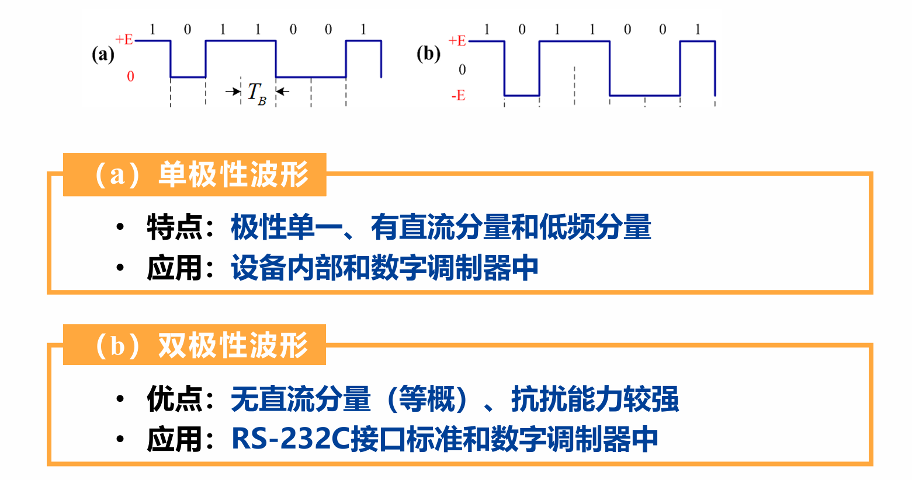

3.  **单极性归零码（RZ）**
    - 特点：高电平持续时间小于码元周期，常用半占空码（占空比50%），可直接提取位定时信号
    - 应用：同步时钟提取的过渡码型

4.  **双极性归零码**
    - 特点：兼具双极性和归零码特性，易识别码元起止时刻，便于同步

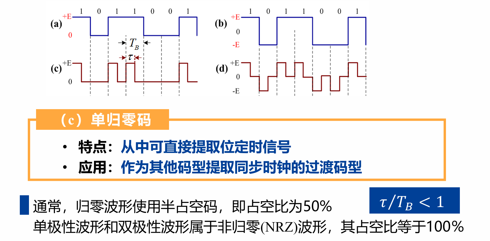
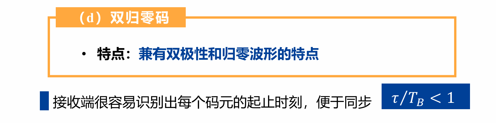

5.  **差分波形（相对码波形）**
    - 特点：用相邻码元电平的跳变/不变表示信息，分为传号差分（1跳变、0不变）、空号差分（0跳变、1不变）
    - 优点：消除设备初始状态不确定性带来的影响
6.  **多电平波形（多进制波形）**
    - 特点：一个脉冲携带多个比特信息，例：四电平波形00→+3E、01→+E、10→-E、11→-3E
    - 优点：码元速率固定时，传信率更高
    - 应用：高速数据传输系统

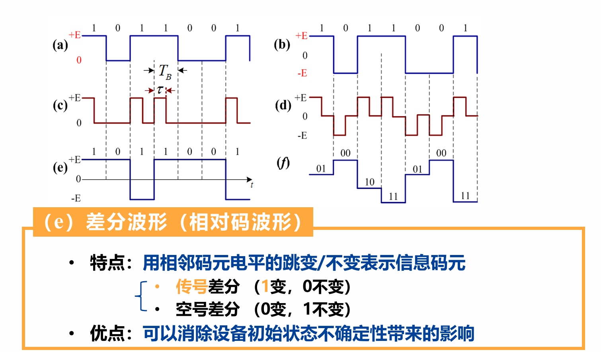
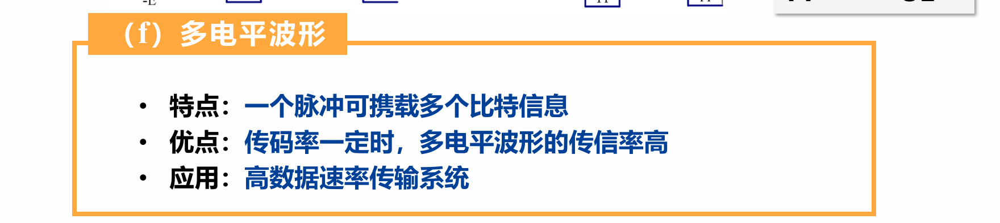

### 1.4 数字基带信号的数学表达式
若各码元波形相同、取值不同，基带信号可表示为随机脉冲序列：

$$s(t) = \sum_{n=-\infty}^{\infty} a_n g(t-nT_B)$$

- $a_n$：**第n个码元的电平取值（随机量）**
- $g(t)$：单码元的脉冲波形（如矩形脉冲、升余弦脉冲），对应第1章的$g_T(t)$，$0 < t < T$，$T$是码元持续时间。
- $T_B$：码元持续时间（码元周期），对应第1章的$T_s$

!!! notes "这个东西就是我一直疑惑的数字序列在硬件中长什么样的问题，原来还是转换为连续信号，一个码元对应持续一定时间$T_B$的脉冲波形"

通用随机序列表达式：

$$s(t)=\sum_{n=-\infty}^{\infty} s_n(t), \quad s_n(t)=\begin{cases}g_1(t-nT_B), & 以概率P出现 \\ g_2(t-nT_B), & 以概率(1-P)出现\end{cases}$$

!!! question "为什么数字序列也会是随机的？"
    数字序列还没有被调制发射、噪声没有介入，为什么课件说数字序列和基带信号也是随机的呢？
    
    要理解这个问题，我们需要做一个**视角的转换**。在通信原理中，我们说数字序列是“随机的”，并不是说它是一堆乱码，而是基于**信息论（Information Theory）**和**系统设计者**的角度出发的。

    通信的鼻祖克劳德·香农（Claude Shannon）提出过一个伟大的概念：**信息，就是用来消除不确定性的东西。**

    *   **如果数据不随机（可预测）：** 假设你要发的数据是永远重复的 `1010101010...`，或者接收端早就知道你要发什么。既然接收端都能猜出来，那你其实**根本就不需要发这段数据**，这段数据携带的信息量是 **0**。
    *   **如果数据是随机的（不可预测）：** 正是因为接收端不知道下一个比特是 `0` 还是 `1`（对接收端来说是随机的、未知的），当你真正把这个 `0` 或 `1` 传过去时，接收端才获得了“信息”。

    因此，**真正有价值、需要传输的数据，在被接收到之前，对接收端而言必定表现出极强的随机性（不可预测性）。**

    作为系统设计者，我们不能针对某一个特定的文件去设计系统。我们只能认为：**输入进来的数据流 $\{a_n\}$ 是一抛硬币产生的结果。** 每一个码元是取 `+E` 还是 `-E`，服从某种概率分布（比如各占 50%）。
    
    我们是用概率论和随机过程的数学工具，来确保这个系统在**统计意义上**（不管用户传什么）都能表现良好。

---

## 二、基带信号解调与检测基础

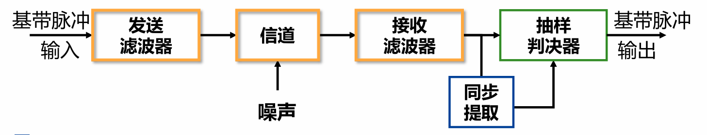


### 2.1 传输误差的两大核心来源
1.  **加性高斯白噪声（AWGN）**
    - **加性**：以叠加方式干扰信号；
    - **白**：关注频段内功率谱密度平坦；
    - **高斯**：幅度取值服从高斯分布
2.  **码间串扰（ISI）**
    - 成因：发送端、信道、接收端的非理想滤波特性，导致码元波形畸变、拖尾，对当前码元判决造成干扰

### 2.2 解调与检测的核心定义
- **解调**：恢复$t=nT$时刻采样的波形，核心是通过接收滤波器，在无码间串扰下获得最大信噪比的基带脉冲，可选均衡器补偿信道失真。
- **检测**：采样判决过程，将采样值与判决门限比较，选择最可能的发送数字符号，核心是最小化判决错误概率。

### 2.3 简化基带传输模型
$发送符号 \to s_i(t) \to 信道+噪声n(t) \to r(t)=s_i(t)*h_c(t)+n(t) \to 接收滤波h_r(t) \to z(t) \to 抽样判决(t=T) \to 估计符号$
- 理想信道下：$r(t)=s_i(t)+n(t)$，$t=T$时刻采样值$z(T)=s_i(T)+n_0(T)$

### 2.4 模块作用
**发送滤波器**，即信道信号形成器
• 作用：原始基带信号 → 适合于信道传输的基带信号。
• 目的：匹配信道，减少码间串扰，利于同步提取
**信道**：给基带信号提供传输通道
**接收滤波器**
• 作用：滤除带外噪声，对信道特性均衡
• 目的：使输出的基带波形有利于抽样判决
**抽样判决器**
• 作用：对接收滤波器的输出波形进行抽样判决
• 目的：确定发送的信码序列，再生基带信号
**同步提取**
• 作用：提取用于抽样的位定时脉冲

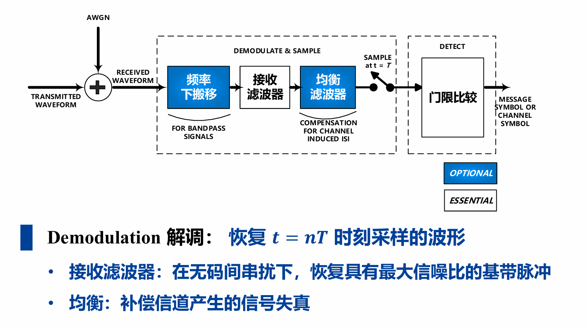
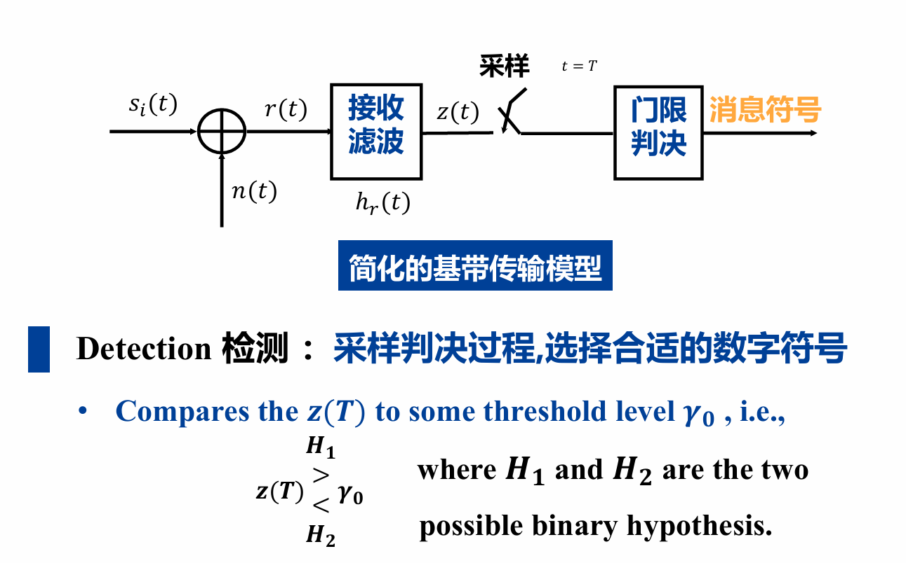

---

## 三、信号与噪声核心模型

### 3.1 信号的表示

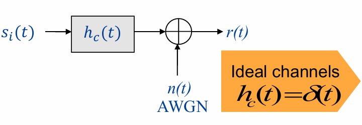

#### 3.1.1 二进制发送信号
对于一个码元：\( s_i(t) \) 表示**第 \( i \) 个码元在时域上的发送波形**。

$$s_{i}(t)=\left\{\begin{array}{ll}
s_{1}(t) \quad 0 \leq t \leq T & \text { for a binary } 1 \\
s_{2}(t) \quad 0 \leq t \leq T & \text { for a binary } 0
\end{array}\right.$$

- \( s_1(t) \) 和 \( s_2(t) \) 是两个不同的**基带脉冲波形**，用来分别代表二进制“1”和“0”。
- 它们是在一个码元周期 \( T \) 内定义的确定信号，是**单个码元的信号波形**，是承载“1”或“0”信息的物理载体。
- 最常见的例子：
  - 单极性NRZ码：\( s_1(t) = A \)（恒定正电平），\( s_2(t) = 0 \)（零电平）；
  - 双极性NRZ码：\( s_1(t) = +A \)，\( s_2(t) = -A \)；
  - 也可以是更复杂的成形脉冲，如升余弦滚降脉冲，以减少码间串扰。


#### 3.1.2 二进制接收信号

$$r(t)=s_i(t)*h_c(t)+n(t)\quad i=1,2$$

#### 3.1.3 理想二进制传输

$$r(t)=s_i(t)+n(t)\quad i=1,2$$

其中$n(t)$为加性噪声信号。在$t=T$时刻接收信号可表示为：

$$z(T)=s_i(T)+n_0(T)\ i=1,2$$

**若$n_0$是均值为0的高斯随机变量**，**则$z_1$和$z_2$分别是均值为$a_1$和$a_2$的高斯随机变量**。

!!! note "通信系统接收端的工作机制是：平时不管，只在 $t=T$ 这一瞬间做决定（抽样判决）。"

### 3.2 高斯白噪声（AWGN）数学模型

高斯噪声是一个随机过程：
在时域上，任意时刻的噪声值都是一个随机变量
在频域上，噪声的功率谱密度是一个常数（平坦的），即在所有频率上噪声功率相同。

1.  **功率谱密度**
    双边功率谱：$G_n(f)=\frac{N_0}{2} \ \text{watts/hertz}$
    单边功率谱：$G_n(f)=N_0$
    - $N_0$为噪声单边功率谱密度，是通信系统核心噪声参数
2.  **自相关函数**
    
    $$R_n(\tau)=\mathscr{F}^{-1}\{G_n(f)\}=\frac{N_0}{2}\delta(\tau)$$
    
    - 时域上不同时刻的噪声值互不相关，理想白噪声为理想随机过程
3.  **概率密度函数**
    均值为0的高斯噪声：
    
    $$P(n_0)=\frac{1}{\sigma_0 \sqrt{2\pi}} exp\left[-\frac{1}{2}\left(\frac{n_0}{\sigma_0}\right)^2\right]$$
    
    接收采样值$z(T)$的条件概率密度（发送$s_1/s_2$时）：

    $$\begin{aligned} p(z|S_1) & =\frac{1}{\sigma_0 \sqrt{2\pi}} exp\left[-\frac{1}{2}\left(\frac{z-a_1}{\sigma_0}\right)^2\right] \\ \quad p(z|S_2) &=\frac{1}{\sigma_0 \sqrt{2\pi}} exp\left[-\frac{1}{2}\left(\frac{z-a_2}{\sigma_0}\right)^2\right]\end{aligned}$$

    - $a_1、a_2$为发送$s_1、s_2$时的信号采样幅值

更详细的解释可以看：[噪声的数学模型-pro](./noise-pro.md)

### 3.3 判决

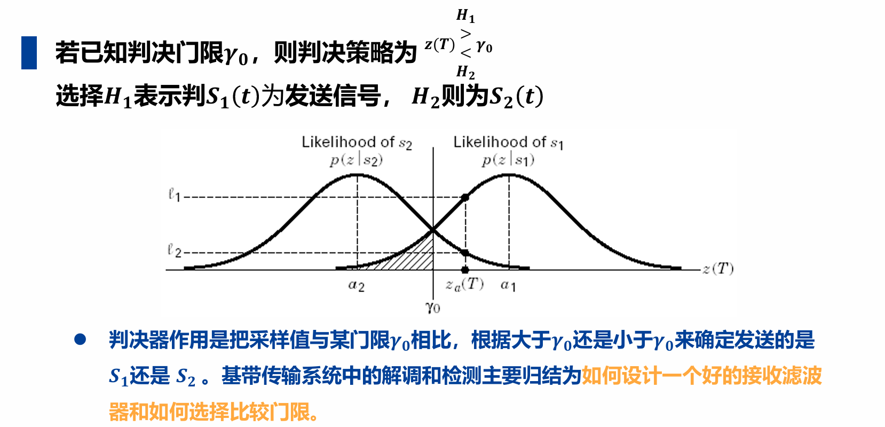

#### 3.3.1 符号解读
先把每个符号对应到通信的实际场景，避免纯数学的抽象感，所有符号都和你之前学的二进制发送信号、高斯噪声完全衔接：

| 符号 | 完整名称 | 通俗物理意义（结合通信场景） |
|------|----------|--------------------------------|
| $s_1(t)$ | 二进制1对应的发送波形 | 发送端要传**二进制1**时，在一个码元周期$T$内输出的基带波形，无噪声时，接收端抽样值为$a_1$（比如双极性码的+1V、单极性码的+3.3V） |
| $s_2(t)$ | 二进制0对应的发送波形 | 发送端要传**二进制0**时，在一个码元周期$T$内输出的基带波形，无噪声时，接收端抽样值为$a_2$（比如双极性码的-1V、单极性码的0V） |
| $H_1$ | 假设1 | 「接收端认为：当前码元发送的是$s_1(t)$（二进制1）」这个判断，是统计里的「假设检验」的简写 |
| $H_2$ | 假设2 | 「接收端认为：当前码元发送的是$s_2(t)$（二进制0）」这个判断，和$H_1$是互斥的二选一 |
| $T$ | 码元周期 | 和你之前学的$T_s/T_B$完全一致，是一个二进制码元的持续时间，$t=T$就是**最佳抽样时刻**（匹配滤波器输出信噪比最大的时刻） |
| $z(T)$ | 抽样时刻的接收信号值 | 接收滤波器输出的信号，在$t=T$这个最佳时刻的抽样值，是「发送的理想信号+高斯噪声」的叠加，公式为$z(T)=a_i + n_0$（$a_i$是$a_1$或$a_2$，$n_0$是高斯噪声的抽样值），是我们要判决的「原始数据」 |
| $\gamma_0$（伽马0） | 判决门限（阈值） | 这页PPT的核心！是接收端提前定好的**「分界线/标尺」**：抽样值超过这个线，就判为1；低于这个线，就判为0。它的取值直接决定判决的正确率（误码率） |
| $p(z\|s_1)$ | 似然函数（发$s_1$的条件概率密度） | 通俗讲：**已知发送端发的是$s_1$（二进制1）的前提下，收到的抽样值$z(T)$等于某个数的概率大小**。因为噪声是高斯分布，所以它是一条以$a_1$为均值的高斯钟形曲线（图里右侧的曲线） |
| $p(z\|s_2)$ | 似然函数（发$s_2$的条件概率密度） | 同理：**已知发送端发的是$s_2$（二进制0）的前提下，收到的抽样值$z(T)$等于某个数的概率大小**。是以$a_2$为均值的高斯钟形曲线（图里左侧的曲线） |
| $a_1$、$a_2$ | **无噪声的理想抽样值** | 发送$s_1$/$s_2$时，没有任何噪声的情况下，接收端在$t=T$时刻的理想抽样值，是两条高斯曲线的**峰值位置**（均值） |
| $z_a(T)$ | 当前码元的实际抽样值 | 这一时刻，接收端实际拿到的、带噪声的抽样值，是我们要拿去和$\gamma_0$做比较的「待测数」 |
| $\ell_1$、$\ell_2$ | 当前抽样值的似然值 | 对应$z_a(T)$这个数，在两条似然曲线上的取值：$\ell_1=p(z_a\|s_1)$，$\ell_2=p(z_a\|s_2)$，代表这个抽样值来自$s_1$/$s_2$的可能性大小 |

#### 3.3.2 公式解读：

$$z(T) \underset{H_2}{\overset{H_1}{\gtrless}} \gamma_0$$

1.  **如果$z(T) > \gamma_0$**：我们就选择假设$H_1$，也就是**判决当前码元发送的是$s_1(t)$（二进制1）**
2.  **如果$z(T) < \gamma_0$**：我们就选择假设$H_2$，也就是**判决当前码元发送的是$s_2(t)$（二进制0）**

#### 3.3.3 高斯曲线图解读

**1. 坐标轴的含义**
- **横轴$z(T)$**：**接收端抽样值的大小**，从左到右数值越来越大
- **纵轴**：条件概率密度$p(z|s)$，数值越高，代表这个抽样值出现的可能性越大

**2. 两条高斯曲线的物理意义**
- **左侧曲线$p(z|s_2)$**：发送二进制0时，抽样值的分布
  - 峰值在$a_2$：因为噪声均值为0，所以发0时，最可能收到的就是$a_2$附近的值，离$a_2$越远，出现的概率越低
- **右侧曲线$p(z|s_1)$**：发送二进制1时，抽样值的分布
  - 峰值在$a_1$：发1时，最可能收到$a_1$附近的值
- 为什么两条曲线形状完全一样？因为加性噪声的方差是固定的，和发送的信号无关，只是均值随发送的$a_1/a_2$左右平移。

**3. 曲线重叠的核心原因：噪声导致的误码根源**
两条曲线有重叠区域，这是数字通信误码的**唯一根源**：
- 发送1时，噪声可能是很大的负值，导致抽样值$z(T)$落到$a_2$附近（比如发+1V，噪声-1.5V，收到-0.5V）
- 发送0时，噪声可能是很大的正值，导致抽样值$z(T)$落到$a_1$附近（比如发-1V，噪声+1.5V，收到+0.5V）
- 重叠区域就是「可能判错的区域」，图里的阴影部分，就是**发送0、但抽样值超过门限，被判成1**的误码概率。

**4. 判决门限$\gamma_0$的作用：划分判决区域**
门限$\gamma_0$把横轴切成了两个互斥的区域：
- $\gamma_0$**右侧**：判为1的区域（$H_1$区域）
- $\gamma_0$**左侧**：判为0的区域（$H_2$区域）

**5. 图里$z_a(T)$的判决逻辑**
图里的$z_a(T)$在$\gamma_0$的右侧，按照规则判为$H_1$（二进制1），这个判决是合理的：
- 这个点对应的$\ell_1 > \ell_2$，也就是「这个抽样值来自1的概率，远大于来自0的概率」
- 哪怕它离$a_1$还有距离，我们依然选概率更大的那个结果，这就是最大似然判决的核心思想。

### 3.4 系统核心性能指标：$E_b/N_0$
通信系统抗噪声能力的核心表征，定义为**每比特信号能量$E_b$与噪声单边功率谱密度$N_0$的比值**，是衡量系统接收性能的黄金指标。

**(1) 核心公式：**

$$\frac{E_b}{N_0} = \frac{ST_b}{N/W} = \frac{S/R_b}{N/W} = \frac{S}{N}\left(\frac{W}{R_b}\right)$$

$S$：信号功率，$N$：噪声功率，$W$：系统带宽，$R_b$：信息比特率，$T_b=1/R_b$：比特周期

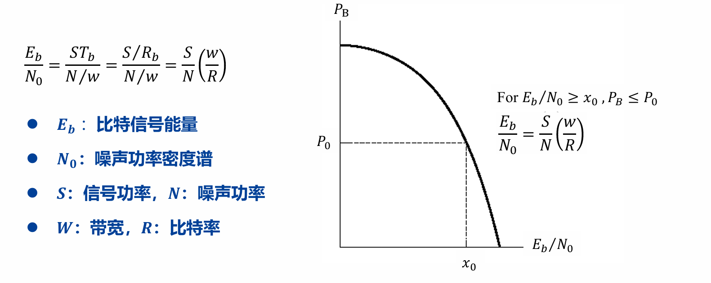

**(2) 与信噪比SNR的关系：**
   
$$SNR = \frac{S}{N} = \frac{E_b}{N_0} \cdot \frac{R_b}{W}$$

**(3) 物理意义：** 系统达到指定误比特率$P_B$时，所需的$E_b/N_0$越低，系统接收性能越好。

---

## 四、匹配滤波器（最佳接收核心）
匹配滤波器是**AWGN信道下，以最大输出信噪比为准则的最佳接收滤波器**，是数字通信接收机的核心模块，也是VLSI实现的关键单元。

### 4.1 最佳接收准则
1.  **最大输出信噪比准则**：使输出信号在判决时刻$t=T$的**瞬时功率与噪声平均功率之比达到最大**
2.  **最小错误概率准则**：使白噪声环境下的判决错误概率最小
    - 两个准则在AWGN信道下完全等价

### 4.2 匹配滤波器的核心定义
对于持续时间为$0≤t≤T$的信号$s(t)$，其匹配滤波器的冲激响应为：

$$h(t)=\begin{cases}s(T-t), & 0≤t≤T \\ 0, & 其他\end{cases}$$

- 物理意义：匹配滤波器的冲激响应是发送信号$s(t)$的**时域反转+时移**
- 核心性质：信号$s(t)$受AWGN干扰时，**通过其匹配滤波器，可在$t=T$时刻获得最大输出信噪比**，最大信噪比为：
   
$$\left(\frac{y_{s}(T)^2}{E\left[y_{n}(T)^2\right]}\right)_{\text{max}}=\frac{2E}{N_0}$$
   
   $E$为信号$s(t)$的能量，与波形形状无关
- 该性质的证明见：[匹配滤波器输出最大信噪比证明](./matched-filter.md)


!!! question "为什么选择 $t=T$ 时刻作为判决时刻？"
    可以把发送信号想象成**水龙头开闸放水，放了整整 $T$ 秒钟**。而接收端的匹配滤波器，就是一个**用来接水的水桶**。<br>
    **如果在 $t < T$ 时刻抽样（比如 $t=0.5T$）**：
    水龙头才开了一半，水还没放完。你这个时候就跑去看桶里有多少水，显然你只收集到了信号的**部分能量**，没有把信号的潜力榨干。<br>
    **如果在 $t = T$ 时刻抽样**：
    水龙头**刚刚好**关上的那一瞬间！此时，属于这个码元的所有“有用能量”已经全部流进了桶里，一滴都没浪费。**此时累积的信号能量达到绝对的最大值。**<br>
    **如果在 $t > T$ 时刻抽样（比如 $t=1.5T$）**：
    水早就停了，你多等了0.5秒。这0.5秒里，桶里不会增加任何有用的水（信号），但天空中一直在下着灰尘（信道里的高斯白噪声）。你等得越久，混入的噪声就越多，导致**信噪比反而下降**。甚至，此时下一个水龙头（下一个码元）可能已经打开，脏水（码间串扰）也流进来了。<br>
    **结论：** $t=T$ 是**恰好收集完当前码元所有能量的黄金时刻**。

### 4.3 匹配滤波器的相关器实现
匹配滤波器在$t=T$时刻的输出，等价于接收信号$r(t)$与发送信号$s(t)$的互相关运算：

$$z(T) = R_{rs}(T)$$

!!! tip "注：互相关的定义"
    互相关是两个信号之间的相似度度量，定义为：
    
    $$R_{xy}(\tau) = \int_{-\infty}^{\infty} x(t) y(t+\tau) dt$$

证明：

$$\begin{aligned} z(T) & =\int_{-\infty}^{\infty} r(\tau) h(T-\tau) d\tau \\ & =\int_{-\infty}^{\infty} r(\tau) s(\tau) d\tau \\ & =R_{rs}(T)\end{aligned}$$

- 工程意义：**VLSI实现中，相关器比时域滤波器更易数字实现，是匹配滤波器的常用硬件实现方式**
- 二进制最佳接收机：可设计为$s_1(t)$和$s_2(t)$两路匹配滤波器的差值，$z(T)>0$判为$s_1$，$z(T)<0$判为$s_2$

### 4.4 典型示例
余弦脉冲信号：$s(t)=\begin{cases}cos2\pi f_0 t, & t\in[0,T] \\ 0, & 其他\end{cases}$
- 匹配滤波器冲激响应：$h(t)=cos2\pi f_0 (T-t), \ 0≤t≤T$
- 输出峰值在$t=T$时刻，信噪比达到最大值

理解：假设 $r(t) = s(t)$，则：

$$\begin{aligned}
s_o(t) & =\int_{-\infty}^{+\infty}s(\tau)h(t-\tau)d\tau \\
 & =
\begin{cases}
\frac{t}{2}\cos2\pi f_0t & 0\leq t<T \\
\frac{2T-t}{2}\cos2\pi f_0t & T\leq t<2T \\
0 & \text{其它} & 
\end{cases}
\end{aligned}$$

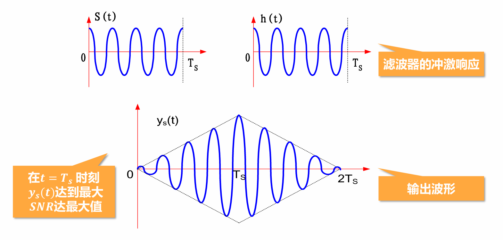

### 4.5 基于匹配滤波器的接收机
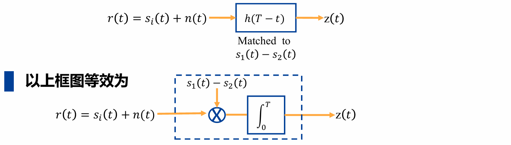

$$z(T)=\int_{0}^{T} r(t)[s_{1}(t)-s_{2}(t)]dt = \int_{0}^{T} r(t)s_{1}(t)dt - \int_{0}^{T} r(t)s_{2}(t)dt$$

- 当输入为$s_{1}(t)+n(t)$时，输出信号值大于零，判$s_{1}(t)$出现；
- 当输入为$s_{2}(t)+n(t)$时，输出信号值小于零，判$s_{2}(t)$出现。
---

## 五、高斯噪声干扰下的二进制信号检测
### 5.1 核心检测准则
#### 5.1.0 先验概率

设M个信号为 $s_m(t), m = 1,2,\cdots,M$，相应的先验概率为 $p(s_m)$。
如果我们没有收到 $r(t)$，则我们总是估计 $p(s_m)$ 最大的那个信号为最可能被发送。 
如果我们收到了信号：

#### 5.1.1 最大后验概率准则（MAP）
选择使后验概率$p(s_m|r)$最大的发送信号$s_m$作为判决结果，即：

$$m_{MAP}=arg\max_{m}\{p(s_m|r)\} \Leftrightarrow arg\max_{m}\{p(r|s_m)\cdot p(s_m)\}$$

- 核心：结合信号先验概率$p(s_m)$和似然函数$p(r|s_m)$做判决，是理论上的最优准则
- $p(s_m|r) = \frac{p(r|s_m) \cdot p(s_m)}{p(r)}$

#### 5.1.2 最大似然准则（ML）
当发送信号先验等概时（$p(s_m)=1/M$），**MAP准则等价于ML准则，选择使似然函数$p(r|s_m)$最大的信号**：

$$m_{ML}=arg\max_{m}\{p(r|s_m)\}$$

!!! question "理解：为什么等价？"
    $$\begin{aligned}
    m_{MAP} &= arg\max_{m}\{p(r|s_m) \cdot p(s_m)\}\\ &= arg\max_{m}\{p(r|s_m) \cdot \frac{1}{M}\}\\ &= arg\max_{m}\{p(r|s_m)\} = m_{ML}
    \end{aligned}$$

- 似然函数：信号$s_i$的似然函数u定义为条件概率密度函数$P(z|s_i)$
- AWGN信道下，ML准则等价于**最小距离准则**：选择与接收信号欧式距离最小的发送信号
- 工程应用：先验概率未知时，通常采用ML准则，是最常用的检测方式

#### 5.1.3 与最小距离准则的关系

由于对数函数的单调性，所以最大后验概率准则（MAP）也等价于：

$$\arg \max_{m} \{p(s_m|r)\} \Leftrightarrow \arg \max_{m} \{\ln[p(s_m|r)]\}$$

$$\Leftrightarrow \arg \max_{m} \{\ln p(s_m) + \ln p(r|s_m)\}$$

由

$$\begin{aligned}
p(r|s_m) & = \frac{1}{(\pi N_0)^{N/2}} \exp\left\{-\sum_{i=1}^{N}(r_i - s_{mi})^2 / N_0\right\} \\ & = \frac{1}{(\pi N_0)^{N/2}} \exp\{-\|r - s_m\|^2 / N_0\}
\end{aligned}$$

$$\ln p(r|s_m) = \frac{-N}{2} \ln(\pi N_0) - \frac{1}{N_0} \sum_{i=1}^{N}(r_i - s_{mi})^2$$

最大后验概率准则为：

$$\begin{aligned} m_{MAP} &= \arg \max_{m} \left\{ \ln p(s_m) - \frac{N}{2} \ln(\pi N_0) - \frac{1}{N_0} \sum_{i=1}^{N}(r_i - s_{mi})^2 \right\} \\ & = \arg\max_m\left\{\ln p\left(\mathbf{s}_m\right)-\frac{1}{N_0}||\mathrm{r}-\mathrm{s}_m||^2\right\} \end{aligned}$$ 

最大似然概率准则（$ML$）：

$$m_{ML} = \arg\max_{m} \left\{ p(\mathbf{r} \mid \mathbf{s}_m) \right\}$$

若记 $D_m \triangleq \| \mathbf{r} - \mathbf{s}_m \|^2$ $\Leftrightarrow \arg\max_{m} \left\{ -\frac{1}{N_0} \| \mathbf{r} - \mathbf{s}_m \|^2 \right\}$
**最大似然概率准则（$ML$）等价于最小距离准则**

### 5.1.4 最大似然准则的理解

**最大似然判决准则**：若一致信号的先验概率$P(s_1)$和$P(s_2)$，则信号的最大似然判决准则定义为：


$$\frac{P(z|s_1)}{P(z|s_2)} \underset{H_2}{\overset{H_1}{\gtrless}} \frac{P(s_2)}{P(s_1)}$$

证明：

信号模型：$z(t) = s_i(t)+n(t), i=1,2$
观测值的条件概率密度函数：
$f_{s_1}(z) = \frac{1}{\sqrt{2\pi}\sigma_n}\exp{\{-\frac{1}{n_0}\int_0^{T_s}[z(t)-a_1]^2dt\}}$
$f_{s_2}(z) = \frac{1}{\sqrt{2\pi}\sigma_n}\exp{\{-\frac{1}{n_0}\int_0^{T_s}[z(t)-a_2]^2dt\}}$

假设选取的判决门限是$z_0^{\prime}$，那么发送$s_1(t)$和$s_2(t)$的判决错误概率分别是：
$P_{s_1}(s_2)=\int_{z_0^{\prime}}^{+\infty} f_{s_1}(z) dz$
$P_{s_2}(s_1)=\int_{-\infty}^{z_0^{\prime}} f_{s_2}(z) dz$
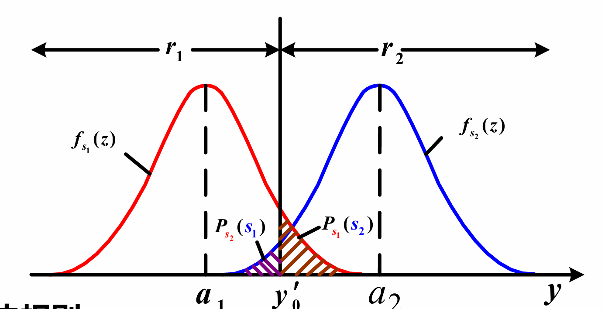

平均误码率：

$$\begin{aligned}P_e & = P(s_1)P_{s_1}(s_2) + P(s_2)P_{s_2}(s_1)\\ & = P(s_1)\int_{z_0^{\prime}}^{+\infty}f_{s1}(z)dz + P(s_2)\int_{-\infty}^{z_0^{\prime}}f_{s2}(z)dz\end{aligned}$$

令其导数等于零：

$$\frac{\partial P_e}{\partial z_0^{\prime}} = -P(s_1)f_{s_1}(z_0^{\prime}) + P(s_2)f_{s_2}(z_0^{\prime}) = 0$$

因此：

$$\frac{f_{s_1}(z_0^{\prime})}{f_{s_2}(z_0^{\prime})} = \frac{P(s_2)}{P(s_1)}$$

- 当信号的先验概率相等时，判决规则简化为：$P(z_a|s_1) > P(z_a|s_2)$ 则判定为$s_1$，反之判定为$s_2$，即最大似然准则（ML）
- 对于高斯噪声干扰的信道，最佳判决门限可解的为：$z(T)\underset{H_2}{\overset{H_1}{\gtrless}}\frac{a_1+a_2}{2}=\gamma_0$

### 5.2 最佳判决门限
#### 5.2.1 通用最佳门限
通过**最小化平均误码率求导**可得，最佳判决门限$\gamma_0$满足：

$$\frac{p(\gamma_0|S_1)}{p(\gamma_0|S_2)} = \frac{P(S_2)}{P(S_1)}$$

**误码率**定义：

$$P_B = P(e|s_1)P(s_1) + P(e|s_2)P(s_2)=P(H_2|s_1)P(s_1) + P(H_1|s_2)P(s_2)$$

#### 5.2.2 典型场景门限
**(1) 二进制双极性基带信号**

$s(t)=\begin{cases}+a+n(t), & 发1 \\ -a+n(t), & 发0\end{cases}$

最佳判决门限(令$\frac{\partial P_B}{\partial \gamma_0}=0$可以解得)：

$$\gamma_0 = \frac{\sigma_n^2}{2a} ln\left(\frac{P(S_2)}{P(S_1)}\right)$$

**先验等概时**（$P(S_1)=P(S_2)=0.5$），$\gamma_0=0$，是最常用的判决门限

**(2) 二进制单极性基带信号**

**先验等概时**，最佳门限$\gamma_0=\frac{a_1+a_2}{2}$（$a_1$为1的幅值，$a_2$为0的幅值）

### 5.3 误码率计算
平均误码率通用公式：

$$P_B = P(e|S_1)P(S_1) + P(e|S_2)P(S_2)$$

$P(e|S_1)$：发$S_1$错判为$S_2$的概率，$P(e|S_2)$：发$S_2$错判为$S_1$的概率

**先验等概二进制双极性信号（AWGN信道）**：

$$P_B = = Q\left(\frac{a_1-a_2}{2\sigma_0}\right)$$

- $Q(x) \approx \frac{1}{\sqrt{2\pi}}\int_x^{\infty} e^{-t^2/2} dt$ 为互补误差函数，单调递减，$x$越大，误码率越低


---

## 六、码间串扰（ISI）与信道均衡
### 6.1 码间串扰基础
#### 6.1.1 ISI定义与成因
**定义：系统传输特性不理想，导致前后码元波形畸变、拖尾，对当前码元的判决造成干扰**
本质成因：信号频带有限 → 时域无限延伸 → 相邻码元在判决时刻相互叠加
定量表达式：
接收信号抽样值（$t=kT_B$）：
  
$$\begin{aligned}y(kT_B) & = d(t)*h(t) + n_R(t) \bigg|_{t=kT_B} \\ & = \sum_{\substack{n=-\infty}}^{\infty} a_n h[(k-n)T_B] + n_R(kT_B) \\ & = a_k h(0) + \sum_{\substack{n=-\infty \\ n≠k}}^{\infty} a_n h[(k-n)T_B] + n_R(kT_B)\end{aligned}$$
  
$d(t) = \sum_{n=-\infty}^{\infty}a_nh(t-nT_B)$

$a_k h(0)$：当前码元的有用信号
$\sum_{\substack{n=-\infty \\ n≠k}}^{\infty} a_n h[(k-n)T_B]$：其他码元对当前码元的串扰，即ISI
$n_R(kT_B)$：噪声采样值

#### 6.1.2 ISI的危害
- 直接导致判决错误，提升系统误码率
- 产生**误码率地板效应**：即使信噪比无限提升，误码率也无法下降到0，成为系统性能的瓶颈
   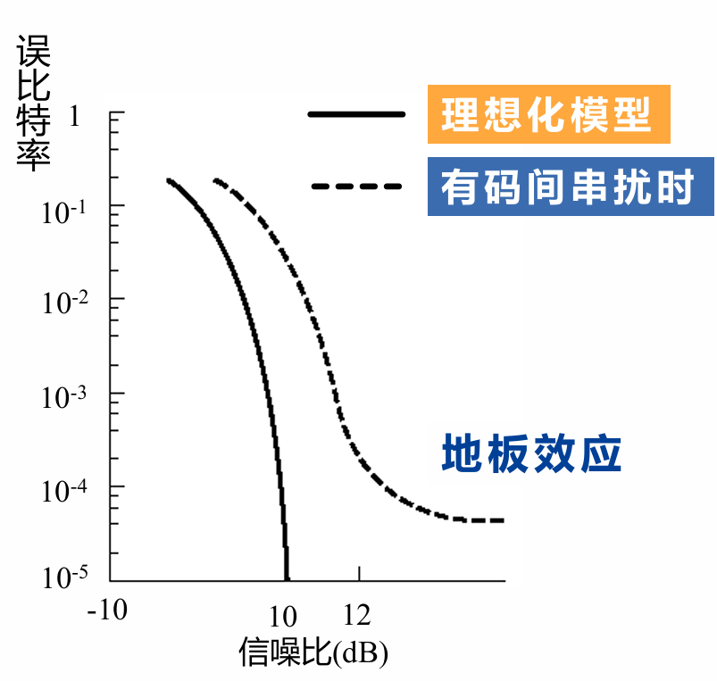

### 6.2 无码间串扰的时域条件
要完全消除抽样时刻的ISI，需满足：

$$h(kT_B)=\begin{cases}1, & k=0 \\ 0, & k为其他整数\end{cases}$$

- 物理意义：本码元在抽样时刻取最大值，其他所有码元在该抽样时刻的取值均为0，无叠加干扰

### 6.3 信道均衡滤波器
均衡器的核心作用：补偿信道的非理想特性，减小甚至消除码间串扰，是基带接收机的关键模块。
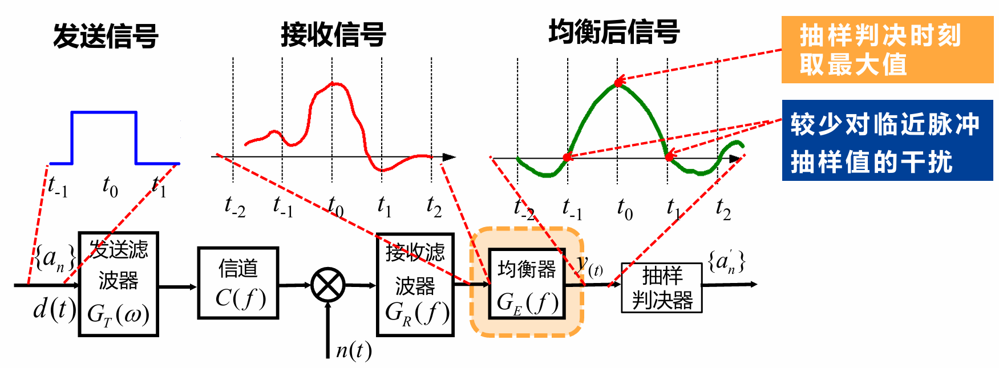

#### 6.3.1 核心实现：有限长横向滤波器
**结构**：抽头延迟线+可调系数乘法器+加法器，$2N+1$个抽头，抽头间隔为码元周期$T_B$
**输出表达式**（$t=kT_B$时刻）：
  
$$y(kT_B) = \sum_{i=-N}^{N} c_i x[(k-i)T_B]$$
  
$c_i$：第$i$个抽头的系数，$x(t)$：均衡器输入信号（接收滤波器输出）

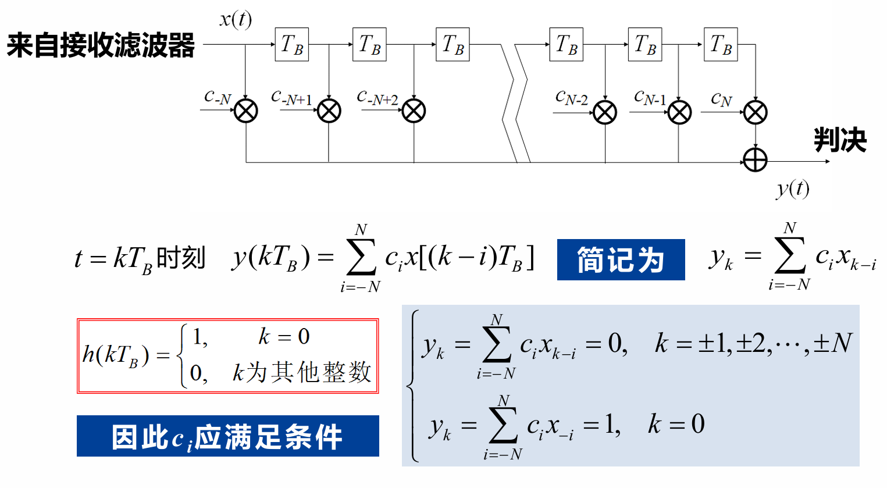

#### 6.3.2 迫零均衡器
最经典的均衡器设计方法，核心是**强制除$k=0$外，其他抽样时刻的输出均为0**，消除抽样时刻的ISI。
**抽头系数满足的方程组：**
    
$$\begin{cases} y_k = \sum_{i=-N}^{N} c_i x_{k-i} = 0, & k=±1,±2,...,±N \\ y_0 = \sum_{i=-N}^{N} c_i x_{-i} = 1, & k=0 \end{cases}$$

用矩阵表示为：

$$\begin{bmatrix}
x_0 & x_{-1} & &\cdots & & x_{-2N} \\
x_1 & x_0 & & \cdots & & x_{-2N+1} \\
\vdots & \vdots &  & \cdots \\
x_N & x_{N-1} & \cdots & x_0 & \cdots & x_{-N} \\
\vdots & \vdots & & \cdots & & \vdots \\
x_{2N} & x_{2N-1} & & \cdots & & x_0
\end{bmatrix}
\begin{bmatrix}
c_{-N} \\
c_{-N+1} \\
\vdots \\
c_0 \\
\vdots \\
c_{N-1} \\
c_N
\end{bmatrix}=
\begin{bmatrix}
0 \\
\vdots \\
0 \\
1 \\
0 \\
\vdots \\
0
\end{bmatrix}
(
\begin{bmatrix}
y_{-N} \\
\vdots \\
y_{-1} \\
y_0 \\
y_1 \\
\vdots \\
y_N
\end{bmatrix} 
)$$

**求解方式：** 由输入信号的抽样值构成托普利兹矩阵，求解线性方程组得到抽头系数$c_i$
工程特性：
- 抽头数越多，均衡效果越好，但硬件复杂度（乘法器、加法器数量）越高，需做性能-复杂度权衡
- 有限抽头数无法完全消除所有ISI，只能最小化抽样时刻的ISI

#### 6.3.3 均衡效果评价：峰值失真准则
- 输入峰值失真：$D_0 = \frac{1}{x_0} \sum_{\substack{k=-\infty \\ k≠0}}^{\infty} |x_k|$
- 输出峰值失真：$D = \frac{1}{y_0} \sum_{\substack{k=-\infty \\ k≠0}}^{\infty} |y_k|$
- 评价指标：$\frac{D}{D_0}$，比值越小，均衡效果越好

---

## 七、本章核心总结
1.  **基带传输是数字通信的基础**：无论是基带直传还是带通传输，都必先完成数字序列到基带波形的映射，基带波形设计直接决定系统传输性能。
2.  **AWGN信道下的最佳接收**：匹配滤波器实现最大输出信噪比，最大似然检测实现最小错误概率，二者共同构成最佳接收机，是VLSI数字通信接收机设计的核心框架。
3.  **码间串扰是系统性能的核心瓶颈**：非理想信道特性导致ISI，通过横向均衡器（尤其是迫零均衡器）可有效抑制ISI，需在性能和硬件复杂度间做权衡。
4.  **系统性能核心链路**：基带波形设计 → 发送/接收滤波 → 匹配滤波最佳接收 → 抽样判决 → 均衡抑制ISI，每个环节都直接影响最终的误码率性能。
5.  **VLSI实现重点**：匹配滤波器的相关器实现、均衡器的抽头系数求解与硬件映射、判决器的低复杂度设计，是本章内容的工程落地核心。