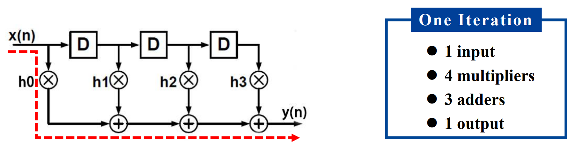
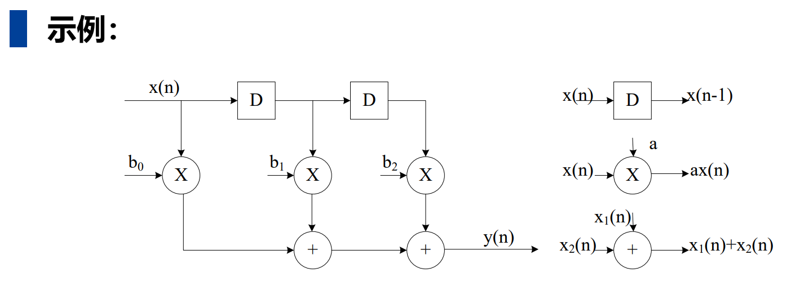
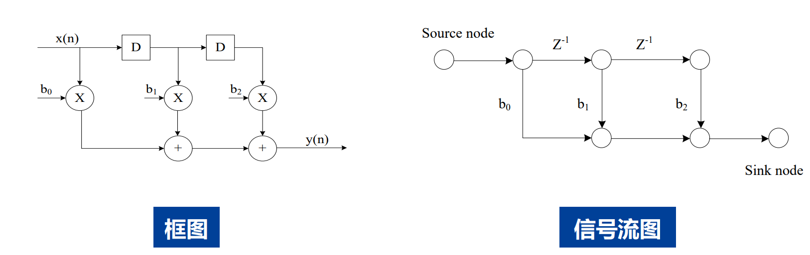
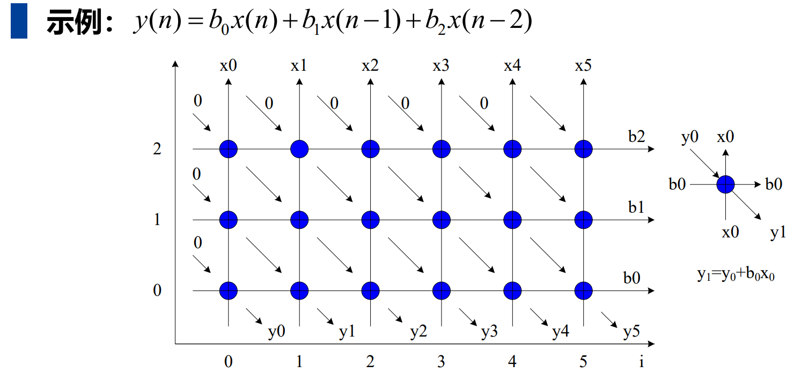

# 《VLSI数字通信原理与设计》 第三章：迭代边界 笔记

## 1. 本章主线

这一章要回答的核心问题是：**带环路（反馈）的 DSP 系统，速度极限由什么决定？**

- 对一个**具体电路结构**，时钟能打多快，先看**关键路径（Critical Path）**。
- 对一个**带反馈环路的算法/系统**，即使不断优化硬件，单次迭代也不可能无限快，它还受到**迭代边界（Iteration Bound）** 的限制。

可以先记住一句话：

> **关键路径限制“这版结构的时钟周期”；迭代边界限制“这个带环算法的迭代周期下限”。**

---

## 2. 课件页码索引（便于对照）

| 主题 | 对应页码 | 重点抓什么 |
|---|---:|---|
| 引言：为什么研究迭代边界 | p2 | 含环路系统的极限速度 |
| DSP 算法与 FIR 示例 | p4-p7 | 迭代、关键路径、结构变化 |
| 图形表示方法 | p8-p18 | 框图、SFG、DFG、DG |
| 基本概念 | p20-p24 | 路径、关键路径、环路、环路边界 |
| 迭代边界定义与性质 | p26-p28 | 关键环路、因果性、理论下限 |
| LPM 计算方法 | p29-p33 | 矩阵定义、递推、对角线取最大 |
| 三种周期关系 | p36-p37 | 采样周期、迭代周期、时钟周期 |
| 本章总结 | p38 | 会找关键路径，会算迭代边界 |

---

## 3. DSP 算法与“迭代”

### 3.1 DSP 算法的特点

课件用 FIR 滤波器举例：

\[
 y(n)=\sum_{k=0}^{N-1} h(k)x(n-k)
\]

DSP 算法通常是**持续处理输入流**的，不像普通程序那样“执行完就结束”。因此：

- **一次循环体执行** = **一次迭代（iteration）**
- **完成一次迭代所需时间** = **迭代周期（iteration period）**

### 3.2 一个直观理解

如果系统每次迭代处理一个输入样点并产生一个输出样点，那么：

- 迭代越快，系统吞吐率越高
- 但“快到什么程度”并不是只看运算器快不快
- 一旦系统里有反馈环路，就会出现**结构性速度极限**

---

## 4. DSP 算法的几种表示方法

### 4.1 框图（Block Diagram）

特点：

- 用功能块和有向边描述系统
- 有向边表示数据流方向
- 边上可以带有 0 个或多个延时单元
- 常用于从系统功能角度描述 DSP 结构

适合理解“系统做了什么”。

### 4.2 信号流图（SFG, Signal Flow Graph）

特点：

- 由**节点**和**有向边**组成
- 节点表示**计算/任务**
- 边通常表示**常数增益或延时**
- 有源节点（source node）和汇节点（sink node）

适合理解**线性数字网络结构**。

#### 转置变换（Transposition）

对 **单输入单输出（SISO）线性系统**，可以做转置变换，且**系统功能不变**：

1. 所有边方向反向
2. 交换输入和输出

这个结论在 FIR 结构变换中非常重要。

### 4.3 数据流图（DFG, Data-Flow Graph）

这是本章最关键的图模型之一。

DFG 的特点：

- **只描述一次迭代过程**
- 节点表示一次运算/任务执行
- 节点带有**计算时间**
- 有向边表示节点之间的通信关系
- 边上可带非负延迟（如 \(D\) 或 \(Z^{-1}\)）

DFG 中每条边都体现了**优先顺序约束**：

- **无延迟边**：表示**迭代内**优先关系
- **有延迟边**：表示**迭代间**优先关系

#### DFG 的粒度

- **细粒度**：节点细到加法、乘法等基本运算
- **粗粒度**：节点是滤波、FFT 等复杂功能块

#### Single-rate 与 Multi-rate

课件还区分了：

- **Single-rate DFG**：各节点速率一致
- **Multi-rate DFG**：不同节点工作速率不同

### 4.4 依赖图（DG, Dependence Graph）

特点：

- 强调算法计算间的依赖关系
- 在**脉动阵列（systolic array）** 分析里很常见

适合看“谁依赖谁”，尤其适合映射到规则阵列结构。

---

## 5. 基本概念：路径、关键路径、环路、环路边界

### 5.1 路径与关键路径

- **路径**：数据在任意两节点间沿有向边和中间节点形成的通路
- **关键路径**：所有**无延迟路径**中执行时间最长者

要点：

- 关键路径只看**无延迟链**
- 它直接决定最小时钟周期

### 5.2 迭代、迭代周期、时钟周期

- **迭代**：DFG 中所有节点各执行一次
- **迭代周期** \(T_{it}\)：**处理一个输入样点并输出一个结果所需的平均时间**
- **时钟周期** \(T_{clock}\)：电路时钟的周期，由关键路径决定

注意区分：

- **时钟周期**是硬件级节拍
- **迭代周期**是算法级吞吐时间
- 它们有时相等，有时不相等

### 5.3 环路（Loop）

**环路**：起点和终点为同一节点的有向路径。

带反馈 DSP 系统的速度分析，核心就在环路上。

### 5.4 环路边界（Loop Bound）

对于第 \(L\) 个环路，定义：

\[
T_{LoopBound,L}=\frac{T_L}{w_L}
\]

其中：

- \(T_L\)：该环路上所有节点的总计算时间
- \(w_L\)：该环路上的延时数

#### 为什么要“除以延时数”？

这是本章最容易“看懂公式、没懂含义”的地方，这里会触及到迭代边界的本质，请看如下例子：

> 更详细的解说可以参考 [迭代边界-详细讲解](./ib_full.md)

直观理解：
##### 例子 A：没有反馈的系统（FIR 滤波器，开环）
算法：$y[n] = x[n] + x[n-1]$
（当前输出 = 当前输入 + 上一个输入）

*   算 $y[1]$ 时：需要 $x[1]$ 和 $x[0]$ 相加。
*   算 $y[2]$ 时：需要 $x[2]$ 和 $x[1]$ 相加。

**思考：我能把系统加速到多快？**
答案是：**无限快（只要你有钱）！**
因为 $y[1]$ 和 $y[2]$ **互不依赖**。我可以买 100 个加法器并排放在那里，同时算 $y[1]$ 到 $y[100]$。虽然每个输出从进去到出来都要经历 10ns，但我可以**每一纳秒甚至每一皮秒吐出一个结果**（这就是流水线和并行处理的威力）。
**结论：没有反馈的系统，吞吐率没有理论上限，砸钱加硬件就能变快。**

##### 例子 B：有反馈的系统（IIR 滤波器，闭环）—— **这就是迭代边界存在的根源**
算法：$y[n] = y[n-1] + x[n]$
（当前输出 = **上一个输出** + 当前输入）

*   算 $y[1]$ 时：需要 **$y[0]$** + $x[1]$
*   算 $y[2]$ 时：需要 **$y[1]$** + $x[2]$
*   算 $y[3]$ 时：需要 **$y[2]$** + $x[3]$

**思考：现在我还能无限加速吗？**
**绝对不行！** 因为你要算 $y[2]$，就**必须**等 $y[1]$ 算完！而算 $y[1]$ 雷打不动需要 10ns。
就算你是个土豪，买了 1 万个加法器，另外 9999 个加法器也只能**干瞪眼等着**。你无法跨越时间去预知 $y[1]$ 的结果。
因此，这个系统**平均出一个点的时间（迭代周期），永远不可能低于 10ns。**

**本质理解：**
**迭代边界，就是“时光不能倒流、因果不能打破”在硬件上的体现。**
前向的数据（没有环路）可以无限流水线化、并行化；但**反馈环路里存在严格的“辈分”依赖**，长辈没生出来，晚辈就绝不可能出生。这个“等待长辈出生”的最短时间，就是性能上限（也就是迭代周期 $T_{it}$ 的下限，即迭代边界 $T_{\infty}$）。

##### 例子 C：跨步反馈系统
算法：$y[n] = y[n-2] + x[n]$

*   算 $y[2]$ 时，需要 **$y[0]$** + $x[2]$
*   算 $y[3]$ 时，需要 **$y[1]$** + $x[3]$
*   算 $y[4]$ 时，需要 **$y[2]$** + $x[4]$

你看出来区别了吗？
**$y[2]$ 和 $y[3]$ 之间没有依赖关系了！**
$y[2]$ 等的是 $y[0]$；$y[3]$ 等的是 $y[1]$。偶数项自己玩，奇数项自己玩。

这时候，如果你买 **2 个加法器**：
*   加法器 A 专门负责算偶数项：$y[0] \rightarrow y[2] \rightarrow y[4]...$ （每步耗时 10ns）
*   加法器 B 专门负责算奇数项：$y[1] \rightarrow y[3] \rightarrow y[5]...$ （每步耗时 10ns）

这两个加法器可以**完全同时工作**！
虽然每个加法器依然是每 10ns 吐出一个结果，但因为有两个系统在并行，从外部看，系统每 10ns 可以吐出 **2 个**结果。
那么**平均分摊下来，算出一个样点需要的时间就是：10ns / 2 = 5ns。**

### 5.5 一个非常重要的结论

课件 p24 特别说明：

> **两个结构可以具有相同的环路边界，但关键路径不同。**

这说明：

- **关键路径**和**环路边界**不是一回事
- 缩短关键路径并不一定改变迭代边界
- 关键路径是“局部无延迟链”的限制
- 环路边界是“反馈环整体吞吐率”的限制

---

## 6. 迭代边界（Iteration Bound）

### 6.1 定义

**迭代边界**就是所有环路边界中的最大值：

\[
T_{\infty}=\max_{L\in \mathcal{L}} \frac{T_L}{w_L}
\]

其中：

- \(\mathcal{L}\) 是系统中所有环路的集合
- 取到最大值的那个环路叫做**关键环路（critical loop）**

### 6.2 物理意义

迭代边界给出了：

> **带反馈环路 DSP 算法，其迭代周期能够达到的理论下限。**

也就是说：

\[
T_{it} \ge T_{\infty}
\]

不管你：

- 用更快的运算器
- 做更多并行
- 做更高效调度

只要算法本身的反馈依赖没有被本质改变，迭代周期都不可能低于这个下限。

### 6.3 迭代边界的特点

#### （1）环路必须含有延时元件

如果某个环路的延时数 \(w_L=0\)，那么：

\[
\frac{T_L}{0}=\infty
\]

这对应**非因果系统**，无法硬件实现。

因此：

- 可实现系统必须是**因果系统**
- 环路上必须有延时单元

#### （2）迭代边界是“所有实现方案”共同受限的下界

它不是某个结构偶然得到的值，而是：

- 带反馈算法性能的重要参数
- 描述“这个程序硬件实现后**最快能有多快**”的根本指标

#### （3）关键路径和迭代边界可能分别主导系统

- 若关键路径大，说明单拍太长，时钟打不上去
- 若迭代边界大，说明即使时钟很快，反馈迭代吞吐率仍受限

---

## 7. LPM：最长路径矩阵法（Longest Path Matrix）

这是课件给出的**迭代边界系统计算方法**。

### 7.1 基本定义

设系统中共有 \(d\) 个延时单元，记为 \(d_1,d_2,\dots,d_d\)。

构造一系列矩阵：

\[
L^{(m)},\quad m=1,2,\dots,d
\]

其中元素 \(l_{i,j}^{(m)}\) 的含义是：

> 从延时单元 \(d_i\) 到延时单元 \(d_j\) 的所有路径中，
> **恰好经过 \(m-1\) 个中间延时单元**（不含起点和终点延时）时，
> 这些路径的**最长计算时间**。

若这样的路径不存在，则：

\[
l_{i,j}^{(m)}=-1
\]

### 7.2 递推公式

课件给出的递推关系为：

\[
l_{i,j}^{(m+1)}=\max_{k\in K}\left(-1,\,l_{i,k}^{(1)}+l_{k,j}^{(m)}\right)
\]

其中 \(K\) 表示所有可能的中间延时节点索引集合。

理解方式:

- 先用一个“1 段路径” \(l_{i,k}^{(1)}\)
- 再接一个“m 段路径” \(l_{k,j}^{(m)}\)
- 看拼起来后谁最长

### 7.3 为什么只看对角线？

因为：

- \(l_{i,i}^{(m)}\) 表示从 \(d_i\) 出发又回到 \(d_i\) 的路径
- 这本质上就是一个**环路**
- 且这个环路中含有 \(m\) 个延时

所以：

\[
\frac{l_{i,i}^{(m)}}{m}
\]

就是一个环路边界。

于是：

\[
T_{\infty}=\max_{i,m}\frac{l_{i,i}^{(m)}}{m}
\]

### 7.4 LPM 计算步骤（人类计算）

#### 第 1 步：给所有延时编号

把图中的所有延时单元标成 \(d_1,d_2,\dots,d_d\)。

#### 第 2 步：写出 \(L^{(1)}\)

- 看从 \(d_i\) 到 \(d_j\) 是否存在**中间不再穿过其他延时**的路径
- 若存在，把该路径的最长计算时间填入
- 若不存在，填 \(-1\)

#### 第 3 步：递推求 \(L^{(2)},L^{(3)},\dots\)

按递推公式逐级计算，直到 \(m=d\)。

#### 第 4 步：收集所有对角线元素

把所有 \(l_{i,i}^{(m)}\) 找出来。

#### 第 5 步：分别除以 \(m\)

每个对角线元素对应一个环路边界：

\[
\frac{l_{i,i}^{(m)}}{m}
\]

#### 第 6 步：取最大值

最大者就是迭代边界：

\[
T_{\infty}
\]

### 7.5 LPM 计算时的注意点

1. **\(-1\) 表示“无路径”**，不是 0。
2. 只有**对角线元素**才直接对应环路。
3. 不是所有矩阵元素都要拿来除以 \(m\)，只看 \(l_{i,i}^{(m)}\)。
4. 关键环路不一定是“节点最多的环”，而是 \(T_L/w_L\) 最大的环。
5. 做题时不要把“关键路径”和“迭代边界”混在一起。

---

## 8. 三种周期的关系：采样周期、迭代周期、时钟周期

### 8.1 采样周期

**采样周期$T_{s}$**：输入信号相邻样点之间的时间间隔。

它主要由应用决定，例如：

- 语音
- 图像
- 通信信号

不同场景的采样周期不同。

### 8.2 迭代周期

**迭代周期$T_{\text{it}}$**：完成一次算法迭代所需的平均时间。

它取决于：

- 时钟周期
- 每次迭代需要多少个时钟
- 每次迭代产生多少输出样点

### 8.3 时钟周期

**时钟周期$T_{\text{clock}}$**：硬件电路的工作节拍。

它由**关键路径**决定。

### 8.4 实时处理条件

实时处理要求：

\[
T_{it}=T_s
\]

即：

- 系统处理一个样点的速度
- 必须跟外部输入样点到达速度匹配

### 8.5 课件中的三种情况

#### 流水线（Pipelining）

课件给出的典型情况：

\[
T_{clock}=T_{it}=T_s
\]

含义：每拍稳定推出一个结果，节拍和吞吐一致。

#### 并行处理（Parallel Processing）

- 时钟周期可以较慢
- 但通过并行硬件，整体迭代周期仍可满足采样周期

即：

- \(T_{clock}\neq T_{it}\)
- \(T_{clock}\neq T_s\)

#### 折叠（Folding）

- 用较少硬件复用完成更多计算
- 因此需要更快时钟来支撑一个迭代

同样有：

- \(T_{clock}\neq T_{it}\)
- \(T_{clock}\neq T_s\)

---

## 9. 最容易混淆的几个点

### 9.1 关键路径 vs 迭代边界

| 项目 | 关键路径 | 迭代边界 |
|---|---|---|
| 看什么 | 无延迟路径 | 所有带延迟环路 |
| 反映什么 | **单拍时钟能多快** | **单次迭代最快能多快** |
| 主要决定 | 时钟周期下限 | 迭代周期下限 |
| 是否与具体结构强相关 | 很强 | **更偏算法/反馈本质** |

一句话区分：

- **关键路径**：限制“单拍”
- **迭代边界**：限制“反馈吞吐”

### 9.2 时钟周期 vs 迭代周期

- 一个迭代可能只需 1 个时钟，也可能要多个时钟
- 所以二者**不总相等**

