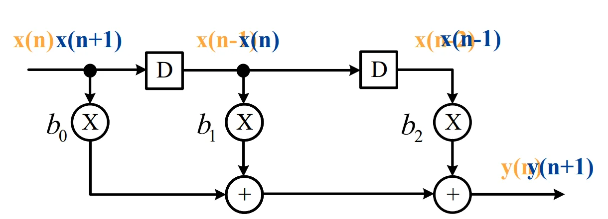
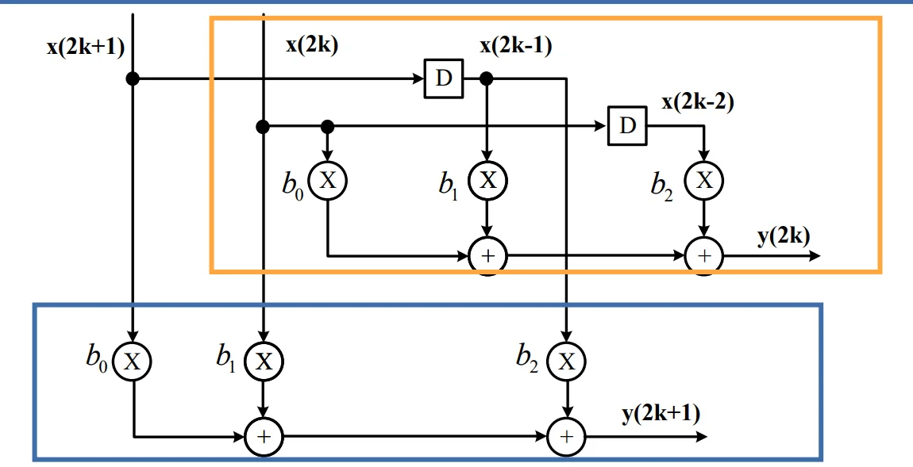
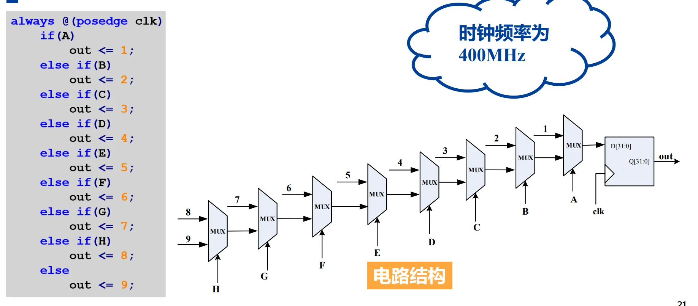
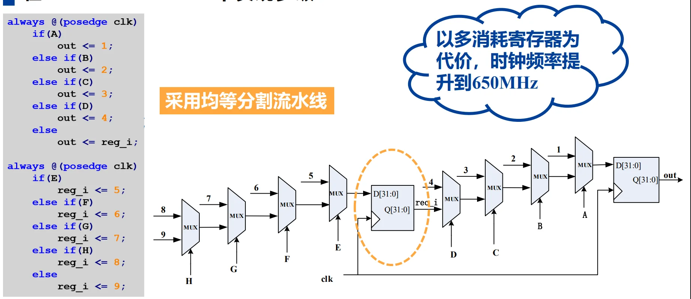
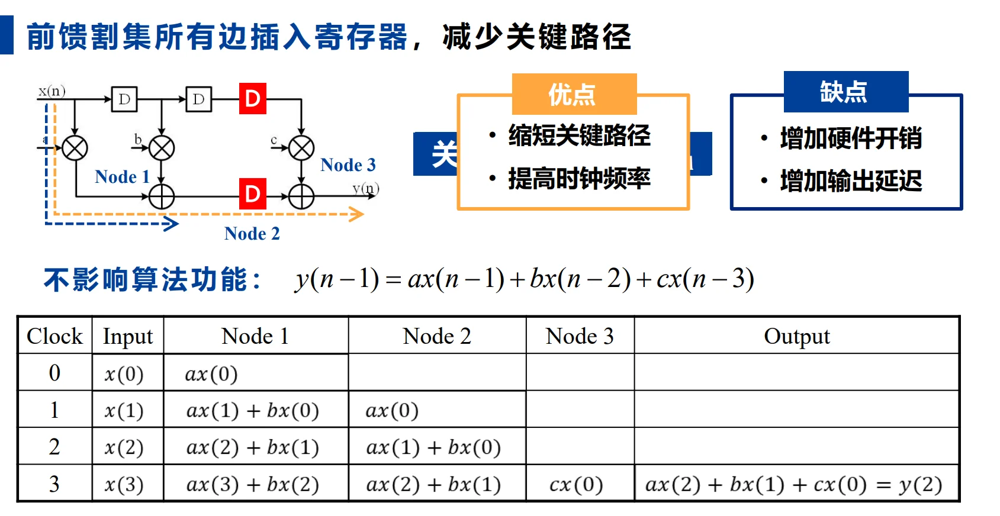
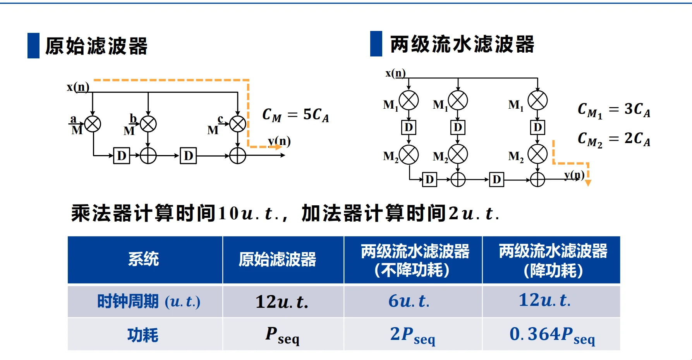
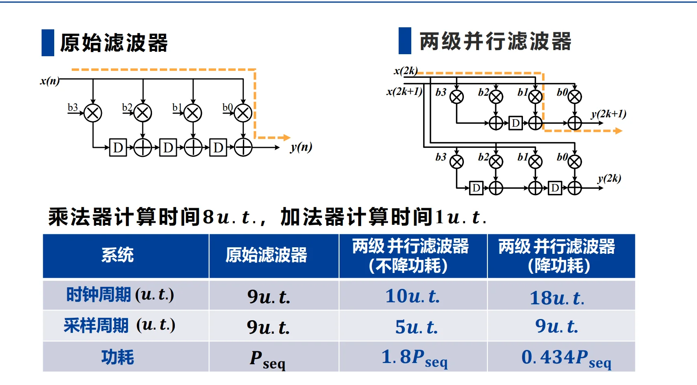

# 第四章 流水线和并行处理 

---

## 一、并行处理技术
### 1. 核心概念
并行处理技术发掘计算中的**同时性并发**，通过复制硬件资源，将单输入单输出（SISO）串行系统转换为多输入多输出（MIMO）系统，实现多任务同时计算，提升系统处理能力。

### 2. 设计案例：3-Tap FIR滤波器
以3抽头FIR滤波器 $y(2k)=b_{0}x(2k)+b_{1}x(2k-1)+b_{2}x(2k-2)$ 为例：
**(1) 未并行**



**(2) 2级并行**
将输入输出按奇偶序列拆分，时钟周期内同时处理2个样点
  ```math
  \begin{cases}
  y(2k)=b_{0}x(2k)+b_{1}x(2k-1)+b_{2}x(2k-2)\\
  y(2k+1)=b_{0}x(2k+1)+b_{1}x(2k)+b_{2}x(2k-1)
  \end{cases}
  ```


- **3级并行**：时钟周期内同时处理3个样点，采样周期进一步缩小

### 3. 核心特性
1.  并行系统的**关键路径与原串行系统保持不变**；
2.  L级并行系统一个时钟周期可处理L个样点，迭代（采样）周期缩小为原系统的$1/L$；
3.  时钟周期与采样周期解耦：$T_{\text{clk}} = L\times T_{\text{sample}}$
4.  完整并行系统需配套**串-并(S-P)转换器**（输入预处理）和**并-串(P-S)转换器**（输出后处理）。

### 4. 优缺点
- 优点：可线性提升系统采样率，突破IO带宽限制；
- 缺点：硬件开销随并行级数L线性增长，成本高。

---

## 二、流水线技术
### 1. 核心概念
流水线技术通过在数据通路中**插入寄存器**，将长组合逻辑关键路径拆分为多段短路径，缩短单级组合逻辑延时，从而提升系统时钟频率，实现不同运算模块的交替式并发工作。
- 生活类比：洗衣流程（洗衣→烘干→折叠），流水线可让多批衣物的不同步骤并发执行，大幅提升总处理效率；
- 核心优势：相比并行处理，仅需增加少量寄存器硬件开销，即可显著提升性能。

### 2. 时序基础
寄存器与组合逻辑的时序约束公式：
```math
T_{co} + T_{data} + T_{su} \leq T_{clk}
```
- `T_co`：寄存器时钟到输出的传播延时；
- `T_data`：寄存器间组合逻辑的延时；
- `T_su`：寄存器的建立时间；
- `T_clk`：系统时钟周期。

插入寄存器的本质，是将长组合逻辑延时`T_data`拆分为多段，每段延时均满足时序约束，从而降低最小可实现的`T_clk`，提升时钟频率。

### 3. 核心设计方法：割集与前馈割集
流水线寄存器的插入必须遵循**前馈割集规则**，否则会改变系统功能与传递函数：
1.  **割集**：图的一组边，若移走这些边，原图会被拆分为两个互不相连的子图/孤立节点；
2.  **前馈割集**：在一个数据流图、组合逻辑网络或电路有向图中，选取的一组边（或信号线），把这些边去掉后，图被分成**“前级”和“后级”两部分**，并且**所有跨越这个分割的数据流都只沿前向方向从前级流向后级**，不存在从后级返回前级的反馈路径。
3.  **设计规则**：仅能在前馈割集的所有边上插入相同数量的寄存器，才能保证系统功能不变，同时缩短关键路径。

!!! success 如何理解前馈割集与反馈环路？
    首先想一个问题？为什么在前馈割集的所有边上加入流水线寄存器不影响功能？这是由前馈割集的定义决定的，**前馈割集的每条边都是从前级流向后级的单向数据流，插入寄存器后，数据仍然沿同一方向流动，系统的输入输出关系不变**；<br>
    那我们试想，会不会存在一个前馈割集，它的某条边是**反馈环路中的某一条路径**呢（或者说**某个有向环的某条有向边**）？
    —— 不可能！因为为了满足割集的定义，如果存在一条边 `e` 是反馈环路中的某条路径，那么 必然存在零一条边 `e'` **同样属于这个反馈环路**，并且 `e'` 从**后级流向前级**，这样就不满足前馈割集的定义了。<br>
    因此，有结论：**不可能存在包含一条存在于一个有向环的边的前馈割集**<br>
    这也就是说，反馈环路的存在会限制前馈割集的选择范围，好处就是我们在选择前馈割集时，**不用考虑任何属于反馈环路的边**！但是缺点也很明显：**反馈环路积累的延迟，就是天王老子来了也救不了！因为前馈割集无法打断反馈环路上固有的长延迟！**（当然，这里只是说流水线寄存器救不了）<br>
    这也就是说，反馈环路限定了一个时序电路系统的最高频率上限，无论如何添加流水线寄存器，增加流水深度，都无法突破这个上限。这个上限，就是**迭代边界**，或者说，所有**环路边界的最大值 $\underset{L}{\text{max}}\frac{D(L)}{W(L)}$**！

### 4. 设计案例
**(1) 多级MUX流水线**
原始多级选择器电路时钟频率400MHz，通过均等分割流水线插入寄存器后，时钟频率提升至650MHz，代价为增加寄存器开销。

例如：



**(2) FIR滤波器流水线**
3抽头FIR滤波器原始关键路径为`T_M + 2T_A`（乘法+2次加法），通过前馈割集插入寄存器后，关键路径缩短为`T_M + T_A`，时钟频率显著提升。



**(4) 细粒度流水**

针对超小时钟周期需求，可将运算单元拆分。例如乘法器延时`T_M=10u.t.`，目标时钟周期6u.t.，可将乘法器拆分为6u.t.和4u.t.的两个子单元，中间插入寄存器实现流水。

### 5. 特性与优缺点
#### 核心特性
- M级流水线系统中，**输入到输出任一路径的延迟数，比原系统多$M-1$个时钟周期**；
- 仅能通过前馈割集插入寄存器，**反馈路径不可随意插入寄存器，否则会改变系统极点与频率响应**。

#### 优缺点
- 优点：大幅**缩短时钟周期**、提升**系统时钟频率**，硬件开销增加少；
- 缺点：增加寄存器硬件开销；增加系统输出迟滞时间（Latency）；**仅适合大量连续数据输入**，非连续数据会产生“流水气泡”，降低流水线效率。

---

## 三、流水线与并行处理的功耗优化
### 1. CMOS电路功耗基础
芯片总功耗由动态功耗和静态功耗组成：
```math
P_{total} = P_{dynamic} + P_{static}
```
1.  **静态功耗**：$P_{static} = I_{leakage} × V_{DD}$，由MOS管漏电流决定，与芯片工艺强相关；
2.  **动态功耗**：$P_{dynamic} = C_{total} × V_{DD}^2 × f$，是电路设计可优化的核心，与电源电压$V_{DD}$的平方成正比，与总负载电容$C_{total}$、时钟频率$f$成正比；
3.  **传播延时公式**：
    ```math
    T_{pd} = \frac{C_{charge} × V_{DD}}{k × (V_{DD} - V_t)^2}
    ```
    其中`k`为MOS管跨导因子，`V_t`为MOS管阈值电压，系统最高时钟频率`f = 1/max(T_pd)`。

### 2. 流水线技术降低功耗
#### 核心原理
流水线原本用于提升时钟频率，若**保持系统原采样率/处理能力不变**，可降低时钟频率，进而大幅降低电源电压$V_{DD}$；由于动态功耗与$V_{DD}^2$成正比，最终可实现系统功耗的显著降低。

#### 设计方法与公式
1.  原始电路：关键路径传播延时$T_{seq}$，电源电压$V_0$，功耗$P_{seq}$；
2.  M级流水线：将关键路径拆分为M段，单级传播延时$T_{pipe}$，电源电压$V_{pipe} = βV_0$（`β`为电压降低因子）；
3.  核心求解方程：
    ```math
    \frac{C_{charge}/M × \beta V_{0}}{k × (\beta V_{0} - V_t)^2} = \frac{C_{charge} × V_0}{k × (V_0 - V_t)^2}
    ```
    ```math
    M × (\beta V_0 - V_t)^2 = \beta × (V_0 - V_t)^2
    ```
4.  功耗降低比例：$P_{pipe} = β^2 × P_{seq}$

电容缩小为原来的$1/M$的原因：流水线将原系统的长组合逻辑路径拆分为M段，每段的负载电容约为原系统的$1/M$，因此每段的动态功耗也约为原系统的$1/M$。

#### 应用案例
3抽头FIR滤波器，$C_M=5C_A$，$V_t=0.6V$，$V_0=5V$，采用2级流水线设计：
- 求解得$\beta=0.6033$；
- 系统动态功耗降为原始电路的$36.4\%$；
- 对比：若不降功耗，2级流水可将时钟周期减半、频率翻倍，功耗变为原始电路的2倍。



---

### 3. 并行处理技术降低功耗
#### 核心原理
L级并行系统，**保持系统原采样率不变**，时钟频率可降低为原始系统的`1/L`，进而降低电源电压$V_{DD}$；尽管总负载电容随并行级数L线性增长，但$V_{DD}^2$的降低幅度更大，最终实现系统功耗下降。

#### 设计方法与公式
1.  原始电路：关键路径传播延时$T_{seq}$，电源电压$V_{DD}$，功耗$P_{seq}$；
2.  L级并行：时钟周期$T_{para} = L×T_{seq}$，电源电压$V_{para} = βV_{DD}$；
3.  核心求解方程：
    ```math
    \frac{C_{charge} × \beta V_{DD}}{k × (\beta V_{DD} - V_t)^2} = L × \frac{C_{charge} × V_{DD}}{k × (V_{DD} - V_t)^2}
    ```
    ```math
    L × (\beta V_{DD} - V_t)^2 = \beta × (V_{DD} - V_t)^2
    ```
4.  功耗降低比例：$P_{para} = β^2 × P_{seq}$

#### 应用案例
4抽头FIR滤波器，$C_M=8C_A$，$V_0=3.3V$，$V_t=0.45V$，采用2级并行设计：
- 求解得$\beta=0.6589$；
- 系统动态功耗降为原始电路的$43.4\%$。



---

## 四、核心总结与适用场景对比
### 1. 流水线与并行处理的核心差异
| 特性 | 流水线技术 | 并行处理技术 |
|------|------------|--------------|
| 并发类型 | 交替式并发，不同模块分时复用 | 同时性并发，多套硬件同时计算 |
| 硬件开销 | 仅增加少量寄存器，开销低 | 运算单元随并行级数线性增长，开销高 |
| 关键路径 | 拆分后单级路径缩短，时钟频率提升 | 关键路径与原系统一致，时钟频率不变 |
| 数据依赖 | 处理单元间有数据依赖，需通信 | 处理单元无数据依赖，可独立运行 |

### 2. 适用场景
1.  **流水线技术**：适合**通信未受限系统**（关键路径延时 ≥ IO延迟边界），连续数据流场景，如视频编解码、连续信号处理；
2.  **并行处理技术**：适合**通信受限系统**（关键路径延时 ≤ IO延迟边界），可通过增加IO数量突破传输速率限制，也适合高并行度的AI计算、多通道信号处理。

### 3. 核心价值
两种架构技术均可在不降低系统处理能力的前提下，通过降低电源电压实现动态功耗的显著降低，是VLSI数字系统高性能、低功耗设计的核心方法。