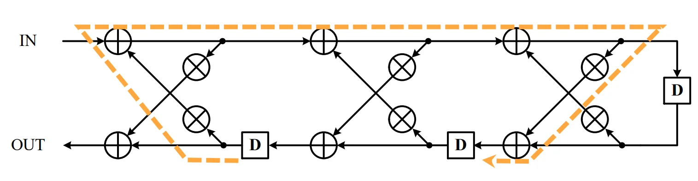
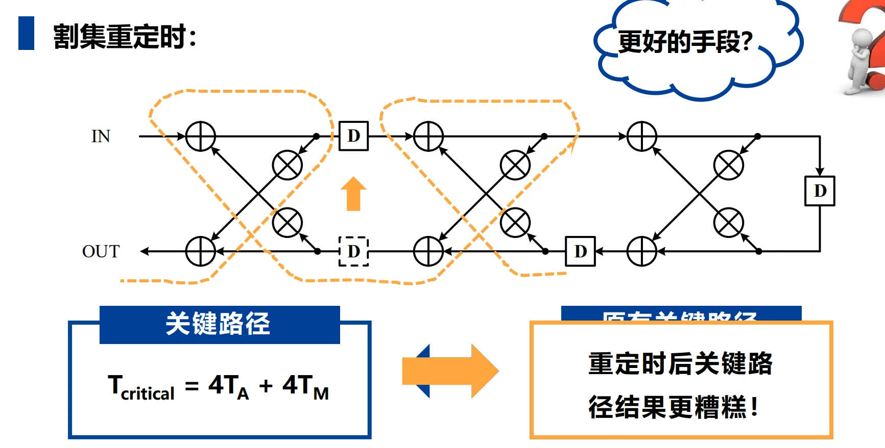
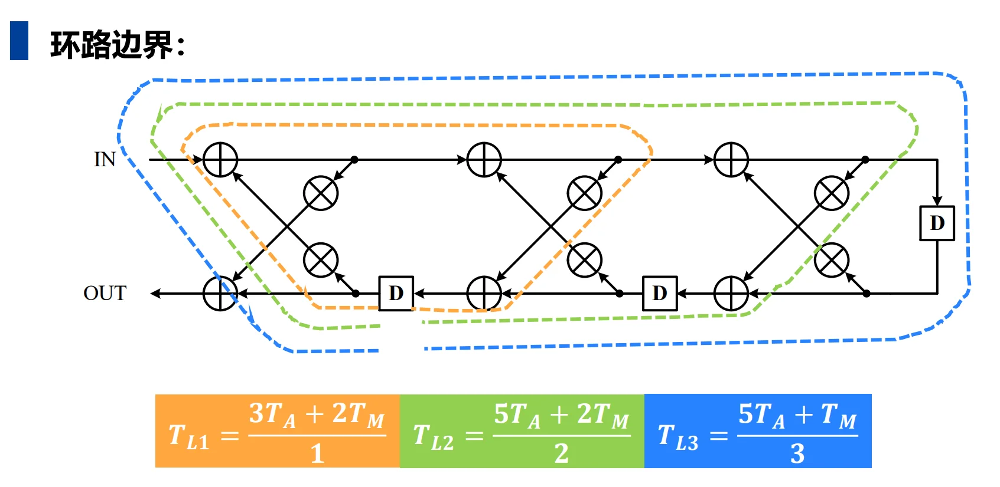
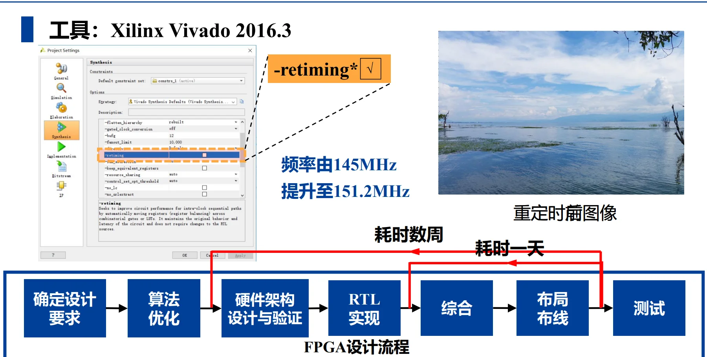

# 第五章：重定时技术

---

## 一、重定时技术基础
### 1.1 核心定义
重定时（Retiming）是一种电路架构变换技术，**在不改变系统输入输出特性与功能的前提下，调整电路中延迟元件（寄存器/延时单元D）的数量与分布**。
- 核心目标1：**缩短组合逻辑关键路径**，提升电路工作频率；
- 核心目标2：优化寄存器数量，减小芯片面积。

### 1.2 核心约束与不变性
重定时操作必须满足以下核心规则，否则会改变系统功能：
1.  **环路总延迟不变**：任意环路内的延时单元总数，重定时前后保持不变；
2.  **迭代边界不变**：DFG（数据流图）的迭代边界 $T_{\infty} = \underset{L}{\text{max}}\frac{T_L}{W_L}$不变（$T_L$为环路总计算时间，$W_L$为环路总延迟数），系统的极限处理能力不变；
3.  **非负延时约束**：重定时后任意有向边的延时单元数量 $W_r(e) \geq 0$，不能出现负延时。
4. **重定时技术不一定能够缩短关键路径延迟，不一定能够减小芯片面积。**

### 1.3 割集重定时（基础方法）

**操作规则**：对电路的一个割集，**在一个方向的所有边上增加k个延时，同时在反方向的所有边上减少k个延时**；

特例1：**节点重定时**——子图仅为单个节点的割集重定时；

特例2：**流水线技术**——前馈割集（所有边同向）的割集重定时，仅需在**同向边增加延时**，无反向边需处理。

所有节点重定时值$r(V)$都增加常数值 $j$ ， 重定时映射 $G \rightarrow G_r$ 不变

### 1.4 数学求解方法

#### 重定时值 $r(v)$

对于节点$v$，定义它的重定时值：

$$\left\{
\begin{array}{ll}
r(v) = 0 & \text{不操作} \\
r(v) > 0 & \text{节点的每条输入边增加} r(v) \text{延时，同时} \\
& \text{节点的每条输出边减少} r(v) \text{延时} \\
r(v) < 0 & \text{节点的每条输入边减少} r(v) \text{延时，同时} \\
& \text{节点的每条输出边增加} r(v) \text{延时}
\end{array}
\right.$$

#### 重定时方程
对边 $u \rightarrow v$，重定时后的延时 $w_r(e) = w(e) + r(v) - r(u)$，其中$r(v)$为节点v的重定时值；

#### 约束
所有边满足 $w_r(e) \geq 0$，通过求解约束方程得到最优重定时值，适合复杂电路。

#### 考虑环路
对于重定时的路径

$$p = V_0 \rightarrow V_1 \rightarrow \cdots \rightarrow V_k$$

重定时方程：$W_r(p) = W(p) + r(V_k) - r(V_0)$

> 内部结点同时存在一条输入路径和输出路径在路径$p$中。

我们试想，当$V_0 = V_k$时，即形成一个环路，此时重定时方程变为：

$$W_r(p) = W(p) + r(V_k) - r(V_0) = W(p)$$

这表明**环路的总延时在重定时前后保持不变**。

这也就是说，**重定时操作不能改变任何环路的环路边界，也就无法改变DFG的迭代边界**，这是重定时的核心约束之一，也是保证系统功能不变的关键。

---

## 二、$k$-slow 技术的核心原理
### 2.1 第一步：为什么需要 $k$-slow？（单纯的重定时为什么会失效？）

重定时的一个铁律：**重定时绝对不能改变任何一个反馈环路（Loop）中的总延迟单元（D）的数量。**

这会导致一个致命的死局：
如果一个反馈环路中，组合逻辑的运算量非常大，但**环路里的 D 却非常少**（比如只有 1 个 D），你就**没有足够的 D 可以拿来切分长路径**。
这就好比你想把一条 1000 米的马路切成 10 段，但你手里只有一个路障，你怎么切？

例如上面的例子，在这个 3 阶格型滤波器中，存在长长的反馈路径。我们试图用割集重定时去优化它，结果发现因为环路里的 D 太少，移动来移动去，反而把关键路径搞得更糟了（从 $4T_A+4T_M$ 变成了更长的路径）。这就是传统重定时的极限。

### 2.2 第二步：$k$-slow 是如何打破僵局的？（为什么能降低关键路径？）

既然手里路障（D）不够，那我们**强行塞入更多的路障**不就行了吗？
这就是 $k$-slow 的核心操作：**把电路中所有的 $D$ 直接替换成 $k$ 个 $D$（即 $kD$）。**

我们以课件 **第 31 页** 和 **第 32 页** 的极简例子（$k=2$）来看：
*   **原始电路（左图）：** 节点 A 和 B 构成一个环，环里只有 1 个 D。假设 A 和 B 的延时都是 $1\ u.t.$，那么没法切分，关键路径 $T_c = 2\ u.t.$。
*   **2-slow 变换（右图，重定时间）：** 我们强行把那个 $1D$ 变成了 $2D$。
*   **见证奇迹的时刻（第 32 页右图）：** 既然现在环里有 $2$ 个 D 了，我们就可以用你学过的“割集重定时”，把其中 1 个 D 往回退（或者往前推），卡在 A 和 B 的中间！
*   **结果：** 此时关键路径被完美切开，**关键路径 $T_c$ 从 $2\ u.t.$ 降到了 $1\ u.t.$**！你的时钟频率可以瞬间翻倍（跑得更快了）。

**结论：** $k$-slow 的本质是向电路（尤其是反馈环路）中**注入额外的寄存器**，为你后续做重定时、打断关键路径提供充足的“子弹”。这就解释了它为什么能逼近迭代边界。

### 2.3 第三步：凭什么强行加了 D，功能却保持不变？

你肯定会问：“凭什么原来打一拍，现在强行打两拍，结果还是对的？这不破坏算法逻辑吗？”

答案是：**它并没有改变数据相互之间的相对数学关系，它只是让整个世界的时间“被拉伸（放慢）”了。**

举个例子，假设原始的 IIR 滤波器公式是：

$$y(n) = x(n) + y(n-1)$$

这意味着当前输出等于当前输入加上**上一个周期**的输出。

我们进行 2-slow 变换，把所有的 $D$ 变成 $2D$，硬件对应的方程变成了：

$$y_{new}(n) = x_{new}(n) + y_{new}(n-2)$$

这还能输出正确结果吗？**能，前提是你给输入数据的方式必须改变！**
（看课件第 31 页中间的表格和 33 页的文字）

*   **原始输入：** $x_0, x_1, x_2, x_3 \dots$ （每个时钟周期喂一个数据）
*   **2-slow 输入：** $x_0, 0, x_1, 0, x_2, 0 \dots$ （隔一个时钟周期喂一个有效数据，中间塞入无效的0或空操作）

我们来推演一下 2-slow 电路的运行：
*   **周期 0:** 输入 $x_0$。计算 $y_{new}(0) = x_0 + \text{初始状态}y(-2) = y_0$。
*   **周期 1:** 输入 $0$。计算 $y_{new}(1) = 0 + \text{无用数据}y(-1) = \text{垃圾数据}$。
*   **周期 2:** 输入 $x_1$。计算 $y_{new}(2) = x_1 + y_{new}(0)$。注意！这里的 $y_{new}(0)$ 正好是 $y_0$！所以结果等于 $x_1 + y_0 = y_1$。完美！
*   **周期 3:** 垃圾数据。
*   **周期 4:** 输入 $x_2$。计算 $y_{new}(4) = x_2 + y_{new}(2) = x_2 + y_1 = y_2$。完美！

**理解功能等价的核心：**
2-slow 电路在偶数周期（0, 2, 4...）计算出的结果，和原始电路在（0, 1, 2...）周期计算出的结果**完全一模一样**。
这就好比一部原本以 1 倍速播放的电影，我们把它每一帧画面之间插入了一帧黑屏，以 2 倍的帧率播放（时钟加快）。你看到的故事内容（功能）完全没变，只是原本紧凑的数据被**“稀释”**了。

### 2.4 进阶：被浪费的奇数周期怎么办？（课件第 32 页的终极大招）

你会发现一个问题：2-slow 虽然让时钟频率翻倍了（关键路径从 2 降到 1），**但由于我们要塞入空操作**（0），我们实际处理数据的**吞吐量并没有提高**。甚至硬件有 50% 的时间在处理垃圾数据。

**这不就成了“为了主频好看而自欺欺人”吗？**

并不是！贺老师在**第 32 页**的第二条指出：“可交替进行奇偶两组独立的迭代，则硬件可以完全利用”。

这就是 $k$-slow 在工业界（比如视频处理、通信基站）大放异彩的真正原因：**多路数据复用（Interleaving）**。

既然奇数周期空着也是空着，我们为什么不拿来处理**另外一路完全独立的数据**呢？
*   **偶数周期：** 处理视频流 A（$A_0, A_1, A_2\dots$）
*   **奇数周期：** 处理视频流 B（$B_0, B_1, B_2\dots$）

此时，输入数据序列变成了：$A_0, B_0, A_1, B_1, A_2, B_2 \dots$
由于我们把 $D$ 变成了 $2D$（**内部寄存器能存两份历史数据**），这两路数据在同一个硬件里流淌，**互不干扰**！

**最终成就：**
1. **关键路径被大幅砍断**，时钟频率（Clock Frequency）极大提升。
2. 硬件**不再有空闲周期**，利用率达到 100%。
3. 用一套硬件，同时全速跑了两路甚至多路算法（如果是 $k$-slow，就能同时跑 $k$ 路独立数据）。

这就是为什么在课件第 36~39 页，针对 100 阶那么可怕的格型滤波器，只要用 2-slow + 割集重定时，就能把庞大的关键路径从 $101T_A+2T_M$ 直接拍碎到 $6 u.t.$（当然，如果我们只处理一个数据流，关键路径仍等效于$12 u.t.$，**因为输入采样周期翻倍，相当于时间被拉伸了**）。当然，即便是这样，**性能提升也是巨大的**（从 100 多降到 12）。

### 2.5 方法论
**总结一下 $k$-slow 的方法论：**
1. $k$ 倍降速：把电路中所有的 D 替换成 kD，强行增加环路中的寄存器数量，为**后续重定时提供足够的“子弹”**。
2. **割集重定时**：在 $k$-slow 变换后的电路上，使用**割集重定时技术**，合理调整寄存器位置，切断长路径，**降低关键路径延迟**。
3. **性能评估**：如果仍然只输入一串数据流，即采样周期变为$k$倍，则**等效关键路径会在割集重定时后的关键路径长度基础上拉伸$k$倍**。为了更高效地利用硬件，**可以采用多路数据复用（Interleaving）**，在不同周期处理不同数据流，达到**同时处理多路数据**的效果。

### 2.6 效果

