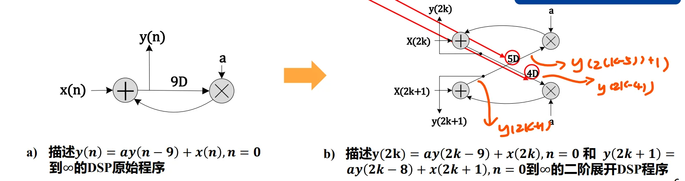
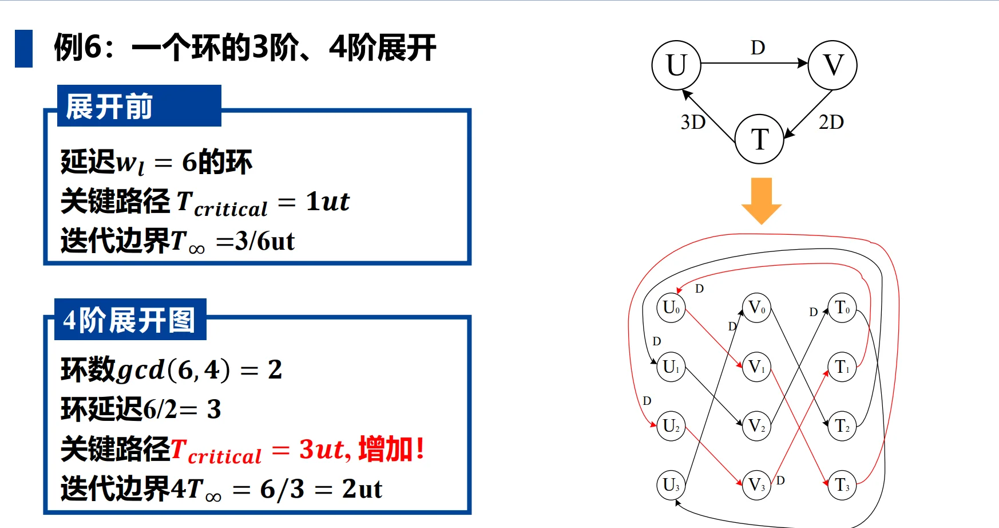
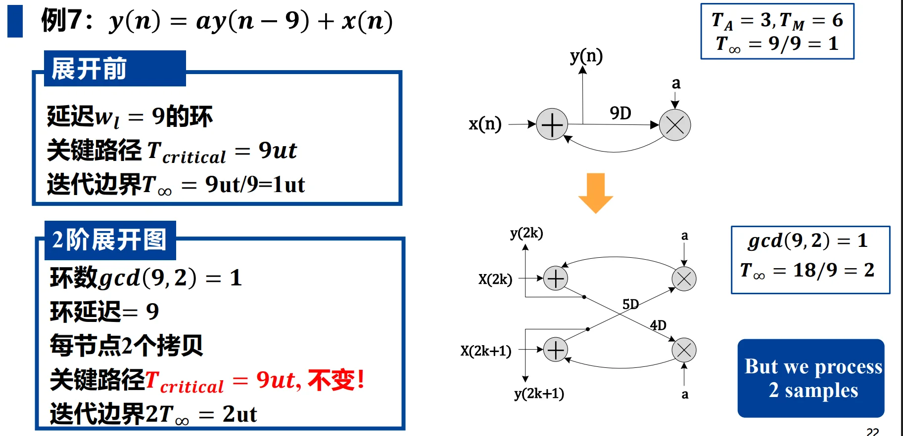
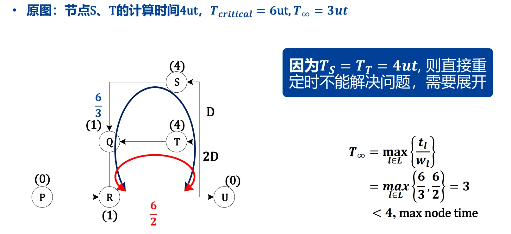
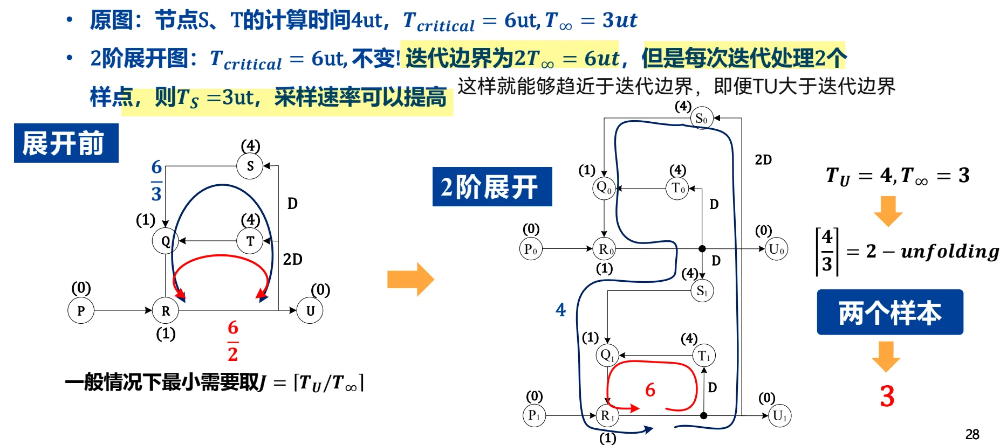
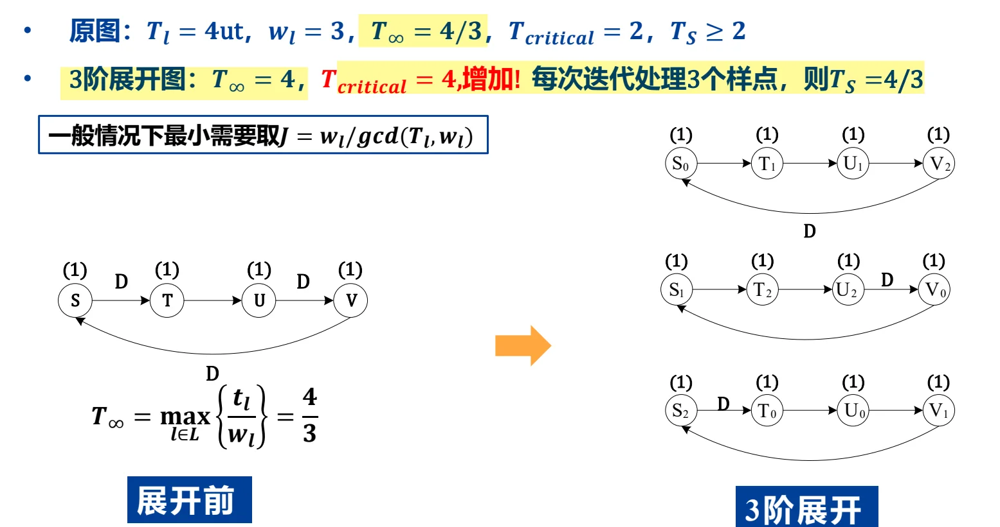

# 第六章：展开 (Unfolding)

## 一、展开的定义与本质
*   **定义**：展开是一种架构转换技术，它通过创建一个描述原程序**多次连续迭代**的新程序，来实现算法的并行处理。
*   **本质**：展开等同于计算机编译理论或汇编编程中的**循环展开（Loop Unrolling）**。
*   **展开因子 ($J$)**：表示展开的迭代次数或阶数。一个 $J$ 阶展开系统会同时处理 $J$ 个连续的采样点。
*   **核心意义**：展开 $\equiv$ **并行处理**。它是发掘算法潜在并发性、提升系统吞吐率的结构化方式。

可以理解**展开技术**就是并行处理的结构化方式。
例如我们对如下 DSP 系统进行2阶展开：

$$\begin{aligned}& y(n) = ay(n-9) + x(n) \Rightarrow \\
& y(2k) = ay(2k-9) + x(2k) = ay(2(k-5) + 1) + x(2k) \\
& y(2k+1) = ay(2k+1-9) + x(2k+1) = ay(2(k-4)) + x(2k+1)\end{aligned}$$
\end{aligned}$$

## 二、展开图 (DFG) 的构建算法
构建一个 $J$ 阶展开的数据流图（DFG）遵循以下规则：

### 2.1 节点映射
*   对于原始 DFG 中的每一个节点 $U$，在展开图中绘制 **$J$ 个具有相同功能**的节点：$U_0, U_1, \dots, U_{J-1}$。
*   **结果**：展开后的 DFG 包含的节点数量是原始 DFG 的 $J$ 倍。

### 2.2 边与延迟映射
对于原始 DFG 中一条从 $U$ 到 $V$、延迟为 $w$ 的边，在 $J$ 阶展开图中对应生成 $J$ 条边：
*   **连接关系**：**节点 $U_i$ 连接到节点 $V_{(i+w) \% J}$。**
*   **延迟计算**：新边上的延迟数为 $w_{unf} = \lfloor (i+w) / J \rfloor$。
    *   *注：$\lfloor x \rfloor$ 表示向下取整；$\%$ 表示取余数。*

### 2.3 特殊情况：当 $w < J$ 时
*   若原始边的延迟 $w$ 小于展开因子 $J$，展开后会生成：
    *   $J - w$ 条**无延迟**的边。
    *   $w$ 条延迟为 **1** 的边。

这份笔记整理得非常清晰！基于你提供的PDF课件，我为你继续整理了下一部分的核心内容。

这一部分我们主要聚焦于课件的**“02. 展开的性质”**（对应课件第16页至第25页）。这部分是理解展开算法如何影响电路性能（如延迟、关键路径、迭代边界等）的理论核心。

你可以直接将以下内容追加到你的 `unfolding.md` 文件中：

## 三、展开的性质 (Properties of Unfolding)

展开不仅是一种简单的复制过程，它在改变系统结构的同时，遵循着一系列严格的数学和**图论性质**。

### 3.1 保留原图中的优先约束 (Precedence Constraints)
*   **性质**：展开后的 DFG 会严格保留原 DFG 中**节点计算的先后依赖关系**。
*   $J$ 阶展开图中，从 $U_i \rightarrow V_{(i+w)\%J}$ 的 $J$ 条边（延迟为 $\lfloor \frac{i+w}{J} \rfloor$），完美对应并等效于原始 DFG 中延迟为 $w$ 的边 $U \rightarrow V$。

### 3.2 保持各边的总延迟数 (Preserving Delays)
*   **性质**：对于原 DFG 中一条延迟为 $w$ 的边，其在 $J$ 阶展开图中**生成的 $J$ 条对应边的延迟数之和，等于原始延迟 $w$**。
*   **数学公式**：
    $$ \lfloor \frac{w}{J} \rfloor + \lfloor \frac{w+1}{J} \rfloor + \dots + \lfloor \frac{w+J-1}{J} \rfloor = w $$

### 3.3 对关键路径的影响 (Impact on Critical Path)
展开操作**可能会改变电路的关键路径**（$T_{critical}$），这取决于原边上的延迟 $w$ 与展开因子 $J$ 的大小关系：
*   **当 $w < J$ 时**：
    *   会在展开图中生成 $J-w$ 条**无延迟的边**（0 delay）和 $w$ 条延迟为 1 的边。
    *   **风险**：无延迟边的增加，意味着节点之间形成了**直接的组合逻辑**连接，**可能导致关键路径变长**。
*   **当 $w \ge J$ 时**：
    *   生成的 $J$ 条边的延迟均 $\ge 1$，**不会生成无延迟边**。
    *   **结论**：因此，必定**不会**因为这条边而增加系统的关键路径。

### 3.4 展开环路的规则 (Rules for Unfolding Loops)
若原 DFG 中存在一个延迟数为 $w_l$ 的环路 $l$，在进行 $J$ 阶展开后（记为 $G_J$），该环路会发生如下形变：
*   **环路数量**：原先的 1 个环路，**会分裂成 **$\gcd(w_l, J)$** 个独立的环路**。
*   **环路延迟**：每个新环路中包含的**延迟数为 $w_l / \gcd(w_l, J)$**。
*   **节点拷贝数**：每个新环路包含了原环路中**每个节点的 $J / \gcd(w_l, J)$ 个拷贝**。

### 3.5 展开对迭代边界的影响 (Impact on Iteration Bound)
*   **性质**：如果原图 $G$ 的迭代边界为 $T_\infty$，那么其 $J$ 阶展开图 $G_J$ 的迭代边界为 **$J \cdot T_\infty$**。
*   **公式推导**：
    
    $$ T_{\infty}' = \max_l \left\{ \frac{(J/\gcd(w_l, J)) t_l}{w_l/\gcd(w_l, J)} \right\} = J \max_l \left\{ \frac{t_l}{w_l} \right\} = J T_\infty $$
    
*   **物理意义理解**：虽然展开后图的**绝对迭代边界变成了原来的 $J$ 倍**（$J T_\infty$），但是由于展开后的系统在**一次时钟迭代中同时处理了 $J$ 个采样点**，因此分摊到**每个采样点的有效迭代周期依然是 $T_\infty$**。这为我们后续通过**重定时等技术逼近真正的迭代边界**提供了物理空间。

### 3.6 一些案例

## 四、展开的应用 (Applications of Unfolding)

展开技术在数字信号处理（DSP）架构设计中有两大核心应用：一是突破重定时的瓶颈以**减少采样周期**；二是构建**字级或位级的并行处理架构**。

### 4.1 应用一：减少采样周期 (向迭代边界 $T_\infty$ 逼近)
在实际电路优化中，为了让系统的采样周期 $T_S$ 达到理论的极限（即迭代边界 $T_\infty$），我们经常会遇到单纯使用“重定时(Retiming)”无法解决的困境。此时必须引入“展开”。具体分为以下三种情况：

#### 情况1：原始DFG中存在计算时间 $T_U > T_\infty$ 的节点
**痛点**：由于某个不可分割的单节点计算时间过长（如某乘法器耗时4ut，但整个环路的 $T_\infty=3ut$），**重定时无法拆分单个节点**，导致系统关键路径 $T_{critical}$ 始终**受制于该节点**，无法达到 $T_\infty$。例如：

**解决方案**：对 DFG 进行 $J$ 阶展开。我们可以强行是的迭代边界变为原来的 $J$ 倍从而使得：$JT_{\infty}>T_U$，虽然这听起来有点“硬凑”的感觉，但是别忘了**我们的采样频率可以提高**！ 

**效果**：虽然展开后图的关键路径 $T_{critical}$ 可能不变（甚至更长），但由于一次时钟迭代**同时处理了** $J$ 个样点，**平均每个样点的有效采样周期 $T_S = T_{critical} / J$ 会降低**，从而突破节点耗时的物理限制。

**参数选择**：一般情况下，最小需要的展开因子为：
$$ J = \lceil T_U / T_\infty \rceil $$

即向上取整，保证**展开后的整体迭代周期能够包容该长耗时节点**

#### 情况2：迭代边界 $T_\infty$ 不是整数
**痛点**：在数字电路中，**时钟周期必须是基本时间单位（ut）的整数倍**。如果计算出的 $T_\infty$ 带有小数（例如 $T_\infty = 4/3$ ut），在不改变架构的情况下，实际时钟周期只能**向上取整**（取 2ut），**损失了性能**。

!!! note 原因：因为向上取整中的空闲时间无法被利用。

**解决方案**：通过展开，使展开后的迭代边界 $J \cdot T_\infty$ 成为整数。

**参数选择**：若决定迭代边界的环路延迟为 $w_l$，计算时间为 $t_l$，则最小展开因子通常取：
$$ J = \frac{w_l}{\gcd(t_l, w_l)} $$

**通俗理解：即求出能让 $J \cdot T_\infty$ 变成整数的最小整数 $J$**

#### 情况3：情况1与情况2的混合
*   **特征**：最长的节点计算时间大于迭代边界（$T_U > T_\infty$），**且** $T_\infty$ 也不是整数。
*   **参数选择**：需要寻找一个满足以下**两个条件**的最小整数 $J$：
    1.  $J \cdot T_\infty$ 必须为**整数**（解决非整数边界问题）。
    2.  $J \cdot T_\infty \ge \max(T_U)$（解决单节点耗时过长问题）。
*   **示例**：假设 $T_\infty = 4/3$，且最大节点耗时 $T_U > 6$。
    *   满足条件1的 $J$ 值有：$3, 6, 9 \dots$
    *   代入条件2：当 $J=3$ 时，$3 \times (4/3) = 4$ 不满足 $\ge 6$；当 $J=6$ 时，$6 \times (4/3) = 8 \ge 6$ 满足条件。因此最优展开因子 $J = 6$。

---

### 应用二：并行处理架构的衍生 (Parallel Processing)
展开的物理本质就是复制硬件来换取时间，这直接对应了不同层级的并行计算架构转换。

#### 1. 字级并行 (Word-Level Parallel Processing)
*   对一个串行处理整字（Word）的常规 DSP 滤波程序进行 $J$ 阶展开，可以直接得到一个**字级并行架构**（MIMO 结构）。
*   系统在每一个时钟周期内，能够**同时吃进 $J$ 个字的数据，并吐出 $J$ 个字的计算结果**，极大地提升了系统的数据吞吐率。

#### 2. 位级并行 (Bit-Level Parallel Processing)
展开概念同样可以无缝套用到数据字内部的比特位（Bit）处理上：
*   **位串行 (Bit-Serial)**：每次时钟仅处理 1 个 bit。
*   **位并行 (Bit-Parallel)**：一次性处理所有的 bit。
*   **数字串行 (Digit-Serial)**：介于两者之间。如果我们将一个纯“位串行”的架构进行 **$J$ 阶展开**，就会得到一个**每次处理 $J$ 个 bit** （即一个 Digit，Digit-size = $J$）的数字串行架构。
    *   *应用价值*：Digit-Serial 允许设计师在 **硬件面积（位串行最小）** 与 **处理速度（位并行最快）** 之间通过调整展开因子 $J$ 寻找最优的折中点。

