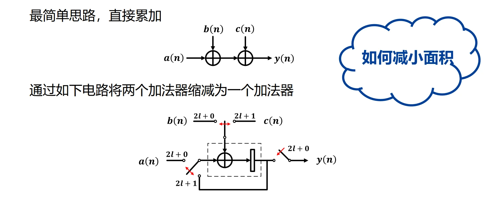
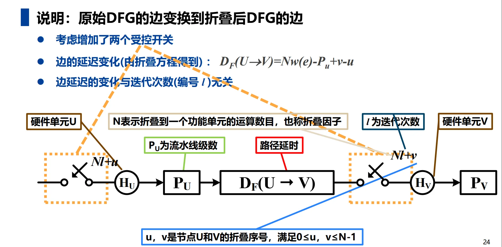
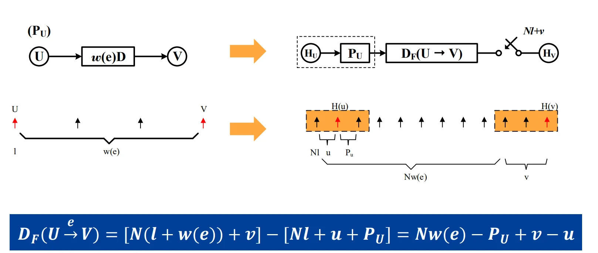
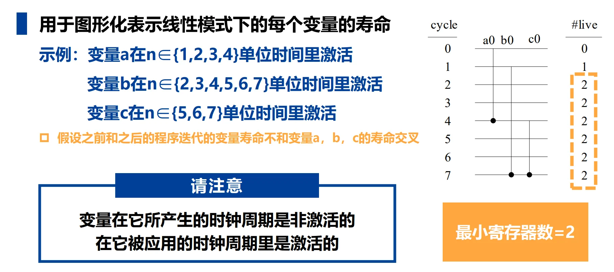
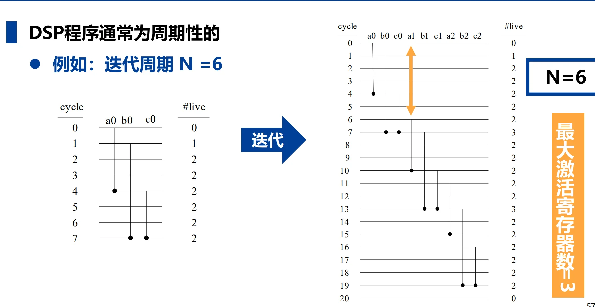
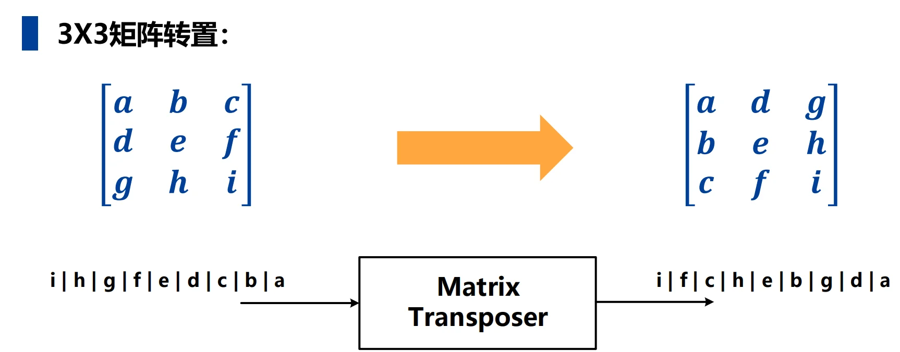
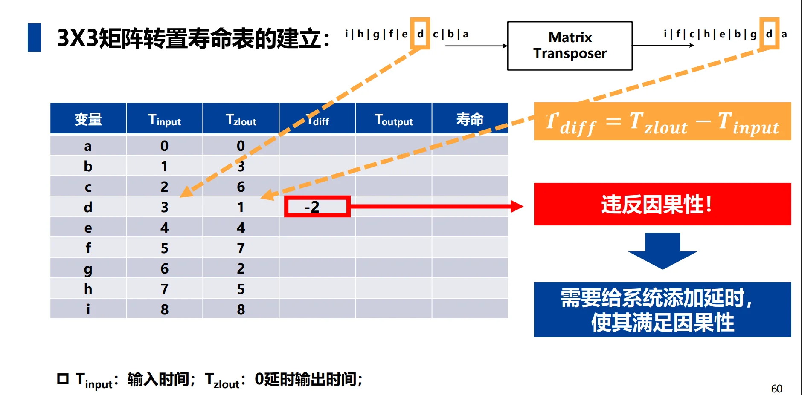
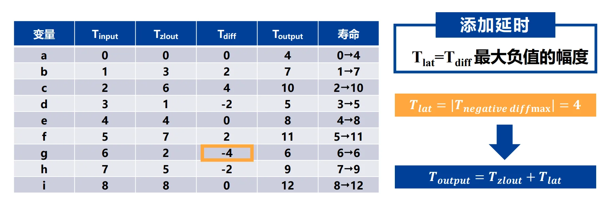
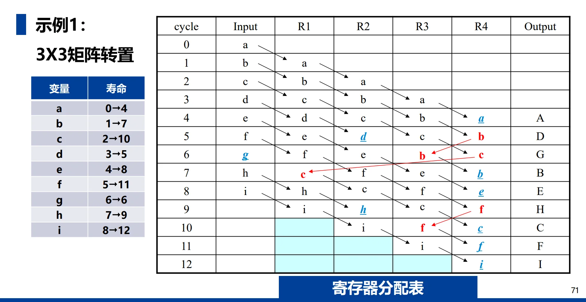
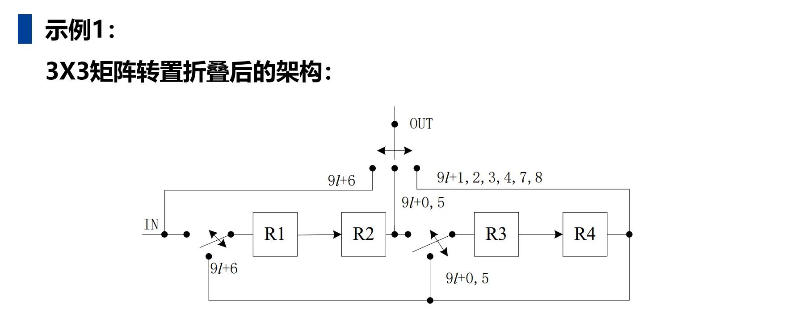

# 第七章：折叠 (Folding)

## 一、折叠的基本概念

### 1.1 背景与动机
*   **芯片现状**：随着制程进步（如5nm、3nm），芯片集成的晶体管数量（超150亿至200亿）和面积不断增大，导致**成本显著提高**。
*   **移动设备需求**：移动设备对**低功耗**有极高要求。
*   **技术权衡**：
    *   **流水线技术**：虽然能提高速度，但会增加硬件面积和功耗。
    *   **折叠技术**：当处理速度（如音频信号）要求不高时，可以通过折叠技术来**降低面积和功耗**。
    *   **速度与面积/功耗**：两者往往不可兼得，折叠是在速度和资源之间进行平衡的有效手段。

### 1.2 折叠的定义
*   **基本定义**：折叠是**展开（Unfolding）的逆过程**。
*   **核心机制**：通过**时分复用（Time-division Multiplexing）**，将多个相同的运算操作（如加法或乘法）映射到单个功能单元上执行，从而实现**资源共享**。
*   **折叠因子 ($N$)**：指折叠到单个功能单元上的运算数目。

### 1.3 折叠的效益与代价
*   **硬件开销（效益与增加量）**：
    *   **功能单元**：减少为原始数量的 **$1/N$**。
    *   **额外资源**：需要增加额外的寄存器、多路器（MUX）和控制器（用于控制开关切换）。
*   **速度代价**：
    *   **处理时间**：增加为原来的 **$N$ 倍**。
    *   **迭代周期**：增加为原来的 $N$ 倍，并产生 $N$ 个时钟周期的滞后。
    *   **输入样点**：样点必须在 $N$ 个时钟周期内保持有效。

### 1.4 简单示例：$y(n) = a(n) + b(n) + c(n)$
*   **全硬件映射**：通常需要两个加法器直接完成。
*   **折叠设计**：
    *   通过受控开关和寄存器，将两个加法操作缩减为一个加法器执行。
    *   **工作过程**：在周期0输入 $a(0)$ 和 $b(0)$，结果存入寄存器；周期1将寄存器值与 $c(0)$ 相加，从而每2个周期产生1次输出。

## 二、折叠变换 (Folding Transformation)

### 2.1 核心定义与术语
折叠变换是通过数学手段将原始数据流图（DFG）映射到硬件架构的过程，涉及以下核心概念：

1. **折叠因子 ($N$)**：定义为折叠到单个功能单元（硬件算子）上的运算操作数目。
2. **折叠序号 ($u, v$)**：指节点 $U$ 和 $V$ 在硬件调度执行中的**时间划分标号**，取值范围为 $0 \sim N-1$。它们决定了节点在**每个硬件周期内被调度的顺序**。
3. **折叠集 (Folding Set)**：执行**相同运算功能**的有序操作集合。
   *   一个折叠集包含 $N$ 个位置，对应 $N$ 个时间段。
   *   位置 $j$ 处的运算由功能单元在第 $j$ 个时间段执行。若某位置为 $0$，则表示该时间段功能单元处于空闲状态。
   *   **示例**：$N=3$ 的折叠集 $S_1=\{A_1, 0, A_2\}$ 表示 $A_1$ 在时刻 $3l+0$ 执行，$A_2$ 在 $3l+2$ 执行。

### 2.2 折叠方程 (Folding Equation)
折叠方程是计算折叠后中间结果必须存储的时间（即**折叠延迟**）的核心公式。

1. **公式推导**：考虑延迟为 $w(e)$ 的边 $U \to V$，若 $U$ 的流水线级数为 $P_U$，则 $U$ 的第 $l$ 次迭代结果在 $Nl + u + P_U$ 时刻产生，而 $V$ 的第 $l+w(e)$ 次迭代在 $N(l+w(e)) + v$ 时刻使用该结果。
2. **标准方程**:
    
$$D_F(U \to V) = Nw(e) - P_U + v - u$$

3. **属性**：折叠延迟 $D_F$ 的大小与迭代次数 $l$ 无关，仅取决于折叠因子、原始延迟、流水线级数及折叠序号。

### 2.3 可行性约束 (Feasibility Constraint)
*   **基本准则**：一个物理上可实现的折叠架构，其 DFG 中所有的边必须满足 **$D_F(U \to V) \ge 0$**。
*   **不合理处理**：如果计算出的折叠延迟为负数（$D_F < 0$），则该折叠方案不合理。此时需要通过**重新分配折叠集**或对原始 DFG 进行**重定时 (Retiming)** 来消除负延迟。

### 2.4 折叠架构的设计流程
根据折叠变换理论，构建折叠 DFG 的标准步骤如下：

1.  **确定折叠集**：根据资源约束分配功能单元。
2.  **列方程组**：为原始 DFG 的每一条边写出对应的折叠方程。
3.  **验证可行性**：检查是否所有 $D_F \ge 0$。若**不满足，需引入重定时技术**。
4.  **绘制架构图**：
    *   画出折叠后的功能单元、寄存器和**多路开关**（MUX）。
    *   按照折叠方程计算出的**延迟数**连接各边。
    *   在受控开关处标注对应的**折叠序号（时间戳）**。

## 三、寄存器最小化技术 (Register Minimization Techniques)

### 3.1 寿命分析 (Life-cycle Analysis)
折叠技术在减少功能单元的同时，往往会引入大量的寄存器。寿命分析是计算实现 DSP 算法所需**最少寄存器数**的核心过程。

*   **激活变量 (Active Variable)**：指一个样值从产生时刻到被应用时刻的状态。
*   **变量状态规则**：
    *   变量在其**产生**的时钟周期内是**非激活**的。
    *   变量在其**被应用**的时钟周期内是**激活**的。
*   **最小寄存器准则**：在任意单位时间内，**最大激活变量数**即为实现该 DSP 程序所需的**最小寄存器数**。

### 3.2 线性寿命图 (Linear Life Chart)
线性寿命图用于图形化表示每个变量在不同时间单位下的寿命状态。

*   **周期性考虑**：由于 DSP 程序通常是周期性的（设迭代周期为 $N$），在计算最大激活变量数时，不仅要考虑当前迭代，还要**考虑前后迭代周期的变量重叠情况**。
*   **计算方法**：通过在寿命图中垂直切片，统计每个时刻的变量数，取其最大值。

### 3.3 寿命表 (Life Table) 与因果性
寿命表是进行寄存器分配前的数学分析工具，以 **$3 \times 3$ 矩阵转置**为例：

*   **核心参数**：
    *   $T_{input}$：变量输入的时刻。
    *   $T_{zlout}$：零延迟输出时刻。
    *   **$T_{diff} = T_{zlout} - T_{input}$**：反映了变量需要存储的时间差。
*   **因果性调整**：如果计算中出现 $T_{diff} < 0$（即输出早于输入），则违反了**因果性**。
    *   **解决办法**：引入系统延时 ($T_{lat}$)，通常取 $T_{diff}$ **最大负值的绝对值**。
    *   **最终输出时刻**：$T_{output} = T_{zlout} + T_{lat}$。

## 四、前向-后向分配技术 (Forward-Backward Allocation Technique)

### 4.1 算法定义与目标
前向-后向分配技术是一种将生存期内的变量高效分配到物理寄存器中的方案，其核心目标是**以最小寄存器数实现分配**。

### 4.2 详细分配步骤
根据源文件，该分配过程分为五个主要步骤：

1.  **确定基准**：首先通过**寿命分析**（Life-cycle Analysis）确定实现算法所需的最小寄存器数。
2.  **变量输入与排序**：在变量寿命期开始的时间点输入变量。如果同一周期有多个变量输入，需按寿命长短排序：**寿命最长的变量优先分配给初始寄存器**，其余变量按寿命递减顺序依次分配。
3.  **前向分配 (Forward Allocation)**：变量以物理顺序在寄存器间传递。若寄存器 $R_i$ 在当前周期存有某变量，则下一个周期该变量将进入 $R_{i+1}$，直至变量消亡或到达末尾寄存器。
4.  **周期性重复**：分配具有周期性（周期为 $N$）。若寄存器 $R_j$ 在周期 $l$ 被占据，则在 $l+N$ 时刻它将被下一迭代的相同变量占据。
5.  **后向分配 (Backward Allocation)**：对于到达末尾寄存器且尚未消亡的变量，需计算其剩余寿命，并基于**先到先得 (First-Come First-Served)** 的原则将其重新分配到空闲寄存器中。
    *   若有多个寄存器可选，优先选择在末尾寄存器和该寄存器之间已有后向路径的。
    *   若仍有多个候选，选择拥有最少但足够完成分配的前向寄存器的那个。

### 4.3 关键原则与技巧
*   **寿命优先原则**：在处理输入冲突时，长寿命变量拥有对低编号寄存器的优先使用权。
*   **路径优化**：后向分配时，应尽量减少不必要的交叉路径，选择物理连接最简便的寄存器。
*   **因果性保障**：在进行分配前，必须确保系统已通过重定时或添加系统延时 ($T_{lat}$) 满足了因果性约束。

### 4.4 实例分析：$3 \times 3$ 矩阵转置
在 $3 \times 3$ 矩阵转置的例子中，通过该技术实现了高效调度：

*   **寿命表建立**：计算各变量（a至i）的输入时刻 ($T_{input}$) 和输出时刻 ($T_{output}$)，确定最小寄存器数为 4。
*   **分配表维护**：通过一个包含周期（Cycle）、输入（Input）、物理寄存器（R1-R4）和输出（Output）的表格，清晰展示了每个变量在硬件中的流动路径。
*   **最终架构**：折叠后的硬件架构包含 4 个串联寄存器，辅以受控开关在特定时刻（如 $9l+6, 9l+0$ 等）切换输入与输出路径。

### 4.5 Biquad 滤波器的寄存器优化实例
通过对折叠后的 Biquad 滤波器进行系统的寿命分析，可以显著降低硬件开销：

*   **优化前**：原始 DFG 中可能包含较多寄存器（如示例中的 6 个）。
*   **优化流程**：
    1.  对原始 DFG 进行**重定时**以消除负延迟边。
    2.  构造**寿命表**并画出**寿命图**。
    3.  确定最大激活变量数（本例中为 2）。
*   **结果**：通过该技术，Biquad 滤波器的寄存器数可以从 **6 个减少到 2 个**，极大节省了芯片面积。
