# 第八章：脉动阵列 (Systolic Array)

## 一、脉动架构的基本概念 (Basic Concepts)

**基本定义：** 脉动架构是一个由处理单元（Processing Element, **PE**）构成的网络，能够**有节奏地**计算并传输数据。
> “脉动”（Systolic）一词类比于**血液在心脏泵力下通过动脉血管的规则流动**。在电路中，PE 就像心脏一样，规则地泵入和泵出数据，以维持规则的数据流,。

**脉动架构的主要特点**

1. **处理单元（PE）一致性：** 典型情况下，阵列中的每一个节点（PE）都是相同的。
2. **局部互连性：** 每个 PE **只与其相邻的 PE 进行通信**，全局布线较少。这种通信具有**局部性（Locality）**且非常**规则**。
3. **全流水化设计：** 脉动阵列通常是**全流水**的，PE 间的所有通信边沿都包含**延迟单元**。
4. **SIMD 系统：** 它属于**单指令多数据（SIMD）系统**，特别适用于对大量规则数据流进行单一的重复计算。
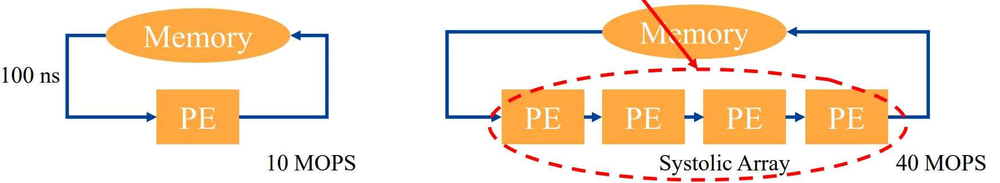

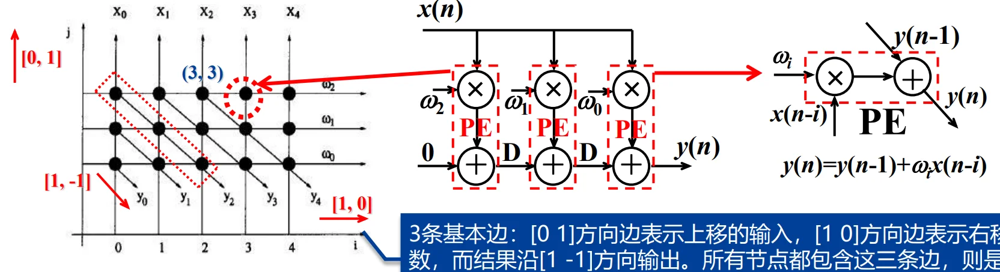

### 4. 脉动阵列的种类与应用

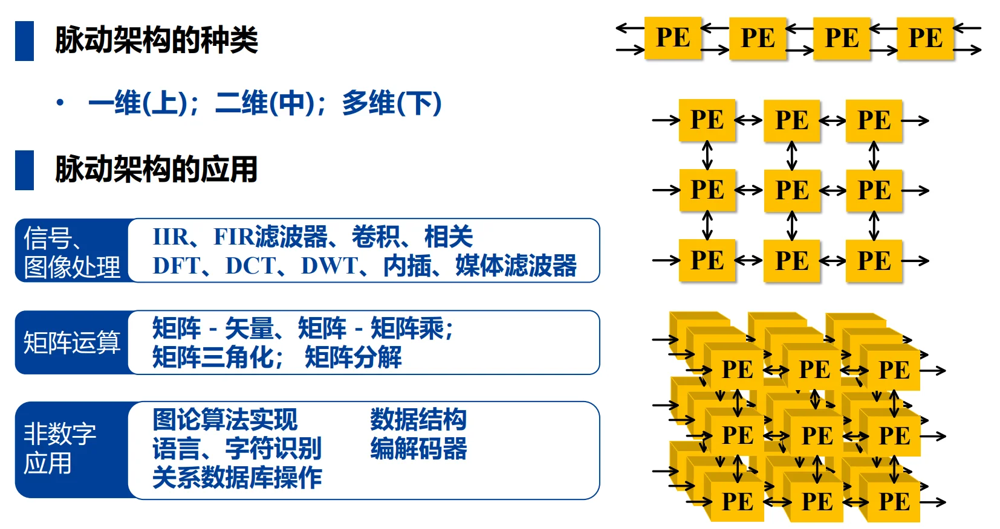

这是为您整理的《VLSI数字通信原理与设计》第八章——**板块二：脉动架构的设计方法**的学习笔记。

## 二、脉动架构的设计方法 (Design Methodology)

脉动架构的设计核心在于将算法转化为规则的图形表示，再通过数学变换映射到硬件电路上。其核心技术被称为**线性映射技术 (Linear Mapping)**。

### 2.1 核心设计流程
脉动阵列的设计通常遵循以下四个标准化步骤：

1.  **绘制算法的规则依赖图 (Regular DG)**。
2.  **添加空间与时间矢量**（投影矢量 $d$、处理器空间矢量 $p$ 和调度矢量 $s$）。
3.  **进行边缘映射 (Edge Mapping)**。
4.  **构造最终的脉动阵列电路**。

### 2.2 依赖图 (Dependence Graph, DG)

1. **定义：** DG 是描述算法中运算关系的有向图，其中**节点**代表计算，**边**代表节点间的优先约束（执行顺序）。
2. **规则 DG (Regular DG)：** 若 DG 中任意节点沿某一方向的边，在所有其他节点处也沿相同方向存在，则称之为规则 DG。
3. **DG 与 DFG 的区别：** 

| DG | DFG |
| --- | --- |
| 包含算法所有循环的计算 | 通常只包含一个循环 |
| 不包含延时单元 | 包含延时单元 |

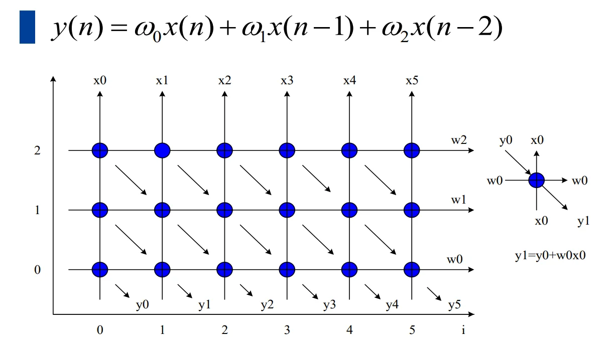

### 2.3 线性映射中的矢量定义
为了将二维或多维的算法过程映射到一维或低维的 PE 阵列中，需要定义以下关键矢量:

1. **节点标号矢量 $I$：** 描述 DG 中节点的位置，如 $I^T = (i, j)$。
2. **投影矢量 $d$：** $d^T = (d_1, d_2)$ , 又称迭代矢量，给出投影方向。落在该矢量方向上的所有节点将被映射到同一个 PE 上执行。
3. **处理器空间矢量 $p$：** $p^T = (p_1, p_2)$ , 决定节点 $I$ 被分配到哪一个标号的 PE。计算公式为：$Processor\ ID = p^T I$。
4. **调度矢量 $s$：** $s^T = (s_1, s_2)$ , 决定节点 $I$ 在何时被执行。计算公式为：$Time\ Slot = s^T I$。

!!! 映射的可行性约束
    并不是所有的矢量组合都是合法的，设计必须满足以下约束条件以确保电路逻辑正确：
    1.  **空间约束 $p^T d = 0$：** 处理器矢量 $p$ 必须与投影矢量 $d$ **正交**。
    2.  **时间约束 $s^T d \neq 0$：** 映射到同一个 PE 的两个不同节点不能在同一时间执行，即调度矢量 $s$ 与投影矢量 $d$ 不能正交。
    3.  **因果约束 $s^T e \ge 0$：** 映射后的电路中，任何边 $e$ 的延迟必须非负。如果延迟为 0，则该变量为**广播变量**。

### 2.4 边缘映射 (Edge Mapping)
这是从抽象图到具体电路的关键：

*   **方向映射：** DG 中的边 $e$ 映射到 PE 阵列后，其物理**连接方向**为 $e^{\prime} = p^T e$。
*   **延迟映射：** 映射后的边所包含的寄存器（**延时单元**）数量为 $D = s^T e$。

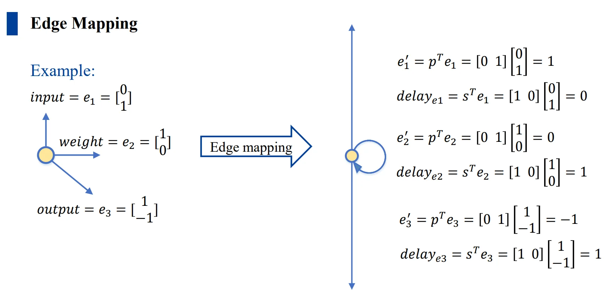

### 2.5 硬件利用效率 (HUE)
硬件利用效率衡量 PE 在时间轴上的忙碌程度。

*   **公式：** $HUE = \frac{1}{|s^T d|}$。
*   **物理意义：** $|s^T d|$ 代表同一 PE 执行相邻两个任务之间的时间间隔。该值越大，表示 PE 空闲时间越多，利用率越低。在理想设计（如 $B1$ 设计）中，$s^T d = 1$，此时 $HUE = 100\%$。

### 2.6 案例：FIR 设计 $B1$ 方案
以 3 阶 FIR 滤波器：

$$y(n) = \omega_0 x(n) + \omega_1 x(n-1) + \omega_2 x(n-2)$$

为例，选取 $d^T=(1, 0), p^T=(0, 1), s^T=(1, 0)$：

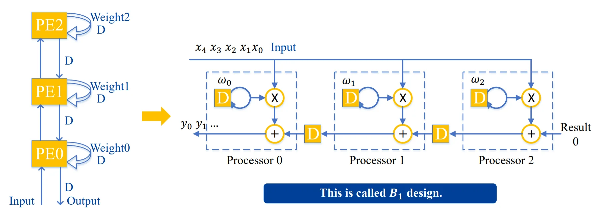

这是为您整理的《VLSI数字通信原理与设计》第八章——**板块三：典型应用案例分析**的学习笔记。

---

## 三、典型应用案例分析 (Applications)

本部分通过 FIR 滤波器和卷积神经网络（CNN）两个典型案例，展示如何利用线性映射技术设计不同的脉动阵列架构。

### 3.1 FIR 滤波器脉动阵列设计 (FIR Systolic Arrays)

根据投影矢量 $d$、处理器空间矢量 $p$ 和调度矢量 $s$ **选取方案**的不同，FIR 滤波器可以衍生出多种脉动架构设计：

#### 3.1.1 B1 设计方案 (Broadcast Inputs, Move Results, Weights Stay)

*   **矢量选择：** $d^T = (1, 0), p^T = (0, 1), s^T = (1, 0)$。
*   **性能：** 由于 $|s^T d| = 1$，其 **硬件利用效率 (HUE) 为 100%**。
*   **边缘映射特性：**
    *   **输入 $x$：** 前向广播 (Input  forward)，无延迟单元 ($s^Te=0$)。
    *   **权重 $w$：** 固定在 PE 中 (Weights  stay)，内部循环有延迟。
    *   **结果 $y$：** 向后移动 (Result  backward)，PE 间包含延迟单元 ($s^Te=1$)。

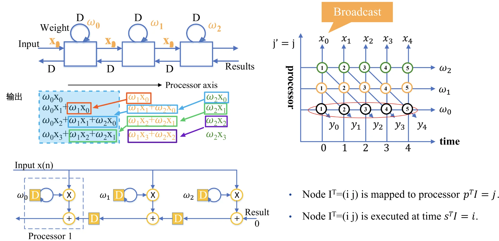

#### 3.1.2 B2 设计方案 (Broadcast Inputs, Move Weights, Results Stay)

*   **矢量选择：** $d^T = (1, -1), p^T = (1, 1), s^T = (1, 0)$。
*   **性能：** $HUE = 100\%$。
*   **边缘映射特性：** 输入 $x$ 广播，权重 $w$ 移动，结果 $y$ 固定在 PE 内。

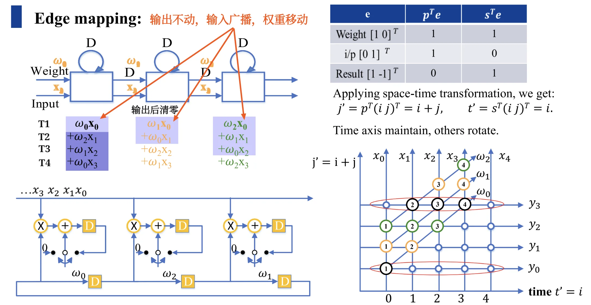

#### 3.1.3 F 设计与 R1 设计

**F 设计 (Fan-In Results)：** **结果反向广播**，输入移动，权重固定。$s^T = (1, 1)$，输入和权重均带有延迟单元。

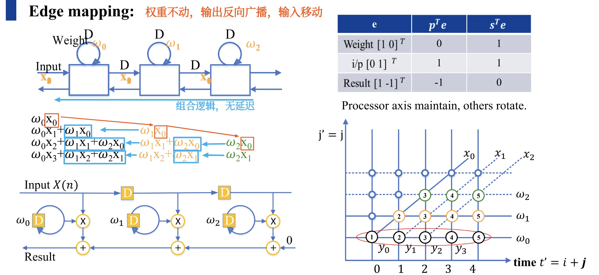

**R1 设计：** 结果固定，输入与权重以**相反方向**移动。其特点是 $s^T d = 2$，导致 **$HUE = 50\%$**，即 PE 每两个时钟周期才执行一次有效计算。

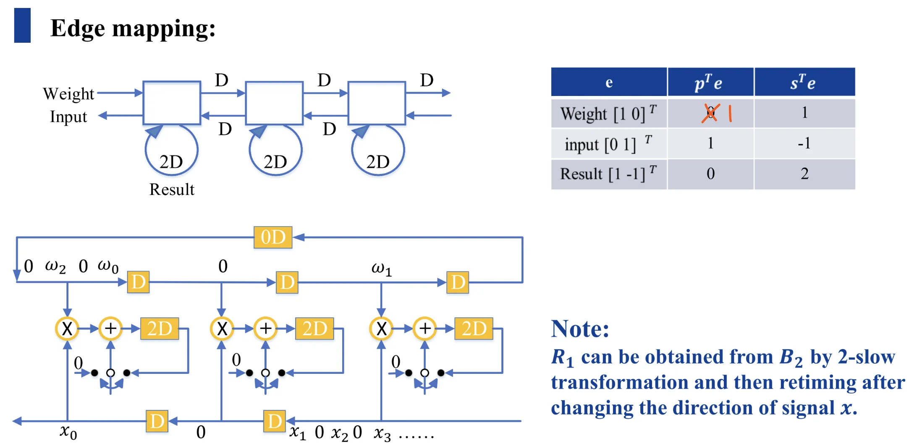
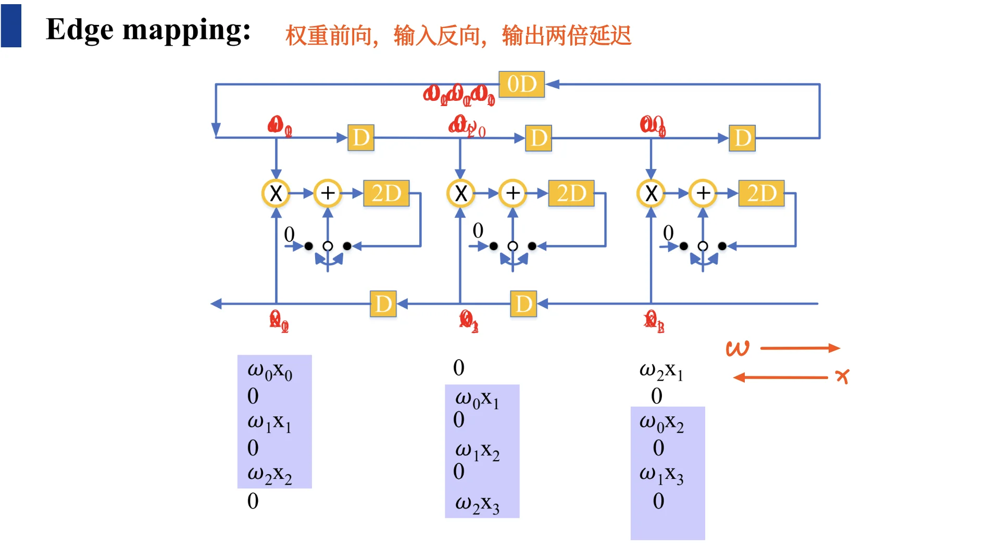

**注：** R1 设计可以通过对 B2 设计进行 2-slow 变换并**重定时**（Retiming）得到。

---

### 3.2 卷积神经网络 (CNN) 硬件设计

在 CNN 加速器设计中，脉动阵列的核心目标是实现**数据复用 (Data Reuse)**，以减少对外部存储（DRAM）的访问带宽需求。

#### 3.2.1 行固定 (Row-Stationary, RS) 卷积设计
这是 Eyeriss 等高效能加速器采用的核心策略，旨在最大化利用 PE 内部的寄存器堆 (Register File)。

**数据复用策略：**

1. **卷积核复用 (Filter Reuse)：** 同一卷积核参数在水平方向上的 PE 间复用。
2. **特征图复用 (Fmap Reuse)：** 特征图变量沿 PE 阵列的**对角线方向**复用。
3. **部分和累加 (Partial Sum Accumulation)：** 计算出的部分和在**垂直方向**上进行移位累加。

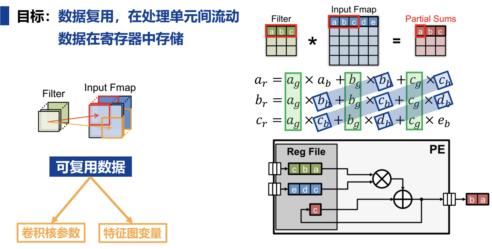

#### 3.2.2 维度扩展
*   **一维到二维：** 通过将一维行固定设计进行排布，可以处理更大规模的卷积运算（如 $3 \times 3$ 卷积核处理 $5 \times 5$ 特征图）。
*   **能效优化：** 通过这种脉动阵列的数据流控制，相比于传统设计，能量效率可以得到显著提升。

更详细的示意图见 [cnn.md](./cnn.md)
