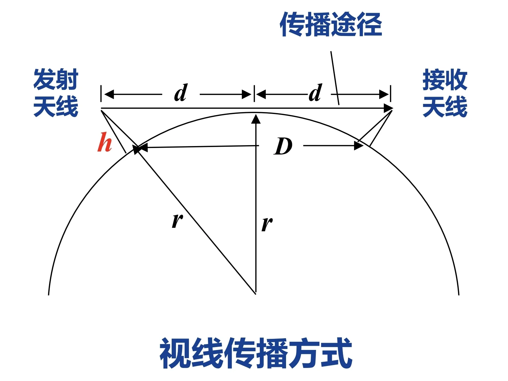
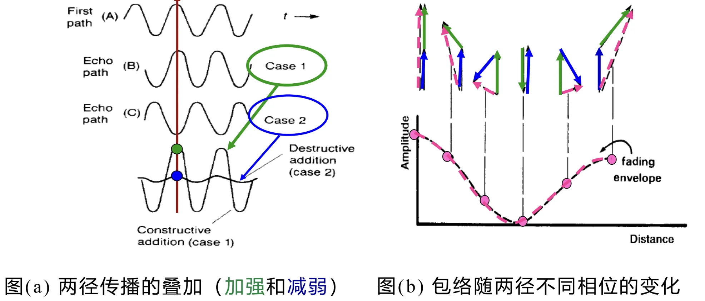
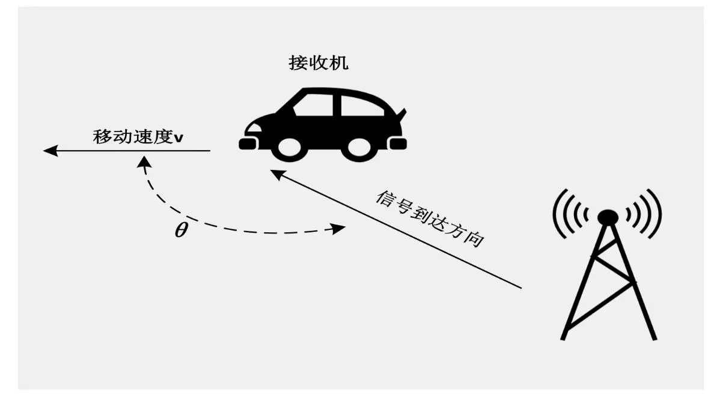

# 第九章：衰落信道

---

## I. 信道基本概念
### 1.1 信道的定义与核心分类
**核心定义**：信道是电信号传输的媒质/通道，是数字通信系统中连接发射机与接收机的关键环节，其特性直接决定信号传输质量与系统传输极限。
**按传输媒质核心分类**

| 信道类型 | 核心定义 | 典型代表 | 信道属性 |
|---|---|---|---|
| 有线信道 | 以有形线缆为传输媒质 | 明线、对称电缆、同轴电缆、光纤 | 恒参信道 |
| 无线信道 | 以自由空间/大气层为传输媒质 | 地波、天波、视距中继、卫星中继、移动无线电信道 | 多为变参（时变）信道 |
  
**补充分类（按信道参数时变特性）**

- **恒参信道**：**信道参数基本不随时间变化**，传输特性稳定
- **变参信道（时变信道）**：**信道参数随时间动态变化，是本章衰落信道的核心研究对象**

### 1.2 有线信道（恒参信道）详解
本部分为恒参信道核心类型，是基带有线传输系统VLSI设计的信道基础。

1.  **明线**
    平行架设在地面杆路上的裸导线，是早期有线传输介质，目前已逐步被替代。
2.  **对称电缆（双绞线）**
    
    - 结构：由多对相互扭绞的绝缘导体组成，分为非屏蔽双绞线(UTP)和屏蔽双绞线(STP)
    - 核心特点：扭绞结构减小线对间电磁干扰；UTP成本低、易安装，STP抗噪声能力更强
    - 缺点：传输衰减大、传输距离短，存在邻道串话干扰
    - 典型应用：电话线路、局域网综合布线
3.  **同轴电缆**
   
    - 结构：由内芯金属导线、绝缘层、金属编织网外导体、保护套同轴嵌套组成
    - 核心优势：相比双绞线，抗电磁干扰能力更强、传输带宽更宽、速率更高
    - 分类与应用：
      - 基带同轴电缆：50Ω阻抗，用于数字基带传输，速率可达10Mb/s，传输距离小于几千米
      - 宽带（射频）同轴电缆：75Ω阻抗，用于模拟信号传输，典型应用为有线电视(CATV)系统，传输距离可达几十千米
4.  **光纤**
    
    - 结构：核心由纤芯和包层组成，按折射率分为阶跃型、梯度型；按传输模式分为多模光纤、单模光纤
    - 核心优势：传输带宽极宽、通信容量大；传输衰减小（<0.2 dB/km），无中继传输距离可达数百公里
    - 局限性：材质易碎、接口成本高、安装与维护需专业技能
    - 典型应用：长途电话网、有线电视网的主干传输线路

### 1.3 无线信道（变参信道）传播基础
#### 1.3.1 地球大气层结构（无线传播的环境基础）

| 大气层分层 | 高度范围 | 对无线传播的核心作用 |
|---|---|---|
| 对流层 | 0~10 km | 主要影响视距、散射传播，是地面移动通信的核心传播区域 |
| 平流层 | 10~60 km | 可用于平流层通信中继 |
| 电离层 | 60~400 km | 可反射短波频段电磁波，是天波传播的核心媒介 |

#### 1.3.2 无线电磁波的核心传播方式

| 传播方式 | 频率范围 | 核心特性 | 典型应用 |
|---|---|---|---|
| 地波 | < 2 MHz | 具备绕射能力，可沿地球表面传播 | AM广播 |
| 天波 | 2~30 MHz | 可被电离层反射，单跳传输距离最大可达4000 km | 远程短波通信 |
| 视线传播 | > 30 MHz | 直线传播，可穿透电离层，传输距离与天线高度强相关 | 卫星/外太空通信、超短波/微波通信、地面移动通信 |

视线传播关键公式：
收发天线架设高度为 $h$ 时，最远通信距离 $D$ 满足工程估算公式:
  
$$h \approx \frac{D^2}{50} \quad (m)$$

其中\(D\)为收发天线间距离，单位为km。

示例：收发天线高度均为40m时，最远通信距离可达44.7 km。

#### 1.3.3 增大视线传播距离的工程途径

1.  **微波中继（微波接力）**：单跳传输距离30~50km，远距离通信需搭建多个中继站；优势为容量大、投资少、维护方便、传输质量稳定，典型应用为远距离话音/电视信号传输。
2.  **卫星中继**：采用地球静止轨道卫星（距地面36000公里）；优势为通信容量大、传输距离远、覆盖范围广；局限性为传输延时大、信号衰减大、造价高。
3.  **平流层通信**：利用平流层平台实现中继传输。

### 1.4 信道噪声与加性干扰

**核心定义**：噪声是信道中**独立于信号**始终存在的无用电信号，又称**加性干扰**；会导致**信号失真、码元错误**，是限制系统传输速率的核心因素之一。
**噪声分类**

1. 按噪声来源分类：人为噪声、自然噪声、内部噪声（如热噪声）
2. 按噪声性质分类：脉冲噪声、窄带/单频噪声、起伏噪声（热噪声、散弹噪声、宇宙噪声）

**重点：热噪声**

- 来源：一切电阻性元器件中电子的热运动
- 频谱特性：均匀分布在 $0~10^{12}\text{Hz}$ 频率范围内，属于**高斯白噪声**

电压有效值计算公式：
    
$$V = \sqrt{4kTRB} \quad (V)$$

式中：\(k=1.38×10^{-23} J/K\)（玻尔兹曼常数），\(T\)为热力学温度，\(R\)为电阻阻值，\(B\)为系统带宽。

### 1.5 信道特性对信号传输的核心影响
#### 1.5.1 恒参信道的影响
核心失真类型：

1. **频率失真**：由**信道振幅-频率特性**不良引起，会导致波形畸变，进而产生**码间串扰**，是基带数字传输的核心失真来源
2. **相位失真**：由信道相位-频率特性不良引起，对语音信号影响小，对数字信号传输影响极大，同样会引发码间串扰
3. 其他失真：非线性失真、频率偏移、相位抖动等

解决方案：采用**线性网络（均衡器）进行补偿**，是基带接收机VLSI设计的核心模块之一。

#### 1.5.2 变参信道的影响

变参信道是本章衰落信道的核心研究对象，其核心特性为：

1. 信号衰减随时间动态变化
2. 存在**多径效应**：信号经**多条路径到达接收端**，每条路径的**时延、衰减**均随时间变化
3. 存在**多普勒效应**：**收发端相对运动**导致接收信号频率发生偏移
上述两个效应是无线信道衰落的核心根源，也是后续章节的核心内容。

---

## II. 电磁波的传播
### 2.1 电磁波的核心物理关系
电磁波频率与波长的核心换算公式：

$$f = \frac{c}{\lambda}$$

式中：

- \(f\)：电磁波频率，单位为赫兹(Hz)
- \(c\)：电磁波在自由空间的传播速度，恒定为\(3×10^8 m/s\)
- \(\lambda\)：电磁波波长，单位为米(m)

> 核心规律：频率越高，波长越短，电磁波的绕射能力越弱，直线传播特性越强。

### 2.2 无线电波频段与微波细分频段划分
#### 2.2.1 无线电波全频段划分

| 频段名称 | 频段范围（含上限） | 对应波长 |
|---|---|---|
| 极低频(ELF) | 3Hz~30Hz | 极长波（100兆米~10兆米） |
| 超低频(SLF) | 30Hz~300Hz | 超长波（10兆米~1兆米） |
| 特低频(ULF) | 300Hz~3000Hz | 特长波（100万米~10万米） |
| 甚低频(VLF) | 3KHz~30KHz | 甚长波（10万米~1万米） |
| 低频(LF) | 30KHz~300KHz | 长波（10千米~1千米） |
| 中频(MF) | 300KHz~3MHz | 中波（1千米~100米） |
| 高频(HF) | 3MHz~30MHz | 短波（100米~10米） |
| 甚高频(VHF) | 30MHz~300MHz | 米波（10米~1米） |
| 超高频(UHF) | 300MHz~3GHz | 分米波（10分米~1分米） |
| 超高频(SHF) | 3GHz~30GHz | 厘米波（10厘米~1厘米） |
| 极高频(EHF) | 30GHz~300GHz | 毫米波（10毫米~1毫米） |
| 至高频 | 300GHz~3000GHz | 亚毫米波（丝米波） |

#### 2.2.2 微波频段定义与细分

**核心定义**：**频率 $300M\text{Hz} \sim 3000G\text{Hz}$、波长$1\text{m}\sim 0.1\text{mm}$的电磁波统称为微波**，覆盖分米波、厘米波、毫米波、亚毫米波四个波段。

微波细分波段代号与参数（通信系统常用）：

| 波段代号 | 标称波长(cm) | 频率范围(GHz) | 波长范围(cm) |
|---|---|---|---|
| L | 22 | 1~2 | 30~15 |
| S | 10 | 2~4 | 15~7.5 |
| C | 5 | 4~8 | 7.5~3.75 |
| X | 3 | 8~12 | 3.75~2.5 |
| Ku | 2 | 12~18 | 2.5~1.67 |
| K | 1.25 | 18~27 | 1.67~1.11 |
| Ka | 0.80 | 27~40 | 1.11~0.75 |
| U | 0.60 | 40~60 | 0.75~0.5 |
| V | 0.40 | 60~80 | 0.5~0.375 |
| W | 0.30 | 80~100 | 0.375~0.3 |

### 2.3 电磁波的5种核心传播机制（多径效应的物理根源）
无线信道的多径衰落，本质是电磁波不同传播机制产生的多路信号叠加的结果，5种核心传播机制如下：

**(1) 直射**
- 定义：视距范围内**无遮挡的直线传播**，是无线信道的主径信号
- 发生条件：收发端之间无障碍物遮挡，满足视距传播条件

**(2) 反射**
- 定义：电磁波遇到比波长大得多的物体时发生的镜面反射
- 发生场景：地球表面、建筑物墙面、墙体表面等，是多径信号的核心来源之一

**(3) 绕射**
- 定义：**收发端传输路径被尖利的障碍物边缘阻挡时，信号能量绕过障碍物继续传播的现象**
- 核心作用：可实现非视距场景下的信号覆盖，是阴影区域信号的主要来源

**(4) 散射**
- 定义：电波传播遇到**小于信号波长的障碍物或粗糙表面时，发生的漫反射现象**
- 发生场景：空气中的**尘埃、粗糙的墙面、植被**等，会产生大量漫散射的多径子信号

**(5) 透射**
- 定义：**电磁波照射到物体时，部分能量穿透物体继续传播的现象**
- 典型场景：室内接收室外基站信号，信号穿透墙体、门窗等障碍物进入室内

> 核心结论：上述5种传播机制，使得无线接收机接收到的信号是直射、反射、绕射、散射、透射等多路信号的叠加，这就是多径效应的物理根源，也是后续多径衰落的核心成因。

---

## III. 无线信道的多径效应
> 本章核心：多径效应是无线变参信道**频率选择性衰落**的物理根源，直接决定基带信号传输的码间串扰水平，是数字接收机均衡器、RAKE接收机等模块VLSI设计的核心理论依据。

### 3.1 衰落与多径衰落的核心定义
#### 3.1.1 信道衰落的通用定义
信道的**衰落（fading）**，是指无线通信**信道特征的动态变化，引起接收机接收信号强度随时间、位置发生随机起伏的现象**。

- 核心特点：信号幅度在短时间/短距离内发生急剧变化，是无线信道区别于有线恒参信道的核心特征。
- 两大核心成因：多径效应（本章核心）、多普勒效应（第四章核心）。

#### 3.1.2 多径衰落的定义与产生机理
**多径衰落**：无线接收机接收到的来自不同传播路径的多路信号叠加后，合成信号的幅度随时间、位置发生剧烈起伏的现象。

**核心成因**
发射的电磁波经直射、反射、绕射、散射、透射等多种传播机制，形成多条传播路径的子信号；不同路径的子信号**传播时延不同、相位不同**，到达接收端时会发生相干叠加：

- **相长干涉**：多路子信号相位同向，合成信号幅度增强，接收功率上升；
- **相消干涉**：多路子信号相位反向，合成信号幅度抵消，接收功率急剧下降。

**极简示例（两径传播模型）**

仅考虑1条直射径+1条反射径：两条路径的信号相位差随传播距离变化时，合成信号包络会在最大值（两路同相）和最小值（两路反相）之间剧烈波动，直接形成包络衰落。

### 3.2 多径信道时域核心参数：时延扩展

时延扩展是对多径信道时域色散特性的**统计量化描述**，是衡量多径效应严重程度的核心指标，分为**平均附加时延**和**均方根（RMS）时延扩展**。

#### 3.2.1 核心定义与计算公式
设多径信道中，第\(k\)条路径的信号时延为\(\tau_k\)，对应接收信号功率为\(P(\tau_k)\)，则：
**(1) 平均附加时延**
所有多径信号的**时延加权平均值**，权重为**对应路径的信号功率**：

$$\overline{\tau} = \frac{\sum_{k} P(\tau_k) \cdot \tau_k}{\sum_{k} P(\tau_k)}$$

**(2) 均方根（RMS）时延扩展**
简称时延扩展，用\(\sigma_\tau\)（或\(\tau_{RMS}\)）表示，是衡量多径信号时延离散程度的核心指标，也是后续计算相干带宽的核心参数：

$$\overline{\tau^2} = \frac{\sum_{k} P(\tau_k) \cdot \tau_k^2}{\sum_{k} P(\tau_k)}$$
    
$$\sigma_\tau = \tau_{RMS} = \sqrt{\overline{\tau^2} - (\overline{\tau})^2}$$

#### 3.2.2 实例完整计算
**已知条件**：
多径信道的4条路径参数如下表：

| 路径序号 | 时延\(\tau_k\)（\(\mu s\)） | 接收功率（dB） | 线性功率值\(P(\tau_k)\) |
|---|---|---|---|
| 1 | 0 | 0 dB | \(10^{0/10}=1\) |
| 2 | 5 | -10 dB | \(10^{-10/10}=0.1\) |
| 3 | 6 | -10 dB | \(10^{-10/10}=0.1\) |
| 4 | 15 | -20 dB | \(10^{-20/10}=0.01\) |

**计算过程**：
(1) 计算平均附加时延\(\overline{\tau}\)：

$$\overline{\tau} = \frac{1 \cdot 0 + 0.1 \cdot 5 + 0.1 \cdot 6 + 0.01 \cdot 15}{1 + 0.1 + 0.1 + 0.01} = \frac{1.25}{1.21} \approx 1.03 \ \mu s$$

(2) 计算二阶矩\(\overline{\tau^2}\)：

$$\overline{\tau^2} = \frac{1 \cdot 0^2 + 0.1 \cdot 5^2 + 0.1 \cdot 6^2 + 0.01 \cdot 15^2}{1.21} = \frac{8.35}{1.21} \approx 6.9 \ \mu s^2$$

(3) 计算RMS时延扩展\(\sigma_\tau\)：

$$\sigma_\tau = \sqrt{6.9 - (1.03)^2} = \sqrt{6.9 - 1.06} \approx 2.42 \ \mu s$$

#### 3.2.3 典型场景的时延扩展参考值
不同传播环境的时延扩展差异极大，直接决定无线系统的符号速率上限：

| 场景 | 典型RMS时延扩展\(\sigma_\tau\) |
|---|---|
| 室内环境 | 150 ns ~ 1 \(\mu s\) |
| 城市市区 | 1 \(\mu s\) ~ 5 \(\mu s\) |
| 郊区环境 | 5 \(\mu s\) ~ 25 \(\mu s\) |

### 3.3 多径信道频域核心参数：相干带宽

**相干带宽**（\(B_c\)）是**时延扩展在频域的对偶参数**，描述多径信道的频率相关性，是划分平衰落/频率选择性衰落的核心依据。

#### 3.3.1 核心定义
相干带宽是指：接收信号在**该频带范围内，任意两个频率分量的相关系数不小于0.5**；在相干带宽内，信号的不同频率**分量具有很强的幅度相关性，会经历近似相同的衰落**。

#### 3.3.2 核心公式与时域-频域对偶关系
相干带宽与时延扩展呈**反比关系**，工程上常用的估算公式为：

$$B_c \approx \frac{1}{5\sigma_\tau}$$

时域-频域对偶核心规律：

| 时域参数 | 频域参数 | 核心对应关系 |
|---|---|---|
| RMS时延扩展\(\sigma_\tau\) | 相干带宽\(B_c\) | **\(\sigma_\tau\)越大，多径时延越分散，\(B_c\)越小，信道频率选择性越强** |
| 时域色散 | 频域选择性衰落 | 多径效应引发时域码间串扰，等价于频域频率选择性衰落 |

#### 3.3.3 课件实例计算
沿用3.2.2节的实例，\(\sigma_\tau=2.42 \ \mu s\)，则信道相干带宽为：

$$B_c \approx \frac{1}{5 \times 2.42 \times 10^{-6}} \approx 82.6 \ kHz$$

### 3.4 多径衰落的两大类型：平衰落 vs 频率选择性衰落
根据传输信号带宽与信道相干带宽的相对大小，可将多径衰落分为**平衰落（平坦衰落）**和**频率选择性衰落**两类，二者的判定条件、信道特性、系统影响完全不同。

#### 3.4.1 核心判定规则与特性对比

| 特性维度 | 平衰落（平坦衰落） | 频率选择性衰落 |
|---|---|---|
| **核心判定条件** | **信号带宽\(B_s\) < 信道相干带宽\(B_c\)** | **信号带宽\(B_s\) > 信道相干带宽\(B_c\)** |
| **时域对应条件** | 码元周期\(T_s\) > 信道最大多径时延差 | 码元周期\(T_s\) < 信道最大多径时延差 |
| **信道特性** | 信号所有频率分量经历相同的衰落，幅度同比例起伏，信号频谱形状保持不变 | 信号不同频率分量经历不同的衰落，部分频率分量被增强，部分被深度衰减，信号频谱形状发生畸变 |
| **对数字信号的核心影响** | 仅信号整体幅度衰减，无明显码间串扰 | 多径信号跨码元叠加，产生严重**码间串扰**，是基带传输误码的核心来源 |
| **典型场景** | 窄带通信系统（如语音对讲机、低速物联网） | 宽带通信系统（如4G/5G、高速数字传输） |

#### 3.4.2 实例分析
**已知条件**：

- 信道相干带宽\(B_c \approx 82.6 \ kHz\)（3.3.3节计算结果）
- 调制方式：QPSK（信号带宽\(B_s\)等于符号速率\(R_s\)）
- 两种符号速率场景：\(R_{s1}=10 \ k\)波特，\(R_{s2}=100 \ k\)波特

**判定过程**：

场景1：\(R_{s1}=10 \ k\)波特，信号带宽\(B_{s1}=10 \ kHz\)
因\(B_{s1}=10 \ kHz < B_c=82.6 \ kHz\)，**该信道为平衰落信道**。

场景2：\(R_{s2}=100 \ k\)波特，信号带宽\(B_{s2}=100 \ kHz\)
因\(B_{s2}=100 \ kHz > B_c=82.6 \ kHz\)，**该信道为频率选择性衰落信道**。

### 3.5 多径效应对数字通信系统的工程影响
1.  **码间串扰的核心根源**：频率选择性衰落会导致前一个码元的多径信号叠加到当前码元上，产生严重码间串扰，直接提升系统误码率；需在基带接收机中设计均衡器模块消除，是数字通信VLSI设计的核心模块之一。
2.  **误码率地板效应**：当多径效应严重时，即使提升发射信号的信噪比，也无法将误码率降低到系统要求的阈值以下，形成误码率地板，限制了系统的最高传输速率。

## IV. 无线信道的多普勒效应
> 本章核心：多普勒效应是无线信道**时变特性（时间选择性衰落）**的物理根源，直接决定高速移动场景下的载波同步、解调性能，是基带接收机中频偏估计、载波同步、信道跟踪模块VLSI设计的核心理论依据，与你已学的调制解调、基带同步技术直接相关。

### 4.1 多普勒效应的核心原理与无线场景适配
#### 4.1.1 通用多普勒效应定义
多普勒效应由奥地利物理学家多普勒于1842年提出，核心物理规律为：**波源与观测者存在相对运动时，观测者接收到的波的波长、频率会发生偏移**。

相对运动规律：

1.  波源向观测者运动时，**波长被压缩、频率升高**；
2.  波源远离观测者运动时，**波长被拉伸、频率降低**。

#### 4.1.2 无线通信场景的适配
在无线数字通信系统中，多普勒效应的核心表现为：**发射机与接收机的相对运动，导致接收端的载波频率发生偏移（多普勒频移）**，是高速移动场景下信号失真、误码率上升的核心原因。

典型场景：高铁移动通信、车载通信、高速移动的手持终端，均会产生显著的多普勒频移。

### 4.2 多普勒频移核心公式、影响因素与实例计算
多普勒频移是量化多普勒效应严重程度的核心参数，是后续计算相干时间、判定快/慢衰落的基础。

#### 4.2.1 核心定义与计算公式

**(1) 多普勒频移核心公式**

设发射载波频率为\(f_t\)，接收载波频率为\(f_r\)，多普勒频移为\(f_d\)，则：
    
$$f_d = \frac{v}{\lambda} \cos\theta$$
    
$$f_r = f_t \left(1 - \frac{v}{c} \cos\theta\right) = f_t - f_d$$

式中各参数定义：

- \(v\)：收发端的**相对移动速度**，单位为\(m/s\)；
- \(\lambda\)：载波波长，单位为\(m\)，满足\(\lambda = \frac{c}{f_t}\)，\(c=3×10^8 m/s\)为光速；
- \(\theta\)：电磁波**到达方向**与接收机**移动方向**的夹角；
- \(\cos\theta\)：速度方向在电磁波传播方向上的投影系数。

**(2) 核心影响规律**

**夹角\(\theta\)的影响**：

- 当\(\theta=0^\circ\)（接收机**正对**发射机运动），\(\cos\theta=1\)，多普勒频移达到**最大值**\(f_{d,max}=\frac{v}{\lambda}\)；

- 当\(\theta=90^\circ\)（接收机移动方向与电磁波到达方向垂直），\(\cos\theta=0\)，多普勒频移为**0**；

- 当\(\theta=180^\circ\)（接收机远离发射机运动），\(\cos\theta=-1\)，多普勒频移达到**负向最大值**\(f_{d,min}=-\frac{v}{\lambda}\)。

**载波频率的影响**：
载波频率越高（波长越短），相同移动速度下多普勒频移越大；例如5G毫米波频段（28GHz/39GHz）的多普勒频移，远大于2G/3G的1.9GHz频段。

**移动速度的影响**：
相对移动速度越快，多普勒频移越大，信道时变特性越显著。

#### 4.2.2 实例计算
**已知条件**：

1.  载波频率\(f_c=1900 MHz\)，对应波长\(\lambda=\frac{3×10^8}{1.9×10^9}≈0.1579 m\)；
2.  高铁时速\(v=350 km/h\)，换算为国际单位：\(v=350÷3.6≈97.22 m/s\)；
3.  高铁正对基站运动，即\(\theta=0^\circ\)，\(\cos\theta=1\)。

**多普勒频移计算**：

$$f_d = \frac{v \cos\theta}{\lambda} = \frac{97.22×1}{0.1579} ≈ 616 Hz$$

> 核心结论：350km/h的高铁在1.9GHz频段下，会产生616Hz的载波频偏，若**不做校正，会直接导致QPSK等调制方式的解调完全失效**。

### 4.3 时变信道时域核心参数：相干时间
**相干时间** \(T_c\) 是**多普勒频移在时域的对偶参数**，描述无线信道的时变速率，是划分慢衰落/快衰落的核心依据，与第三章的相干带宽形成完整的时频域对偶体系。

#### 4.3.1 核心定义

相干时间是指：在**此时间间隔内，对接收信号复包络的任意两个时刻采样值，相关系数不小于0.5**；**在相干时间内，信道的传输特性近似保持不变，接收信号幅值具有强相关性**。
核心物理意义：相干时间是信道特性保持稳定的最大时间窗口，度量了信道的时变快慢程度。

#### 4.3.2 核心公式与对偶关系
相干时间与最大多普勒频移呈**反比关系**，工程上常用的估算公式为：

$$T_c \approx \frac{0.5}{f_d}$$

时域-频域对偶核心规律（与第三章对应）：

| 频域参数 | 时域对偶参数 | 核心对应关系 |
|---|---|---|
| 最大多普勒频移\(f_d\) | 相干时间\(T_c\) | \(f_d\)越大，多普勒效应越显著，\(T_c\)越小，信道时变越快 |
| 频率选择性衰落 | 时间选择性衰落 | 多普勒效应引发频域载波偏移，等价于时域信道的快速时变 |

#### 4.3.3 实例计算
沿用4.2.2节的高铁场景，\(f_d=616 Hz\)，则信道相干时间为：

$$T_c \approx \frac{0.5}{616} ≈ 0.8 ms$$

行人场景：行走速度\(v=4 km/h≈1.11 m/s\)，对应\(f_d≈7 Hz\)，则相干时间为：

$$T_c \approx \frac{0.5}{7} ≈ 71.4 ms$$

### 4.4 时变衰落的两大类型：慢衰落 vs 快衰落
根据信道相干时间\(T_c\)与传输信号的码元周期\(T_s\)的相对大小，可将时变衰落分为**慢衰落**和**快衰落**两类，二者的判定条件、信道特性、系统设计要求完全不同，与第三章的平衰落/频率选择性衰落形成二维衰落分类体系。

#### 4.4.1 核心判定规则与特性对比

| 特性维度 | 慢衰落 | 快衰落 |
|---|---|---|
| **核心判定条件** | **相干时间\(T_c\) ≥ 码元周期\(T_s\)** | **相干时间\(T_c\) < 码元周期\(T_s\)** |
| **频域对应条件** | **最大多普勒频移\(f_d\) < 符号速率\(R_s\)** | **最大多普勒频移\(f_d\) > 符号速率\(R_s\)** |
| **信道特性** | 信道特性在**多个连续码元周期内保持稳定**，仅随时间缓慢变化 | 信道特性在**单个码元周期内就会发生多次变化，信道时变极快** |
| **对数字信号的核心影响** | 仅导致信号整体幅度的慢起伏，对解调影响小，仅需慢速信道跟踪 | 码元内信道特性突变，载波频偏严重，解调相位跟踪失效，产生严重误码 |
| **误码率核心来源** | 信噪比损失 | 信道时变引发的相位失真、载波失步 |
| **典型场景** | 低速移动（行人步行）、静态WiFi、固定无线通信 | 高铁通信、车载高速通信、低符号率窄带系统 |

#### 4.4.2 课件实例完整判定分析
**已知条件**：

- GSM系统，载频\(f_c=1900 MHz\)，码元速率\(R_s=1 k\)波特，对应码元周期\(T_s=\frac{1}{R_s}=1 ms\)；
- 两种移动场景：高铁350km/h（\(f_d=616 Hz\)，\(T_c≈0.8 ms\)）、行人4km/h（\(f_d≈7 Hz\)，\(T_c≈71.4 ms\)）。

**判定过程**：

1.  高铁场景：\(T_c≈0.8 ms < T_s=1 ms\)，**该信道为快衰落信道**；
2.  行人场景：\(T_c≈71.4 ms > T_s=1 ms\)，**该信道为慢衰落信道**。

### 4.5 多普勒效应的系统影响与工程解决方案
#### 4.5.1 对数字通信系统的核心影响

1.  **误码率显著上升**：移动速度越快，多普勒频移越大，载波同步误差越大，系统误码率越高。
2.  **载波同步失效**：大频偏会导致接收机本地载波与接收载波失步，直接造成PSK/QAM等相位调制方式的解调完全错误，是高速移动场景下通信中断的核心原因。
3.  **信道估计精度下降**：快衰落场景下，信道特性在码元内快速变化，基于导频的信道估计结果无法匹配当前码元的信道状态，导致均衡、解调性能恶化。

#### 4.5.2 工程解决方案（课件核心方案）
针对多普勒频移与快衰落的核心解决方案是**基于导频的频偏估计与校正**，也是当前无线通信系统的主流实现方案，适配VLSI硬件实现。

**核心原理**：在发送的数据帧中**插入收发两端均已知的导频符号**，接收端利用导频符号估计出信道的多普勒频偏，再通过载波校正模块消除频偏，完成载波同步。

**实现流程**：

- 发送端：在数据帧中**按固定间隔插入导频符号**，形成「导频+数据」的帧结构；
- 接收端：先基于导频符号完成频偏估计，计算出当前信道的多普勒频偏值；
- 频偏校正：通过数控振荡器（NCO）、相位旋转器等硬件模块，消除接收信号中的频偏，再进行后续的解调、译码操作。

**补充抗衰落方案**：针对快衰落场景，还可采用分集接收、符号内多次信道采样、自适应调制编码等技术，进一步提升系统性能。

---

## V. 本章核心知识点汇总
### 5.1 多径衰落核心公式与判定规则速记

(1) **核心参数：** RMS时延扩展\(\sigma_\tau\) ↔ 相干带宽\(B_c≈\frac{1}{5\sigma_\tau}\)
(2) **衰落判定：**

- 平衰落：信号带宽\(B_s < B_c\)
- 频率选择性衰落：信号带宽\(B_s > B_c\)

(3) **核心影响：** 频率选择性衰落是码间串扰的根源，需均衡器消除。

### 5.2 多普勒效应核心公式与判定规则速记

(1) **核心参数：** 多普勒频移\(f_d=\frac{v}{\lambda}\cos\theta\) ↔ 相干时间\(T_c≈\frac{0.5}{f_d}\)
(2) **衰落判定：**

- 慢衰落：相干时间\(T_c ≥ 码元周期T_s\)
- 快衰落：相干时间\(T_c < 码元周期T_s\)

(3) **核心影响：** 快衰落导致载波失步、误码率上升，需导频+频偏校正解决。

