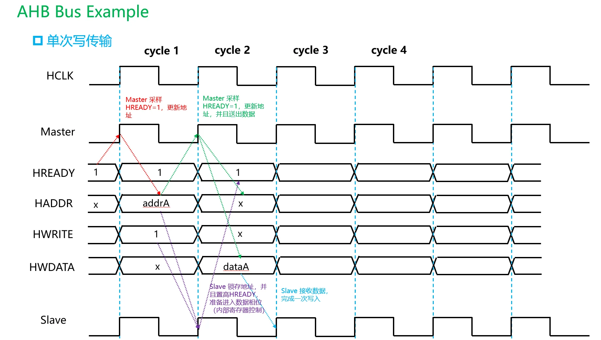
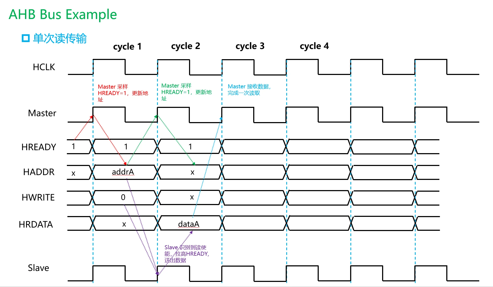
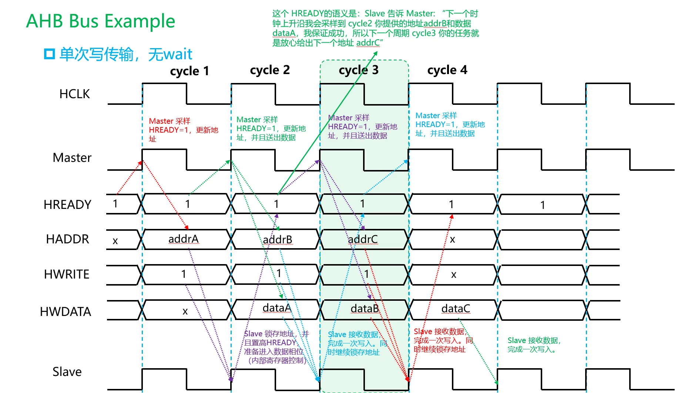
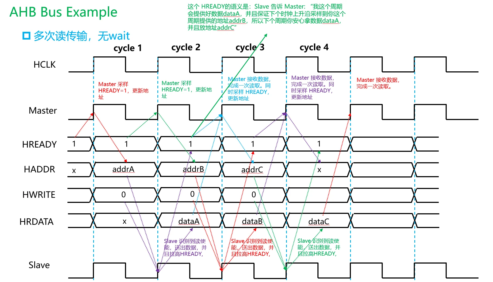
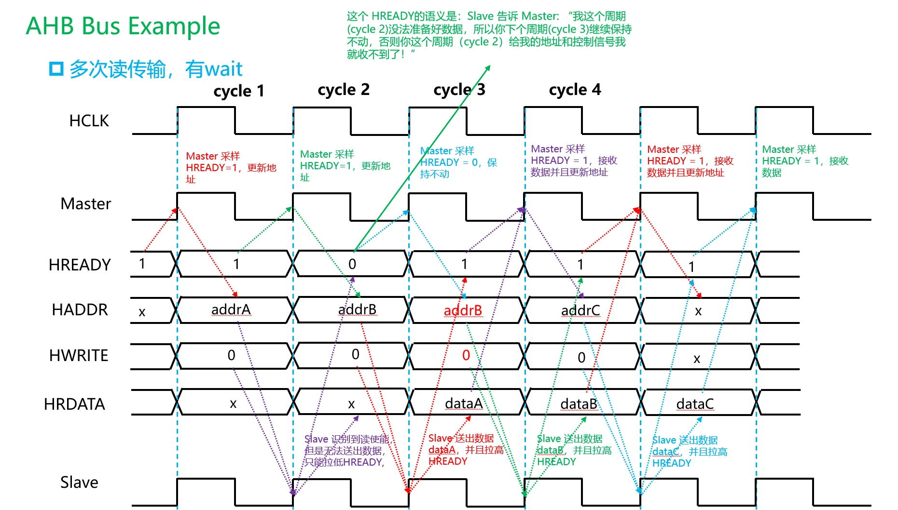
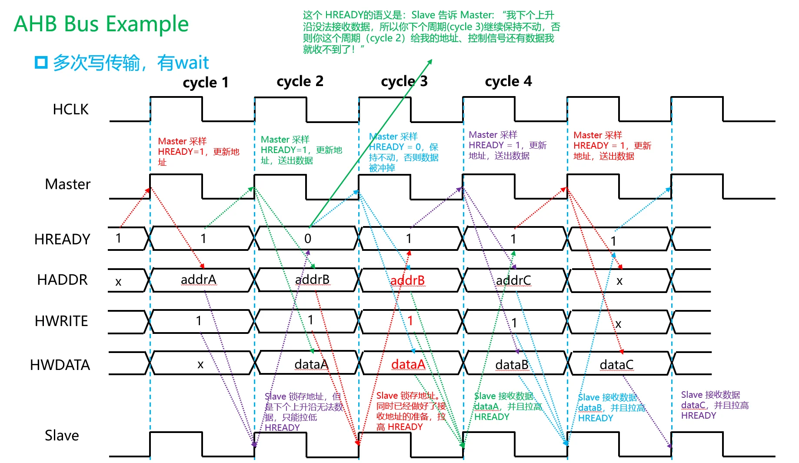

# AHB 协议基础

下面主要讲 **AMBA AHB / AHB-Lite** 的基本行为。课程里通常重点学的是 **AHB-Lite**：一个 master、多个 slave，通过地址译码选择 slave，不涉及复杂多 master 仲裁。完整 AHB 比 AHB-Lite 多了仲裁、bus request、grant、split/retry 等机制，但**基本传输时序、地址/数据流水、HREADY 控制方式是一致的**。

你可以先把 AHB 理解成一句话：

> **AHB 是一种地址阶段和数据阶段流水重叠的片上总线。当前周期发地址，下一个周期传这个地址对应的数据。**

这是 AHB 最核心的理解点。

---

## 1. AHB 的基本定位

在 AMBA 协议族中：

```text
APB：低速外设总线，简单，两阶段访问，不强调性能
AHB：中高性能系统总线，地址/数据流水，常用于片上主干或桥接
AXI：高性能多通道总线，地址、数据、响应彻底分离
```

AHB 常见用途包括：

```text
CPU / DMA / SRAM / Flash / AHB-to-APB Bridge / 外设控制器
```

它比 APB 高级，因为它支持流水、burst、wait state；
它比 AXI 简单，因为它没有 AXI 那种五个独立通道。

---

## 2. AHB 最核心的结构：地址阶段 + 数据阶段

AHB 的一次传输可以拆成两个阶段：

```text
Address phase：地址阶段
Data phase：数据阶段
```

在地址阶段，master 给出：

```text
HADDR
HTRANS
HWRITE
HSIZE
HBURST
HPROT
```

在数据阶段，根据读写方向传输：

```text
写：HWDATA
读：HRDATA
响应：HREADY / HRESP
```

重点是：

> **AHB 的地址阶段和数据阶段是错开一个周期的。**

也就是：

```text
Cycle N：给出地址 A0 和控制信息
Cycle N+1：传输 A0 对应的数据，同时给出地址 A1
Cycle N+2：传输 A1 对应的数据，同时给出地址 A2
```

这就是 AHB 的流水特征。

---

## 3. 最小例子：连续写两个地址

假设 master 要写：

```text
地址 0x1000 写入 D0
地址 0x1004 写入 D1
```

理想情况下没有 wait state，时序可以理解为：

```text
Cycle:      1          2          3
地址阶段:   A0         A1         IDLE
数据阶段:              D0         D1
```

展开成信号：

```text
Cycle 1:
HADDR  = 0x1000
HWRITE = 1
HTRANS = NONSEQ
HWDATA = 无意义，因为还没有上一笔写数据阶段

Cycle 2:
HADDR  = 0x1004
HWRITE = 1
HTRANS = SEQ 或 NONSEQ，取决于是否属于 burst
HWDATA = D0，对应上一周期的 0x1000

Cycle 3:
HADDR  = 无新传输
HTRANS = IDLE
HWDATA = D1，对应上一周期的 0x1004
```

最容易错的地方就是：

> **HADDR 和 HWDATA 不是同一周期对应的。**

在 AHB 写事务中：

```text
某周期的 HWDATA，对应的是前一个有效地址阶段的 HADDR。
```

---

## 4. AHB 的主要信号总览

下面先整体列出常见信号。以 AHB-Lite 为主。

### 4.1 全局信号

| 信号        | 方向    | 含义    |
| --------- | ----- | ----- |
| `HCLK`    | clock | 总线时钟  |
| `HRESETn` | reset | 低有效复位 |

---

### 4.2 Master 发出的地址和控制信号

| 信号          | 方向             | 含义                         |
| ----------- | -------------- | -------------------------- |
| `HADDR`     | Master → Slave | 地址                         |
| `HTRANS`    | Master → Slave | 当前传输类型                     |
| `HWRITE`    | Master → Slave | 1 表示写，0 表示读                |
| `HSIZE`     | Master → Slave | 每次传输的数据大小                  |
| `HBURST`    | Master → Slave | burst 类型                   |
| `HPROT`     | Master → Slave | 保护属性，例如指令/数据、特权/用户等        |
| `HMASTLOCK` | Master → Slave | locked transfer，简单学习可先了解即可 |
| `HWDATA`    | Master → Slave | 写数据，属于数据阶段                 |

---

### 4.3 Slave 返回的信号

| 信号          | 方向                          | 含义                   |
| ----------- | --------------------------- | -------------------- |
| `HRDATA`    | Slave → Master              | 读数据，属于数据阶段           |
| `HREADYOUT` | Slave → Interconnect/Master | 当前 slave 是否完成数据阶段    |
| `HRESP`     | Slave → Master              | 响应状态，通常 OKAY 或 ERROR |

---

### 4.4 互联/译码相关信号

| 信号       | 含义                           |
| -------- | ---------------------------- |
| `HSELx`  | 某个 slave 是否被地址译码选中           |
| `HREADY` | 全局 ready，表示上一数据阶段是否完成，总线能否推进 |

注意：

```text
HREADYOUT 是某个 slave 输出的 ready。
HREADY 是返回给 master 和所有 slave 的全局 ready。
```

在简单 AHB-Lite 系统里，经常可以近似理解为：

```text
HREADY = 当前被选中的 slave 的 HREADYOUT
```

但严格来说，它通常由 interconnect/mux 根据当前数据阶段对应的 slave 选择出来。

---

## 5. HREADY 是 AHB 里最关键的控制信号

AXI 用 `VALID/READY` 每个通道独立握手；
AHB 没有每个通道的 valid-ready 握手，而是主要靠：

```text
HTRANS 表示有没有有效传输
HREADY 表示当前数据阶段是否完成，总线能否推进
```

你可以把 `HREADY` 理解为：

> **HREADY = 1：当前数据阶段完成，总线可以进入下一拍。**
> **HREADY = 0：当前数据阶段还没完成，整个 AHB 流水线暂停。**

这句话非常重要。

**当 master 在某一个时钟上升沿发现**：

```text
HREADY = 0
```

时，**master 必须保持地址和控制信号稳定**，不能推进到下一笔传输。

也就是：

```text
HADDR
HTRANS
HWRITE
HSIZE
HBURST
HPROT
HWDATA / HRDATA 所属的数据阶段
```

都要按照协议要求保持，直到 `HREADY` 回到 1。

---

## 6. AHB 和 AXI 握手最大的区别

AXI 是：

```text
每个通道 independently VALID && READY
```

例如：

```text
AWVALID/AWREADY
WVALID/WREADY
BVALID/BREADY
ARVALID/ARREADY
RVALID/RREADY
```

AHB 是：

```text
单一流水总线，靠 HTRANS + HREADY 控制传输推进
```

所以 AHB 没有：

```text
AWVALID
WVALID
ARVALID
RVALID
```

这种多通道握手。

AHB 的关键判断是：

```text
当前地址阶段是否有效：看 HTRANS
当前数据阶段是否完成：看 HREADY
```

---

## 7. HTRANS：当前地址阶段是什么类型？

`HTRANS` 是理解 AHB 的核心信号之一。

它通常是 2 bit：

```verilog
HTRANS[1:0]
```

常见编码：

| HTRANS  | 名称     | 含义                      |
| ------- | ------ | ----------------------- |
| `2'b00` | IDLE   | 空闲，没有有效传输               |
| `2'b01` | BUSY   | burst 中插入忙周期，不进行有效数据传输  |
| `2'b10` | NONSEQ | 非连续传输，新的单次传输或 burst 第一拍 |
| `2'b11` | SEQ    | 连续传输，burst 后续拍          |

最常用的是：

```text
IDLE
NONSEQ
SEQ
```

`BUSY` 相对少见，初学可以先理解为：

> master 暂时不能提供下一拍 burst 地址，但又不想结束 burst，于是插入 BUSY。

---

### 7.1 IDLE

`HTRANS = IDLE` 表示当前地址阶段没有有效传输。

例如总线空闲：

```text
HADDR  = 任意或保持
HTRANS = IDLE
HWRITE = 任意或保持
```

slave 看到 `HTRANS = IDLE`，不应该启动新的访问。

---

### 7.2 NONSEQ

`HTRANS = NONSEQ` 表示：

```text
这是一个新的有效传输
```

它可以是：

```text
单次传输的地址阶段
burst 第一拍的地址阶段
```

例如一次普通写：

```text
HTRANS = NONSEQ
HADDR  = 0x1000
HWRITE = 1
```

---

### 7.3 SEQ

`HTRANS = SEQ` 表示：

```text
这是 burst 中的后续连续传输
```

例如 4-beat burst：

```text
Beat 0: NONSEQ
Beat 1: SEQ
Beat 2: SEQ
Beat 3: SEQ
```

地址通常根据 `HSIZE` 和 `HBURST` 递增。

---

### 7.4 BUSY

`HTRANS = BUSY` 表示：

```text
master 当前不传输有效数据，但 burst 尚未结束
```

BUSY 周期不对应有效传输，但允许 master 在 burst 中暂停一下。

课程基础阶段一般知道它存在即可，重点掌握 `IDLE / NONSEQ / SEQ`。

---

## 8. HWRITE：读还是写？

`HWRITE` 很简单：

```text
HWRITE = 1：写传输
HWRITE = 0：读传输
```

它属于地址/控制阶段信号。

也就是说，某一周期的：

```text
HADDR
HWRITE
HSIZE
HBURST
HTRANS
```

共同描述了一笔访问。

但是如果是写传输，对应的 `HWDATA` 在下一个数据阶段出现。

例如：

```text
Cycle 1:
HADDR  = 0x1000
HWRITE = 1
HTRANS = NONSEQ

Cycle 2:
HWDATA = 要写入 0x1000 的数据
```

---

## 9. HSIZE：一次传输多大？

`HSIZE` 表示每个 beat 的数据大小。

常见编码：

| HSIZE    | 传输大小             |
| -------- | ---------------- |
| `3'b000` | 1 byte           |
| `3'b001` | 2 bytes，halfword |
| `3'b010` | 4 bytes，word     |
| `3'b011` | 8 bytes          |
| `3'b100` | 16 bytes         |
| ...      | ...              |

例如 32-bit AHB 数据总线中：

```text
HSIZE = 3'b010
```

表示一次传输 4 bytes，也就是 32 bit。

如果地址是：

```text
HADDR = 0x1000
HSIZE = word
```

那么访问的是：

```text
0x1000 ~ 0x1003
```

如果是 burst increment，下一拍地址一般是：

```text
0x1004
```

---

## 10. HBURST：burst 类型

`HBURST` 表示 burst 的类型和长度。

常见取值：

| HBURST | 名称     | 含义                      |
| ------ | ------ | ----------------------- |
| `000`  | SINGLE | 单次传输                    |
| `001`  | INCR   | 未指定长度递增 burst           |
| `010`  | WRAP4  | 4-beat wrapping burst   |
| `011`  | INCR4  | 4-beat increment burst  |
| `100`  | WRAP8  | 8-beat wrapping burst   |
| `101`  | INCR8  | 8-beat increment burst  |
| `110`  | WRAP16 | 16-beat wrapping burst  |
| `111`  | INCR16 | 16-beat increment burst |

- SINGLE: 单次传输
- INCR: 线性递增
- WRAP: 递增+回绕

假设给定地址 HADDR = addr, HSIZE，那么每次传输的字节数为：$2^{\text{HSIZE}}$

### SINGLE

传输单次，地址：addr

### INCR

以 INCR4 为例，这里的 "4" 代表**传输 4 次**（即 4-beat），也就是总共传输 $4 \times 2^{\text{HSIZE}}$ 字节。
假设 `addr = 0x1000`, `HSIZE=3'b010` (word)，那么 4-beat INCR 地址序列为：

```text
0x1000
0x1004
0x1008
0x100C
```

同样：

- INCR8: 代表**传输 8 次**
- INCR16: 代表**传输 16 次**

而 **INCR没有指定传输多少次**，具体什么时候截至由其他因素决定，比如：

- master 不再给出：`HTRANS=SEQ`，而是给出 `HTRANS=NONSEQ`，即 master 主动打断
- AHB Arbiter 决定打断，burst 传输被迫中断

### WRAP 

我们同样以 `WRAP4` 为例，它也代表传输 4 次，只不过跟 `INCR4` 不一样，**WRAP 是有回绕的**。

也就是说，`WRAP4` 会在**一定地址边界范围内循环传输 4 次**，这个**边界的确定方法**为：

1. 计算一次传输的字节数：$2^{\text{HSIZE}}$
2. 对于 `WRAPN` 计算传输的总字节个数：$W=n \times 2^{\text{HSIZE}}$，这里的 $n$ 一般为: $4,8,16$
3. 计算地址下界：$\text{lower}=\lfloor{\frac{\text{addr}}{W}\rfloor}\times W$，事实上，由于 $W$ 往往是 2 的次幂，因此，计算方式可以由如下简化：
    - 由于**每个地址对应一个字节**，因此计算 $l=\log_2(W)$，将给定的地址 addr 逻**辑右移 $l$ 位后再左移 $l$ 位即可得到下边界**。
4. 计算地址上界：$\text{upper}=\text{lower}+W-1$，也就是下边界 + 总字节数 - 1。 

因此回绕的地址范围为：

$$[\text{lower}, \text{upper})$$

或者：

$$[\text{lower}, \text{upper}-1]$$

---

## 11. HADDR：地址什么时候有效？

`HADDR` 在地址阶段有效。

但是只有当：

```text
HSEL = 1
HTRANS = NONSEQ 或 SEQ
HREADY = 1，表示前一个数据阶段完成、当前地址阶段被接受
```

时，这个地址阶段才真正被接受并推进。

更准确地说：

> 当某个周期结束时，如果 `HREADY = 1`，当前地址阶段可以进入下一周期的数据阶段。

如果：

```text
HREADY = 0
```

当前地址阶段不能被推进，master 必须保持 `HADDR` 和控制信号不变。

---

## 12. HWDATA：写数据什么时候有效？

这是 AHB 初学最容易错的地方。

`HWDATA` 属于数据阶段。

对于写传输：

```text
Cycle N：给出写地址和控制
Cycle N+1：给出对应写数据
```

例子：

```text
Cycle 1:
HADDR  = 0x1000
HWRITE = 1
HTRANS = NONSEQ

Cycle 2:
HWDATA = 写入 0x1000 的数据
```

如果 Cycle 2 的 `HREADY = 1`，那么写数据在 Cycle 2 完成。

如果 Cycle 2 的 `HREADY = 0`，说明 slave 没有接收完成，master 必须继续保持 `HWDATA`，直到 `HREADY = 1`。

---

## 13. HRDATA：读数据什么时候有效？

`HRDATA` 也属于数据阶段。

对于读传输：

```text
Cycle N：给出读地址和控制
Cycle N+1：slave 返回对应读数据
```

例子：

```text
Cycle 1:
HADDR  = 0x2000
HWRITE = 0
HTRANS = NONSEQ

Cycle 2:
HRDATA = 从 0x2000 读出的数据
```

如果 Cycle 2 的 `HREADY = 1`，master 在 Cycle 2 结束时采样 `HRDATA`。

如果 Cycle 2 的 `HREADY = 0`，说明读数据还没准备好，master 不能采样最终数据；slave 可以继续等待，直到某周期 `HREADY = 1` 时给出有效 `HRDATA`。

---

## 14. HREADY：流水线推进开关

你可以用这个公式记忆：

```text
HREADY = 1：当前数据阶段完成，地址流水线可以前进
HREADY = 0：当前数据阶段未完成，地址流水线停住
```

它同时影响：

```text
1. 当前数据阶段是否完成
2. 下一个地址阶段是否可以被接受
3. master 是否可以改变地址/控制信号
```

这就是为什么 AHB 的 `HREADY` 很关键。

---

## 15. HRESP：响应状态

AHB-Lite 中常见 `HRESP` 可以简单理解为：

| HRESP | 含义   |
| ----- | ---- |
| OKAY  | 正常完成 |
| ERROR | 错误响应 |

完整 AHB 中还有 RETRY、SPLIT 等，AHB-Lite 简化后主要关注 OKAY 和 ERROR。

对于课程基础阶段，重点知道：

```text
HRESP = OKAY：访问成功
HRESP = ERROR：访问失败，例如地址非法、权限错误、slave 内部错误
```

一般传输正常时：

```text
HRESP = OKAY
```

---

## 16. HSEL：slave 选择信号

AHB 系统一般有多个 slave。

例如：

```text
0x0000_0000 ~ 0x0000_FFFF：ROM
0x2000_0000 ~ 0x2000_FFFF：SRAM
0x4000_0000 ~ 0x4000_FFFF：APB bridge
```

地址译码器根据 `HADDR` 产生：

```text
HSEL_ROM
HSEL_SRAM
HSEL_APB
```

例如：

```text
HADDR = 0x2000_0010
```

则：

```text
HSEL_SRAM = 1
其他 HSEL = 0
```

注意：

```text
HSEL 属于地址阶段选择。
```

也就是说，当前周期选中哪个 slave，是由当前地址阶段决定的；
但下一周期的数据阶段，需要由对应的 slave 返回 `HRDATA/HREADYOUT/HRESP`。

所以 AHB interconnect 内部通常要记住：

```text
上一拍地址阶段选中的 slave
```

因为数据阶段返回数据的是上一拍选中的 slave。

---

## 17. 先建立一个最重要的周期模型

AHB 每个周期可以这样看：

```text
当前周期有两个东西同时发生：

1. 数据阶段：完成上一周期地址对应的数据传输
2. 地址阶段：发出下一笔访问的地址和控制
```

例如：

```text
Cycle 1:
地址阶段：A0

Cycle 2:
数据阶段：D0
地址阶段：A1

Cycle 3:
数据阶段：D1
地址阶段：A2

Cycle 4:
数据阶段：D2
地址阶段：IDLE
```

所以每个周期都要同时问两个问题：

```text
本周期的数据阶段在完成哪一笔？
本周期的地址阶段又在发哪一笔？
```

这个双层视角是理解 AHB 的关键。

---

## 18. 例子一：单次 AHB 写传输，无 wait state

假设：

```text
写地址：0x1000
写数据：0xAAAA_BBBB
传输大小：word，4 bytes
burst 类型：SINGLE
```

信号变化：

```text
Cycle:     1              2              3
HADDR:     0x1000         don't care     don't care
HTRANS:    NONSEQ         IDLE           IDLE
HWRITE:    1              x              x
HSIZE:     word           x              x
HBURST:    SINGLE         x              x
HWDATA:    x              0xAAAA_BBBB    x
HREADY:    1              1              1
HRESP:     OKAY           OKAY           OKAY
```

解释：

Cycle 1 是地址阶段：

```text
HADDR  = 0x1000
HWRITE = 1
HTRANS = NONSEQ
```

表示 master 发起一次新的写传输。

Cycle 2 是数据阶段：

```text
HWDATA = 0xAAAA_BBBB
```

这个数据对应 Cycle 1 的地址 `0x1000`。

因为 Cycle 2：

```text
HREADY = 1
HRESP  = OKAY
```

所以写传输在 Cycle 2 完成。

见图：

{ width="1000" }

---

## 19. 例子二：单次 AHB 读传输，无 wait state

假设：

```text
读地址：0x2000
读出数据：0x1234_5678
```

时序：

```text
Cycle:     1              2              3
HADDR:     0x2000         don't care     don't care
HTRANS:    NONSEQ         IDLE           IDLE
HWRITE:    0              x              x
HSIZE:     word           x              x
HBURST:    SINGLE         x              x
HRDATA:    x              0x1234_5678    x
HREADY:    1              1              1
HRESP:     OKAY           OKAY           OKAY
```

解释：

Cycle 1：

```text
master 发读地址 0x2000
```

Cycle 2：

```text
slave 返回 HRDATA = 0x1234_5678
```

master 在 Cycle 2 结束时采样读数据。

{ width="1000" }

---

## 20. 单次读写中，HADDR 和数据的对应关系

写：

```text
Cycle N:   HADDR = A, HWRITE = 1
Cycle N+1: HWDATA = data_for_A
```

读：

```text
Cycle N:   HADDR = A, HWRITE = 0
Cycle N+1: HRDATA = data_from_A
```

所以你看到一张 AHB 波形图时，不要把同一拍的 `HADDR` 和 `HWDATA/HRDATA` 直接配对。

要向前看一拍。

---

## 21. 例子三：连续写传输，无 wait state

假设连续写：

```text
0x1000 <- D0
0x1004 <- D1
0x1008 <- D2
```

如果作为普通连续单次传输，也可以每一拍都是 `NONSEQ`；
如果作为 burst，则第一拍 `NONSEQ`，后续 `SEQ`。

这里用 3-beat 递增 burst 思想说明：

```text
Cycle:     1        2        3        4
地址阶段:   A0       A1       A2       IDLE
数据阶段:            D0       D1       D2
```

对应信号：

```text
Cycle:     1          2          3          4
HADDR:     0x1000     0x1004     0x1008     x
HTRANS:    NONSEQ     SEQ        SEQ        IDLE
HWRITE:    1          1          1          x
HSIZE:     word       word       word       x
HWDATA:    x          D0         D1         D2
HREADY:    1          1          1          1
```

解释：

```text
Cycle 1 的地址 0x1000，对应 Cycle 2 的 D0
Cycle 2 的地址 0x1004，对应 Cycle 3 的 D1
Cycle 3 的地址 0x1008，对应 Cycle 4 的 D2
```

这就是 AHB 的流水优势：

> 从第二拍开始，每个周期都可以完成一笔数据传输。

{ width="1000" }
---

## 22. 例子四：连续读传输，无 wait state

假设连续读：

```text
读 0x2000 -> R0
读 0x2004 -> R1
读 0x2008 -> R2
```

时序：

```text
Cycle:     1          2          3          4
HADDR:     0x2000     0x2004     0x2008     x
HTRANS:    NONSEQ     SEQ        SEQ        IDLE
HWRITE:    0          0          0          x
HRDATA:    x          R0         R1         R2
HREADY:    1          1          1          1
```

解释：

```text
Cycle 1 发 0x2000，Cycle 2 返回 R0
Cycle 2 发 0x2004，Cycle 3 返回 R1
Cycle 3 发 0x2008，Cycle 4 返回 R2
```

{ width="1000" }

---

## 23. Wait state：slave 没准备好怎么办？

AHB 通过 `HREADY = 0` 插入 wait state。

但是理解 wait state 时，必须严格区分：

```text
1. 当前周期的数据阶段：属于上一笔已经被接受的地址阶段。
2. 当前周期的地址阶段：可能已经是下一笔地址阶段。
```

因此，`HREADY = 0` 的准确含义是：

```text
当前数据阶段没有完成；
同时，当前总线上正在出现的地址阶段不能被接受，必须保持。
```

也就是说，`HREADY = 0` 会冻结整个 AHB 流水线。

但是被冻结的地址不一定是上一笔地址，而是：

```text
当前已经出现在 HADDR/HTRANS/HWRITE/HSIZE/HBURST 上、
但是尚未被 HREADY=1 接受的那个地址阶段。
```

这是理解 AHB wait state 最容易出错的地方。

---

## 24. 连续读传输中插入 wait state 的正确例子

假设 master 连续读三个 word：

```text
0x1000 -> DATA_A
0x1004 -> DATA_B
0x1008 -> DATA_C
```

并且第一笔读 `0x1000` 的数据阶段需要额外等待一拍。

正确时序是：

```text
Cycle:      1              2              3              4              5

HADDR:      0x1000         0x1004         0x1004         0x1008         don't care
HTRANS:     NONSEQ         SEQ            SEQ            SEQ            IDLE
HWRITE:     0              0              0              0              x
HSIZE:      word           word           word           word           x

HRDATA:     x              x              DATA_A         DATA_B         DATA_C
HREADY:     1              0              1              1              1
HRESP:      OKAY           OKAY           OKAY           OKAY           OKAY
```

对应关系是：

```text
0x1000 -> DATA_A
0x1004 -> DATA_B
0x1008 -> DATA_C
```

逐周期分析：

### Cycle 1

```text
HADDR  = 0x1000
HTRANS = NONSEQ
HWRITE = 0
HREADY = 1
```

表示 master 发起一笔新的读传输，地址为 `0x1000`。

因为 Cycle 1 结束时 `HREADY = 1`，所以 `0x1000` 这个地址阶段被接受。

---

### Cycle 2

```text
HADDR  = 0x1004
HTRANS = SEQ
HRDATA = x
HREADY = 0
```

这一拍同时发生两件事：

```text
数据阶段：正在处理上一拍 0x1000 对应的读数据。
地址阶段：master 已经把下一笔地址 0x1004 放到总线上。
```

但是 `HREADY = 0`，表示：

```text
0x1000 的数据阶段还没有完成；
0x1004 的地址阶段也不能被接受。
```

因此 Cycle 2 的 `HRDATA` 不能被当作有效读数据，Cycle 2 的 `0x1004` 也还没有真正进入数据阶段。

---

### Cycle 3

```text
HADDR  = 0x1004
HTRANS = SEQ
HRDATA = DATA_A
HREADY = 1
```

这一拍仍然同时有两个阶段：

```text
数据阶段：0x1000 的读数据 DATA_A 返回并完成。
地址阶段：0x1004 这个地址阶段终于被接受。
```

因此，在 Cycle 3 结束时：

```text
master 采样 DATA_A；
slave/interconnect 接受 0x1004 这个地址阶段。
```

所以：

```text
0x1000 -> DATA_A
```

---

### Cycle 4

```text
HADDR  = 0x1008
HTRANS = SEQ
HRDATA = DATA_B
HREADY = 1
```

Cycle 4 的 `HRDATA = DATA_B` 对应的是 Cycle 3 被接受的地址 `0x1004`。

同时，Cycle 4 的地址阶段 `0x1008` 被接受。

所以：

```text
0x1004 -> DATA_B
```

---

### Cycle 5

```text
HTRANS = IDLE
HRDATA = DATA_C
HREADY = 1
```

Cycle 5 的 `HRDATA = DATA_C` 对应的是 Cycle 4 被接受的地址 `0x1008`。

所以：

```text
0x1008 -> DATA_C
```

同时，当前已经没有新的有效地址阶段，所以 `HTRANS = IDLE`。

---

## 25. Wait state 对地址阶段的真正影响

无 wait state 时，连续读传输可以是：

```text
Cycle:      1        2        3        4
HADDR:      A0       A1       A2       x
HRDATA:     x        R0       R1       R2
HREADY:     1        1        1        1
```

含义：

```text
A0 在 Cycle 1 被接受，R0 在 Cycle 2 完成；
A1 在 Cycle 2 被接受，R1 在 Cycle 3 完成；
A2 在 Cycle 3 被接受，R2 在 Cycle 4 完成。
```

如果 A0 的数据阶段在 Cycle 2 等待一拍，则时序变为：

```text
Cycle:      1        2        3        4        5
HADDR:      A0       A1       A1       A2       x
HRDATA:     x        x        R0       R1       R2
HREADY:     1        0        1        1        1
```

关键结论：

```text
Cycle 1: A0 被接受。
Cycle 2: A1 已经出现在地址总线上，但由于 HREADY=0，A1 未被接受。
Cycle 3: A1 继续保持；由于 HREADY=1，A1 才被接受。
Cycle 4: A2 被接受。
```

所以不是：

```text
HREADY=0 时继续保持 A0。
```

而是：

```text
HREADY=0 时，保持当前正在地址总线上、尚未被接受的 A1。
```

---

## 26. Wait state 对读数据的影响

对于读传输：

```text
Cycle N：地址阶段被接受。
后续某个 Cycle M：读数据阶段完成。
```

读数据阶段完成的条件是：

```text
HREADY = 1
```

如果中间有 `HREADY = 0`，则当前 `HRDATA` 不能被 master 当成最终有效数据。

例如：

```text
Cycle:      1        2        3
HADDR:      A0       A1       A1
HRDATA:     x        x        R0
HREADY:     1        0        1
```

含义是：

```text
Cycle 1：A0 被接受。
Cycle 2：A0 的数据阶段尚未完成；A1 地址阶段出现但未被接受。
Cycle 3：A0 的数据 R0 有效；A1 地址阶段被接受。
```

master 应该在 Cycle 3 结束时采样：

```text
HRDATA = R0
```

---

## 27. Wait state 对写传输的影响

写传输同理。

假设连续写：

```text
A0 = 0x1000 <- D0
A1 = 0x1004 <- D1
A2 = 0x1008 <- D2
```

如果 A0 的数据阶段遇到一个 wait state，时序应为：

```text
Cycle:      1        2        3        4        5
HADDR:      A0       A1       A1       A2       x
HTRANS:     NONSEQ   SEQ      SEQ      SEQ      IDLE
HWRITE:     1        1        1        1        x
HWDATA:     x        D0       D0       D1       D2
HREADY:     1        0        1        1        1
```

对应关系是：

```text
A0 -> D0
A1 -> D1
A2 -> D2
```

逐周期解释：

### Cycle 1

```text
A0 地址阶段被接受。
```

### Cycle 2

```text
数据阶段：正在传 A0 对应的 D0。
地址阶段：A1 已经出现在地址总线上。
HREADY=0：D0 未完成，A1 也未被接受。
```

### Cycle 3

```text
HWDATA 继续保持 D0。
HADDR/HTRANS/HWRITE 继续保持 A1 对应的地址控制信息。
HREADY=1：D0 完成，A1 地址阶段被接受。
```

所以对于写传输，wait state 期间必须同时保持：

```text
当前未完成数据阶段的 HWDATA；
当前尚未被接受地址阶段的 HADDR/HTRANS/HWRITE/HSIZE/HBURST 等控制信息。
```

---

## 28. HREADY=0 时，到底保持什么？

当 `HREADY = 0` 时，master 必须保持当前地址阶段的地址和控制信号。

通常包括：

```text
HADDR
HTRANS
HWRITE
HSIZE
HBURST
HPROT
HMASTLOCK
```

如果当前未完成的数据阶段是写传输，还必须保持：

```text
HWDATA
```

但要注意这里的“当前地址阶段”指的是：

```text
当前总线上正在出现、但是尚未被 HREADY=1 接受的地址阶段。
```

它不一定是上一笔已经进入数据阶段的地址。

因此，连续传输中常见模式是：

```text
Cycle:      1        2        3        4
HADDR:      A0       A1       A1       A2
HREADY:     1        0        1        1
```

其中：

```text
A0 在 Cycle 1 已经被接受；
A1 在 Cycle 2 出现但未被接受；
A1 在 Cycle 3 才被接受。
```

---

## 29. 为什么 Cycle 2 可以出现下一笔地址？

因为 AHB 是流水总线。

当 Cycle 1 的地址阶段 `A0` 被接受之后，Cycle 2 就可以进入：

```text
A0 的数据阶段
+
A1 的地址阶段
```

所以在 Cycle 2 看到：

```text
HADDR = A1
HRDATA/HWDATA = A0 对应的数据阶段
```

是完全正常的。

如果 Cycle 2 的 `HREADY = 1`，那么：

```text
A0 的数据阶段完成；
A1 的地址阶段被接受。
```

如果 Cycle 2 的 `HREADY = 0`，那么：

```text
A0 的数据阶段未完成；
A1 的地址阶段未被接受；
下一周期继续保持 A1。
```

---

## 30. 用一句话重新理解 wait state

AHB wait state 的本质是：

> **数据阶段的 slave 没完成，于是整个流水线暂停；暂停期间，当前数据阶段保持，当前地址阶段也保持。**

因此，对于下面这种情况：

```text
Cycle 1: HADDR=A0, HREADY=1
Cycle 2: HADDR=A1, HREADY=0
Cycle 3: HADDR=A1, HREADY=1
```

正确理解是：

```text
A0 在 Cycle 1 已经被接受；
Cycle 2/3 的 A1 是下一笔地址阶段；
A1 到 Cycle 3 才被接受。
```

---

## 31. 读 burst + wait state 完整例子

假设一次 `INCR4` 读 burst：

```text
HBURST = INCR4
HSIZE  = word
HWRITE = 0
```

读地址：

```text
A0 = 0x1000
A1 = 0x1004
A2 = 0x1008
A3 = 0x100C
```

返回数据：

```text
R0, R1, R2, R3
```

如果 R0 的数据阶段等待一拍：

```text
Cycle:      1        2        3        4        5        6
HADDR:      A0       A1       A1       A2       A3       x
HTRANS:     NONSEQ   SEQ      SEQ      SEQ      SEQ      IDLE
HWRITE:     0        0        0        0        0        x
HBURST:     INCR4    INCR4    INCR4    INCR4    INCR4    x
HSIZE:      word     word     word     word     word     x
HRDATA:     x        x        R0       R1       R2       R3
HREADY:     1        0        1        1        1        1
```

地址接受时刻：

```text
A0：Cycle 1 结束时被接受
A1：Cycle 3 结束时被接受
A2：Cycle 4 结束时被接受
A3：Cycle 5 结束时被接受
```

数据完成时刻：

```text
R0：Cycle 3 结束时完成
R1：Cycle 4 结束时完成
R2：Cycle 5 结束时完成
R3：Cycle 6 结束时完成
```

{ width="1000" }

---

## 32. 写 burst + wait state 完整例子

假设一次 `INCR4` 写 burst：

```text
A0 = 0x1000 <- D0
A1 = 0x1004 <- D1
A2 = 0x1008 <- D2
A3 = 0x100C <- D3
```

如果 D0 的数据阶段等待一拍：

```text
Cycle:      1        2        3        4        5        6
HADDR:      A0       A1       A1       A2       A3       x
HTRANS:     NONSEQ   SEQ      SEQ      SEQ      SEQ      IDLE
HWRITE:     1        1        1        1        1        x
HBURST:     INCR4    INCR4    INCR4    INCR4    INCR4    x
HSIZE:      word     word     word     word     word     x
HWDATA:     x        D0       D0       D1       D2       D3
HREADY:     1        0        1        1        1        1
```

对应关系：

```text
A0 -> D0
A1 -> D1
A2 -> D2
A3 -> D3
```

注意 Cycle 2：

```text
HADDR  = A1
HWDATA = D0
```

这不是矛盾，因为：

```text
A1 是当前地址阶段；
D0 是上一笔 A0 的数据阶段。
```

{ width="1000" }

---

## 33. 如果不是 burst，而是连续 single transfer 怎么办？

如果不是 burst，而是多个独立的 single transfer，那么 `HTRANS` 通常可以是：

```text
NONSEQ, NONSEQ, NONSEQ, ...
```

而不是：

```text
NONSEQ, SEQ, SEQ, ...
```

例如连续 single 读，且第一笔数据阶段 wait 一拍：

```text
Cycle:      1        2        3        4        5
HADDR:      A0       A1       A1       A2       x
HTRANS:     NONSEQ   NONSEQ   NONSEQ   NONSEQ   IDLE
HBURST:     SINGLE   SINGLE   SINGLE   SINGLE   x
HWRITE:     0        0        0        0        x
HRDATA:     x        x        R0       R1       R2
HREADY:     1        0        1        1        1
```

规则不变：

```text
HREADY=0 时，保持当前地址阶段。
```

变化的是：

```text
burst 后续传输用 SEQ；
独立 single 传输继续用 NONSEQ。
```

---

## 34. 单次读传输有 wait state 的正确写法

如果真的只有一笔孤立的单次读：

```text
读 A0
没有下一笔访问
```

那么更合理的时序是：

```text
Cycle:      1        2        3        4
HADDR:      A0       x/held   x/held   x
HTRANS:     NONSEQ   IDLE     IDLE     IDLE
HWRITE:     0        x        x        x
HRDATA:     x        x        R0       x
HREADY:     1        0        1        1
```

严格理解：

```text
Cycle 1：A0 地址阶段被接受。
Cycle 2：A0 数据阶段等待；下一地址阶段是 IDLE，但是因为 HREADY=0，IDLE 这个地址阶段也被保持。
Cycle 3：A0 数据阶段完成，HRDATA=R0 有效。
```

这里 Cycle 2/3 的 `HADDR` 没有实际访问意义，因为 `HTRANS = IDLE`，表示没有新的有效传输。

所以不能写成：

```text
Cycle 2/3 继续保持 A0 + NONSEQ
```

那样会错误地暗示 A0 这个地址阶段还没有被接受。

---

## 35. 单次写传输有 wait state 的正确写法

如果只有一笔孤立的单次写：

```text
A0 <- D0
```

slave 等待一拍：

```text
Cycle:      1        2        3        4
HADDR:      A0       x/held   x/held   x
HTRANS:     NONSEQ   IDLE     IDLE     IDLE
HWRITE:     1        x        x        x
HWDATA:     x        D0       D0       x
HREADY:     1        0        1        1
```

重点：

```text
A0 在 Cycle 1 已经被接受；
D0 在 Cycle 2 开始作为数据阶段出现；
Cycle 2 HREADY=0，所以 D0 必须保持到 Cycle 3；
Cycle 3 HREADY=1，写完成。
```

如果 Cycle 2 总线上还有下一笔地址 `A1`，那就不是孤立单次传输，而是连续传输；此时 `A1` 会像前面的连续传输例子那样保持到 `HREADY=1`。

---

## 36. Slave 如何理解 AHB 信号？

一个 slave 看到 AHB 总线时，需要分清两个阶段。

### 地址阶段

当满足：

```text
HSEL = 1
HTRANS = NONSEQ 或 SEQ
HREADY = 1
```

也就是概念上：

```text
HSEL && HTRANS[1] && HREADY
```

slave 才认为：

```text
当前有一笔新的有效地址阶段被接受。
```

此时 slave 需要记录：

```text
HADDR
HWRITE
HSIZE
HBURST
HPROT 等控制信息
```

用于后续数据阶段。

### 数据阶段

后续数据阶段中：

```text
如果上一笔被接受的地址阶段是写：slave 从 HWDATA 接收写数据。
如果上一笔被接受的地址阶段是读：slave 把读数据放到 HRDATA。
```

然后通过：

```text
HREADYOUT
HRESP
```

告诉 master 当前数据阶段是否完成、是否出错。

---

## 37. 为什么 slave 要记录上一周期的控制信息？

因为数据阶段比地址阶段晚。

例如：

```text
Cycle 1:
HADDR  = A0
HWRITE = 1
HREADY = 1

Cycle 2:
HADDR  = A1
HWRITE = 0
HWDATA = D0
```

在 Cycle 2，`HWDATA = D0` 是写给 A0 的。

但此时总线上的 `HADDR` 已经变成 A1，甚至 `HWRITE` 也可能变成读。

所以 slave 必须在地址阶段被接受时记录：

```text
addr_dphase   <= HADDR
write_dphase  <= HWRITE
size_dphase   <= HSIZE
```

否则到数据阶段就不知道 `HWDATA/HRDATA` 应该对应哪一笔访问。

用简化 Verilog 表达这个思想：

```verilog
logic        dphase_valid;
logic        dphase_write;
logic [31:0] dphase_addr;
logic [2:0]  dphase_size;

wire addr_phase_valid = HSEL && HTRANS[1] && HREADY;

always_ff @(posedge HCLK or negedge HRESETn) begin
    if (!HRESETn) begin
        dphase_valid <= 1'b0;
        dphase_write <= 1'b0;
        dphase_addr  <= 32'b0;
        dphase_size  <= 3'b0;
    end else if (HREADY) begin
        dphase_valid <= HSEL && HTRANS[1];
        dphase_write <= HWRITE;
        dphase_addr  <= HADDR;
        dphase_size  <= HSIZE;
    end
end
```

这里最重要的是：

```verilog
else if (HREADY)
```

含义是：

```text
只有 HREADY=1，总线流水线推进时，slave 才更新“下一数据阶段要使用的地址/控制信息”。
```

如果 `HREADY=0`，这些寄存器保持不变，说明当前数据阶段还没有结束。

---

## 38. `HTRANS[1]` 为什么常被用来判断有效传输？

因为 `HTRANS` 常见编码为：

```text
IDLE   = 2'b00
BUSY   = 2'b01
NONSEQ = 2'b10
SEQ    = 2'b11
```

其中 `HTRANS[1] = 1` 对应：

```text
NONSEQ 或 SEQ
```

也就是有效传输。

所以常见概念判断是：

```verilog
valid_transfer = HSEL && HTRANS[1] && HREADY;
```

意思是：

```text
slave 被选中；
当前地址阶段是有效传输；
总线当前允许推进，也就是该地址阶段被接受。
```

---

## 39. 写传输中，slave 什么时候采样 HWDATA？

对于一个被接受的写地址阶段：

```text
Cycle N：写地址阶段被接受。
Cycle N+1 或更晚：写数据阶段完成。
```

如果没有 wait state：

```text
Cycle N+1 的 HREADY=1 时，slave 完成 HWDATA 接收。
```

如果有 wait state：

```text
HWDATA 必须保持，直到某个数据阶段周期 HREADY=1。
```

概念上可以写成：

```verilog
if (data_phase_is_write && HREADY) begin
    memory[addr_dphase] <= HWDATA;
end
```

如果从某个 slave 内部角度看，也常会关注该 slave 自己的：

```text
HREADYOUT
```

但从总线行为角度，master/slave 观察到的数据阶段完成标志是全局 `HREADY = 1`。

---

## 40. 读传输中，master 什么时候采样 HRDATA？

对于读传输：

```text
Cycle N：master 发读地址，并在 HREADY=1 时该地址阶段被接受。
Cycle N+1 或更晚：slave 返回读数据。
```

master 在以下条件满足的数据阶段采样 `HRDATA`：

```text
HREADY = 1
HRESP  = OKAY
```

概念条件：

```verilog
if (read_data_phase && HREADY && HRESP == OKAY) begin
    read_data <= HRDATA;
end
```

如果 `HREADY=0`，说明读数据阶段还没完成，不能把当前 `HRDATA` 当成最终有效数据。

---

## 41. Error response 怎么理解？

如果访问非法地址、权限错误，或者 slave 内部出错，slave 可以返回：

```text
HRESP = ERROR
```

基础学习阶段可以先记：

```text
HRESP = OKAY：当前数据阶段正常完成。
HRESP = ERROR：当前数据阶段以错误结束。
```

对于课程时序图，如果看到某个数据阶段：

```text
HREADY = 1
HRESP  = ERROR
```

就说明这笔传输在这个周期结束时以错误方式完成。

---

## 42. Burst 传输基本理解

AHB burst 是一组连续传输。

例如 4-beat increment burst：

```text
HBURST = INCR4
HSIZE  = word
起始地址 = 0x1000
```

那么地址为：

```text
Beat 0: 0x1000
Beat 1: 0x1004
Beat 2: 0x1008
Beat 3: 0x100C
```

`HTRANS` 为：

```text
Beat 0: NONSEQ
Beat 1: SEQ
Beat 2: SEQ
Beat 3: SEQ
```

如果中间没有 wait state，则每一拍地址都推进。  
如果中间出现 `HREADY=0`，则当前地址阶段和当前数据阶段一起保持，burst 的后续地址不能继续前进。

---

## 43. 4-beat burst 写，无 wait state

假设：

```text
A0 = 0x1000 <- D0
A1 = 0x1004 <- D1
A2 = 0x1008 <- D2
A3 = 0x100C <- D3
```

时序：

```text
Cycle:     1        2        3        4        5
HADDR:     A0       A1       A2       A3       x
HTRANS:    NONSEQ   SEQ      SEQ      SEQ      IDLE
HBURST:    INCR4    INCR4    INCR4    INCR4    x
HSIZE:     word     word     word     word     x
HWRITE:    1        1        1        1        x
HWDATA:    x        D0       D1       D2       D3
HREADY:    1        1        1        1        1
```

对应关系：

```text
A0 -> D0
A1 -> D1
A2 -> D2
A3 -> D3
```

但在波形中，地址和对应数据错开一拍出现。

---

## 44. 4-beat burst 读，无 wait state

假设：

```text
从 0x2000 读 4 个 word
```

地址：

```text
A0 = 0x2000
A1 = 0x2004
A2 = 0x2008
A3 = 0x200C
```

返回数据：

```text
R0, R1, R2, R3
```

时序：

```text
Cycle:     1        2        3        4        5
HADDR:     A0       A1       A2       A3       x
HTRANS:    NONSEQ   SEQ      SEQ      SEQ      IDLE
HBURST:    INCR4    INCR4    INCR4    INCR4    x
HSIZE:     word     word     word     word     x
HWRITE:    0        0        0        0        x
HRDATA:    x        R0       R1       R2       R3
HREADY:    1        1        1        1        1
```

master 在每个 `HREADY=1` 的数据阶段采样：

```text
Cycle 2: R0
Cycle 3: R1
Cycle 4: R2
Cycle 5: R3
```

---

## 45. Burst 中 HTRANS 的变化

以 `INCR4` 为例：

```text
Beat 0: HTRANS = NONSEQ
Beat 1: HTRANS = SEQ
Beat 2: HTRANS = SEQ
Beat 3: HTRANS = SEQ
```

含义：

```text
NONSEQ：新的 burst 开始。
SEQ：burst 后续连续传输。
```

如果 burst 后面没有新传输：

```text
下一地址阶段 HTRANS = IDLE
```

如果 burst 后面紧跟另一个新的 burst 或单次传输：

```text
下一地址阶段 HTRANS = NONSEQ
```

如果 burst 中出现 wait state，则 `HTRANS` 也会和当前地址阶段一起保持。

例如：

```text
Cycle:      1        2        3        4
HADDR:      A0       A1       A1       A2
HTRANS:     NONSEQ   SEQ      SEQ      SEQ
HREADY:     1        0        1        1
```

这里 Cycle 2 的 `SEQ/A1` 没有被接受，所以 Cycle 3 继续保持 `SEQ/A1`。

---

## 46. SINGLE 传输时 HTRANS 怎么变？

单次传输通常：

```text
Cycle 1: HTRANS = NONSEQ
Cycle 2: HTRANS = IDLE 或下一笔 NONSEQ
```

如果只有一笔孤立传输：

```text
NONSEQ -> IDLE
```

如果连续多个独立 single transfer：

```text
NONSEQ -> NONSEQ -> NONSEQ
```

也就是说：

```text
SEQ 一般用于 burst 后续拍；
连续单次访问可以每拍都是 NONSEQ。
```

如果 single transfer 的数据阶段出现 wait state，则当前地址阶段同样要保持。比如连续 single 读：

```text
Cycle:      1        2        3        4
HADDR:      A0       A1       A1       A2
HTRANS:     NONSEQ   NONSEQ   NONSEQ   NONSEQ
HREADY:     1        0        1        1
```

---

## 47. APB 和 AHB 在时序上的直观区别

APB 是：

```text
Setup phase:
PSEL=1, PENABLE=0, address/control valid

Access phase:
PSEL=1, PENABLE=1, data transfer when PREADY=1
```

AHB 是：

```text
Cycle N:
address/control

Cycle N+1:
data，同时可以发下一笔 address/control
```

所以：

```text
APB：不强调流水，简单。
AHB：地址阶段和数据阶段流水。
```

当外设慢时：

```text
APB 用 PREADY=0 延长 access phase。
AHB 用 HREADY=0 冻结地址/数据流水线。
```

---

## 48. AHB 和 AXI 在时序上的直观区别

AXI 写事务：

```text
AW 通道发地址
W  通道发数据
B  通道收响应
三者独立握手
```

AHB 写事务：

```text
同一条总线；
地址阶段先出现；
后续数据阶段出现；
HREADY 控制整个流水线推进。
```

所以：

```text
AXI：多通道解耦，每个通道独立 VALID/READY。
AHB：单总线流水，靠 HTRANS + HREADY 控制传输。
```

AXI 中写地址和写数据可以通过不同通道独立握手；AHB 中地址阶段和数据阶段虽然错开，但仍然在同一条流水线上有固定的顺序关系。

---

## 49. AHB 读写混合例子

假设连续访问为：

```text
Cycle 1 地址阶段：写 A0
Cycle 2 地址阶段：读 A1
Cycle 3 地址阶段：写 A2
```

没有 wait state 时，数据阶段为：

```text
Cycle 2 数据阶段：写 A0 的数据 D0
Cycle 3 数据阶段：读 A1 的数据 R1
Cycle 4 数据阶段：写 A2 的数据 D2
```

时序：

```text
Cycle:     1        2        3        4
HADDR:     A0       A1       A2       x
HTRANS:    NONSEQ   NONSEQ   NONSEQ   IDLE
HWRITE:    1        0        1        x
HWDATA:    x        D0       x        D2
HRDATA:    x        x        R1       x
HREADY:    1        1        1        1
```

注意 Cycle 3：

```text
HADDR = A2
HWRITE = 1
HRDATA = R1
```

这不是矛盾，因为：

```text
HADDR/HWRITE 是当前地址阶段；
HRDATA 是上一笔读访问的数据阶段。
```

---

## 50. 读写混合 + wait state 的例子

假设访问序列为：

```text
A0：读
A1：写
A2：读
```

其中 A0 的读数据阶段 wait 一拍。

时序可以是：

```text
Cycle:      1        2        3        4        5
HADDR:      A0       A1       A1       A2       x
HTRANS:     NONSEQ   NONSEQ   NONSEQ   NONSEQ   IDLE
HWRITE:     0        1        1        0        x
HRDATA:     x        x        R0       x        R2
HWDATA:     x        x        x        D1       x
HREADY:     1        0        1        1        1
```

解释：

```text
A0 在 Cycle 1 被接受。
Cycle 2：A0 数据阶段等待；A1 地址阶段出现但未被接受。
Cycle 3：A0 返回 R0；A1 地址阶段被接受。
Cycle 4：A1 写数据 D1 完成；A2 地址阶段被接受。
Cycle 5：A2 返回 R2。
```

特别注意 Cycle 4：

```text
HADDR  = A2
HWRITE = 0
HWDATA = D1
```

这不是矛盾，因为：

```text
HADDR/HWRITE 是当前地址阶段 A2；
HWDATA 是上一笔 A1 的数据阶段。
```

---

## 51. 如何看 AHB 波形图？

看 AHB 波形时，建议按下面四步走。

### 第一步：找有效地址阶段被接受的周期

看：

```text
HSEL = 1
HTRANS = NONSEQ 或 SEQ
HREADY = 1
```

这些周期才是有效地址阶段被接受的周期。

记录：

```text
第几拍，地址是多少，读还是写，size 是多少，burst 类型是什么。
```

注意：如果 `HREADY=0`，即使 `HADDR` 和 `HTRANS` 看起来有效，这个地址阶段也还没有被接受。

---

### 第二步：把每个被接受的地址阶段对应到后续数据阶段

通常无 wait 时，下一拍就是数据阶段完成周期。

但如果数据阶段中出现 `HREADY=0`，数据阶段会被拉长，直到某个周期：

```text
HREADY = 1
```

这笔数据阶段才完成。

---

### 第三步：读写分开看

如果被接受的地址阶段 `HWRITE=1`：

```text
看后续数据阶段的 HWDATA。
```

如果被接受的地址阶段 `HWRITE=0`：

```text
看后续数据阶段的 HRDATA。
```

---

### 第四步：不要强行配对同周期的 HADDR 和数据

同一周期内：

```text
HADDR/HWRITE/HTRANS：属于当前地址阶段。
HWDATA/HRDATA/HRESP/HREADY：属于当前数据阶段。
```

它们通常属于不同事务。

---

## 52. 快速判断某周期各信号含义的方法

对于任意周期，你都可以同时问两个问题。

### 当前周期的地址阶段是什么？

看：

```text
HADDR
HTRANS
HWRITE
HSIZE
HBURST
```

它们描述的是：

```text
当前正在总线上提出的新访问。
```

但这个地址阶段是否被接受，要看当前周期结束时：

```text
HREADY 是否为 1。
```

---

### 当前周期的数据阶段是什么？

看：

```text
HWDATA 或 HRDATA
HRESP
HREADY
```

它们描述的是：

```text
上一笔已经被接受的地址访问正在完成。
```

数据阶段是否完成，也要看：

```text
HREADY 是否为 1。
```

所以 `HREADY` 同时决定：

```text
当前数据阶段是否完成；
当前地址阶段是否被接受。
```

---

## 53. 简化的 master 行为模型

虽然这里不是在教 RTL 设计，但用伪代码可以帮助理解。

master 大致逻辑是：

```verilog
if (HREADY) begin
    // 上一个数据阶段完成，总线流水线可以前进
    // 当前地址阶段可以换成下一笔地址/控制
    drive_next_address_and_control();
end else begin
    // wait state，流水线冻结
    // 当前地址阶段必须保持
    hold_address_and_control();
end
```

对于写数据：

```verilog
if (write_data_phase && !HREADY) begin
    hold_HWDATA();
end
```

所以 master 的核心行为是：

```text
HREADY=1：可以推进到下一笔。
HREADY=0：保持当前地址阶段；若当前数据阶段是写，也保持 HWDATA。
```

---

## 54. 最容易混淆的几个点

### 混淆一：把 HADDR 和 HWDATA/HRDATA 当成同一拍对应

错误理解：

```text
Cycle N 的 HADDR 对应 Cycle N 的 HWDATA/HRDATA。
```

正确理解：

```text
Cycle N 被接受的 HADDR 对应后续数据阶段的 HWDATA/HRDATA。
```

无 wait 时通常差一拍；有 wait 时可能更晚完成。

---

### 混淆二：以为 HREADY=0 时保持上一笔地址

这句话不严谨，甚至在连续传输中是错误的。

更准确地说：

```text
HREADY=0 时，保持当前总线上尚未被接受的地址阶段。
```

例如：

```text
Cycle:      1        2        3
HADDR:      A0       A1       A1
HREADY:     1        0        1
```

这里保持的是 `A1`，不是 `A0`。

---

### 混淆三：以为 HREADY 只影响数据阶段

实际上 `HREADY` 同时影响：

```text
当前数据阶段是否完成；
当前地址阶段是否被接受；
整个 AHB 流水线是否推进。
```

所以 `HREADY=0` 是全局流水线暂停。

---

### 混淆四：不知道 HTRANS 有什么用

`HTRANS` 用来告诉 slave 当前地址阶段是不是有效，以及是不是 burst 的连续部分：

```text
IDLE：无有效传输。
NONSEQ：新传输或 burst 第一拍。
SEQ：burst 后续传输。
BUSY：burst 中暂停。
```

---

### 混淆五：不知道为什么 slave 要保存上一拍控制信号

因为数据阶段滞后于地址阶段。

当前数据阶段要使用上一笔被接受地址阶段的：

```text
HADDR
HWRITE
HSIZE
HBURST
```

而不是当前拍总线上的地址控制信号。

---

## 55. AHB wait state 修正后的核心总结

你可以把 AHB wait state 记成下面这些规则：

```text
1. AHB 是地址阶段和数据阶段流水重叠的总线。
2. HADDR/HWRITE/HTRANS/HSIZE/HBURST 属于地址阶段。
3. HWDATA/HRDATA/HRESP/HREADY 属于数据阶段。
4. 某个地址阶段只有在 HREADY=1 时才被接受。
5. 某个数据阶段也只有在 HREADY=1 时才完成。
6. HREADY=0 会冻结整个流水线。
7. 冻结时保持的是当前尚未被接受的地址阶段，不一定是上一笔地址。
8. 如果当前数据阶段是写，还必须保持 HWDATA。
9. 连续读中可能出现 HADDR=A1，同时 HRDATA=R0。
10. 连续写中可能出现 HADDR=A1，同时 HWDATA=D0。
11. 不要把同周期 HADDR 和 HWDATA/HRDATA 强行配对。
12. 正确方法是：先找 HREADY=1 时被接受的地址阶段，再匹配后续完成的数据阶段。
```

最关键的一句话是：

> **`HREADY=0` 不是“上一笔地址没发出去”，而是“当前数据阶段没完成，导致当前正在总线上的地址阶段不能被接受”。**

---

## 56. 建议重点练习的例子

要真正掌握 AHB，建议重点练下面几类时序：

```text
1. 单次写，无 wait。
2. 单次读，无 wait。
3. 单次写，有 wait，但后面没有下一笔传输。
4. 单次读，有 wait，但后面没有下一笔传输。
5. 连续读 burst，中间 HREADY=0。
6. 连续写 burst，中间 HREADY=0。
7. 连续 single transfer，中间 HREADY=0。
8. 读写混合，观察地址阶段和数据阶段错位。
```

特别是这个问题要练熟：

> 给你一张 AHB 波形图，你能不能指出每个 `HWDATA/HRDATA` 分别对应哪个被 `HREADY=1` 接受的 `HADDR`？

如果可以，说明你已经真正掌握了 AHB 的地址/数据流水和 wait state 机制。
