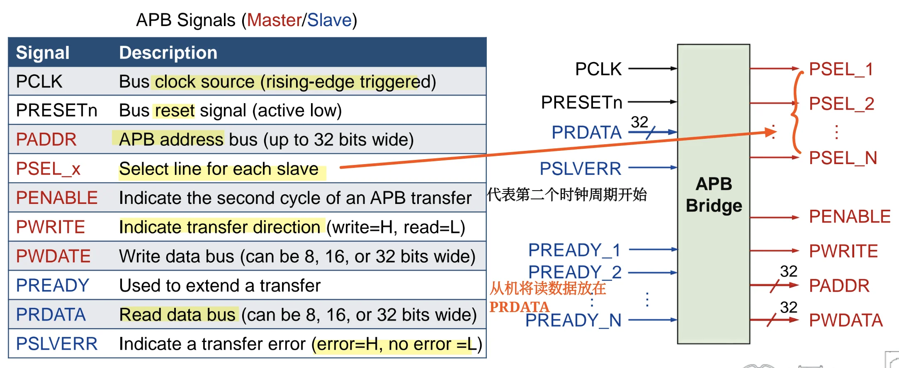
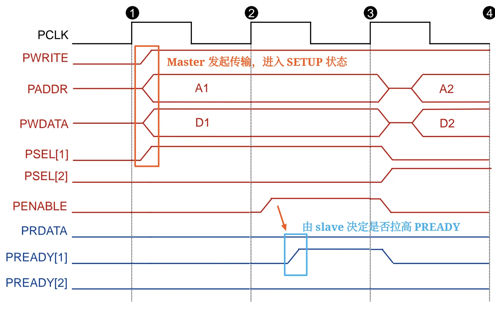
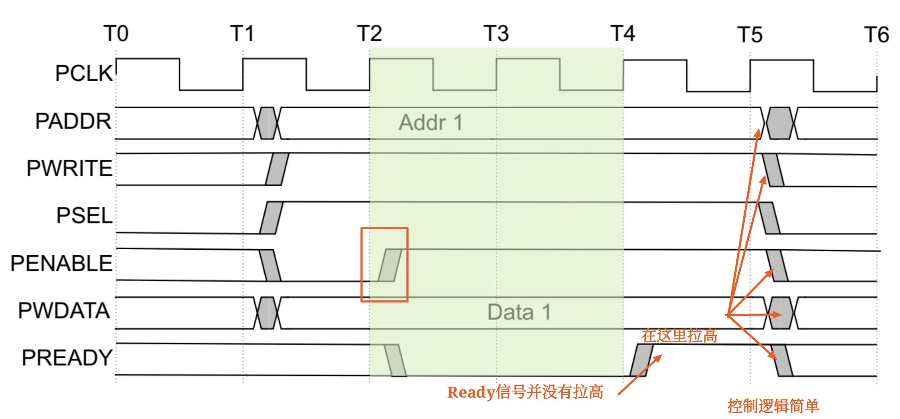
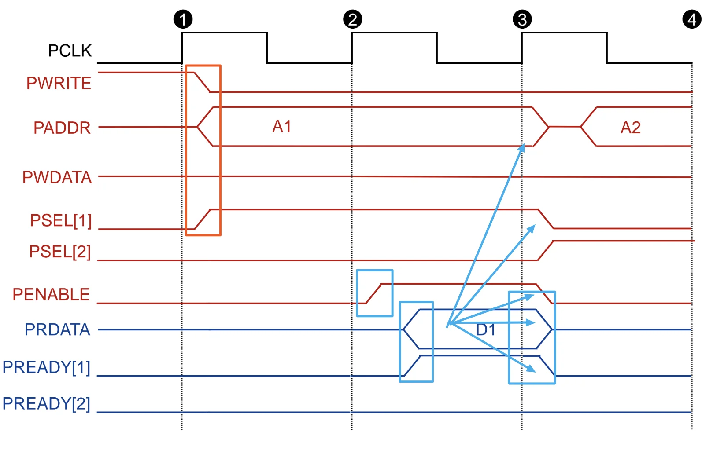
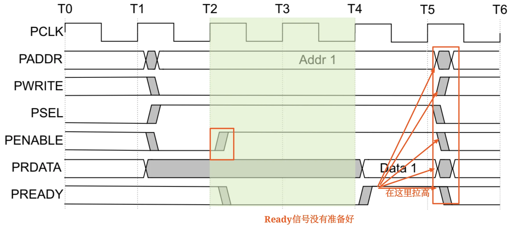

# APB 总线零基础

## 0. 一句话建立直觉

APB 可以先理解成：**SoC 里用来访问低速外设控制寄存器的简单同步总线**。

它不追求高吞吐，而追求：

- 接口简单
- 低功耗
- 低成本
- 适合 UART、Timer、Keypad、PIO 等外设

学习 APB 时不要一上来背所有信号。先抓住一个核心节奏：

```text
一次 APB 传输 = SETUP 阶段 + ACCESS 阶段
             = 至少 2 个时钟周期
```

如果 slave 没准备好，就用 `PREADY=0` 把 ACCESS 阶段拉长，形成 wait states。

## 1. AMBA 中的 APB 放在哪里

AMBA 是 ARM 体系中广泛使用的片上总线/接口规范。AMBA2.0 包括：

| 总线 | 全称 | 定位 |
| --- | --- | --- |
| APB | Advanced Peripheral Bus | 低功耗、简单接口，适合很多外设 |
| AHB | Advanced High-performance Bus | 高性能、流水、多 master、burst、split |
| ASB | Advanced System Bus | 较早的高性能系统总线 |

典型 AMBA2.0 结构可以这样理解：

```text
高性能系统侧：ARM processor / DMA / on-chip RAM / 外部存储接口
        |
        | AHB / ASB
        |
   AHB/ASB to APB Bridge
        |
        | APB
        |
低速外设侧：UART / Timer / Keypad / PIO ...
```

关键点：

- APB 通常不直接承担系统高带宽数据搬运。
- APB 外设一般通过 APB bridge 接到主存储系统/高性能总线侧。
- APB transfers 由 APB bridge 发起。

容易考的判断：

- APB 是高性能、多 master、burst、split 总线。错误，这是 AHB 的典型特征。
- APB 更适合访问外设的可编程控制寄存器。正确。
- APB bridge 是高性能系统总线和低速外设总线之间的桥。正确。

## 2. APB 协议的设计定位

APB 的协议定位：

| 特征 | 含义 |
| --- | --- |
| Low-cost interface | 接口成本低，硬件复杂度小 |
| Minimal power consumption | 面向低功耗设计 |
| Reduced interface complexity | 信号和控制流程相对简单 |
| **Not pipelined** | 基础 APB **不做流水传输** |
| **Synchronous protocol** | **同步协议**，受 `PCLK` 控制 |
| **At least two cycles** | 每次传输至少**两个周期**完成 |
| Peripheral register access | 面向外设可编程控制寄存器访问 |

这页最值得背的是：

**APB is not pipelined, synchronous, and every transfer takes at least two cycles.**

把这句话拆开就是三道判断题：

- APB 是同步协议。正确。
- APB 基础传输是流水线传输。错误。
- APB 一次传输至少需要两个时钟周期。正确。

## 3. APB 信号总览

APB 信号可以按“谁发出”分成两类。红色可理解为 master/APB bridge 发给 slave 的信号，蓝色可理解为 slave 返回给 master/APB bridge 的信号。

### 3.1 时钟和复位

| 信号 | 含义 | 记忆点 |
| --- | --- | --- |
| `PCLK` | APB bus clock source | 上升沿触发 |
| `PRESETn` | APB reset signal | 低有效，名字里的 `n` 常提示 active low |

### 3.2 Master/APB bridge 发给 slave

| 信号 | 含义 | 记忆点 |
| --- | --- | --- |
| `PADDR` | 地址总线，最多 32 bit | 访问哪个寄存器/地址 |
| `PSEL_x` | 每个 slave 一根选择线 | 选中哪一个外设 |
| `PENABLE` | **表示 APB 传输的第二个周期**，即 **ACCESS 阶段** | 区分 SETUP 和 ACCESS 的核心信号 |
| `PWRITE` | 传输方向 | `1` 表示 write，`0` 表示 read |
| `PWDATA` | 写数据总线，可为 8/16/32 bit | 写操作时有效 |

### 3.3 Slave 返回给 master/APB bridge

| 信号 | 含义 | 记忆点 |
| --- | --- | --- |
| `PREADY` | 用于扩展传输 | `0` **表示 slave 还没准备好，继续等** |
| `PRDATA` | 读数据总线，可为 8/16/32 bit | **读操作时由 slave 驱动** |
| `PSLVERR` | **传输错误指示** | `1` 表示 error，`0` 表示 no error |

最重要的三组对应关系：

- 方向：PWRITE = 1 写，PWRITE = 0 读
- 阶段：**PENABLE = 0 SETUP，PENABLE = 1 ACCESS**
- 完成：**PSEL = 1 且 PENABLE = 1 且 PREADY = 1**




注意：图中一个 APB bridge 可以连接多个 slave，因此会有 `PSEL_1`、`PSEL_2`、...、`PSEL_N`，也可能有每个 slave 各自的 `PREADY_x`。

## 4. APB 一次传输的两阶段模型

APB **最核心的东西就是两阶段传输**。

| 阶段 | 典型信号状态 | 发生了什么 |
| --- | --- | --- |
| SETUP | `PSEL=1`, `PENABLE=0` | **master 选中 slave，并给出地址、方向、写数据**等信息 |
| ACCESS | `PSEL=1`, `PENABLE=1` | slave **真正响应**；如果 `PREADY=1`，本次传输完成 |

可以把它记成：

- SETUP：把事情摆出来
- ACCESS：让 slave 正式处理

在 ACCESS 阶段，地址、控制和写数据信号需要保持稳定，直到传输完成。

传输完成条件：

- PSEL = 1
- PENABLE = 1
- PREADY = 1


如果 `PREADY=0`：

- 说明 selected slave 还没有准备好。
- **master/bridge 继续保持 `PSEL=1`、`PENABLE=1`**。
- 当前传输**停留在 ACCESS 阶段**。
- **多出来的周期就是 wait states**。

因此：

- 无等待状态：SETUP 1 拍 + ACCESS 1 拍 = 2 拍完成。
- 有等待状态：SETUP 1 拍 + ACCESS 多拍，直到 `PREADY=1`。

## 5. 写传输：Write Transfer

写传输的目标：master/APB bridge 把 `PWDATA` 写到选中 slave 的某个地址。

### 5.1 无等待状态写传输

SETUP 阶段：

- `PWRITE=1`
- `PADDR` **给出写地址**
- `PWDATA` **给出写数据**
- `PSEL_x=1` **选中**目标 slave
- `PENABLE=0`

ACCESS 阶段：

- `PENABLE=1`
- `PWRITE`、`PADDR`、`PWDATA`、`PSEL_x` 保持稳定
- **slave 准备好后拉高** `PREADY`
- **在 `PSEL=1 && PENABLE=1 && PREADY=1` 时完成写传输**

传输完成后：

- **master 拉低 `PENABLE`**
- **若没有连续传输，`PSEL` 也会被拉低**
- **slave 可拉低 `PREADY`**



### 5.2 有等待状态写传输

有等待状态时，变化只在 ACCESS 阶段：

```text
PENABLE = 1
PREADY  = 0  -> 继续等
PREADY  = 1  -> 当前写传输完成
```

记住：等待期间不是重新进入 SETUP，而是**一直停在 ACCESS(PENABLE一直为高)**。



### 5.3 PSTRB 写选通信号

`PSTRB` 是可选信号，用来说明写传输中哪些 byte lanes 被更新。

在 32-bit `PWDATA` 中：

| 信号 | 对应数据位 |
| --- | --- |
| `PSTRB[0]` | `PWDATA[7:0]` |
| `PSTRB[1]` | `PWDATA[15:8]` |
| `PSTRB[2]` | `PWDATA[23:16]` |
| `PSTRB[3]` | `PWDATA[31:24]` |

关键限制：

- `PSTRB` **只用于 write transfer**。
- `PSTRB` 在 read transfer 中不能 active。

判断题抓手：

- `PSTRB[n]` 对应 `PWDATA[8n+7:8n]`。正确。
- `PSTRB` 可以在读传输中有效。错误。

## 6. 读传输：Read Transfer

读传输的目标：master/APB bridge 从选中 slave 的某个地址读回 `PRDATA`。

### 6.1 无等待状态读传输

SETUP 阶段：

- `PWRITE=0`
- `PADDR` 给出读地址
- `PSEL_x=1` 选中目标 slave
- `PENABLE=0`

ACCESS 阶段：

- `PENABLE=1`
- `PADDR`、`PWRITE`、`PSEL_x` 保持稳定
- **selected slave 拉高 `PREADY`**
- **selected slave 驱动 `PRDATA`**
- **在 `PSEL=1 && PENABLE=1 && PREADY=1` 时完成读传输**，master 读取 `PRDATA`



### 6.2 有等待状态读传输

有等待状态时：

- `PREADY=0` 时，slave 还没有给出有效完成响应。
- ACCESS 阶段被延长。
- 等到 `PREADY=1` 时，`PRDATA` 应该有效，本次读传输完成。

读写传输的核心差异：

| 项目 | 写传输 | 读传输 |
| --- | --- | --- |
| `PWRITE` | `1` | `0` |
| 数据方向 | master/bridge -> slave | slave -> master/bridge |
| 有效数据线 | `PWDATA` | `PRDATA` |
| `PREADY` 作用 | slave 表示写已可完成 | slave 表示读数据可被接收 |



## 7. APB Operating States

APB 状态机只有三个核心状态，很适合背。

| 状态 | 信号状态 | 含义 |
| --- | --- | --- |
| IDLE | `PSELx=0` | 没有传输 |
| SETUP | `PSELx=1`, `PENABLE=0` | 传输开始，选择 slave，给出地址/控制 |
| ACCESS | `PSELx=1`, `PENABLE=1` | slave 响应，等待 `PREADY` |

状态跳转：

```text
IDLE -- 有 transfer --> SETUP
SETUP -- 下一拍 --> ACCESS
ACCESS -- PREADY=0 --> ACCESS
ACCESS -- PREADY=1 且还有 transfer --> SETUP
ACCESS -- PREADY=1 且没有 transfer --> IDLE
```

最容易错的是 ACCESS 结束后的去向：

- 如果 `PREADY=1` 且没有下一笔传输，回到 IDLE。
- 如果 **`PREADY=1` 且马上有下一笔传输**，进入下一笔的 SETUP。
- 如果 **`PREADY=0`，不离开 ACCESS**。

## 8. APB 性能与“提升性能”的理解

APB 的基础定位是：

```text
low power + low performance
```

基础 APB 一次传输需要：

```text
SETUP phase + ACCESS phase
```

也就是至少两拍。

APB performance 提升的思路：

| 思路 | 含义 |
| --- | --- |
| Increase bus width | 例如从 32-bit 增加到 64-bit、128-bit 或更宽 |
| Pipeline | 重叠 SETUP 和 ACCESS，以达到单时钟边沿传输效果 |
| Burst | 一个地址对应多个连续数据 |

**做到这些，APB 总线就升级为了 AHB 总线**。

## 9. APB 和 AHB 的对比记忆

| 项目 | APB | AHB |
| --- | --- | --- |
| 目标 | 外设控制寄存器访问 | 高性能系统互连 |
| 性能 | 低性能 | 高性能 |
| 功耗/复杂度 | 低功耗、简单接口 | 更复杂、更高吞吐 |
| 流水 | 基础 APB 不流水 | 支持流水 |
| master | **通常由 APB bridge 发起传输** | **支持多个 bus masters** |
| burst/split | 基础 APB 不强调 | **AHB 支持 burst、split** |
| 常见连接对象 | **UART、Timer、Keypad、PIO** | **CPU、DMA、RAM、外部存储接口** |

一句话：AHB 负责**系统侧高速通信**，APB 负责**外设侧简单寄存器访问**，中间靠 **bridge 连接**。
