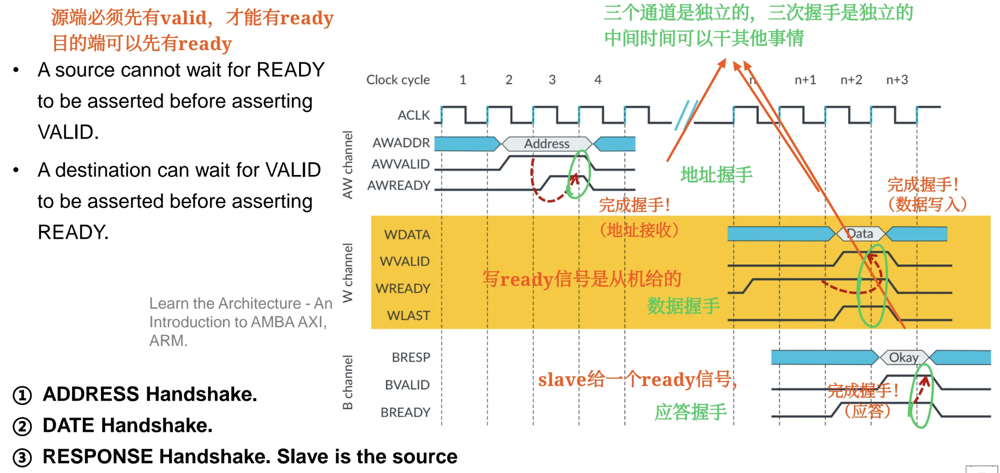
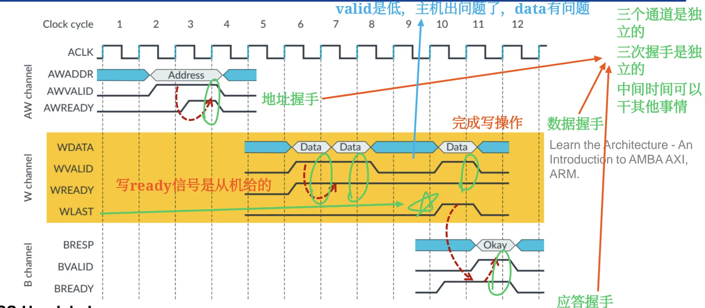

# AXI 总线入门与复习笔记

> 来源范围：`bus_part2.pdf` 中 AXI 相关内容，主要对应 PDF p.26-p.34（课件页脚 64-72）。PDF p.35-p.36 是章节总结和结束页。  
> 这份笔记不按课件页序机械整理，而是按“为什么需要 AXI -> AXI 怎么拆通道 -> 每个通道怎么握手 -> 事务如何并发/乱序 -> AMBA 规格族”的学习顺序组织。

## 0. 先建立直觉

AXI 可以先理解成：**一种面向高性能 SoC IP 互连的接口规范**。

它和 APB 的气质完全不同：

- APB 像“简单外设寄存器访问”：慢、简单、两阶段。
- AHB 像“高性能共享总线”：有流水、burst、多个 master。
- AXI 更像“多条独立通道组成的事务系统”：**读写分离**、**地址和数据分离**、**允许 outstanding**、**支持乱序完成**。

AXI 的核心不是“背很多信号名”，而是先抓住三件事：

```text
1. 五个独立通道：AW, W, B, AR, R
2. 每个通道都用 VALID/READY 握手
3. 地址、数据、响应可以解耦，因此能并发、outstanding、乱序
```

## 1. AXI 想解决什么问题

> 对应课件：PDF p.26（页脚 64）

课件先从“提升 AHB 性能”引出 AXI。高性能总线希望具备这些能力：

| 能力 | 含义 | 为什么有用 |
| --- | --- | --- |
| Independent read and write channels | **读和写有独立通道** | 读写可以同时发生 |
| Simultaneous reads and writes | **同时读写** | 提高并行度和吞吐 |
| Multiple outstanding addresses | master 可以发出多个尚未完成的事务 | **不必等前一个事务完成再发下一个** |
| Out-of-order transaction completion | **后发出的事务可以先完成** | **快 slave 不必被慢 slave 拖住** |
| Independent address and data operations | **地址和数据操作没有严格固定时间关系** | 地址阶段和数据阶段可以分离，调度更灵活 |

这些能力正是 AXI 要支持的方向。  
所以学习 AXI 时，应该把它放在“更高并发、更高吞吐、更松耦合”的背景下理解。

一个很重要的定义：

**AXI 是 interface specification，定义 IP block 的接口，而不是 interconnect itself。**

也就是说：

- AXI 规定 master、slave、interconnect 之间的接口信号和握手规则。
- 具体片上 interconnect 怎么实现，可以有不同结构。
- **不要把 AXI 简单理解成一条物理共享总线**。

## 2. AXI 的五个主通道

> 对应课件：PDF p.27-p.28（页脚 65-66）

AXI 使用五个 main channels 通信：

| 通道 | 全称 | 方向 | 主要传什么 |
| --- | --- | --- | --- |
| AW | Write Address | master -> slave | 写地址和控制信息 |
| W | Write Data | master -> slave | 写数据 |
| B | Write Response | **slave -> master** | 写响应 |
| AR | Read Address | master -> slave | 读地址和控制信息 |
| R | Read Data | **slave -> master** | 读数据和读响应 |

读写结构可以记成：

```text
写事务：AW + W + B
读事务：AR + R
```

为什么写需要三个通道？

- `AW` 负责告诉 slave：我要写哪里、怎么写。
- `W` 负责真正传写数据，可以有多个 data beat。
- `B` 负责 slave 返回写结果，例如是否成功。

为什么读只需要两个通道？

- `AR` 负责告诉 slave：我要读哪里、怎么读。
- `R` 负责返回读数据。
- **Read Response 不单独占一个通道，而是作为 Read Data 的一部分返回**。

这就是课件中的一句话：**Read Response is passed as part of Read Data.**

## 3. AXI 的通道独立性

> 对应课件：PDF p.27-p.28, p.32（页脚 65-66, 70）

AXI 的五个通道彼此相对独立，这是理解 AXI 的关键。

### 3.1 读写独立

读事务使用：

```text
AR channel + R channel
```

写事务使用：

```text
AW channel + W channel + B channel
```

读和写走不同通道，因此可以 simultaneous read/write。

### 3.2 地址和数据独立

写地址 `AW` 和写数据 `W` 是不同通道，不要求严格固定先后间隔。

课件里强调：

```text
Independent address and data operations
```

这意味着**只要协议依赖关系满足，地址和数据操作可以在时间上分离**。  
这就是 AXI 比传统“地址阶段紧贴数据阶段”的总线更灵活的地方。

### 3.3 响应独立

写响应 `B` 是 slave 给 master 的单独通道。  
写事务不是“W 数据送出去就结束”，而是**要等写响应握手完成，才算 slave 正式返回结果**。

读响应则在 `R` 通道中和读数据一起返回。

## 4. VALID/READY 握手

> 对应课件：PDF p.29-p.30（页脚 67-68）

**AXI 每个通道都有一对握手信号**：

```text
VALID：source 发出，表示源端信息有效
READY：destination 发出，表示目的端准备好接收
```

在某个通道上：

```text
VALID = 1 且 READY = 1
```

并在时钟上升沿到来时，**信息从 source 传给 destination，该通道的一次 transfer 完成**。

后文如果写成 `XVALID=1 && XREADY=1`，只表示**该通道握手完成的条件**，不表示两个信号由同一方驱动。永远记住：`XVALID` 由 source 驱动，`XREADY` 由 destination 驱动。

### 4.1 Source 和 destination 是相对通道而言的

同一个 master/slave，在不同通道里的角色可能不同。

| 通道 | source | destination |
| --- | --- | --- |
| AW | master | slave |
| W | master | slave |
| B | slave | master |
| AR | master | slave |
| R | slave | master |

所以：

- 在 `AW` 通道，master 产生 `AWVALID`，slave 产生 `AWREADY`。
- 在 `W` 通道，master 产生 `WVALID`，slave 产生 `WREADY`。
- 在 `B` 通道，slave 产生 `BVALID`，master 产生 `BREADY`。
- 在 `AR` 通道，master 产生 `ARVALID`，slave 产生 `ARREADY`。
- 在 `R` 通道，slave 产生 `RVALID`，master 产生 `RREADY`。

### 4.2 握手过程

一个典型握手过程：

1. source 的信息准备好，拉高 `VALID`。
2. destination 准备好接收，拉高 `READY`。
3. **在 `VALID=1 && READY=1` 的时钟上升沿，信息传输完成**。
4. 若没有新的信息，`VALID` 可以拉低；`READY` 也可以根据目的端状态变化。

课件特别强调：

```text
VALID remains high until READY rises.
```

也就是 **source 一旦声明信息有效，就要保持 `VALID=1` 和信息稳定，直到出现 `VALID=1 && READY=1` 的上升沿并完成握手**。

!!! note "READY 信号语义"

    `READY` 的协议语义始终是：**destination 当前有能力接收**。真正“已经接收完成”发生在 `VALID && READY` 被同一个时钟上升沿采样到之后。

    因此，`READY` 在不同上下文中会有一点语感差别，但定义不变。

    **场景 1：READY 先于 VALID 拉高**

    ```text
            T0        T1        T2
    ACLK    ↑         ↑         ↑
    VALID   0   ->    1   ->    0
    READY   1   ->    1   ->    1/0
    DATA    X   ->    D
    ```

    - 在 `T0` 上升沿：`READY=1, VALID=0`，没有 transfer 发生。
    - 此时 `READY=1` 的语义是：destination 在说“我现在空着，可以接收”。
    - 在 `T0` 到 `T1` 之间，source 准备好数据 `D`，拉高 `VALID`，并保持 `DATA=D` 稳定。
    - 在 `T1` 上升沿：`VALID=1 && READY=1`，握手完成，destination 在这个边沿接收 `D`。
    - `T1` 之后，如果没有下一笔数据，source 可以拉低 `VALID`。

    这里 `READY` 更像 destination 的“空闲接收能力公告”。

    **场景 2：VALID 先于 READY 拉高**

    ```text
            T0        T1        T2        T3
    ACLK    ↑         ↑         ↑         ↑
    VALID   1   ->    1   ->    1   ->    0
    READY   0   ->    0   ->    1   ->    0/1
    DATA    D         D         D
    ```

    - 在 `T0` 上升沿：`VALID=1, READY=0`，source 已经给出有效数据 `D`，但 destination 还不能接收，所以没有 transfer。
    - 从 `T0` 到 `T2`，source 必须保持 `VALID=1`，并保持 `DATA=D` 稳定。
    - 在 `T2` 前，destination 拉高 `READY`。
    - 在 `T2` 上升沿：`VALID=1 && READY=1`，握手完成，destination 接收 `D`。
    - `T2` 之后，这笔 transfer 才能说“已经被接收”。

    这里 `READY` 更像 destination 对已挂起 `VALID` 的回应：“我现在终于可以接收你一直保持的这笔信息了；在这个上升沿我们完成 transfer。”

    最后可以压缩成三句话：

    ```text
    READY=1, VALID=0：
    destination 只是表示“我可以接收”，但没有东西可接收。

    READY=1, VALID=1，尚未到上升沿：
    destination 表示“我可以接收这笔有效信息”。

    READY=1, VALID=1，被上升沿采样：
    这笔 transfer 完成，信息已经被接收。
    ```

### 4.3 防死锁规则

> 对应课件：PDF p.30（页脚 68）

AXI 中有一个很重要的握手约束：

```text
source cannot wait for READY before asserting VALID
destination can wait for VALID before asserting READY
```

理解：

- **source 不能说“你 READY 了我才 VALID”**。
- destination 可以说“你 VALID 了我再 READY”。

为什么？  
如果 source 和 destination 都互相等，就会死锁。AXI 规定 source 不能等 `READY` 才拉 `VALID`，就是为了避免这种互等。

判断题抓手：

- `VALID` 来自 source，`READY` 来自 destination。
- 只有在 `VALID` 和 `READY` 同时为 1 的时钟上升沿，transfer 才完成。
- destination 可以等待 `VALID=1` 后再拉高 `READY`。

## 5. Transaction、Transfer、Burst 的区别

> 对应课件：PDF p.30-p.32（页脚 68-70）

AXI 容易混淆的几个词：

| 概念 | 含义 | 例子 |
| --- | --- | --- |
| Transfer / beat | **某个通道上一次 VALID/READY 握手传输的信息** | W 通道传一个 data beat |
| Transaction | **一次完整读或写事务** | **写事务 = AW + 若干 W + B** |
| Burst | 一个地址请求对应多个连续数据 beat | 一次 AW 后跟多个 W beat |
| Outstanding | 已发起但尚未完成的事务 | master **发出多个地址，响应还没全部回来** |

课件说：

```text
One Address for entire burst
```

也就是 burst 不是每个 data beat 都重新发一个地址，而是一次地址请求描述整个 burst，然后数据通道连续传多个 beat。

## 6. AXI 单次写事务

> 对应课件：PDF p.30（页脚 68）

单次写事务可以拆成三次握手：

```text
1. AW channel：ADDRESS handshake
2. W channel：DATA handshake
3. B channel：RESPONSE handshake
```

{ width="1000" }

### 6.1 地址握手

master 在 `AW` 通道驱动写地址和控制信息，并拉高 `AWVALID`。slave 或下游 interconnect 作为 destination，**在可以接收地址时拉高 `AWREADY`**。

```text
master/source        : AWVALID = 1，并保持 AWADDR/AW control 有效
slave/destination   : AWREADY = 1，表示可以接收
握手完成条件          : AWVALID = 1 && AWREADY = 1 的时钟上升沿
```

注意：`AWREADY` 不是 master 给的，**它来自 `AW` 通道的 destination**。

### 6.2 数据握手

master 在 `W` 通道驱动写数据，并拉高 `WVALID`。slave 或下游 interconnect 作为 destination，**在可以接收写数据时拉高 `WREADY`**。

```text
master/source        : WVALID = 1，并保持 WDATA 有效
slave/destination   : WREADY = 1，表示可以接收
握手完成条件          : WVALID = 1 && WREADY = 1 的时钟上升沿
```

这里的每一次握手完成一个写数据 beat。

### 6.3 写响应握手

slave 在 `B` 通道驱动写响应，并拉高 `BVALID`。master 作为 destination，**在可以接收响应时拉高 `BREADY`**。

```text
slave/source         : BVALID = 1，并保持 BRESP 有效
master/destination  : BREADY = 1，表示可以接收
握手完成条件          : BVALID = 1 && BREADY = 1 的时钟上升沿
```

这里 source 是 slave，destination 是 master。  
课件特别写了：**Slave is the source.**

单次写可以这样背：

```text
写地址从 master 到 slave
写数据从 master 到 slave
写响应从 slave 到 master
```

## 7. AXI 多 beat 写与 WLAST

> 对应课件：PDF p.31（页脚 69）

{ width="1000" }

多 beat 写，也就是 burst write，大致过程：

1. `AW` 通道**完成一次 address handshake**。
2. `W` 通道**连续传多个 data beat**。
3. burst 期间 `WVALID` **可以持续为 1**。
4. 如果中间暂停，`WVALID` **可以拉低，表示当前没有有效写数据 beat**。
5. **最后一个写数据 beat 由 `WLAST` 标记**。
6. 所有写数据完成后，slave 在 `B` 通道驱动 `BVALID/BRESP` 返回 response，master 用 `BREADY` 接收。

`WLAST` 的作用：

`WLAST = 1` 表示**当前 W beat 是本次 burst 的最后一个数据 beat**。


不要把 `WLAST` 理解成“写事务已经完全结束”。  
更准确地说，它表示 **写数据部分的最后一个 beat**。写事务整体还需要 `B` 通道的响应握手。

判断题抓手：

- Burst write 中，一个地址可以对应多个写数据 beat。正确。
- `WLAST` 标记最后一个写数据 beat。正确。
- 写响应通道的 source 是 slave。正确。

## 8. AXI 读事务

> 对应课件：PDF p.27-p.28, p.32（页脚 65-66, 70）

课件没有像写事务那样单独展开读时序图，但五通道图已经给出了读事务结构。

一次读事务包含：

```text
1. AR channel：Read Address handshake
2. R channel：Read Data handshake
```

读地址阶段：

- master 通过 `AR` 通道**发出读地址和控制信息**，并驱动 `ARVALID`。
- slave 或下游 interconnect 作为 destination，**驱动 `ARREADY`**。
- `ARVALID=1 && ARREADY=1` 的**时钟上升沿完成读地址握手**。

读数据阶段：

- slave 通过 `R` **通道返回读数据和读响应**，并驱动 `RVALID`。
- master 作为 destination，**驱动 `RREADY`**。
- **`RVALID=1 && RREADY=1` 的时钟上升沿完成一个读数据 beat**。
- <span style="color:red;">read response 在 `R` 通道中和读数据一起返回。</span>

如果是 burst read：

- 一次 `AR` 地址请求可以对应多个 `R` data beat。
- 最后一个读数据 beat 通常由读数据通道中的 last 类信号标记。
- 课件重点不在具体信号名，而在“读地址和读数据分通道，读响应随读数据返回”。

## 9. Outstanding、并发与乱序完成

> 对应课件：PDF p.26, p.32（页脚 64, 70）

**AXI 支持多个 outstanding transactions**。  
含义是：

**master 可以在前一个事务完成前，继续发起新的事务**。

这和 APB 的“做完一笔再下一笔”完全不同。

### 9.1 为什么 outstanding 能提升性能

如果访问慢 slave 或慢存储器，等待响应会浪费很多周期。  

**AXI 允许 master 先把多个请求发出去，让系统内部并行处理。**

即：**master 可以在前一个事务完成前，继续发起新的事务**。

这样：

- **快 slave 可以先返回数据**。
- 慢 slave 慢慢处理。
- master/interconnect 不必被一个慢请求完全卡住。

### 9.2 乱序完成

课件中说：

```text
A later transaction can complete before a previously launched one.
Fast slaves may return data ahead of slow slaves.
```

这就是 out-of-order transaction completion。

注意：乱序不是“协议乱了”，而是**协议允许响应顺序和发起顺序不同**。为了保证 master 能识别响应属于哪一笔事务，实际 AXI 协议会使用 **ID 等机制跟踪事务**。课件这里不展开 ID 信号，但理解乱序时必须知道“要能对得上事务”。

### 9.3 Interleaved out-of-order

课件写到：

```text
AXI supports interleaved out-of-order transactions
```

可以理解为：

- **多个事务可以在时间上交错进行**。
- **读事务和写事务可以同时存在**。
- **地址、数据、响应这些通道活动可以在时间上交错**。
- 快路径响应可以先回来。

更细的“写数据 beat 能否在不同 burst 之间任意交织”会受到具体 AXI 版本和实现约束影响；本课件层面只需要掌握 AXI 支持 interleaved/out-of-order 的高层含义。

这部分和 `bus_part1` 中的 out-of-order transfer 概念直接相连。

## 10. AXI 与 APB/AHB 的学习对比

> 对应课件：PDF p.26-p.28, p.33（页脚 64-66, 71）

| 项目 | APB | AHB | AXI |
| --- | --- | --- | --- |
| 主要定位 | 低速外设寄存器访问 | 高性能系统总线 | 高性能 IP 接口规范 |
| 结构直觉 | 两阶段简单访问 | 地址/数据流水总线 | 多独立通道事务系统 |
| 读写关系 | 简单读/写方向控制 | 可流水，但通道独立性有限 | 读写通道独立，可同时读写 |
| outstanding | 基础 APB 不强调 | 有限 | 重点能力 |
| 乱序完成 | 不强调 | 不作为核心 | **支持 interleaved out-of-order** |
| burst | 基础 APB 不强调 | 支持 burst | **支持 burst，且一个地址描述整个 burst** |
| 典型使用 | UART、Timer、PIO | CPU/DMA/Memory 系统侧 | CPU cluster、DMA、accelerator、memory system、interconnect |

一句话：
APB 追求简单，AHB 追求系统侧高性能，AXI 追求更强并发和更灵活的事务调度。


## 11. AMBA 规格族中的 AXI

> 对应课件：PDF p.33-p.34（页脚 71-72）

课件的 Key AMBA Specifications 图把 AMBA 家族放在一起：

| 规格 | 课件中给出的定位 |
| --- | --- |
| APB | Advanced Peripheral Bus，low bandwidth peripherals 的系统总线 |
| AHB | Advanced High-performance Bus，支持 64/128 bit，多 manager；AHB-Lite 面向 single manager |
| AXI | Advanced eXtensible Interface，支持 separate address/data phases、bursts、multiple outstanding addresses、out-of-order responses |
| ACE | AXI Coherency Extensions，AXI 的超集，用于多核集群间系统级一致性 |
| CHI | Coherent Hub Interface，用于一致性协议和可扩展分层架构 |

图中还出现了：

- `AXI3`
- `AXI4`
- `AXI4-Lite`
- `AXI4-Stream`
- `AXI5`
- `ACE + Lite`
- `ACE5 + Lite`
- `CHI`

这里不需要把每个版本展开背。期末复习层面建议记：

- AXI 这一层的关键词是 `separate address/data phases`、`bursts`、`multiple outstanding addresses`、`out-of-order responses`。
- AXI4-Lite 常用于简化的寄存器映射访问。
- AXI4-Stream 用于流式数据传输。
- ACE/CHI 与 cache coherence / coherent interconnect 更相关。

课件 SoC 示例中能看到：

- CPU cluster 通过 `CHI` 接 coherent interconnect。
- non-coherent interconnect、DMA、PCIe controller、HW accelerator 等可以使用 `AXI`。
- 系统中仍可能存在 `APB`，用于低速外设侧。
- 同一个 SoC 内可以同时存在 AXI、AXI-Stream、CHI、ACE5-Lite、APB 等接口。

## 12. 初学者如何读 AXI 波形

虽然课件没有要求你画完整 AXI 波形，但读图时可以按这个顺序：

1. 先看是哪一个通道：`AW/W/B/AR/R`。
2. 找 source 和 destination。
3. 找该通道的 `VALID` 和 `READY`。
4. 找 `VALID && READY` 同时为 1 的上升沿。
5. 这个上升沿就是该通道一次 transfer 完成的位置。
6. 如果是写事务，再检查 `AW`、`W`、`B` 三条链是否都完成。
7. 如果是 burst 写，检查最后一个 `W` beat 上是否有 `WLAST`。
8. 如果是读事务，检查 `AR` 请求和 `R` 数据返回。

一个小口诀：

```text
看 AXI，先分通道；
看通道，找 VALID/READY；
写看 AW-W-B，读看 AR-R；
burst 看 last，乱序看事务归属。
```

## 13. 常考判断题与填空抓手

> 对应课件：PDF p.26-p.34（页脚 64-72）

1. AXI 是 Advanced eXtensible Interface。正确。
2. AXI 定义的是 IP block 的接口，而不是 interconnect 本身。正确。
3. AXI 支持 multiple masters 和 multiple slaves。正确。
4. AXI 使用五个主通道：AW、W、B、AR、R。正确。
5. AXI 的写事务使用 AW、W、B 三个通道。正确。
6. AXI 的读事务使用 AR、R 两个通道。正确。
7. Read Response 在 AXI 中作为 Read Data 的一部分返回。正确。
8. AXI 所有通道都有 VALID 和 READY 握手信号。正确。
9. VALID 来自 destination，READY 来自 source。错误，正好相反。
10. VALID 拉高后应保持到 `VALID && READY` 的上升沿握手完成。正确。
11. AXI 握手只看 VALID 和 READY 的组合，不需要时钟边沿。错误，需要时钟上升沿完成。
12. Source 可以等待 READY 后再拉 VALID。错误。
13. Destination 可以等待 VALID 后再拉 READY。正确。
14. 写响应 B 通道中，slave 是 source。正确。
15. `AWREADY`、`WREADY` 由写地址/写数据通道的 destination 给出，不是 master 给出。正确。
16. `BREADY` 由 master 给出，因为 B 通道的 destination 是 master。正确。
17. Burst write 中 `WLAST` 表示最后一个写数据 beat。正确。
18. `WLAST` 表示写事务完全结束且不需要响应。错误。
19. AXI 支持 simultaneous read/write transactions。正确。
20. AXI 支持 multiple outstanding addresses。正确。
21. AXI 支持 out-of-order transaction completion。正确。
22. 一个 burst 需要每个 data beat 都重新发送完整地址。错误，课件强调 one address for entire burst。
23. 快 slave 可以比慢 slave 更早返回数据，即使请求发起顺序更晚。正确。
24. AXI4-Stream 更偏向流式数据传输，APB 更偏向低带宽外设。正确。

## 14. 考前最短版

AXI 是 AMBA 中面向高性能 SoC 的接口规范，定义 IP block 的接口而不是 interconnect 本身。它支持 multiple masters、multiple slaves、读写独立、地址和数据独立、multiple outstanding、burst、乱序完成。

AXI 有五个主通道：

```text
写：AW 写地址，W 写数据，B 写响应
读：AR 读地址，R 读数据/读响应
```

所有通道都用 `VALID/READY` 握手：`VALID` 来自 source，`READY` 来自 destination；当 `VALID=1 && READY=1` 时，在时钟上升沿完成一次 transfer。`VALID` 拉高后要保持到握手完成。source 不能等 READY 才拉 VALID，destination 可以等 VALID 才拉 READY。

AXI 写事务要完成三条链：`AW` 地址握手、`W` 数据握手、`B` 响应握手。burst 写中一个地址对应多个数据 beat，`WLAST` 标记最后一个写数据 beat。AXI 读事务由 `AR` 请求和 `R` 返回组成，读响应随 `R` 通道返回。

AXI 最能体现高性能的地方是：读写可并发，多个事务可 outstanding，事务完成可 out-of-order，快 slave 可以先返回，慢 slave 不必阻塞整个系统。
