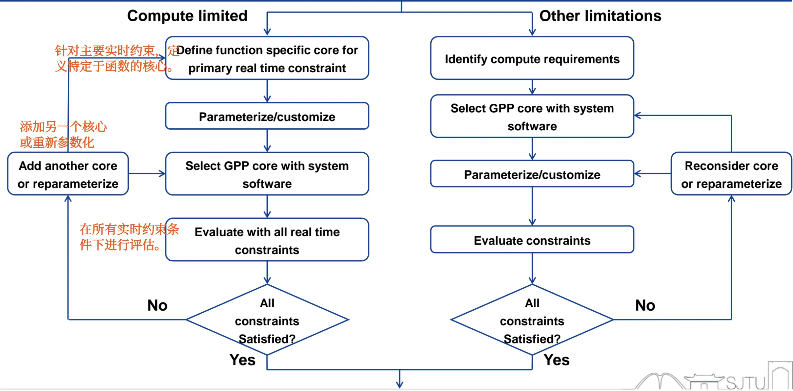

# SoC Processor

## I. CISC 与 RISC 架构对比及主流 ISA 生态

在 SoC 处理器的选型与系统设计中，理解指令集架构（ISA）的设计流派及其背后的商业生态是至关重要的。

### 1.1 CISC 与 RISC 的核心设计哲学对比

早期的计算机（如 ENIAC）编程十分困难，后来发展出了复杂指令集（CISC），目的是通过硬件直接实现复杂的高级任务（如字符串搜索）。随着编译技术的发展和对指令执行效率（流水线）的追求，精简指令集（RISC）应运而生，提倡用更基础、更快速的简单指令组合来完成任务。

两者在系统级硬件设计上的具体对比如下：

| 对比维度 | CISC (复杂指令集计算机) | RISC (精简指令集计算机) |
| :--- | :--- | :--- |
| **设计重心** | **Emphasis on hardware** (依赖硬件实现复杂逻辑) | **Emphasis on software** (依赖编译器和软件优化) |
| **指令数量与复杂度** | 复杂且指令数量多 (Complex and more instructions) | 简化且指令数量少 (Simplified and less instructions) |
| **指令格式** | **变长格式** (Variable format)，解码电路极其复杂 | **定长格式** (Fixed format)，极易于硬件解码 |
| **执行周期** | 大多数指令需要**多个机器周期** (Multiple cycles) | 大多数指令**单周期**执行完毕 (Single cycle) |
| **访存限制** | **最大化主存使用**，各种指令均可直接访问内存 | **最大化寄存器使用**，仅 Load/Store 指令可访问内存 |
| **寻址模式** | 寻址模式繁多且复杂 | 寻址模式少且简单 |
| **流水线友好度** | 极难实现高效的流水线 (Minimum use of pipelining) | **最大化利用流水线** (Maximum use of pipelining) |

### 1.2 主流指令集（ISA）商业生态与特性

当前的通用处理器市场主要被三大指令集架构占据，SoC 设计者需要根据应用场景（桌面/服务器端、移动嵌入式端、低成本开源物联网等）进行选型：

#### (1) Intel x86 (AMD64) —— PC 与服务器领域的霸主

*   **架构类型**：CISC 架构。
*   **指令特征**：变长指令，允许在执行算术指令时直接进行内存访问（不局限于 Load/Store）。
*   **商业模式**：主要面向 OEM（原始设备制造商），不对外授权 IP 核心。
*   **主要厂商**：Intel, AMD, VIA (兆芯) 等。
*   **应用领域**：处于绝对主导地位的个人电脑（Laptop, Desktop）和服务器（Server）市场。

#### (2) ARM —— 移动与嵌入式领域的绝对核心

*   **架构类型**：(曾经的) RISC 架构（**Advanced RISC Machine**）。
*   **指令特征**：32 位定长指令（Thumb-16 除外），严格遵守 Load/Store 内存访问规则，硬件设计相比 x86 简单得多。
*   **商业模式**：**IP 授权模式**。ARM 公司不制造芯片，而是将 CPU Core 的 IP 授权给 IC 设计厂商，IC 厂商再将其集成到自家的 SoC 或 MCU 中。
*   **主要厂商**：Apple, Huawei, Qualcomm (高通), Xilinx 等。
*   **应用领域**：智能手机、平板电脑、各类嵌入式设备。

#### (3) RISC-V —— 冉冉升起的开源新星

*   **架构类型**：标准的开源 RISC 架构。
*   **指令特征**：极致的简洁与优雅，且具备极强的**灵活性（Flexible）**。其 ISA 采用“基础指令集 (Base) + 标准扩展指令集 (Extension)”的模块化设计（例如 RV32I 加上 M, A, F, D 等扩展）。
*   **商业模式**：**开源免费**。由非营利组织 RISC-V 基金会维护，任何人均可基于此标准设计、制造和销售芯片而无需支付高昂的授权费。
*   **生态代表**：阿里平头哥 (Alibaba Cloud T-Head) 的玄铁系列，华为海思 Hi3861V100 等。
*   **应用领域**：IoT 设备、智能家居、AI 协处理器、并正逐渐向高性能计算领域扩展。

## II. 存储架构：冯·诺依曼与哈佛架构

存储器与 CPU 核心之间的数据通路设计，直接决定了 SoC 系统的吞吐量和访存带宽。

### 2.1 冯·诺依曼架构 (Von Neumann Architecture)
又称普林斯顿架构，其核心概念是 **“存储程序 (Stored-Program)”**，即指令和数据被视为同等对待的二进制数，**共享同一个连续的物理内存空间和同一套系统总线**。

*   **特点**：结构简单，硬件实现成本较低。
*   **瓶颈**：**带宽受限 (Limits operating bandwidth)**。由于指令和数据共享一条总线，CPU 在同一个时钟周期内，**要么只能读取指令，要么只能读/写数据**，绝对无法同时进行，这引发了所谓的“冯·诺依曼瓶颈”，**也是引发流水线结构冒险**（Structural Hazard）的根源。

### 2.2 哈佛架构 (Harvard Architecture)
为了解决取指和访存的带宽冲突，哈佛架构在物理层面上对存储器进行了分离：

*   **物理分离**：拥有**两套独立的内存空间** —— 一套专门用于存储程序指令（Program Memory），一套专门用于存储数据（Data Memory）。
*   **独立总线**：CPU 与这两个存储器之间通过各自独立的总线进行连接。
*   **架构优势**：**允许并行访问**。CPU 可以在读取当前指令的同时，访问上一条指令所需的数据内存，从而使得单周期内的吞吐量翻倍。
*   **在 SoC 中的应用**：为了配合流水线在一个时钟周期内同时完成“取指(IF)”和“访存(MEM)”操作，**几乎所有现代的 RISC 处理器设计都采用了哈佛架构**（或在 Cache 层面采用改进型的哈佛架构，即独立的 L1 I-Cache 和 L1 D-Cache）。

## III. ISA

见《通用及图形处理器架构与系统》课程笔记：
[ISA 笔记](../../PU/ch2-ISA/index.md)
[Processor 架构设计笔记](../../PU/ch4-processor/index.md)

## IV. SoC Processor Selection

在 SoC 系统设计初期，最重要的架构决策之一就是处理器的选型。这直接关系到芯片最终的性能、功耗、面积（PPA）以及能否满足实时性要求。

### 3.1 核心决策与需求分析

在选型时，SoC 架构师必须首先决定以下两个核心问题：

1. **处理器类型 (What type of processor?)**：选择哪种架构和特点的核？
2. **处理器数量 (How many processors?)**：单核、同构多核，还是异构多核？

为了做出上述决策，需要对系统的**硬件需求 (Requirements)** 进行严格评估：

*   **应用类型需求 (Type of applications)**：
    *   **通用处理器 (General Purpose Processor, GPP)**：适用于跑操作系统（OS）、处理复杂的控制逻辑和多任务调度（如 ARM Cortex-A 系列，RISC-V 基础架构）。
    *   **数字信号处理器 (Digital Signal Processor, DSP)**：适用于密集的数学运算、音视频编解码、通信基带信号处理等算法密集型应用。
*   **计算负载分析 (Computation load)**：
    *   评估方式：计算系统完成所有任务所需的**每秒总指令数**。
    *   应对高计算负载的策略：
        *   *策略 A*：选择具有更高单核性能的处理器（提升主频、更深的流水线、超标量架构等）。
        *   *策略 B*：增加处理器的数量（采用多核并行架构）。
*   **控制需求 (Control requirements)**：中断响应延迟要求、外设控制复杂度等。

### 3.2 选型设计流程与决策树

SoC 处理器选型是一个**迭代 (Iterative)** 的过程。根据系统面临的主要瓶颈，选型流程可分为**“受限于计算能力 (Compute limited)”**和**“受限于其他限制 (Other limitations)”**两条路径：

#### 路径 A：计算受限驱动 (Compute Limited)
当系统面临极高的算力瓶颈或严苛的实时性要求时（如自动驾驶、高频基带处理），通常优先定制专用加速核心：

1. **定义功能核心**：首先针对主要的硬实时约束（Primary real time constraint），定义特定功能的专用核心（Function specific core，如 DSP、AI 加速器、硬件解码器）。
2. **参数化与定制**：根据计算需求对专用核心进行参数化配置（Parameterize/customize）。
3. **选择 GPP**：在此基础上，再选择合适的**通用处理器（GPP）**以及配套的系统软件，用于处理上层控制逻辑。
4. **系统级评估**：评估软硬件协同系统是否满足所有的实时约束。
5. **迭代反馈**：
    * *满足条件 (Yes)* $\rightarrow$ 选型通过。
    * *不满足 (No)* $\rightarrow$ **增加更多的核心 (Add another core) 或重新进行参数化配置 (Reparameterize)**，返回第3步重新迭代。

#### 路径 B：常规/其他限制驱动 (Other Limitations)
当系统**不算极度吃算力，更多受限于功耗、成本、通用互联等常规约束时**（如普通的 IoT 设备），主要围绕通用处理器展开：

1. **明确需求**：首先识别整体的计算需求 (Identify compute requirements)。
2. **选择 GPP**：直接选择满足初步算力需求的通用处理器核心及其系统软件。
3. **参数化与定制**：对该 GPP 及其缓存、总线接口等进行参数化配置。
4. **评估约束**：评估系统是否满足功耗、面积等各类综合限制条件。
5. **迭代反馈**：
    * *满足条件 (Yes)* $\rightarrow$ 选型通过。
    * *不满足 (No)* $\rightarrow$ **重新考虑核心选型 (Reconsider core) 或重新进行参数化配置 (Reparameterize)**，返回第2步重新迭代。

## V. 系统性能评估与测量 (System Performance Evaluation)

在 SoC 设计中，设计出一款处理器后，必须有科学的指标和方法来评估其性能。这一部分涉及多个核心公式，是**极大概率出现计算题**的重难点章节。

### 5.1 基本性能测量指标

**响应时间 (Response time)**：执行某一个特定任务所需的时间（**从任务提交到完成**）。
**吞吐率 (Throughput)**：单位时间内系统完成的总工作量（如：次/秒，任务数/秒）。
**性能 (Performance) 的定义**：性能与执行时间成反比。

$$\text{Performance} = \frac{1}{\text{Execution Time}}$$

**时间维度的分解**：
   
- **消逝/运行时间 (Elapsed / Execution time)**：$\text{CPU time} + \text{other time}$。这是总响应时间，包含了**处理、I/O 等待、操作系统开销、空闲**等所有时间。
-  **CPU 时间 (CPU time)**：CPU **纯粹花在处理该特定任务上**的时间（扣除了 I/O 等待和其他任务抢占的份额）。

### 5.2 CPU 性能铁律 (The Iron Law) —— 核心必考

要降低 CPU 时间，必须从时钟周期数和时钟频率入手。SoC 架构师必须熟练掌握以下推导和公式：

1.  $\text{CPU Time} = \text{CPU Clock Cycles} \times \text{Clock Cycle Time (CT)}$
2.  $\text{CPU Clock Cycles} = \text{Instruction Count (IC)} \times \text{Cycles per Instruction (CPI)}$

将两式结合，得到计算机体系结构中最著名的**性能铁律公式**：

$$\boxed{\text{CPU Time} = \text{IC} \times \text{CPI} \times \text{CT}}$$

*(文字表述：**CPU时间 = 程序总指令数 × 每条指令平均时钟周期数 × 时钟周期长度**)*

**各性能因子的影响因素分析：**

* IC is affected by: 程序、ISA、编译器优化等。
* CPI is affected by: CPU 硬件设计、**指令组合**（Instruction Mix，受程序、编译器优化影响）。
* CT is affected by: CPU 硬件设计、ISA 等。

在进行 SoC 优化时，我们需要清楚改变系统的哪个部分会影响公式中的哪个因子：

*   **算法 (Algorithm)** $\rightarrow$ 决定了执行指令的总数 (IC)，也可能影响指令组合 (CPI)。
*   **编程语言 (Programming language)** $\rightarrow$ 影响生成的指令数 (IC) 和平均周期 (CPI)。
*   **编译器 (Compiler)** $\rightarrow$ 通过**优化指令组合**，极大地影响 IC 和 CPI。
*   **指令集架构 (ISA)** $\rightarrow$ **决定了硬件的实现难度**，因此**同时影响 IC, CPI 和 时钟周期长短 ($T_c$ / CT)**。

### 5.3 MIPS (Million Instructions per Second) 指标

**定义**：**每秒执行的百万条指令数**。
**计算公式**：

$$\boxed{\text{MIPS} = \frac{\text{IC}}{\text{Execution Time} \times 10^6} = \frac{\text{Clock Rate}}{\text{CPI} \times 10^6}}$$

**核心局限性**：由于 CPI（平均指令周期）是**随着执行的程序代码（指令混合比例）不同而动态变化**的，因此**同一个 CPU 并没有单一固定的 MIPS 值**。不能脱离具体工作负载，仅凭 MIPS 值来跨架构比较不同 SoC 的性能。

### 5.4 基于基准测试的评估 (Benchmark-Based Evaluation)

**Benchmark (基准测试程序)**：是一套专门设计用来压榨系统性能极限、模拟真实工作负载的测试代码集。

**SPEC 工业标准 (Standard Performance Evaluation Corporation)**：如 SPEC CPU2006，专门用于评估 CPU 性能（忽略 I/O 等其他部件影响）。

**几何平均数评估法 (Geometric Mean, GM)**：
   
- SPEC 会选取一个老设备（如 Sun UltraSparc II）作为基准（Baseline）。
- 计算各个测试子项的性能比率：$\text{SPECRatio}_i = \frac{\text{SPEC}_{\text{baseline}} \text{ Time}}{\text{SPEC}_{\text{CPU}} \text{ Time}}$
- 通过对所有 $n$ 个子项目的比率求**几何平均值**，得出最终的系统跑分：

$$\text{GM} = \sqrt[n]{\prod_{i=1}^{n} \text{SPECRatio}_i}$$

### 5.5 阿姆达尔定律 (Amdahl's Law) 与系统优化极限

**核心准则**：让系统中**最耗时的部分变快** (make the most time-consuming case fast)。
**核心思想**：当我们针对计算机的某一个特定部件进行改进时，整体性能的**提升比例受限于该部件在总运行时间中的占比**。

**阿姆达尔定律公式**：

$$\text{T}_{\text{improved}} = \frac{\text{T}_{\text{affected}}}{\text{improvement factor}} + \text{T}_{\text{unaffected}}$$

*(改进后的总时间 = 受优化影响的时间 / 提升倍数 + 不受优化影响的时间)*

!!! example "典型考试计算题解析：添加 Cache 带来的总体加速比"
 
    **题目背景**：某 CPU 的访存（Memory）操作占总执行时间的 30%。现在我们为它增加一级 Cache，使得这 30% 访存操作中的 80% 获得了 4 倍的加速（4x speedup）。求这颗 SoC 最终的总体加速比（Overall speedup）是多少？
   
    **解题步骤**：

    1. **分解时间占比**：
        *   不受访存优化影响的部分 ($\text{T}_{\text{unaffected1}}$) = 100% - 30% = 0.7
        *   访存中没有被 Cache 命中的部分 ($\text{T}_{\text{unaffected2}}$) = 30% × (1 - 80%) = 0.3 × 0.2 = 0.06
        *   真正受到 4 倍加速影响的部分 ($\text{T}_{\text{affected}}$) = 30% × 80% = 0.3 × 0.8 = 0.24
    2. **代入 Amdahl 定律公式计算改进后的总时间**：

       $$ \text{T}_{\text{improved}} = \frac{0.3 \times 0.8}{4} + (0.3 \times 0.2) + 0.7 = 0.06 + 0.06 + 0.7 = 0.82 $$

    3. **计算总体加速比**：

       $$ \text{Overall Speedup} = \frac{1}{\text{T}_{\text{improved}}} = \frac{1}{0.82} \approx 1.22\text{x} $$
   
    **结论**：虽然局部获得了 4 倍的性能提升，但受到阿姆达尔定律的限制，系统的整体性能仅提升了约 22%。且随着局部优化的进行，“系统中最耗时的部分”会发生转移。
