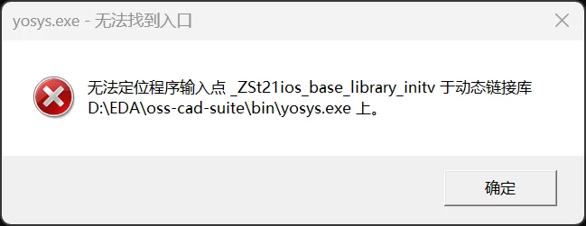
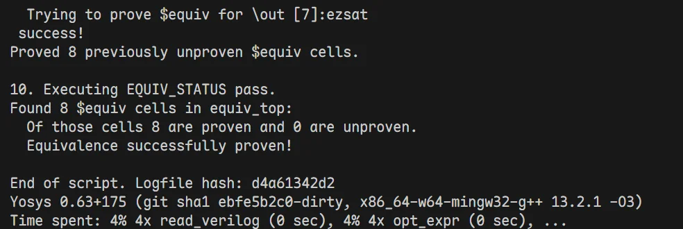
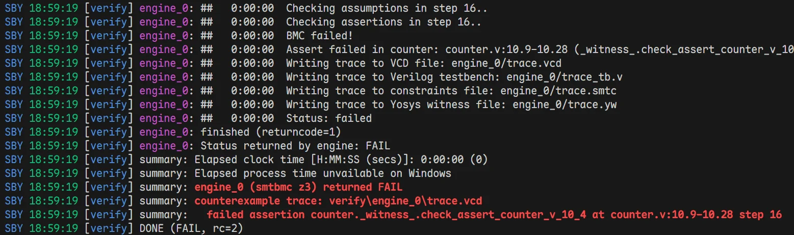

# Windows 原生环境开源EDA工具链构建

[WSL2子系统开发笔记](../../../Tools/wsl2/WSL2子系统开发笔记.md)中提到了如何在 WSL2 中配置 yosys + symbiyosys 等开源 EDA 工具链的详细步骤。但是这种方法依赖 WSL2，饱受文件跨系统 I/O 极慢、环境配置繁琐之苦、而且开发时还需要远程连接 WSL2，频繁在 Windows 和 Linux 之间切换，极大降低效率。

本指南将搭建一个**纯 Windows 原生、零 DLL 冲突、完美融合 Python 验证生态 (Cocotb/Pyverilog) 与顶级开源 EDA 引擎 (Yosys/SBY/Z3)** 的开发环境。

**🛠️ 包含的工具链**
*   **综合与形式验证引擎**：Yosys, SymbiYosys (SBY), Z3, Boolector
*   **仿真与波形查看**：Icarus Verilog (iverilog), vvp, GTKWave
*   **Python 高级验证生态**：Anaconda, Cocotb, Pyverilog

## I. 部署 OSS CAD Suite

OSS CAD Suite 包含了所有我们需要的底层 EDA 引擎的 Windows 预编译版。

### 1.1 下载与解压
访问 [YosysHQ/oss-cad-suite-build Releases](https://github.com/YosysHQ/oss-cad-suite-build/releases)，下载最新的 `windows-x64` 压缩包或者`.exe`，大概300-400MB左右。

下载好之后，将其解压到一个**完全没有中文字符和空格**的路径下（例如 `D:\EDA\oss-cad-suite`）。

### 1.2 环境变量配置

#### 1.2.1 全局配置法

打开 OSS CAD Suite 安装解压后的文件夹，找到其中的
- `bin`
- `lin`
目录，比如：
- `D:\EDA\oss-cad-suite\bin`
- `D:\EDA\oss-cad-suite\lib`

复制路径，添加进入系统环境变量的 `Path` 中。

之后，新开一个 `powershell` 或者 `cmd` 窗口，输入：
```bash
yosys -V
iverilog -V
```
如果能够正确显示版本号，则代表环境配置成功了。

**⚠️注意：**
有可能输入`yosys -V` 后，系统弹出一个弹窗：


显示**动态链接库**相关的错误。这是因为你之前电脑里装过的某些软件（如 Git、Anaconda）也带了一个老版本的 `libstdc++-6.dll`，而且它们的路径在系统环境变量里优先级比 OSS CAD Suite 的路径更高，导致 Yosys 启动时误加载了那个老版本的 DLL，从而崩溃。

!!! warning 一种解决办法
    在系统环境变量PATH中，将 `D:\EDA\oss-cad-suite\bin` 和 `D:\EDA\oss-cad-suite\lib` 的优先级**调到最前面**，确保它们在任何其他软件的路径之前。这样系统就会优先加载 OSS CAD Suite 自带的最新版 DLL，解决冲突问题。

    但是这样做后，其实是有潜在风险的，把 OSS CAD Suite 的 lib 提到了全局最高优先级，意味计算机上以后任何软件（只要它没有把自己的 `DLL` 放在和 `.exe` 同一个目录下），在需要调用 `C++` 库时，都会被迫使用 OSS CAD Suite 提供的这个 `libstdc++-6.dll`。
    
    虽然 C++ 的标准库通常是向下兼容的，但是保不齐哪天某个就软件遇到了“编译器底层异常处理模型不匹配”就会瞬间无提示闪退，这也是极其不推荐把包含通用 `DLL` 的 lib 文件夹放到系统全局变量最顶端的原因。

#### 1.2.2 推荐的“环境融合”配置法
✅ **安全做法**：全局环境变量中**什么都不加**，我们利用 **VS Code 的集成终端配置功能**隔离这些环境。详见第III节


## II. 安装专用于 EDA 生态的 Python 环境

Python 生态如今在芯片设计与验证领域非常火热，虽然底层往往还是调用 C/C++ 编写的求解器（如 Z3），但 Python 提供了极佳的 API 和易用性。

首先利用 Anaconda 或者 Miniconda 创建一个新的 Python 虚拟环境（例如命名为 `rtl`），Python 版本推荐3.10或者3.11：
```bash
conda create -n rtl python=3.11 -y
```

然后**进入该环境**，安装如下 Python 包：
```bash
conda activate rtl
pip install --upgrade pip
pip install z3-solver pyverilog cocotb pytest
```

该 Python 环境专用于芯片设计验证，虽然安装了这些包，但是它们底层还是调用的 OSS CAD Suite 里的求解器和仿真器。

至此，如果在第 I. 步中，我们选择了**全局配置法**，接下来可以**直接跳过第 III 节**，去第 IV. 节测试环境了；如果我们选择了**推荐的“环境融合”配置法**，请继续往下看第 III 节，**完成 VS Code 终端的环境融合配置**。

## III. 在 VS Code 中配置“环境融合”终端

我们希望在开发时，既能使用 **Anaconda** 的 **Python** 环境，又能调用 **OSS** 的 **EDA** 工具，且两者互不干扰。而且我们又不想把 Andaconda 环境和 OSS EDA 环境添加进入系统环境变量**污染系统环境**，这个时候，VS Code 的集成终端配置功能可以帮助我们搞定一切，完美隔离所有环境！

### 3.1 配置 `settings.json`

VS Code中，在 `settings.json` 中找到 `"terminal.integrated.profiles.windows"`，追加以下配置：

```json
"terminal.integrated.profiles.windows": {
    "EDA": {
        "source": "PowerShell",
        "icon": "chip",
        "args":[
            "-NoExit",
            "-Command",
            "& 'D:\\Anaconda\\shell\\condabin\\conda-hook.ps1'; conda activate rtl; Write-Host '✅ Conda rtl 环境激活成功' -ForegroundColor Green; $env:PATH = 'D:\\EDA\\oss-cad-suite\\bin;D:\\EDA\\oss-cad-suite\\lib;' + $env:PATH; Write-Host '✅ Conda 和 OSS CAD 环境已融合就绪！' -ForegroundColor Green"
        ]
    }
}
```

**参数修改提示**：
- 请将 `D:\\Anaconda\\shell\\condabin\\conda-hook.ps1` 替换为电脑上实际的 Anaconda 路径。
- `conda activate rtl` 中的 `rtl` 是我们第 II. 节创建的 Conda 虚拟环境名。
- 请将 `D:\\EDA\\oss-cad-suite...` 替换为你实际解压的路径。

### 3.2 验证配置

**使用方法**：在 VS Code 终端面板点击右上角 `+` 号旁边的下拉箭头，选择 **"EDA"**。你将看到两条绿色的成功提示。
```bash
✅ Conda rtl 环境激活成功
✅ Conda 和 OSS CAD 环境已融合就绪！
(rtl) PS D:......>
```

**验证环境是否就绪：**
在此终端中输入以下命令：
* `yosys -V` (输出版本号，且无弹窗报错)
* `iverilog -V` (输出详细版本信息)
* `python -V` (输出 Anaconda 的 Python 版本)


至此，我们就完成了EDA环境的融合以及与全局环境的完美隔离！在上述几条简单的配置命令中，我们实现了的包括：
1. **conda 环境与全局环境的隔离**
2. **OSS 生态工具与全局环境的隔离**：也就是说，如果之前还安装了原生的`iverilog, vvp, gtkwave`工具，并且添加进入了环境变量，它们是不会受到任何影响的，依旧可以像之前一样使用，绝对干净！）
3. **`rtl` 环境与 OSS 生态工具的融合**：在这个专用终端里，既可以使用 conda 环境的 `python` 调用 `cocotb` 和 `pyverilog`，又可以直接调用 `yosys`, `sby`, `z3` 等工具

## IV. 环境功能测试与实战例程

为了确保我们的环境完美工作，我们可以跑两个经典的验证实验。以下操作均在 `rtl` 环境中进行。

### 4.1 实验 A：等价性检查 (LEC) - 测试 Yosys 内置 SAT 引擎
证明“直接相加”和“使用结合律相加”的两个模块在所有输入组合下绝对等价。

1. 创建 `gold.v` (参考模型)：
```verilog
module gold(input [7:0] a, input [7:0] b, input[7:0] c, output [7:0] out);
    assign out = (a + b) + c;
endmodule
```
2. 创建 `gate.v` (修改后的模型)：
```verilog
module gate(input [7:0] a, input [7:0] b, input [7:0] c, output [7:0] out);
    assign out = a + (b + c);
endmodule
```
3. 创建 `lec.ys` (Yosys 脚本)：
```tcl
read_verilog gold.v
read_verilog gate.v
proc
opt
equiv_make gold gate equiv_top
hierarchy -top equiv_top
flatten
opt_clean -purge
equiv_simple
equiv_status -assert
```
4. 运行：`yosys -s lec.ys`。
**预期结果**：输出 `Successfully proved 8 equivalences...`（证明成功）。


### 4.2 实验 B：有界模型检查 (BMC) - 测试 SBY 与 Z3 求解器
用形式验证去寻找计数器代码里的“漏洞”。

1. 创建 `counter.v`：
```verilog
module counter(input clk);
    reg[3:0] count = 0;
    always @(posedge clk) begin
        count <= count + 1;
    end

`ifdef FORMAL
    always @(posedge clk) begin
        assert(count != 15); // 我们断言 count 永远到不了 15
    end
`endif
endmodule
```
2. 创建 `verify.sby`：
```ini
[options]
mode bmc
depth 20

[engines]
smtbmc z3[script]
read -formal counter.v
prep -top counter

[files]
counter.v
```
3. 运行：`sby -f verify.sby`。
**预期结果**：输出红色的 `DONE (FAIL, rc=2)`。


## V. Appendix: 常见避坑指南 (FAQ)

### 5.1 运行 SBY 时报错 `UnicodeDecodeError: 'gbk' codec can't decode...`？
**A1**：Windows 的 Python 默认用 GBK 读取文件，而 VS Code 默认生成 UTF-8。请**绝对不要**在任何输入给 SBY 的文件（如 `.v`, `.sby`）中写**中文字符或中文注释**。删掉中文即可秒解。

### 5.2: 之前装在系统的全局 `iverilog` 或 `gtkwave` 还能用吗？
**A3**：**完全可以！** 这个方案的绝妙之处在于：在普通的终端里，系统依然调用你以前的全局工具；而在 VS Code 的 "EDA" 专用终端里，由于我们在脚本里使用了 `$env:PATH = 'D:\...\bin;' + $env:PATH`，OSS 套件被插到了最前面，它会**安全地遮蔽（Shadow）**掉系统的旧工具。井水不犯河水！
