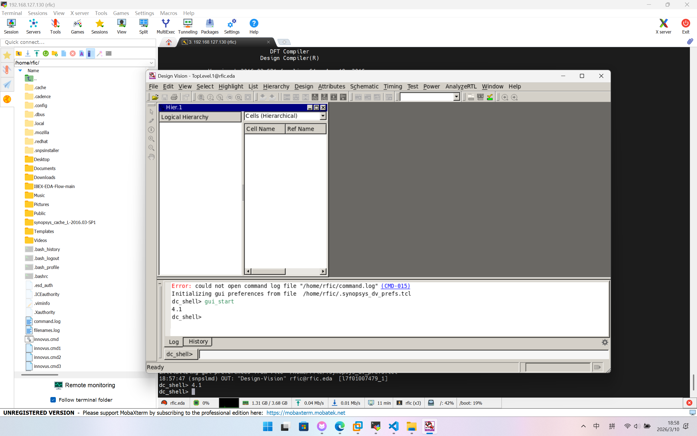

# MobaXterm 连接 Linux 虚拟机/服务器

## Quick Start

如果一切配置没问题，只需要打开虚拟机/服务器后，获取：
1. IP 地址（如果是虚拟机，一般固定，如果是服务器，一般需要位于同一局域网）
2. 用户名和密码
3. 端口号

就可以很简单地通过 SSH 连接本地计算机和远程 Linux 了。SSH 是一种安全的远程登录协议，其载体有操作系统原生终端、VS Code 以及非常强大并且免费的 MobaXterm。

!!! notes "关于 MobaXterm"
    MobaXterm 是 Windows 上的一个终端模拟器，内置了 **SSH 客户端**和 **X11 服务器**，支持图形界面转发，非常适合连接 Linux 虚拟机和服务器。通过 MobaXterm，你可以像在本地一样使用 Linux 的命令行工具，还能直接运行 Linux 上的图形界面应用，非常方便。

但是有些虚拟机的网卡配置非常繁琐，输入 `ipconfig` 或者 `ip addr` 可能会发现网卡没有 IP 地址，或者每次开机 IP 都变来变去，导致 SSH 连接非常麻烦。如下是一个典型的例子。

> 目前只针对《2026 MST4307 设计自动化引论》虚拟机，其他 Linux 发行版可能会有不同的解决方案。


## I. 使用 MobaXterm 和 SSH 远程连接虚拟机

### 1.1 第一阶段：暴力获取临时网络（在 虚拟机 Terminal 中操作）
打开 VMware 虚拟机，进入桌面后右键打开终端，输入：
```bash
sudo dhclient eth0
```
*(输入密码时屏幕不会显示，输完回车即可。这步是强制向系统要一个 IP)*
紧接着输入：
```bash
ip addr
```
找到 `eth0` 那一栏里 `inet` 后面的 IP 地址（例如 `192.168.127.130`），记下它。

如下示例：
```bash
[rfic@rfic ~]$ ip addr
1: lo: <LOOPBACK,UP,LOWER_UP> mtu 65536 qdisc noqueue state UNKNOWN group default qlen 1000
    link/loopback 00:00:00:00:00:00 brd 00:00:00:00:00:00
    inet 127.0.0.1/8 scope host lo
       valid_lft forever preferred_lft forever
    inet6 ::1/128 scope host 
       valid_lft forever preferred_lft forever
2: eth0: <BROADCAST,MULTICAST,UP,LOWER_UP> mtu 1500 qdisc fq_codel state UP group default qlen 1000
    link/ether 00:0c:29:34:b0:83 brd ff:ff:ff:ff:ff:ff
    inet 192.168.127.130/24 brd 192.168.127.255 scope global dynamic eth0
       valid_lft 1571sec preferred_lft 1571sec
    inet6 fe80::20c:29ff:fe34:b083/64 scope link 
       valid_lft forever preferred_lft forever
3: virbr0: <NO-CARRIER,BROADCAST,MULTICAST,UP> mtu 1500 qdisc noqueue state DOWN group default qlen 1000
    link/ether 52:54:00:d7:84:7b brd ff:ff:ff:ff:ff:ff
    inet 192.168.122.1/24 brd 192.168.122.255 scope global virbr0
       valid_lft forever preferred_lft forever
4: virbr0-nic: <BROADCAST,MULTICAST> mtu 1500 qdisc fq_codel master virbr0 state DOWN group default qlen 1000
    link/ether 52:54:00:d7:84:7b brd ff:ff:ff:ff:ff:ff
[rfic@rfic ~]$ 
```

### 1.2 第二阶段：使用 MobaXterm 远程连接

1. 回到 Windows，打开 MobaXterm，点击左上角 **Session -> SSH**。
2. **Remote host** 输入刚才查到的 IP（如 `192.168.127.130`）。
3. 勾选 **Specify username**，输入 `rfic`（本机的一个用户名），点击 OK。
4. 输入密码连入 Linux 黑框。

### 1.3 第三阶段：一键根治脚本（在 MobaXterm 里复制粘贴运行）
连上 MobaXterm 后，直接依次复制并运行以下 6 行命令，彻底解决克隆虚拟机的“网卡失忆症”：

**1. 停用并禁用固执的 NetworkManager**
```bash
sudo systemctl stop NetworkManager
sudo systemctl disable NetworkManager
```
**2. 杀掉刚才第一步临时开启的 dhclient 进程，释放网卡**
```bash
sudo killall dhclient
```
**3. 删掉底层记录旧硬件的幽灵文件（如果有的话）**
```bash
sudo rm -f /etc/udev/rules.d/70-persistent-net.rules
```
**4. 修正网卡配置文件（删除旧硬件绑定，并开启开机自启）**
```bash
sudo sed -i '/HWADDR\|UUID/d; s/ONBOOT=no/ONBOOT=yes/g' /etc/sysconfig/network-scripts/ifcfg-eth0
```
**5. 启用最稳定、最经典的老牌 network 服务**
```bash
sudo systemctl start network
sudo systemctl enable network
```
*(注：如果看到 redirecting to /sbin/chkconfig 的提示，属于正常成功提示，无视即可)*

### 1.4 第四阶段：重启并见证奇迹
在 MobaXterm 里输入：
```bash
sudo reboot
```
**注意：** 重启后，由于我们重置了网络，**你的 IP 可能会发生最后一次变化**（比如从 `.129` 变成 `.130`）。
1. 回到 VMware 窗口，登录后输入 `ip addr` 看一眼最新的 IP 是多少。
2. 在 MobaXterm 里右键你刚才的 Session，修改成这个最新的 IP。
3. 以后每次开机，这个网络都会自动连上，**再也不需要敲任何命令了！**


### 1.5 测试：X11 神技（图形界面转发）
连接成功后，在 MobaXterm 里直接敲 `design_vision`。你会发现 Design Compiler 的图形界面直接像 Windows 软件一样弹出来了，极其丝滑！
如图：



唯一美中不足的是这并不是 Windows 真正的软件界面，而是从虚拟机中转发的，所以清晰度会稍微差一点，但完全不影响使用。

此外，MobaXterm 内置 Windows 友好的侧边资源管理器（如上图左侧）以及文本编辑器（MobaTextEditor，双击文件资源管理器中的文件即可打开），完全可以在 MobaXterm 文本编辑框中直接编辑虚拟机里的文件

---


## II. 影响评估

!!! question "这些配置会不会产生负面影响（Bug、掉帧、性能下降）？"
    答案是：不仅不会，反而会让你的虚拟机更稳定、性能更好。

1. **关于禁用 NetworkManager：** 在企业级的 RHEL/CentOS 7 服务器运维中，**禁用花里胡哨的 NetworkManager，换回纯净的 `network` 服务，是业界的“标准教科书操作”**。它不仅不会导致 Bug，反而彻底排除了图形界面网络组件对系统底层的干扰，极大地提升了稳定性。
2. **关于性能：** 通过 MobaXterm 远程连接，虚拟机的图形桌面（GNOME）处于休眠状态，释放了大量的 CPU 和内存资源。你现在把更多的算力留给了 Design Compiler（EDA工具），综合速度只会更快。
3. **关于 EDA 软件许可（License）：** 很多 EDA 软件的 License 是绑定网卡的。你现在拥有了一个稳定自启的 `eth0` 网卡，后续做任何实验都不会因为找不到网卡而报错。