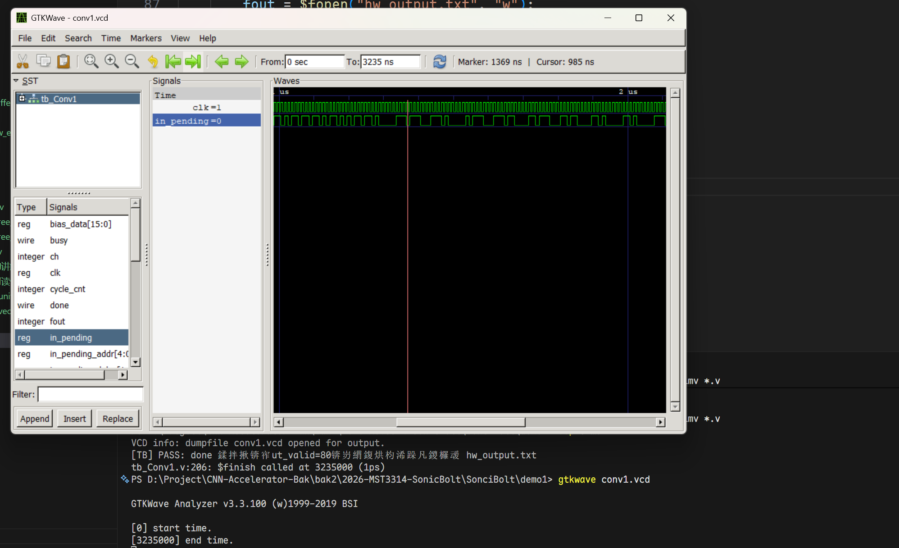
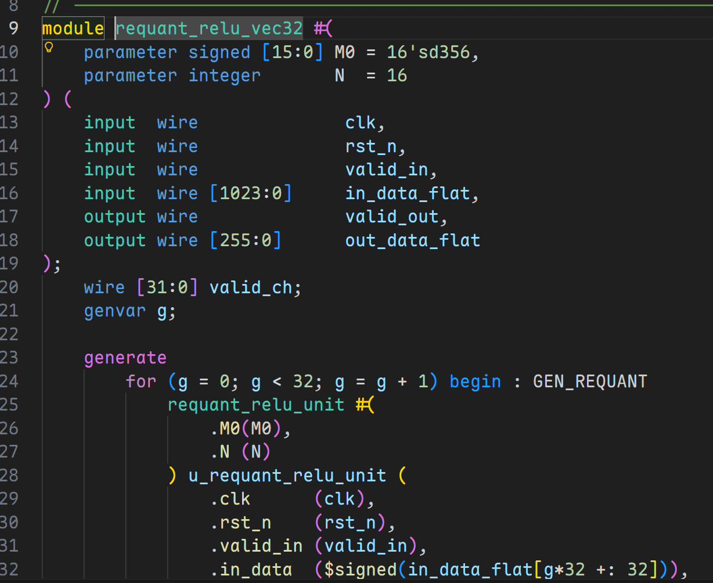
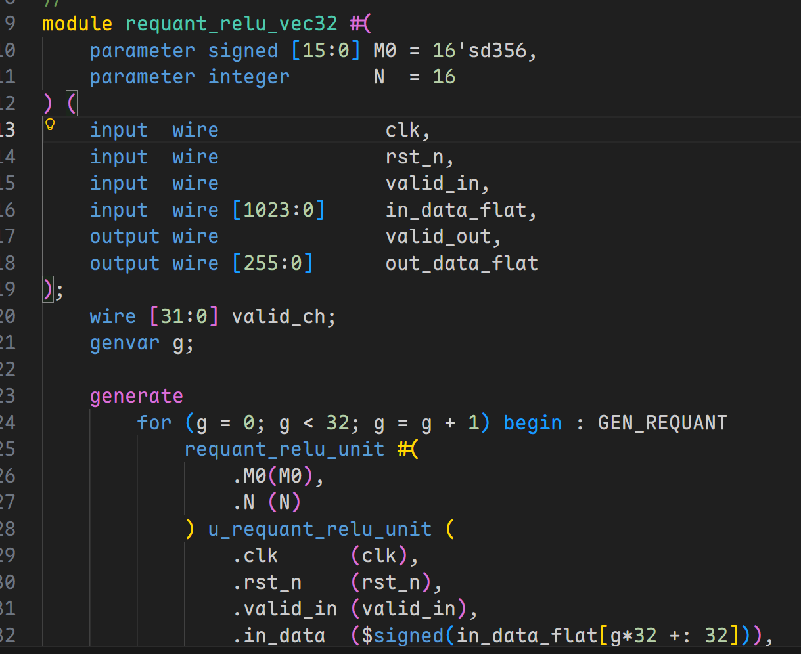

# VS Code + Verilog 代码编辑工具链配置

> 以下操作针对：Windos 操作系统


## I. Icarus Verilog 工具

### 1.1 安装 Icarus Verilog
推荐使用 **官方 Windows 预编译版本**。

下载界面：[https://bleyer.org/icarus/](https://bleyer.org/icarus/)

下载 Windows 版本，名字例如：

```
iverilog-v12-20220611-x64_setup [18.2MB]
```

下载后双击运行即可，注意**可以自定义安装目录**
例如：
```
D:\EDA\iverilog
```

!!! note "GTKWave"
    GTKWave 是一个波形查看工具，Icarus Verilog 的 Windows 预编译版本中已经包含了 GTKWave 的安装包，**安装 Icarus Verilog 时会提示是否安装 GTKWave，建议安装**。


安装完成后目录结构类似：

```
D:\EDA\iverilog\iverilog
 ├─bin
 │   ├─iverilog.exe
 │   ├─vvp.exe
 │   └─...
 ├─gtkwave     # 如果勾选了安装 GTKWave，则会有这个目录
 │   ├─bin
 ├─include
 └─lib
```

### 1.2 配置环境变量

安装完成后，将 `bin\` 目录添加到系统环境变量 `Path` 中。

之后依次在 Powershell 中输入：
```bash
iverilog -V
vvp -V
gtkwave --version
```

> 如果勾选了安装 GTKWave，则也需要将 `gtkwave\bin\` 目录添加到系统环境变量 `Path` 中。

如果均成功显示版本信息，则说明配置成功。

### 1.3 运行！

假设当前目录有一个编译不报错的 Verilog 文件项目

#### 1.3.1 编译

VS Code 中 ==Ctrl + `== 打开 PowerShell（或者你在 setting.json 中配置的启动终端，Windows 默认是 PowerShell）：

```bash
iverilog -g2005-sv -o simv *.v
```

其中 `-g2005-sv` 是告诉编译器使用 SystemVerilog 2005 标准，`-o simv` 是指定输出的可执行文件名为 `simv`，`*.v` 是编译当前目录下的所有 `.v` 文件。

#### 1.3.2 仿真

```bash
vvp simv
```

#### 1.3.3 查看波形
如果想要查看波形，首先你得有波形文件才行！
在 `testbench` 脚本中用 `\$dumpfile` 和 `\$dumpvars` 语句生成波形文件

然后：
```bash
gtkwave <你的波形文件名字>.vcd
```
之后 powershell 调用 GTKWave 工具就会弹出一个图形界面，选择你生成的波形文件，就可以查看波形了。




## II. SystemVerilog 插件：跨文件跳转

我们在写 `Python`, `Rust`, `C++` 等高级语言时，IDE 都会提供跨**文件跳转**功能，例如在 `Python` 中按住 `Ctrl` 键点击一个**函数调用**，就可以跳转到该函数的定义处，这极大地提升了开发效率。这些文件跳转功能并非编程语言本省的特性，也并非 VS Code 本身功能，而是由**第三方插件**提供的功能支持；如果使用的是 `Pycharm`, `CLion`, `Rust Analyzer` 等 专业级IDE，跨文件跳转功能也是由这些 IDE 自带的，不需要额外安装。

但是在数字电路领域， `Verilog` 语言并没有一个**像样**的文本编辑工具能够完成诸如跨文件跳转、语法检查等功能，虽然 `Vivado` 和 `Quartus` 等综合工具提供了一个文本编辑器，但它们的编辑器功能非常有限，无法满足日常开发需求。

如果想要扩展编辑 `Verilog` 的体验，最好借助于 VS Code 的插件生态（虽然目前支持 `Verilog` 的插件并不多）。

VS Code 搜索插件：
```
SystemVerilog
```

**注意插件开发者是：Eirik Prestegårdshus**

该插件的功能：
- 语法高亮✅️
- 语法检查❓️
- 跨文件跳转✅️

注意，**跨文件跳转功能需要额外下载一个叫做 `ctags` 的工具**，安装方法：
1. 搜索 https://github.com/universal-ctags/ctags
2. Release 页面下载 Windows 版本的预编`.zip`包
3. 解压到任意目录，例如 `D:\EDA\ctags`
4. 添加 `D:\EDA\ctags\bin` 到系统环境变量 `Path` 中

之后，在 VS Code 按 `Crtl + Shift + P`，输入 `setting.json`用户设置，添加如下键值对：
```json
"systemverilog.ctags": <你的ctags.exe的绝对路径，注意反斜杠转义>, 
"systemverilog.disableLinting": true, 
```

之后重启 VS Code，**就可以点击子模块实现跨文件跳转了**。

`SystemVerilog` 插件还附加了非常漂亮的**语法高亮**，能够让代码更清晰易读。例如：


!!! warning "语法检查功能缺失"
    此外，还有一个非常头疼的点就是，`SystemVerilog` 插件**似乎无法做语法检查**，例如 `always @` 语句少了一个`@`，该插件无法检测出来，虽然我们的编译工具和综合工具能够在综合时发现问题，但无法在编辑时提供实时反馈，影响开发效率。
    **如果想要语法检查功能，可以安装一个叫做 `Verilog-HDL/SystemVerilog/Bluespec SystemVerilog` 的插件**，见下一节。
    **但请注意**：如果启用 `Verilog-HDL/SystemVerilog/Bluespec SystemVerilog` 插件，会导致 `SystemVerilog` 插件的语法高亮效果损失一部分，但是跨文件跳转功能正常。 


???+ success "也不是完全不行？"
    ==见第三步的黑魔法，能够同时启用语法高亮、跨文件跳转功能和语法检查功能==。

## III. Verilog-HDL/SystemVerilog/Bluespec SystemVerilog 插件：语法检查

### 3.1 语法检查

如果你还没有安装 `Icarus Verilog`，请立即回到第一步先安装 `Icarus Verilog`，因为该插件的语法检查功能依赖于 `Icarus Verilog` 的编译器来实现。

VS Code 插件市场搜索 `Verilog-HDL/SystemVerilog/Bluespec SystemVerilog`，安装由 `Mshr-H` 开发的插件。

然后按 `Crtl + Shift + P`，输入 `setting.json`用户设置，添加如下键值对：
```json
// --- mshr-h 插件配置：只做查错 ---
"verilog.linting.linter": "iverilog",
"verilog.linting.iverilog.runAtFileLocation": true, // 【关键1】让 iverilog 在当前文件所在目录运行
"verilog.linting.iverilog.arguments": "-y .", // 【关键2】告诉 iverilog 去当前目录('.')寻找未知的子模块！解决误报！
"verilog.ctags.path": "<改成你的ctags.exe的绝对路径>", // 防止控制台吭哧吭哧刷报错
"verilog.hover.enable": true, // 开启悬停提示
```
之后，就可以同时完成**语法检查**了，但是 `SystemVerilog` 插件的**语法高亮效果会损失一部分（如下图，可以与之前的高亮效果对比以下）**，**但跨文件跳转功能正常**。


### 3.2 黑魔法

如果你硬要想同时启用 `SystemVerilog` 插件的语法高亮、跨文件跳转功能和 `Verilog-HDL/SystemVerilog/Bluespec SystemVerilog` 插件的语法检查功能，有一个**黑魔法：**

**我们强制让插件把 .v 文件识别为 SystemVerilog 文件**！

只需要在 `setting.json` 用户设置中添加如下键值对：
```json
"files.associations": {
    "*.v": "systemverilog",
    "*.vh": "systemverilog"
},
```

## IV. TerosHDL

### 4.1 TerosHDL 插件介绍
相比前面两个工具，TerosHDL 是一款致力于将 VS Code 打造为全功能 FPGA IDE 的开源插件。在我们的这套方案中，我们主要利用它极其出色的**代码分析能力**和**图形化渲染能力**。

它的核心优势是足够轻量化，无需安装庞大的商业 EDA 软件（如 Vivado/Quartus），即可通过轻量级工具链实现 RTL 电路图预览。杀手锏功能：
- `Schematic Viewer`：自动解析代码连线，生成可交互的 RTL 原理图。
- `State Machine Viewer`：自动提取 always 块中的 case 逻辑，绘制状态转移图（FSM）。
- `自动例化与文档生成`：提供快速的代码重构支持。

!!! note "安装前请注意"
    这些功能仅仅属于锦上添花级别，如果`SystemVerilog`插件和`Verilog-HDL/SystemVerilog/Bluespec SystemVerilog`插件已经解决了你的问题，那么你完全可以不安装 TerosHDL 插件，因为该插件相比前两个插件本身比较笨重，安装后会占用较多的系统资源，可能会导致 VS Code 运行变慢。或者可以将其安装在 VS Code Insider 中，专门用于查看 RTL 原理图和状态转移图。

### 4.2 环境配置
TerosHDL 的原理图功能依赖于 `Yosys`（开源逻辑综合工具）。在 Windows 下，最稳妥、最现代的安装方式是使用 Yowasp（Python 移植版），它不需要复杂的环境变量配置。

安装方法：
```bash
pip install yowasp-yosys
```

如果你不想污染你的全局python环境，当然可以使用 venv, uv, conda等方法虚拟环境，这里不再介绍。


###  4.3 TerosHDL 配置步骤
在 VS Code 插件市场中搜索 `TerosHDL`，安装。

1. 第一步：进入配置界面
    点击 VS Code 左侧活动栏的 `TerosHDL` 图标，在弹出面板中点击 `Open Global SettingS Menu`。
2. 第二步：配置原理图引擎 (Schematic Viewer)
    在配置页面的左侧导航栏找到 Schematic Viewer，进行以下设置：
    Select the backend: 选择 YOWASP(Only Verilog/SV)。
    然后点击 `Apply`。
3. 第三步：规避插件冲突 (Linter)
    由于我们已经有 mshr-h 插件负责语法检查，需要关闭 TerosHDL 的相关功能以节省性能并防止重复报错：
    回到配置页面，左侧导航栏找到 Linter settings，点击，进去将所有项设置为 `Disabled` 即可。
    然后点击 `Apply`。
    然后打开 `setting.json` 用户设置，添加如下键值对：
    ```json
    "teroshdl.linter.verilog.linter": "None",           // 封杀 TerosHDL 的查错
    "teroshdl.formatter.verilog.formatter": "None"      // 封杀 TerosHDL 的格式化
    ```

### 4.4 使用示例
VS Code中随便打开一个 `.v` 或者 `.sv` 文件，在编辑器右上角会出现这三个图标：


从左到右分别是：
- `自动例化与文档生成`：自动化生成该 RTL 的端口分析文档。
- `Schematic Viewer`：自动解析代码连线，生成可交互的 RTL 原理图。
- `State Machine Viewer`：自动提取 always 块中的 case 逻辑，绘制状态转移图（FSM）。

**尤其是后面两个效果很不错，写完 RTL 后可以快速帮你排查当前模块的功能实现是不是符合你的预期！**