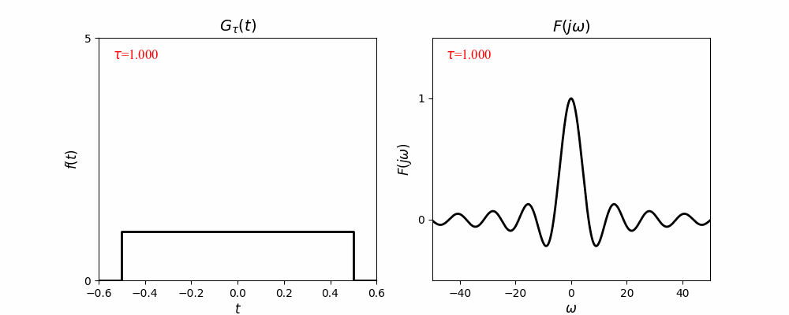
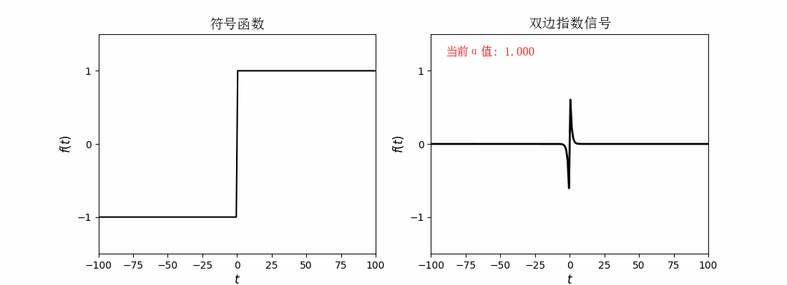
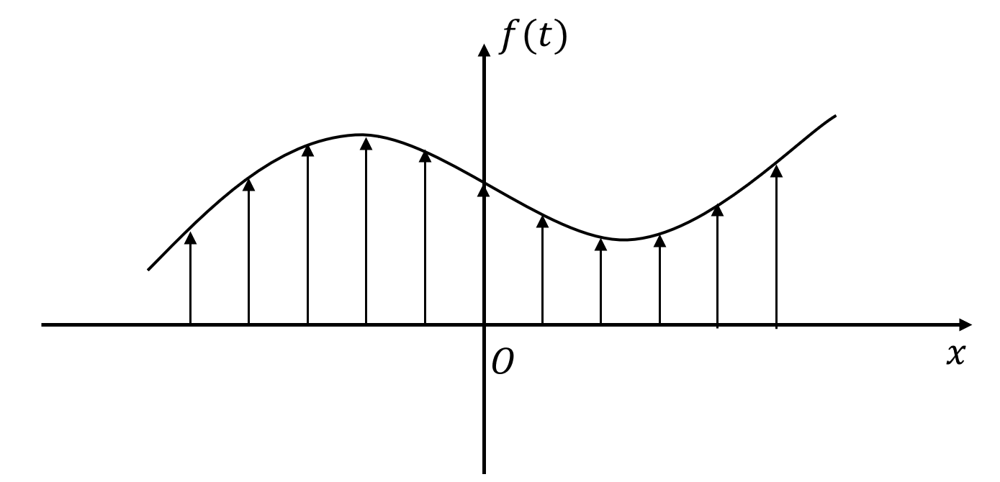
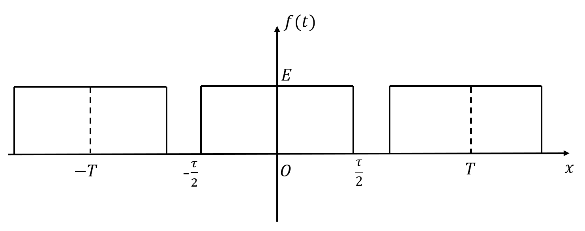
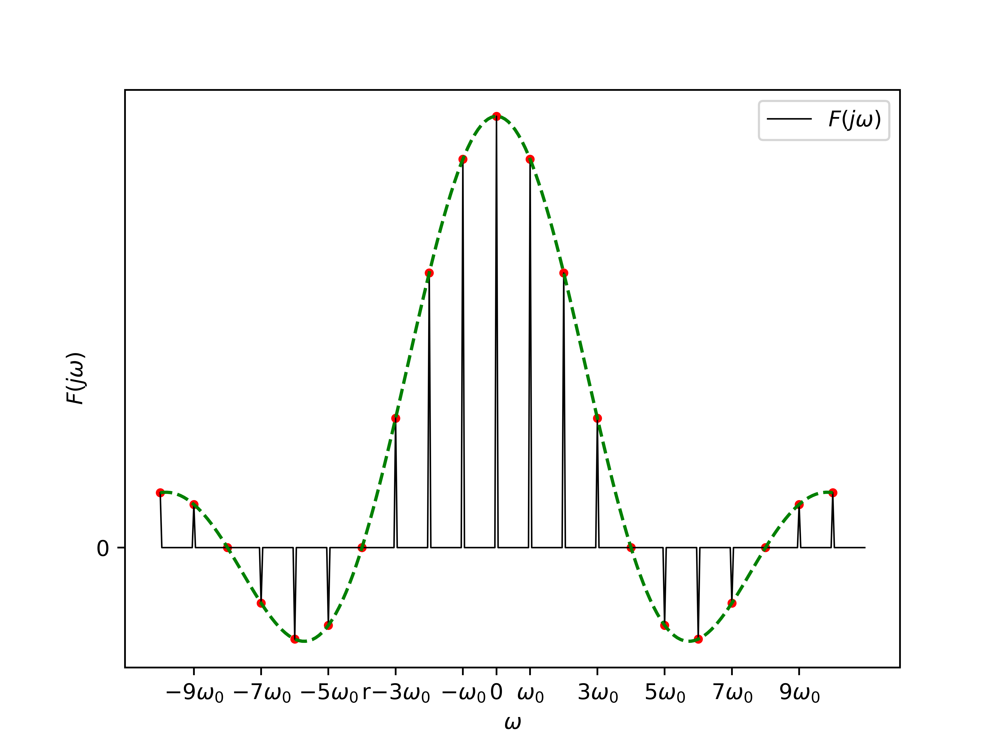

# 连续时间傅里叶变换（1）
## 一. 导言
本文将从傅里叶级数的对于非周期信号无效的缺陷开始，一步一步推导出连续时间信号频域分析中的一个更强有力的工具——傅里叶变换，并继续推导常见信号的傅里叶变换表达式，以及将傅里叶变换的适用范围继续推广至周期信号，完成频域分析基础的奠定。

## 二.  非周期信号的傅里叶级数表示：连续时间傅里叶变换

### 2.1  如何用傅里叶级数展开非周期信号？
我们先考虑最小正周期为$T$的周期信号$f(t)$，其傅里叶级数公式为：

$$f(t)=\sum_{k=-\infty}^{+\infty}F_ke^{jk\omega_0t}, \quad F_k = \frac{1}{T}\int_{T}f(t)e^{-jk\omega_{0}t}\, dt \tag{2.1}$$

其中：$\omega_{0}=\frac{2\pi}{T}$
现在我们让周期$T$趋近$+\infty$，那么同时有$\omega_{0}$趋近于0：

$$F_k = \frac{1}{T}\int_{-\infty}^{+\infty}f(t)e^{-jk\omega_{0}t}\, dt=\frac{1}{2\pi}\int_{-\infty}^{+\infty}f(t)e^{-jk\omega_{0}t}\, dt \cdot \omega_{0} \tag{2.2}$$

如果$\omega_{0}$已经趋于零，即成为一个无穷小量，那么频率序列$k\omega_{0}$趋于连续，这个时候，
我们用**连续变量$\omega$表示$k\omega_{0}$**，那么$\omega_{0}$该怎么表示呢？
答案是：$dω$
怎么理解呢，从数学形式上来看，$dω = (k+1)\omega_0-k\omega_{0}$ for $\omega_{0} \rightarrow 0$，**即相邻两个频率的间隔**。
在频谱图中看更为直观，在频谱图中，$\omega_{0}$就是两个相邻频率间的距离，在周期趋于无穷大时，相邻频率间的距离越来越近，趋于无穷小量，即$\omega_{0}$趋于无穷小量，加上其表示频率间隔的含义，可以得到：$\omega_{0}=d\omega$
此时，$F_k$可以表示为“连续频率”的形式：

$$F_k=\frac{1}{2\pi}\int_{-\infty}^{+\infty}f(t)e^{-j\omega t} \,dt \cdot d\omega \quad \tag{2.3}$$

我们令：

$$F(\omega)=\int_{-\infty}^{+\infty}f(t)e^{-j\omega t} \,dt \quad \tag{2.4}$$

则：

$$F_k=\frac{d\omega}{2\pi}F(\omega) \quad \tag{2.5}$$

则原信号的傅里叶展开式可化为：

$$f(t)=\frac{1}{2\pi}\sum_{\omega=-\infty}^{+\infty}F(\omega)e^{j\omega t}\cdot d\omega$$

符合黎曼积分的求和结构与积分定义，则在最小正周期趋近于无穷大时，原信号变为非周期信号，其傅里叶技术展开可以写为：

$$f(t)=\frac{1}{2\pi}\int_{-\infty}^{+\infty}F(\omega)e^{j\omega t}\,d\omega\tag{2.6}$$

至此，我们就得到了**非周期信号**的“傅里叶级数展开”形式，由于是非周期信号，与一般周期信号的傅里叶展开不同，其“傅里叶系数”$F_k$的频谱不再是离散的，而成为**连续**的，同时其“展开”也并非简单的代数和，而是**黎曼和**。
可以发现，在这些步骤中，最关键的一步就是基于$T$为无穷大的前置条件，而**将离散频谱形式的傅里叶系数化为连续形式**，即(2.3)，我们将该转换中的周期-频率无关项提取出来，得到了其中有关原函数$f(t)$的、最基础的变换形式$F(\omega)$**（很多时候，我们也将$F(\omega)$写作$F(j\omega)$）**，即(2.4)，我们把该变换称作：**傅里叶变换**，即：

$$F(j\omega)=\int_{-\infty}^{+\infty}f(t)e^{-j\omega t} \,dt\tag{2.7}$$

### 2.2  傅里叶变换
对于满足狄里赫利条件的非周期信号$f(t)$，其傅里叶变换对定义为：

$$f(t)=\frac{1}{2\pi}\int_{-\infty}^{+\infty}F(j\omega)e^{j\omega t}\, d\omega \text{——综合公式}\tag{2.8}$$

$$F(j\omega)=\int_{-\infty}^{+\infty}f(t)e^{-j\omega t} \,dt \text{——分析公式}\tag{2.9}$$

分析公式(2.9)也称作**傅里叶变换**，综合公式(2.8)也称作**傅里叶反变换**。
例如，LTI的频率响应，正是其单位冲激响应的傅里叶变换：

$$H(j\omega)=\int_{-\infty}^{+\infty}h(t)e^{-j\omega t}\, dt$$

这里，我们将周期信号的傅里叶展开以及非周期信号的傅里叶变换对公式列出，帮助大家理解他们之间的区别于联系，以及理解我们是怎样根据周期信号的傅里叶级数表示，一步一步推导出非周期信号的傅里叶变换公式的：
||周期信号|非周期信号|
|--|--|--|
|展开方法|$f(t)=\sum_{k=-\infty}^{+\infty}F_ke^{jk\omega_0t}$|$f(t)=\frac{1}{2\pi}\int_{-\infty}^{+\infty}F(j\omega)e^{j\omega t}\, d\omega$|
|复指数信号的幅度|$F_k$|$\frac{d\omega}{2\pi}F(j\omega)$|
|频谱状态|复指数信号出现在离散频率上|复指数信号出现在连续频率上|

### 2.3  傅里叶变换的收敛条件
信号$f(t)$满足下述条件之一，其傅里叶变换存在：
 1. **能量有限** $$\int_{-\infty}^{\infty} |f(t)|^2 dt < \infty$$ 
 2. **狄利赫里条件** 
     (1) $f(t)$绝对可积； 
     (2) 在任何有限区间内， $f(t)$只有有限个最大值和最小值； 
     (3) 在任何有限区间内，$f(t)$有有限个不连续点，且在每个不连续点必为有限值。
     
在信号与系统课程中，我们无需关心这些条件如何证明，我们遇到的大多数信号都是不用考虑这些问题的。

### 2.4 傅里叶变换的物理意义
在回答读者这个问题之前，请读者先思索一下下面这几个问题：

(1) 已经有了LTI的卷积分析方法了，我们为什么还要引入周期信号的傅里叶级数？
(2) 周期信号傅里叶级数的物理意义是什么?
(3) 傅里叶级数能否推广给非周期信号？
### 2.5 常见非周期信号的傅里叶变换
**1. 单边指数信号：$e^{-\alpha t}u(t), \alpha＞0 \rightarrow \mathcal{F}\{f(t)\} =  \frac{1}{a + j\omega}$**
>证明：
$\begin{aligned}
F(j\omega) 
={} & \int_{-\infty}^{+\infty} f(t) e^{-j\omega t} dt \\
={} &\int_{0}^{+\infty} e^{-at} \cdot e^{-j\omega t}\,dt \\          
={} & \int_{0}^{+\infty} e^{-(a + j\omega)t} dt    \\ 
= {} &-\frac{1}{a + j\omega} e^{-(a + j\omega)t} \bigg|_{0}^{+\infty} \\         
={} & \frac{1}{a + j\omega}
\end{aligned}$

**2. 双边指数信号：$e^{-\alpha \left|t\right|}u(t), \alpha＞0 \rightarrow \mathcal{F}\{f(t)\} = \frac{2\alpha}{\alpha^2+\omega^2}$**
>证明：
$\begin{aligned}
F(j\omega) 
={} & \int_{-\infty}^{+\infty} f(t) e^{-j\omega t} dt \\
={} &\int_{0}^{+\infty} e^{-a|t|}u(t) \cdot e^{-j\omega t}\,dt \\          
={} & \int_{-\infty}^{0}e^{(\alpha-j\omega )t}\, dt+\int_{0}^{+\infty} e^{-(a + j\omega)t} dt    \\ 
= {} &\frac{1}{a - j\omega} e^{(a - j\omega )t} \bigg|_{-\infty}^{0} + [-\frac{1}{a + j\omega} e^{-(a + j\omega)t} \bigg|_{0}^{+\infty}] \\         
={} & \frac{1}{a - j\omega}+\frac{1}{a + j\omega} \\
= {} & \frac{2\alpha}{\alpha^2+\omega^2} ······\text{为实数}
\end{aligned}$

**3. 矩形脉冲信号：$G_{\tau}(t)=E[u(t+\frac{\tau}{2})-u(t-\frac{\tau}{2})],\quad \tau>0 \rightarrow  \mathcal{F}\{G_{\tau}(t)\} = E\tau\text{Sa}(\frac{\omega \tau}{2})$**

矩形脉冲波示意图见图1.

图1. 矩形脉冲波示意图

>证明：
$\begin{aligned}
F(j\omega)
= {} & \int_{-\infty}^{+\infty}G_{\tau}(t)e^{-j\omega t}dt \\
= {} & \int_{-\frac{\tau}{2}}^{\frac{\tau}{2}}Ee^{-j\omega t}dt \\
= {} & -\frac{E}{j\omega}e^{-j\omega t}\bigg|_{-\frac{\tau}{2}}^{\frac{\tau}{2}} \\
= {} & \frac{E}{j\omega} \cdot (e^{j\omega \frac{\tau}{2}}-e^{-j\omega \frac{\tau}{2}})\\
= {} & \frac{2E}{\omega}\frac{e^{j\omega \frac{\tau}{2}}-e^{-j\omega \frac{\tau}{2}}}{2j}\\
= {} & \frac{2E}{\omega}\sin{\frac{\omega \tau}{2}}\\
= {} & E\tau\text{Sa}(\frac{\omega \tau}{2})\\
\end{aligned}$
其中，抽样函数$\text{Sa}(t)$定义为$\text{Sa}(t)=\frac{\sin{t}}{t}$

> 如果读者还记得周期矩形脉冲信号(也就是本案例的矩形脉冲信号以$T(T >\tau)$为周期进行扩展成为一个周期信号)的傅里叶级数：$\frac{E\tau}{T}\text{Sa}(\frac{k\omega_0\tau}{2})$，对比$\frac{E\tau}{T}\text{Sa}(\frac{k\omega_0\tau}{2})$以及$E\tau\text{Sa}(\frac{\omega \tau}{2})$就会发现两者极为相似。
> 实际上，**对于这种由非周期信号扩展而来的周期信号，其傅里叶级数$F_k$与原非周期信号的傅里叶变换$F(j\omega)$有一个很重要的关系，或者说定理：**
> $$F_{k}=\frac{1}{T}F(jk\omega_0)$$

**4. 抽样函数：$\text{Sa}(\omega_{c}t)=\frac{\sin{\omega_{c}}{t}}{\omega_{c}t} \rightarrow \\ \mathcal{F}\{\text{Sa}(\omega_{c}t)\} = \frac{\pi}{\omega_{c}}[u(\omega+\omega_{c})-u(\omega-\omega_{c})]$**
>证明：
$\begin{aligned}
\mathcal{F^{-1}}\{u(\omega+\omega_c)-u(\omega-\omega_c)\} \\
= {} &\frac{1}{2\pi}\int_{-\infty}^{+\infty}[u(\omega+\omega_c)-u(\omega-\omega_c]e^{j\omega t}\, d\omega \\
={}  &\frac{1}{2\pi}\int_{-\omega_c}^{\omega_c}e^{j\omega t}\, d\omega \\
={} &  \frac{1}{2\pi jt}e^{j \omega t} \bigg|_{-\omega_c}^{\omega_c} \\
={} &  \frac{e^{j \omega_c t}-e^{-j \omega_c t}}{2\pi jt}  \\
={} &  \frac{\sin{\omega_c t}}{\pi t}  \\
={} &  \frac{\omega_c}{\pi }\text{Sa}(\omega_c t)  \\
\end{aligned}$
因此我们有$\mathcal{F}\{\frac{\omega_c}{\pi}\text{Sa}(\omega_c t)\}=u(\omega+\omega_c)-u(\omega-\omega_c)$，**那么由傅里叶变换的线性性**，可得：
$$\mathcal{F}\{\text{Sa}(\omega_c t)\}=\frac{\omega_c}{\pi}[u(\omega+\omega_c)-u(\omega-\omega_c)]$$

**5. 冲激函数：$\delta(t) \rightarrow \mathcal{F}\{\delta(t)\}=1$**
> 证明（方法一）：
$\begin{aligned}
F(j\omega) 
={} &  \int_{-\infty}^{+\infty}\delta(t)e^{-j\omega t}dt \\
={} & \int_{-\infty}^{+\infty}\delta(t)e^{-j\omega 0}dt \\
= {} & 1
\end{aligned}$

>证明（方法二）：
>我们可以考虑冲激函数$\delta(t)$是矩形脉冲函数$G_{\tau}(t)$中$\tau \rightarrow 0$但是$E\tau$固定为1的情况，那么便有：
$\begin{aligned}
F(j\omega) 
={} &  \int_{-\infty}^{+\infty}\delta(t)e^{-j\omega t}dt \\
={} & \lim_{\tau \rightarrow 0}\int_{-\infty}^{+\infty}G_{\tau}(t)e^{-j\omega t}dt \\
= {} & \lim_{\tau \rightarrow 0}E\tau \text{Sa}(\frac{\omega \tau}{2})\\
={} & \lim_{\tau \rightarrow 0}E\tau \frac{\sin{\frac{\omega \tau}{2}}}{\frac{\omega \tau}{2}}\\
={} &1
\end{aligned}$

图2. 直观显示了这一对应关系

图2. 使用矩形脉冲信号逼近单位冲激信号

**6. 直流信号：$f(t)=1 \rightarrow \mathcal{F}\{f(t)\} = 2\pi\delta(\omega)$**
>证明：
$F(j\omega)=\int_{-\infty}^{+\infty}f(t)e^{-j\omega t}dt=\int_{-\infty}^{+\infty}e^{-j\omega t}dt=?$
积分发散！
事实上，我们知道直流信号$f(t)=1$实际上是不满足傅里叶变换的收敛条件的（不满足能量有限）。
不过，可别忘了，在信号与系统课程中，我们引入了一个比较有意思的，不那么符合严格数学定义的一个东西——冲激函数，我们不妨想想，既然直流信号的傅里叶变换分析公式发散，那么会不会就是其傅里叶变换中含有冲激项？
为了验证我们的猜测，我们不妨对冲激函数做做傅里叶反变换试试？(请注意，这里的冲激函数是频域里的冲激函数)
$$\mathcal{f^{-1}}\{\delta(\omega)\}=\frac{1}{2\pi}\int_{-\infty}^{+\infty}\delta(\omega)e^{j\omega t}d\omega=\frac{1}{2\pi}$$
！
**我们惊奇的发现，频域冲激函数的傅里叶反变换是一个常数！或者说，是一个时域直流信号！**
**换句话说，时域直流信号的傅里叶变换是一个冲激函数！**
利用傅里叶变换的**线性性**，我们很容易就能得到：
$$\mathcal{F}\{f(t)\}=2\pi\delta(\omega)$$
到这里我们已经证明出了结论。

还有一点需要读者关注的是，我们在2.4节已经提到过，一个信号的傅里叶变换描述的是这个信号含有哪些**频率分量**，即它的**频率成分**是什么。对于直流信号，其傅里叶变换只有在原点处一个冲激，请读者想想这代表这什么？
> 答案：直流信号只有一个频率分量，并且该分量的频率为0。(这看起来是一句废话，但是它严格给出了所谓“**直流**”的定义！)

**7. 符号函数：$\text{sgn}(t) = \begin{cases}
1, & t > 0 \\
0, & t = 0 \\
-1, & t < 0
\end{cases}$**  $\rightarrow  \mathcal{F}\{\text{sgn}(t)\} =\frac{2}{j\omega}$

图3. 使用双边指数信号逼近符号函数

> 证明：
> 令$f_1(t) = \begin{cases} e^{-\alpha t}, & t > 0 \\ -e^{\alpha t}, & t < 0 \end{cases}$
> 则$\text{sgn}(t)=  \lim_{\alpha \rightarrow 0}f_1(t)$
> $\begin{aligned}
\mathcal{F}\{f_1(t)\} 
={} &  \int_{-\infty}^{+\infty}f_1(t)e^{-j\omega t}dt \\
={} & \int_{-\infty}^{0}-e^{\alpha t}e^{-j\omega t}dt+\int_{0}^{+\infty}e^{\alpha t}e^{-j\omega t}dt \\
= {} & -\frac{1}{\alpha-j\omega}+\frac{1}{\alpha+j\omega}\\
={} & \frac{-2j\omega}{\alpha^2+\omega^2}
\end{aligned}$
故$\mathcal{F}\{f(t)\}=\lim_{\alpha \rightarrow 0} \mathcal{F}\{f_1(t)\} = \lim_{\alpha \rightarrow 0} \frac{-2j\omega}{\alpha^2+\omega^2}=\frac{2}{j\omega}$

**8. 单位阶跃信号$u(t) =  \begin{cases}1, & t > 0 \\0, & t < 0 \end{cases} \rightarrow \mathcal{F}\{u(t)\})= \frac{1}{j\omega}+\pi\delta(\omega)$**
>证明：
>根据傅里叶变换分析公式：$\sout{F(j\omega)=\int_{-\infty}^{+\infty}u(t)e^{-j\omega t}dt=\int_{0}^{+\infty}e^{-j\omega t}dt=-\frac{1}{j\omega}e^{-j\omega t}\bigg|_{0}^{+\infty}=\frac{1}{j\omega}}$
>**上述错误原因：单位阶跃信号在$t=0$处有一个冲激，第二个等号不成立。**
>正确做法：$u(t)=\frac{1}{2}\text{sgn}(t)+\frac{1}{2}$
>故：$\mathcal{F}\{u(t)\}=\frac{1}{2}\mathcal{F}\{\text{sgn}(t)\}+\frac{1}{2}\mathcal{F}\{1\}=\frac{1}{j\omega}+\pi\delta(\omega)$
>**这里依旧用到了傅里叶变换的线性性**。

最后，我们再总结一下上面常用的8个非周期信号及其傅里叶变换公式对，见表1.
表1. 常见非周期傅里叶变换对

|信号|傅里叶变换|
|--|--|
|$e^{-\alpha t}u(t), \alpha＞0$ |$\frac{1}{a + j\omega}$|
|$e^{-\alpha \lvert t \rvert}u(t), \alpha＞0$|$\frac{2\alpha}{\alpha^2+\omega^2}$|
|$G_{\tau}(t)$|$E\tau\text{Sa}(\frac{\omega \tau}{2})$|
|$\text{Sa}(\omega_{c}t)$|$\frac{\pi}{\omega_{c}}[u(\omega+\omega_{c})-u(\omega-\omega_{c})]$|
|$\delta(t)$|$1$|
|$1$|$2\pi\delta(\omega)$|
|$\text{sgn}(t)$|$\frac{2}{j\omega}$|
|$u(t)$|$\frac{1}{j\omega}+\pi\delta(\omega)$|

## 三.  周期信号的傅里叶变换
在正式给出周期信号傅里叶变换的公式前，我们先思考一下，其傅里叶变换的形状大致是怎样的。
我们通过不断扩大周期信号的周期，使其频谱不断密集，直到称为连续谱，得到了非周期信号的傅里
叶变换($\times \frac{d\omega}{2\pi}$就是频谱)。
**那么我们想从非周期信号的频谱还原回周期信号的傅里叶变换，可以想象，与非周期信号不同，它必然是离散的。**
### 3.1  周期信号的傅里叶变换推导
为了得到一般性的结果，考虑一个信号$x(t)$，其傅里叶变换$X(j\omega)$是一个面积为$2\pi$，出现在$\omega = \omega_0$处的单独冲激，即：

$$X(j\omega) = 2\pi \delta(\omega - \omega_0) \tag{3.1}$$

为了求出与$X(j\omega)$相应的$x(t)$，可以应用傅里叶变换的综合公式得到：

$$x(t) = \frac{1}{2\pi} \int_{-\infty}^{+\infty} 2\pi \delta(\omega - \omega_0) e^{j\omega t} d\omega= e^{j\omega_0 t} \tag{3.2}$$

将上面结果再加以推广，如果$X(j\omega)$是在频率上等间隔的一组冲激函数的线性组合，即：

$$X(j\omega) = \sum_{k=-\infty}^{+\infty} 2\pi a_k \delta(\omega - k\omega_0) \tag{3.3}$$

那么利用傅里叶变换的综合公式，可得：

$$x(t) = \sum_{k=-\infty}^{+\infty} a_k e^{jk\omega_0 t} \tag{3.4}$$

可见，如果将，$X(jω)$考虑成等间隔冲激串，那么还原对应的$x(t)$之后，变得到了**复指数信号的加权组合**形式——这个组合，**就是原信号的傅里叶级数，或者说，就是原信号！**
因此若周期信号$f(t)$的傅里叶级数为$F_k$，基波频率为$\omega_0$，则其：
**傅里叶变换**：

$$F(j\omega)=2\pi\sum_{k=-\infty}^{+\infty}F_k\delta(\omega-k\omega_0) ——分析公式\tag{3.5}$$

**傅里叶反变换：**

$$f(t)=\frac{1}{2\pi}\int_{-\infty}^{+\infty}F(j\omega)e^{j\omega t}dt=\sum_{k=-\infty}^{+\infty} F_k e^{jk\omega_0 t}——综合公式\tag{3.6}$$

其综合公式，就是傅里叶级数展开形式，这一点理所当然。

### 3.2  常见周期信号的傅里叶变换
#### 3.2.1 正余弦信号
**1. 正弦信号$\sin(\omega_0 t)$**
$\sin(\omega_0 t) = \frac{1}{2j}(e^{j\omega_0 t}-e^{-j\omega_0 t})$，其傅里叶级数展开只有两项。分别是：

$$\frac{1}{2j}e^{j\omega_0 t}, -\frac{1}{2j}e^{-jomega_0 t}$$

故其傅里叶级数系数为：

$$F_{-1}=-\frac{1}{2j},F_1=\frac{1}{2j}$$

因此，根据公式(3.5)，可知其傅里叶变换为：

$$\mathcal{F}\{\sin(\omega_0 t)\}=\frac{\pi}{j}[\delta(\omega-\omega_0)-\delta(\omega+\omega_0)] \tag{3.7}$$

现在我们得到了正弦信号的傅里叶变换形式，或者说，我们看到了正弦信号的频率成分的情况，**请读者思索，正弦信号的频率成分是什么？**
> 答案：正弦信号只有两个频率：即$-\omega_0,\omega_0$(严格来说，其有效频率成分只有$\omega_0$)，因此其傅里叶变换的波形只有在$-\omega_0,\omega_0$这两个点处有一个冲激。

**2. 余弦信号$\cos(\omega_0 t)$**
同理，我们可以求得余弦信号的傅里叶变换为：

$$\mathcal{F}\{\cos(\omega_0 t)\} = \pi[\delta(\omega-\omega_0)+\delta(\omega+\omega_0)]\tag{3.8}$$

#### 3.2.2 周期性冲激串
周期性冲激串定义为：

$$\delta_{T}(t)=\sum_{k=-\infty}^{+\infty}\delta(t-kT)\tag{3.9}$$

其中，$T$为周期。这样的话，$\delta_{T}(t)$信号表示每个$kT$时刻都会有一个面积为1的冲激。为了求$\delta_{T}(t)$的傅里叶变换，我们首先需要知道它的傅里叶级数。
**傅里叶级数**为：
$\begin{aligned}
F_{k}
={} &  \frac{1}{T}\int_{-\frac{T}{2}}^{\frac{T}{2}}\sum_{k=-\infty}^{+\infty}\delta(t-kT)\,dt \\
={} & \frac{1}{T}\int_{-\frac{T}{2}}^{\frac{T}{2}}\delta(t)\,dt\\
={} & \frac{1}{T}
\end{aligned}$
故其**傅里叶变换**为：

$$\mathcal{F}\{\delta_{T}(t)\}=\frac{2\pi}{T}\sum_{k-\infty}^{+\infty}\delta(\omega-k\omega_0)=\omega_0\sum_{k-\infty}^{+\infty}\delta(\omega-k\omega_0) \tag{3.10}$$

周期性冲激串的主要应用是对一个信号进行采样，便于之后的模数转换、数字信号处理等步骤。例如对信号$f(t)$采样，直接让周期性冲激串与该信号相乘，得到$f(t)\delta_{T}(t)$，效果如图：

图4. 周期性冲激串采样

#### 3.2.3 周期性矩形脉冲信号
我们将非周期矩形脉冲信号$G_{\tau}(t)$以$T$为周期扩展成非周期信号，如图5.

图5. 周期性矩形脉冲信号

我们在[2.5第3小节](#chapter-253)节得到了周期性矩形脉冲信号的傅里叶级数为：$F_k=\frac{E\tau}{T}\text{Sa}(\frac{k\omega_0\tau}{2})$，那么根据公式(3.5)很容易得到其傅里叶变换为：

$$F(j\omega)=2\pi\sum_{k=-\infty}^{+\infty}\frac{E\tau}{T}\text{Sa}(\frac{k\omega_0\tau}{2})\delta(\omega-k\omega_0)\tag{3.11}$$

如图6.

图6. 周期矩形脉冲信号的傅里叶变换

周期性矩形脉冲信号也通常用于采样，观察其傅里叶变换图像就可以看出这一特点。