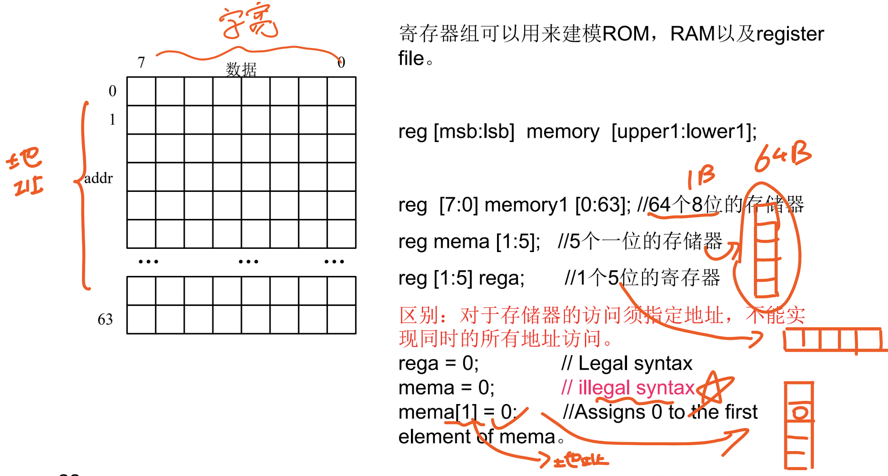
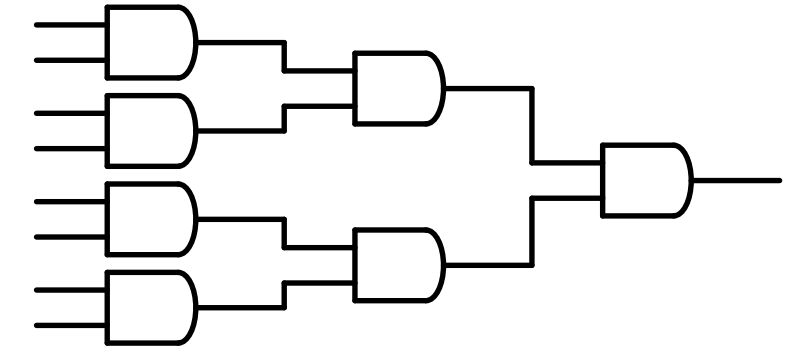
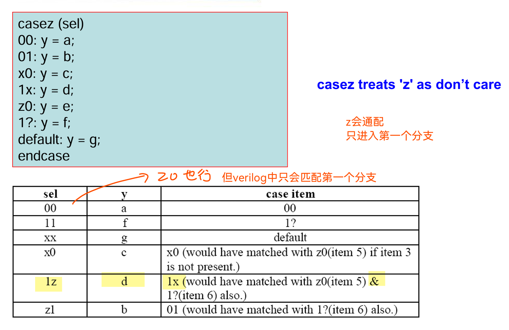
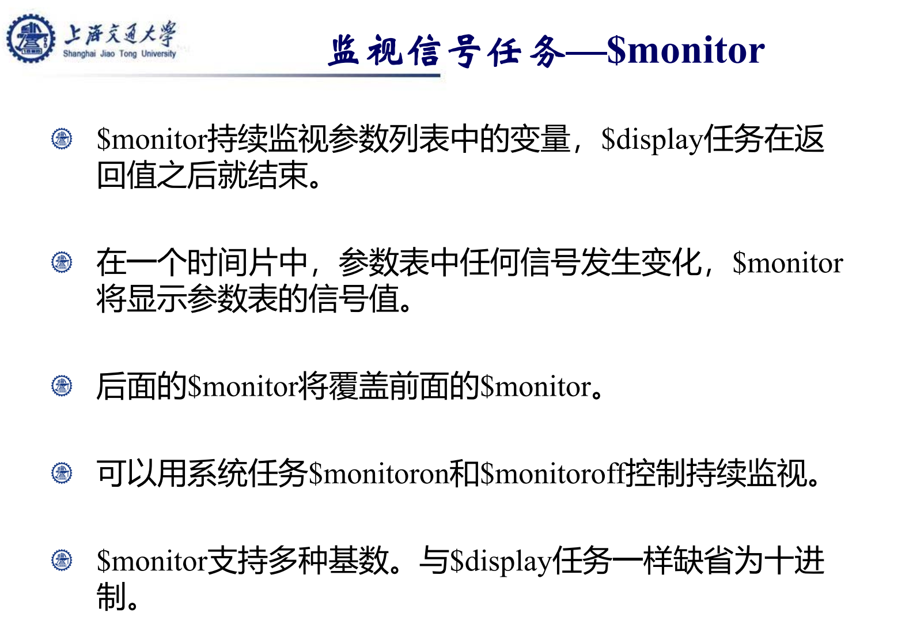
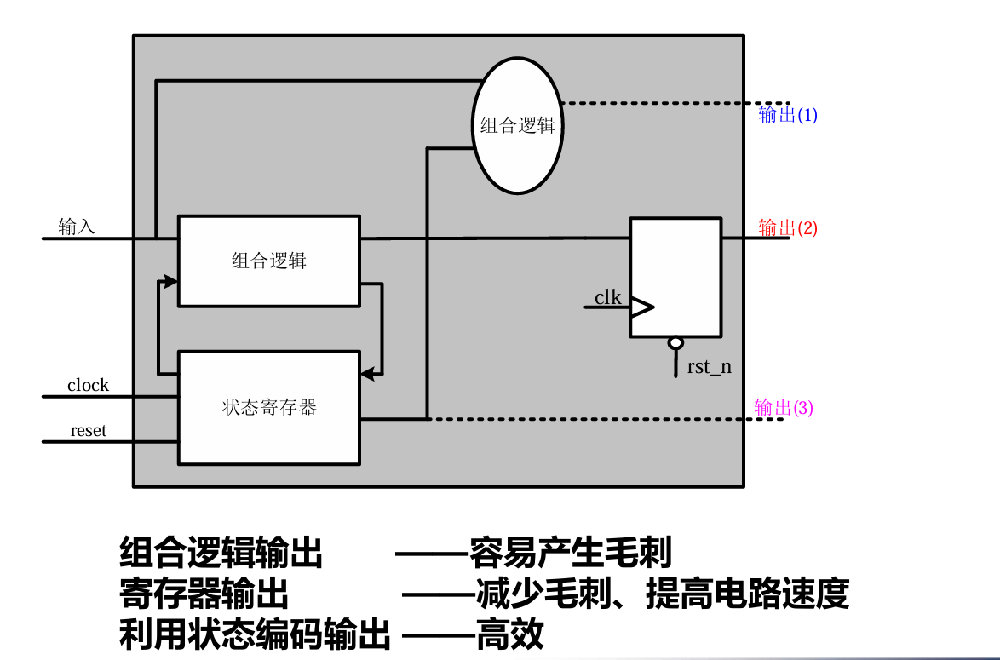
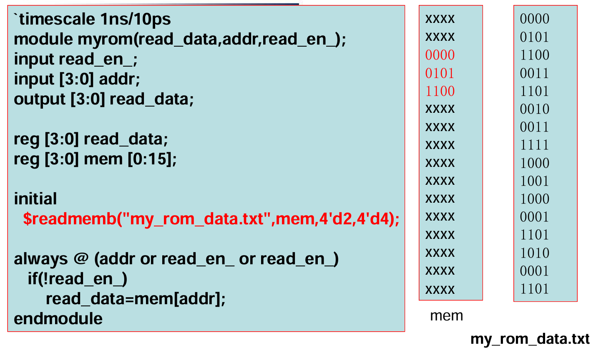
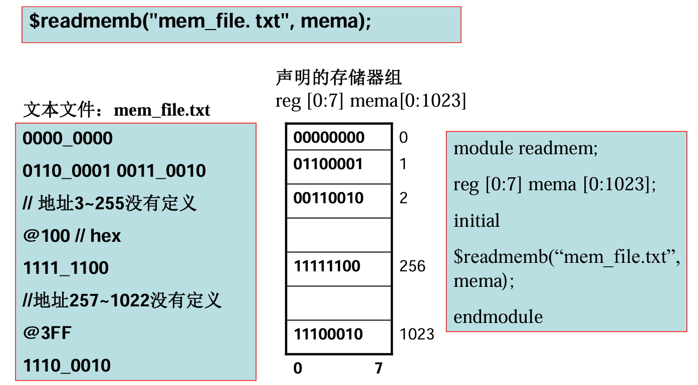
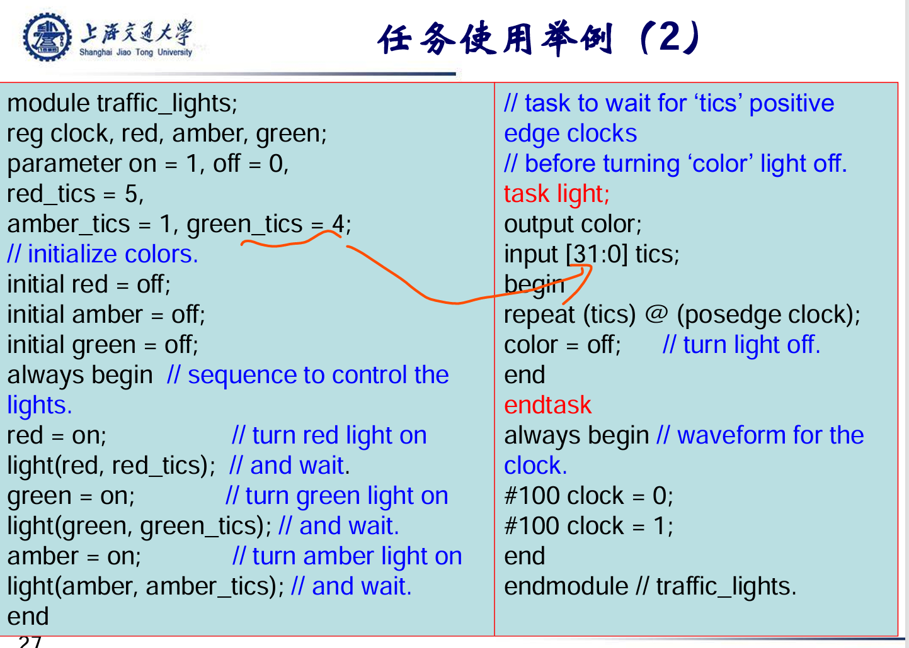

# Verilog HDL 学习笔记

## 一、Verilog基础
### 1.1 标识符
标识符是任意字母、数字、$、\_的组合。
标识符第一个字符必须是==字母==或者\_
==保留字都是小写的==

### 1.2 reg相关问题

**在一个模块中**<br>
wire可以被定义为输入和输出，reg只能被定义为输出， 不能被定义为输入<br>
原因：**reg的改变受一定条件控制，例如时钟**，不能直接对reg类型变量赋值<br>

**模块实例化时**<br>
内部的输入端口只能是wire类型，可以连接外部的wire或者reg ，**因为reg和wire都能驱动wire**，无论外部是wire还是reg，其值一旦改变，wire就会跟着改变。（但是常常用reg类型，因为常常涉及到）<br>
内部的输出端口可以是wire或者reg类型，但**外部连接的只能是wire**。因为内部的信号一旦改变，**外部连接的信号必须跟着改变，也就是说这两个信号是同一个信号**，只有wire可以满足这个条件。
如果外部连接的是reg，那么想要改变这个reg的值还必须要满足一些条件，例如时钟，always @(*)等。这是难以实现的

<div style="page-break-after: always;"></div>


### 1.3 parameter 
##### 使用示例
```verilog
module fsm (clk, rst_n);  
……  
parameter    IDLE   = 2’d0;  
parameter    BUSY = 2’d1;  
parameter    WAIT  = 2’d2;  
parameter    FREE  = 2’d3;  
……  
endmodule  
```
##### paramter 参数定义的语法：
```verilog
parameter  <list_of_assignment>;
```  
可一次定义多个参数，用逗号隔开。

##### 在例化时重载parameter
```verilog
module_name #(...) module_a(...)
```

注意：**#(...)** 位置关联


<div style="page-break-after: always;"></div>

### 1.4 `define
编译指导\`define提供了一种简单的文本替换的功能:<br>
```verilog
`define <macro_name> <macro_text><br>
```
在编译时<macro_text>替换<macro_name>。可提高描述的可读性。

#### 示例
```verilog
`define not_delay #1  
`define and_delay #2  
`define or_delay #1  
module MUX2_1 (out, a, b, sel);  
output out;  
input a, b, sel;  
not `not_delay not1( sel_, sel);  
and `and_delay and1( a1, a, sel_);  
and `and_delay and2( b1, b, sel);  
or `or_delay or1( out, a1, b1);  
endmodule  
```

### 1.5 值

z：高阻状态，含义是电路未驱动或者断开，常见于三态门、总线空闲
x：未知状态，含义是信号逻辑值不确定，常见于==未初始化，驱动源冲突==，仿真异常

### 1.6 线网类型
==如果没有驱动，线网的缺省值是z==
tri本意用于描述多个驱动源同时驱动一根线的线网类型，而wire本意用于描述一个驱动源的驱动。

**当驱动源冲突时**

(1) 驱动源相同，则结果等于驱动源。
(2) 驱动源不同，且均不为z，则结果为z。
(3) 驱动源有一个是z，则结果为另一驱动源。

**其他线网类型**
```verilog
assign a0=b;
assign a0=c;
assign a0=d;
```
when a0 = wand? when a0 = wor?
### 1.7 寄存器类型
寄存器类型(register)分为5种子类型
reg类型
integer类型
real类型
time类型（testbench中介绍）
realtime类型（testbench中介绍）

在硬件描述语言中，有时候数据类型并不一定与硬件电路相关，在组合逻辑的行为描述中，也会定义reg类型。

### 1.8 位宽
```verilog
256 //非定长的十进制数
4’b10_11 //定长的整数常量
8’h0a //定长的整数常量
‘b1,’hfba //非定长的整数常量
90.006 //实数常量
”bond” //字符串常量，每个字符作为8位的ascii值存储,使用时要用双引号

wire [3:0] data_out;
wire [0:3] data_in;
wire [9:0] ask;

assign data_out=4’b1000; //data_in[3]=1
assign data_in =4’b1000; //data_in[0]=1
assign ask=“x”; //8’b01111000 (120)
```

注意：
data_out=4’b1000; ==//data_in[3]=1==
data_in =4’b1000; ==//data_in[0]=1==

**当位宽不一致时**

==只需要记住，赋值时的常量为32b（计算机数据宽度）==

### 1.9 存储器语法


### 1.10 变量的符号


### 1.11 位选择与连接运算符
```verilog
reg data[m:n]
assign data = {data[4:0], data[7:5]};  // 合法
```
在 Verilog 中，==合法的位选择范围a[m:n]必须满足m≥n==，否则会导致语法错误或仿真异常。

### 1.12 运算符
##### ① 算数运算符： * ， /， +， - ， %
整数除法截断小数部分
取模运算的结果符号与第一个操作数相同
==操作数中有x或者z，结果是x==

##### ② 关系操作符 <, <=, >, >=**
==操作数中有x或者z，结果是x==
避免出现有符号数与无符号数的比较
```verilog
reg [2:0] a,b,c,d1,d2,e,f;
integer j,k,q;
b=4’b101;
e=(b>c); //e=1
j=- 4’d10;
q=5;
d1=j > b; //d1=1，有符号数与无符号数的比较
d2=j>q; //d2=0;

```

##### ③ 逻辑操作符 &&, ||, !
逻辑操作符的结果为一位1， 0或x。
逻辑操作符只对逻辑值运算。
==若操作数只包含0、x、 z，则逻辑值为x==
逻辑反操作符将操作数的逻辑值取反。
```verilog
a = 4‘b0011; //逻辑值为“1”
b = 4‘b10xz; //逻辑值为“1”
c = 4‘b0z0x; //逻辑值为“x”
e = a && b; // e = 1
f = a && c; // f = x
g = !a; // g=0
```

逻辑操作符的操作数为x/z时，结果不一定为x，例如：
==0 && x(z) = 0==
==1 || x(z) = 1==
!z = x
!x = x

##### ④ 相等操作符
**逻辑相等：==， !=**
==操作数中只要含有x或者z，结果是x==

**case等：=\==，!\==**
===:
| A \ B | 0 | 1 | x | z |
| ----- | - | - | - | - |
| **0** | 1 | 0 | 0 | 0 |
| **1** | 0 | 1 | 0 | 0 |
| **x** | 0 | 0 | 1 | 0 |
| **z** | 0 | 0 | 0 | 1 |

!==:
| A \ B | 0 | 1 | x | z |
| ----- | - | - | - | - |
| **0** | 0 | 1 | 1 | 1 |
| **1** | 1 | 0 | 1 | 1 |
| **x** | 1 | 1 | 0 | 1 |
| **z** | 1 | 1 | 1 | 0 |

##### ⑤ 位运算
==对于!, ^ 和\~^ ，只要操作数出现x/z，结果就是x==
**按位取反：~**
| A | \~A |
| - | --- |
| 0 | 1   |
| 1 | 0   |
| x | x   |
| z | x   |

**按位与：&**
| A \ B | 0 | 1 | x | z |
| ----- | - | - | - | - |
| **0** | 0 | 0 | 0 | 0 |
| **1** | 0 | 1 | x | x |
| **x** | 0 | x | x | x |
| **z** | 0 | x | x | x |

**按位或：|**
| A \ B | 0 | 1 | x | z |
| ----- | - | - | - | - |
| **0** | 0 | 1 | x | x |
| **1** | 1 | 1 | 1 | 1 |
| **x** | x | 1 | x | x |
| **z** | x | 1 | x | x |

**按位异或：^**
| A \ B | 0 | 1 | x | z |
| ----- | - | - | - | - |
| **0** | 0 | 1 | x | x |
| **1** | 1 | 0 | x | x |
| **x** | x | x | x | x |
| **z** | x | x | x | x |

**按位同或：\~^ 或 ^\~**
| A \ B | 0 | 1 | x | z |
| ----- | - | - | - | - |
| **0** | 1 | 0 | x | x |
| **1** | 0 | 1 | x | x |
| **x** | x | x | x | x |
| **z** | x | x | x | x |

##### ⑥ 归约运算符
| 运算符     | 名称    |  操作含义                                           |                           
| --------- | ----    | -----------------------                            | 
| `&`       | 归约与   | 所有位与运算（全部为 1 → 1，否则为 0） |                     
| `\|`        | 归约或      | 所有位或运算（任一位为 1 → 1，全为 0 → 0 ）                   | 
| `^`       | 归约异或 | 所有位异或（1 的个数为奇数 → 1）     |                    
| `~&`      | 归约与非 | `~&a = ~(&a)`            |                    
| `~\|`        | 归约或非      |  `~\|a = ~(\|a)`     | 
| `~^`或`^~`| 归约同或 | 等价于 `~(^a)`             |                     

或者从最低位到最高位运算
或者参见：


##### ⑦ 移位运算符
在移位操作中，右边的操作数总是被当成无符号数，因此在需要位扩展时总是填0。
==移入的位只能是0。==
一般用连接运算符取代
```verilog
wire [7:0] data,result;
assign result = data <<3;
assign result ={data[4:0],3’b0};
```

##### ⑧ 条件运算符


##### ⑨ 操作符优先级


<div style="page-break-after: always;"></div>

## 二、Verilog：组合逻辑与行为建模

### 2.1 数据流模型
数据流模型：主要用于组合逻辑的描述，采用assign语句进行赋值，通过布尔表达式能清楚地反映电路的功能结构与组合逻辑的数据特性。

### 2.2 行为级模型
##### 2.2.1 过程结构
initial结构（块）——单次执行
always结构（块）——重复执行

begin…end结构中语句顺序执行，只有一条语句时begin…end可以省略。
fork…join结构中语句的并行执行。

##### 2.2.2 过程块中的赋值
在过程块中的赋值称为**过程赋值**，在过程赋值语句中表达式左边的信号**必须是寄存器类型**，表达式右边类型没有限制。

**案例：时钟产生**
```verilog
always #5 clk = ~clk;
```
##### 2.2.3 过程块中的分支结构
if...else分支结构只能在过程块中使用
==考虑所有的分支情况；==
==尽量少地使用嵌套；==

**案例：case语句**
```verilog
……
always @(a or b)
begin
case({a,b})
2’b10:c=1’b1;
2’b01:c=1’b0;
default:c=1’b1;
endcase
end
……
```
==注意：default==

**case语句进行逐位比较以求完全匹配（包括x和z）**

**在casez语句中，==? 和z== 被当作无关值。**

**在casex语句中，==?，z 和x== 被当作无关值。**


##### 2.2.4 过程块中的循环结构
repeat：将一块语句循环执行确定次数。
repeat (次数表达式)<语句>

while：在条件表达式为真时一直循环执行
while (条件表达式)<语句>

forever：重复执行直到仿真结束
forever <语句>
==forever应该是过程块中最后一条语句。其后的语句将永远不会执行。forever语句不可综合，通常用于test bench描述。==
案例：
```verilog
initial
begin
clk = 0;
forever
begin
#10 clk = 1;
#10 clk = 0;
end
end
```

for：在执行过程中对变量进行计算和判断，在条件满足时执行
for(赋初值；条件表达式；计算)<语句>

<div style="page-break-after: always;"></div>

## 三、时序逻辑电路设计基础
==不要在一个always块中同时使用阻塞和非阻塞==。
建模==时序逻辑时使用非阻塞赋值==。
使用always块描述组合逻辑，使用阻塞赋值。
==不能在不同的always块中多次赋值一个信号==。


<div style="page-break-after: always;"></div>


## 四、模块例化与testbench设计
### 4.1 模块例化注意事项
尽量使用名字关联
注意端口位宽的一致性
检查端口连接规则
==不要出现没有连接的端口，没有连接的输入端口初始化值为x。==
一般不需要显式声明模块端口

### 4.2 Testbench设计
示例代码
```verilog
`timescale 1ns/10ps          
//编译指导，规定时间单位与精度
`include “full_addder.v”   //编译指导，包含所需文件
module testbench ();        
//testbench
wire sum_out;
reg a_input, b_input, cin;               
full_adder fa1(.a(a_input)           
              ,.b(b_input)
              ,.cin(cin)
              ,.sum(sum_out)
              ,.cout(cout));
initial
fork                                             
a_input=0;b_input=0;cin=0;
#10  a_input=0;b_input=0;cin=1;
#15  a_input=1;b_input=1;cin=0;
#25  $finish;                                           
join
endmodule
 ```

##### 4.2.1 `timescale <time_unit> /<time_precision>
time_unit: 时间单位
time_precision: 时间精度
`timescale必须在模块之前出现

##### 4.2.2 有关fork...join
fork…join块在测试文件中很常用。他们的并行特性使用户以说明绝对时间，并且可以并行的执行复杂的过程结构，如循环或任务
```verilog
module inline_ tb;
reg [7: 0] data_ bus;
// instance of DUT
initial    fork
data_bus = 8'b00;
#10 data_bus = 8'h45;
#20 repeat (10) #10 data_bus = data_bus + 1;
#25 repeat (5) #20 data_bus = data_bus << 1;
#140 data_bus = 8'h0f;
join
endmodule
```

##### 4.2.3 循环激励

```verilog
module loop_tb
reg clk;
reg [7:0] stimulus;
wire [7:0] results;
integer i;
DUT u1 (results, stimulus);
always begin 
#5 clk = 1;  #5  clk = 0; 
end
initial begin
    for (i = 0; i < 256; i = i + 1)
    begin
        @(negedge clk) stimulus = i;
    end
end
#20 finish;
endmodule
```


##### 4.2.4 存储器激励
```verilog 
module array_ tb;
reg [7: 0] data_ bus, stim_ array[ 0: 15]; // 数组
integer i;
DUT u1 (results, stimulus);
initial begin
// 从数组读入数据
#20 stimulus = stim_array[0];
#30 stimulus = stim_array[15]; // 线激励
#20 stimulus = stim_array[1];
for (i = 14; i > 1; i = i - 1) // 循环
#50 stimulus = stim_array[i] ;
#30 $finish;
end
endmodule
```
##### 5.2.5 Testbench中的常见系统函数




## 五、状态机设计
有限状态机（Finite-state machine）是一种计算机科学与数学理论的抽象，将一些问题
抽象成一组有限状态之间的切换及其控制，是数字逻辑与程序设计的基础之一。有限状
态机在数字逻辑、控制、通讯、编译器设计、甚至生物领域都有着广泛的应用。

### 5.1 状态机的分类
摩尔型（Moore）  
摩尔型状态机的输出只与当前状态有关，与输入无关。  
米利型（Mealy）  
米利型状态机的输出不仅与当前状态有关，还与当前输入有关  

### 5.2 设计步骤
1. 确定状态机的基本行为  
1. 建立状态、输出表  
1. 优化状态机状态数目（optional）  
1. 给状态机编码  
1. 以状态、输出表为基础建立转换、输出表（图）  
1. 求输出表达式  
1. 完成完整的状态机设计  

### 5.3 两段式经典状态机设计（无输出）
示例：
```verilog
module fsm(dly, done, req, clk, rst_n);  
input dly, done, req, clk, rst_n;  
parameter   IDLE   = 2'd0;  
parameter   BUSY   = 2'd1;   
parameter   WAIT   = 2'd2;    
parameter   FREE   = 2'd3;         
reg [1:0] current_state,next;  
// 时序逻辑段
always @(posedge clk or negedge rst_n)  
    if (!rst_n)  
        current_state <= IDLE;  
    else     
        current_state <= next;  


// 组合逻辑段
always @(current_state or dly or done or req)   
begin  
next = 2'bx;  
case (current_state)  
    IDLE : 
        if (req) next = BUSY;  
        else next = IDLE;  
    BUSY: begin  
        if (!done) next = BUSY;  
        else if ( dly) next = WAIT;  
        else next = FREE;  end  
    WAIT: begin  
        if (!dly) next = FREE;  
        else next = WAIT;  end  
    FREE:   
        if (req) next = BUSY;  
        else next = IDLE;  
endcase  
end  
endmodule  
```
1. 用两个always块来描述状态机，一个always块用来描述**新状态的产生（组合逻辑）**，一个always块用来描述**状态迁移（时序逻辑）**。
2. 使用**parameter定义状态**。  
3. 时序逻辑使用非阻塞赋值，组合逻辑使用阻塞赋值。  
4. always块中，敏感列表需要包括当前状态和所有输入  
5. ==在组合逻辑块的开始，指定next state的缺省值。==  

<br>
<br>
<br>
<br>
<div style="page-break-after: always;"></div>

### 5.4 next_state的初始值： 
一般来说next state有三种初始值:**2’bx、ilde、其他state**。  
- **2'bx**:用于debug，一个完善的状态机必须能够消除x的影响，正确进入状态循环。  
- **ilde**：零状态  

当逻辑中没有出现next state分配的时候，**初始值有利于debug**。

在数字芯片中，一般有一个reset过程，使电路有一个初始值。  
初始值的赋值由**rst**在**testbench**完成，而**非设计模块**中。组合逻辑输入主要来自寄存器，还有一些输入是恒0、恒1输入。一般来说，**组合逻辑的初始化是没有必要的**。  

<br>
<br>


### 5.5 状态的编码方式
##### 方法1. 普通二进制编码
3’b000,3’b001,3’b010,3’b011…<br>
编码紧凑，节省寄存器资源。状态之间翻转多，影响速度。

##### 方法2. 独热码
3’b001,3’b010,3’b100…<br>
速度快，设计简单，易于维护，消耗寄存器资源多。

##### 方法3. 格雷码
3’b000,3’b001,3’b011,3’b010…<br>
状态之间翻转少，状态的编码分配较困难。(因为顺序是固定的)

<br>
<br>
<br>
<br>
<div style="page-break-after: always;"></div>

### 5.6 考虑输出的状态设计
##### 常见输出方式


<br>
<br>
<br>
<br>
<div style="page-break-after: always;"></div>

### 5.7 三段式经典状态机设计（有输出）
大致模板与二段式相同，只不过由于有输出信号，所以除了==计算新状态的组合逻辑块==和==转移状态的时序逻辑块==之外，还有一个**输出的块**<br>
输出块：<br>
**组合逻辑输出(问题：毛刺)：** 
```verilog
assign rd = (state==READ || state==DLY);
assign ds = (state==DONE);
```
**寄存器输出(问题：会延迟一个周期)** 
```verilog
always @(posedge clk or negedge rst_n)
if (!rst_n) begin
    ds <= 1'b0;
    rd <= 1'b0;
end
else begin
    ds <= 1'b0;
    rd <= 1'b0;
    case (state)
        IDLE:     
            if (go) rd <= 1'b1;
        READ:    
            rd <= 1'b1;
        DLY:     
            if (ws) rd <= 1'b1;
            else ds <= 1'b1;
endcase
end
```
**状态编码输出：**<br>
还有一种极为特殊的输出方式，而且是性能最好的实现方式，**即将输出信号包含在状态编码中，这样就能直接输出，没有任何外加延时**，然而缺点就是，这给==状态的编码造成了很大困难==

```verilog
assign {ds,rd} = state[1:0];
```


<div style="page-break-after: always;"></div>

## 六、文件读写

### 指定地址的文件读操作
**$readmemb**
```verilog
$readmemb ("file_name", <memory_name>,<start_addr>);
$readmemb("file_name", <memory_name>, <start_addr>,<finish_addr>);
```
**$readmemh**
```verilog 
$readmemh ("file_name", <memory_name>,<start_addr>);
$readmemh("file_name", <memory_name>, <start_addr>,<finish_addr>);
```

start和finish决定存储器将被装载的地址。start为开始地址，finish为结束地址。如果不指定开始和结束地址，$readmem开始读入数据，**从存储器的最低地址开始存放**。<br>
示例：


##### 文件格式说明
1. 可指定二进制(b)或十六进制(h)数
2. 用下划线提高可读性。
3. 可以包含单行或多行注释。
4. 可以用空格和换行区分存储器字。
5. 可以给后面的值设定一个**特定的地址**，格式为：**@(hex_address)**，意思是==将该数据放入对应地址的存储单元中==
   - 十六进制地址的大小写不敏感。
   - 在@和数字之间不允许有空格 。




### 文件输出
\$monitor,\$display等系统任务可以将结果输出到标准输出设备，相似的系统任务**(\$fmonitor, \$fdisplay)可以将结果输出到文件中**。

$fopen
打开一个文件并返回一个多通道描述符（MCD）。
• MCD是与文件唯一对应的32位无符号整数。
• 如果文件**不能打开并进行写操作，MCD将等于0**。
• 如果文件成功打开，MCD中的一位将被置位。

**以$f开始的显示系统任务将输出写入与MCD相对应的文件中。**
<br>
<br>
**文件输出举例**

**读写任务函数**


<div style="page-break-after: always;"></div>

## 七、任务
任务: 一般用于编写测试模块，或者行为描述的模块。

### Task的定义
示例：
```verilog
task task_identifier ;
{ task_item_declaration
input …
output …
inout …
数据类型定义
}
功能描述
statement_or_null
endtask
```
端口与数据类型的声明语法与module相同，但**不能声明线网类型**，port声明并非必要，task可以不包含任何port声明。

### Task的调用
只能在**initial块**和**always块**中调用任务<br>
调用格式:<br>
```verilog
task_identifier ( expression { , expression } ) 
```

### 注意事项
1. 任务一般在调用它的**模块内部**定义，也可以**在当前文件中定义**，也可以在**单独的文件中定义**，这时需要在调用它的模块文件中通过编译指导`include包括进来。
2. 任务可以用来建模时序逻辑，也可以用来建模组合逻辑。
3. 模块的端口可以使任意数目（也可以**无端口**）
4. 其中可以包含**时间控制(# delays, @, wait)**
5. 任务**可以接受和驱动全局变量**（module范围内），当任务中使用局部变量时，局部变量在任务的最后需要传递给输出端口才能输出。
6. 任务中定义的变量属于任务的局部变量。任务中**定义的端口顺序**决定了任务在被调用时**全局变量的位置顺序**
7. 任务可以调用任务或者函数。


### 示例
```verilog
module test;
  reg [7:0] x, y, result;

  initial begin
    x = 8'd10;
    y = 8'd20;
    add_two(x, y, result);
    $display("Result = %d", result);  // 输出：Result = 30
  end

  // 任务定义放在同一个 module 内部
  task add_two;
    input [7:0] a, b;
    output [7:0] sum;
    begin
      sum = a + b;
    end
  endtask
endmodule
```


<br>
<br>
<br>
<br>
<div style="page-break-after: always;"></div>

## 八、函数
### function的定义
```verilog
function[宽度与类型] function_identifier ;
function_item_declaratio{function_item_declaration }
statement
endfunction
```
### 注意事项
1. 一般在调用它的模块内部定义。也可以在单独的文件中定义，这时需要在调用它的模块文件中通过编译指导`include包括进来。
2. 宽度与类型可以不定义，这时**函数使用缺省的值：1bit reg类型**（==因为function在过程块中被调用==），函数必须有至少一个的输入，但不能含有任何输出。
3. 函数定义**不能包含任何定时控制语句**（==纯组合电路的计算==）（==函数仿真时间为0==）
4. 函数中定义的变量属于函数的局部变量。函数中定义的**端口顺序**决定了函数在被调用时全局变量的位置顺序。
5. **一个函数只能返回一个值**，该值的变量名与函数同名，数据类型默认为reg类型。
6. 函数可以接受和驱动全局变量（module范围内），当函数中使用局部变量时，局部变量的输出需要传递给返回值。
7. **函数不能调用任务**，但任务可以调用函数。
8. **函数中不能声明线网类型**


### 函数的调用
1. ==函数在调用时传递给函数的变量顺序与函数输入端口的声明顺序相同==。
2. 函数可以在持续赋值语句或者过程中调用。

### 函数应用举例
```verilog
module foo(loo);
  input [7:0] loo;

  wire [7:0] goo = zero_count(loo);  // 在持续赋值中调用函数

  function [3:0] zero_count;
    input [7:0] in_bus;
    integer i;
    begin
      zero_count = 0;
      for (i = 0; i < 8; i = i + 1) begin
        if (!in_bus[i])
          zero_count = zero_count + 1;
      end
    end
  endfunction

endmodule

```

### 函数与任务的特点
1. ==函数与任务的全部行为都可以用module代替==
**抽象层次**：
module>过程块>task>function>if, repeat, for...

2. ==在任务和函数中不能声明线网类型==

3. 任务和函数必须在module内调用

4. 所有输出/输出都是局部寄存器

5. 任务/函数执行完成后才返回结果。例如，若任务/函数中有forever语句，则永远不会返回结果

6. 系统任务与系统函数
读取当前仿真时间的**系统函数**
\$time：返回32位整数时间，对大于$2^{32}$的时间，返回模$2^{32}$的值。使用它可以节省显示及打印空间。
\$stime：返回64位整数时间
\$realtime：返回实数时间
Verilog
支持文本输出的**系统任务**
\$display
\$strobe
\$write
\$monitor

| 项目              | function（函数）                           | task（任务）                                |
|-------------------|--------------------------------------------|---------------------------------------------|
| 定义方式          | `function ... endfunction`                 | `task ... endtask`                          |
| 是否有返回值      | ✅ 有返回值（通过函数名返回）              | ❌ 无返回值（通过 `output` 参数输出）      |
| 参数类型          | 只能是 `input`                             | 可以有 `input`、`output`、`inout`           |
| 是否支持延时控制  | ❌ 不支持 `#`、`@` 等延时语句               | ✅ 支持延时语句（`#10`、`@(posedge clk)` 等）|
| 是否允许调用其他任务 | ❌ 不可以调用其他任务                    | ✅ 可以调用任务或函数                       |
| 通常使用场景      | 组合逻辑建模、表达式中使用                 | 时序逻辑建模、复杂行为建模、testbench等    |
| 可否在持续赋值中调用 | ✅ 可以，例如 `assign out = f(a);`       | ❌ 不可以                                   |
| 是否支持多返回值  | ❌ 不支持                                  | ✅ 可通过多个 `output` 参数返回多个值       |

<div style="page-break-after: always;"></div>

## 九、Verilog可综合语法

| 语法或语句         | 是否可综合 | 用途或限制说明                                      |
|--------------------|-------------|----------------------------------------------------|
| assign             | ✅ 可综合    | 用于建模组合逻辑                                   |
| always @(*)        | ✅ 可综合    | 用于建模组合逻辑                                   |
| always @(posedge clk) | ✅ 可综合 | 用于建模时序逻辑                                   |
| if / else          | ✅ 可综合    | 可用于组合或时序逻辑                               |
| case / casez       | ✅ 可综合    | 常用于多路选择器、状态机建模                       |
| for / while        | ✅ 可综合（有条件）| 条件必须静态可确定；循环次数固定                      |
| function           | ✅ 可综合（受限）| 仅用于组合逻辑，不能包含延迟语句                    |
| reg / wire         | ✅ 可综合    | 用于信号声明                                        |
| module / endmodule | ✅ 可综合    | 模块化设计基础                                     |
| initial            | ❌ 不可综合   | 仅仿真用，用于 testbench 初值设定                   |
| #延时（如 #5）     | ❌ 不可综合   | 仅用于仿真行为，表示时间延迟                        |
| \$display, \$finish  | ❌ 不可综合   | 仿真系统函数，只能用于 testbench                   |
| @(posedge clk) in testbench | ❌ 不可综合 | 可在 testbench 中使用（等待触发事件）               |
| forever / repeat   | ❌ 不可综合   | 仅限 testbench，无法静态展开                       |
| real 类型变量       | ❌ 不可综合   | 综合工具不支持浮点数硬件建模                       |
| task               | ❌ 不可综合   | 通常用于 testbench 中行为级建模                    |
| fork / join        | ❌ 不可综合   | 并发控制语句，仅限仿真                             |
| disable            | ❌ 不可综合   | 控制仿真流程使用                                   |


<div style="page-break-after: always;"></div>

## 十、Verilog代码编写常见问题
1. 尽量使用==一个时钟==，或者==同一个时钟源==的时钟。
<br>

2. 在设计中，使用==一个时钟沿==工作：

<br>

3. 在电路设计中要求有一个初始态，在电路工作前初始化所有的寄存器（==组合逻辑的输入可以溯源自寄存器的输出==）。
推荐异步清零，同步清零清的比较慢
<br>

4. 在设计中，尽量将时序逻辑和组合逻辑分在不同的过程块中描述。
<br>

5. Latch的推断:

| 代码问题                           | 是否会推导 Latch | 说明                   |
| ------------------------------ | ----------- | -------------------- |
| `if` / `case` 不完整覆盖所有条件        | ✅ 会         | 综合器认为需要记忆 → 推导 latch（==加上else和default==） |
| 对变量的赋值在 `if` / `case` 语句中遗漏    | ✅ 会         | 综合器认为某些条件下值应保持不变     |
| 使用电平敏感触发（如 `always @(enable)`） | ✅ 会         | 电平敏感等效于 latch(==尽量用always(@)==)       |
| 忘记默认赋值                         | ✅ 会         | 没有默认赋值的组合逻辑，部分路径未定义  |

6. 常量
