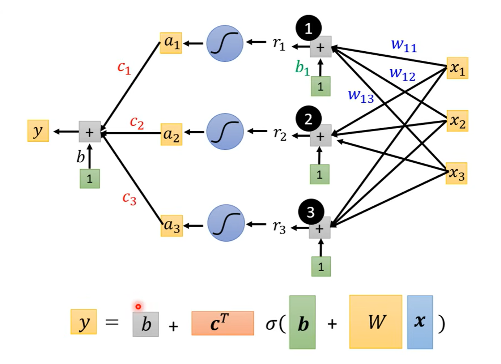
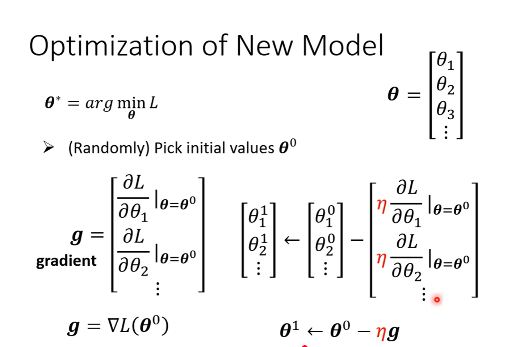
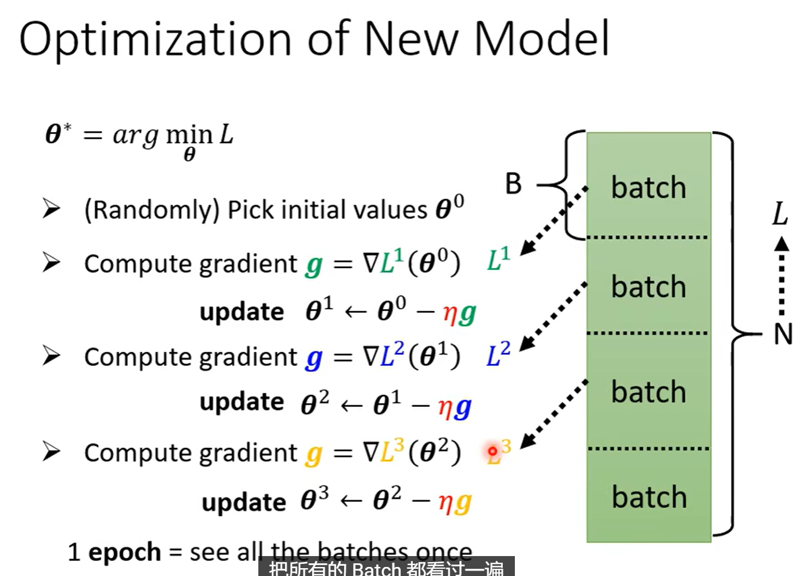
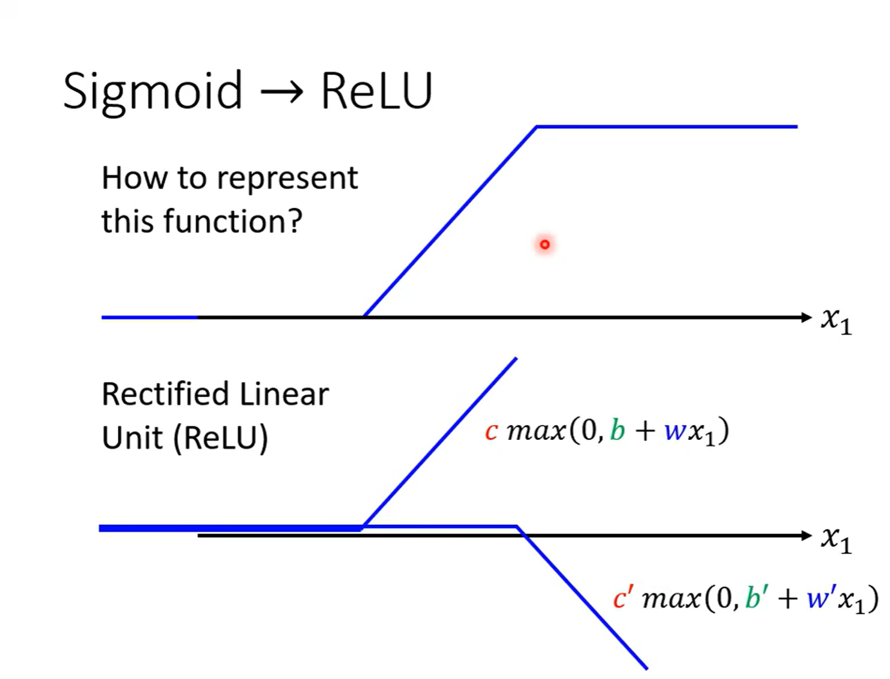
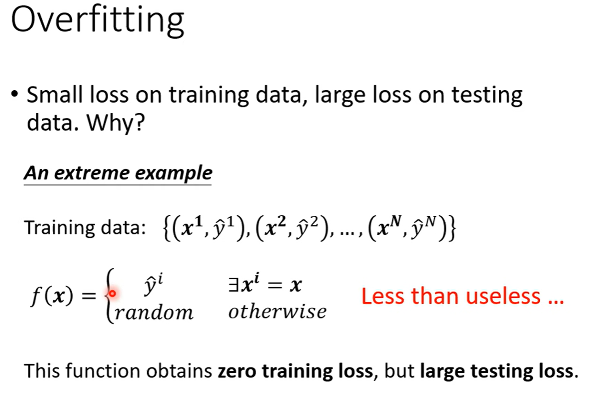
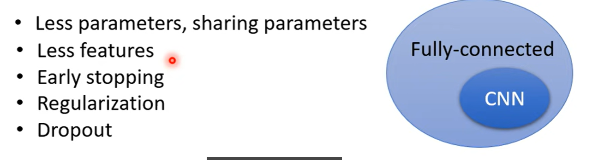
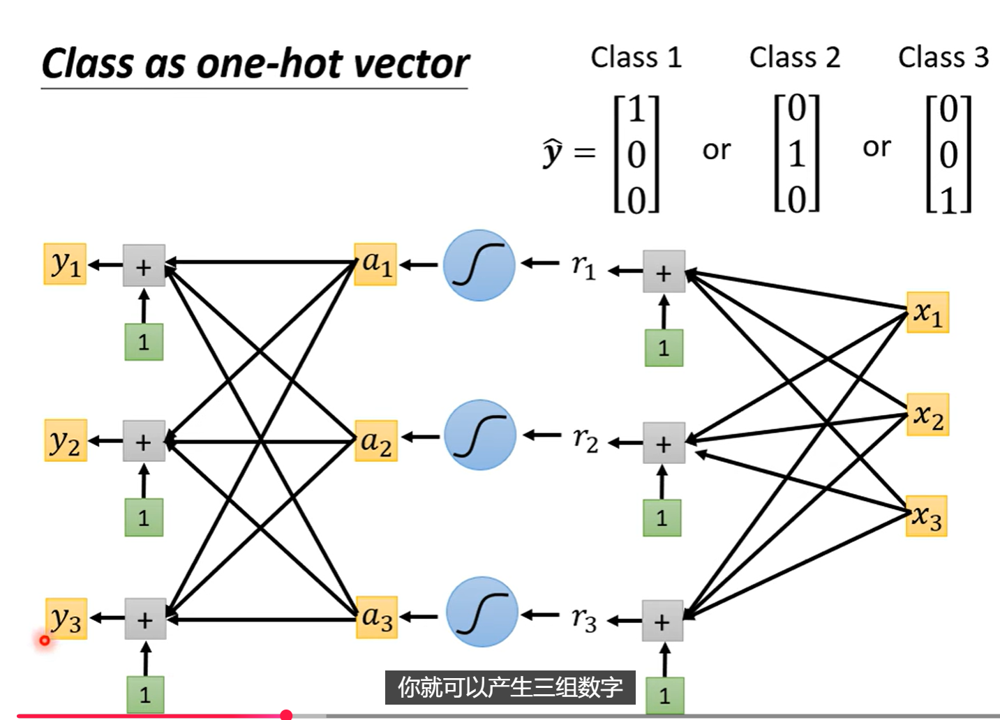
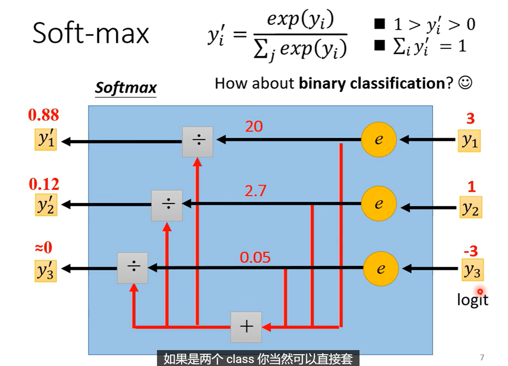

# Nerual Network and Deep Learning Basics
## I. Basic of Neural Network and Deep Learning
### step
model, define loss, optimization
### definition
$c\,\text{sigmoid}(b+wx)=c\frac{1}{1+\text{exp}[-(b+wx)]}$

$y = b + \sum_{i}c_i \, \text{sigmoid}(b_i+w_ix_1)\rightarrow y = b + \sum_{i}c_i \, \text{sigmoid}(b_i+\sum_{j} w_{ij}x_j)$

$\mathbf{x}\rightarrow \mathbf{a}$的复杂化

## II. How to Solve Large Traninig Loss

### 方法一：Model bias
$\mathbf{x}$太小，导致$f_{\theta_1}(\mathbf{x})$, $f_{\theta_2}(\mathbf{x})$, $f_{\theta_3}(\mathbf{x})$......函数集合整体的Loss效果上限很低
**解决办法**：增加$\mathbf{x}$维度，增加网络深度

### 方法二：Optimization Issue
进入local minimum
梯度下降算法不给力，例如这种情况：

56Layer的Network弹性一定比20Layer的Network大，也就是说Model bias更小，但是无论是在训训练数据集还是在测试数据集上的效果都没有20Layer Network好，所以证明是optimization过程出现的问题。 

做法就是找一些比较浅的Model，进行测试对比，这些**浅的model能够保证optimization过程已经做的足够好了**。
然后如果我们发现一些比较深的Model效果反而不如浅的Model好，就可能是Optimization过程的问题

## III. How to solve Large Testing Loss with small Training Loss
==overfitting==
一个很极端的例子：

### 问题一：如何解决Overfitting的问题：
- **(1) 可能最有效的方法：增加Training Data**

**搜集资料**
或者Data argumentation
**基于已有的知识，创造一些Training data**

- **(2) 降低Model弹性：取决于对问题的理解**
如果我们指导一些背景知识，比如说指导要拟合的这条曲线是二次曲线，就不用用三次四次高次曲线来做训练
减少神经元数量

#### 所以Model bias和Overfitting存在一定矛盾

### 问题二：Mismatch
overfitting可以通过增加Training Data来解决，但是mismatch不同：
mismatch意味着：**test data和Training data**的分布不一样

## IV. Classfication

### 4.1 Regression as Classfication
**我们将class也量化为数字**

class as one-hot vector:

> 为什么是one-hot ?
> 

### 4.2 分类模型的整体流程：
我们以“图片分类”为例，但文本、语音也类似。

#### 1️⃣ 输入

输入一张图片，经过卷积或 Transformer，得到一个特征向量：
\[
\mathbf{h} = [h_1, h_2, h_3, \ldots, h_d]
\]

#### 2️⃣ 全连接层（Linear Layer）

将特征映射到类别数目的维度（例如 3 类）：
\[
\mathbf{z} = W \mathbf{h} + b
\]
这得到一个“打分向量”（logits）：
\[
\mathbf{z} = [z_{\text{猫}}, z_{\text{狗}}, z_{\text{鸟}}]
\]
例如 `[2.1, 0.9, -1.3]`

#### 3️⃣ Softmax 层

把 logits 转为概率：
\[
\mathbf{p} = \text{Softmax}(\mathbf{z}) = [0.70, 0.25, 0.05]
\]
表示模型认为：

* 猫的概率 70%
* 狗的概率 25%
* 鸟的概率 5%

#### 4️⃣ 计算损失（Loss）

训练时我们知道真实标签（one-hot 向量）：
\[
\mathbf{y} = [1, 0, 0]
\]

模型输出：
\[
\mathbf{p} = [0.70, 0.25, 0.05]
\]

损失函数（通常是 **交叉熵 Cross-Entropy Loss**）：
\[
L = -\sum_i y_i \log(p_i)
\]

只对正确类别（猫）的概率起作用：
\[
L = -\log(0.70)
\]

训练目标：让正确类别的概率尽可能接近 1。

### 4.3 自回归 vs 分类：类比理解

| 概念   | 自回归（autoregressive） | 分类任务（classification） |
| ---- | ------------------- | -------------------- |
| 目标   | 预测下一个token或数值       | 判断输入属于哪个类别           |
| 输出形式 | 下一步的分布              | 类别概率分布               |
| 输出维度 | 词表大小（vocab size）    | 类别数（class size）      |
| 损失函数 | Cross Entropy       | Cross Entropy        |
| 训练标签 | 下一个 token 的 one-hot | 真实类别的 one-hot        |

所以其实分类任务是自回归的“特例”：

> 自回归预测“下一个词是哪一个”；
> 分类预测“输入属于哪一个类别”。

### 4.4 softmax函数

$$\text{softmax:} \quad V = \{z_i\}, z_{j}'=\frac{e^{z_j}}{\sum_{i}e^{z_i}}$$

### 4.5 Loss函数
$$\text{MSE:} \quad e = \sum_{j} (\hat{y_j}-y_j')^2$$
$$\text{cross-entropy:} \quad e = -\sum_{j} \hat{y_j} \ln{y_j'}$$

**MSE VS Cross-Entropy**

**Cross-Entropy不容易卡住，可以从左上角走到右下角**