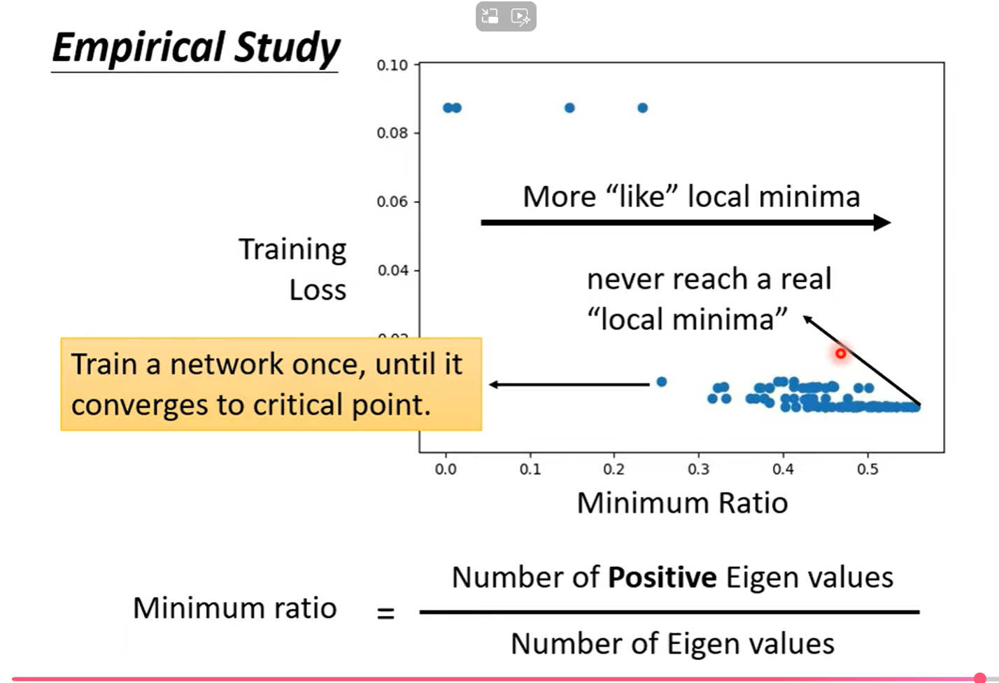
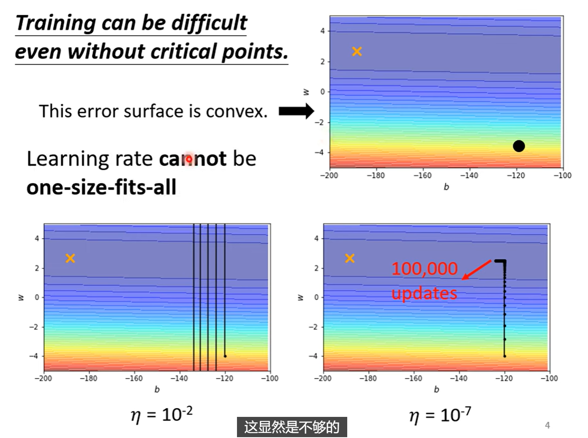
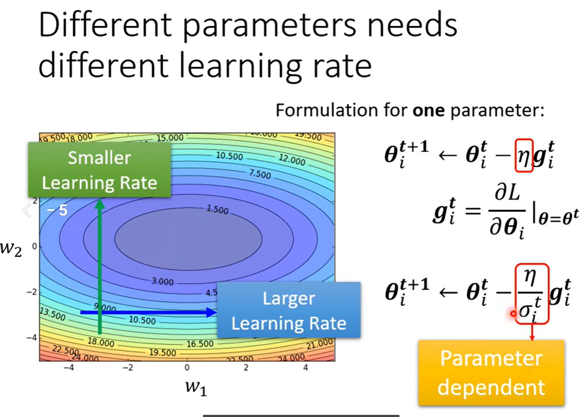
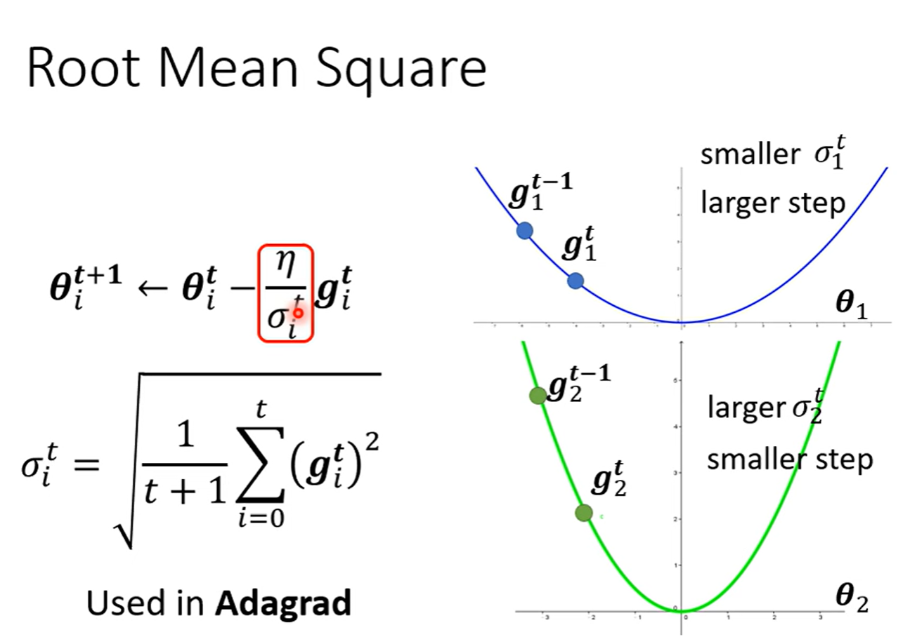
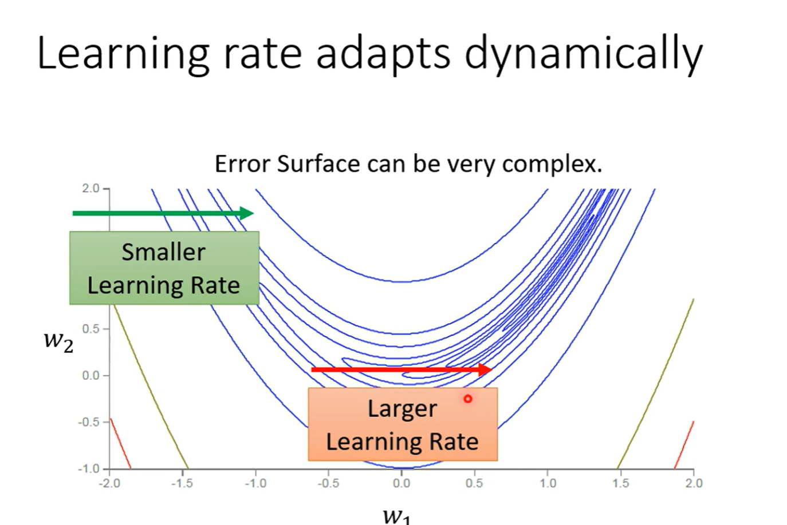
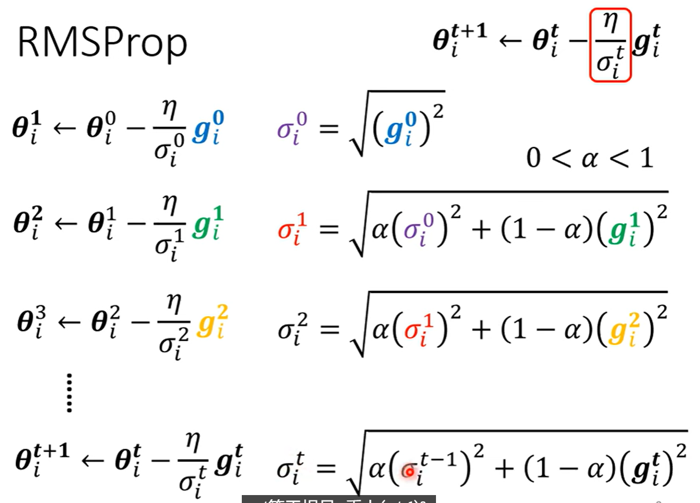
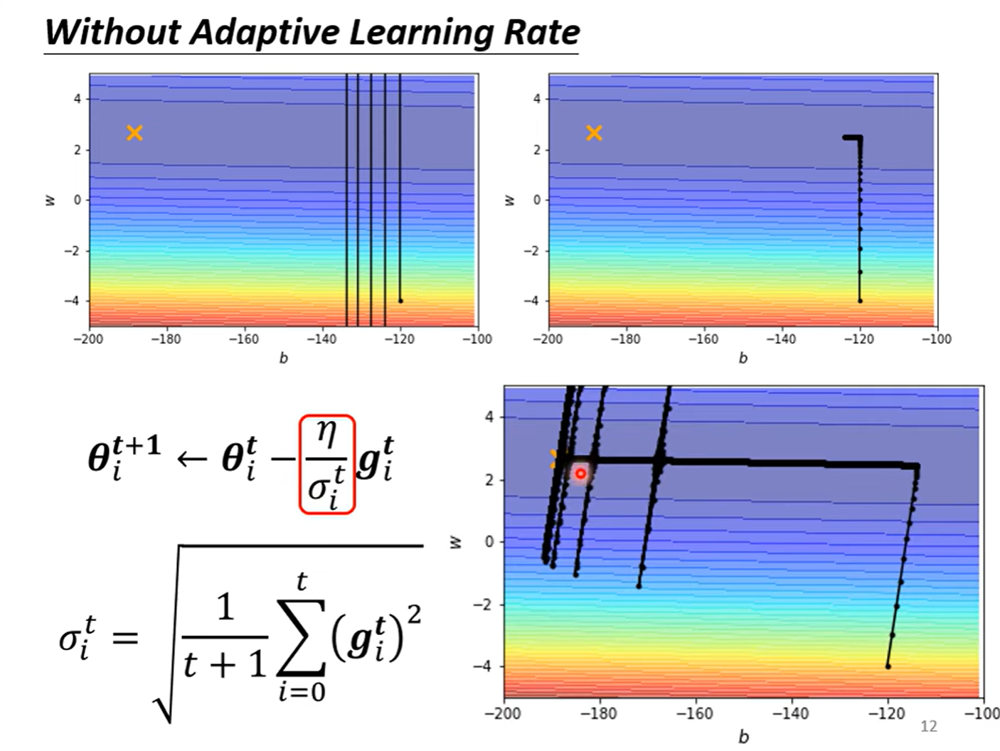
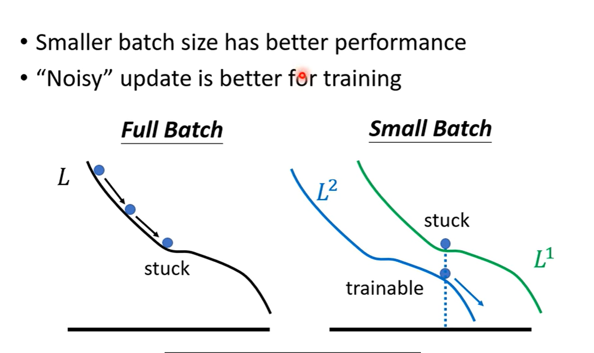
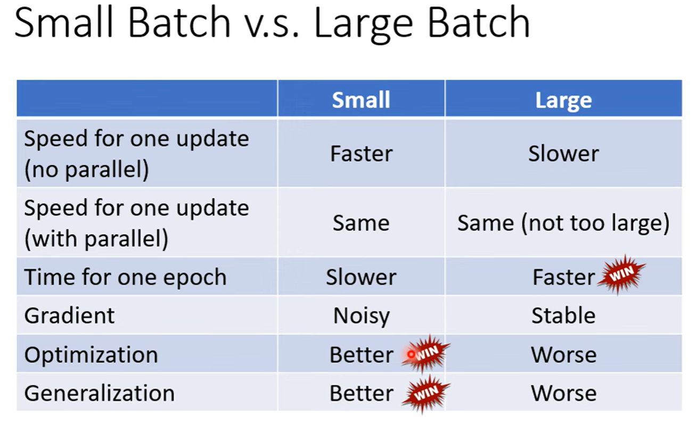

# Optimization

## I. Optimizer

### 1.1 local minima vs saddle point

### 1.2 Taylor Series Approximation

critical point: gradient = 0, the hessian tell if **local minima**, **local max** and **saddle point**

$v=(\theta - \theta')$

我们重点关注：$v^T H v$

没有必要去考虑任意值，有简便方法：
$H$是正定矩阵（所有特征值大于0），则$v^T H v$ 恒 $>0$
$H$是负定矩阵（所有特征值小于0），则$v^T H v$ 恒 $<0$
否则，为saddle point

**案例**

g: 一阶导数/梯度
H: Hessian矩阵：

$$\begin{bmatrix}
\frac{\partial L^2}{\partial ^2 w_1} & \frac{\partial L^2}{\partial w_1 \partial w_2} \\
\frac{\partial L^2}{\partial w_1 \partial w_2} & \frac{\partial L^2}{\partial ^2 w_2}
\end{bmatrix}$$

**解决sddle point**

找hession矩阵的负特征值的特征向量方向

### 1.3 Saddle point vs Local minima
会不会在更高维的空间中有路可以走
维度为高，能走的方向就越多，那么是不是说：
**维度越高，Local minima就越少呢?**
实践：

### 1.4 Small gradient 与 Saddle point的解决办法

### 1.5 If not a critical point
当Loss不再下降时，gradient真的一定变得很小吗啊？
并非！

Error Surface：**来回振荡**！

原因：Gradient Descend做不好，即便是连简单的训练集：

#### 突破点1：及时修改Learnig rate
如上图，Learning rate代表每次梯度下降需要走的步长，Learning rate越大代表步长越大，反之越小。

该方法中，将此前一直相同的Learning rate动态变化：

$\sigma_{i}^{t}$**是参数种类的函数，也是时间的函数**，由此来调控Learning rate，更新步长$m$

$\sigma_{i}^{t}$的计算方法：——前面所有的梯度的**均方根**

但是，有个问题！**即便是同一个参数，同一个梯度方向，我们也希望Learning rate也可以动态调整！**

#### 突破点2. RMSProp

以下图中间的大坡为例：
大的gradient需要小的步长，即大的这个时候我们希望$\sigma_{i}^{t}$也尽可能大一点，这**就需要我们刚刚得到的大gradient权值更重一点！**，因此，我们就可以把$\alpha$调小一点来解决这个问题。
> 个人立即RMSProp就是将之前的均方根**做法修改为了梯度加权的均方根**，使得Learning rate自适应gradient进行调整。

现在的效果：
实际应用场景：
Adam : RMSProp + momentum

越快要靠近终点，**Learning的调整导致的！**
快要靠近终点的时候，纵轴方向连续出现的梯度都很小，导致在这个方向累积了很小的$\sigma$，使得纵轴方向的步长变得相对较大。

解决这个问题的方法：

#### 突破点3：Learning rate decay or Warm up

Learning rate 随着全局时间演进而逐渐衰减。

## II. Batch

### 2.1 small batch vs large batch
合理范围内，大的Batch的迭代速度和小Batch一样，因为有GPU
但是小Batch的Noise的gradient反而可以帮助training，可以帮助逃离 Local minima 或者 saddle point

Batch size 也是一个需要自己设定的**超参数**

### 2.2 另一种破解Local minimum的技术——momentum

#### Gradient Descend

#### Gradient Descend + Momentum
计算出来的梯度的反方向+前一步的方向，共同考虑

例如$\mathbf{m}^2 = \lambda \mathbf{m}^1 - \eta \mathbf{g}^1$

示例：
