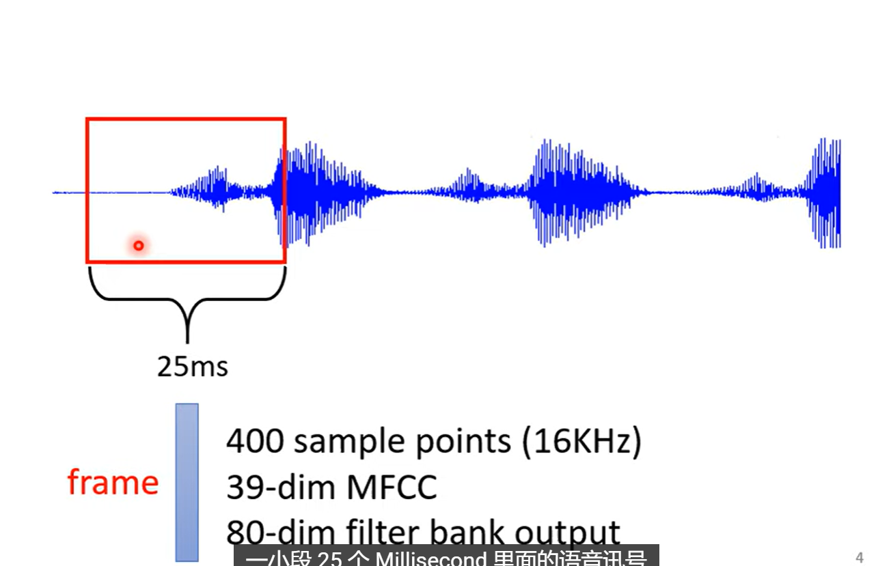
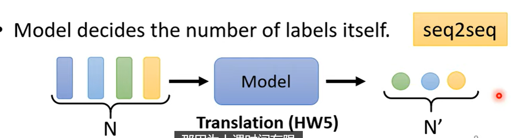
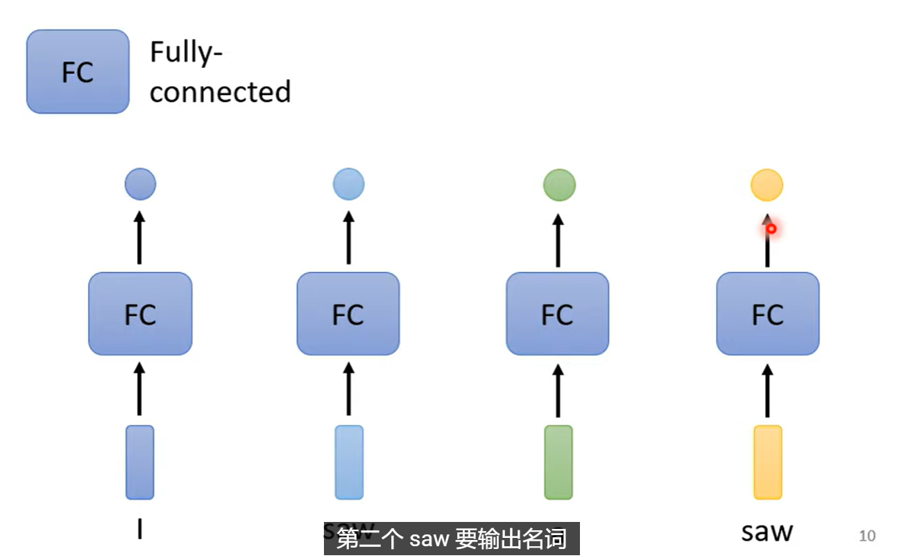
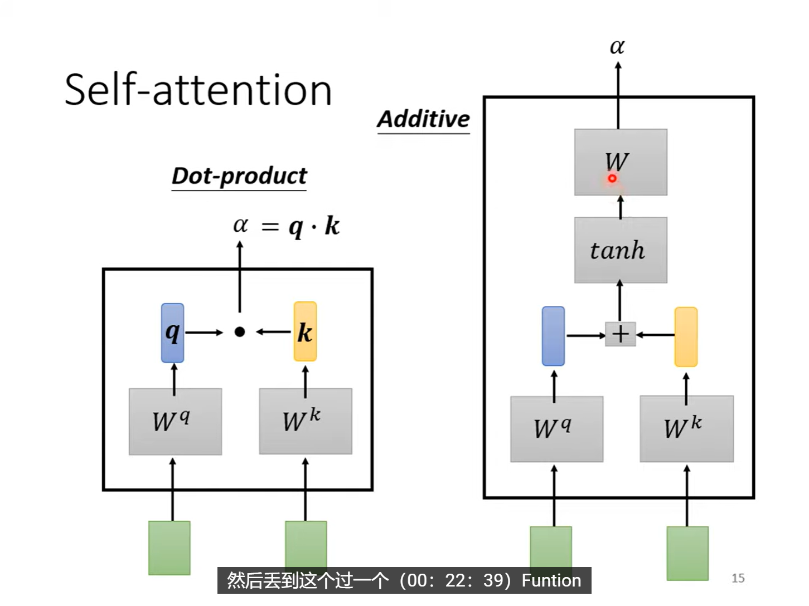
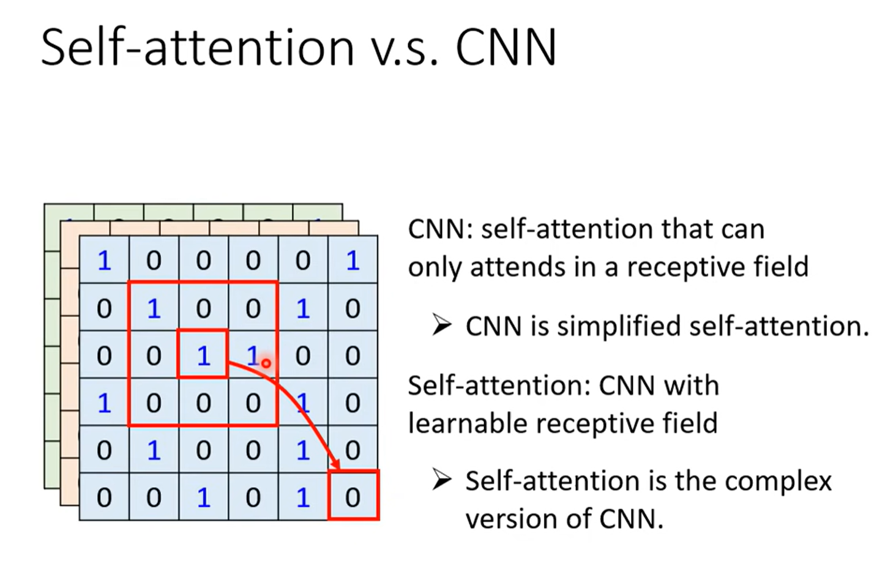

# 自注意力机制

## 一. 引入
到目前为止，classification和regression任务的输入都还只是一个向量。但是当输入是一堆向量(**sequence**)呢？

**输入是a set of vector(sequence)的例子**

1. 输入是一段文字，其中的每一个词都是一个vector，例如：
    > I saw a cat

    将词汇转化为向量的方法: (1) one-hot (2) Word Embedding
    

2. 输入是一段声音讯号
    
    有很多方法将一个**window**中的讯号转化为一个vector

3. Graph
    
   每个结点就是一个向量

## 二. 输入是sequence时，输出是什么呢？

1. Each vector has a label
   输入的每一个向量，对应一个label
   
   **例如我们输入一个句子，机器识别句子中的每一个词的词性**

2. A whole sequence has a label
   输入的一整个向量序列，对应一个label
   
   例如输入一个句子，机器判断positive or negative
   输入一个分子，判断有没有毒性？亲水性如何？

3. sequence to sequence
   
   输入的labels个数不确定，机器要自己判断应该输出多少个label
   例如：翻译（输入输出是不同的语言，输入输出的词汇不一样），同理，语音辨识

## 三. Sequence Labeling(第一种情况)

一个有瑕疵的做法——直接用一个FC

问题，所有相同的输入产生相同的输出，但是在序列中时，他们不一定对应着同一个label!

**解决办法：** 把前后几个vector串起来，一起丢进FC

**如果我们需要考虑一整个sequence作为一个window进入FC呢？开一个巨大的window意味着FC的参数量很大，同时容易Overfitting**

==重要引入：Self Attention==

即引入一个self-attention层，并且，我们可以像CNN中堆叠卷积层一样堆叠多个self-attention层：

### 3.1 self-attention层的工作机制
例如self-attention层input $\mathbf{a_1},\mathbf{a_2},\mathbf{a_3},\mathbf{a_4}$ 四个向量，output $\mathbf{b_1},\mathbf{b_2},\mathbf{b_3},\mathbf{b_4}$ 四个向量。每一个$\mathbf{b}$都需要考虑所有输入序列的向量

举个例子，我们来看看如何产生$\mathbf{b_1}$这个向量:
1. **找出**$\mathbf{a_1},\mathbf{a_2},\mathbf{a_3},\mathbf{a_4}$中跟$\mathbf{a_1}$的**相关性(relevant)程度**

2. **如何描述这种相关性程度呢？——利用一个数值** $\alpha$ 描述。
   常见方法——dot product(内积)和additive(加性)
   
   这张图展示了自注意力（Self-attention）中两种计算注意力得分$\alpha$的方式：**点积（Dot-product）**和**加性（Additive）**。

    1. 点积注意力（Dot-product Attention）
    计算逻辑：
       1. 输入向量分别通过权重矩阵$\boldsymbol{W}^q$、$\boldsymbol{W}^k$得到 **查询(query)** 向量 $\boldsymbol{q}$、**键(key)** 向量$\boldsymbol{k}$；
       2. 注意力得分$\alpha$由$\boldsymbol{q}$和$\boldsymbol{k}$的点积直接计算：
    $$\alpha = \boldsymbol{q} \cdot \boldsymbol{k}$$

    2. 加性注意力（Additive Attention）
    计算逻辑：
       1. 输入向量同样通过$\boldsymbol{W}^q$、$\boldsymbol{W}^k$得到$\boldsymbol{q}$、$\boldsymbol{k}$；
       2. 先将$\boldsymbol{q}$和$\boldsymbol{k}$相加，经过$\text{tanh}$激活函数；
       3. 再通过 **权重矩阵** $\boldsymbol{W}$变换得到注意力得分$\alpha$（过程可表示为）：
        $$\alpha = \boldsymbol{W} \cdot \text{tanh}(\boldsymbol{q} + \boldsymbol{k})$$

3. **计算出**$\mathbf{a_1}$跟其他每一个向量$\mathbf{a_i}$的 **相关性分数** $\alpha_{1,i}$(包括自己也要计算)
   

4. **Softmax 归一化**
    将所有源位置的得分归一化为概率分布，得到注意力权重：
    $$
    \alpha'_{i,j} = \frac{\exp(\alpha_{i,j})}{\sum_{k} \exp(\alpha_{i,k})}
    $$
    此步骤确保 $\sum_j \alpha'_{i,j} = 1$，权重具有可解释性（概率意义）。
    

5. 加权求和：生成输出
    最终，位置 $i$ 的输出 $\mathbf{b}^i$ 由所有位置的值向量 $\mathbf{v}^j$（通常 $\mathbf{v}^j = W^v \mathbf{a}^j$）按权重加权求和得到：
    $$
    \mathbf{b}^i = \sum_j \alpha'_{i,j} \mathbf{v}^j
    $$
    
    这样做得到的效果就是，哪一个向量与$\mathbf{a_1}$的相关性越高，其得分$\alpha_{1,i}$就越大，其位置的值向量$\mathbf{v_i}$就会**占主导地位。**

**核心思想：**
让序列中的每个元素（如词向量）能够“关注”序列中所有其他元素，动态计算它们之间的相关性权重，从而生成富含上下文信息的新表示。

### 3.2 我们用矩阵来表示这种逻辑过程
如下的向量默认是列向量
**第一步：得到$q_i$, $k_i$, $v_i$**
$$\begin{aligned}
[\mathbf{q^1}, \mathbf{q^2}, \mathbf{q^3}, \mathbf{q^4}] &= \boldsymbol{W}^q [\mathbf{a^1}, \mathbf{a^2}, \mathbf{a^3}, \mathbf{a^4}]  \\
[\mathbf{k^1}, \mathbf{k^2}, \mathbf{k^3}, \mathbf{k^4}] &=  \boldsymbol{W}^k [\mathbf{a^1}, \mathbf{a^2}, \mathbf{a^3}, \mathbf{a^4}] \\
[\mathbf{v^1}, \mathbf{v^2}, \mathbf{v^3}, \mathbf{v^4}] &= \boldsymbol{W}^v [\mathbf{a^1}, \mathbf{a^2}, \mathbf{a^3}, \mathbf{a^4}] \\
\Rightarrow \\
\mathbf{Q} &= \boldsymbol{W}^q \mathbf{I} \\
\mathbf{K} &= \boldsymbol{W}^k \mathbf{I} \\
\mathbf{V} &= \boldsymbol{W}^v \mathbf{I}
\end{aligned}$$

**第二部：计算attention分数**
$\alpha_{1,1} = k^1 q^1, \alpha_{1,2} = k^2 q^1, \alpha_{1,3} = k^3 q^1, \alpha_{1,4} = k^4 q^1$
此时$k$是行向量
因此：
$\begin{bmatrix}
\mathbf{\alpha_{1,1}}\\ 
\mathbf{\alpha_{1,2}}\\ 
\mathbf{\alpha_{1,3}}\\ 
\mathbf{\alpha_{1,4}}\end{bmatrix} = \begin{bmatrix}
 k^1\\
 k^2\\
 k^3\\
 k^4\\
\end{bmatrix} \mathbf{q^1}$
同理可得：
$\begin{bmatrix}
\mathbf{\alpha_{2,1}}\\ 
\mathbf{\alpha_{2,2}}\\ 
\mathbf{\alpha_{2,3}}\\ 
\mathbf{\alpha_{2,4}}\end{bmatrix} = \begin{bmatrix}
 k^1\\
 k^2\\
 k^3\\
 k^4\\
\end{bmatrix} \mathbf{q^2}$
等
因此最终：
$\begin{bmatrix}
\mathbf{\alpha_{1,1}}\quad \mathbf{\alpha_{2,1}}\quad \mathbf{\alpha_{3,1}}\quad \mathbf{\alpha_{4,1}}\\ 
\mathbf{\alpha_{1,2}}\quad \mathbf{\alpha_{2,2}}\quad \mathbf{\alpha_{3,2}}\quad \mathbf{\alpha_{4,2}}\\ 
\mathbf{\alpha_{1,3}}\quad \mathbf{\alpha_{2,3}}\quad \mathbf{\alpha_{3,3}}\quad \mathbf{\alpha_{4,3}}\\ 
\mathbf{\alpha_{1,4}}\quad \mathbf{\alpha_{2,4}}\quad \mathbf{\alpha_{3,4}}\quad \mathbf{\alpha_{4,4}}\end{bmatrix} = \begin{bmatrix}
 k^1\\
 k^2\\
 k^3\\
 k^4\\
\end{bmatrix} [\mathbf{q^1}\quad \mathbf{q^2}\quad \mathbf{q^3}\quad \mathbf{q^4}]$
$$\mathbf{A} = \mathbf{K}^T \mathbf{Q}$$

**第三步：Softmax归一化**
按column做Softmax
$$\mathbf{A'} = \text{Softmax}(\mathbf{A})$$
这里的$A'$，就称为：**attention matrix**

**第四步：加权求和，得到输出**

$$\begin{bmatrix}
\mathbf{b^1}\quad \mathbf{b^2}\quad \mathbf{b^3}\quad \mathbf{b^4}\end{bmatrix} = [\mathbf{v^1}\quad \mathbf{v^2}\quad \mathbf{v^3}\quad \mathbf{v^4}] \begin{bmatrix}
\alpha'_{1,1}\quad \alpha'_{2,1}\quad \alpha'_{3,1}\quad \alpha'_{4,1}\\ 
\alpha'_{1,2}\quad \alpha'_{2,2}\quad \alpha'_{3,2}\quad \alpha'_{4,2}\\ 
\alpha'_{1,3}\quad \alpha'_{2,3}\quad \alpha'_{3,3}\quad \alpha'_{4,3}\\ 
\alpha'_{1,4}\quad \alpha'_{2,4}\quad \alpha'_{3,4}\quad \alpha'_{4,4}\end{bmatrix}$$

$$\mathbf{O} = \mathbf{V} \mathbf{A'}$$

流程图一览：

### 3.3 Multi-Head Attention
我们可以并行多个self-attention机制，称为multi-head attention。我们用Head=2举例。
此时：
$a^1$乘上一个矩阵得到$q^1$
$q^1$再乘上另外两个矩阵，得到$q^{1,1}$和$q^{1,2}$
同理，$k^1$和$v^1$也会分别得到$k^{1,1}$、$k^{1,2}$和$v^{1,1}$、$v^{1,2}$。
然后，一组和二组就分别由自己的$\mathbf{Q}$, $\mathbf{K}$, $\mathbf{V}$, $\mathbf{A}$，$\mathbf{O}$，计算出自己的输出$\mathbf{O}$：$\mathbf{O^1}$和$\mathbf{O^2}$。
然后，将$\mathbf{O^1}$和$\mathbf{O^2}$拼接起来，乘上一个矩阵，得到最终的输出$\mathbf{O}$。

### 3.4 Position Encoding
Self-attention机制本身没有考虑序列中各个向量的顺序信息，因此我们需要引入**位置编码(Position Encoding)**，将位置信息注入到输入向量中。

## 四. Self-Attention for image
### 4.1 

### 4.2 Self-Attention and CNN

“CNN 是简化版的 Self-attention, Self-attention 是复杂化的 CNN”
**CNN 中的 receptive field 的范围和大小是人为划定的，但是在 self-attention 中，vector 之间的关系是学习出来的。**

## 五. Self-attention 与 RNN
RNN的考虑是单向的，没有self-attention全面
