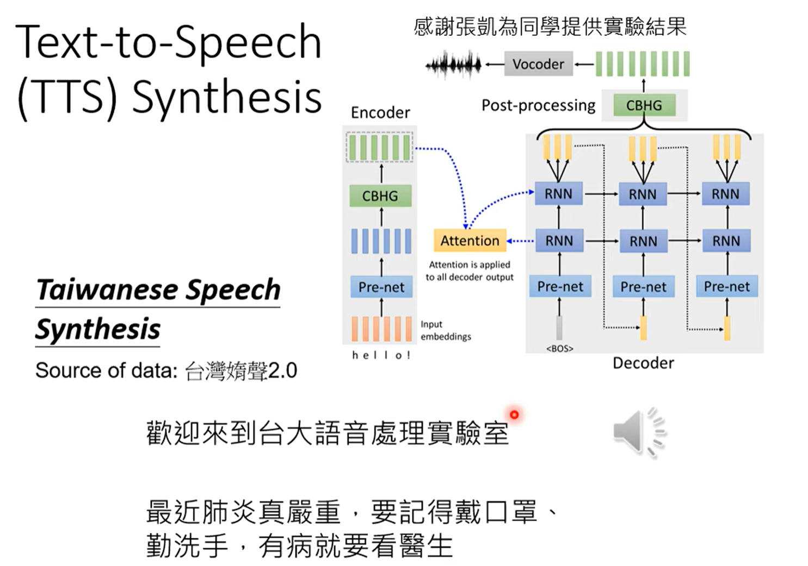
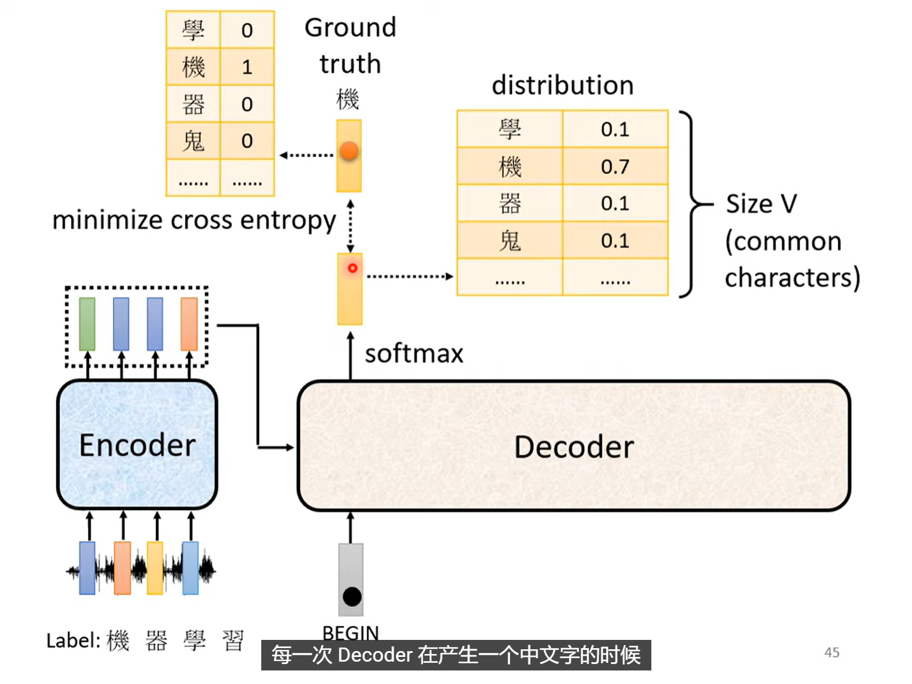

# Transformer 基础
## I. Seq2Seq architecture
我们不知道输出sequence的长度是多少，因此不能简单地把输出sequence的每一个vector都对应到输入sequence的某一个vector上。
这样的任务案例有：机器翻译，语音辨识，对话系统

### 1.1 更多的例子
#### 1. Text-to-Speech

#### 2. Chatbot
例如大语言模型？

QA, NLP(Natural Language Processing)

#### 3. syntactic analysis

#### 4. Multi-label classification

#### 5. Object dectection

## II. Encoder and Decoder
### 2.1 Encoder
“给一排向量，输出另一排向量”——Self-Attention

基本的block结构

注意，这个基本的 block 包含的运算：
1. Multi-head Self-Attention
2. Add & Norm(Residual Connection + Layer Normalization)
3. Feed Forward Neural Network
4. Add & Norm(Residual Connection + Layer Normalization)

Transformer Encoder，就是堆叠了多个基本 block 得到的结构：

### 2.2 Decoder

Decoder 的整体效果

Auto-regressive!

Transformer 的整体架构

Decoder 这里的 Self-Attention 是Masked Self-Attention，因为 Decoder 不能看到未来的信息。

#### Masked Self-Attention 工作机制详解
我们依旧以4个输入($[\mathbf{a^1}, \mathbf{a^2}, \mathbf{a^3}, \mathbf{a^4}]$)的例子来说明 Masked Self-Attention 的工作机制。
$[\mathbf{q^1}, \mathbf{q^2}, \mathbf{q^3}, \mathbf{q^4}]=W^q [\mathbf{a^1}, \mathbf{a^2}, \mathbf{a^3}, \mathbf{a^4}]$
第一个$\mathbf{a^1}$只能看到自己，因此其计算出来的得分向量是：$\mathbf{\alpha^{1,1}} = \mathbf{q^1}\mathbf{k^1}$
第二个$\mathbf{a^2}$可以看到前面两个，因此其计算出来的得分向量是：$\mathbf{\alpha^{2,1}} = \mathbf{q^2}\mathbf{k^1}, \mathbf{\alpha^{2,2}} = \mathbf{q^2}\mathbf{k^2}$
第三个$\mathbf{a^3}$可以看到前三个，因此其计算出来的得分向量是：$\mathbf{\alpha^{3,1}} = \mathbf{q^3}\mathbf{k^1}, \mathbf{\alpha^{3,2}} = \mathbf{q^3}\mathbf{k^2}, \mathbf{\alpha^{3,3}} = \mathbf{q^3}\mathbf{k^3}$
第四个$\mathbf{a^4}$可以看到前四个，因此其计算出来的得分向量是：$\mathbf{\alpha^{4,1}} = \mathbf{q^4}\mathbf{k^1}, \mathbf{\alpha^{4,2}} = \mathbf{q^4}\mathbf{k^2}, \mathbf{\alpha^{4,3}} = \mathbf{q^4}\mathbf{k^3}, \mathbf{\alpha^{4,4}} = \mathbf{q^4}\mathbf{k^4}$
因此，attention matrix是一个上三角矩阵：
$$A'=\begin{bmatrix}
 \alpha^{1,1} & \alpha^{2,1} & \alpha^{3,1} & \alpha^{4,1}\\
 -1 & \alpha^{2,2} &  \alpha^{3,2} & \alpha^{4,2} \\
 -1 & -1 & \alpha^{3,3} & \alpha^{4,3} \\
 -1 & -1 & -1 & \alpha^{4,4}
\end{bmatrix}$$

也就是说，有一半数值是不用计算的。

### 2.3 Cross-Attention
$\mathbf{q}$来自Decoder，$\mathbf{k}$和$\mathbf{v}$来自Encoder。

是不是每一个decoder block 都是用的 encoder 最后一层的输出$\mathbf{\alpha_{1}'}, \mathbf{\alpha_{2}'}, \mathbf{\alpha_{3}'}$呢？
是，也可以不是，这个问题值得研究。

**这里的更重要的问题是，decoder 在进行 cross-attention 的时候，输入是什么？**

## III. Train and Inference
### 3.1 Train

#### Objective Function
每一个输出位置都是一个 distribution，每一个输出（还要包含 END token）的 cross-entropy loss 之和，就是 Loss Function

#### Teacher Forcing
此时，decoder 的输入，是 **Ground Truth 的前一个 token。**

#### Tips
- copy mechanism
- Guided Attention
  - 在某些任务中（例如文本转语音），输入与输出序列之间的对齐通常是单调的。为了促使模型学习这种对齐模式，可以引入引导注意力损失函数。该损失函数会对偏离对角线模式的注意力权重施加惩罚，从而促进更直接的对齐关系。
- Beam Search
  - 在推理阶段，使用 Beam Search 可以帮助模型生成更优质的输出序列。Beam Search 通过在每一步保留多个最有可能的候选序列，**避免了贪心搜索可能导致的次优解问题，从而提高了生成结果的质量。**
    

### 3.2 Inference
在测试时，decoder 的输入，是 **上一个 time step 的预测输出。**

### 3.3 Optimizing Evaluation Metrics
- 在训练时，我们的目的是使得 cross-entropy 最小；
- 在评估时，我们的目的是使得 BLEU score 最大。

