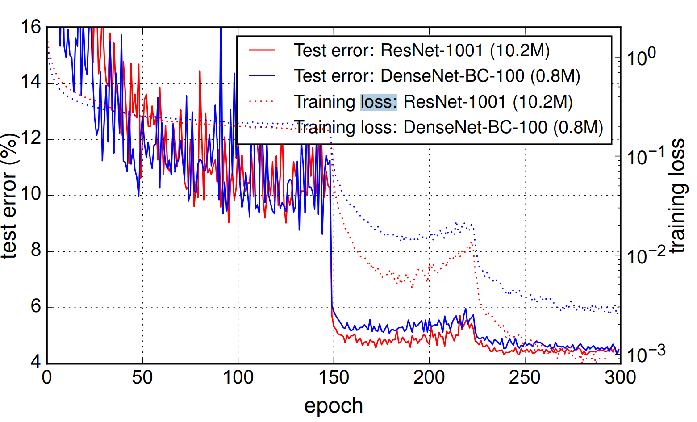

# DenseNet:

## Ques
> By design, DenseNets allow layers access to feature-maps from all of its preceding layers (although sometimes through transition layers). We conduct an experiment to investigate if a trained network takes advantage of this opportunity. We first train a DenseNet on C10+ with L = 40 and k = 12. For each convolutional layer ℓ within a block, we compute the average (absolute) weight assigned to connections with layer s. Figure 5 shows a heat-map for all three dense blocks. The average absolute weight serves as a surrogate for the dependency of a convolutional layer on its preceding layers.

> The layers within the second and third dense block consistently assign the least weight to the outputs of the transition layer (the top row of the triangles), indicating that the transition layer outputs many redundant features (with low weight on average). This is in keeping with the strong results of DenseNet-BC where exactly these outputs are compressed

这里的weight代表什么意思？
Layer $\ell$看到Layer$s$，或者说利用s占比多少。
这一点通过$1 \times 1$Filter来实现。


ReLook:
feature map: 卷积层或池化层输出的多通道张量


## I. Introduction
### 1.1 之前网络的缺陷
> Traditional feed-forward architectures can be viewed as algorithms with a state, which is passed on from layer to layer. Each layer reads the state from its preceding layer and writes to the subsequent layer. It changes the state but also passes on information that needs to be preserved. ResNets [11] make this information preservation explicit through additive identity transformations. Recent variations of ResNets [13] show that many layers contribute very little and can in fact be randomly dropped during training. This makes the state of ResNets similar to (unrolled) recurrent neural networks [21], but the number of parameters of ResNets is substantially larger because each layer has its own weights.
>
> 传统前馈网络可视为具有状态传递的算法，其状态在层间逐层传递。每一层从前驱层读取状态并写入后续层，既改变状态又传递需要保留的信息。ResNet通过加性恒等变换显式实现了这种信息保留机制[11]。ResNet的最新变体[13]表明，许多层贡献甚微，实际上可在训练过程中随机丢弃。这使得ResNet的状态类似于（展开的）循环神经网络[21]，但由于每层拥有独立权重，其参数量显著更大

- **state**: 每一层的输出feature maps。比如说输入一张猫的照片，第一层卷积提取：边缘，第二层卷积提取：更复杂的局部纹理，第三层卷积提取：猫耳朵 / 猫脸等形状。这些都是**有价值的信息**。
  但是但是传统 CNN 有一个严重问题：**每一层输出 只能传给下一层（$x_l → x_{l+1}$）**
  **意味着早期层产生的“有价值特征”,经过几十层后，被不断卷积、混合、变换……，这些特征逐渐被淡化、扭曲甚至遗失**
- **“many layers contribute very little and can in fact be randomly dropped during training.”**
  ResNet的结构是：
  $$x_{l+1} = x_{l}+F(x_l)$$
  如果 $F(x_l)$ 很小（趋近于 0），那么：
  某些残差块几乎不改变特征 → “不起作用”
  这就是为什么 Stochastic Depth 随机丢掉残差块时，性能还能保持甚至提升。
  ResNet的深度，实际上可能并不是有效的深度


### 1.2 不同网络的特性在梯度链式法则中的体现
> Besides better parameter efficiency, one big advantage of DenseNets is their improved flow of information and gradients throughout the network, which makes them easy to train. **Each layer has direct access to the gradients from the loss function and the original input signal, leading to an implicit deep supervision [20].** This helps training of deeper network architectures. Further, we also observe that dense connections have a regularizing effect, which reduces overfitting on tasks with smaller training set sizes
>
> 除了参数效率更高之外，DenseNet（密集连接网络）的另一大优势在于其改善了信息与梯度在整个网络中的流动，这使得网络更易于训练。**每一层都能直接获取来自损失函数的梯度以及原始输入信号，从而形成了一种隐式的深度监督机制[20]**。这种特性有助于更深层网络架构的训练。此外，我们还观察到密集连接具有正则化效应，能够在训练集规模较小的任务上减少过拟合现象。

- 我们举个例子，分别来自VGG, ResNet, DenseNet。下面用$H(\cdot)$表示权重层的映射关系，可能包含了Conv, BN, ReLU
  - **VGG:**
  
  (1) 前向传播：
  > $\mathbf{X_1} = H_1 (\mathbf{X_0}, \mathbf{W_1})$
  > $\mathbf{X_2} = H_2 (\mathbf{X_1}, \mathbf{W_2})$
  > $\mathbf{X_3} = H_3 (\mathbf{X_2}, \mathbf{W_3})$
  > $\text{Loss} = L(\mathbf{X_3})$

  (2) 反向传播：例如计算$\partial L/\partial \mathbf{W_1}$:
  > $$
  \frac{\partial L}{\partial \mathbf{W_1}}  =\frac{\partial L}{\partial \mathbf{X_3}} \cdot \frac{\partial \mathbf{X_3}}{\partial \mathbf{X_2}} \cdot \frac{\partial \mathbf{X_2}}{\partial \mathbf{X_1}} \cdot \frac{\partial \mathbf{X_1}}{\partial \mathbf{W_1}}$$

  - **ResNet:**
  
  (1) 前向传播：
  > $\mathbf{X_1} = H_1 (\mathbf{X_0}; \mathbf{W_1}) + \mathbf{X_0}$ 
  > $\mathbf{X_2} = H_2 (\mathbf{X_1}; \mathbf{W_2})+ \mathbf{X_1}$ 
  > $\mathbf{X_3} = H_3 (\mathbf{X_2}; \mathbf{W_3})+ \mathbf{X_2}$ 
  > $\text{Loss} = L(\mathbf{X_3})$

  (2) 反向传播：例如计算$\partial L/\partial \mathbf{W_1}$:
  > $$\begin{aligned}
  \frac{\partial L}{\partial \mathbf{W_1}}  & =\frac{\partial L}{\partial \mathbf{X_3}} \cdot (\frac{\partial \mathbf{H_3}}{\partial \mathbf{W_1}}+\frac{\partial \mathbf{X_2}}{\partial \mathbf{W_1}}) \\
  & = \frac{\partial L}{\partial \mathbf{X_3}} \cdot (\frac{\partial \mathbf{H_3}}{\partial \mathbf{X_2}}+1)\cdot \frac{\partial \mathbf{X_2}}{\partial \mathbf{W_1}} \\ 
  & = \frac{\partial L}{\partial \mathbf{X_3}} \cdot (\frac{\partial \mathbf{H_3}}{\partial \mathbf{X_2}}+1)\cdot (\frac{\partial \mathbf{H_2}}{\partial \mathbf{X_1}}+1)\cdot \frac{\partial \mathbf{X_1}}{\partial \mathbf{W_1}} \\ 
  & = \frac{\partial L}{\partial \mathbf{X_3}} \cdot (\frac{\partial \mathbf{H_3}}{\partial \mathbf{X_2}}+1)\cdot (\frac{\partial \mathbf{H_2}}{\partial \mathbf{X_1}}+1)\cdot \frac{\partial \mathbf{H_1}}{\partial \mathbf{W_1}}
  \end{aligned}$$ 
  
  可见，从Loss函数到第一层的权重$\mathbf{W_1
  }$不再是只能经过一条超长的链式法则，**而是有了多条支路**，比如上面式子**中间的两个1**，这个效果是由shortcut connection构建的。
  然而，bottleneck的堆叠并不能使得这种从Loss直接到$\mathbf{W_1}$的**超短通路**长时间存在，因为第一层的shortcut并不是已知蔓延的很后面的(所以说当ResNet的梯度很深时，还是有可能存在gradient vanishing的问题)。
  **但是在DenseNet，这中链接一直存在！**

  - DenseNet

  (1) 前向传播：
  > $\mathbf{X_1} = H_1 (\mathbf{X_0}, \mathbf{W_1})$ 
  > $\mathbf{X_2} = H_2 (\mathbf{X_0}, \mathbf{X_1}\; \mathbf{W_2})$ 
  > $\mathbf{X_3} = H_3 (\mathbf{X_0}, \mathbf{X_1}, \mathbf{X_2}; \mathbf{W_3})$ 
  > $\text{Loss} = L(\mathbf{X_3})$

  (2) 反向传播：例如计算$\partial L/\partial \mathbf{W_1}$:
  > $$\begin{aligned}
  \frac{\partial L}{\partial \mathbf{W_1}}  & =\frac{\partial L}{\partial \mathbf{X_3}} \cdot (\frac{\partial \mathbf{H_3}}{\partial \mathbf{X_0}}+\frac{\partial \mathbf{H_3}}{\partial \mathbf{X_1}}+\frac{\partial \mathbf{H_3}}{\partial \mathbf{X_2}}+\frac{\partial \mathbf{H_3}}{\partial \mathbf{W_1}}) \\
  \end{aligned}$$ 
  
  可见，**不管传播到后面多少层，Loss函数都能直接看到第一层的权重（严格来说是第一层权重$\mathbf{X_0}$与输入$\mathbf{W_1}$作用后的$\mathbf{X_1}$），而不用必须透过中间传播的所有层。** 一直有一条永远不会衰减的路径。

- **implicit deep supervision**
  在 DenseNet 中，每一层都好像直接受到了“**来自损失函数的监督**”，就像把 loss 的梯度直接连接到了每一层上。


## II. Related Work
### 2.1 几种当时新的架构的关系以及对比
> Highway Networks [33] were amongst the first architectures that provided a means to effectively train end-to-end networks with more than 100 layers. Using bypassing paths along with gating units, Highway Networks with hundreds of layers can be optimized without difficulty. The bypassing paths are presumed to be the key factor that eases the training of these very deep networks. This point is further supported by ResNets [11], in which pure identity mappings are used as bypassing paths. ResNets have achieved impressive, record breaking performance on many challenging image recognition, localization, and detection tasks, such as ImageNet and COCO object detection [11]. Recently, stochastic depth was proposed as a way to successfully train a 1202-layer ResNet [13]. Stochastic depth improves the training of deep residual networks by dropping layers randomly during training. This shows that not all layers may be needed and highlights that there is a great amount of redundancy in deep (residual) networks. Our paper was partly inspired by that observation. ResNets with pre-activation also facilitate the training of state-of-the-art networks with > 1000 layers [12].
>
> 高速公路网络（Highway Networks）[33]是最早实现超百层端到端网络有效训练的架构之一。该网络通过引入旁路路径与门控单元，使数百层深度的网络能够轻松完成优化。研究表明，旁路路径是缓解超深度网络训练难度的关键因素，这一观点在残差网络（ResNets）[11]中得到了进一步验证——后者采用纯恒等映射作为旁路路径。残差网络在ImageNet和COCO物体检测[11]等极具挑战性的图像识别、定位与检测任务中创造了多项突破性性能记录。近期提出的随机深度方法[13]成功实现了1202层残差网络的训练，该方法通过在训练过程中随机丢弃层来改善深度残差网络的训练效果，这不仅表明网络并非需要所有层参与计算，更揭示了深度（残差）网络中存在着大量冗余结构，我们的研究正是部分受此现象启发。采用预激活结构的残差网络还可支持超过1000层的尖端网络训练[12]。

1. **Highway networks**
  比ResNet早半年，核心思想是：
  $y = H(x) \cdot T(x) + x \cdot C(x)$
  引入 gated shortcut（带门控的捷径路径）
  门控允许网络“自动决定”是否要保留信息或修改信息，缺点就是引入了两个门控神经元，参数量巨大
2. **ResNet**
   比 Highway Networks 更简单有效，直接丢弃门控神经元，引入identity mapping
3. **Stochastic Depth**
   在ResNet基础上提出的，
   思路：**训练时随机“删除”某些残差层，让网络变得更浅 → 训练更稳定**
   具体做法是：
    在训练某一批输入时：
    ```
    with probability p: 保留该 residual block
    with probability (1 – p): 跳过该 block（只用 shortcut 直接传递）
    ``` 
    这样使得梯度更“短”，更可靠！
    ==stochastic depth的提出直接证明了：ResNet中很多深层残差块几乎不重要，被跳过也不影响性能。==
4. **DenseNet**
   🟢 ==“既然 ResNet 中有很多冗余层，那我们就直接把有用信息保存下来，让所有层共享特征”==

### 2.2 GoolgeNet 
> An orthogonal approach to making networks deeper (e.g., with the help of skip connections) is to increase the network width. The GoogLeNet [35, 36] uses an “Inception module” which concatenatesfeature-maps produced by filters of different sizes. In [37], a variant of ResNets with wide generalized residual blocks was proposed. In fact, simply increasing the number of filters in each layer of ResNets can improve its performance provided the depth is sufficient [41]
>
> GoogLeNet[35,36]采用"Inception模块"来拼接不同尺寸滤波器生成的特征图。文献[37]提出了一种采用宽泛化残差块的ResNet变体。事实上，只要网络深度足够，单纯增加ResNet各层滤波器数量即可提升性能[41]。

### 2.3

> Instead of drawing representational power from extremely deep or wide architectures, DenseNets exploit the potential of the network through feature reuse, yielding condensed models that are easy to train and highly parameterefficient
>
> 稠密网络（DenseNets）并非通过极深的架构或极宽的架构来获取表征能力，而是通过 **"feature resue"(特征复用)** 来挖掘网络潜力，从而构建出易于训练且**参数效率高度集约**的紧凑模型。

## III. DenseNets
### 3.1 符号定义
$H_{\ell}$: 第l层非线性变换，几种不同运算的复合，例如BN, ReLU, Conv或者Pooling
$\mathbf{x}_\ell$: 第$\ell$层的输出feature map

- Traditional: $\mathbf{x}_\ell = H_\ell(\mathbf{x}_{\ell-1})$
- ResNet: $\mathbf{x}_\ell = H_l(\mathbf{x}_{\ell-1}) + \mathbf{x}_{\ell-1}$

### 3.2 ResNet的缺陷
> However, the identity function and the output of Hℓ are combined by summation, which may impede the information flow in the network.
>
> 残差网络（ResNet）的一个优势在于梯度能够通过恒等映射直接从后续层流向浅层。然而，恒等函数与$H_{\ell}$的输出通过求和相结合，这种操作可能会阻碍网络中的信息流动。

==什么叫做阻碍信息流？为什么会阻碍？==
1. $\mathbf{x}_\ell = H_l(\mathbf{x}_{\ell-1}) + \mathbf{x}_{\ell-1}$
   这相当于把两个feature map直接压缩合并为一个，但是 **“合并”的动作本质上会丢掉一部分细节，导致早期特征信息被掩盖。** 例如把“素描图（边缘）”和“纹理图”叠在一起混成一张新图，这显然是不合理的。（这就是 DenseNet 使用 concat（拼接）而不是 add（加法） 的根本原因。）

### 3.3 Dense connectivity
第$\ell$层将接收所有前驱层（$x_0,...,x_{\ell-1}$）的特征图作为输入：

$x_\ell = H_\ell([x_0, x_1, ..., x_{\ell-1}])$

其中$[x_0,...,x_{\ell-1}]$表示第0层至第$\ell-1$层生成的特征图 **拼接(concatenation)** 结果。由于这种密集连接特性，我们将该网络架构称为密集卷积网络（DenseNet）。为实现便利，我们将公式$H_\ell(\cdot)$的多个输入拼接为单个张量。


### 3.4 Dense Block and Transition layer
1. **Dense Block的构成：**
   1. BN, ReLU, Conv $\rightarrow$ BN, ReLU, Conv
   2. 内部的**所有层输出特征图的空间尺寸**相同（H×W 不变）。
   3. 所有downsampling过程交给Transition Layer完成
   4. **不同 Dense Block 之间没有 Dense-style concat**，即第一个dense block内部的所有feature map不会直接concat给第二个dense block
2. **Transition Layer**：
   1. 结构：BN $\rightarrow$ $1\times 1$ Conv $\rightarrow$ $2\times 2$ AvgPool
   2. BN稳定训练，防止梯度消失
   3. $1\times 1$ Conv：调整Dense Block输出feature map的channels数。
   4. 2×2 AvgPool：完成downsampling

### 3.5 Growth rate
> If each function Hℓ produces k featuremaps, it follows that the ℓth layer has k0 + k × (ℓ − 1) input feature-maps, where k0 is the number of channels in the input layer.
> 增长率。若每个函数$H_\ell$生成$k$个特征图，则第$\ell$层将包含$k_0 + k \times (\ell - 1)$个输入特征图，其中$k_0$表示输入层的通道数。

理解：
输入层：$k_0$
第1层：增加 $k$
第2层：再增加 $k$
...
第$(\ell-1)$层：再增加 $k$
因此第$\ell$层看到的feature map就有：$k_0 + k(\ell - 1)$个

> each layer has access to all the preceding feature-maps in its block and, therefore, to the network’s “collective knowledge”. One can view the feature-maps as the global state of the network. Each layer adds k feature-maps of its own to this state. The growth rate regulates how much new information each layer contributes to the global state. The global state, once written, can be accessed from everywhere within the network and, unlike in traditional network architectures, there is no need to replicate it from layer to layer.
>
> 每个层都能**访问其模块中所有先前的特征图**，从而获取网络的"集体知识"。特征图可视为网络的全局状态，每一层都会向该状态添加$k$个自身生成的特征图。**增长率控制着每个层向全局状态贡献新信息的程度**。与传统网络架构不同，这种全局状态一旦写入，即可在整个网络中**任意访问**，无需逐层复制。

1. 后面的 layer 能够看到前面所有 feature maps，它们像一个“知识库”（**collective knowledge**）。当前 layer 的 feature map 也会被写入这个“知识库”供后面使用。
==DenseNet好就好在：即便每层只新增 12 个通道（k=12），效果仍然很好==

2. DenseNet 不需要“重复学习”
    1. 传统 CNN：
    * 每层**自己学习边缘 → 重复浪费**
    * 因为它**看不到浅层的原始边缘特征**
    2. ResNet：
    * 虽然有 shortcut，但 **add 后特征会被混合** → **不能直接访问浅层特征**
    3. DenseNet：
    * 直接看到浅层原始边缘图 + 中层纹理图 + 深层高级特征
    * 不需要重复学习中早期特征
    **这就是 collective knowledge 的价值。**

3. global state 只会“增长”，不会“变形/丢失”
    在 DenseNet：
    * 每层的特征被 concat 后就永不丢失
    * 后面的层可以毫无损失地读取它
    * 信息不被覆盖、不被混合、不被破坏
    这和 ResNet 的 add shortcut（会混合特征）完全不同。


### 3.6 Bottleneck
> Bottleneck layers. Although each layer only produces k output feature-maps, it typically has many more inputs. It has been noted in [36, 11] that a $1\times1$ convolution can be introduced as bottleneck layer before each $3\times3$ convolution to **reduce the number of input feature-maps**, and thus to improve computational efficiency. We find this design especially effective for DenseNet and we refer to our network with such a bottleneck layer, i.e., to the **BN-ReLU-Conv(1× 1)-BN-ReLU-Conv(3×3)** version of $H_\ell$, as DenseNet-B. In our experiments, we let each $1\times1$ convolution produce $4k$ feature-maps.
>
> 瓶颈层设计。尽管每个卷积层仅生成$k$个输出特征图，但其输入通道数通常远高于此（例如$k0 + k(l-1)$）。文献[36,11]指出，可在每个3×3卷积前引入1×1卷积作为瓶颈层来减少输入特征图数量，**从而提升计算效率**。我们发现这种设计对DenseNet尤为有效，将采用该瓶颈结构的网络（即$H_\ell$函数采用**BN-ReLU-Conv(1×1)-BN-ReLU-Conv(3×3)**变体）称为**DenseNet-B**。实验中，我们令每个1×1卷积生成$4k$个特征图。


### 3.7 Compression
> If a dense block contains m feature-maps, we let the following transition layer generate $⌊\theta m⌋$ output featuremaps, where $0<\theta\leq1$ is referred to as the compression factor.

为什么Transition layer可以改变输出feature maps的个数(这里实际上是输出的feature map的channels个数)？因为Transition layer的第一步就是$1\times 1$ Conv 

### 3.8(Important)
本片论文中，提到的Dense Block中，提到某layer可以看到此前层输出的所有feature maps。这里的feature map，实际上只有一个channel！具体流程可以参照下方理解：
比如说初始输入有$k_0$个feature map，准确来说是一个具有16channels的feature map
* **Layer 0 的输入：**
    * 它看到的是 $k_0$ 个 channels。
    * **Input Shape:** $(16, H, W)$

* **Layer 0 的输出：**
    * 经过 BN-ReLU-Conv 后，它产生 $k$ 个新的 feature maps。
    * **Output Shape:** $(12, H, W)$

* **Layer 1 的输入（关键点）：**
    * 它不只是接收 Layer 0 的输出。它接收 **(Block 的输入) + (Layer 0 的输出)**。
    * 组合方式是**在 Channel 维度上拼接**。
    * **Input Shape:** $(16 + 12, H, W) = (28, H, W)$

* **Layer 1 的输出：**
    * 它同样只产生 $k$ 个新的 feature maps。
    * **Output Shape:** $(12, H, W)$

* **Layer 2 的输入：**
    * 它接收 **(Block 输入) + (Layer 0 输出) + (Layer 1 输出)**。
    * **Input Shape:** $(16 + 12 + 12, H, W) = (40, H, W)$

以此类推，对于第 $l$ 层，它的输入 Channel 总数是 $k_0 + k \times (l-1)$ 

此外，前置所有Layers的输出feature map的组合方式就是：**concatenation(拼接)**，拼接方式如下：
$$[x_0, x_1, x_2, ..., x_{\ell-1}]$$
即按照顺序排列，其中$x_{k}$代表第$k$层**输出的所有feature map，其实严格来说是一张具有多channels的feature map, channels个数等于第$k$层filters个数！**
**也就是说，上面这个公式，其实是single Tensor!** 原文中也直接说过：
> "refers to the concatenation of the feature-maps produced in layers $0 \dots l-1$." [cite: 134]
> "we concatenate the multiple inputs ... into a single tensor."

==这是 DenseNet 和 ResNet 最大的区别。==

* **ResNet:** 使用 **相加 (Summation)**。$H_l(x_{l-1}) + x_{l-1}$。这要求输入的 Channel 数和输出的 Channel 数通常要一致（**或者是为了相加而强行对齐**）。
* **DenseNet:** 使用 **拼接 (Concatenation)**。


### 3.9 Implement Details
> Implementation Details. On all datasets except ImageNet, the DenseNet used in our experiments has three dense blocks that each has an equal number of layers. Before entering the first dense block, a convolution with 16 (or twice the growth rate for DenseNet-BC) output channels is performed on the input images. For convolutional layers with kernel size 3×3, each side of the inputs is zero-padded by one pixel to keep the feature-map size fixed. We use 1×1 convolution followed by 2×2 average pooling as transition layers between two contiguous dense blocks. At the end of the last dense block, a global average pooling is performed and then a softmax classifier is attached. The feature-map sizes in the three dense blocks are 32× 32, 16×16, and 8×8, respectively. We experiment with the basic DenseNet structure with configurations {L = 40, k = 12}, {L = 100, k = 12} and {L = 100, k = 24}. For DenseNetBC, the networks with configurations {L = 100, k = 12}, {L=250, k =24} and {L=190, k =40} are evaluated. In our experiments on ImageNet, we use a DenseNet-BC structure with 4 dense blocks on 224×224 input images. The initial convolution layer comprises 2k convolutions of size 7×7 with stride 2; the number of feature-maps in all other layers also follow from setting k. The exact network configurations we used on ImageNet are shown in Table 1.
>
> 实现细节。除ImageNet外，我们在所有数据集上使用的DenseNet均包含三个密集块，每个密集块具有相同数量的层。在进入第一个密集块之前，会对输入图像执行**输出通道为16（对于DenseNet-BC则为增长率的两倍）的卷积操作**。对于核大小为3×3的卷积层，输入的每个边缘会进行**单像素零填充**以保持特征图尺寸不变。我们采用1×1卷积接2×2平均池化作为相邻密集块间的过渡层。在最后一个密集块末端执行全局平均池化后连接softmax分类器。**三个Dense Block中的特征图尺寸分别为32×32、16×16和8×8**。我们测试了Basic DenseNet结构的三种配置：{L=40，k=12}、{L=100，k=12}和{L=100，k=24}；对于DenseNet-BC，则评估了{L=100，k=12}、{L=250，k=24}和{L=190，k=40}三种配置。在ImageNet实验中，我们采用4个密集块的DenseNet-BC结构处理224×224输入图像。初始卷积层包含2k个7×7卷积核（步长为2），其余所有层的特征图数量也遵循k值设定。ImageNet实验中使用的具体网络配置如表1所示。

1. 针对 CIFAR 和 SVHN 数据集（On all datasets except ImageNet）

| 特性 | **文字描述部分 (Text)** | **表格 1 部分 (Table 1)** |
| :--- | :--- | :--- |
| **适用数据集** | **CIFAR-10, CIFAR-100, SVHN**  | **ImageNet**  |
| **输入尺寸** | 小尺寸图片 (文字隐含为 $32\times32$)，feature maps 变化为 $32\times32 \rightarrow 16\times16 \rightarrow 8\times8$  | 大尺寸图片 ($224\times224$)  |
| **Dense Blocks 数量** | **3个** (三个 block 拥有相等的层数)  | **4个** (见 Table 1 中的 Dense Block 1, 2, 3, 4)  |
| **初始卷积层** | 输出 16(DenseNet) 或 $2k$(DenseNet-BC) 个通道 | $7\times7$ 卷积，stride 2，输出 $2k$ 个通道  |
| **配置目的** | 验证**不同深度 ($L$)** 和**增长率 ($k$)** 的效果 (如 $L=40, k=12$)  | 追求在大型数据集上的 SOTA 性能 (如 DenseNet-121, 169)  |

2. ImageNet数据集


### 3.10 Clarify: DenseNet and DenseNet-BC
#### 1. DenseNet
1. DenseBlock内部：结构只有：**BN-ReLU-$3\times 3$ Conv**，没有用前缀的**BN-ReLU-$1\times 1$ Conv**提前降低计算复杂度。
2. Transition Layer：不进行通道压缩（**即：$\lfloor \theta m \rfloor$-Compression**）

#### 2. DenseNet-BC (优化版)
结合了 **B**ottleneck layers 和 **C**ompression。
1. **B (Bottleneck)：** 在 $3\times3$ 卷积前加入 $1\times1$ 卷积（即 `BN-ReLU-Conv(1x1) - BN-ReLU-Conv(3x3)`）来**减少输入 feature maps 的数量（准确来说是channels数），降低计算量**。
2. **C (Compression)：** 在 Transition Layer 使用 $\theta < 1$（实验中通常设为 0.5 ），即用 $1\times1$ 卷积将**通道数减半** [cite: 162, 164]。
3. **初始卷积层：** 根据这一段描述，初始卷积层输出 **2倍增长率 ($2 \times k$)** 的通道数。

## IV. Experiments

### 4.1 有关SGD

十万个数据，每一个数据都能计算出Loss函数值，并且反推梯度。也就是说如果采Full-batch GD算法：
> 算一个Loss值，算一次梯度，更新参数
> 新参数下，再“算一个Loss值，算一次梯度，更新参数”
> 新参数下，再“算一个Loss值，算一次梯度，更新参数”
> 新参数下，再“算一个Loss值，算一次梯度，更新参数”
> 新参数下，再“算一个Loss值，算一次梯度，更新参数”
> ...

一次循环可以更新十万次梯度，但是这样做计算量太大。
$\rightarrow \rightarrow \rightarrow \rightarrow \rightarrow$ 
**mini-batch：** 分成一份一份batch，每一个batch内计算出一堆梯度，然后**求平均**，然后**才更新参数**，**然后再考虑下一个batch**

### 4.2 Parameter Efficiency
使用更少的参数达到更好的效果
> For example, our 250-layer model only has 15.3M parameters, but it consistently outperforms other models such as FractalNet and Wide ResNets that have more than 30M parameters

ResNet with 10.2M parameters VS DenseNet with 0.8M Parameters


### 4.3 Overfitting
> In our experiments, we observed potential overfitting in a single setting: on C10, a 4× growth of parameters produced by increasing k =12 to k =24 lead to a modest increase in error from 5.77% to 5 83%. The DenseNet-BC bottleneck and compression layers appear to be an effective way to counter this trend.
> 过拟合问题。参数利用效率提升带来的一个积极副作用是，DenseNet往往更不容易出现过拟合现象。我们观察到，在没有数据增强的数据集上，DenseNet架构相较于先前工作的改进尤为显著。在C10数据集上，错误率从7.33%降至5.19%，相对降幅达29%；在C100数据集上，错误率从28.20%降至19.64%，降幅约为30%。实验中仅在一个配置下观察到潜在的过拟合现象：当将增长率$k=12$提升至$k=24$导致参数量增长4倍时，C10数据集的错误率从5.77%小幅上升至5.83%。DenseNet-BC采用的瓶颈层与压缩层结构被证明是有效抑制这种趋势的方法。

## V. Dicussion
### 5.1 classifier对前面所有层的直接监督
> a single classifier on top of the network provides direct supervision to all layers through at most two or three transition layers
```
Loss
 ↑
Transition layer
 ↑
Dense Block L
 ↑
Dense Block L-1 （直接输入前层输出）
 ↑
Dense Block L-2 （直接输入更前层输出）
 ↑
...
 ↑
Input Image Feature Map
```
虽然不同DenseBlock之间没有直接通路，但是DenseBolock之内所有层与前驱层都有直接通路。因此这样的话，最后一层想要看到第一层就只用经过几层Transitional Layer。