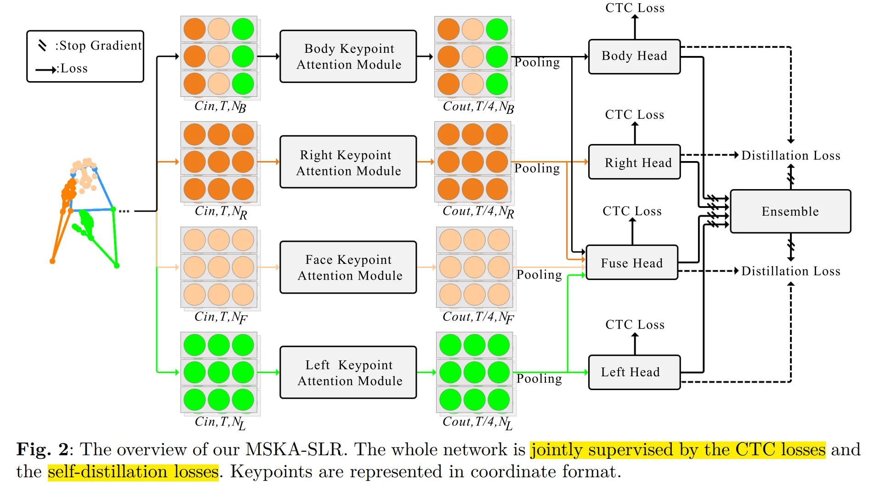
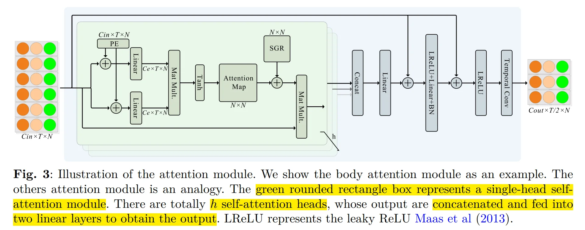

# MSKA

## I. Abstract

手语作为一种非语音交流方式，通过手势动作、面部表情和身体运动来传递信息与意义。当前大多数手语识别（SLR）与翻译方法依赖于RGB视频输入，这类数据易受背景环境波动的影响。采用基于**关键点**的策略不仅能有效降低**背景变化的干扰**，还可大幅减少模型的计算需求。然而，现有基于关键点的方法未能充分利用关键点序列中隐含的深层信息。为应对这一挑战，我们受人类认知机制启发——该机制通过分析手势形态与辅助要素之间的相互作用来辨识手语，提出了一个**多流关键点注意力网络**，用于描述由现有关键点估计器生成的关键点序列。为实现多流间的交互，我们探索了多种方法，包括**关键点融合策略、头部融合及自蒸馏技术**。最终构建的框架被命名为MSKA-SLR，通过简单增补翻译网络即可扩展为手语翻译（SLT）模型。我们在Phoenix-2014、Phoenix-2014T和CSL-Daily等知名基准数据集上进行了全面实验，验证了所提方法的有效性。值得注意的是，我们在Phoenix-2014T的手语翻译任务中取得了全新的最先进性能。相关代码与模型可通过以下链接获取：https://github.com/sutwangyan/MSKA。

## II. Introduction

Our methodology is influenced by the innate human **inclination to prioritize the configuration of gestures and the dynamic interconnection** between the hands and other bodily elements in the process of sign language interpretation.

Three contributions:
1. 第一个提出**多流关键点注意力机制** (multi-stream keypoint attention)的人，该机制完全由注意力模块构建，无需手动设计遍历规则或图拓扑结构。
2. 将关键点序列解耦为四个数据流：**左手数据流、右手数据流、面部数据流和全身数据流**，每个数据流都侧重于**骨骼序列的特定方面**。通过融合不同类型的特征，模型可以更全面地理解手语，从而实现手语识别和翻译。
3. SOTA

## III. Related Work

AetherSign 可参考的工作

- CorrNet Hu et al (2023b) model captures crucial body movement trajectories  byanalyzing correlation maps between consecutive frames. It **employs 2D CNNs to extract image features, followed by a set of 1D CNNs to acquire temporal characteristics**. 
- In this study, our distillation process **leverages the multi-stream architecture to incorporate ensemble knowledge into each individual stream**, thereby improving interaction and coherence among the multiple streams.

## IV. Method

### 4.1 Keypoint Augmentation

一般来说，keypoint coordinates are denoted with respect to the top left corner of the image, with the positive **X and Y axes oriented towards the rightward and downward directions**. 

To utilize data augmentation, we **pull the origin back to the center of the image and normalize it by a function**:

$$((x/W, (H − y)/H) − 0.5)/0.5$$

with **horizontal to the right** and **vertical upwards** defining the **positive directions of the X and Y axes**, respectively. Within this context, the variables $x$ and $y$ denote the coordinates of a given point, whereas $H$ and $W$ symbolize the **height and width** of the image, respectively.

Augmentation：

1. 将关键点序列的时间长度调整到区间 $[\times 0.5- \times 1.5]$ 内，并从该范围内随机选择有效帧。
2. 缩放过程涉及将提供的关键点集合中**每个点的坐标乘以一个缩放因子**。
3. 变换操作是通过将**提供的平移向量**应用于提供的关键点坐标集合中**每个点的坐标**来实现的
4. 二维坐标 $P(x, y)$ 逆时针旋转 $\theta$ 角度后的新坐标 $P'(x', y')$ 可以通过**坐标旋转公式**计算：

$$\left[\begin{array}{l}
x^{\prime} \\
y^{\prime}
\end{array}\right]=\left[\begin{array}{cc}
\cos (\theta), & -\sin (\theta) \\
\sin (\theta), & \cos (\theta)
\end{array}\right]\left[\begin{array}{l}
x \\
y
\end{array}\right]$$

### 4.2 SLR

#### 4.2.1 Keypoint decoupling

We divide the keypoint sequences into four sub-sequences: **left hand, right hand, facial expressions and overall**.

This segmentation helps the model more **accurately capture the relationships between different parts**, facilitating the provision of richer diversity of information

#### 4.2.2 Keypoint attention module

**79个关键点**，包含**42个手部关键点**、**11个覆盖肩肘腕的上半身关键点**，以及**部分面部关键点**（10个嘴部关键点和16个其他关键点）。

具体而言，将关键点序列表示为维度为 $C\times T\times N$ 的多维数组，其中 $C$ 维度的元素由 $[x_{\text{nt}}, y_{\text{nt}}, c_{\text{nt}}]$ 组成： $(x_{\text{nt}}, y_{\text{nt}})$ 表示第 $t$ 帧第 $n$ 个**关键点的坐标**，$c_{\text{nt}}$ 表示其**置信度**，$T$ 表示**总帧数**，$N$ 表示**关键点总数**。

由于各分支的注意力模块结构相似，我们以 body keypoints 注意力模块为例进行详细阐述。

完整的注意力模块结构如图3所示。

绿色矩形框中，输入数据 $X \in R^{C×T ×N}$ 首先会与 spatial positional encodings （**空间位置编码**） 进行融合，随后通过两个 linear mapping functions （**线性映射函数**）得到 $X \in R^{C_e×T ×N}$（其中 $C_e$ 通常小于 $C_{\text{out}}$ 以**降低特征冗余度和计算复杂度**）。The **attention map** is subjected to spatial
**global normalization**. 需要特别说明的是，在计算注意力图谱时，我们采用**Tanh激活函数**而非Vaswani等人（2017）使用的softmax函数——这是因为Tanh函数的输出值域不受正数限制，既能**捕捉负相关关系又具有更高的灵活性**（Shi等人，2020）。最终，通过将注意力图谱与原始输入进行逐元素相乘，即可得到输出特征。

为促使模型能够共同关注来自不同表示**子空间的信息**，该模块采用 $h$ heads 并行计算注意力。所有 heads 的输出经 **concat** 后映射至 **output space** 。
我们在末端添加 **feedfoward layer** 以生成 **final output**。**非线性激活函数**选用Leaky ReLU（Maas等人，2013）。
此外，如图3所示，该模块包含两个**残差连接**以稳定网络训练并整合不同特征。最后采用 **2D CNN** 进行**时序特征提取**。需要特别说明的是，**不同关键点注意力模块的权重不共享**。

#### 4.2.3 Positional encoding

**keypoint sequences** 被组织成张量形式，并输入至神经网络。由于**张量中的每个元素不存在预定的顺序或结构**，我们需要引入**位置编码机制**，为**每一个关节提供唯一的标识**。我们采用不同频率的正弦和余弦函数作为编码函数：

$$\begin{aligned}
P E(p, 2 i) & =\sin \left(p / 10000^{2 i / C_{i n}}\right) \\
P E(p, 2 i+1) & =\cos \left(p / 10000^{2 i / C_{i n}}\right)
\end{aligned}$$

其中，$p$ 代表元素的位置，$i$ 表示**位置编码向量的维度**。引入位置编码使模型能够**捕捉序列中元素的位置信息**。其周期性特性为不同位置提供了差异化表征，使模型能够更好地理解**序列元素间的相对位置关系**。**单帧内的关节点按顺序进行编码，而不同帧中的同一关节点共享相同的编码值**。

我们**仅在空间维度引入位置编码**。通过使用二维卷积提取时序特征，由于卷积操作已考虑时间连续性，因此**无需额外进行时间维度编码**。

#### 4.2.4 Spatial global regularization

针对骨骼数据的动作检测任务，其基本概念在于利用已知信息，即**人体每个关节都具有独特的物理或语义属性**，且这些**属性在所有时间帧和数据实例中均保持恒定与一致**。利用这一已知信息，Spatial global regularization 的目标在于引导模型**捕捉更广泛的注意力模式**，从而使其更好地适应多样化的数据样本。该方法通过引入一个 **global attention matrix** 来实现，该矩阵表示为 $N \times N$ 的形式，用于**展示身体关节间的普遍关系**。
该 **全局注意力矩阵** 在所有数据实例间共享，并在网络训练过程中**与其他参数协同优化**。

#### 4.2.5 Head Network

图2中，最终注意力模块输出的特征经过**空间池化处理**，维度缩减至 $T/4 \times 256$ 后输入 head network。head network 的核心目标是**进一步捕捉时序上下文信息**，其结构包含：**Temporal Linear Layer, BN, ReLU**，以及一个**Tempoarl Convoluational Module**——该模块由两个**卷积核大小为3、步长为1的时序卷积层组成**，后续接入 **Linear Translation Layer** 和另一个ReLU层。
最终生成的 **gloss representation** 特征维度为 $T/4 \times 512$。随后通过**线性分类器和softmax函数提取手势语概率**。我们采用连接时序分类（CTC）损失函数 $L_{CTC}^{body}$ 对主体注意力模块进行优化。

#### 4.2.6 Fuse Head and Ensemble

每个 Keypoints attention module 都拥有独特的**网络头阵列**。为了充分发挥我们多流架构的潜力，我们引入了一个**auxiliary fuse head** ，专门用于**整合来自不同分支的输出**。该融合头的结构设计与**其它头部（如身体头部）保持一致**，并同样受CTC损失函数$L^{fuse}_{CTC}$的约束。预测出的帧手语概率经过平均处理后，将被输入 **ensemble**（集成器） 以生成最终的 **gloss sequence**。这种集成方法通过**融合多流输出结果来提升预测精度**，实验结果充分验证了其有效性。

#### 4.2.7 Self-distillation

采用帧级别自蒸馏技术（Chen等人，2022b），通过预测出的**帧手语词概率作为伪目标**。除粗粒度的CTC损失函数外，该方法还提供了细粒度的监督机制。基于多流式架构设计，我们使用**四个头部网络输出的平均手语词概率作为伪目标**，以此**指导每个子流的学习过程**。从形式化角度而言，我们致力**于缩小伪目标与四个头部网络预测结果之间的KL散度**。这一过程被定义为帧级别自蒸馏损失——它不仅提供针对帧的专项监督，还能将集成网络的深层认知过滤传导至每个独立子流中。

#### 4.2.8 Loss Function

MSKA-SLR的整体损失由两部分组成：1) 应用于左手流($L^{left}_{CTC}$)、右手流($L^{right}_{CTC}$)、body流($L^{body}_{CTC}$)及融合流($L^{fuse}_{CTC}$)输出的CTC损失；2) 蒸馏损失($L_{Dist}$)。我们将识别损失公式化如下：

$$L_{SLR} = L^{left}_{CTC} + L^{right}_{CTC} + L^{body}_{CTC} + L^{fuse}_{CTC} + L_{Dist}$$

至此，我们已经介绍了MSKA-SLR的所有组成部分。训练完成后，MSKA-SLR能够通过融合头部网络预测手语词汇序列。

#### 4.2.9 SLT

传统方法通常将手语翻译（SLT）任务视为神经机器翻译（NMT）领域的挑战，其翻译网络的输入为视觉信息。本研究延续这一思路，在提出的MSKA-SLR框架中引入具有两个隐藏层的多层感知机（MLP），继而执行翻译流程，最终实现手语翻译功能。以此构建的网络被命名为MSKA-SLT，其架构如图1(b)所示。我们选择采用Liu等人（2020）提出的mBART作为翻译网络，因其在跨语言翻译任务中表现卓越。为充分发挥我们设计的多流架构，我们在融合头（fuse head）后接入MLP和翻译网络。MLP的输入由融合头网络编码的特征（即手势表征）构成。翻译损失采用标准的序列到序列交叉熵损失函数（Vaswani等，2017）。MSKA-SLT包含如公式4所示的识别损失$L_{SLR}$与翻译损失$L_T$，其总损失函数表示为：

$$L_{SLT} = L_{SLR} + L_T$$

### V. Experiments

#### 5.1 Implementation Details

为验证方法的泛化能力，除特殊说明外，所有实验均采用统一配置。网络结构包含四个流式处理分支，每个分支由**8个注意力模块组成**，每个模块配备**6个注意力头**。**输出通道数依次设置为：64、64、128、128、256、256、256和256**。在手语识别（SLR）任务中，我们采用**100个训练周期**的余弦退火调度策略，使用**权重衰减设置为1e-3的Adam优化器**，初始学习率为1e-3，**批处理大小设为8**。参照Chen等人(2022a,b)的研究，我们采用在CC252数据集上预训练的mBART-large-cc25初始化翻译网络。推理过程中，CTC解码器和SLT解码器的束搜索宽度均设置为5。多层感知器（MLP）以1e-3的初始学习率训练40个周期，MSKA-SLR及MSKA-SLT中的翻译网络则以1e-5的初始学习率进行训练。其余超参数与MSKA-SLR设置保持一致。所有模型均在单块Nvidia 3090 GPU上完成训练。

#### 5.2 Performance Comparison

在 CSL-Daily 上的 SLR：
Dev WER: 28.2%
Test WER: 27.8%