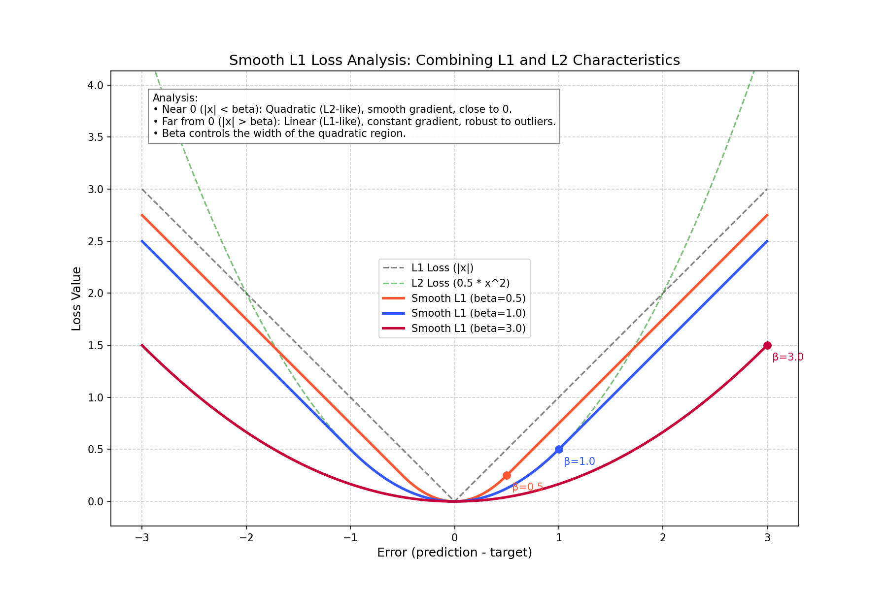
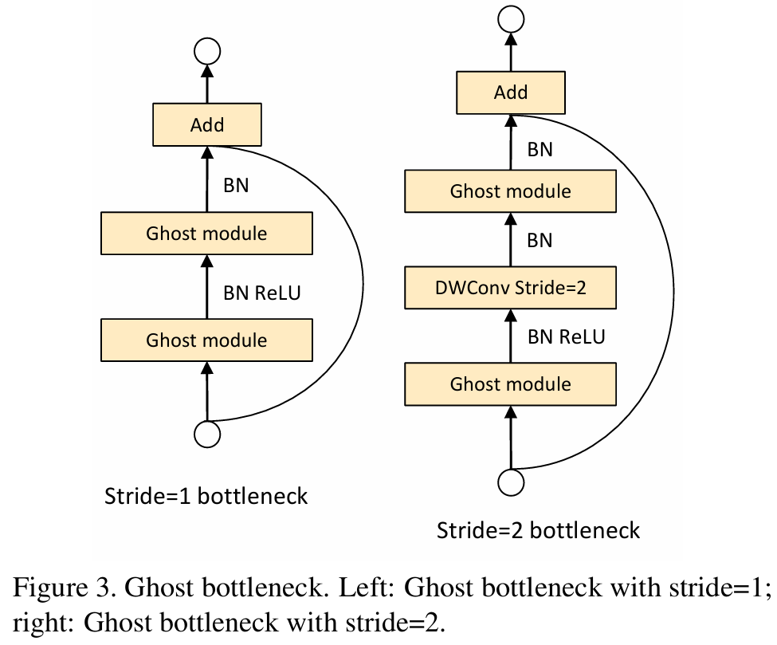
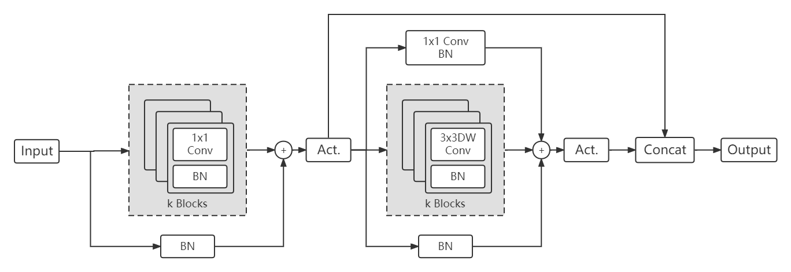
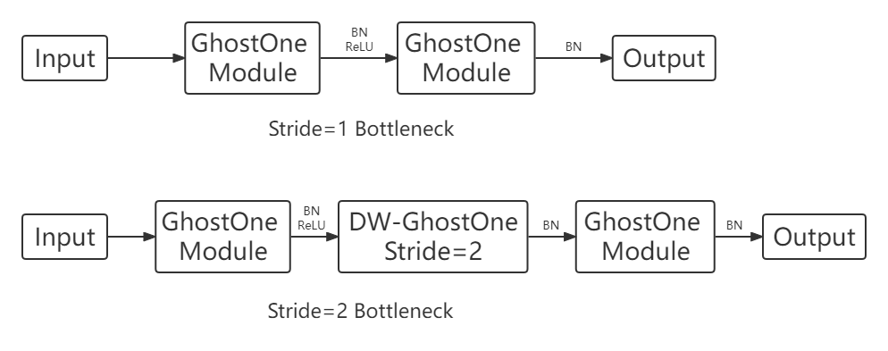

# Model Architecture and Loss Functions

## Base_Model

### ConvBlock
```python
def Conv_Block(in_channel, out_channel, kernel_size, stride, padding, group=1, has_bn=True, is_linear=False):
    '''
    Conv_Block 的 Docstring
    
    :param in_channel: 输入通道数
    :param out_channel: 输出通道数
    :param kernel_size: 卷积核尺寸，类型是 int 或则和 tuple
    :param stride: 卷积的步长，类型是 int
    :param padding: 边缘填充的大小，用于确保 feature map 尺寸不会缩小，与 stride 配合使用，类型是 int
    :param group: groups = group，默认为1，表示标准卷积；groups = in_channel，则表示深度可分离卷积
    :param has_bn: 是否使用批归一化，类型是 bool
    :param is_linear: 是否使用线性激活函数，类型是 bool
    '''
    return Sequential(
        Conv2d(in_channel, out_channel, kernel_size, stride, padding=padding, groups=group, bias=False),
        BatchNorm2d(out_channel) if has_bn else Sequential(),
        ReLU(inplace=True) if not is_linear else Sequential()
    )
```

### InvertedResidual
1×1 Pointwise Conv 扩展维度 → 3×3 Depthwise Conv 提取空间特征 → 1×1 Pointwise Conv 压缩维度回低维空间
```python
class InvertedResidual(Module):
    def __init__(self, in_channel, out_channel, stride, use_res_connect, expand_ratio):
        super(InvertedResidual, self).__init__()
        # 调用父类构造函数，这样才能使用.cuda(), .parameters(), .state_dict()等方法以及forward魔术方法
        self.stride = stride
        assert stride in [1, 2]
        # 含义: 这是一个断言（Assertion）语句。它检查传入的 stride 值是否属于列表 [1, 2] 中的一个。
        # 作用: 参数校验，确保传入的 stride 是有效的，防止后续计算出错。

        exp_channel = in_channel * expand_ratio
        self.use_res_connect = use_res_connect
        self.inv_res = Sequential(
            Conv_Block(in_channel=in_channel, out_channel=exp_channel, kernel_size=1, stride=1, padding=0),
            Conv_Block(in_channel=exp_channel, out_channel=exp_channel, kernel_size=3, stride=stride, padding=1,
                       group=exp_channel),
            Conv_Block(in_channel=exp_channel, out_channel=out_channel, kernel_size=1, stride=1, padding=0,
                       is_linear=True)
            # 在将高维特征压缩回低维（Bottleneck）时，如果使用 ReLU 这样的非线性激活函数，会破坏由于维度压缩而仅存的特征信息。因此，在最后一层去掉了激活函数，使用线性输出。
        )

    def forward(self, x):
        if self.use_res_connect:
            return x + self.inv_res(x)
        # 条件：在 MobileNetV2 的标准定义中，只有当 Stride=1 且 输入通道数等于输出通道数 时，才使用残差连接。这个连接帮助梯度在深层网络中更好地传播，避免梯度消失。
        else:
            return self.inv_res(x)
```

## Loss

### PFLD原文Loss函数

$$\mathcal{L}:=\frac{1}{M} \sum_{m=1}^{M} \sum_{n=1}^{N}\left(\sum_{c=1}^{C} \omega_{n}^{c} \sum_{k=1}^{K}\left(1-\cos \theta_{n}^{k}\right)\right)\left\|\mathbf{d}_{n}^{m}\right\|_{2}^{2} .$$

没问题，我们把这两个问题拆解得非常细致，把代码里的变量名和论文里的数学符号一一对应起来。

#### (1) 代码输入参数详解

所有这些参数都是 **PyTorch Tensor (张量)** 类型，通常在 GPU 上进行计算。

| 代码参数名 | 数据类型 (Shape) | 含义 | 对应论文中的概念 |
| :--- | :--- | :--- | :--- |
| **`attribute_gt`** | `(Batch_Size, N_attr)`<br>例如 (32, 6) | **属性标签 (Ground Truth)**。<br>每一行代表一张人脸的属性。代码中 `[:, 1:6]` 取了后5列，通常对应论文中提到的：侧脸、正脸、抬头、低头、表情/遮挡等分类。 | 对应公式(2)中的 **$c$ (class)**。<br>用来计算权重 $\omega_{n}^{c}$。 |
| **`landmark_gt`** | `(Batch_Size, 98*2)`<br>例如 (32, 196) | **关键点坐标标签 (Ground Truth)**。<br>人工标注的真实坐标 $[x_1, y_1, x_2, y_2...]$。 | 对应公式(1)中的 **$\mathbf{x}_i$** 或 **$\mathbf{X}$**。<br>即真实的 2D Landmark。 |
| **`euler_angle_gt`** | `(Batch_Size, 3)`<br>例如 (32, 3) | **欧拉角标签 (Ground Truth)**。<br>真实的人脸姿态：[Yaw, Pitch, Roll]。 | 对应公式(2)中的 **Ground Truth Angle**。<br>用来和预测值相减计算 $\theta$。 |
| **`angle`** | `(Batch_Size, 3)` | **预测的欧拉角**。<br>由 PFLD 的 **Auxiliary Network (辅助网络)** 输出的结果。 | 对应公式(2)中的 **Estimated Angle**。<br>辅助任务的输出。 |
| **`landmarks`** | `(Batch_Size, 98*2)` | **预测的关键点坐标**。<br>由 PFLD 的 **Backbone Network (主干网络)** 输出的结果。 | 对应公式(1)中的 **$\mathbf{y}_i$** 或 **$\mathbf{Y}$**。<br>即 Prediction。 |
| **`y_true`** | 同 `landmark_gt` | 通用变量名，在 `smoothL1` 和 `wing_loss` 函数中代表真实值。 | 同 `landmark_gt`。 |
| **`y_pred`** | 同 `landmarks` | 通用变量名，在 `smoothL1` 和 `wing_loss` 函数中代表预测值。 | 同 `landmarks`。 |

---

#### (2) 原文中符号 $\omega_{n}^{c}$ 和 $\theta_{n}^{k}$ 的深度解析

这部分是 PFLD Loss 设计的灵魂，理解了下标和上标就理解了它的运作机制。

##### 1. $\omega_{n}^{c}$ (Omega) —— 属性平衡权重

原文公式片段：$\sum_{c=1}^{C} \omega_n^c$

*   **含义：** 这是一个**加权系数**，用来解决**数据不平衡 (Data Imbalance)** 问题。如果某个样本属于“稀有样本”（比如大侧脸，训练集中很少），这个系数就会很大，让网络多关注它；如果是“常见样本”（比如正脸），系数就小。
*   **$c$ (Superscript 上标):** 代表 **Class (属性类别)**。
    *   论文中定义了多种属性类别：profile-face (侧脸), frontal-face (正脸), head-up (抬头), occlusion (遮挡) 等。
    *   例如：$c=1$ 代表侧脸，$c=2$ 代表正脸。
*   **$n$ (Subscript 下标):**
    *   **严格数学定义：** 在论文公式(1)中，$n$ 代表第 $n$ 个关键点 (Landmark)。
    *   **逻辑矛盾与解释：** 你可能会问，“侧脸”是整张脸的属性，跟第 $n$ 个鼻子上的点有什么关系？
    *   **实际操作：** 虽然属性是整张脸的，但在计算 Loss 时，这个权重被乘到了这张脸的**每一个**关键点的误差上。
    *   **通俗理解：** 对于第 $m$ 张图片中的第 $n$ 个关键点，如果这张图片属于类别 $c$，我们就给这个点的误差乘上权重 $\omega$。

##### 2. $\theta_{n}^{k}$ (Theta) —— 几何约束权重

原文公式片段：$\sum_{k=1}^{K} (1 - \cos \theta_n^k)$

*   **含义：** 这是一个**几何惩罚项**。它衡量的是**预测姿态和真实姿态的偏差**。偏差越大，Loss 越大，网络受到的惩罚越重。
*   **$k$ (Superscript 上标):** 代表 **Euler Angle Dimension (欧拉角的维度)**。
    *   因为是三维空间，所以 $K=3$。
    *   $k=1$: Yaw (摇头角度)
    *   $k=2$: Pitch (点头角度)
    *   $k=3$: Roll (歪头角度)
*   **$n$ (Subscript 下标):**
    *   同上，虽然欧拉角也是整张脸的属性（你不能说鼻子的 Yaw 角和嘴巴的 Yaw 角不一样），但在公式中，这个惩罚项是加在**每一个关键点 $n$** 的 Loss 上的。
*   **$\theta$ (Theta 本身):** 代表 **角度的差值 (Deviation)**。
    *   即：$| \text{真实角度} - \text{预测角度} |$。
    *   公式用了 $(1 - \cos \theta)$。
        *   当预测完全准确，差值 $\theta=0$，$\cos(0)=1$，那么 $1-1=0$，**惩罚为 0**。
        *   当预测偏差很大（比如差90度），$\cos(90)=0$，那么 $1-0=1$，**惩罚变大**。

#### 总结公式 (2) 的物理意义

$$\mathcal{L} := \dots \underbrace{\omega_n^c}_{\text{如果是稀有脸，放大Loss}} \times \underbrace{\sum (1-\cos \theta_n^k)}_{\text{如果姿态估不准，放大Loss}} \times \underbrace{\| \mathbf{d}_n^m \|_2^2}_{\text{关键点坐标本身的L2误差}}$$

*   **代码对应：** `return torch.mean(weight_angle * weight_attribute * l2_distant)`
*   **一句话总结：** 如果一张脸是**稀缺样本**（$\omega$大），且辅助网络觉得**姿态很难预测**（$\theta$大），那么网络在回归这张脸的**关键点坐标**（$d$）时，如果出错了，会受到**超级加倍**的惩罚。

#### 原版本 Loss 函数的 PyTorch 复现

源代码见[loss_ori.py](../utils/loss_ori.py)。
```python
class PFLDLoss(nn.Module):
    def __init__(self):
        super(PFLDLoss, self).__init__()

    def forward(self, attribute_gt, landmark_gt, euler_angle_gt, angle,
                landmarks, train_batchsize):
        '''
        forward 的 Docstring
        
        :param self: 说明
        :param attribute_gt: 类型 torch.Tensor, 形状 (batch_size, n_attributes)包含每个样本属性的张量，例如性别、年龄
        :param landmark_gt: 类型 torch.Tensor, 形状 (batch_size, n_landmarks * 2 )包含每个样本地标点的张量，例如(x1, y1, x2, y2, ..., xN, yN)
        :param euler_angle_gt: 类型 torch.Tensor, 形状 (batch_size, 3)包含每个样本欧拉角的张量（俯仰角、偏航）角、滚转角
        :param angle: 类型 torch.Tensor, 形状 (batch_size, 3)包含预测的欧拉角的张量
        :param landmarks: 类型 torch.Tensor, 形状 (batch_size, n_landmarks * 2)包含预测的地标点的张量
        :param train_batchsize: 类型 int, 训练时的批量大小
        '''
        weight_angle = torch.sum(1 - torch.cos(angle - euler_angle_gt), axis=1)
        # 计算几何信息：Σ(1-cosθn^k)  k=1,2,3
        # 最终得到每张图片的角度权重，形状为 (batch_size, 1)
        attributes_w_n = attribute_gt[:, 1:6].float()
        # 计算属性权重矩阵，其中第1行到第5行分别表示侧脸、正脸、抬头、低头、表情/遮挡等属性。
        # 其元素的数值为{0, 1}表示二分类，即“有无此属性”
        mat_ratio = torch.mean(attributes_w_n, axis=0)
        # 计算每个属性在当前批次中的平均值，亦或者者说频率
        # 因为每个元素的值只能是0（没有）或1（有），因此平均值就代表了当前属性在样本批次中出现的频率
        mat_ratio = torch.Tensor([
            1.0 / (x) if x > 0 else train_batchsize for x in mat_ratio
        ]).to(device)
        # 计算倒数权重，因为频率越低，要求惩罚的权重越大
        # 如果这样不处理，网络会倾向于只学习好占多数的简单样本，而忽略少数困难样本，导致 loss 被简单样本主导。
        weight_attribute = torch.sum(attributes_w_n.mul(mat_ratio), axis=1)
        # .mul 不是矩阵乘法，而是带有广播机制的按元素相乘
        # 例如，假设 attributes_w_n 的形状是 (batch_size, 5)，mat_ratio 的形状是 (1, 5)，则 mat_ratio 会被广播成 (batch_size, 5)，然后逐元素相乘。
        # 结果就是，在属性矩阵中，如果一个样本具有某个属性，则该属性的标称值从原来的1变为该属性的倒数权重，从而增加了该样本在总损失中的贡献。
        # 每个属性明码标价
        # 然后，将这些加权后的属性值相加，得到每个样本的总属性权重。最终形状： (batch_size, 1)
        # 这一行代码的总体作用就是，为当前 Batch 中的每一张图片，根据它包含的属性，累加计算出该图片的最终 Loss 权重，包含的困难属性越多，越稀有，这张图在计算Loss时所占的比重越大。 

        l2_distant = torch.sum(
            (landmark_gt - landmarks) * (landmark_gt - landmarks), axis=1)
        # 计算每个样本的地标点 L2 距离的平方和，形状为 (batch_size, 1)，每一行元素的形式为：
        # x1²+y1²+x2²+y2²+...+xN²+yN²
        return torch.mean(weight_angle * weight_attribute *
                          l2_distant), torch.mean(l2_distant)
        # 这里同样不是矩阵乘法，而是按元素相乘，最终第一项得到完整的 Loss 函数值
        # 最后求均值而不是求和，如果是求和的话，Loss 会随着 Batch Size 的增大而增大，导致超参数不稳定
        # 为什么还要返回未加权的 L2 距离平方和的均值呢？这是给人看的，用于监控指标（Metric / Monitoring）。它反映了模型当前预测的坐标和真实坐标平均相差多少。因为第一个 Loss 被权重“污染”了，你无法通过它判断模型到底收敛没有。
        # 也就是：如果只看第一个 Loss，你不知道 Loss 变大是因为模型变差
```

在这种情况下，Loss 函数的形式具体应该写为：

$$\mathcal{L}:=\frac{1}{M} \sum_{m=1}^{M}\left[ \underbrace{\left(\sum_{c=1}^{C} \omega_{m}^{c}\right)}_{\text{属性权重}} \cdot  \underbrace{\left(\sum_{k=1}^{K}\left(1-\cos \theta_{m}^{k}\right)\right)}_{\text{几何信息}} \cdot \underbrace{\left(\sum_{n=1}^{N}\left\|\mathbf{d}_{n}^{m}\right\|_{2}^{2}\right)}_{关键点距离}\right]$$

### SmoothL1
这是一种结合了 L1 Loss 和 L2 Loss 优点的损失函数。

$$\operatorname{SmoothL1}(x, y)=\left\{\begin{array}{ll}0.5(x-y)^{2}, & \text { if }|x-y|<1 \\|x-y|-0.5, & \text { otherwise }\end{array}\right.$$

代码中引入了参数$\beta$来控制两个区间切换的阈值，通用公式变形为：

$$\operatorname{loss}(x)=\left\{\begin{array}{lll}\frac{0.5 \cdot x^{2}}{\beta}, & \text { if }|x| \leq \beta & \text { (小误差区间) } \\|x|-0.5 \cdot \beta, & \text { if }|x|>\beta & \text { (大使用 } \mathrm{L} 2) \\\end{array}\right.$$

$x = \text{mae} = |y_{\text{true}} - y_{\text{pred}}|$

$\text{loss}(x)$在$x = \beta$处的**函数值相同且一阶导数相同，保证了平滑过渡。**


```python
def smoothL1(y_true, y_pred, beta=1):
    """
    very similar to the smooth_l1_loss from pytorch, but with
    the extra beta parameter
    """
    mae = torch.abs(y_true - y_pred)
    loss = torch.sum(torch.where(mae > beta, mae - 0.5 * beta, 0.5 * mae**2 / beta), axis=-1)
    # 大误差用L1 Loss：mae - 0.5 * beta，这部分的梯度是常数（1 或 -1），防止梯度爆炸。当碰到离群点（Outliers）时，不会因为误差非常大而产生巨大的梯度把模型参数打乱
    # 小误差类似L2 Loss：0.5 * mae**2 / beta，这部分的梯度在原点附近是动态减小的（越来越接近 0），能够平滑趋近于零。L1 Loss 在 0 点不可导且梯度始终为 1，容易在最优解附近震荡无法收敛，Smooth L1 解决了这个问题。
    return torch.mean(loss)
```
**为什么要额外定义 smoothL1 函数？**
SmoothL1: 则是一个经典的、稳健的基准（Baseline）。作者可能在早期调试、或者对比实验中，需要用到这个经典的 Loss 来验证模型结构本身有没有问题。如果模型连 SmoothL1 都跑不通，那就是网络结构 bug；如果 SmoothL1 能跑通但精度不够，再换用高级 Loss（Wing / PFLD Loss）。

### Wing Loss

$$\operatorname{Wing Loss}(x, y)=\left\{\begin{array}{ll}\omega \ln(1 + \frac{\left|x\right|}{\epsilon}), & \text { if } \left|x\right|<\epsilon \\ \left|x\right| - C, & \text { otherwise }\end{array}\right.$$

其中：$C = \omega \left[1-\ln(1 + \left|x\right|/\epsilon)\right]$
Wing Loss 是专门为人脸关键点检测设计的一种损失函数，**旨在更好地处理小误差，同时对大误差保持鲁棒性**。它通过对误差进行非线性变换，使得小误差部分的梯度更大，从而促进模型更精确地拟合关键点位置。形式结构上与 SmoothL1 类似，**但在小误差区间采用了对数函数，进一步增强了对小误差的敏感性。**
```python
def wing_loss(y_true, y_pred, w=10.0, epsilon=2.0, N_LANDMARK=106):
    y_pred = y_pred.reshape(-1, N_LANDMARK, 2)
    y_true = y_true.reshape(-1, N_LANDMARK, 2)
    # 将输入数据恢复成标准的集合形状
    # 神经网络的输出通常是摊平的一维向量，形状为 (batch_size, N_LANDMARK * 2)
    # 本操作将其重新调整为 (batch_size, N_LANDMARK, 2)

    x = y_true - y_pred
    c = w * (1.0 - math.log(1.0 + w / epsilon))
    absolute_x = torch.abs(x)
    # 连续性常数：C = w[1-ln(1+w/ε)]
    losses = torch.where(w > absolute_x,
                         w * torch.log(1.0 + absolute_x / epsilon),
                         absolute_x - c)
    # 小误差区间(w > |x|)：wln(1+|x|/ε)，类似于 L2 Loss，在原点附近平滑收敛
    # 大误差区间(|x| >= w)：|x| - C，类似于 L1 Loss，防止梯度爆炸（离群点）
    loss = torch.mean(torch.sum(losses, axis=[1, 2]), axis=0)
    # torch.sum(losses, axis=[1, 2]): 沿着第1维和第2维求和，即得到每一张图片的总误差
    # torch.mean(..., axis=0): 最后对所有图片的总误差求均值，得到最终的 Loss 值
    return loss
```

### LandmarkLoss from [LandmarkLoss.py](../utils/loss.py)

采用Wing Loss。
因为作者发现：
> 原始PFLD网络的训练用到了人脸姿态角度作为辅助信息，并和人脸关键点的误差结合起来作为最终的损失函数，有兴趣的小伙伴可以阅读一下PFLD的论文，这里不展开说明了。在实际训练过程中，尝试了只是应用Wing Loss而不加辅助信息来对网络进行训练，Wing Loss的最终测试效果是要优于原始PFLD加上辅助信息的损失函数的效果，因此后续的优化过程都是使用Wing Loss来进行训练的，没有使用PFLD的辅助信息。

## GhostModule and GhostBottleneck (from [base_module.py](../models/base_module.py))
### GhostModule
内部操作：标准卷积采用Pointwise Conv, 剩余的 feature maps 通过 Depthwise Conv 生成

```python
class GhostModule(Module):
    '''
    内部操作：标准卷积采用Pointwise Conv, 剩余的 feature maps 通过 Depthwise Conv 生成
    '''
    def __init__(self, in_channel, out_channel, is_linear=False):
        super(GhostModule, self).__init__()
        self.out_channel = out_channel
        init_channel = math.ceil(out_channel / 2)
        # 先利用标准卷积生成一半数量的 feature maps
        new_channel = init_channel
        # 需要利用用标准卷积生成的 feature maps 通过廉价操作（如深度卷积）生成剩余的 feature maps

        self.primary_conv = Conv_Block(in_channel, init_channel, 1, 1, 0, is_linear=is_linear)
        self.cheap_operation = Conv_Block(init_channel, new_channel, 3, 1, 1, group=init_channel, is_linear=is_linear)
        # group=init_channel 表示这是一个深度卷积（Depthwise Convolution），即廉价操作

    def forward(self, x):
        x1 = self.primary_conv(x)
        x2 = self.cheap_operation(x1)
        out = torch.cat([x1, x2], dim=1)
        return out[:, :self.out_channel, :, :]
        # 切片的意思是保留前面的 out_channel 个通道，丢弃多余的通道，因为在out_channel为奇数时会多生成一个通道
        # PyTorch 的 Tensor 维度： N, C, H, W
```


### GhostBottleneck

```python
class GhostBottleneck(Module):
    def __init__(self, in_channel, hidden_channel, out_channel, stride):
        super(GhostBottleneck, self).__init__()
        assert stride in [1, 2]

        self.ghost_conv = Sequential(
            # GhostModule, 升维(Channels)
            GhostModule(in_channel, hidden_channel, is_linear=False),
            # DepthwiseConv-linear, 3×3 DWConv
            # stride = 1时，不做这一层 DWConv
            Conv_Block(hidden_channel, hidden_channel, 3, stride, 1, group=hidden_channel,
                       is_linear=True) if stride == 2 else Sequential(),
            # GhostModule-linear, 降维(Channels)，最后一层不做 ReLU 激活
            GhostModule(hidden_channel, out_channel, is_linear=True)
        )

        if stride == 1 and in_channel == out_channel:
            self.shortcut = Sequential()
        else:
            # shortcut 不可以直接相加时，使用 DWConv + PWConv 来调整维度和尺寸
            self.shortcut = Sequential(
                Conv_Block(in_channel, in_channel, 3, stride, 1, group=in_channel, is_linear=True),
                Conv_Block(in_channel, out_channel, 1, 1, 0, is_linear=True)
            )

    def forward(self, x):
        return self.ghost_conv(x) + self.shortcut(x)
```

## PFLD_GhostNet
核心变革是将原始 PFLD 中的 InvertedResidual 模块替换为 GhostBottleneck 模块，从而提升了模型的效率和性能。
**关于从 Inverted Residual 到 GhostBottleneck 的转变，只需要将 Inverted Residual 头尾的 1x1 卷积替换为 GhostModule 即可，而中间的 3x3 深度卷积保持不变。**
| Input | Operator | t | c | n | s | output |  
| --- | --- | --- | --- | --- | --- | --- |
| 112x112x3 | Conv1: Conv3×3 | - | 64 | 1 | 2 | |
| 56x56x64 | Conv2: DW Conv3×3 | - | 64 | 1 | 1 | S1 |
| 56x56x64 | Conv3: GhostBottleneck | 2 | 80 | 3 | 2 | S2 | 
| 28x28x80 | Conv4: GhostBottleneck | 3 | 96 | 3 | 2 | S3 |
| 14x14x96 | Conv5: GhostBottleneck | 4 | 144 | 4 | 2 | S4 | 
| 7x7x144 | Conv6: GhostBottleneck | 2 | 16 | 1 | 1 | | 
| 7x7x16 | Conv7: Conv3×3 | - | 32 | 1 | 1 | | 
| 7x7x32 | Conv8: Conv7×7 | - | 128 | 1 | 1 | S5 | 
| (S1) 56x56x64<br>(S2) 28x28x80<br>(S3) 14x14x96<br>(S4) 7x7x144<br>(S5) 1x1x128 | AvgPool <br> 根据输入情况 <br> 调整池化核尺寸 <br> S5 不经过池化| - | 64 | 1 | - |
| S1,S2,S3,S4,S5 | Full Connection | - | 136(512?) | 1 | - |

```python
class PFLD_GhostNet(Module):
    def __init__(self, width_factor=1, input_size=112, landmark_number=98):
        super(PFLD_GhostNet, self).__init__()

        self.conv1 = Conv_Block(3, int(64 * width_factor), 3, 2, 1)
        self.conv2 = Conv_Block(int(64 * width_factor), int(64 * width_factor), 3, 1, 1, group=int(64 * width_factor))

        self.conv3_1 = GhostBottleneck(int(64 * width_factor), int(128 * width_factor), int(80 * width_factor), stride=2)
        self.conv3_2 = GhostBottleneck(int(80 * width_factor), int(160 * width_factor), int(80 * width_factor), stride=1)
        self.conv3_3 = GhostBottleneck(int(80 * width_factor), int(160 * width_factor), int(80 * width_factor), stride=1)

        self.conv4_1 = GhostBottleneck(int(80 * width_factor), int(240 * width_factor), int(96 * width_factor), stride=2)
        self.conv4_2 = GhostBottleneck(int(96 * width_factor), int(288 * width_factor), int(96 * width_factor), stride=1)
        self.conv4_3 = GhostBottleneck(int(96 * width_factor), int(288 * width_factor), int(96 * width_factor), stride=1)

        self.conv5_1 = GhostBottleneck(int(96 * width_factor), int(384 * width_factor), int(144 * width_factor), stride=2)
        self.conv5_2 = GhostBottleneck(int(144 * width_factor), int(576 * width_factor), int(144 * width_factor), stride=1)
        self.conv5_3 = GhostBottleneck(int(144 * width_factor), int(576 * width_factor), int(144 * width_factor), stride=1)
        self.conv5_4 = GhostBottleneck(int(144 * width_factor), int(576 * width_factor), int(144 * width_factor), stride=1)

        self.conv6 = GhostBottleneck(int(144 * width_factor), int(288 * width_factor), int(16 * width_factor), stride=1)
        self.conv7 = Conv_Block(int(16 * width_factor), int(32 * width_factor), 3, 1, 1)
        self.conv8 = Conv_Block(int(32 * width_factor), int(128 * width_factor), input_size // 16, 1, 0, has_bn=False)

        self.avg_pool1 = AvgPool2d(input_size // 2)
        self.avg_pool2 = AvgPool2d(input_size // 4)
        self.avg_pool3 = AvgPool2d(input_size // 8)
        self.avg_pool4 = AvgPool2d(input_size // 16)

        self.fc = Linear(int(512 * width_factor), landmark_number * 2)

    def forward(self, x):
        x = self.conv1(x)
        x = self.conv2(x)
        x1 = self.avg_pool1(x)
        x1 = x1.view(x1.size(0), -1)
        # 保持第0个维度不变，其余展平
        # 即：将形状为 (Batch_Size, Channels, Height, Width) 的张量展平为 (Batch_Size, Channels × Height × Width)

        x = self.conv3_1(x)
        x = self.conv3_2(x)
        x = self.conv3_3(x)
        x2 = self.avg_pool2(x)
        x2 = x2.view(x2.size(0), -1)

        x = self.conv4_1(x)
        x = self.conv4_2(x)
        x = self.conv4_3(x)
        x3 = self.avg_pool3(x)
        x3 = x3.view(x3.size(0), -1)

        x = self.conv5_1(x)
        x = self.conv5_2(x)
        x = self.conv5_3(x)
        x = self.conv5_4(x)
        x4 = self.avg_pool4(x)
        x4 = x4.view(x4.size(0), -1)

        x = self.conv6(x)
        x = self.conv7(x)
        x5 = self.conv8(x)
        x5 = x5.view(x5.size(0), -1)

        multi_scale = torch.cat([x1, x2, x3, x4, x5], 1)
        landmarks = self.fc(multi_scale)

        return landmarks
```

## MobileOne

### MobileOne Block
MobileOne 结构的核心思想是 **结构重参数化（Structural Re-parameterization）**。

1.  **训练阶段（Train-time）：多分支结构**
    为了增强模型的特征提取能力，MobileOne 在训练时引入了“过参数化（Over-parameterization）”的分支。
    *   **Scale Branch**: $1 \times 1$ 卷积，用于捕捉从输入到输出的线性变换。（当主卷积 `kernel_size > 1` 时才存在）
    *   **Skip Branch**: 仅含 BatchNorm 的跳跃连接（当输入输出维度匹配时）。
    *   **Conv Branch**: 包含多个（`num_conv_branches`）标准卷积分支。

    这种设计使得损失函数的解空间更加平滑，更容易找到全局最优解。

2.  **推理阶段（Inference-time）：单路结构**
    在部署时，通过数学变换，将上述所有并行分支的权重和偏置“吸收”合并到一个单独的卷积层中。
    *   **结果**：最终模型在推理时只包含简单的 `Conv-BN-ReLU` 结构，完全消除了多分支带来的显存访问成本和计算冗余。

```python
class MobileOneBlock(nn.Module):
    def __init__(self, ...):
        # ...
        if inference_mode:
            # 推理模式：只定义一个卷积层
            self.reparam_conv = nn.Conv2d(...)
        else:
            # 训练模式：定义多分支
            # 1. Skip Branch (Identity + BN)
            self.rbr_skip = nn.BatchNorm2d(...) if ... else None
            # 2. Conv Branches (Over-parameterized)
            self.rbr_conv = nn.ModuleList([...])
            # 3. Scale Branch (1x1 Conv)
            self.rbr_scale = self._conv_bn(kernel_size=1, ...)

    def forward(self, x: torch.Tensor) -> torch.Tensor:
        # 推理模式：单层卷积
        if self.inference_mode:
            return self.activation(self.se(self.reparam_conv(x)))

        # 训练模式：多分支输出相加
        # Result = Skip(x) + Scale(x) + Conv_Branches(x)
        identity_out = self.rbr_skip(x) if self.rbr_skip is not None else 0
        scale_out = self.rbr_scale(x) if self.rbr_scale is not None else 0
        out = scale_out + identity_out
        for ix in range(self.num_conv_branches):
            out += self.rbr_conv[ix](x)
        return self.activation(self.se(out))

    def reparameterize(self):
        # 将多分支参数融合，切换为推理模式
        kernel, bias = self._get_kernel_bias()
        self.reparam_conv = nn.Conv2d(...)
        self.reparam_conv.weight.data = kernel
        self.reparam_conv.bias.data = bias
        self.inference_mode = True
```

## PFLD_GhostOne
### GhostOne Module
用于替换 Ghost Module，将 Ghost Module 中的标准卷积替换为 MobileOne 中的多分支卷积结构，**从而实现更高效的特征提取。**
两者结构完全一致，Ghost Module **是作为主卷积的一层 PWConv + 一层廉价卷积 DWConv**，而 GhostOne Module 则是将这两层卷积都替换为 MobileOne Block。


可以看到 GhostOne Module 其实和 Ghost Module 的整体结构非常相像，两者的最大区别就是 GhostOne Module 利用 MobileOne 中的**多分支卷积结构代替了 Ghost Module 中单一的卷积操作**。在训练过程中两者的结构可能差异比较大，**一旦经过重参数化后，在推理过程中两者的结构理论上是一模一样的，计算量和参数量也都是一样的**，因此 GhostOne Module 对比原始的 Ghost Module，在推理速度上是一样的。

```python
class GhostOneModule(Module):
    def __init__(self, ...):
        # 1. Primary Conv (主特征): 使用 MobileOneBlock 替代标准 1x1 Conv
        self.primary_conv = MobileOneBlock(..., kernel_size=1)
        # 2. Cheap Operation (廉价特征生成): 使用 MobileOneBlock 替代标准 3x3 DWConv
        self.cheap_operation = MobileOneBlock(..., kernel_size=3, groups=half_outchannel)

    def forward(self, x):
        x1 = self.primary_conv(x)
        x2 = self.cheap_operation(x1)
        # 拼接主特征和生成特征
        out = torch.cat([x1, x2], dim=1)
        return out
```

### GhostOne bottleneck

通过对比Ghost Bottleneck可以看出，GhostOne Bottleneck缺少了Skip Connection，这里参考的是YoloV7的做法，YoloV7的作者发现，**当两个重参数化模块串联时，这个Skip Connection会破坏模型的特征表达能力，最终便有了上面的GhostOne Bottleneck结构**

```python
class GhostOneBottleneck(Module):
    def __init__(self, ...):
        # 移除了 Residual Connection (Shortcut)
        # 仅包含堆叠的 GhostOneModule 和下采样层
        self.ghost_conv = Sequential(
            # 1. 升维 (Expansion)
            GhostOneModule(in_channel, hidden_channel, ...),
            
            # 2. 深度卷积下采样 (仅当 stride=2 时)
            MobileOneBlock(..., stride=stride, ...) if stride == 2 else Sequential(),
            
            # 3. 降维 (Projection)
            GhostOneModule(hidden_channel, out_channel, is_linear=True, ...)
        )

    def forward(self, x):
        # 直接输出，没有 + x 操作
        return self.ghost_conv(x)
```

最终的PFLD-GhostOne模型结构，就是在PFLD-GhostNet的基础上，**直接将上述的GhostOne Bottleneck替换掉原始的Ghost Bottleneck**，同时把**一般的卷积操作也替换成MobileOne Block**，在模型精度有比较大的提升的同时，推理速度也有了一个质的提升。


### PFLD_GhostOne VS PFLD_GhostNet
这两个类定义了整个 PFLD 模型的架构。
- **PFLD_GhostNet**: 这是基准模型。它使用标准的 `GhostBottleneck` 替换了 PFLD 原始骨干网（类似于 MobileNetV2 的 Inverted Residual Block）。这利用了 GhostNet 的优势：以更少的参数获得相似的特征表达能力。
- **PFLD_GhostOne**: 这是改进后的模型。它进一步将 `GhostBottleneck` 替换为 `GhostOneBottleneck`，并将标准卷积替换为 `MobileOneBlock`。

核心区别：
1.  **Block 组成**: GhostNet 使用 `GhostModule` (标准 Conv + DW Conv)；GhostOne 使用 `GhostOneModule` (MobileOneBlock + MobileOneBlock)。
2.  **推理与训练**: `PFLD_GhostOne` 具有 `inference_mode` 开关。在训练时，它是一棵极其复杂的“分形树”（每个卷积层都是多分支的）；在推理时，通过重参数化，它折叠成一个非常简洁的“光杆”（单层卷积）。
3.  **性能权衡**: `PFLD_GhostOne` 在训练期间需要更多的显存和计算时间，但能在推理时以相同的计算量提供更强的特征提取能力。

### MobileOne 重参数化总结

**(1) 原结构：conv + bn**

$$\begin{align*} 
& \mathbf{y_1}  = \mathbf{Wx} \\ 
& \mathbf{y}  = \frac{(\mathbf{y_1} - \mu_{\text{running}})}{\sqrt{\sigma_{\text{running}}^2 + \epsilon}} \cdot \gamma + \beta \Rightarrow \\
& \mathbf{y} = \mathbf{Wx} \cdot \frac{\gamma}{\sqrt{\sigma_{\text{running}}^2 + \epsilon}} - \mu_{\text{running}} \cdot \frac{\gamma}{\sqrt{\sigma_{\text{running}}^2 + \epsilon}} + \beta \\
\end{align*}$$

**(2) 合并后：**
我们记：$\sigma^{\prime} = \sqrt{\sigma_{\text{running}}^2 + \epsilon}$，则：

$$\mathbf{y} = \mathbf{\frac{W}{\sigma^{\prime}}x}+\beta-\mu_{\text{running}} \cdot \frac{\gamma}{\sigma^{\prime}}$$

即：合并为：Conv_weight, Conv_bias

核心函数：（来自 MobileOneBlock）
```python
def _fuse_bn_tensor(self, branch) -> Tuple[torch.Tensor, torch.Tensor]:
    """ 分支融合原子操作：将 (Conv+BN) 或 (BN) 融合为 (Conv_weight, Conv_bias)。
    
    原理：
    BN 公式: y = (x - mean) / sqrt(var + eps) * gamma + beta
    卷积公式: y = Wx 
    融合后: y = (W * gamma / std) * x + (beta - mean * gamma / std)
    
    :param branch: 输入分支，可能是 nn.Sequential(Conv, BN) 或者单独的 nn.BatchNorm2d
    """
    if isinstance(branch, nn.Sequential):
        # Case 1: 分支是 Conv + BN
        # 为什么是 .conv 和 .bn？详见本类的辅助函数 .conv_bn 的命名约定
        kernel = branch.conv.weight
        running_mean = branch.bn.running_mean
        running_var = branch.bn.running_var
        gamma = branch.bn.weight
        beta = branch.bn.bias
        eps = branch.bn.eps
    else:
        # Case 2: 分支只有 BN (Skip Connection)
        assert isinstance(branch, nn.BatchNorm2d)
        if not hasattr(self, 'id_tensor'):
            # 构造一个恒等映射卷积核（Identity Kernel）
            # 这是一个 KxK 的卷积核，除了中心点是 1，其余都是 0
            input_dim = self.in_channels // self.groups
            # 这是考虑了 分组卷积 (Group Convolution) 的情况。
            # 如果是标准卷积，则self.groups = 1, 每个卷积核的深度等于输入通道数self.in_channels；如果是DWConv，则self.groups = self.in_channels, 每个卷积核的深度为1。
            kernel_value = torch.zeros((self.in_channels,
                                        # 按道理这里应该是self.out_channels，但是对应 Case 2: 分支只有 BN (Skip Connection)，这是恒等映射，self.in_channels == self.out_channels
                                        input_dim,
                                        self.kernel_size,
                                        self.kernel_size),
                                        dtype=branch.weight.dtype,
                                        device=branch.weight.device)
            # 构建了一个标准的 PyTorch 卷积权重容器，形状为：()[out_channels, in_channels/groups, K, K]，初始值全为0
            # 如果是标准卷积，则 input_dim = self.in_channels；对应标准卷积的卷积核需要处理所有通道；如果是 DWConv，则 input_dim = 1；对应 DWConv 的卷积核每个只处理一个通道。
            for i in range(self.in_channels):
                # 按道理这里应该是self.out_channels，但是对应 Case 2: 分支只有 BN (Skip Connection)，这是恒等映射，self.in_channels == self.out_channels
                kernel_value[i, i % input_dim,
                                self.kernel_size // 2,
                                self.kernel_size // 2] = 1
                # 让卷积核中间的值为0
                # 如果是标准卷积，input_dim = self.in_channels, 则 i % input_dim = i，即每隔通道的[self.kernel_size // 2, self.kernel_size // 2]位置为1
                # 如果是 DWConv，input_dim = 1, 则 i % input_dim = 0，即只有每个卷积核的第0个输入通道的[self.kernel_size // 2, self.kernel_size // 2]位置为1
            self.id_tensor = kernel_value
        kernel = self.id_tensor
        running_mean = branch.running_mean
        running_var = branch.running_var
        gamma = branch.weight
        beta = branch.bias
        eps = branch.eps
        
    # 融合公式实现
    std = (running_var + eps).sqrt()
    # t = gamma / std
    t = (gamma / std).reshape(-1, 1, 1, 1) # reshape 以支持广播乘法
    
    # 新 Weight = 旧 Weight * (gamma / std)
    # 新 Bias = beta - mean * (gamma / std)
    return kernel * t, beta - running_mean * gamma / std
```

