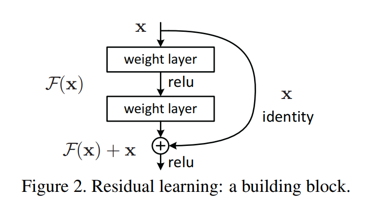
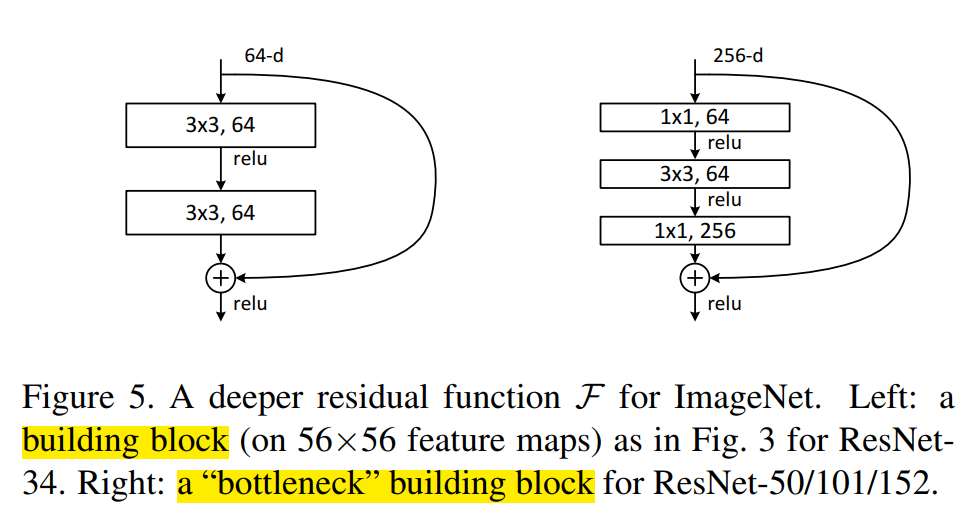
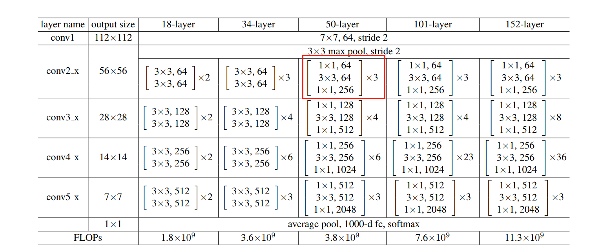

# ResNet

## Glossary
Residual: 残差
obstacle：障碍
intergrated: 集成、积分、整合
notorious: 臭名昭著的
hamper: 阻碍
convergence: 收敛
degradation: 降解、退化
auxiliary: 辅助 
hypothesize: 假设

## Basic
1. $\text{FLOPs} =H_{\text{out}}\times W_{\text{out}}\times C_{\text{in}} \times C_{\text{out}} \times K \times K$ 

## Important points

The **depth** of representations is of central importance for many visual recognition tasks. 

## I. Introduction

### 1.1 
> Deep networks naturally integrate low/mid/highlevel features and classifiers in an end-to-end multilayer fashion, and the “levels” of features can be enriched by the number of stacked layers (depth).

> 深度网络天然以端到端的多层方式整合了低/中/高层特征与分类器，而特征的"层级"可通过堆叠层数（深度）得到丰富。

low/mid/highlevel features: 在图像识别任务中，神经网络的不同层会学习到不同抽象程度的特征。浅层通常**学习边缘、纹理等低级特征**；中间层学习到**部分对象结构**等中级特征；深层则学习到**更抽象、更具语义信息**的高级特征，例如识别出完整的物体。
classifier: 网络的最终层
end-to-end: 意味着整个网络从输入原始数据（如图像）到输出最终结果（如分类标签）是一个**完整的、连续的系统**，中间**无需人工干预或分阶段处理**
随着网络深度的增加，​​特征的“层次”得到丰富​​：网络能够学习到更多样化、更复杂、更抽象的特征表示。**每一层都可以在前一层的基础上提取更高级别的语义信息。**

### 1.2 深度
> Recent evidence [41, 44] reveals that network depth is of crucial importance
> **深度很重要**

### 1.3 归一化解决梯度消失/梯度爆炸
> An obstacle to answering this question was the notorious problem of vanishing/exploding gradients [1, 9] 

> This problem, however, has been largely addressed by normalized initialization [23, 9, 37, 13] and intermediate normalization layers [16], which enable networks with tens of layers to start converging for stochastic gradient descent (SGD) with backpropagation [22]
> 然而，这一问题已通过归一化初始化[23, 9, 37, 13]和中间归一化层[16]得到显著改善。这些技术使得具有数十层的网络能够通过反向传播[22]的随机梯度下降法（SGD）开始收敛。

Normalized Initialization（归一化初始化）：归一化初始化是指在训练神经网络之前，对**网络的权重进行精心设置，使其服从特定的分布（通常是均值为0，方差为特定值的正态分布或均匀分布）**。这样做的目的是确保在网络的前向传播和反向传播过程中，各层激活值的**方差**和**梯度的方差**保持在一个合理的范围内，避免它们**过大或过小**。

**需要精心设置初始化权重，例如：如果权重初始值很大，对于sigmoid这种函数，很容易进入饱和区**

Intermediate Normalization Layers（中间归一化层）：中间归一化层是指在神经网络的**中间层中插入的特殊层**，它们对该层的**输入进行归一化处理**。最著名的例子是**​​Batch Normalization (BN)​**​。

### 1.4 深度增加导致training error上升
> with the network depth increasing, accuracy gets saturated (which might be unsurprising) and then degrades rapidly
> 随着网络深度增加，准确率会达到饱和状态（这或许并不令人意外），**随后迅速下降**。
> 
> The degradation (of training accuracy) indicates that notall systems are similarly easy to optimize. Let us consider a shallower architecture and its deeper counterpart that adds more layers onto it. There exists a solution by constructionto the deeper model: the added layers are identity mapping, and the other layers are copied from thelearned shallower model. The existence of this constructedsolution indicates that a deeper model should produce no highertraining error than its shallower counterpart. Butexperiments show that our current solvers on hand are unable to find solutions that are comparably good or better than the constructed solution
(or unable to do so in feasible time)

- **identity mapping(恒等映射)**
  **定义**：对输入 $x$，identity mapping 就是直接把 $x$ 返回；数学上就是 $y=x$
  **在网络里的意思**：某几层的组合（多层卷积+非线性）如果总体上等价于恒等映射，说明这些层并不改变该特征 —— 它们“什么也没做”，只是把信息原样传递下去。
  
  这一段的意思就是说，我们基于一个shallower的网络构造一个deeper的网络，原始Layer的参数原封不动保留，新增层直接采用identity mapping，这样做的话**按理说至少能够保证training error不会恶化，但是实验结果非也**。

- **solver:**
  一般指用来最小化损失函数、求参数的优化算法。比如说SGD, Adam, RMSprop, 以及具体实现时的learning rate, batch, weight decay, BN等训练细节。

- **为什么solver反而找不到good solution or better solutions?**
  **1. 深网络的参数空间很大**：虽然存在一组参数使新增层等于 identity，但从随机初始化出发，优化路径可能非常难走到那组参数。换句话说：**解在参数空间里可能是存在的“孤立点”或在优化路径上很难到达**
  **2. 多层非线性“近似 identity”很难**：要让一堆 卷积 + ReLU 层整体等于恒等映射，意味着这些层的权重要精确地协调（例如输出每个通道与输入一一对应），这在实践中比 把某些权重直接设为 0（让残差为 0）要困难得多。
  > **层数越高，非线性层越多，对权重协调带来更多困难**

### 1.5 引入ResNet
>  Instead of hoping eachfew stacked layers directly fit a desired underlying mapping, we explicitly let these layers fit a residualmapping. Formally, denoting the desired underlying mapping as $\mathcal{H}(x)$, we let the stacked nonlinearlayers fit another mapping of $\mathcal{F}(x) := \mathcal{H}(x) − x$. The original mapping is recast into F(x)+x
> 我们不期望堆叠的若干层网络直接拟合目标底层映射$H(x)$，而是显式地让这些层拟合残差映射$F(x) := H(x) - x$。原映射可重新表述为$F(x)+x$。

- **underlying mapping(底层映射)**
  在深度网络里，某一段连续的卷积层（比如两个 3×3 conv）执行的总功能其实就是一个大函数映射：$x\rightarrow y$
  residual mapping(残差映射)中，我们不让网络直接学习$\mathcal{H}(x)$，而是学习目标映射 $\mathcal{H}(x)$ 与输入 $x$ 的差值
- **为什么如果最优就是 identity mapping，学习 residual=0 比学习 identity 本身容易”**
  1. **plain 网络（如 VGG 那样）：要逼近 $H(x)=x$ 很难**，这需要多层卷积 + BN + ReLU精确配合，这对参数非常苛刻，优化器很难自动找到这个解（这就是论文说的 degradation 发生的原因）。
  2. **ResNet：只需要让残差 $F(x) \rightarrow 0$**，要实现 identity，只需要把残差的卷积层权重推向 0（梯度最容易做到的事情）

### 1.6 什么是shortcut
这根飞线就是shortcut

具有“shortcut connections(快捷链接)”的“feedforward neuron network(前馈神经网络)”，可以“skip one or more layers(跨越多层)”，本论文中仅执行恒等映射(identity mapping)，**不会引入额外参数，也不会增加计算复杂度**

## II. Part2. Realted Work
### 2.1 Residual Vector
> Residual Representations. In image recognition, VLAD[18] is a representation that encodes by the residual vectors with respect to a dictionary, and Fisher Vector [30] can be formulated as a probabilistic version [18] of VLAD. Both of them are powerful shallow representations for image retrieval and classification [4, 48]. For vector quantization,encoding residual vectors [17] is shown to be more effective than encoding original vectors
> 残差表示。在图像识别领域，VLAD[18]是一种基于字典残差向量编码的特征表示方法，而Fisher Vector[30]可视为其概率化版本[18]。这两种方法均为图像检索与分类任务中强大的浅层表示[4,48]。在矢量量化方面，研究[17]表明对残差向量进行编码比原始向量编码具有更高有效性。

- **Residual Vector and Origin Vector**
  1. 在深度学习时代，**origin vector**可能是 CNN 的某一层特征 patch（512 维）
  2. “CNN某一层特征patch”可以理解为**某一层输出张量中，某一空间位置 (i, j) 上所有通道的值组成的 C 维向量。**
  3. **residual vector**: 当你有一个“字典（dictionary）”或者“聚类中心（cluster center）”时，一个原始向量不直接编码，而是计算它相对于某个中心的差值（residual）：$\mathbf{r}=\mathbf{x}-\mathbf{c}$
  $\mathbf{x}$=原始向量
  $\mathbf{c}$=字典中的一个中心（也叫 visual word、codeword）
  $\mathbf{r}$=residual vector（残差向量）
  这与Residual Network一样，**编码“变化量”比编码“整体映射”更容易。**
  **论文作者想说明：ResNet 的思想不是凭空出现，而是在传统视觉里已经验证过“残差比原始表示更好”。**

- VLAD（Vector of Locally Aggregated Descriptors）
  VLAD 的核心就是：对每个特征 x，找到它最近的中心 c，然后**把“残差向量 (x − c)”累加起来，作为图像的特征。**
  公式（概念性的）：
  
  $$\text{VLAD} = \sum_{x \in \text{image}} (x - c(x))$$
  
  其中 c(x) 是 x 最接近的 cluster center。
  **图像中的所有 x 的残差向量被聚合在一起 → 得到全图的向量表示。**

- **Fisher Vector（FV）**
  Fisher Vector 比 VLAD 再“**概率化**”一点。

  * VLAD 相当于 K-Means 的残差聚合
  * Fisher Vector 是高斯混合模型（GMM）的残差聚合

  论文里说（结合引用18）：

  > Fisher Vector 可以看成 VLAD 的概率版本

  大意是：
  VLAD：硬分配（一个向量只对应一个中心）
  FV：软分配（一个向量对应多个高斯模型的概率）

  但本质相同：
  **FV 也在编码残差，只是更复杂一些。**

## III. Part3. Deep Residual Learning
### 3.1 multiple nonlinear layers sympotically approximate
> If one hypothesizes that multiple nonlinear layers can asymptotically approximate complicated functions2, then it is equivalent to hypothesize that they can asymptotically approximate the residual functions, i.e.,  $\mathcal{H}(x) − x$ (assuming that the input and output are of the same dimensions)
> 
> 如果假设多个非线性层可以渐进逼近复杂函数$^2$，那么这等价于假设它们能够渐进逼近残差函数，即$\mathcal{H}(x)-x$（假设输入与输出维度相同）。

### 3.2 当solver面对恒等映射和零映射
> In real cases, it is unlikely that identity mappings are optimal, but our reformulation may help to precondition theproblem. If the optimal function is closer to an identity mapping than to a zero mapping, it should be easier for the solver to find the perturbations with reference to an identity mapping, than to learn the function as a new one. We showby experiments (Fig. 7) that the learned residual functions in general have small responses, suggesting that identity mappings provide reasonable preconditioning
>
> 在实际应用中，恒等映射虽未必是最优解，但我们的重构方法有助于对问题进行**预处理**。当最优函数更接近恒等映射而非零映射时，相较于从头学习新函数，**求解器以恒等映射为参照来寻找扰动会更为高效**。通过实验数据（图7）我们发现，学习到的残差函数普遍具有较小的响应值，这表明恒等映射提供了有效的预处理条件。

- **precondition(预处理)**
  其实就是$\mathcal{F}(x) = \mathcal{H}(x)=x$
  原因：因为 **大部分卷积块的最优映射并不会大幅偏离 identity**
  >很多 block 只是做微调（refinement），而不是剧烈变化，实验（Fig. 7）也证明 F(x) 的响应值普遍较小 → H(x) 很接近 x

- **什么“更接近 identity 的最优 H(x)，对 solver 来说更容易学习”。**
  理解为：
  真实最优 H(x) 可能是“输入的轻微调整”（例如微细纹理、边缘增强）
  而不是“与 x 完全无关的新特征”（远离零）

### 3.3 写法的疑惑
> We adopt residual learning to every few stacked layers. A building block is shown in Fig. 2. Formally, in this paper we consider a building block defined as:

> $$y = F(x, {W_i}) + x$$

> Here $\mathbf{x}$ and $\mathbf{y}$ are the input and output vectors of the layers considered. The function $F(x; \{W_i\})$ represents the residual mapping to be learned. Forthe example in Fig. 2 that has two layers, $F=W_2\sigma(W_1 x)$ in which $\sigma$ denotes ReLU [29] and the biases are omitted for simplifying notations. The operation $F + x$ is performed by a shortcut connection and element-wise addition. We adopt the second nonlinearity after the addition (i.e., $\sigma(y)$, see Fig. 2)
>
> 我们对每几个堆叠层采用残差学习。图2展示了一个构建模块的示意图。形式上，本文考虑的构建模块定义为：
$y = F(x, {W_i}) + x$
其中$\mathbf{x}$和$\mathbf{y}$分别表示所涉及层的输入和输出向量。函数$F(x; \{W_i\})$代表需要学习的残差映射。以图2所示的两层结构为例，$F = W_2\sigma(W_1x)$，其中$\sigma$表示ReLU激活函数[29]，为简化表达式省略了偏置项。通过快捷连接和逐元素相加实现$F + x$运算。我们在加法操作后采用了第二次非线性变换（即$\sigma(y)$，参见图2）。

- $W_i x$
  并非代表整整意义上的矩阵乘法，实际上还是卷积？
  事实上，在数学上，任何**线性运算都可以抽象成「某个矩阵 × 输入」**，因此用$W_i x$表示卷积**层**运算是合理的。
  而且，输入张量摊平成一个长向量 $x_{\text{flat}}$，然后卷积核展开成一个稀疏大矩阵 $W_{\text{conv}}$，然后进行运算$y = x_{\text{flat}}W_{\text{conv}}$在数学上是严格等价的

- shortcut 的加法要求两边维度严格一致。因此 ResNet 的设计必须保证 F(x) 的输出和 x 有同样的 shape。
  例如当输入/输出通道数改变时，可能出现维度不匹配的情况，**"we can perform a linear projection(线性投影) Ws by the shortcut connections to match the dimensions:"**
  $\mathbf{y} = \mathcal{F}(\mathbf{x};\{W_i\})+W_s \mathbf{x}$

### 3.4 F建立在多个卷积层以及BN, ReLU上
> The form of the residual function F is flexible. Experiments in this paper involve a function F that has two or three layers (Fig. 5), while more layers are possible
>
> 残差函数F的形式具有灵活性。本文实验采用两层或三层的F函数结构（图5），但也可使用更多层数。

- 其中 F(x) 不是“一层卷积”，而是：
  * 一段网络
  * 由多个卷积层（和 BN、ReLU）组成
  * 被归纳为一个函数 F

- 为什么 F(x) 不应该只有一层（single-layer residual block）
  $y = W_1 x + x$
  如果你把多层这样的 block 堆起来：
  $y = W_2(W_1 x + x) + (W_1 x + x)$
  整个网络将趋近于**线性变换的叠加组合**，非线性不足。
  即使有 ReLU，也太弱了。

### 3.5 测试的plain network配置
> Plain Network. Our plain baselines (Fig. 3, middle) are mainly inspired by the philosophy of VGG nets [41] (Fig. 3, left). The convolutional layers mostly have **3×3 filters** and follow two simple design rules: (i) for the same output feature map size, the layers have the **same number of filters**; and (ii) if the feature map size is **halved**, the number of filters is **doubled** so as to preserve the time complexity per layer. **We perform downsampling directly by convolutional layers that have a stride of 2**. The network ends with a global average pooling layer and a 1000-way fully-connected layer with softmax. The total number of weighted layers is 34 in Fig. 3 (middle).
>
> 普通网络架构。我们的基础普通网络（图3中列）主要受到VGG网络[41]设计理念的启发（图3左列）。其卷积层**大多采用3×3滤波器**，并遵循两条简单设计准则：(i) 对于相同尺寸的输出特征图，各层滤波器数量保持一致；(ii) 当特征图尺寸减半时，滤波器数量加倍以确保单层时间复杂度不变。我们通过步长为2的卷积层直接实现下采样。网络末端由全局平均池化层和带softmax的1000维全连接层构成。图3（中列）所示网络总权重层数达34层。

- feature map尺寸减半时，fiter个数加倍
  * 每层的计算量保持在相似规模。
  * 空间分辨率下降 → 应提高“语义维度”：CNN的典型模式是前面基层识别低层局部特征（“边缘”，“角点”），后面基层捕捉高层语义特征（类别、形状信息）。如果只降分辨率而不加通道：容量变弱、语义表达不够强、网络深度越大，越难学习

- **We perform downsampling directly by convolutional layers that have a stride of 2**
  * stride = 2代表fiter每次移动2个pixel，因此 stride=2 卷积天然具有下采样效果。
  * 他们不使用池化，而使用 stride=2 的卷积直接做下采样。

### 3.6 当short connect的input和output的dimension不一致时
>  (B) The projection shortcut in Eqn.(2) is used to match dimensions (done by 1×1 convolutions). For both options, when the shortcuts go across feature maps of two sizes, they are performed with a stride of 2
>
> （B）采用公式(2)的投影快捷连接，通过1×1卷积实现维度匹配。对于这两种方案，当shortcuts跨越两种尺寸的特征图时，均采用步长为2的操作方式。

- **如果y = $\mathcal{F}(x)+x$的$\mathcal{F}(x)$和$x$维度(H, W, C都必须一致)不一致**
  * 变换：$x' = W_s x$
  设置好卷积核$W_s$的$H(=1), W(=1)$, $C_{\text{in}}$(等于输入的通道数)，$C_{\text{out}}$(卷积核个数等于输出的通道数)，以及stride（实现downsampling，对输入的feature map的H, W进行压缩）
  * **For both options, when the shortcuts go across feature maps of two sizes, they are performed with a stride of 2**
  说的其实就是上面对于$\mathbf{x}$的变换，因为正常卷积层通路的H×W变化了，因此$\mathbf{x}$的$H\times W$也必须变化，例如downsampling
  因为 F(x) 下采样了，shortcut 也必须下采样。

### 3.7 训练细节
> Our implementation for ImageNet follows the practice in [21, 41]. The image is resized with its shorter side randomly sampled in [256; 480] for scale augmentation [41]. A 224×224 crop is randomly sampled from an image or its horizontal flip, with the per-pixel mean subtracted [21]. The standard color augmentation in [21] is used. We adopt batch normalization (BN) [16] right after each convolution and before activation, following [16]. We initialize the weights as in [13] and train all plain/residual nets from scratch. We use SGD with a mini-batch size of 256. The learning rate starts from 0.1 and is divided by 10 when the error plateaus, and the models are trained for up to 60 × 104 iterations. We use a weight decay of 0.0001 and a momentum of 0.9. We do not use dropout [14], following the practice in [16]. In testing, for comparison studies we adopt the standard 10-crop testing [21]. For best results, we adopt the fullyconvolutional form as in [41, 13], and average the scores at multiple scales (images are resized such that the shorter side is in f224; 256; 384; 480; 640g).
> 
> 我们在ImageNet上的实现遵循[21,41]中的方法。为进行尺度增强[41]，图像的较短边会随机缩放到[256,480]区间。从图像或其水平翻转版本中随机裁剪出224×224区域，并减去像素均值[21]。采用[21]中标准的色彩增强方法。按照[16]的做法，我们在每个卷积层后、激活函数前立即应用批量归一化(BN)[16]。权重初始化采用[13]的方法，所有普通/残差网络均从头开始训练。使用小批量大小为256的随机梯度下降法(SGD)，初始学习率为0.1，当误差停滞时除以10，模型训练最多达60×10^4次迭代。权重衰减设为0.0001，动量参数为0.9。根据[16]的实践，我们未使用dropout[14]。在测试阶段，对比研究采用标准的10-crop测试[21]；为获得最佳结果，我们采用[41,13]中的全卷积形式，并在多尺度下平均得分（图像缩放使较短边位于{224,256,384,480,640}集合中）。

- **per-pixel mean subtraction**
  ImageNet 训练时，所有图像的像素都会做如下操作：$x' = x - \mu$，其中：
  * \( x \)：原始像素（RGB 三通道）
  * \( \mu \)：训练集的像素均值（针对 R、G、B 三通道分别计算）
  作用：
  * **将像素分布居中到 0 左右**，方便神经网络训练
  * 加快收敛速度
  * 让输入数据更标准化
  在 VGG、ResNet 时期（2014–2015），这种减均值是标准操作。
- **horizontal flip**
  简单数据增强：**50% 概率水平翻转**，这样网络能看到更多变体。
- **standard color augmentation in [21]**
  这指的是 AlexNet 提出的 **PCA Color Augmentation**，具体做法：
  对 ImageNet 的 RGB 像素做 PCA，得到 **3 个主成分方向，对每张训练图像沿这 3 个方向随机扰动颜色**

  > 对颜色做一个随机的旋转/扰动，让图像的颜色更丰富，防止模型只记住某种特定的颜色模式。
- **数据增强**
  是指对训练图像做一些“结构保持但外观变化”的操作，**使模型更加鲁棒，避免过拟合。**
  典型的数据增强包括：

  * 几何增强（geometric augmentation）
    * 随机裁剪（random crop）
    * 随机水平翻转（flip）
    * 随机旋转（rotation）
    * 随机缩放（scale augmentation）
    * 随机平移（translation）

  * 颜色增强（color augmentation）
    * 调整亮度、对比度、饱和度
    * PCA color augmentation（AlexNet）
    * hue jitter、color jitter

- **BN**
  * BN的位置：conv后，ReLU前：conv $\rightarrow$ BN $\rightarrow$ ReLU
  * **深度网络中，每层输入分布不断变化，导致训练难**, BN 让每层的输入都保持“标准化”：
  $x_{norm} = \frac{x - \mu}{\sqrt{\sigma^2 + \epsilon}}$
  * BN可以加快收敛速度（Learning rate更大），防止overfitting（因为增加了噪声）

- **什么叫 “train … from scratch”？还能不从头吗？**
  * 从头开始，即我们不适用预训练权重，随机初始化：即：$W \sim \mathcal{N}(0, \sigma^2)$
  * 不从头开始，叫 **fine-tuning（迁移学习）**，使用 ImageNet 上别人训练好的权重，然后在自己的网络上微调。微调通常比从头训练效果更好、收敛更快、算力需求更低
  
- **weight decay**
  * weight decay 就是 **L2 正则化**。在损失函数中加入：
  $L_{total} = L_{data} + \lambda ||W||^2$
  其中 λ=0.0001。
  * 作用：
    * 防止权重变得太大
    * **降低过拟合**
    * 让模型更平滑、更稳定
  * SGD 更新时：
  $W \leftarrow W - \eta (\frac{\partial L}{\partial W} + \lambda W)$
  其中 $\lambda W$ 就是 weight decay 部分。
  * **为什么weight decay可以防止overfitting？**
  模型越复杂、参数越大，它拟合训练集噪声的能力越强 $\rightarrow$ overfitting。而weight decay惩罚大参数

## IV. Part4. Experimets
### 4.1 ImageNet Classification任务
1. 普通网络（18-layer and 34-layer
plain nets.）在training和validation时达到的效果率低于同深度Residual Network
见图：

2. 普通网络例如18-layer and 34-layer
plain nets，34-layer在训练时，training error反而会大于18-layer，并且作者通过论证**排除了梯度消失的可能性**（因为有BN层）
> These plain networks are trained with BN [16], which ensures forward propagated signals to have non-zero variances. We also verify that the backward propagated gradients exhibit healthy norms with BN

3. Residual Learning在该任务中体现的优势：
   1. **解决了深度增加，training error增大的现象**
   > degradation problem is well addressed in this setting and we manage to obtain accuracy gains from increased depth
   2. ResNet 相比 PlainNet有更好的top-1 error效果，这说明了残差学习在极深网络中的有效性
   > ResNet reduces the top-1 error by 3.5% (Table 2), resulting from the successfully reduced trainingerror (Fig. 4 right vs. left). This comparison verifies the effectiveness of residual learning on extremely deep systems.
   3. ResNet具有更快的收敛速度
   > we also note that the 18-layer plain residual nets are comparably accurate (Table 2), but the 18-layer ResNet converges faster (Fig. 4 right vs. left)

3. 关于shortcut 方式：
   * A: zero-padding for increasing dimensions
   * B: projection for increasing dimensions
   * C: all shortcuts are projection
   * B优于A, C略优于B
    > But the small differences among A/B/C indicate that projection shortcuts are not essential for addressing the degradation problem. **So we do not use option C in the rest of this paper**, to reduce memory/time complexity and model sizes

4. bottleneck block
   * 结构： 1×1 → 3×3 → 1×1 的三层卷积，形成一个中间通道数最小的部分（瓶颈），三个卷积层分别负责降维(reduce channels)，处理低维特征（bottleneck部分），升维(restore channels)
    
    > 左侧：Deeper non-bottleneck ResNets (e.g., Fig. 5 left) also gain accuracy from increased depth (as shown on CIFAR-10), but are not as economical as the bottleneck ResNets.
   * “瓶颈”的意思：
    > **在一个系统中，存在一个最窄、最小容量的部分，这部分限制了系统的整体规模或速度 → 叫“瓶颈”**
   * 为什么叫做瓶颈？因为3×3卷积层的通道数最少“通量”最小——它像瓶颈一样限制了信息通路，是最窄的一层。
   * 为什么使用瓶颈？——降低计算量，因为3×3的卷积层通道被减少了，相当于做如下分解：
      > FLOPs = 256×256×3×3，
    变为了：
    FLOPs = 256×64 + 64×64×3×3 + 64×256
    
    * 降低计算量之后，**就能够构造深度更大的网络**，例如：
      > Remarkably, although the depth is significantly increased, the 152-layer ResNet (11.3 billion FLOPs) still has lower complexity than VGG-16/19 nets (15.3/19.6 billion FLOPs 
      > 
      > 值得注意的是，尽管网络深度显著增加，但152层残差网络（运算量113亿次浮点运算）的复杂度仍低于VGG-16/19网络（运算量分别为153亿/196亿次浮点运算）。

    * 基于bottleneck构建的网络示例：
    

5. **用 zero-padding 对齐维度 C 而不是 projection**，因为 projection shortcut的两端是高维空间，跟做卷积运算的成本非常高。 

### 4.2 CIFAR-10 and Analysis Task
1. **(训练细节)warm up**: 在训练的最开始，用比正常更小的学习率训练一小段时间，等模型稳定后再把学习率调回正常值。
   
   > We further explore n = 18 that leads to a 110-layer ResNet. In this case, we find that the initial learning rate of 0.1 is slightly too large to start converging5. **So we use 0.01 to warm up the training until the training error is below 80% (about 400 iterations), and then go back to 0.1 and continue training**. The rest of the learning schedule is as done previously. This 110-layer network converges well (Fig. 6, middle). It has fewer parameters than other deep and thin networks such as FitNet [35] and Highway [42] (Table 6), yet is among the state-of-the-art results (6.43%, Table 6).

   * 为什么我们需要warm up？原因1：非常深的网络（例如 110 层）刚初始化完时，权重是随机的，输入信号、特征分布、梯度在训练初期都处于非常**混乱**的状态，如果学习率过大（0.1），**一次更新就会太多，“直接把模型带飞，损失不下降甚至发散”**。 原因2：非常深的网络的梯度需要一定时间才能“协调”起来，例如110层网络，各层刚开始根本不“同步”，梯度要经过非常多层传播，贸然使用大更新步长（0.1）非常容易训练失败。
   * 使用warm up可以避免梯度爆炸！

2. **Layer Response** 
   * conv和BN过后的输出矩阵的标准差，越小，代表着：网络主要是在执行 identity mapping（x 本来就差不多正确），说明每层只做小规模修补，这验证了残差学习的核心理论，使深层训练更稳定。
   * Residual Network 的 Layer response 比 Plain Network小，成功实现了残差学习提出的理念动机，如图：
      

3. 问题：虽然1202 layers net相比110 layers net在training error上相近，但是testing error不如110layers，作者猜测可能是：
  > we use no maxout/dropout and just simply impose regularization via deep and thin architectures by design, without distracting from the focus on the difficulties of optimization. But combining with stronger regularization may improve results, which we will study in the future
  >
  > 我们既未采用最大汇聚（maxout）也未使用随机失活（dropout），而是通过精心设计的深层细窄架构自然实现正则化效果，以此避免分散对优化难点的研究焦点。不过结合更强的正则化手段可能会提升效果，这将是我们未来的研究方向。

### 4.3 Object Detection on PASCAL and MS COCO Task
* 成功证明了residual 网络泛化能力良好
  > Most remarkably, on the challenging COCO dataset we obtain a 6.0% increase in COCO’s standard metric (mAP@[.5, .95]), which is a 28% relative improvement. This gain is solely due to the learned representations.

