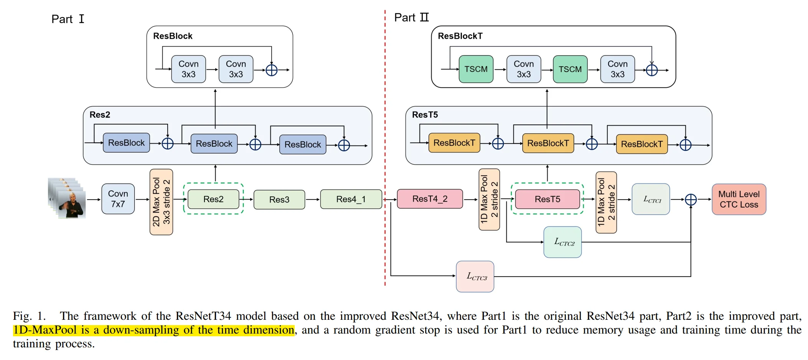
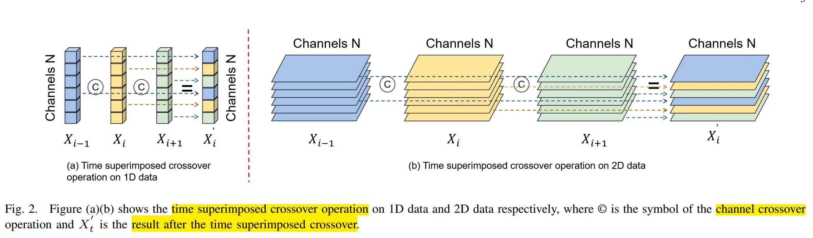
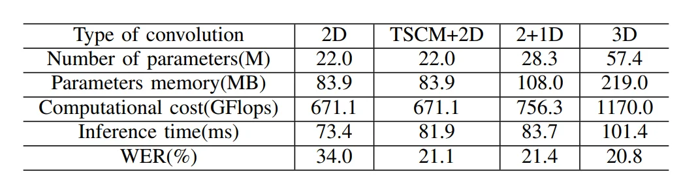

# Temporal Superimposed Crossover Module for Effective Continuous Sign Language

> essay: https://arxiv.org/pdf/2211.03387.pdf

## I. Core Idea

1. Temporal Superimposed Crossover Module (**TSMC**): zero parameter, zero computation.
2. TSMC + 2D Conv: combines it with 2D convolution to form a "**TSCM+2D convolution**" hybrid convolution, strong spatial-temporal modelling capability.
3. The hybrid convolution of ”TSCM+2D convolution” is applied to the ResBlock of the ResNet network to form the new **ResBlockT**.
4. random gradient stop and multilevel CTC loss

## II. Relative Work

VSLR is the translation of continuous sign language videos into comprehensible written phrases or spoken words. While traditional methods usually extract manual features and then **combine them with HMM[6][18] or dynamic time warping (DTW)[19] methods**, the rise of **CNNs** has replaced the **extraction of manual features**.

## III. METHODOLOGY

### 3.1 TSCM

#### 3.1.1 Temporal Superposition 的计算方法

**(1) Channel Dilation and Conv** 
use a 1D convolution with a convolution kernel of size 1, an input channel number that is expanded by a factor of n (n is the number of superimposed data), and an output channel number that remains the same as the channel number of the original data Xi 

Kernel: $W = [\omega_1, \omega_2, \omega_3]$ (Concat in the channel dimension)

$$Y_{i}^{\prime} = \omega_{1}X_{i-1} + \omega_{2}X_{i} + \omega_{3}X_{i+1}$$

$X_{i}$ shape: $(C, H, W)$, $\omega_{i}$ is a scalar, and $Y_{i}^{\prime}$ shape: $(C, H, W)$.

上述操作直接等效于先把三个张量在通道维度上 concat，然后再进行一个卷积核大小为1的卷积操作，**卷积核的输入通道数是原来数据通道数的3倍，输出通道数与原来数据通道数相同**。

**Defect:** It will cause a sharp increase in the amount of calculation and parameters.

**(2) Channel Partial Stacking**

三个张量，每一个选出 $C/n$ 个通道进行拼接，得到一个新的张量 $Y_{i}^{\prime}$，其 shape 仍然是 $(C, H, W)$。

#### 3.1.2 Channel Crossover

在 concat 的时候采用梳状排列，即：

$X_{i-1} = [x_{1}^{i-1}, x_2^{i-1}, \ldots, x_{N}^{i-1}]$
$X_{i} = [x_{1}^{i}, x_2^{i}, \ldots, x_{N}^{i}]$
$X_{i+1} = [x_{1}^{i+1}, x_2^{i+1}, \ldots, x_{N}^{i+1}]$

$\Rightarrow$

$X_{i}^{\prime} = [x_{1}^{i-1}, x_2^{i}, x_{3}^{i+1}, \cdots x_{N-2}^{i-1}, x_{N-1}^{i}, x_{N}^{i+1}]$

然后再做 $1 \times 1$ 卷积

#### 3.1.3 TSCM Example

假设输入张量维度为 $5 \times 6 \times 1 \times 1$（$T=5, C=6$），每一帧的原始通道特征表示为：

*   **$X_1$**: $[x^1_1, x^1_2, x^1_3, x^1_4, x^1_5, x^1_6]$
*   **$X_2$**: $[x^2_1, x^2_2, x^2_3, x^2_4, x^2_5, x^2_6]$
*   **$X_3$**: $[x^3_1, x^3_2, x^3_3, x^3_4, x^3_5, x^3_6]$
*   **$X_4$**: $[x^4_1, x^4_2, x^4_3, x^4_4, x^4_5, x^4_6]$
*   **$X_5$**: $[x^5_1, x^5_2, x^5_3, x^5_4, x^5_5, x^5_6]$

按照论文中 **1/3 通道比例** 进行**梳状交叉混合**（Comb-like crossover）的最优配置，TSCM 处理后的输出序列 $X'$ 如下：

### 1. 中间帧的处理（以第 3 帧 $X'_3$ 为例）
对于中间帧，它会同时吸收前一帧（$X_2$）和后一帧（$X_4$）的信息。

*   **通道 1, 4**：替换为 $X_2$ 的对应通道。
*   **通道 2, 5**：保留 $X_3$ 的原始通道。
*   **通道 3, 6**：替换为 $X_4$ 的对应通道。

**$X'_3$ 的最终形式：**

$$[x^1_2, \mathbf{x^2_3}, x^3_4, x^1_4, \mathbf{x^2_5}, x^3_6]$$

### 2. 整个序列 $T=5$ 的变化预览
通过这种**位移与交叉**操作，整个序列在通道层面发生了如下“演变”：

| 时间步 | 经过 TSCM 处理后的通道构成 (由哪一帧提供) | 物理意义 |
| :--- | :--- | :--- |
| **$X'_1$** | $[0, X_1, X_2, 0, X_1, X_2]$ (边界补零) | 仅能感知当前与未来 |
| **$X'_2$** | $[X_1, X_2, X_3, X_1, X_2, X_3]$ | **感知过去、现在与未来** |
| **$X'_3$** | $[X_2, X_3, X_4, X_2, X_3, X_4]$ | **感知过去、现在与未来** |
| **$X'_4$** | $[X_3, X_4, X_5, X_3, X_4, X_5]$ | **感知过去、现在与未来** |
| **$X'_5$** | $[X_4, X_5, 0, X_4, X_5, 0]$ (边界补零) | 仅能感知过去与当前 |

## IV. Effect

#### 4.1 Accuary
1. **RWTH:** As can be seen in Table I, the model proposed in this paper achieves highly competitive result on the RWTH compared to other state-of-the-art models, with a WER of 21.1% on both the validation and test sets. 
2. **CSL:** Table II shows that the proposed model also achieves competitive result on the CSL, with a WER of 26.4% on the test set.

#### 4.2 Model Size

TSCM 参数量为 80 MB 左右，远超于 A1 NPU 支持的 10MB 不可用
此外，TSCM 的输入模态是 RGB 视频，也无法直接应用到我们的系统

## V. 可以借鉴的点

1. Channel Crossover: 通过梳状排列的方式进行通道交叉混合，增强了**模型对时序信息的感知能力**。
2. Multilevel CTC Loss: 在**不同层次上引入 CTC 损失**，促进模型在不同抽象层次上学习更有效的特征表示。