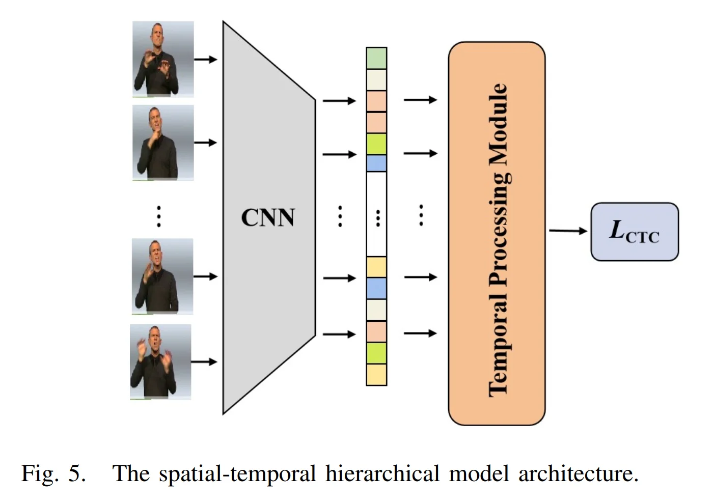
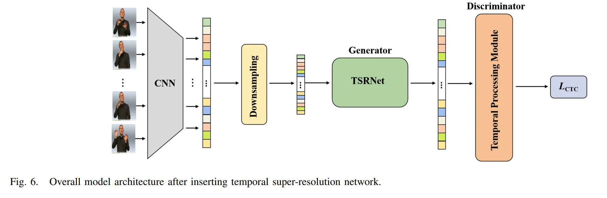
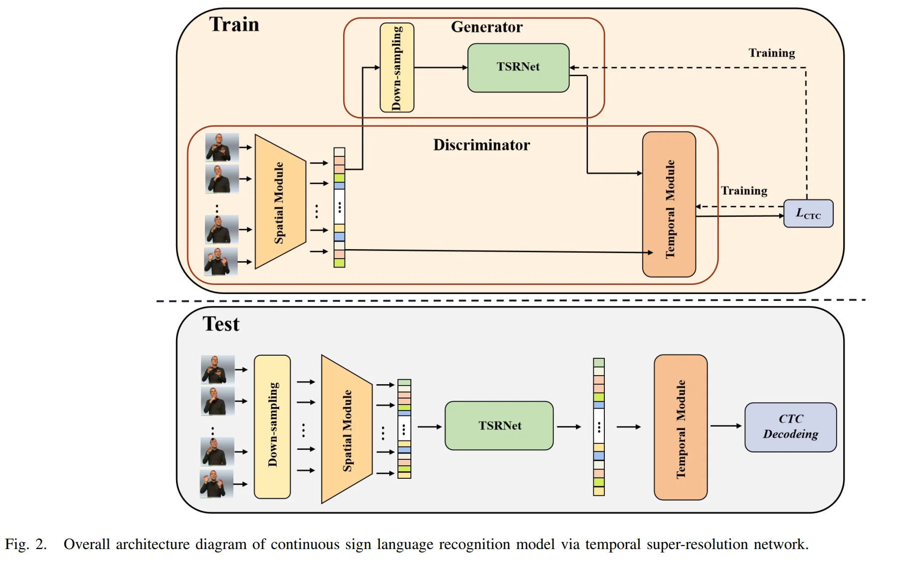
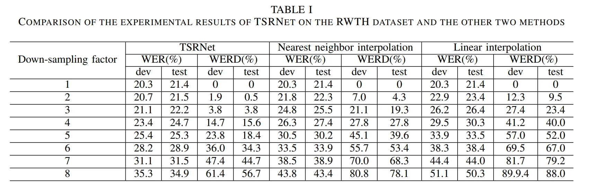
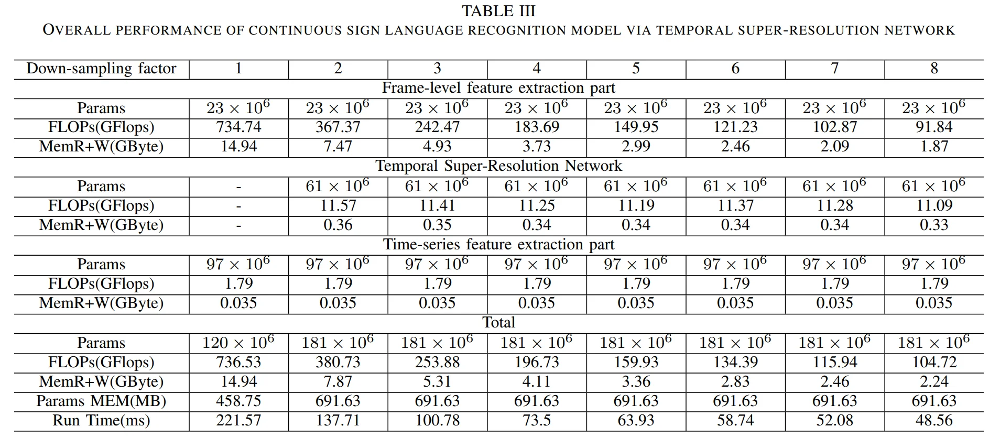

# Continuous Sign Language Recognition viaTemporal Super-Resolution Network

> essay: https://arxiv.org/pdf/2207.00928.pdf
> 
## I. Introduction

### 1.1 Core Idea
1. data is reconstructed into a **dense feature sequence**
2. three parts: **frame-level** feature extraction, **time-series** feature extraction and **TSRNet**,
3. model is trained with the **self-generating adversarial training method**
4. The training method regards the **TSRNet as the generator**, and the **frame-level** processing part and the **temporal** processing part as the **discriminator**. 
5. proposes **word error rate deviation(WERD, 词错误率偏差)**, which takes the error rate between the estimated word error rate (WER) and the reference WER obtained by the reconstructed frame-level feature sequence and the complete original frame-level feature sequence as the WERD. 

### 1.2 Core Idea

We found that:
1) The images between adjacent frames have **high similarity in content**, as shown in Figure 1, after feature extraction of frame-level images, adjacent feature vectors in the generated autocorrelation matrix have high similarity. 
2) In the spatial-temporal hierarchical model, **most of the computation of the model is concentrated on the extraction of video frame-level features**, and the feature information extraction for each frame of the video is **independent of each other**. 
Therefore, this paper reduces the computational complexity of the model by **reconstructing the sparse data into dense feature sequences** while keeping the original spatial-temporal hierarchical model unchanged.

## II. Methodology

### 2.1 Temporal Super-Resolution Network

Frame-level feature extraction + TSRNet + time-series feature extraction

#### (1) Frame-level feature extractions

$V = (x_1, x_2, ..., x_T) = \{x_{t}|_{1}^{T}\in R^{T\times c\times h\times w}\}$ 

containing $T$ frame, where $x_t$ is the $t$-th frame image in the video, $h \times w$ is the size of $x_t$, and $c$ is the number of channels. 

$f_1 = F_s(V) \in R^{T\times c_1}$

$F_s$ is the frame-level feature extraction module. $c_1$ is the number of channels after feature extraction

$f_1$ is **dense feature sequence**, then: 

#### (2) Down sample

$f_1$ is down-sampled by $n$ times to obtain a sparse frame-level feature sequence, and then the time dimension and the channel dimension are exchanged to obtain the feature sequence $f_2 \in R^{c_1 \times T_1}$, where $T_1 = T/n$.

$f_2$ is the **sparse feature sequence**, the **input** of the TSRNet.

#### (3) TSRNet

**(1) In the detail descriptor branch**
$f_3 = F_{1DCNN-ReLU}(f_2) \in R^{c_2 \times T_1}$

$f_{3}^{\prime} = F_{Res_{m}}(f_3) \in R^{c_2 \times T_1}$

$m$ is the number of 1D-Resblocks

then upsample n times

$f_4 = F_{Upsample}(f_{3}^{\prime}) \in R^{c_3 \times T}$

$c_3$ is the number of channels after the up-dimension, $T$ is the original video frame length.

then:

$f_{4}^{\prime} = F_{Res_{k}}(f_{4}) \in R^{c_3 \times T}$

then subjected to a 1D-CNN for dimensionality reduction, so that the number of channels is restored to be consistent with the input feature sequence, and then batch normalizationis performed to obtain a dense feature sequence:

$f_5 = BN(1D-CNN(f_{4}^{\prime}))\in R^{c_1 \times T}$

**(2) In the rough descriptor branch**
only the nearest neighbor interpolation Fnearest is used for the sparse feature sequence f2 to up-sample n times in the time dimension:

$f_{2}^{\prime} = F_{nearest}(f_2) \in R^{c_1 \times T}$

**(3) Fusion**
Finally, the **dense feature sequences** $f_2^{\prime}$ and $f_5$ obtained by the two branches are fused, and the final output dense feature sequence is **obtained through the activation function**

$f_{Result} = \sigma(f_{2}^{\prime} + f_5)$

**(4) Appendix**

**1D-Resblock** This paper introduces the ResBlock structure into our model. Because we deal with 1D temporal data, we use 1D depth-wise convolution in 1D-Resblock

$y = \sigma(F_d(x) + x)$

### 2.2 Connectionist Temporal Classification

the label of each frame is: 
$\pi = (\pi_1, \pi_2, ..., \pi_T)$, where $\pi_t \in \text{vocab}\cup \{-\}$
the posterior probability of the label is:
$p(\pi | V) = \prod_{t=1}^{T} p(\pi_t | V)$
the sum of the occurrence probabilities of all corresponding paths:
$p(s|V) = \sum_{\pi \in B^{-1}(s)} p(\pi | V)$
where:
$B^{-1}(s) = \{ \pi | B(\pi) = s \}$

### 2.3 Traning Method: GAN 
本文提出的TSRNet属于超分辨率模型。超分辨率模型常用的训练方法是采用L1损失或L2损失作为损失函数，这类函数通过判断**估计值与参考值之间的距离**来反映估计值的准确性，其考量的是单一数据层面的差距[37][38]。然而，本文旨在重构特征向量。若仅考虑数据间的差距，结果必然难以令人满意。因为**每个特征向量都是一个整体，它代表了集成的高维信息，且经过多次特征提取后其数值可能变得极小**，因此此时需要考虑向量之间的相似性。
本文借鉴了生成对抗网络（GAN）[39]的训练方法，将其应用于我们的模型训练中，并提出了一种自**生成对抗训练方法来训练时序超分辨率网络，这显著提高了最终的误差率**。下面将详细描述自生成对抗训练方法的训练和测试过程。

During the training process, we use the selfgenerating adversarial training method to train the temporal super-resolution network. We consider the **temporal superresolution network as the generator** and the **spatial-temporal hierarchical model as the discriminator**. 

首先，将原始手语视频输入时空分层模型的帧级特征提取部分，获取**frame-level feature sequence**，并将**down-sampled data**作为时序超分辨率网络的输入来训练网络。训练分为两个步骤：第一步是训练时空分层模型，第二步是训练TSRNet。

第一步：训练时空分层模型，如图5所示。原始手语视频数据作为CNN的输入以**提取帧级特征**，随后通过时序处理模块获得**处理后的时序特征**。最后，以标注的**labled video-level phrases** 作为标签，使用**CTC Loss** 进行训练，并将最终得到的模型用作判别器。

第二步：训练TSRNet，如图6所示。首先，**将TSRNet插入时空分层模型的 frame-level feature extractor 与 temporal feature extractor 之间**，**冻结第一步中训练好的时空分层模型参数**，仅训练TSRNet的参数。随后，以原始手语视频作为输入，通过时空分层模型的帧级特征提取部分获取帧级特征序列，并根据设定的下采样倍数对该序列进行稀疏化处理。接着，将稀疏化的**帧级特征序列输入时序超分辨率网络进行重建**，得到**重建后的密集帧级特征序列**。最后，将该序列输入时空分层模型的时间序列处理部分，获得最终的时间序列特征，并依据**短语标注使用CTC损失进行训练**。

### 2.4 Testing Process
测试阶段：与训练阶段的不同之处在于下采样的位置。首先，将**输入视频数据直接进行下采样以获得稀疏视频数据**，并将其输入时空分层模型的**frame-level feature extractor**，从而获取帧级特征。接着，通过TSRNet进行重建，得到密集的帧级特征序列。随后，将生成的密集帧级特征序列输入时空分层模型的**temporal feature extractor**。最后，针对所得到的时间序列特征，通过CTC解码获得最终的识别结果，如图2中测试部分所示。

### III. Performance

#### 3.1 Accuracy
基本在 20~30% 左右

#### 3.2 Model size and latency
大小介于 400~700MB，算力要求 100~700 GFLOPS 

