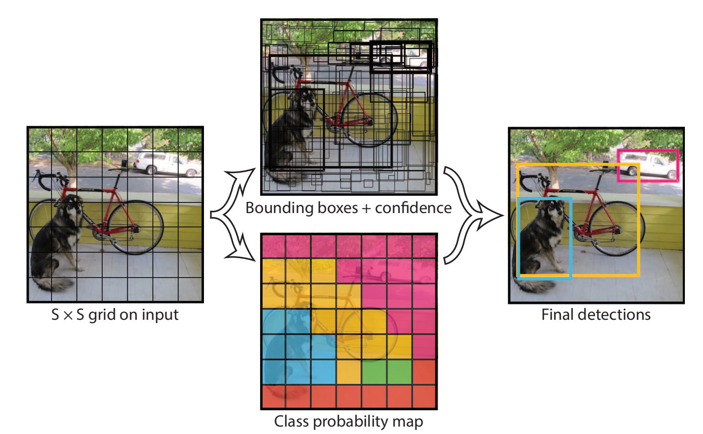

# YOLO(You Only Look Once)

## Ques
1. Abstract: A single convolutional network simultaneously predicts multiple bounding boxes and class probabilities for those boxes.

## Abstract

**MAP**: 平均精度

## I. Instruction

> Current detection systems repurpose classifiers to perform detection. To detect an object, these systems take a classifier for that object and evaluate it at various locations and scales in a test image. Systems like deformable parts models (DPM) use a sliding window approach where the classifier is run at evenly spaced locations over the entire image [10].

### 1.1 之前的检测系统是如何进行目标检测的？
- classifier：利用分类网络
- 核心思想：检测 ≈ “局部分类”
  - 旧方法的基本假设是：如果一个目标出现在图像中，那么它一定**完整地落在某个“局部区域”里**
  - 于是检测被转化为：对图像的**很多子区域做分类，看哪些区域“像目标”**
  - 方法就是：改变尺度+改变位置，笛卡尔积
  - 但是显而易见，**计算量爆炸**
- DP也是，**滑窗+局部分类/打分**

### 1.2. R-CNN 是怎么做的？
- Step1. Region Proposal（候选区域生成）
  - R-CNN 不直接滑窗，而是先用：Selective Search 来生成大约 2000 个候选框（region proposals），这一步是传统CV算法

- Step2. 对每个 proposal 做“分类”
  - 分类器在局部区域上运行，因此**R-CNN 仍然是 classifier-based detection**

- Step3. Bounding Box Regression（位置微调）
  1. R-CNN 发现一个问题：proposal 的框：大致对，但不够精确。
  2. 所以：对每个 proposal再训练一个 **回归器**，去微调 (x, y, w, h)
  3. 这一步 **是单独训练的线性回归器**

- Step4. Post-processing（后处理）
  After classification, post-processing is used to refine the bounding boxes, eliminate duplicate detections, and rescore the boxes based on other objects in the scene [13]
  包括：
    - **Non-Maximum Suppression (NMS)**：去掉重叠度高的重复检测
    - 可能还包括：
      * 分数重标定
      * 类别间上下文调整
  
- 问题：
  1. **多阶段，彼此割裂，每一个都是独立组件**
     1. Selective Search（不可学习）
     2. CNN 分类（单独训练）
     3. SVM（另一个训练过程）
     4. Bounding box regression（再一个模型）
     5. NMS（规则）
  2. **无法端到端训练**
    无法做到：
    > “我最后检测效果不好 →
    > 直接反向传播到最前面去改特征”
    因为：proposal 不是网络产生的、后处理是手工规则
  3. **速度慢**

R-CNN 本质上还是 classifier 过程，只是滑窗个数减少了，还是有多次“看”这张图。但是YOLO解决了这个问题，这就是为什么叫做：You Only Look Once.


### 1.3. YOLO 的优势与劣势
#### 优势
- 速度快
- 看整张图片，背景识别的错误较少
- 可以学到物体的泛化特征

#### 劣势
YOLO still lags behind state-of-the-art detection systems in accuracy. While it can quickly identify objects in images it struggles to precisely localize some objects, especially small ones. We examine these tradeoffs further in our experiments
定位的准确性不高，虽然能够快速识别图像中的物体


## II. Network Design

### 2.1 grid cell——中心点归属原则
Our system divides the input image into an S × S grid. If the center of an object falls into a grid cell, that grid cell is responsible for detecting that object.
> 我们的系统将输入图像划分为S×S的网格（grid）。若某个物体的中心落入某个网格单元（grid cell），则该网格单元负责检测该物体。

1. grid cell 的划分与 GT 框的大小、位置无关，只和输入分辨率有关。例如输入图片是448×448，我们选择S=7（7行7列的网格划分），那么每一个网格的像素尺寸就是64×64
2. 限定一个 GT 框由一个 grid cell 负责，**一个grid cell最多负责一个 GT 框**
3. grid cell 与 GT 框的大小没有固定关系
   1. 对于大 GT 框，可能横跨多个 grid cell，那么就由 GT 框的中心点所在的 grid cell 负责
   2. 对于小 GT 框，尺寸相近，就由该 grid cell 负责
   3. 对于极小、密集的 GT 框，**多个 GT 框可能落在同一个grid cell内**，这种情况下无法处理


### 2.2 grid cell, predictor and bounding box
Each grid cell predicts B bounding boxes and confidence scores for those boxes. These confidence scores reflect how confident the model is that the box contains an object and also how accurate it thinks the box is that it predicts. Formally we define confidence as $Pr(\text{Object}) * IOU^{\text{truth}}_{\text{pred}}$. If no object exists in that cell, the confidence scores should be zero. Otherwise we want the confidence score to equal the intersection over union (IOU) between the predicted box and the ground truth

#### 2.2.1 先理解什么是confidence
\[
\text{confidence}=\underbrace{Pr(\text{Object})}_{\text{有没有物体}}
\times
\underbrace{IOU^{truth}_{pred}}_{\text{框得准不准}}
\]

**Example**


1️⃣ 情况 A：有物体，但框很烂

* 预测框：

  * 的确覆盖了一个真实物体
  * 但位置偏移很大、尺寸很不准

这时：

* Pr(Object) ≈ 1
* IOU ≈ 0.2

👉 confidence ≈ 0.2

**语义解释**：

> “这里确实有物体，但我框得不太行”

2️⃣ 情况 B：框很漂亮，但目标根本不存在

* 预测框：

  * 看起来是一个“很合理”的矩形
  * 但这个区域**压根没有真实物体**

这时：

* Pr(Object) = 0
* IOU（没有定义 / 视为 0）

👉 confidence = 0

**语义解释**：

> “即使这个框形状再好，只要没有物体，就一票否决”

3️⃣ 情况 C：既有物体，又框得很准（理想情况）

* Pr(Object) ≈ 1
* IOU ≈ 1

👉 confidence ≈ 1


4️⃣ 情况 D：背景区域乱框

* Pr(Object) ≈ 0
* IOU ≈ 0

👉 confidence ≈ 0

**符号定义**

1️⃣ Pr(Object)

* 表示：

  > **当前这个 bounding box 对应的位置，是否存在一个真实目标**

在 YOLO v1 中：

* 如果该 grid cell 负责某个 GT box：

  * Pr(Object) = 1
* 否则：

  * Pr(Object) = 0

⚠️ 注意：
这不是概率意义上的 soft label，而是**训练目标的定义**。


2️⃣ $\text{IOU}^{truth}_{pred}$

\[
\text{IOU} = \frac{\text{Area of Intersection}}{\text{Area of Union}}
\]

* 衡量预测框和真实框的重合程度
* ∈ [0, 1]

---

#### 2.2.2 grid cell 与 predictor 与 bounding box
1. 一个grid cell 包含$B$个predictor，或者说预测$B$个bounding box，B 个 bounding box 没有固定形状和位置$(x,y,w,h)$，这些参数完全是由网络通过**回归**学习出来
2. grid cell 只负责预测，不限制 bounding box 的空间范围。bounding box 可以跨越任意多个 grid cell，但在 YOLO v1 中，一个物体永远只由其中心点所在的那个 grid cell 负责预测。所以这就有个问题：
  - 小物体：很容易**多个中心点落同一个 cell → 冲突**
  - 大物体：只由一个 cell 预测 → **定位压力极大**
3. 每个 predictor 的 confidence 定义中的 Object 指的是“**是否存在一个由当前 grid cell 负责的真实物体**”。并且：
  - 如果当前 grid cell 没有被分配 GT box，那别玩了，全部 predictor 的 Pr 都是0
  - 如果当前 grid cell 被分配了 GT box，那么：
    1. 只有 IOU 最大的那个 box predictor：Pr(Object) = 1
    2. 其余 B-1 个 box predictor: Pr(Object) = 0

**重要理解：B-1个 Pr=0 的详细解释以及意义**
> 在“当前这个 cell 被分配到一个 GT 物体”的前提下，
该 cell 内的 B 个 box predictor 都“尝试(attempt)”去预测这个 GT，但在**每一次前向**中，只有 IOU 最大的那个 predictor 会被选为“负责该 GT”的 predictor **并接收完整监督信号**。在不同样本、不同训练阶段，这个“赢家”可能会变化。
> 👉 “尝试（attempt）”而不是“都在预测”
> 只有 winner predictor回归坐标，其他 predictor在这一轮中被当作背景

**疑惑1：每个 cell 的 B 个 predictor 是不是只会预测当前 cell 对应的 GT？**
> 是的，在 YOLO v1 中，一个 cell 的 B 个 predictor 只可能对“这个 cell 被分配的 GT”负责，绝不会跨 cell 预测其他 GT。

**疑惑2：一个 S×S 网格，是不是有 S×S×B 个 predictor？**
> 是的，严格来说就是 S × S × B 个 bounding box predictor。


#### 2.2.3 $Pr(Class_i|Object) \times Pr(Object) \times IOU^{truth}_{pred} = Pr(Class_i) \times IOU^{truth}_{pred}$
1. class 是什么？
   1. 这里的 **class** 指的是：**目标检测数据集中的“语义类别”**
   2. 如果数据集有 **C 个类别**，那么：
      **每个 grid cell 会输出**：
      \[
      Pr(Class_1|Object), \dots, Pr(Class_C|Object)
      \]
      即：**cell 会计算出 C 中每个类别 class i 的条件概率**
2. 为什么是条件概率？
   1. 作者明确说的是：**Pr(Class_i | Object)**而不是**Pr(Class_i)**。原因是：**YOLO 把“有没有物体”和“物体是什么类别”这两件事拆开了**。
   2. 换句话说：这个概率回答的不是：“**这个区域是某一类的概率**”，而是：“**如果这里确实有一个物体，它是 Class_i 的概率**”
3. class是grid cell级的，不是box级的
   1. box predictor 不负责“这是猫还是狗”
   1. box predictor 只负责：“我是不是一个好框”
4. `Pr(Class_i | Object)` 是指：**在当前 grid cell 确实存在一个由它负责的物体的前提下，该物体属于第 i 类的概率。**

**总结：**

$$\boxed{\text{Pr(Class i|Object)}} \times \boxed{\text{Pr(Object)} × \text{IOU}^{\text{truth}}_{\text{pred}}} = \text{Pr(Class i)} × \text{IOU}^{\text{truth}}_{\text{pred}}$$

grid cell负责：$\boxed{\text{Pr(\text{Class i|Object})}}$，如果这里有一个物体，那么它属于类别Class i的概率
bounding box负责：$\boxed{\text{Pr(Object)} \times \text{IOU}^{\text{truth}}_{\text{pred}}}$，这里有没有物体？有物体的话，我框得准不准？
> which gives us class-specific confidence scores for each box. These scores encode both the probability of that class appearing in the box and how well the predicted box fits the **object**(指的就是cell对应的GT框).
> 由此得到每个边界框的类别特定置信度分数。这些分数既反映了该类别出现在框内的概率，也体现了预测框与**物体**的匹配程度。

### 2.3 Model 
> Our system models detection as a regression problem. It divides the image into an S × S grid and for each grid cell predicts B bounding boxes, confidence for those boxes, and C class probabilities. These predictions are encoded as an S × S × (B ∗ 5 + C) tensor.
> 模型架构。我们的系统将目标检测建模为一个回归问题。该方法将图像划分为S×S的网格单元，每个网格单元预测B个边界框、对应框的置信度以及**C个类别概率**。这些**预测结果被编码为一个S×S×(B∗5 + C)维的张量**。


### 2.4 $1 \times 1$ reduction layer
> Our network has 24 convolutional layers followed by 2 fully connected layers. Instead of the inception modules used by GoogLeNet, we **simply use 1 × 1 reduction layers followed by 3 × 3 convolutional layers**, similar to Lin et al [22]. The full network is shown in Figure 3

1. 这里的$1 \times 1$ reduction layer也是卷积层，是用来降低维度的，但是不是spatial downsampling（借助stride），而是channel-wise reduction（降通道数）
2. 为什么不要spatial downsampling？
   1. YOLO v1 的 backbone 需要：**尽量保持空间分辨率**。因为后面要做 **grid-based detection**
   2. 如果随便用 stride=2：grid 会变粗，小目标直接没了
3. **思考，那为什么Maxpool里面仍然保留了stride=2压缩H×W空间呢？**

## III. Train

### 3.1 一些训练细节
> Detection often requires fine-grained visual information so we increase the input resolution of the network from 224 × 224 to 448 × 448

> Our final layer predicts both class probabilities and bounding box coordinates. 
> W, H: 要除以图片的宽度和高度做归一化，使其值落在[0,1]。
> x, y: 将其参数化为特定网格单元位置的偏移量，使其值落在[0,1]。

### 3.2 优化目标与Loss函数
#### 3.2.1 Confidence Loss
> We optimize for sum-squared error in the output of our model. We use sum-squared error because it is easy to optimize, however it does not perfectly align with our goal of maximizing average precision. **It weights localization error equally with classification error which may not be ideal**. Also, in every image many grid cells do not contain any object. This pushes the “confidence” scores of those cells towards zero, often overpowering the gradient from cells that do contain objects. This can lead to model instability, causing training to diverge early on.
> 我们针对模型输出的误差平方和进行优化。选择误差平方和作为优化目标是因为其易于处理，但这一指标与我们的核心目标——最大化平均精度（average precision）并未完全契合。该优化方式将定位误差与分类误差置于同等权重，这可能并非最优方案。此外，每幅图像中大量网格单元并不包含任何目标物体，这会导致这些单元的"置信度"分数被压制至接近零值，其梯度往往压倒性覆盖了含物体单元的梯度信号。此种情况可能引发模型不稳定，导致训练过程在早期阶段就出现发散现象。

这里不得不提及一下Confidence Loss函数的计算与前向传播和反向传播的流程：

1. $\text{Confidence Loss} = \sum{(c_{\text{pred}}-c_{\text{gt}})^2}$，其中：
2. $c_{\text{pred}}$：是网络前向传播输出的某一个 bounding box predictor 对“这个 box 的置信度”的预测值。
   1. 也就是论文中说的：
  \[
  \boxed{\text{Pr(Object)} \times IOU^{\text{truth}}_{\text{pred}}}
  \]
   2. 图片中的每一个 grid cell，每个 grid cell 中的每一个 bounding box predictor，都会有一个自己的$c_{\text{pred}}$分数，**但是一张图片中可能只有几个grid cell有GT对应，也就是说可能一张图片中只有几个bounding box predictor的$c_{\text{pred}}$分数不为0，其余都等于0** 
3. $c_{\text{gt}}$：是训练时人为构造的“这个 box predictor 应该预测的正确置信度”。它不是网络算出来的，而是：
   1. 由 **GT 框 + IOU 规则 + 责任分配规则**决定的
   2. 当前 grid cell 没有被分配 GT，那玩完了，全体bounding box predictor的$c_{\text{gt}}$都为0
   3. 当前 grid cell 有一个 GT box：
      1. 计算出该 cell 内的所有 B 个 bounding box **与 GT 的 IOU**
      2. 找到$IOU$最大的那个 bounding box
      3. 设定：
      * 该 predictor：
        \[
        c_{\text{gt}} = IOU^{\text{pred box}}_{\text{GT box}}
        \]
      * 其余 predictor：
        \[
        c_{\text{gt}} = 0
        \]

因为空白bounding box太多了，所以它们的confidence下降对于Loss值的降低是非常明显的，导致真正的目标 box 在 梯度合成中 发挥的作用不明显，也就是说所即便模型没有很好地提高目标 box 的 confidence，只要它成功地把大量 no-object box 的 confidence 压低，总 loss 仍然可以持续下降。
> 之前误以为 \(x,y,w,h\) 是直接被优化的自变量，但实际上真正被优化的是共享的卷积核和全连接层参数；\(x,y,w,h,c\) 只是这些参数在不同 grid cell 和 predictor 上的输出。由于 no-object box 数量巨大，它们在 confidence loss 上产生的大量梯度会共同作用于同一套网络参数，从而主导参数更新方向，使得网络更倾向于压低整体 confidence，而不是优先提升 object box 的 confidence。


#### 3.2.2 两个权重
> To remedy this, we increase the loss from bounding box coordinate predictions and decrease the loss from confidence predictions for boxes that don’t contain objects. We use two parameters, $λ_{coord}$ and $λ_{noobj}$ to accomplish this. We set $λ_{coord}$ = 5 and $λ_{noobj}$ = .5.
> 对于不包含物体的预测框，增加其边界框坐标预测的损失权重，同时降低confidence预测的损失权重

#### 3.2.3 Loss函数的优化
> Our error metric should reflect that small deviations in large boxes matter less than in small boxes.To partially address this we predict the square root of the bounding box width and height instead of the width and height directly.

因为$y=\sqrt{w} \rightarrow dy = \frac{1}{2\sqrt{w}}dw$，当$w$比较大时，$\Delta w$对$y$造成的影响小于同等程度的$\Delta w$与小$w$

#### 3.2.4 bounding box的责任分工
> We assign one predictor to be “responsible” for predicting an object based on which prediction has the highest current IOU with the ground truth. This leads to specialization between the bounding box predictors. Each predictor gets better at predicting certain sizes, aspect ratios, or classes of object, improving overall recall
> 我们指定一个预测器作为"主预测器"来预测目标物体，其选择标准是该预测器当前与真实标注框的交并比(IOU)最高。这种机制促使不同边界框预测器形成专业化分工：每个预测器会逐渐擅长预测特定尺寸、宽高比或类别的物体，从而整体提升召回率。

#### 3.2.5 完整的Loss函数
loss function:

$\lambda_{\text{coord}} \sum_{i=0}^{S^2} \sum_{j=0}^{B} \mathbb{1}_{ij}^{\text{obj}} \left[ (x_i - \hat{x}_i)^2 + (y_i - \hat{y}_i)^2 \right]$

$+ \lambda_{\text{coord}} \sum_{i=0}^{S^2} \sum_{j=0}^{B} \mathbb{1}_{ij}^{\text{obj}} \left[ (\sqrt{w_i} - \sqrt{\hat{w}_i})^2 + (\sqrt{h_i} - \sqrt{\hat{h}_i})^2 \right]$

$+ \sum_{i=0}^{S^2} \sum_{j=0}^{B} \mathbb{1}_{ij}^{\text{obj}} (C_i - \hat{C}_i)^2$

$+ \lambda_{\text{noobj}} \sum_{i=0}^{S^2} \sum_{j=0}^{B} \mathbb{1}_{ij}^{\text{noobj}} (C_i - \hat{C}_i)^2$

$+ \sum_{i=0}^{S^2} \mathbb{1}_{i}^{\text{obj}} \sum_{c \in \text{classes}} \left[p_i(c) - \hat{p}_i(c)\right]^2$

> where $\mathbb{1}_{i}^{\text{obj}}$ denotes if object appears in cell $i$ and $\mathbb{1}_{ij}^{\text{obj}}$ denotes that the $j$th bounding box predictor in cell $i$ is “responsible” for that prediction.


1. $\hat{x_i}, \hat{y_i}, \hat{w_i}, \hat{h_i}$: cell i 的 GT Box 的真实位置参数（当然，会经过相对换算）
   > 例如，输入为$448\times 448$的图片，当$S=7$时，每个grid cell的尺寸都是$64\times64$，如果说有一个 GT box 的目标中心的像素坐标是$(160,200)$，并且$w=80, h=120$
   > **Step1: 计算 GT box 属于哪一个 grid cell：**$i_x=\lfloor160/64\rfloor=2, i_y = \lfloor200/64\rfloor=3$
   > **Step2: 计算$x_i, y_i$：**
   > $\hat{x_i}=(160-2\times64)/64=0.5$
   > $\hat{y_i}=(200-3\times64)/64=0.125$
   > **Step3: 计算$w_i, h_i$：**
   > $\hat{w_i}=80/448\approx0.18$
   > $\hat{h_i}=120/448\approx0.27$
2. $x_i, y_i, w_i, h_i$：cell i 内 IOU 最大的 predictor 预测的 GT Box 的位置参数
3. $\hat{C_i}$：**如果 bounding box predictor 负责该 GT Box**，$\hat{C_i} = \text{IOU}^{\text{pred}}_{\text{GT}}$；**如果 bounding box predictor 不负责该 GT 或者该 cell is non-object**，$\hat{C_i} = 0$ 
4. $C_i$：负责该 GT 的 bounding box predictor: $C_i = \text{Pr}(\text{object}) \times \text{IOU}^{\text{pred}}_{\text{GT}}$（其余 B-1 个 bounding box predictor 的 $C_i=0$，因为$\text{Pr(object)=0}$?）
5. $\hat{p_i}$：**独热向量**，表示 cell i 的这个 GT box 的类别，比如：
   > 如果该 cell 中的目标类别是 “dog”：
   > | class | \(\hat{p}_i(c)\) |
   > | ----- | -------------- |
   > | dog   | 1              |
   > | cat   | 0              |
   > | car   | 0              |
   > | ...   | 0              |
   >
   > 那么：$\hat{p_i} = [1,0,0,\cdots, 0]$
6. $p_i$：当前 cell 预测出的**类别概率向量**，例如：
   > $p_i=[0.6,0.3,0.002,\cdots, 0.000001]$    
7. **Loss函数各项解析：**
   - $\lambda_{\text{coord}} \sum_{i=0}^{S^2} \sum_{j=0}^{B} \mathbb{1}_{ij}^{\text{obj}} \left[ (x_i - \hat{x}_i)^2 + (y_i - \hat{y}_i)^2 \right]$
    图片中的所有**具有obj**的 grid cell 中**负责该 GT box 的位置**损失
   - $\lambda_{\text{coord}} \sum_{i=0}^{S^2} \sum_{j=0}^{B} \mathbb{1}_{ij}^{\text{obj}} \left[ (\sqrt{w_i} - \sqrt{\hat{w}_i})^2 + (\sqrt{h_i} - \sqrt{\hat{h}_i})^2 \right]$
    图片中的所有**具有obj**的 grid cell 中**负责该 GT box 的形状**损失
   - $\sum_{i=0}^{S^2} \sum_{j=0}^{B} \mathbb{1}_{ij}^{\text{obj}} (C_i - \hat{C}_i)^2$
    图片中的所有**具有obj**的 grid cell 中**负责该 GT box 的confidence**损失：**我这个框框的准吗**？
   - $\lambda_{\text{noobj}} \sum_{i=0}^{S^2} \sum_{j=0}^{B} \mathbb{1}_{ij}^{\text{noobj}} (C_i - \hat{C}_i)^2$
    这里的$\hat{C_{i}}=0$，**因为这里是背景，根本就没有 GT box，甚至不存在框得准不准的问题，只要你预测了非零 confidence，就要被惩罚**
   - $\sum_{i=0}^{S^2} \mathbb{1}_{i}^{\text{obj}} \sum_{c \in \text{classes}} \left[p_i(c) - \hat{p}_i(c)\right]^2$
    具有 obj 的 grid 的类别预测损失。

## IV. Inference
### 4.1 inference时，真的会出现多个grid cell同时定位一个 large object 的情况吗？（Ques）
> The grid design enforces spatial diversity in the bounding box predictions. Often it is clear which grid cell an object falls in to and the network only predicts one box for each object. However, some large objects or objects near the border of multiple cells can be well localized by multiple cells. Non-maximal suppression can be used to fix these multiple detections. 
> 网格设计强制实现了边界框预测的空间多样性。通常情况下，物体落入哪个网格单元是明确的，网络仅会为每个物体预测一个边界框。**然而，某些大型物体或位于多个网格单元边缘的物体可能被多个单元精确定位。此时可采用非极大值抑制（NMS）来消除这些重复检测。**

**我的反驳逻辑：**
> 我们试想，在训练阶段，对于大物体，只会有一个grid cell来负责，这个grid cell周围的grid cell的各个bounding box predictor并不会进行预测，相反，它们会被迫使输出更加小的confidence，因为大物体的中心不在它们那里，它们会认为它们处于背景之中。那么在网络中，参数的迭代就不会使得这些grid cell输出大物体的信息。那么，在推理阶段，为什么又存在着过的grid cell预测同一个大物体的现象呢？

**GPT的解释：**
你现在的推理隐含了这样一个前提：
> **“一个 grid cell 只有在训练中被标注为 responsible，它才可能在推理中学会预测该物体。”**

⚠️ 这个前提在 **共享参数 + 回归任务** 中是 **不成立的**。

下面是关键原因。
**YOLO 的 box 回归不是“cell-specific 学习”，而是“模式学习”**

- 1️⃣ 预测 box 的不是 cell，而是共享网络参数
  > 所有 cell 的输出：
  > \[
  > (x,y,w,h,c)_{i,j} = f_\theta(\text{feature at cell } i)
  > \]
  > 共享**同一套参数 \(\theta\)**，在不同空间位置被重复使用（卷积）
  > 
  > 这意味着：**只要某个视觉模式在多个 cell 出现过，那些 cell 的输出就可能产生“相似的预测行为”**

- 2️⃣ 大物体 ≠ 只在一个 cell 出现
  > 虽然 supervision 只在一个 cell：但 **大物体的视觉模式**（边缘、纹理、语义）出现在多个 cell 的 feature map 中
  > 换句话说：
  > **训练时：**“你负责不负责这个 GT”是 cell-level 的。
  > **但网络学到的是：**“当我看到这种 feature 模式时，我应该输出一个大框”。

### 4.2 Non-maximal suppression(NMS)
detection 领域的**经典后处理算法**。
**一句话定义：**
> **NMS 用来：** 在多个“高度重合、语义相同”的预测框中，只保留最可信的那个，其余全部删掉

**标准 NMS 算法步骤（YOLO v1 风格）**

我们假设已经算出了：

\[
\text{score} = \Pr(\text{Class}_i) \times \text{IOU}
\]
1. Step 0️⃣：按类别分组（通常）
  对每个类别 **单独做 NMS**（YOLO v1 原论文就是这样理解的）

2. Step 1️⃣：按 score 排序
  把该类别下所有 box：按 score 从大到小排序

3. Step 2️⃣：选当前最大框
  取 score 最大的 box，**加入最终结果集合**

4. Step 3️⃣：抑制重叠框
  对剩余 box：计算它们与**“当前最大框”的 IOU**
  如果：
  \[
  \text{IOU} > \text{threshold} \quad (\text{如 } 0.5)
  \]
   **删除这个 box**
5. Step 4️⃣：重复
  对剩余 box，回到 Step 2，直到没有 box 为止

**一个直观小例子**

| box | score | IOU with best |
| --- | ----- | ------------- |
| A   | 0.92  | —             |
| B   | 0.85  | 0.78 ❌        |
| C   | 0.60  | 0.12 ✅        |

* 保留 A
* 删除 B（重叠太大）
* 保留 C


## V. Experiments

### 5.1 什么叫做：“We also train YOLO using VGG-16.”？
- **核心思想：**
> **“如果我用一个更强的分类网络来做特征提取，会不会检测更准？”**
- 具体结构上发生了什么（非常重要）
  原 YOLO：
  ```
  [Custom Conv Stack] → [FC Detection Head]
  ```
  YOLO + VGG-16：
  ```
  [VGG-16 Conv Layers] → [FC Detection Head]
  ```

- YOLO只用 VGG-16 的 **卷积部分**
  * VGG-16 的结构是：

  ```
  Conv → Conv → Pool → ...
  ...
  Conv → Conv → Conv → Pool
  FC → FC → FC
  ```
  只保留卷积层部分，**丢掉 VGG-16 原本用于分类的 FC 层**

- 把 YOLO 的 detection head 接在后面。YOLO 的 head：
  * 回归 box
  * 预测 confidence
  * 预测 class

  也就是说：**VGG-16 不再做分类，它只负责“提特征”**

- accuaracy提升但是变得非常慢，原因是VGG卷积层多，参数量巨大

### 5.2 VOC 2007 Error Analysis
Each prediction is either correct or it is classified based on the type of error:
- Correct: correct class and IOU > 0.5
- Localization: correct class, 0.1 < IOU < 0.5
- Similar: class is similar, IOU > 0.1
- Other: class is wrong, IOU > 0.1
- Background: IOU < 0.1 for any object

YOLO vs Fast R-CNN:

- YOLO struggles to localize objects correctly. 
- Fast R-CNN makes much fewer localization errors but far more background errors. 

### 5.3 Combination with Fast R-CNN
> For every bounding box that R-CNN predicts we check to see if YOLO predicts a similar box. If it does, we give that prediction a boost based on the probability predicted by YOLO and the overlap between the two boxes.

> mAP increases by 3.2% to 75.0%

> We also tried combining the top Fast R-CNN model with several other versions of Fast R-CNN. Those ensembles produced small increases in mAP between .3 and .6%, see Table 2 for details

### 5.4 Artwork
> YOLO has good performance on VOC 2007 and its AP degrades less than other methods when applied to artwork. Like DPM, YOLO models the size and shape of objects, as well as relationships between objects and where objects commonly appear. Artwork and natural images are very different on a pixel level but they are similar in terms of the size and shape of objects, thus YOLO can still predict good bounding boxes and detections
> YOLO在VOC 2007数据集上表现出色，且在应用于艺术作品时其平均精度（AP）下降幅度小于其他方法。与DPM类似，**YOLO能够建模物体的尺寸、形状、物体间的空间关系以及常见出现位置**。虽然艺术作品与自然图像在**像素层面差异显著**，但二者在物体尺寸和形状特征上具有相似性，因此YOLO仍能预测出优质的边界框和检测结果。

### 5.5 Real-time system
> YOLO is a fast, accurate object detector, making it ideal for computer vision applications. We connect YOLO to a webcam and verify that it maintains real-time performance including the time to fetch images from the camera and display the detections.
> YOLO是一种快速、精准的目标检测算法，特别适合计算机视觉应用场景。我们将YOLO与网络摄像头连接，验证其从摄像头获取图像到显示检测结果的全流程仍能保持实时性能。


## VI. YOLO v1优势与潜在问题
### 6.1 优势
1. 端到端、单阶段检测、单网络。（不需要slide windows, 没有多阶段pipeline，不需要对各个模块进行单独训练）
2. 快，real-time
3. background错误少
   >YOLO reasons globally about the image…
   
   每个预测基于图像上下文，更少将背景误判为目标
4. 泛化能力强：在测试artwork这种与经典数据集不同的图像时，也能保持很高的accuarcy

### 6.2 潜在问题
1. 定位精度问题。刚刚提到的，一个object仅仅由一个 grid cell 负责，可能存在问题，尤其是对于 Large object (一个grid cell负责一整个大物体) 和 小而密的物体（多个物体的中心出现在一个grid cell）
2. downsample 层会不会压缩图像特征，降低预测效果？ 
    > Our model also uses relatively coarse features for predicting bounding boxes since our architecture has multiple downsampling layers from the input image
3. our loss function treats **errors the same in small bounding boxes versus large bounding boxes**


