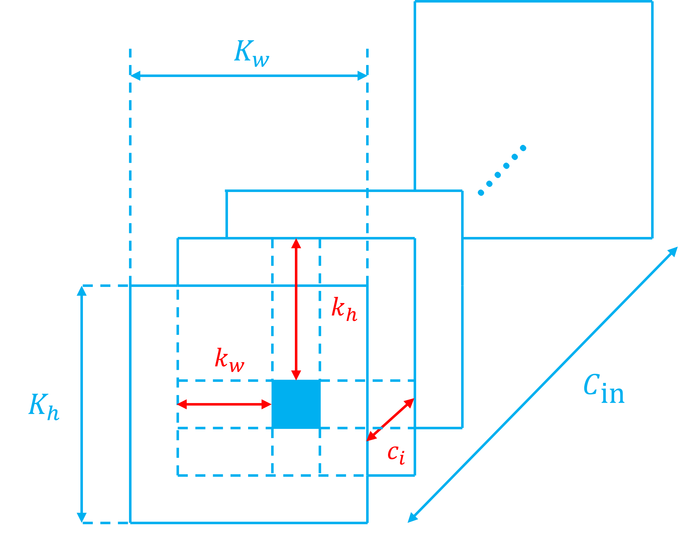
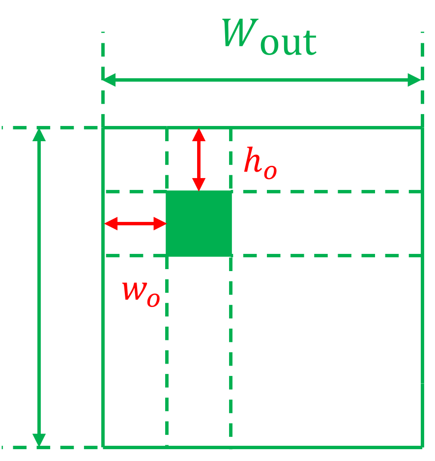

# Hardware Design for Convolutional Layer

## I. Overview

卷积层本质是线性运算，更准确的来说：对张量进行线性变换。根据线性代数，任意线性变换均可以对应到一个矩阵乘法操作。

但这里有一个很重要的区分：

1. Step 1: 从数学上看，可以把卷积核展开成一个巨大的 Toeplitz / Block-Toeplitz 卷积矩阵；
2. Step 2: 从实际 CPU/GPU/NPU 实现看，通常不会真的构造这个巨大稀疏 Toeplitz 矩阵；
3. Step 3: 最经典的工程方法是 im2col + GEMM：把输入的每个卷积窗口展开成列，然后调用高效矩阵乘法；
4. Step 4: 更现代的实现则常进一步做成 implicit GEMM：连 im2col 矩阵都不真正写回内存，而是在数据进入 MAC 阵列时动态产生。

接下来我们按照：

$$\boxed{
\text{Toeplitz数学表示}
\rightarrow
\text{im2col + GEMM}
\rightarrow
\text{implicit GEMM / direct convolution}
}$$

层层递进的关系，分析卷积层从数学映射到硬件实现流程的基础原理。

---

## II. 第一阶段：从卷积到 Toeplitz 卷积矩阵

### 2.1 Take Conv1D as an example

先考虑最简单的一维情况。

输入

\[
x=
\begin{bmatrix}
x_0\\
x_1\\
x_2\\
x_3\\
x_4
\end{bmatrix}
\]

卷积核长度为 3：

$$w=\begin{bmatrix}w_0&w_1&w_2\end{bmatrix}$$

假设：

$$K=3,\qquad S=1,\qquad P=0$$

那么输出长度为

$$L_{\text{out}}=5-3+1=3$$

分别对应：

$$\begin{cases}y_0=w_0x_0+w_1x_1+w_2x_2\\
y_1= w_0x_1+w_1x_2+w_2x_3\\
y_2= w_0x_2+w_1x_3+w_2x_4
\end{cases}$$

即：

$$\begin{bmatrix}
y_0\\
y_1\\
y_2
\end{bmatrix}
=
\begin{bmatrix}
w_0&w_1&w_2&0&0\\
0&w_0&w_1&w_2&0\\
0&0&w_0&w_1&w_2
\end{bmatrix}
\begin{bmatrix}
x_0\\
x_1\\
x_2\\
x_3\\
x_4
\end{bmatrix}$$

其中：

$$\boxed{T(w)=\begin{bmatrix}
w_0&w_1&w_2&0&0\\
0&w_0&w_1&w_2&0\\
0&0&w_0&w_1&w_2
\end{bmatrix}}$$

就是 **Toeplitz** 矩阵。其核心思想就是将**输入张量和输出张量都展平为一维向量**，将卷积操作转化为：

$$\mathbf{Y} = T(w) \cdot \mathbf{X}$$

### 2.2 Toeplitz 矩阵

#### 2.2.1 定义与构造

Toeplitz 矩阵的定义非常简单：**它是一个主对角线及其平行线上的元素皆相等的矩阵**。即满足：

$$A_{i,j}=A_{i-1,j-1}$$

例如标准 Toeplitz：

\[
\begin{bmatrix}
a&b&c&d\\
e&a&b&c\\
f&e&a&b\\
g&f&e&a
\end{bmatrix}
\]

在标准 Toeplitz 矩阵中，上下相邻两行满足**平移不变性（0填充）**，由于卷积操作本质上是 **“滑动窗口的乘加运算”** ，这种平移不变性恰好对应了 Toeplitz 矩阵中对角线元素相等的特性。

构造 Toeplitz 矩阵的通法如下（这里我们只考虑Conv1D和Conv2D）：

无论是 Conv1D 还是 Conv2D，Toeplitz 矩阵的核心思想都是：**将输入特征图$\mathbf{X}$展平为一维列向量，并将卷积核展开成一个巨大的 Toeplitz 矩阵。**

1. **确定维度**：
    - 假设输入特征图的尺寸为：$H_{\text{in}} \times W_{\text{in}}$，则输入特征图将被展平为长度为 $N_{\text{in}} = H_{\text{in}} \times W_{\text{in}}$ 的**一维列向量**。
    - 由输入特征图尺寸和卷积核尺寸确定输出特征图尺寸为：$H_{\text{out}} \times W_{\text{out}}$，则输出特征图将被展平为长度为 $N_{\text{out}} = H_{\text{out}} \times W_{\text{out}}$ 的**一维列向量**。
    - 由此可以确定 Toeplitz 矩阵$T(w)$的维度为：$N_{\text{out}} \times N_{\text{in}}$。
2. **填充元素**：
    - 矩阵$T(w)$的每一行，**代表卷积核在输入特征图上的一次特定位置的滑动**。并且第 $i$ 行计算的是 $\mathbf{Y}$ 的第 $i$ 个元素。
    - 因此，填充方法是：对于$T(w)$的第 $i$ 行，找到卷积核当前**覆盖的输入元素索引**，将**卷积核的权重填入这些索引对应的列**中，**其余列置零**。

#### 2.2 详解 Conv1D 的 Toeplitz 矩阵

我们依然考虑：

$$w=\begin{bmatrix}w_0&w_1&w_2\end{bmatrix}, \qquad \begin{bmatrix}
y_0\\
y_1\\
y_2
\end{bmatrix}
=
\begin{bmatrix}
w_0&w_1&w_2&0&0\\
0&w_0&w_1&w_2&0\\
0&0&w_0&w_1&w_2
\end{bmatrix}
\begin{bmatrix}
x_0\\
x_1\\
x_2\\
x_3\\
x_4
\end{bmatrix}$$

$K=3, L_{\text{in}}=5, L_{\text{out}}=3$，并且 padding = 0, stride = 1。

这一次，我们用索引形式表达卷积操作：

$$y[i]=\sum_{k=0}^{K-1}w[k]x[i+k], \quad i=0,1,\cdots,L_{\text{out}}-1$$

更一般化：

$$y[i]=\sum_{j=0}^{L_{\text{in}}-1}T_{ij}x[j]$$

显然我们要求 $T[i, i:i+K-1] = w$ 且其他元素为0。

因此，我们得到了 $T_{ij}$ 的定义：

$$\boxed{T_{ij}
=
\begin{cases}
w[j-i], & 0\le j-i<K\\
0,&\text{otherwise}
\end{cases}}$$

显然，从该式可以看出 $T_{ij}$ 只依赖于 $j-i$，而不依赖于特定的 $i$ 和 $j$。

接下来我们看：

**(1) Stride 会发生什么？**

依旧对于原来的例子，这一次我们令 $S=2$，则此时 $L_{\text{out}}=2$。而：

$$T(w)=\begin{bmatrix}
w_0&w_1&w_2&0&0\\
0&0&w_0&w_1&w_2
\end{bmatrix}$$

因此 **stride = 2 相当于在 stride=1 的卷积矩阵中，每隔一行取一行**。此时的$T(w)$并非严格的 Toeplitz 矩阵。

从矩阵观点看：

\[
\boxed{\text{stride 本质上是对 Toeplitz 输出行的降采样}}
\]

**(2) Padding 会发生什么？**

依旧对于原来的例子，这一次我们令 $P=1$，即**保持输入输出形状不变**，此时我们有：

$$w=\begin{bmatrix}w_0&w_1&w_2\end{bmatrix}, \qquad \begin{bmatrix}
y_0\\
y_1\\
y_2\\
y_3\\
y_4
\end{bmatrix}
=
\begin{bmatrix}
w_1&w_2&0&0&0\\
w_0&w_1&w_2&0&0\\
0&w_0&w_1&w_2&0\\
0&0&w_0&w_1&w_2\\
0&0&0&w_0&w_1
\end{bmatrix}
\begin{bmatrix}
x_0\\
x_1\\
x_2\\
x_3\\
x_4
\end{bmatrix}$$

在这种情况下，$T(w)$仍然是**非常标准的 Toeplitz 矩阵，并且是方阵，卷积核中心元素位于主对角线。**

**(3) Dilation 会发生什么？**

依旧对于原来的例子，这一次我们假设 $D=2$，即**膨胀卷积**，此时我们有：

$$\begin{bmatrix}
y_0
\end{bmatrix}
=
\begin{bmatrix}
w_0&0&w_1&0&w_2
\end{bmatrix}
\begin{bmatrix}
x_0\\
x_1\\
x_2\\
x_3\\
x_4
\end{bmatrix}$$

也就是说：

\[
\boxed{\text{dilation 相当于在 kernel tap 之间插入结构性的 0}}
\]

### 2.3 Conv2D 的 Toeplitz 矩阵

#### 2.3.1 Conv2D 的 "Toeplitz" 矩阵的定义与构造

Conv2D 卷积中，Toeplitz 矩阵的构造方式仍然遵循上述原则，但**此时需要考虑两个维度上的平移不变性**，最终的 Toeplitz 矩阵也并非严格意义的 Toeplitz 矩阵。

我们依旧从案例入手，考虑：

输入：

$$X=
\begin{bmatrix}
x_{00}&x_{01}&x_{02}\\
x_{10}&x_{11}&x_{12}\\
x_{20}&x_{21}&x_{22}
\end{bmatrix}$$

kernel：

$$W=\begin{bmatrix}
a&b\\
c&d
\end{bmatrix}$$

stride = 1，padding = 0，此时输出为一个 $2\times2$ 特征图：

$$Y=\begin{bmatrix}
y_{00}&y_{01}\\
y_{10}&y_{11}
\end{bmatrix}$$

我们将输入和输出特征图展开为一维向量

$$x_{\text{vec}}
=
\begin{bmatrix}
x_{00}\\
x_{01}\\
x_{02}\\
x_{10}\\
x_{11}\\
x_{12}\\
x_{20}\\
x_{21}\\
x_{22}
\end{bmatrix}
, \qquad
y_{\text{vec}}
=
\begin{bmatrix}
y_{00}\\
y_{01}\\
y_{10}\\
y_{11}
\end{bmatrix}$$

满足 $y_{\text{vec}} = T(w) x_{\text{vec}}$ 的矩阵 $T(w)$ 即为：

$$\boxed{T(W)=
\begin{bmatrix}
a&b&0&c&d&0&0&0&0\\
0&a&b&0&c&d&0&0&0\\
0&0&0&a&b&0&c&d&0\\
0&0&0&0&a&b&0&c&d
\end{bmatrix}}$$

这个 "Toeplitz" 矩阵比较有意思，我们延续上述:

$$\boxed{\text{矩阵}T(w)\text{的每一行，代表卷积核在输入特征图上的一次特定位置的滑动}}$$

的理解：

从$T(w)$
第 $i=1$ 行：$\begin{bmatrix}a&b&0&c&d&0&0&0&0\end{bmatrix}$ 到
第 $i=2$ 行：$\begin{bmatrix}0&a&b&0&c&d&0&0&0\end{bmatrix}$ 对应着：**卷积核在输入特征图上的第一个水平滑道的一次水平滑动**

同理，

从$T(w)$
第 $i=3$ 行：$\begin{bmatrix}0&0&0&a&b&0&c&d&0\end{bmatrix}$ 到
第 $i=4$ 行：$\begin{bmatrix}0&0&0&0&a&b&0&c&d\end{bmatrix}$ 对应着：**卷积核在输入特征图上的第二个水平滑道的一次水平滑动**

而：

从$T(w)$
**第 $i=1,2$ 行整体**：$\begin{bmatrix}a&b&0&c&d&0&0&0&0\\ 0&a&b&0&c&d&0&0&0\end{bmatrix}$ 到：
**第 $i=3,4$ 行整体**：$\begin{bmatrix}0&0&0&a&b&0&c&d&0\\ 0&0&0&0&a&b&0&c&d\end{bmatrix}$ 对应着：

**卷积核由第一个水平滑倒切换到第二个水平滑倒的竖直滑动**

因此，事实上 Conv2D 的 "Toeplitz" 矩阵可以用**分块的方式**来看:

$$T(w)=
\begin{bmatrix}
A&B&0\\
0&A&B
\end{bmatrix}$$

其中：

$\begin{bmatrix}A&B&0\end{bmatrix}$代表**第 $i=1,2$ 行整体**
$\begin{bmatrix}0&A&B\end{bmatrix}$代表**第 $i=3,4$ 行整体**

完整的卷积操作（矩阵乘法）可以表示为：

$$\begin{bmatrix}
\color{red}{y_{00}}\\
\color{red}{y_{01}}\\
\color{green}{y_{10}}\\
\color{green}{y_{11}}
\end{bmatrix} = \begin{bmatrix}
\color{red}{A}&\color{red}{B}&\color{red}{0}\\
\color{green}{0}&\color{green}{A}&\color{green}{B}
\end{bmatrix} \begin{bmatrix}
x_{00}\\
x_{01}\\
x_{02}\\
x_{10}\\
x_{11}\\
x_{12}\\
x_{20}\\
x_{21}\\
x_{22}
\end{bmatrix}$$

而具体到分块内部，有：

$$A = \begin{bmatrix}
a&b&0\\
0&a&b
\end{bmatrix}, \qquad B = \begin{bmatrix}
c&d&0\\
0&c&d
\end{bmatrix}$$

这里的 $A$ 和 $B$ **也很有意思**：

- $A$ 对应着卷积核 $w$ 在水平/竖直滑道上滑动过程中，**第一行$\begin{bmatrix}a&b\end{bmatrix}$的贡献**。且 **$A$ 的第 $i=1$ 行到 $i=2$ 行表示着 $\begin{bmatrix}a&b\end{bmatrix}$ 的水平滑动**
- $B$ 对应着卷积核 $w$ 在水平/竖直滑道上滑动过程中，**第二行$\begin{bmatrix}c&d\end{bmatrix}$的贡献**。且 **$B$ 的第 $i=1$ 行到 $i=2$ 行表示着 $\begin{bmatrix}c&d\end{bmatrix}$ 的水平滑动**
- 整体 $\begin{bmatrix}A&B&0\end{bmatrix}$ 到整体$\begin{bmatrix}0&A&B\end{bmatrix}$代表着**卷积核由第一个水平滑倒切换到第二个水平滑倒的竖直滑动**

并且：

- $A$ 是**卷积核子核**$\begin{bmatrix}a&b\end{bmatrix}$的**标准 Toeplitz 矩阵**
- $B$ 是**卷积核子核**$\begin{bmatrix}c&d\end{bmatrix}$的**标准 Toeplitz 矩阵**
- 完整 $T(w)$ 是 $\begin{bmatrix}A\\ B\end{bmatrix}$的**标准 Toeplitz 矩阵**

因此，这种矩阵事实上称作：**双重块 Toeplitz 矩阵（Block Toeplitz with Toeplitz Blocks, BTTB）**：

二维卷积有**两个滑动方向**：$W$ 方向和 $H$ 方向

水平方向移动一次：$[a,b,0]\rightarrow[0,a,b]$
这产生了**block 内部的 Toeplitz**。

垂直方向移动一次：这使**整个 block $[A,B,0]$ 变成 $[0,A,B]$**
这产生了**block 级别的 Toeplitz**。

因此：

\[
\boxed{
\text{二维空间滑动}
\Longleftrightarrow
\text{two-level Toeplitz structure}
}
\]

#### 2.3.2 考虑 Input Channel 后的 BTTB

真正 CNN 输入一般是：

$$X\in
\mathbb R^{C_{in}\times H_{in}\times W_{in}}$$

**先考虑只有一个 output channel**。

kernel：

$$W\in
\mathbb R^{C_{in}\times K_h\times K_w}$$

依旧只考虑 **Stride=1, Padding=0, Dilation=1** 时的卷积结果：

$$Y\in
\mathbb R^{H_{out}\times W_{out}}$$

按照**索引方式展开**输出特征图：

$$Y[h,w]
=
\sum_{c=0}^{C_{in}-1}
\sum_{k_h}
\sum_{k_w}
W[c,k_h,k_w]
X[c,h+k_h,w+k_w]$$

把整个输入展开（顺序：**先变列索引，再变行索引，最后变通道索引**）：

$$x_{\text{vec}}
\in
\mathbb R^{C_{in}H_{in}W_{in}}$$

那么仍然存在一个矩阵：

$$T(W)
\in
\mathbb R^{
(H_{out}W_{out})
\times
(C_{in}H_{in}W_{in})
}$$

满足：

$$y_{\text{vec}}=T(W)x_{\text{vec}}$$

这个矩阵可以理解成：

$$\boxed{T(W)
=
\begin{bmatrix}
T(W_0)&T(W_1)&\cdots&T(W_{C_{in}-1})
\end{bmatrix}}$$

其中每个：$T(W_c)$ 负责一个输入通道。

这很好理解，因为：

$$Y
=
X_0*W_0
+
X_1*W_1
+\cdots$$

输出的一个通道等于输入和卷积核每个通道的卷积结果累加和，所以矩阵形式就是把**每个通道对应的卷积矩阵在水平方向上拼接**，恰好对应**输入特征图最后变动通道索引的展开顺序**。

#### 2.3.3 考虑 Output Channel 后的 BTTB

现在：

$$W\in
\mathbb R^{
C_{out}\times C_{in}\times K_h\times K_w
}$$

即我们有 $C_{out}$ 个卷积核，每个卷积核的尺寸都是：$C_{in}\times K_h\times K_w$。

比如：

$$W^{(0)},W^{(1)},\dots,W^{(C_{out}-1)}$$

**每一组都对应一个卷积矩阵**：

$$\begin{cases}
T(W^{(0)}) = \begin{bmatrix}
T(W^{(0)}_0)&T(W^{(0)}_1)&\cdots&T(W^{(0)}_{C_{in}-1})\end{bmatrix} \\
T(W^{(1)}) = \begin{bmatrix}
T(W^{(1)}_0)&T(W^{(1)}_1)&\cdots&T(W^{(1)}_{C_{in}-1}) \end{bmatrix} \\
\cdots \\
T(W^{(C_{out}-1)}) = \begin{bmatrix}
T(W^{(C_{out}-1)}_0)&T(W^{(C_{out}-1)}_1)&\cdots&T(W^{(C_{out}-1)}_{C_{in}-1}) \end{bmatrix} \\
\end{cases}$$

最后**纵向堆叠**：

$$\boxed{
T_{\text{full}}
=
\begin{bmatrix}
T(W^{(0)}_0)&T(W^{(0)}_1)&\cdots&T(W^{(0)}_{C_{in}-1}) \\
T(W^{(1)}_0)&T(W^{(1)}_1)&\cdots&T(W^{(1)}_{C_{in}-1}) \\
\vdots & \vdots & \ddots & \vdots \\
T(W^{(C_{out}-1)}_0)&T(W^{(C_{out}-1)}_1)&\cdots&T(W^{(C_{out}-1)}_{C_{in}-1})
\end{bmatrix}}$$

于是：

$$y_{\text{vec}}=T_{\text{full}}x_{\text{vec}}$$

矩阵尺寸为：

$$T_{\text{full}}
\in
\mathbb R^{
(C_{out}H_{out}W_{out})
\times
(C_{in}H_{in}W_{in})
}$$

这是一个超大规模的稀疏矩阵。

### 2.4 由 Toeplitz 矩阵分析卷积层特性

仔细看 Toeplitz 卷积矩阵，会发现三个明显特征。

**(1) 高度稀疏(sparse)**。

例如二维案例：

$$T(W)=
\begin{bmatrix}
a&b&0&c&d&0&0&0&0\\
0&a&b&0&c&d&0&0&0\\
0&0&0&a&b&0&c&d&0\\
0&0&0&0&a&b&0&c&d
\end{bmatrix}$$

只有 kernel 覆盖的位置非零。

如果 $K_hK_w\ll H_{in}W_{in}$，那么**绝大多数位置都是 0**。

**(2) 大量重复权重(repeated)**，例如 \(a,b,c,d\) 会不断重复出现。

**(3) 非零元素分布高度规则(structured)**。

它们不是随机稀疏，而是由于滑动窗口产生的规则结构。

---

Toeplitz 矩阵不只是一个“计算技巧”，它**揭示了很多数学事实**。

例如卷积是线性的：

$$T(W)(\alpha x_1+\beta x_2)=
\alpha T(W)x_1+\beta T(W)x_2$$

因为：

$$\boxed{\text{卷积运算}\Leftrightarrow \text{矩阵乘法} \Leftrightarrow \text{线性变换}}$$

它还揭示了：**local connectivity**，因为矩阵每一行只有少量非零元素。

又揭示了：**weight sharing**，因为相同 kernel 参数在矩阵中反复出现。

普通全连接层：

\[
y=Wx
\]

其中 \(W\) 的每个元素通常都是独立参数。

而卷积：

\[
y=T(w)x
\]

虽然看起来矩阵很大，但整个矩阵实际上只由很少的参数：$w_0,w_1,\dots$ 生成。

因此可以把卷积理解成：**一个受到强结构约束的大型线性层**，这个观点非常重要。

---

此外，理解 Toeplitz 矩阵对理解转置卷积（ConvTranspose）也有重要意义，

对于卷积运算：

$$y_{1}=T(W)x_1$$

其中 $y_1 \in \mathbb{R}^{C_{out}H_{out}W_{out}}$，$x_1 \in \mathbb{R}^{C_{in}H_{in}W_{in}}$，

$$T(W) \in \mathbb{R}^{(C_{out}H_{out}W_{out}) \times (C_{in}H_{in}W_{in})}$$

那么这个线性算子的转置就是：

$$y_2=T(W)^T x_2$$

其中 $y_2 \in \mathbb{R}^{C_{in}H_{in}W_{in}}$，$x_2 \in \mathbb{R}^{C_{out}H_{out}W_{out}}$，

$$T(W)^T \in \mathbb{R}^{(C_{in}H_{in}W_{in}) \times (C_{out}H_{out}W_{out})}$$

这正是 **transposed convolution** 名称真正的来源。

--- 

如果我们将**普通卷积操作理解为**：kernel 在**输入上滑动** $\Rightarrow$ 每个位置做**局部点积** $\Rightarrow$ 得到**输出像素**

那么 **Toeplitz 矩阵可以理解为**：把 kernel *的**所有滑动位置提前全部展开** $\Rightarrow$ 每个位置变成矩阵的一行，得到卷积矩阵 $T(W)$  $\Rightarrow$ **通过矩阵乘法实现卷积运算**。

因此最核心的一句话是：

$$\boxed{
\text{Toeplitz 矩阵就是卷积核“所有空间位置的副本”的静态展开。}
}$$

由此，我们容易想到的最自然的问题就是：

> **既然 Toeplitz 表示如此直接，为什么 CPU/GPU/NPU 不直接构造 \(T(W)\)，然后拿矩阵乘法器算 \(T(W)x\)？**

这个问题会把我们从纯数学表示正式带入**计算量、存储量、数据搬运和硬件利用率**，也正是从 Toeplitz 走向 im2col 的关键一步。

## III. 第二阶段：从 Toeplitz 到 im2col

### 3.1 Toeplitz 展开的严重问题

我们考虑单输入通道（$C_{\text{in}}=1$）、单输出通道（$C_{\text{out}}=1$），Conv2D的情况，并且依旧假设 Stride=1, Padding=0, Dilation=1, 此时 BTTB 矩阵的尺寸为：$H_{\text{out}}W_{\text{out}} \times H_{\text{in}}W_{\text{in}}$。

而非零权重个数等于**输出像素个数乘以卷积核权重个数**（因为每一个输出像素都是一个完整卷积窗口进行 MAC 计算得到的），即：

$$N_{\text{nz}} = H_{\text{out}}W_{\text{out}} \times K_{h}K_{w}$$

因此非零元素密度：

$$\rho=\frac{N_{\text{nz}}}{H_{\text{out}}W_{\text{out}} \times H_{\text{in}}W_{\text{in}}}=\frac{K_{h}K_{w}}{H_{\text{in}}W_{\text{in}}}$$

!!! example "Example"
    
    假设输入特征图尺寸为 $H_{\text{in}}=W_{\text{in}}=224$，卷积核尺寸为 $K_{h}=K_{w}=3$，则非零元素密度为：

    $$\rho=\frac{3\times3}{224\times224}\approx 0.000179$$

    也就是说，**Toeplitz 矩阵中只有约 0.018% 的元素是非零的，其余 99.982% 的元素都是零**。

    这意味着，如果我们直接构造 Toeplitz 矩阵并进行矩阵乘法，将会浪费大量的存储空间和计算资源，显然不适合直接用 dense GEMM 进行计算。

稀疏性，是 Toeplitz 矩阵最严重的问题之一。此外，第二个问题是——**权重被疯狂复制**。

由于每个输出像素都需要完整地与卷积核进行点积运算，因此卷积核权重的重复复制次数为：

$$N_{\text{rep}}=H_{\text{out}}W_{\text{out}}$$

!!! Example "Example"
    例如对于 $224\times 224$ 的特征图，重复复制次数就是：$N_{\text{rep}}=222\times 222=49284$——**接近五万次**！这完全违背了卷积区别于 FC 最有价值的性质之一：**权重共享**

**多通道下，情况更加严重**：

$$T_{\text{full}}\in \mathbb{R}^{(C_{\text{out}}H_{\text{out}}W_{\text{out}}) \times (C_{\text{in}}H_{\text{in}}W_{\text{in}})}$$

有：

- $N_{\text{nz}}=C_{\text{out}}H_{\text{out}}W_{\text{out}}K_{h}K_{w}$
- $\rho=K_{h}K_{w}/(C_{\text{in}}H_{\text{in}}W_{\text{in}})$
- $N_{\text{rep}}=C_{\text{out}}H_{\text{out}}W_{\text{out}}$

!!! Example "Example"
    假设一个典型层：$C_{\text{in}}=64, C_{\text{out}}=128, H_{\text{in}}=W_{\text{in}}=224, K_{h}=K_{w}=3$
    则非零密度只有：

    $$\rho=\frac{K_{h}K_{w}}{C_{\text{in}}H_{\text{in}}W_{\text{in}}}\approx 2.80\times 10^{-6}=0.00028\%$$

    权重重复复制次数：

    $$N_{\text{rep}}=C_{\text{out}}H_{\text{out}}W_{\text{out}}=6,308,352$$

    空间利用率极低。

    假设权重用 INT8 存储，则原始权重本身只有：

    $$C_{\text{out}}\times C_{\text{in}}\times K_{h}K_{w}=73,728\text{B}=72\text{KB}$$

    然而保存完整 Toeplitz 矩阵需要的存储开销为：

    $$C_{\text{out}}H_{\text{out}}W_{\text{out}}C_{\text{in}}H_{\text{in}}W_{\text{in}}\approx 2.03\times 10^{13}\text{B}\approx 18.5\text{TB}$$

    于是我们得到一个极其荒谬的对比：**存储 $72\text{KB}$ 的原始权重需要 $18.5\text{TB}$ 的存储空间！**

    即便我们忽略**所有零**，只考虑非零权重，也有整整：

    $$18.5\text{TB}\times N_{\text{nz}}\approx 54\text{MB}$$

更本质的问题是，**Toeplitz 把卷积层规则的结构丢失了**：

卷积原本包含非常强的结构信息：

$$Y[c_o,h,w]
=
\sum_{c_i,k_h,k_w}
W[c_o,c_i,k_h,k_w]
X[c_i,h+k_h,w+k_w]$$

这里明确知道：

- 哪些维度是 channel；
- 哪些维度是 spatial；
- kernel 在空间上怎么滑；
- 哪些数据可以复用。

一旦展开为 Toeplitz 矩阵，就变成了一个巨大的 **sparse matrix-vector multiplication(SpMV)**，把很多结构隐藏掉了，这对芯片设计非常不好，因为**芯片设计最关心的就是：reuse**。

事实上，Toeplitz 矩阵形式**更加接近 GEMV/SpMV 而非 GEMM**。因为：

$$y_{\text{vec}}=T(w)x_{\text{vec}}$$

与矩阵 $T(w)$ 相乘的 $x_{\text{vec}}$ 是向量而非矩阵。而 **GEMV 和 GEMM 的区别**在于：

!!! Attention "GEMM vs GEMV"
    **GEMV 和 GEMM 的区别**：

    - **GEMM**: 对于 $N\times N$ 的方阵乘法，其**浮点 operations** 约为 $2N^3$，而**访存 operations** 约为 $4N^2$。**计算强度(Compution Density) $\eta =N/2$**。随着矩阵尺寸 N 的增大，**计算量呈立方级增长，而访存需求仅呈平方级增长，计算强度呈线性增长**。这意味着数据被加载到缓存和寄存器后，可以被**反复重用以执行大量计算**，性能瓶颈主要在于**处理器的浮点计算能力**。
    - **GEMV**: 对于 $N\times N$ 矩阵与向量的乘法，其**浮点 operations** 约为 $2N^2$，**访存 operations** 也约为 $N^2$。**计算强度恒为 $\eta=O(1)$量级（约等于 2）**。无论矩阵多大，**每加载一个数据元素，仅能进行常数次计算**。因此，**GEMV 的性能完全受限于内存带宽**，从 Cray-1 时代至今，其优化空间都非常有限。这也是为什么在深度学习中，倾向于将多个 GEMV 操作批处理，从而将其转化为一个更大规模的 GEMM 操作的原因。

### 3.2 关键思路：从展开 Kernal 到展开 Input

Toeplitz 做的是：

> 把同一个 kernel 在每个 spatial position 的作用全部展开。

那么能不能反过来？

既然卷积的每个 output pixel 都是在做：

\[
\text{kernel}
\cdot
\text{input patch}
\]

那么可以：

1. kernel 只保留一份；
2. 把所有 input patch 收集起来；
3. 一次做很多个 dot product。

这就是 **im2col**。

这一步是整个链路中最关键的“视角翻转”。

依旧考虑如下这个案例：

先考虑单输入通道，单输出通道情况，输入：

$$X=
\begin{bmatrix}
x_{00}&x_{01}&x_{02}\\
x_{10}&x_{11}&x_{12}\\
x_{20}&x_{21}&x_{22}
\end{bmatrix}$$

kernel：

$$W=\begin{bmatrix}
a&b\\
c&d
\end{bmatrix}$$

stride = 1，padding = 0，输出是一个尺寸为 $2\times 2$的特征图:

$$\begin{bmatrix}y_{00} & y_{01} \\ y_{10} & y_{11}\end{bmatrix}$$

我们要计算 $y0=ax_{00} + bx_{01} + cx_{10} + dx_{11}$，如果将 kernel 展平为：$\begin{bmatrix}a&b&c&d\end{bmatrix}$，需要 receptive field 展平为**一列**:

$$\begin{bmatrix}\color{red}{x_{00}} \\ \color{red}{x_{01}} \\ \color{red}{x_{10}}\\ \color{red}{x_{11}} \end{bmatrix}$$

同理，在计算 $y_{01}, y_{10}, y_{11}$ 时所需要的 input patch 分别为：

$$y_{01} \sim \begin{bmatrix}\color{blue}{x_{01}}\\\color{blue}{x_{02}}\\\color{blue}{x_{11}}\\\color{blue}{x_{12}}\end{bmatrix}, \quad y_{10} \sim \begin{bmatrix}\color{green}{x_{10}}\\\color{green}{x_{11}}\\\color{green}{x_{20}}\\\color{green}{x_{21}}\end{bmatrix}, \quad \quad y_{11} \sim \begin{bmatrix}\color{purple}{x_{11}}\\\color{purple}{x_{12}}\\\color{purple}{x_{21}}\\\color{purple}{x_{22}}\end{bmatrix}$$

因此，原卷积操作可以写作：

$$\begin{bmatrix}y_{00} & y_{01} & y_{10} & y_{11}\end{bmatrix}=
\begin{bmatrix}a&b&c&d\end{bmatrix}
\cdot 
\begin{bmatrix}
\color{red}{x_{00}} & \color{blue}{x_{01}} & \color{green}{x_{10}} & \color{purple}{x_{11}} \\
\color{red}{x_{01}} & \color{blue}{x_{02}} & \color{green}{x_{11}} & \color{purple}{x_{12}} \\
\color{red}{x_{10}} & \color{blue}{x_{11}} & \color{green}{x_{20}} & \color{purple}{x_{21}} \\
\color{red}{x_{11}} & \color{blue}{x_{12}} & \color{green}{x_{21}} & \color{purple}{x_{22}}
\end{bmatrix}$$

这就是 **im2col** 的核心思想：**将每一个输出像素对应的 receptive field 展平为一列，从而将卷积操作转化为矩阵乘法**：

$$Y_{\text{row}}=W_{\text{mat}} \cdot X_{\text{col}}$$

!!! Attention "why call im2col"
    im2col 的含义就是：“**把 image 中每一个 receptive field 展开成一列**”，即构造 $X_{\text{col}}$ 的方法。

!!! Tip "Toeplitz 和 im2col 的关系"

    Toeplitz：

    $$y=T(W)x$$

    是在**复制、平移卷积核权重。**

    im2col：

    $$y=WX_{\text{col}}$$

    是在**复制、收集 input patch**

    两者是**完全相同卷积**的**两种展开方法**。

### 3.3 $X_{\text{col}}$

#### 3.3.1 $X_{\text{col}}$ 的定义与构造

先考虑单输入通道，单输出通道的 Conv2D 操作：

1. **确定维度**：
    - 假设卷积核尺寸为：$K_h \times K_w$，卷积核被展平（列索引先变）成长度为 $N_{\text{w}} = K_h \times K_w$ 的**一维行向量**，我们记作 $W_{\text{mat}}$。
    - 我们需要得到的输出特征图尺寸为：$H_{\text{out}} \times W_{\text{out}}$。将其展平为长度为 $N_{\text{out}} = H_{\text{out}} \times W_{\text{out}}$ 的**一维行向量**，我们记作 $Y_{\text{row}}$。
    - 假设输入特征图的尺寸为：$H_{\text{in}} \times W_{\text{in}}$，则输入特征图被转换为矩阵 $X_{\text{col}}$，**其中每一列都对应一个 receptive field**，同样满足列索引先变，并且**列数等于输出像素个数**，即 $H_{\text{out}} \times W_{\text{out}}$；**行数等于卷积核权重个数**，即 $K_h \times K_w$。
2. **填充元素**：
    - 矩阵$X_{\text{col}}$的每一列，**代表与卷积核计算的一个 receptice field**。并且第 $i$ 列计算的是 $\mathbf{Y}$ 的第 $i$ 个元素。
    - 因此，填充方法是：对于$X_{\text{col}}$的第 $i$ 列，找到卷积核当前**覆盖的输入元素索引**，将**卷积核的权重填入这些索引对应的列**中。

这样构造得到的：

- $W_{\text{mat}}$ 仅包含原始权重，没有复制和零填充。
- $X_{\text{col}}$ 也是**几乎都是有用的输入数据**，**没有零填充**（**但是有复制**）。

#### 3.3.2 考虑 Input Channel

当输入特征图包含多个输入通道时:

卷积核权重向量变为卷积核权重矩阵，但是仍然保持元素独立无复制：

$$W_{\text{mat}} = \begin{bmatrix} W_0 & W_1 & \cdots & W_{C_{\text{in}}-1} \end{bmatrix}$$

维度为：$1\times C_{\text{in}}K_h K_w$

各通道输入图的 $X_{\text{col}}$ **矩阵在竖直方向上堆叠**，即：

$$X_{\text{col}} = \begin{bmatrix} X_{0,\text{col}} \\ X_{1,\text{col}} \\ \vdots \\ X_{C_{\text{in}-1},\text{col}} \end{bmatrix}$$

维度为：$C_{\text{in}}K_h K_w \times H_{\text{out}}W_{\text{out}}$

#### 3.3.3 考虑 Output Channel

现在：

$$W\in
\mathbb R^{
C_{out}\times C_{in}\times K_h\times K_w
}$$

即我们有 $C_{out}$ 个卷积核，每个卷积核的尺寸都是：$C_{in}\times K_h\times K_w$。

比如：

$$W^{(0)},W^{(1)},\dots,W^{(C_{out}-1)}$$

**每一组都对应一行**：

$$\begin{cases}
W^{(0)}: \begin{bmatrix} W^{(0)}_0 & W^{(0)}_1 & \cdots & W^{(0)}_{C_{\text{in}}-1} \end{bmatrix} \\
W^{(1)}: \begin{bmatrix} W^{(1)}_0 & W^{(1)}_1 & \cdots & W^{(1)}_{C_{\text{in}}-1} \end{bmatrix} \\
\cdots \\
W^{(C_{\text{out}}-1)}: \begin{bmatrix} W^{(C_{\text{out}}-1)}_0 & W^{(C_{\text{out}}-1)}_1 & \cdots & W^{(C_{\text{out}}-1)}_{C_{\text{in}}-1} \end{bmatrix}
\end{cases}$$

最后**纵向堆叠**：

$$W_{\text{mat}}=\begin{bmatrix} W^{(0)}_0 & W^{(0)}_1 & \cdots & W^{(0)}_{C_{\text{in}}-1} \\ W^{(1)}_0 & W^{(1)}_1 & \cdots & W^{(1)}_{C_{\text{in}}-1} \\ \vdots & \vdots & \ddots & \vdots \\ W^{(C_{\text{out}}-1)}_0 & W^{(C_{\text{out}}-1)}_1 & \cdots & W^{(C_{\text{out}}-1)}_{C_{\text{in}}-1} \end{bmatrix}$$

最终得到的卷积核矩阵尺寸为：$W_{\text{mat}}  \in \mathbb{R}^{C_{\text{out}} \times C_{\text{in}} K_h K_w}$

**可以发现，有一个很重要的点就是：$C_{\text{out}}>1$时，我们无需再像 Toeplitz 展开一样修改输入特征图对应的矩阵——此时的$X_{\text{col}}$不变——结果就是$X_{\text{col}}$中的数据再次被复用！**

此时有：

$$Y_{\text{row}}=W_{\text{mat}}X_{\text{col}}$$

- $Y_{\text{row}} \in \mathbb{R}^{C_{\text{out}} \times H_{\text{out}}W_{\text{out}}}$
- $W_{\text{mat}} \in \mathbb{R}^{C_{\text{out}} \times C_{\text{in}}K_hK_w}$
- $X_{\text{col}} \in \mathbb{R}^{C_{\text{in}}K_hK_w \times H_{\text{out}}W_{\text{out}}}$

这就是**标准的矩阵乘法，标准的 GEMM**，$W_{\text{mat}}$和$X_{\text{col}}$ 都是矩阵而非简单的一维向量。

### 3.4 im2col 与 GEMM

#### 3.4.1 用 GEMM 规范化描述 im2col

现在可以定义标准 GEMM 的 M、N、K

AI Accelerator 领域中，GEMM 的标准定义是：

$$[M\times K][K\times N]$$

对于普通卷积：

$$\boxed{M=C_{out}}$$

$$\boxed{K=C_{in}K_hK_w}$$

$$\boxed{N=H_{out}W_{out}}$$

所以：

$$\boxed{[M\times K]\times[K\times N]=[M\times N]}$$

也就是：

$$W_{\text{mat}}X_{\text{col}}=Y_{\text{mat}}$$

#### 3.4.2 从循环角度看 im2col 为什么等价

普通卷积：

$$Y[c_o,h,w]=
\sum_{c_i,k_h,k_w}
W[c_o,c_i,k_h,k_w]
X[c_i,h+k_h,w+k_w]$$

- 把：$(c_i,k_h,k_w)$ 合并成 GEMM 的 $k$
- 把：$(h,w)$ 合并成：$n$
- 再令：$c_o\rightarrow m$

那么就变成：

$$Y[m,n]=\sum_k W[m,k]X_{\text{col}}[k,n]$$

即：

$$\boxed{C_{mn}=\sum_k A_{mk}B_{kn}}$$

这就是标准矩阵乘法。

所以本质上：$\boxed{\text{Conv}\rightarrow\text{GEMM}}$ 主要就是一次维度重组：

$$(c_o,c_i,k_h,k_w,h,w) \xrightarrow{\text{重解释为：}} (M,K,N)$$

### 3.5 im2col 的优缺点

#### 3.5.1 优点

**（1）计算规则高度统一**

$Y_{\text{row}}=W_{\text{mat}}X_{\text{col}}$ 是真正的 dense GEMM，内部操作是大量的：$c_{ij}+=a_{ik}b_{jk}$，即：MAC 运算。

**（2）权重 reuse**

根据矩阵乘法规则，卷积核矩阵 $W_{\text{mat}}$ 中的一个权重会被重用：$H_{\text{out}}W_{\text{out}}$
次，因为$W_{\text{mat}}$ 中的每个元素都会与$X_{\text{col}}$ 中**每一列**的对应元素进行乘法。

**（3）激活值 reuse**

同理，根据矩阵乘法规则，激活值矩阵 $X_{\text{col}}$ 中的一个元素会被重用：$C_{\text{out}}$ 次，因为$X_{\text{col}}$ 中的每个元素都会与$W_{\text{mat}}$ 中**每一行**的对应元素进行乘法。

**（4）很容易 tile**

深度学习芯片（如 GPU、TPU）内部的片上高速缓存（SRAM）和寄存器堆（Register File）容量极小，通常只有几十 KB 到几 MB。而实际网络层的矩阵极大。存储器层级：

- **DRAM**: 容量极大（几GB~几十GB），但速度极慢，每次读取都要等很久。
- **SRAM**: 容量较小（几MB到几十MB），但速度快
- **RF**: 容量极小（几KB），速度最快，紧贴着运算单元（MAC阵列）。

考虑一个真实网络的卷积层：$C_{in}=64, C_{out}=128, H_{in}=W_{in}=224, K=3$。

假设所有权重/激活值用 INT8 存储，经过 im2col 展开后：

- $W_{\text{mat}}$ 的维度为：$128 \times (64 \times 3 \times 3) = \mathbf{128 \times 576}$
- $X_{\text{col}}$ 的维度为：$576 \times (224 \times 224) = \mathbf{576 \times 50176}$
  
这个激活值矩阵大小超过 $28\text{MB}$，根本无法一次性塞入计算核心的寄存器中。但是由于矩阵乘法的特性，我们可以**用分块矩阵乘**的方式，

**什么是 Tiling？**

Tiling 就是将**巨大的矩阵切分为小尺寸的 Block**（例如 $16 \times 16$ 或 $32 \times 32$ 的子矩阵）。这些尺寸恰好匹配了芯片底部运算单元的物理结构，例如：

- NVIDIA 的 Tensor Core 处理 $16 \times 16$
- Google TPU 的 Systolic Array 处理 $128 \times 128$）。

运算单元分批次地将这些小 Block 加载进来做乘加运算。

**为什么 im2col 让 Tiling 很容易？**

如果不使用 im2col（即采用原生多重 for 循环计算卷积），由于卷积窗口在图像上滑动的特性，导致对内存的读取是**非连续、反复跳跃**的。给这种多维跳跃的访问设计 Tiling 策略极其复杂，缓存命中率很高。

而 im2col 强行将所有内存读取拉平成了完美的二维矩阵。根据线性代数中**分块矩阵乘法**的结合律与分配律：

$$C_{ij} = \sum_{k} A_{ik} B_{kj}$$

我们只需要简单粗暴地将 $W_{\text{mat}}$ 和 $X_{\text{col}}$ 像切网格一样切开，计算核心只需要“按顺序、连续地”从内存中搬运这些二维数据块即可。**这完美契合了硬件架构中以数据流驱动的 Systolic Array。**

### 3.5.2 缺点

im2col 虽然解决了 Toeplitz 展开中高达：

$$N_{\text{rep}}=H_{\text{out}}W_{\text{out}}$$

的卷积核权重复制次数，但是同时也带来了激活值的复制倍数：

$$N_{\text{act, rep}}=\frac{C_{\text{in}}K_h K_w \times H_{\text{out}}W_{\text{out}}}{C_{\text{in}}H_{\text{in}}W_{\text{in}}}$$

对于一般的卷积层（Stride=1, Padding 很小）：

$$H_{\text{out}} \approx H_{\text{in}}, \quad W_{\text{out}} \approx W_{\text{in}}$$

因此：

$$N_{\text{act, rep}} \approx K_h K_w$$

考虑一个典型的卷积层：

- $H_{\text{in}}=W_{\text{in}}=H_{\text{out}}=W_{\text{out}}=224$
- $K_h = K_w = 3$

虽然：$N_{\text{act, rep}} \approx 3 \times 3 = 9$ 远小于 Toeplitz 展开中的 $N_{\text{rep}}=H_{\text{out}}W_{\text{out}}=224 \times 224 = 50176$

但是**仍然存在高达 9 倍的激活值复制，并且激活值数量本身也很大**。

现代 AI 芯片中最昂贵的往往**不是 MAC 等逻辑运算，而是数据搬运**。

例如：

DRAM $\rightarrow$ load input $\rightarrow$ 构造$X_{\text{col}}$ $\rightarrow$ write $X_{\text{col}}$ $\rightarrow$ read $X_{\text{col}}$ $\rightarrow$ MAC array

这里发生了大量：

- extra write；
- extra read；
- SRAM capacity consumption；
- DRAM bandwidth consumption；
- address generation；
- energy consumption。

也就是说为了让计算看起来像漂亮的 GEMM，我们**人为制造了一个巨大的中间矩阵**。这在软件层面很方便，但硬件层面很不理想。

### 3.6 总结

可以把 Toeplitz 和 im2col 看成两个“极端”：

| 方法 | 谁被展开/复制 | 优点 | 核心缺点 |
|---|---|---|---|
| Toeplitz | Kernel | 数学最直观 | 大量 0、weight 巨量重复 |
| im2col | Input patch | 变成 dense GEMM | activation 大量重复 |
| implicit GEMM | 都不显式复制 | 保留 GEMM 友好性 | 地址生成和数据调度复杂 |

下一阶段，我们将正式进入 **explicit im2col → implicit GEMM**。届时最重要的是把下面这个东西讲透：

$X_{\text{col}}[k,n]$ 到底如何直接映射回：$X[c_i,h_{in},w_{in}]$。也就是硬件怎样根据 $k,n$ 实时算出原始 activation 地址，并把它送入 GEMM/MAC 阵列。这一步开始，就真正进入 AI 加速器实现层面了。

## IV. 第三阶段：Implicit GEMM

### 4.1 Summary of Explicit im2col

普通卷积：

$$Y[c_o,h_o,w_o]=\sum_{c_i,k_h,k_w}W[c_o,c_i,k_h,k_w]X[c_i,h_i,w_i]$$

其中:

$$\begin{cases}
h_i=h_oS_h-P_h+k_hD_h \\
w_i=w_oS_w-P_w+k_wD_w
\end{cases}$$

我们把三个 reduction 维度 $(c_i,k_h,k_w)$ （**确定输入像素坐标**）展开成 GEMM 的 $K$ 维，把空间位置 $(h_o,w_o)$ （**确认输出像素坐标**）展开成 GEMM 的 $N$ 维。

于是：

$$Y_{\rm mat}=W_{\rm mat}X_{\rm col}$$

将被转化为：

$$Y_{\rm mat}[m,n]=\sum_kW_{\rm mat}[m,k]X_{\rm col}[k,n]$$

尺寸：

$$[C_{out}\times H_{out}W_{out}]=\underbrace{[C_{out}\times C_{in}K_hK_w]}_{M\times K}\cdot\underbrace{[C_{in}K_hK_w\times H_{out}W_{out}]}_{K\times N}$$

其中 $n \in [0, N-1]$，为**本次需要计算的输出像素在 $Y_{\text{mat}}$ 中的列索引**，同时也是**在 $X_{\text{col}}$ 中的列索引**；$k \in [0, K-1]$ 为计算**该输出像素**所需要的**某个输入像素在 $X_{\text{col}}$ 中的行索引**。并且：

$$\begin{cases}
M=C_{out}        & \sim \text{输出通道数} \\
K=C_{in}K_hK_w   & \sim \text{计算每个输出像素所需要的输入像素个数} \\
N=H_{out}W_{out} & \sim \text{单图输出像素个数}
\end{cases}$$

Explicit im2col 真正做了从原始输入特征图生成中间矩阵$X_{\text{col}}$，再读取中间矩阵 $X_{\text{col}}$ 进行计算。

Implicit GEMM 则没有实际生成中间矩阵$X_{\text{col}}$，而是直接根据 GEMM 的坐标实时计算出所需的输入数据，然后送入 MAC array。

核心区别就是：**不把这个中间矩阵真正“物化”出来**。

### 4.2 $X_{\text{col}}$ 地址解码方法

#### 4.2.1 解码思路

根据式：

$$Y_{\rm mat}[m,n]=\sum_kW_{\rm mat}[m,k]X_{\rm col}[k,n]$$

我们如果需要计算坐标为：$(m, n)$（**也即$(c_{o}, n)$**）的输出像素值，那么我们需要的数据有：

- 每一个所需的卷积核权重 $W_{\text{mat}}[m,k]$;
- 每一个所需的输入像素 $X_{\text{col}}[k,n]$；

我们现在假设卷积核权重和输入特征图数据在存储器中的存储方式都是**按照通道、高度、宽度的顺序规则（$[C, H, W]$）存储**，也即：

- **列索引**（$k_w$/$w_i$）先变；
- **行索引**（$k_h$/$h_i$）再变；
- **通道索引**（$c_i$）最后变。

那么，如果我们要在存储器中，找到**输入像素**和**卷积核权重**的地址，也就需要获得如下信息：

- **输入像素**在$X$中的索引：$(c_i, h_i, w_i)$
- **卷积核权重**在$W$中的索引：$(c_o, c_i, k_h, k_w)$

此外，我们可以根据公式：

$$\begin{cases}
h_i=h_oS_h-P_h+k_hD_h \\
w_i=w_oS_w-P_w+k_wD_w
\end{cases}$$

从**卷积核权重索引$(c_o, c_i, k_h, k_w)$**计算出对应的**输入像素索引$(c_i, h_i, w_i)$**；

此外，为了将**输出像素数据正确写回存储器**，我们还需要输出像素在$Y$中的索引：$(c_o, h_o, w_o)$。（这里假设输出特征图数据在存储器中的布局方式也是$CHW$）。

也就是说，我们最终为了计算输出像素$Y_{\text{mat}}[m,n]$，需要从**地址解码器**中解码的**索引信息**只有：

- **卷积核权重**在$W$中的索引：$(c_o, c_i, k_h, k_w)$
- **输出像素**在$Y$中的索引：$(c_o, h_o, w_o)$

此外，由于$c_o$（通道维度）本身就已经处于 **flatten** 状态，也就是说我们在计算前就已经知道了 $c_o$ 的值（即$m$）。

#### 4.2.2 卷积核权重索引解码方法

我们之前把 $(c_i, k_h, k_w)$ 展平成 $k$，接下来我们需要解码出对应关系：

$$\boxed{k \rightarrow (c_i, k_h, k_w)}$$

考虑到卷积核权重在存储器中的 $[C,H,W]$ 布局，参考下图，我们有：

$$k=(c_i K_h + k_h)K_w + k_w$$

现在我们的任务就是利用 $k$ 求解出：

- $c_i$
- $k_h$
- $k_w$

考虑到上述所有量都是整数以及：

- $K_h, K_w$ 是已知的常数
- $c_i \in [0, C_{\text{in}} - 1]$
- $k_h \in [0, K_h - 1]$
- $k_w \in [0, K_w - 1]$

因此我们有：

$$\boxed{\textcolor{red}{c_i} = \left\lfloor \frac{k}{K_h K_w} \right\rfloor, \quad
\textcolor{red}{k_h} = \left\lfloor \frac{k \bmod (K_h K_w)}{K_w} \right\rfloor, \quad
\textcolor{red}{k_w} = [k \bmod (K_h K_w)] \bmod K_w}$$

#### 4.2.3 输出像素索引解码方法

我们之前把 $(h_o,w_o)$ 展平成 $n$，接下来我们需要解码出对应关系：

$$\boxed{n \rightarrow (h_o, w_o)}$$

考虑到输出特征图在存储器中的 $[C,H,W]$ 布局，参考下图，我们有：

$$n=h_oW_{out}+w_o$$

现在我们的任务就是利用 $n$ 求解出：

- $h_o$
- $w_o$

考虑到上述所有量都是整数以及：

- $H_{out}, W_{out}$ 是已知的常数
- $h_o \in [0, H_{out} - 1]$
- $w_o \in [0, W_{out} - 1]$

因此我们有：

$$\boxed{\textcolor{red}{h_o} = \left\lfloor \frac{n}{W_{out}} \right\rfloor, \quad
\textcolor{red}{w_o} = n \bmod W_{out}}$$

#### 4.2.4 根据卷积计算原始公式求解输入像素索引

我们已经知道了：

- **卷积核权重**索引：$(c_o, c_i, k_h, k_w)$
- **输出像素**索引：$(c_o, h_o, w_o)$

根据公式：

$$\boxed{\begin{cases}
h_i=h_oS_h-P_h+k_hD_h \\
w_i=w_oS_w-P_w+k_wD_w
\end{cases}}$$

可以理解确定出

- **输入像素**索引：$(c_i, h_i, w_i)$

#### 4.2.5 案例分析

我们从一个例子来说明这个过程。

考虑 $C_{\text{in}}=2, H_{\text{in}}=W_{\text{in}}=4, K_h=K_w=3, S_h=S_w=1, P_h=P_w=1, D_h=D_w=1, C_{\text{out}}=1$ 的卷积层。

输入：

$$X_0 = \begin{bmatrix}
1 & 2 & 3 & 4 \\
5 & 6 & 7 & 8 \\
9 & 10 & 11 & 12 \\
13 & 14 & 15 & 16
\end{bmatrix}, \quad X_1 = \begin{bmatrix}
17 & 18 & 19 & 20 \\
21 & 22 & 23 & 24 \\
25 & 26 & 27 & 28 \\
29 & 30 & 31 & 32
\end{bmatrix}$$

卷积核：

$$W_0=\begin{bmatrix}
a & b & c \\
d & e & f \\
g & h & i
\end{bmatrix}, \quad W_1=\begin{bmatrix}
j & k & l \\
m & n & o \\
p & q & r
\end{bmatrix}$$

此时输出只有 1 个通道，尺寸为：$H_{out}=W_{out}=4$，我们设为 $Y$，**如果我们要计算 $Y[2,2]$**，通过对卷积原始计算方式的理解，我们可以很快锁定出需要的输入像素数据为：

$$X_0 : \begin{bmatrix}
1 & 2 & 3 & 4 \\
5 & \textcolor{red}{6} & \textcolor{red}{7} & \textcolor{red}{8} \\
9 & \textcolor{red}{10} & \textcolor{red}{11} & \textcolor{red}{12} \\
13 & \textcolor{red}{14} & \textcolor{red}{15} & \textcolor{red}{16}
\end{bmatrix}, \quad X_1 : \begin{bmatrix}
17 & 18 & 19 & 20 \\
21 & \textcolor{red}{22} & \textcolor{red}{23} & \textcolor{red}{24} \\
25 & \textcolor{red}{26} & \textcolor{red}{27} & \textcolor{red}{28} \\
29 & \textcolor{red}{30} & \textcolor{red}{31} & \textcolor{red}{32}
\end{bmatrix}$$

对应 $X_{\text{col}}$ 完整列：

$\begin{bmatrix}6&7&8&10&11&12&14&15&16
&22&23&24&26&27&28&30&31&32\end{bmatrix}^{T}$

接下来，我们通过上述**地址解码方法来确定这些输入像素的索引**。

已知：

- $n=h_0 W_{out}+w_0 = 2\times 4 + 2 = 10$
- $C_{out}=1, C_{in}=2$
- $H_{out}=4, W_{out}=4$
- $K_h=K_w=3, S_h=S_w=1, P_h=P_w=1, D_h=D_w=1$
- $k \in [0, C_{in} \times K_h \times K_w - 1] = [0, 2 \times 3 \times 3 - 1] = [0, 17]$

以 k = 7，即**数据 15** 为例：

- $c_i = \left\lfloor k/(K_h K_w) \right\rfloor = \left\lfloor 7/9 \right\rfloor = 0$
- $k_h = \left\lfloor (k \bmod (K_h K_w))/K_w \right\rfloor = \left\lfloor (7 \bmod 9)/3 \right\rfloor = \left\lfloor 7/3 \right\rfloor = 2$
- $k_w = [k \bmod (K_h K_w)] \bmod K_w = [7 \bmod 9] \bmod 3 = 7 \bmod 3 = 1$
- $h_i = h_o S_h - P_h + k_h D_h = 2 \times 1 - 1 + 2 \times 1 = 3$
- $w_i = w_o S_w - P_w + k_w D_w = 2 \times 1 - 1 + 1 \times 1 = 2$

因此对应输入像素索引：$(c_i, h_i, w_i) = (0, 3, 2)$，也就是 $X_0[3, 2]=15$。

#### 4.2.6 Stride, Padding and Dilation

在 im2col，Stride, Padding 和 Dilation 的处理手段相比 Toeplitz 而言非常简单，它们都不会直接影响卷积核权重矩阵$W_{\text{mat}}$以及中间虚拟矩阵$X_{\text{col}}$，而是通过**修改输入像素索引计算公式**来实现的。

**（1）Stride 和 Dilation 应该如何处理？**

通过作用于输入像素索引计算公式：

$$\begin{cases}
h_i=h_oS_h-P_h+k_hD_h \\
w_i=w_oS_w-P_w+k_wD_w
\end{cases}$$

来实现

**（2）Padding 应该如何处理？**

当计算出发现输入像素索引 $(h_i, w_i)$ **超出了输入特征图的边界时**，说明这个输入像素是**padding**，此时我们直接返回 0 即可。

### 4.3 实际硬件实现的细节问题

上述地址解码器只是数学理论，真实硬件实现时还有很多问题需要考虑。

#### 4.3.1 Tiled-Base GEMM

前面为了辅助说明，我们说：“GEMM 要 $X_{\rm col}[k,n]$，硬件现场算地址取一个数”，概念上完全正确。
但如果真实 GPU/NPU 真这么一个一个取：**效率会非常低，并且容易触发 Cache miss**，真实 GEMM 一般都是基于 Tiled-base 做的。

关于划分与不划分 Tile 的矩阵乘法计算差异可见文档：[Tiled-base GEMM](./gemm_tile/index.md)

---

#### 4.3.2 不保证一定最好 data reuse

即便我们采用了 impicit im2col，消除了 Toeplitz 展开的大规模复制以及 explicit im2col 庞大的中间矩阵$X_{\text{col}}$，并且即便我们做好了 tiled-base GEMM，我们仍然无法保证**数据重用率一定是最优的**。

例如对于特征图最中心的部分元素，在逻辑上，它被卷积核覆盖的次数：$K_h \times K_w$ 决定了它在 GEMM 中被访问的次数。**我们不能保证“该元素第一次被 load 进入 Cache 后，后续每次访问它时它都还在 Cache 中”**。想进一步减少重复 load，需要协同优化：

- cache；
- SRAM；
- line buffer；
- tile buffer；
- register reuse；
- dataflow design。

这就会进入后面 AI accelerator 设计的核心问题。

---

所以真正高效的**结构通常是两层优化**

- 第一层：Implicit im2col 消除 $X \rightarrow X_{\text{col}}$的物化。
- 第二层：**On-chip reuse**。例如：`DRAM -> SRAM -> Tile Buffer -> PE Array`，一个 activation 从 DRAM 读一次以后，尽可能在：SRAM/local buffer/PE network 中重复使用，这才真正**把数据搬运成本压下来**。

#### 4.3.3 Memory Access Pattern

GEMM 性能高的重要原因之一是：**regular contiguous access**

但 Conv 的 implicit gather 可能出现：

- `X[i] -> X[i+1] -> X[i+W] -> X[i+W+1]`
- `X[i] -> X[i+2] -> X[i+2W] -> ...`(dilation)

这样非线性的访存顺序，所以物理地址不一定天然符合：

- cache line；
- DRAM burst；
- GPU coalescing；
- SRAM banking。

因此高性能 implicit GEMM kernel 很大一部分复杂度，不在 MAC，而在于：**如哈将原始 tensor 中具有卷积结构的数据，高效整理成矩阵单元喜欢的 tile**。

!!! Example

    例如 $[N,C,H,W]$ 和 $[N,H,W,C]$
    对于某些 GEMM 映射，NHWC 可以让 $C$ 方向连续。而我们的 \(K\) 维包含：$C_{in}K_h K_w$。所以不同 layout 会直接影响：
    
        - vector load；
        - bank conflict；
        - coalescing；
        - Tensor Core fragment formation。
    
    因此会存在某些 NPU/GPU kernel 特别偏好 $NHWC$ 或者专门的 blocked layout 例如 $NCHWc$，原因往往就在这里。

#### 4.3.4 PWC and DWC in Implicit GEMM

**Pointwise Convolution (PWC) 非常适合 GEMM**。

因为：$K_{h}=K_{w}=1\rightarrow K=C_{in}$。输入 $X_{\rm col}$ 实际上只是原 tensor 的一种**内存重排序**，因为不存在 overlapping sliding window。

此时：

- $W_{\rm mat}: C_{out}\times C_{in}$
- $X_{\rm mat}: C_{in}\times H_{out}W_{out}$

可以直接做 $Y=W_{\rm mat}X_{\rm mat}$
甚至连 implicit address transformation 都非常简单：

$$\begin{cases}
h_i=h_oS_h+k_h \\
w_i=w_oS_w+k_w
\end{cases}$$

**所以 $1\times 1$ Conv 几乎就是天然 GEMM**，这也是 \(1\times1\) convolution 在矩阵加速器上特别舒服的原因。

而 **Depthwise Conv 则是另一个极端**：每一个输出通道只对应一个输入通道、只对应一个卷积核通道，这意味着：

- 每个输出通道的计算，都是一个 $1\times K_h K_w$ **向量** 和 $K_h K_w \times H_{out} W_{out}$ 的**矩阵**做乘法——**GEMV**

换句话说：**没有一个能够充分复用的中间矩阵 $X_{rm col}$，因为现在每一个输入通道被单独拆解成了独立的中间矩阵 $X_{\rm col}^{(c)}$，并且与独立的卷积核向量进行乘法，没有很好的 reuse 空间**。

但是，无法 reuse 不代表没有很好的并行度，**Depthwise Conv 仍然可以通过通道维度的并行来充分利用硬件资源**。

### 4.4 总结

我们审视整条演化链：

1. **第一阶段：$y=T(W)x$**，Toeplitz 把 sliding kernel 全部展开。问题：**巨大 + 稀疏 + weight duplication**。
2. **第二阶段：$Y=W_{\rm mat}X_{\rm col}$**，Explicit im2col 把问题变成 dense GEMM。问题：**activation duplication + workspace + memory traffic**。
3. **第三阶段：$Y=W_{\rm mat}\,\widetilde X_{\rm col}$**，其中$ \widetilde X_{\rm col}$ 只是一个虚拟矩阵，其元素定义为：$\widetilde X_{\rm col}[k,n]=X[c_i,\,h_oS_h-P_h+k_hD_h,\,w_oS_w-P_w+k_wD_w]$
而：$(c_i,k_h,k_w)=\text{decode}(k)$, $(h_o,w_o)=\text{decode}(n)$，于是**既保留了 GEMM 的计算结构，又避免真正生成 im2col**。

到 explicit im2col 为止，我们主要是在讨论：**算法等价变换**；到了 implicit GEMM，问题开始变成：**数据怎么进入计算阵列？**于是接下来真正的芯片问题就会出现：

- 哪个数据留在 PE 里？
- 哪个数据在 PE 间流动？
- partial sum 放在哪里？
- SRAM 怎么分 tile？
- 如何让一个 activation 被多个 MAC 重用？
- 如何让一个 weight 被多个 output position 重用？

这些问题最终就进入：**dataflow 设计**。
